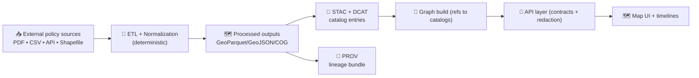

# 🌦️ Climate Policy Mappings (External)  
`data/external/mappings/climate/policies/`


> [!NOTE]  
> This folder stores **mapping specs + documentation** that translate *external climate-policy datasets* into **KFM-ready, provenance-backed artifacts**.  
> 📦 Data files themselves belong in `data/external/raw/…` → `data/external/processed/…` (via ETL). This folder documents **how** that translation happens.

---

## 🎯 What this folder is for

Climate policy data is messy: it’s jurisdictional, time-bounded, amended, and often published in formats that don’t behave like “clean GIS.” This directory exists to:

- 🧭 Define **repeatable mappings** from a policy dataset → **canonical KFM schema** (fields + semantics).
- 🗺️ Specify **geometry rules** (what the boundaries mean, how they’re built/normalized, CRS expectations).
- 🕰️ Capture **time validity** (effective dates, sunset dates, amendment history) in a consistent way.
- 📇 Ensure every policy layer can be published as **STAC/DCAT/PROV boundary artifacts** (discoverable + auditable).
- ⚖️ Encode **governance + access classification** decisions for policy layers and their derivatives.

---

## 🚫 What does *not* belong here

- ❌ Raw PDFs, shapefiles, spreadsheets, or scraped HTML dumps  
  → put those in `data/external/raw/climate/policies/...`
- ❌ Final outputs (GeoParquet/GeoJSON/COG)  
  → those are `data/external/processed/climate/policies/...`
- ❌ Opinionated legal interpretation / “what the law means”  
  → policy layers should stay **descriptive**, not advisory
- ❌ One-off manual edits without provenance  
  → mapping changes must be reproducible

---

## 🗂️ Suggested directory layout

This directory is designed to scale across many policy datasets and versions.

```text
data/external/mappings/climate/policies/
├── 📄 README.md                        # you are here 🙂
├── 📄 dataset_registry.yml             # optional: index of all policy datasets in this module
├── 📁 templates/                       # starter templates for new mappings
│   ├── 📄 mapping.template.yml
│   ├── 📄 fields.template.csv
│   └── 📄 notes.template.md
└── 📁 datasets/
    └── 📁 <dataset_slug>/              # one per dataset (or per dataset+publisher)
        ├── 📄 source.yml               # where it came from + license + update cadence
        ├── 📄 mapping.yml              # field + semantic mapping into KFM canonical model
        ├── 📄 fields.csv               # source→target field crosswalk (machine-friendly)
        ├── 📄 geometry.md              # geometry meaning, dissolves,️, joins, QA rules
        ├── 📄 temporal.md              # effective/valid/transaction time rules
        ├── 📄 governance.md            # classification + redaction requirements
        └── 📄 notes.md                 # assumptions, quirks, gotchas, edge cases
```

> [!TIP]  
> If you don’t need all files, start with **`source.yml` + `mapping.yml` + `fields.csv` + `notes.md`** and expand when the dataset gets complex.

---

## 🧩 Mapping contract (what every dataset mapping should contain)

### 1) 📌 Source + licensing (`source.yml`)
Capture the “map behind the map”:

- dataset title + publisher/agency
- original access URL(s) / identifiers
- license + attribution requirements
- update cadence (static / annual / monthly / ad hoc)
- geographic coverage (Kansas-only? multi-state? national?)
- primary format (vector/raster/table/text) and how it’s obtained

### 2) 🧾 Field crosswalk (`fields.csv`)
A minimal machine-friendly table:

| source_field | target_field | type | transform | notes |
|---|---|---:|---|---|
| `program` | `policy_program` | string | normalize_case | official program name |
| `start_dt` | `effective_start` | date | parse_iso | dataset uses yyyy-mm-dd |
| `end_dt` | `effective_end` | date | parse_iso_or_null | null = still active |

### 3) 🧠 Semantic mapping (`mapping.yml`)
Explain meaning beyond the crosswalk:

- controlled vocabularies (policy_type, instrument_type, sector)
- jurisdiction rules (state/county/city/tribal/federal)
- “what does the geometry represent” (legal jurisdiction vs administrative boundary vs service area)

### 4) 🗺️ Geometry rules (`geometry.md`)
Policy layers often need clarification:

- geometry type: polygon / multipolygon / line / point / raster mask  
- how boundaries are built: dissolve by jurisdiction, union by program, clip to Kansas
- CRS requirements and reprojection decisions
- edge-case handling: overlaps, holes, slivers, invalid geometries

### 5) 🕰️ Temporal rules (`temporal.md`)
Policy data is **time-oriented** and often **bi-temporal** in practice (valid time vs publication/update time).

Minimum fields to standardize:

- `enacted_date` (if available)
- `effective_start` / `effective_end` (policy validity)
- `last_verified` (when *we* confirmed the dataset)
- `source_last_updated` (if publisher provides)

### 6) ⚖️ Governance (`governance.md`)
Even policy datasets can contain sensitive context (e.g., program locations tied to vulnerable infrastructure).

Include:

- access classification (Public / Internal / Restricted)
- redaction/generalization rules (if any)
- allowed uses + disallowed uses
- owner/steward contacts (internal roles)

---

## 🌐 How mappings relate to STAC / DCAT / PROV

Mappings in this folder support creation of “boundary artifacts” in canonical catalog locations:

- 🧭 **STAC**: spatial/temporal indexing for assets (collections + items)
- 🗃️ **DCAT**: discoverability (dataset-level description + distributions)
- 🔎 **PROV**: lineage chain (inputs → transformations → outputs + agents)

> [!IMPORTANT]  
> In KFM, **published datasets must be provenance-backed** before they can be used downstream (graph/API/UI/story layers).  
> Mapping docs help keep this deterministic, reviewable, and repeatable.

---

## 🔁 Pipeline snapshot (why we’re strict about this)



---

## ✅ Definition of Done for a new policy mapping

A mapping PR is “done” when:

- ✅ Dataset has a clear `source.yml` with license + attribution
- ✅ Field crosswalk exists (`fields.csv`) and is understandable
- ✅ Time semantics are explicit (even if “unknown” is the answer)
- ✅ Geometry meaning is documented (what does the polygon *mean*?)
- ✅ Governance is explicit (classification + any required redaction)
- ✅ Notes capture assumptions + known limitations
- ✅ Mapping is reproducible (no mystery manual steps)

---

## 🧪 Validation checklist (human + automated)

### Human review (fast)
- 🔍 Does the mapping **match the real-world meaning** of the policy?
- 🧾 Are **citations and attribution** clearly specified?
- 🕰️ Are effective dates consistent (no impossible ranges)?
- 🗺️ Are boundaries plausible (no huge gaps/overlaps without explanation)?

### Automated gates (recommended)
- ✅ Schema validation for STAC/DCAT/PROV outputs
- ✅ Link/reference checks (no dead internal links)
- ✅ Geometry QA: validity, winding, SRID, area thresholds
- ✅ Classification propagation checks (no “downgrading” outputs)

---

## 🧰 Quickstart: add a new dataset mapping

1) Create a folder:
```bash
mkdir -p data/external/mappings/climate/policies/datasets/<dataset_slug>
```

2) Add the minimum files:
- `source.yml`
- `mapping.yml`
- `fields.csv`
- `notes.md`

3) If the dataset is time-heavy or legally subtle:
- add `temporal.md` and `geometry.md`

4) Open a PR with:
- dataset description
- why it matters (use cases)
- what changed
- any governance flags (classification / redaction)

---

## 📚 Related KFM standards & docs (repo links)

- 📐 `docs/standards/` — STAC/DCAT/PROV profiles + governance standards  
- 🧭 `docs/governance/` — ethics, sovereignty, review gates  
- 🧪 `src/pipelines/` — ETL jobs that should implement these mappings  
- 🗺️ `data/stac/` + `data/catalog/dcat/` + `data/prov/` — published boundary artifacts

---

## 🧠 Mini glossary (policy mapping terms)

- **Jurisdiction**: the governing unit (state/county/city/tribal/federal) that the policy applies to
- **Instrument**: the policy mechanism (incentive, regulation, mandate, cap, subsidy, standard)
- **Valid time**: when the policy is actually in force
- **Transaction time**: when the dataset was published/updated/ingested

---

## 🧩 Future upgrades (nice-to-have)

- 🧠 Add an ontology-backed `policy_type` vocabulary shared across domains
- 🕰️ Add bitemporal indexing support in catalogs for “as-of” queries
- 🔎 Add a lint rule that blocks mappings missing license/attribution
- 🧯 Add a “sensitivity scanner” for policy layers tied to protected locations

