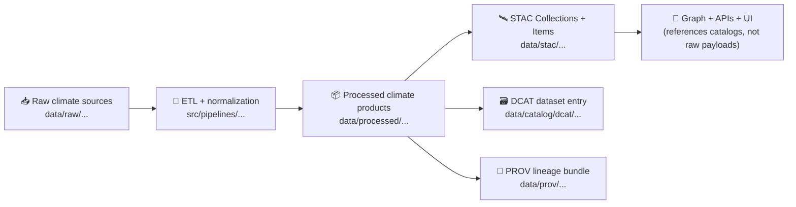

# 🌦️ Climate STAC Mappings (External) — `data/external/mappings/climate/stac/`


> [!IMPORTANT]
> **This folder is a mapping / authoring zone.**  
> The **canonical, published** STAC JSON records belong in:
> - `data/stac/collections/` ✅
> - `data/stac/items/` ✅  
> This directory exists to keep the *“how we map climate sources into STAC”* explicit, reviewable, and repeatable.

---

## 🎯 Why this exists

Climate layers (precipitation, temperature, drought index, etc.) are *time-oriented* and often used for:
- **timeline filtering** (year/season/month/day)
- **region-of-interest queries** (county / watershed / user-drawn box)
- **comparison views** (e.g., “compare 1930s vs 2010s”)
- **story evidence** (tying climate signals to historical events)

To keep KFM evidence-first, every climate dataset must be:
- **published as STAC** (spatial/temporal asset metadata),
- **discoverable in DCAT** (dataset/distribution-level catalog),
- **traceable in PROV** (lineage: raw → work → processed). 🧾

---

## 🧭 Where this sits in the KFM pipeline



---

## 🗂️ Suggested layout inside this folder

This folder is intentionally **documentation-first**. Keep it small, readable, and review-friendly.

```text
data/external/mappings/climate/stac/
├── README.md
├── 📁 templates/                      # JSON skeletons / “golden examples”
│   ├── collection.template.json
│   ├── item.raster.template.json
│   ├── item.timeseries.template.json
│   └── assets.media-types.md
├── 📁 sources/                        # one folder per upstream provider/source
│   ├── <source_slug>/
│   │   ├── mapping.md                 # field mapping notes (source → STAC)
│   │   ├── keywords.yml               # controlled tags (optional)
│   │   ├── licenses.md                # license + attribution notes
│   │   └── examples/                  # example generated STAC JSONs (optional)
│   └── ...
└── 📁 qa/
    ├── validation-checklist.md
    └── known-issues.md
```

> [!TIP]
> If you do keep example JSONs here, treat them as **documentation samples**.  
> The “source of truth” JSON that downstream systems load should still live in `data/stac/...`.

---

## ✅ Definition of Done (for a new climate dataset)

A climate dataset is “publishable” in KFM only when it has **all boundary artifacts**:

| Artifact | What it’s for | Canonical location |
|---|---|---|
| 🛰️ STAC **Collection** | dataset-level metadata (extent, license, providers, keywords) | `data/stac/collections/` |
| 🛰️ STAC **Item(s)** | asset-level metadata (bbox/geometry, datetime/range, asset links) | `data/stac/items/` |
| 🗃️ **DCAT** Dataset entry | discovery layer (title/desc/license/distributions → STAC/data) | `data/catalog/dcat/` |
| 🧬 **PROV** bundle | lineage + reproducibility (inputs, steps, agents, params, run IDs) | `data/prov/` |

---

## 🧩 Mapping rules (climate-specific)

### 1) Time semantics: observation time vs publish time ⏱️
Climate sources often have:
- **Observation time**: when the phenomenon occurred (what users filter on)
- **Release/ingestion time**: when the provider published it / when KFM processed it

**STAC `datetime` / `start_datetime` / `end_datetime` must represent observation time** (the “data’s internal time”).  
Use `created`, `updated`, or a PROV activity timestamp to reflect ingestion/reprocessing.

---

### 2) Spatial semantics: Kansas-first, but not Kansas-only 🗺️
Common patterns:
- **Global/CONUS grids**: keep full extent, but ensure Kansas ROI queries remain fast via tiling/COGs/Zarr.
- **Kansas subset products**: publish as their own Items (explicitly noted as derived) and link PROV back to source.

---

### 3) Asset conventions 📦
Use consistent asset keys so the UI and pipelines don’t need custom cases.

Recommended keys:
- `data`: the primary data asset (COG / GeoParquet / Zarr / NetCDF)
- `preview`: quicklook (PNG, small COG)
- `metadata`: original provider metadata, README, or citation file
- `qa`: QA artifact (validation report, checksums, coverage stats)

Media type guidance (examples):
- COG GeoTIFF → `image/tiff; application=geotiff; profile=cloud-optimized`
- GeoParquet → `application/vnd.apache.parquet`
- NetCDF → `application/x-netcdf`
- Zarr → `application/vnd+zarr` (or documented project choice)

> [!NOTE]
> If you’re unsure, document the choice in `templates/assets.media-types.md` and keep it consistent.

---

## 🏷️ ID + naming conventions

### Collection IDs
**Stable, source-oriented**:
- `external-climate-<source_slug>-<dataset_slug>`

Example:
- `external-climate-noaa-daily-precip`

### Item IDs
**Deterministic and sortable**:
- `external-climate-<source_slug>-<dataset_slug>__<time_token>__<spatial_token>`

Examples:
- `external-climate-noaa-daily-precip__1936-06-01__ks`
- `external-climate-prism-monthly-tmean__2012-07__conus`

> [!TIP]
> If Items are per-tile or per-zone, encode the tile key (e.g., `h3`, `quadkey`, `utm`) consistently.

---

## 🧬 Versioning + revisions

When data is reprocessed (new algorithm, bugfix, new raw drop):
- publish a **new dataset version**
- link it to the previous version via DCAT + PROV (revision chain)
- avoid silently overwriting versioned outputs unless the governance policy says otherwise

Suggested pattern:
- `v1`, `v2`, `v3` in dataset title/metadata
- PROV activity includes `run_id` + `commit_hash`
- DCAT includes a revision link (`prov:wasRevisionOf`) for continuity

---

## 🛠️ How to add a new climate source (playbook)

### Step 0 — Decide what you’re publishing
Pick one:
- **Raster time slices** (daily/monthly/yearly grids)
- **Station time series** (point observations)
- **Indices** (drought index, anomalies, reanalysis products)
- **Derived KFM evidence artifacts** (models/analysis outputs)

### Step 1 — Create/extend the mapping docs in this folder
Add a new source folder:
- `sources/<source_slug>/mapping.md`
- note: licensing, attribution, units, known caveats, missingness rules

### Step 2 — Produce processed assets in `data/processed/...`
Follow the required staging discipline:
- raw → work → processed  
Keep outputs deterministic, config-driven, and logged.

### Step 3 — Generate STAC (canonical output)
Create:
- a **Collection** JSON for the dataset
- **Item** JSON(s) for each time slice / partition

Ensure each STAC Item’s `assets.*.href` points at:
- `data/processed/**` **or** stable external storage (with checksums + provenance)

### Step 4 — Add DCAT + PROV boundary artifacts
- DCAT entry includes discovery metadata + distribution links (STAC and/or direct download)
- PROV bundle captures:
  - inputs (raw)
  - processing activity (script + parameters)
  - agents (human + software)
  - timestamps, run id, commit hash

### Step 5 — Validate
Minimum checks:
- JSON is valid
- STAC schema validates
- bbox/geometry valid + consistent with assets
- temporal extent correct
- license/provider present
- links are resolvable (or resolvable in the deployment environment)

---

## 🧪 Example: minimal STAC Item (raster time slice)

```json
{
  "type": "Feature",
  "stac_version": "1.0.0",
  "id": "external-climate-noaa-daily-precip__1936-06-01__ks",
  "collection": "external-climate-noaa-daily-precip",
  "geometry": { "type": "Polygon", "coordinates": [[[...]]] },
  "bbox": [-102.05, 36.99, -94.59, 40.00],
  "properties": {
    "datetime": "1936-06-01T00:00:00Z",
    "title": "Daily precipitation — Kansas — 1936-06-01",
    "license": "CC-BY-4.0",
    "providers": [
      { "name": "<provider>", "roles": ["producer"] },
      { "name": "Kansas Frontier Matrix", "roles": ["processor", "host"] }
    ],
    "kfm:units": "mm",
    "kfm:variable": "precipitation"
  },
  "assets": {
    "data": {
      "href": "../../processed/climate/noaa/daily_precip/1936/06/01/ks_precip_1936-06-01.tif",
      "type": "image/tiff; application=geotiff; profile=cloud-optimized",
      "roles": ["data"]
    },
    "qa": {
      "href": "../../prov/external-climate-noaa-daily-precip__1936-06-01__ks.prov.json",
      "type": "application/json",
      "roles": ["metadata"]
    }
  },
  "links": [
    { "rel": "collection", "href": "../../stac/collections/external-climate-noaa-daily-precip.json", "type": "application/json" }
  ]
}
```

> [!NOTE]
> `kfm:*` fields above are illustrative — align actual custom fields with the repo’s STAC profile + schemas.

---

## 🔍 QA checklist (quick)

- [ ] **License** set (and matches upstream terms)
- [ ] **Attribution** captured (provider + citation)
- [ ] **Temporal correctness** (observation time in STAC; processing time in PROV)
- [ ] **Spatial correctness** (valid geometry + bbox; CRS documented if not EPSG:4326)
- [ ] **Asset integrity** (checksums, sizes if available, stable hrefs)
- [ ] **Cross-links** (STAC ↔ DCAT ↔ PROV consistent)
- [ ] **Versioning** (revisions linked; no silent overwrite)
- [ ] **Units** explicit (mm, °C, index units, etc.)
- [ ] **Missingness rules** documented (nodata, gaps, station moves)

---

## 🔗 Related KFM docs (repo paths)

- `docs/MASTER_GUIDE_v13.md` 📘
- `docs/standards/KFM_STAC_PROFILE.md` 🛰️
- `docs/standards/KFM_DCAT_PROFILE.md` 🗃️
- `docs/standards/KFM_PROV_PROFILE.md` 🧬
- `schemas/stac/` ✅
- `data/stac/` (published STAC JSON) ✅
- `data/catalog/dcat/` (published DCAT JSON-LD) ✅
- `data/prov/` (published PROV bundles) ✅

---

## 🧑‍⚖️ Governance notes (don’t skip)

- Climate datasets must be **FAIR** (findable, accessible, interoperable, reusable) and **evidence-traceable**.
- If any dataset includes **restricted** or **sensitive** information (rare for climate, but possible with station metadata), route it through governance review and ensure the API layer can enforce classification/redaction.

---

## 📌 TODOs for this folder (recommended)

- [ ] Add `templates/collection.template.json`
- [ ] Add `templates/item.raster.template.json`
- [ ] Add `templates/item.timeseries.template.json`
- [ ] Add `qa/validation-checklist.md`
- [ ] Add `sources/<source_slug>/mapping.md` for each upstream climate provider

