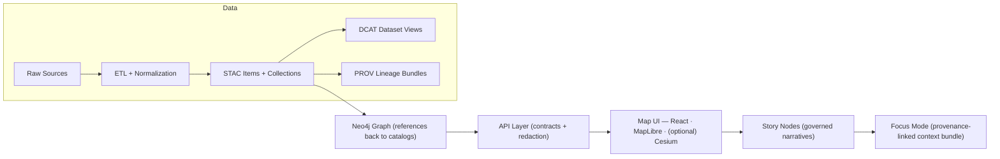

# 🗺️ Historical Mapping Source — `{{source_name}}` (`{{source_slug}}`)


> 🎯 **Purpose:** This folder documents + configures **how** the external historical map source `{{source_slug}}` is *normalized into KFM’s governed pipeline* (ETL → STAC/DCAT/PROV → Graph → API → UI → Story Nodes).  
> 🧠 Think of this as the **“mapping contract”** for a source — *not the source data itself*.

---

## ✅ Source Card (fill this in)

| Field | Value |
|---|---|
| **Source Name** | `{{source_name}}` |
| **Source Slug** | `{{source_slug}}` |
| **Provider / Publisher** | `{{publisher}}` |
| **Upstream URL / Catalog** | `{{source_url}}` |
| **Access Method** | `download` \| `WMS/WMTS` \| `tile service` \| `API` \| `manual scan` |
| **License** | `{{license}}` (include link + constraints) |
| **Attribution String** | `{{required_attribution}}` |
| **Spatial Coverage** | `{{bbox_or_region}}` |
| **Temporal Coverage** | `{{time_start}}` → `{{time_end}}` *(depicted time; not ingest time)* |
| **Data Types** | `raster` (scans/imagery) \| `vector` (boundaries/routes) \| `mixed` |
| **Native CRS** | `{{native_crs}}` |
| **KFM Target CRS** | `{{kfm_target_crs}}` (e.g., EPSG:4326 / EPSG:3857 / local) |
| **Update Cadence** | `static` \| `rare` \| `periodic` (how often upstream changes) |
| **Sensitivity / Governance** | `public` \| `restricted` \| `sensitive` (+ why) |
| **Domain Steward** | `@{{owner_handle}}` |

---

## 📦 Where the bytes go (KFM staging + catalogs)

Even though this is an **external mapping** folder, KFM still stages and publishes artifacts using the canonical layout:

- 📥 **Raw** (read-only copies / downloads / original scans)  
  `data/raw/historical/{{source_slug}}/`

- 🧪 **Work** (intermediate georeferencing, OCR, warps, temporary vectors)  
  `data/work/historical/{{source_slug}}/`

- ✅ **Processed** (final deliverables for serving + analysis)  
  `data/processed/historical/{{source_slug}}/`

- 🌐 **STAC** (assets index: Collections + Items)  
  `data/stac/collections/` + `data/stac/items/`

- 🧾 **DCAT** (dataset discovery entry)  
  `data/catalog/dcat/`

- 🧬 **PROV** (lineage bundle: raw → work → processed)  
  `data/prov/`

- 🧊 **External cache** (optional; for on-demand pulls or adapter results)  
  `data/processed/external_cache/{{source_slug}}/` *(dated + parameterized; provenance included)*

> 🧷 **Rule of thumb:**  
> This folder (`data/external/mappings/historical/{{source_slug}}/`) defines **how to interpret + normalize** the source.  
> The other locations contain **the actual files + published metadata artifacts**.

---

## 🧭 Canonical pipeline (non‑negotiable)



🔒 **Hard gates:**
- ✅ **Catalogs before graph/UI** (publish STAC/DCAT/PROV first)
- ✅ **Deterministic + idempotent ETL**
- ✅ **No output can be less restricted than its inputs**
- ✅ **UI never queries the graph directly** (API boundary rule)

---

## 🧩 What lives in this folder

Recommended layout (keep it small, config-driven, reviewable):

```text
📁 data/external/mappings/historical/{{source_slug}}/
├── 📄 README.md                          # this runbook
├── 📄 source.yaml                        # source registry card (machine-readable)
├── 📄 license_notes.md                   # any license constraints / attribution text
├── 📄 field_mapping.csv                  # external → KFM canonical fields (if applicable)
├── 📄 stac.collection.template.json      # collection template (optional)
├── 📄 stac.item.template.json            # item template(s) (optional)
├── 📄 dcat.dataset.template.jsonld       # dataset discovery template (optional)
├── 📄 prov.bundle.template.json          # provenance template (optional)
├── 📁 examples/                          # minimal examples + fixtures
│   ├── 📄 example_input.json
│   ├── 📄 example_stac_item.json
│   └── 📄 example_prov.json
└── 📁 tests/                             # validation fixtures (optional)
    └── 📄 expected_hashes.json
```

> 🧠 **Why templates?**  
> They prevent “freehand metadata.” If a new source needs extra fields, we extend the project profiles (STAC/DCAT/PROV) rather than inventing ad-hoc keys.

---

## 🔁 Ingestion & normalization plan (source-specific)

### 1) Acquire 📥
- **Upstream artifacts:** `{{describe_upstream_assets}}`
- **Selection rules:** `{{which_sheets_tiles_regions_are_in_scope}}`
- **Download strategy:** `{{manual|script|api|wms}}`
- **Integrity checks:** checksum + size + MIME sniffing (if available)

✅ Output: raw bytes land in `data/raw/historical/{{source_slug}}/`

---

### 2) Georeference + standardize 🧭
For scanned historical maps, the goal is a consistent, web-friendly output:

- 🎯 **Georeference method:** `GCPs` \| `rubber-sheet` \| `known control points`  
- 🗺️ **Warp / reproject into:** `{{kfm_target_crs}}`
- 🧊 **Raster final format:** Cloud-Optimized GeoTIFF (COG)
- 🧩 **Vector final format:** GeoJSON (or GeoPackage for heavy layers)

✅ Output: intermediates in `data/work/...`, finals in `data/processed/...`

---

### 3) Derivatives (optional) 🧪
Pick only what the UI / analysis needs:

- 🧱 Tiles (XYZ / PMTiles / MBTiles) for fast map rendering
- 🖼️ Thumbnails + browse images
- 🧾 OCR text extraction + place-name candidates (if map has labels)
- 🧠 AI-derived evidence artifacts (must be cataloged + provenanced like any dataset)

---

### 4) Publish catalogs 🗂️
Minimum publish set for this source:

- 🛰️ **STAC Collection** for `{{source_slug}}`
- 🧩 **STAC Item(s)** for each asset (sheet, tile set, vector layer)
- 🧾 **DCAT Dataset** entry (discovery + distribution links)
- 🧬 **PROV bundle** (raw → work → processed, including parameters + software)

---

### 5) Graph / API / UI wiring 🔌
- Graph stores **references** (STAC IDs, stable identifiers), not full payloads.
- API is the governance enforcement point (classification, redaction, contracts).
- UI consumes only API outputs + catalog links.

---

## 🧾 Metadata requirements (STAC/DCAT/PROV)

### STAC (asset-level truth 🛰️)
Every published asset should have:
- Spatial footprint + bbox
- Temporal coverage (depicted date or interval)
- License + attribution
- Clear `href` to processed deliverables
- Link back to upstream identifiers (scan ID, catalog ID, shelfmark, etc.)

### DCAT (dataset discovery 🧾)
The DCAT record should:
- Describe the dataset in human terms (who/what/where/when/why)
- Include distributions linking to:
  - STAC collection/catalog
  - download endpoints (if any)
  - documentation/runbook (this README)

### PROV (how it was made 🧬)
The PROV bundle must capture:
- **Entities:** raw files, work artifacts, processed outputs
- **Activities:** georeference, warp, tile build, OCR, vectorization, etc.
- **Agents:** person(s), pipeline script, CI runner
- **Parameters:** CRS target, resampling, GCP set, thresholds
- **Repro anchors:** commit hash + config checksum (when possible)

---

## 🕰️ Temporal semantics (important for “historical”)

Historical sources often have *multiple “times”*:

- 🗺️ **Depicted time:** the year/date the map represents (goes into STAC `datetime` or `start/end_datetime`)
- 🖨️ **Publication/print time:** when the map was produced/printed (store as a property)
- 🧪 **Ingest/run time:** when KFM processed it (store in PROV + pipeline logs)
- ♻️ **Dataset version time:** when we reprocessed or corrected it (DCAT/PROV revisions)

> ✅ Keep these distinct so timelines don’t lie.

---

## 🧪 QA & validation checklist

### Geospatial correctness 🧭
- [ ] CRS is explicit and correct (native + target)
- [ ] Georeference residuals documented (if using GCPs)
- [ ] No “mystery shifts” (spot-check known landmarks)
- [ ] Nodata/alpha behaves as expected (no black boxes)
- [ ] Overviews/pyramids exist for rasters (if COG)

### Catalog integrity 🗂️
- [ ] STAC validates against KFM profile
- [ ] DCAT validates against KFM profile
- [ ] PROV references raw → work → processed chain completely
- [ ] Cross-links exist (DCAT ↔ STAC, PROV ↔ outputs)
- [ ] License + attribution present on every published asset

### Governance & safety ⚖️
- [ ] No sensitive sites exposed without review (archaeological, sacred, restricted)
- [ ] Classification propagated (outputs never “less restricted” than inputs)
- [ ] Terms-of-use respected (no prohibited redistribution)

---

## ⚖️ Licensing, attribution, and governance

### Attribution 🏷️
Put the **exact attribution string** required by the upstream provider here:

> `{{required_attribution}}`

Also note any “must display” logo/credit requirements: `{{logo_or_credit_requirements}}`

### Usage constraints 🚧
- Redistribution allowed? `{{yes/no/conditional}}`
- Derivatives allowed? `{{yes/no/conditional}}`
- Commercial use allowed? `{{yes/no/conditional}}`
- Share-alike / copyleft? `{{yes/no}}`

### Governance review triggers 🔔
This source **must** be governance-reviewed if it involves:
- restricted access terms,
- culturally sensitive/CARE-related content,
- precise locations of protected sites.

---

## 🔐 Secrets & access (if this source uses an API)

- ✅ Use `.env` / secret manager for keys (never commit secrets)
- ✅ Document rate limits + caching rules
- ✅ Store cached results (if enabled) in `data/processed/external_cache/{{source_slug}}/` with:
  - date
  - parameters
  - provenance metadata
  - attribution

---

## 🧰 Suggested commands (examples — adapt to actual tooling)

```bash
# 1) Validate mapping config (schemas, required fields, templates)
make validate-source SOURCE={{source_slug}}

# 2) Fetch/download raw assets (if automated)
make fetch SOURCE={{source_slug}}

# 3) Run normalization (georeference/warp/COG + vectors)
make normalize SOURCE={{source_slug}}

# 4) Publish catalogs (STAC/DCAT/PROV) + run validators
make publish SOURCE={{source_slug}}

# 5) (Optional) Register with graph + rebuild API indexes
make graph-load SOURCE={{source_slug}}
make api-reindex
```

> ✅ If your project uses a single orchestrator script instead of `make`, mirror the stages above and keep the stage names consistent.

---

## 🗒️ Known issues / TODO

- [ ] `{{todo_1}}`
- [ ] `{{todo_2}}`
- [ ] `{{todo_3}}`

---

## 🧾 Changelog

- **{{YYYY-MM-DD}}** — Created source mapping folder; initial templates.  
- **{{YYYY-MM-DD}}** — Added first STAC/DCAT/PROV outputs; validated in CI.  
- **{{YYYY-MM-DD}}** — {{change_summary}}.

---

## 🤝 Ownership & contact

- **Domain steward:** `@{{owner_handle}}`
- **Data engineering:** `@{{data_engineer}}`
- **Governance reviewer:** `@{{governance_reviewer}}`

> 🧭 For project-wide rules, see: `../../../../../docs/MASTER_GUIDE_v13.md` (repo root relative path).

