# 🗺️ Historical External Mapping Manifests (KFM)


> [!NOTE]
> This directory is **text-first** by design ✅  
> It holds **manifests + mapping docs** that describe *external* historical mapping sources and how they flow into KFM—**not** the bulky map files themselves.

---

## 📌 What lives here?

This folder is the “**map behind the map**” layer for **historical** sources:
- 🧾 **Source manifests**: where the data came from, licensing, access method, checksums, expected artifacts.
- 🧭 **Schema & field mappings**: how attributes map into KFM’s canonical fields (names, dates, geometry, provenance hooks).
- 🧱 **Georeferencing run logs**: how a scanned historical map was rectified (GCPs, residuals, CRS, warp method).
- 🧪 **Validation notes**: what was checked, what failed, and what remains uncertain.

If you’re looking for:
- 📥 raw downloads / scans → `../../../../data/raw/historical/`
- 🧰 intermediate artifacts → `../../../../data/work/historical/`
- ✅ final, load-ready outputs → `../../../../data/processed/historical/`
- 🗂️ published metadata → `../../../../data/stac/`, `../../../../data/catalog/dcat/`, `../../../../data/prov/`

---

## 🔁 Canonical KFM flow (why these mappings matter)

KFM is built so that **no dataset becomes “real” until it has lineage + catalog records**. These mapping docs exist to make that repeatable and reviewable.

```mermaid
flowchart LR
  A[🌐 External Historical Source] --> B[🧾 Manifest + Mapping Docs]
  B --> C[⚙️ Deterministic ETL Pipeline]
  C --> D[✅ data/processed/historical/*]
  D --> E[🗂️ STAC + DCAT + PROV Boundary Artifacts]
  E --> F[🧠 Graph / API Layer]
  F --> G[🗺️ Map UI + 🧾 Story Nodes]
```



---

## 🧰 Recommended layout in this folder

```text
📁 data/external/mappings/historical/
├── 📄 README.md
├── 📁 templates/
│   ├── 📄 source_manifest.template.yml
│   ├── 📄 dataset_mapping.template.yml
│   └── 📄 georeference_log.template.md
└── 📁 <source_slug>/                       # one folder per external source
    ├── 📄 manifest.yml                      # where to fetch + license + checksums
    ├── 📄 mapping.yml                       # how fields map into KFM canonical schema
    ├── 📄 georeference.md                   # only if raster scans are rectified
    ├── 📄 assets.csv                        # optional: file list, years, sheet ids, urls, checksums
    └── 📄 notes.md                          # optional: messy realities, edge cases, citations
```

> [!TIP]
> Keep “external” **lightweight**: prefer manifests, checksums, and URLs over committing large rasters.  
> If you *must* store large binaries, use the repo’s large-file strategy (e.g., pointers/LFS) and document it clearly. 📦

---

## ✅ Adding a new historical source (checklist)

1. **Create a new folder**:
   - `data/external/mappings/historical/<source_slug>/`

2. **Add a manifest**:  
   - `manifest.yml` (where it lives, how we fetch it, licensing/terms, checksums)

3. **Add a mapping**:  
   - `mapping.yml` (how raw fields become KFM canonical fields + which pipeline consumes it)

4. **If scanned raster maps:** add `georeference.md`  
   - record GCPs approach, RMS error, CRS, resampling method, and output plan.

5. **Wire to a deterministic pipeline**:
   - Pipeline code typically lives in `../../../../src/pipelines/…`
   - Pipelines must be **non-interactive** and **re-runnable** (same inputs → same outputs).

6. **Publish boundary artifacts**:
   - STAC item/collection (spatiotemporal discovery) 🗂️
   - DCAT dataset entry (catalog view) 🧾
   - PROV lineage (how we produced it) 🔗

7. **Open a PR**:
   - reviewers should be able to answer: *“Where did this come from? What changed? Can I reproduce it?”* 🧠

---

## 🧾 Manifest spec (minimal but strict)

Create `manifest.yml` using this baseline:

```yaml
id: "historical.<source_slug>"
title: "Human-readable dataset title"
description: "What it is, why it matters, and what it covers (Kansas-relevant scope)."
provider:
  name: "Institution / archive / agency"
  homepage: "https://example.org"
license:
  spdx: "CC-BY-4.0"         # or "NONE" if unclear (but then add notes + restrictions)
  text: "Short human summary of reuse terms"
access:
  type: "download|api|wms|wmts|manual_request|onsite_only"
  url: "https://example.org/download"
  auth: "none|api_key|oauth|unknown"
  notes: "Rate limits, request steps, archival quirks"
temporal:
  coverage: ["1854-01-01", "1900-12-31"]    # coverage period
  map_dates_field: "publication_year"       # if a per-sheet date exists
spatial:
  bbox_wgs84: [-102.05, 36.99, -94.59, 40.00]  # Kansas bbox default; tighten per dataset if known
  crs_raw: "unknown|EPSG:xxxx"
artifacts:
  expected_raw:
    - type: "raster_scan|vector|table|tile_index"
      format: "tif|jpg|pdf|shp|geojson|csv"
  expected_processed:
    - type: "cog"        # Cloud-Optimized GeoTIFF
      format: "tif"
    - type: "geojson"
      format: "geojson"
pipelines:
  primary: "src/pipelines/historical/<pipeline_name>.py"
  params:
    default_output_crs: "EPSG:4326"
integrity:
  checksum_type: "sha256"
  checksums_file: "assets.csv"              # optional but encouraged
provenance:
  citation_bib: "notes.md#citations"        # anchor or file reference
  prov_template: "data/prov/templates/<template>.json"
```

---

## 🧩 Dataset mapping spec (field-level mapping)

Create `mapping.yml` to document how raw fields become canonical fields.

```yaml
dataset: "historical.<source_slug>"
geometry:
  type: "raster|vector"
  expected_geom: "Polygon|LineString|Point|Raster"
  output_crs: "EPSG:4326"
fields:
  - raw: "NAME"
    canonical: "feature_name"
    type: "string"
    rules: ["trim", "title_case"]
  - raw: "DATE"
    canonical: "event_date"
    type: "date"
    rules: ["parse_year_if_needed"]
  - raw: "SOURCE"
    canonical: "source_ref"
    type: "string"
temporal_model:
  note: "Track BOTH map publication date and represented time if they differ."
joins:
  - name: "gazetteer_link"
    key: "feature_name"
    method: "fuzzy"
qa:
  required:
    - "valid_geometry"
    - "non_empty_required_fields"
    - "temporal_range_present"
  optional:
    - "topology_checks"
    - "duplicate_detection"
outputs:
  processed_paths:
    - "data/processed/historical/<source_slug>/<dataset>__v1.geojson"
  metadata_paths:
    stac_item: "data/stac/items/historical/<dataset>.json"
    dcat: "data/catalog/dcat/<dataset>.jsonld"
    prov: "data/prov/<dataset>__v1.prov.json"
```

---

## 🧭 Georeferencing run log (for scanned maps)

If you rectify rasters, create `georeference.md`:

```md
# 🧭 Georeferencing Log — <source_slug>

## Source
- Scan filename(s):
- Archive / call number:
- Original map year (printed):
- Region / sheet name:
- Notes on scan quality (folds, warping, stains):

## Target spatial reference
- Target CRS: EPSG:4326 (WGS84) or: __________
- Reference layer used (modern basemap / control layer):
- GCP strategy:
  - Count:
  - Feature types used (road intersections, river confluences, section corners, etc.)
  - Distribution (even coverage? clustered?)

## Transformation
- Method: affine / polynomial / thin-plate spline / projective
- Resampling: nearest / bilinear / cubic
- RMS / residuals:
  - Overall RMS:
  - Worst point residual:
- Known distortions / areas to distrust:

## Outputs
- Output type: COG GeoTIFF
- Output path: data/processed/historical/<source_slug>/<sheet>__cog.tif
- Overviews built: yes/no
- Masking / nodata strategy:

## Review
- Who reviewed:
- Date:
- Open issues:
```

> [!WARNING]
> If georeferencing accuracy is poor, don’t hide it.  
> Record it. Surface it. Bound the claims. 🧯

---

## 📦 Output expectations (KFM-friendly defaults)

To keep downstream usage smooth:
- 🖼️ **Rasters** → prefer **COGs** (`.tif`) for web/tiling performance.
- 🧬 **Vectors** → prefer **GeoJSON** for portability; optionally keep source shapefiles in raw.
- 🌍 **Google Earth / outreach** → optional exports to **KML/KMZ** where helpful.
- 🧱 **Tiles** → generated artifacts belong downstream (typically derived from processed COGs/vectors).

> [!NOTE]
> Final delivery often targets **EPSG:4326** for web mapping and cross-tool interoperability.
> It’s fine (often preferable) to do intermediate work in a local projected CRS—just document it and convert deterministically.

---

## 🧪 Quality gates (pre-PR)

Before submitting changes, confirm:

- [ ] ✅ License is explicit (or restrictions are clearly documented)
- [ ] ✅ Source URL / archive reference is present
- [ ] ✅ Checksums exist for downloaded artifacts (or a reason why not)
- [ ] ✅ Output CRS is stated (and correct)
- [ ] ✅ Geometry validity checks pass (for vector)
- [ ] ✅ Temporal coverage is represented (even if approximate)
- [ ] ✅ STAC/DCAT/PROV records exist for anything in `data/processed/…`
- [ ] ✅ Pipeline is non-interactive + reproducible
- [ ] ✅ Any uncertainty is documented in `notes.md` (not buried in chat logs 😅)

---

## 🧑‍⚖️ Licensing, ethics, sovereignty

KFM is **provenance-first** and **community-accountable**:
- 🧾 Never ingest “mystery data.” If you can’t trace it, it doesn’t ship.
- 🤝 For culturally sensitive materials (especially Indigenous/tribal data), document access constraints and community governance expectations.
- 🧠 Prefer transparency over completeness.

---

## 🔗 Related project docs (start here)

- 📚 Repo overview: `../../../../README.md`
- 🧭 Canonical pipeline + structure: `../../../../docs/MASTER_GUIDE_v13.md`
- 🧾 Metadata profiles:
  - `../../../../docs/standards/KFM_STAC_PROFILE.md`
  - `../../../../docs/standards/KFM_DCAT_PROFILE.md`
  - `../../../../docs/standards/KFM_PROV_PROFILE.md`
- 🧱 Pipelines: `../../../../src/pipelines/`
- 🧪 Experiments / methods: `../../../../mcp/`

---

## ❓FAQ

**Q: Can I just drop a GeoTIFF somewhere and point the UI at it?**  
A: 🚫 Not in KFM. Data must move through the pipeline and publish catalogs + provenance first.

**Q: Where do I put big scans?**  
A: Prefer external storage + checksums + a deterministic fetch step. If using LFS/pointers, document it in `manifest.yml` and `notes.md`.

**Q: What if the map has no date?**  
A: Use best-available approximation, record your reasoning, and mark uncertainty explicitly in metadata + notes.

---

🧭 *If this README feels “strict”… good. That’s the point. A historical atlas is only as trustworthy as its evidence trail.* ✅

