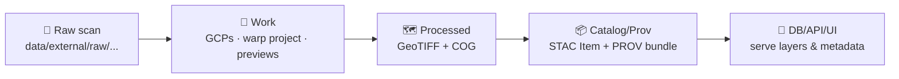

# 🧭 Georeference Log (Template)

> [!IMPORTANT]
> **Copy this file** to create a new log, then change:
> - `id`, `title`, `status`, `owners`, and all `{{placeholders}}`
> - input/output paths + checksums
> - GCP table + QC metrics  
> Keep this log **next to the mapping docs** so provenance stays “near the data.” 🧾🗺️

---

## 📁 Suggested placement & naming

```text
📁 data/
└─ 📁 external/
   ├─ 📁 raw/
   │  └─ 🏛️ historical/
   │     └─ 📁 {{map_slug}}/                          🧾 raw map snapshot (unaltered)
   │        └─ 🖼️ {{filename}}.tif                     📦 original scan (TIFF)
   ├─ 📁 work/
   │  └─ 🏛️ historical/
   │     └─ 📁 {{map_slug}}/                          🧪 georeferencing workspace (scratch + rebuildable)
   │        ├─ 📄 {{map_slug}}.points                 📍 GCPs/control points (QGIS/PROJ format)
   │        ├─ 🖼️ preview_overlay.png                 👀 quick visual check (overlay preview)
   │        └─ 📄 qgis_georef_project.qgz             🧰 QGIS georeferencer project file
   ├─ 📁 processed/
   │  └─ 🏛️ historical/
   │     └─ 📁 {{map_slug}}/                          ✅ authoritative georeferenced outputs (downstream-ready)
   │        ├─ 🗺️ {{map_slug}}__georef.tif             🧭 georeferenced GeoTIFF (working deliverable)
   │        └─ 🧊 {{map_slug}}__georef.cog.tif          🚀 cloud-optimized GeoTIFF (COG) + overviews
   ├─ 📁 catalog/
   │  ├─ 📁 stac/
   │  │  └─ 📁 items/
   │  │     └─ 🏛️ historical/
   │  │        └─ 📄 {{map_slug}}.json                🛰️ STAC Item (assets + bbox + datetime + links)
   │  └─ 📁 prov/
   │     └─ 🏛️ historical/
   │        └─ 📄 {{map_slug}}.json                   🧬 PROV bundle (inputs → activities → outputs)
   └─ 📁 mappings/
      └─ 🏛️ historical/
         ├─ 📁 templates/                              🧱 reusable templates for georef workflows
         │  └─ 📄 georeference_log.template.md          📝 log template (GCPs, CRS, residuals, decisions)
         └─ 📄 {{map_slug}}__mapping.md                🧩 per-map mapping notes (CRS, method, caveats, citations)
```

---

## 🧬 Pipeline context (mental model)



---

## 1) 🗺️ Map source & citation

**Canonical title:** `{{map_title}}`  
**Year/date:** `{{map_year_or_date}}`  
**Creator / Agency:** `{{creator}}`  
**Publisher:** `{{publisher}}`  
**Scale:** `{{scale}}`  
**Sheet/plate:** `{{sheet_or_plate}}`

**Archive / Collection:** `{{archive}}`  
**Catalog ID:** `{{catalog_id}}`  
**Source record URL:** `{{source_url}}`  
**Accessed:** `{{YYYY-MM-DD}}`

**Preferred citation (copy/paste):**
> {{citation_text_here}}

---

## 2) 📜 Rights, license, and restrictions

- **License / Rights statement:** `{{SPDX_OR_TEXT}}`
- **Attribution required?** `{{yes/no}}`
- **Usage constraints:** `{{commercial? derivatives? redistribution?}}`
- **Sensitivity / sovereignty notes:** `{{any_community_or_stewardship_constraints}}`

> [!NOTE]
> If rights are unclear, document the uncertainty + default to tighter usage until verified. 🔒

---

## 3) 🧾 Input scan details

**Input file:** `{{inputs.scan.path}}`  
**Checksum (sha256):** `{{inputs.scan.checksum_sha256}}`  
**Scan DPI:** `{{dpi}}`  
**Bit depth / colorspace:** `{{bit_depth}} / {{color_space}}`  
**Rotation applied:** `{{rotation_deg}}°`

### 🧼 Pre-processing performed
- [ ] Crop margins / remove border
- [ ] Deskew / rotation correction
- [ ] Color balancing / contrast
- [ ] De-speckle / noise reduction
- [ ] Other: `{{...}}`

**Pre-processing notes:**  
{{notes_here}}

---

## 4) 🧭 Target CRS & reference layers

**Target CRS:** `{{EPSG:####}}`  
**Why this CRS?** `{{reason}}`  
**Target resolution (if resampling):** `{{resolution}}`  
**Vertical datum / grid (if relevant):** `{{datum_or_grid}}`

### 🧱 Reference layers used (for GCP + validation)
| Reference layer | Source (path/url) | Version/date | CRS | Notes |
|---|---|---:|---:|---|
| {{layer_name}} | {{path_or_url}} | {{YYYY-MM-DD}} | {{EPSG:####}} | {{why}} |
| {{layer_name}} | {{path_or_url}} | {{YYYY-MM-DD}} | {{EPSG:####}} | {{why}} |

---

## 5) 📍 Ground Control Points (GCPs)

> [!TIP]
> **Prefer stable features** (river confluences, courthouse squares, township corners, rail junctions).  
> Spread GCPs across the full map extent (corners + center) to reduce edge warping. 🧷

### ✅ Minimum GCP sanity check (rule of thumb)
- Affine / Polynomial 1: **≥ 3**
- Polynomial 2: **≥ 6**
- Polynomial 3: **≥ 10**
- Projective: **≥ 4**
- TPS: **≥ 3** *(but use more for stability)*

### 🧾 GCP table (append rows as needed)

| # | Pixel X | Pixel Y | Map X (lon/easting) | Map Y (lat/northing) | CRS (EPSG) | Feature / landmark | Reference layer used | Residual (px) | Residual (map units) | Used? | Notes |
|---:|---:|---:|---:|---:|---:|---|---|---:|---:|:---:|---|
| 1 | {{ }} | {{ }} | {{ }} | {{ }} | {{ }} | {{ }} | {{ }} | {{ }} | {{ }} | ✅ | {{ }} |
| 2 | {{ }} | {{ }} | {{ }} | {{ }} | {{ }} | {{ }} | {{ }} | {{ }} | {{ }} | ✅ | {{ }} |
| 3 | {{ }} | {{ }} | {{ }} | {{ }} | {{ }} | {{ }} | {{ }} | {{ }} | {{ }} | ✅ | {{ }} |
| 4 | {{ }} | {{ }} | {{ }} | {{ }} | {{ }} | {{ }} | {{ }} | {{ }} | {{ }} | ✅ | {{ }} |
| 5 | {{ }} | {{ }} | {{ }} | {{ }} | {{ }} | {{ }} | {{ }} | {{ }} | {{ }} | ✅ | {{ }} |
| 6 | {{ }} | {{ }} | {{ }} | {{ }} | {{ }} | {{ }} | {{ }} | {{ }} | {{ }} | ✅ | {{ }} |
| 7 | {{ }} | {{ }} | {{ }} | {{ }} | {{ }} | {{ }} | {{ }} | {{ }} | {{ }} | ✅ | {{ }} |
| 8 | {{ }} | {{ }} | {{ }} | {{ }} | {{ }} | {{ }} | {{ }} | {{ }} | {{ }} | ✅ | {{ }} |
| 9 | {{ }} | {{ }} | {{ }} | {{ }} | {{ }} | {{ }} | {{ }} | {{ }} | {{ }} | ✅ | {{ }} |
| 10 | {{ }} | {{ }} | {{ }} | {{ }} | {{ }} | {{ }} | {{ }} | {{ }} | {{ }} | ✅ | {{ }} |

<details>
<summary>➕ Optional: GCP strategy notes (click)</summary>

- **If the map has a graticule/grid:** use intersections as high-confidence GCPs.
- **If coastlines/rivers shifted historically:** avoid relying on highly dynamic features unless the map’s intent is historical shoreline alignment.
- **If distortion is strong:** consider TPS, but document the trade-off (visual fit vs metric accuracy).

</details>

---

## 6) 🧩 Transformation & warp settings

**Transformation type:** `{{Affine|Polynomial1|Polynomial2|Polynomial3|TPS|Projective}}`  
**Resampling:** `{{Nearest|Bilinear|Cubic|Lanczos}}`  
**NoData:** `{{value_or_none}}`  
**Alpha band:** `{{true/false}}`  
**Compression (for outputs):** `{{DEFLATE|LZW|ZSTD}}`

### 🛠️ Tooling & run commands

**Tool(s) used:** `{{QGIS / GDAL / script}}`  
**Versions:** `{{QGIS x.y.z, GDAL x.y.z}}`

#### Example: command log (copy/paste exact commands you ran)
```bash
# 1) (optional) translate / cleanup
{{command_here}}

# 2) warp / apply GCPs / reproject
{{command_here}}

# 3) convert to COG (if separate step)
{{command_here}}
```

#### QGIS project (if used)
- Project file: `data/external/work/historical/{{map_slug}}/qgis_georef_project.qgz`
- GCP file export: `data/external/work/historical/{{map_slug}}/{{map_slug}}.points`

---

## 7) ✅ QC, validation, and acceptance criteria

### 📏 Accuracy metrics (record what your tool reports)
- GCP count: `{{N}}`
- RMSE (px): `{{rmse_px}}`
- RMSE (map units): `{{rmse_units}}`
- Max residual (px): `{{max_px}}`
- Max residual (map units): `{{max_units}}`

### 🧪 Repeatable validation steps
- [ ] `gdalinfo` run and saved/logged
- [ ] CRS confirmed matches `target_crs`
- [ ] Extent/bbox makes sense (no wild coordinates)
- [ ] Visual overlay checks against reference layers (screenshots saved in `work/`)
- [ ] Spot-check 3–5 known landmarks (corners + center)
- [ ] Output is readable as COG (if applicable) and displays quickly in viewer

#### Attach / link evidence (screenshots, notes)
- `{{work_path}}/preview_overlay.png`
- `{{work_path}}/qc_screenshot_01.png`
- `{{work_path}}/qc_screenshot_02.png`

<details>
<summary>🧯 Troubleshooting log (click)</summary>

- Symptom: `{{e.g., rubber-sheeting at edges}}`  
  Fix tried: `{{e.g., added corner GCPs / switched transform}}`  
  Outcome: `{{result}}`

</details>

---

## 8) 🧾 Outputs & artifact inventory

| Artifact | Path | Checksum (sha256) | Notes |
|---|---|---|---|
| Raw scan | `{{inputs.scan.path}}` | `{{sha256}}` | {{ }} |
| Georeferenced GeoTIFF | `{{outputs.geotiff.path}}` | `{{sha256}}` | {{ }} |
| Cloud Optimized GeoTIFF (COG) | `{{outputs.cog.path}}` | `{{sha256}}` | {{ }} |
| STAC Item JSON | `{{outputs.metadata.stac_item_path}}` | `{{sha256_if_tracked}}` | {{ }} |
| PROV bundle JSON | `{{outputs.metadata.prov_bundle_path}}` | `{{sha256_if_tracked}}` | {{ }} |
| Mapping doc | `{{outputs.metadata.mapping_doc_path}}` | `{{sha256_if_tracked}}` | {{ }} |

---

## 9) 🔗 STAC / PROV linkage (human-readable narrative)

**What this georeference accomplishes (1–3 sentences):**  
{{short_summary}}

**Lineage (inputs → process → outputs):**
- Input: `{{raw_scan}}`
- Process: `{{georeference_transform + resampling + toolchain}}`
- Output: `{{georef_geotiff + cog}}`
- Catalog: `{{stac_item_json}}`
- Provenance: `{{prov_bundle_json}}`

> [!NOTE]
> If a pipeline log exists, paste a brief human narrative here (or generate one from the pipeline log) so future readers don’t have to reverse-engineer intent. 🧠📜

---

## 10) 🧑‍⚖️ Review & sign-off

**Prepared by:** `{{name}}` on `{{YYYY-MM-DD}}`  
**Reviewed by:** `{{name}}` on `{{YYYY-MM-DD}}`  
**Approval status:** `{{approved|changes_requested|blocked}}`

### ✅ Definition of done (for this log)
- [ ] Front-matter complete + valid
- [ ] All claims/decisions link to a source, dataset path, or reference layer
- [ ] Validation steps listed and repeatable
- [ ] Rights/licensing documented (or explicitly unknown with next action)
- [ ] Governance / FAIR / CARE / sovereignty considerations stated
- [ ] Outputs + checksums recorded
- [ ] STAC + PROV links included (or TODOs created with owner)

---

## 🧾 Revision history

| Date (UTC) | Version | Author | Change summary |
|---:|---:|---|---|
| {{YYYY-MM-DD}} | {{v0.1}} | {{name}} | {{initial georeference}} |
| {{YYYY-MM-DD}} | {{v0.2}} | {{name}} | {{added GCPs / changed transform}} |

