# 🌐 External Data — Local Mappings (📍 `data/external/mappings/local/`)


> 📌 **TL;DR**: This folder holds **developer/local mapping specs** for turning *external providers + APIs* (Earth Engine, OpenTopography, USDA soils, etc.) into **KFM-shaped outputs** — with **STAC/DCAT/PROV-ready metadata intent** and reproducible parameters.  
> ✅ Useful for experiments, adapters, edge/offline runs, and “prove the mapping” work before promotion to governed/shared mappings.

---

## 🧭 Why this exists

KFM treats **metadata + provenance as boundary artifacts** — required to move data forward in the pipeline.  
This directory is where we keep **local-only mapping documents** that describe:

- **What external source is being used** (provider / dataset / API endpoint / version)
- **How it maps into KFM expectations** (fields, CRS, units, identifiers, time semantics)
- **What “published” outputs should look like** (STAC/DCAT/PROV targets, attribution, license notes)
- **How to reproduce the fetch or query** (parameters + caching strategy + checksums)

> 🧠 Think of these mappings as **“recipes for determinism”** when the upstream system is dynamic.

---

## 🧱 How it fits the KFM pipeline

```mermaid
flowchart LR
  A[🌍 External Provider / API] --> B[🧾 Mapping Spec<br/>THIS FOLDER]
  B --> C[📥 Fetch / Ingest<br/>raw/work or on-demand]
  C --> D[🧹 Normalize + Transform<br/>data/processed/...]
  D --> E[🗂️ Publish Boundary Artifacts<br/>STAC + DCAT + PROV]
  E --> F[🧠 Graph / DB]
  F --> G[🔌 API Layer]
  G --> H[🗺️ UI / Story Nodes]
```



**Non-negotiable concept**: *No shortcuts.* External data still must flow through the KFM ordering (even if the “raw” step is an API request record).

---

## ✅ What belongs here

Store **local mapping artifacts** that help you reliably translate external data into KFM conventions:

- 🧾 **Mapping specs** (YAML/JSON) for field transforms, canonical IDs, CRS rules, units, normalization, join keys
- 🧪 **Example requests** (saved params, bounding boxes, filters)
- 🧬 **Example responses** (small sanitized payloads) for regression tests
- 🧠 **Attribution + licensing notes** (what must show up in STAC/DCAT/labels)
- 🗺️ **Projection / CRS decisions** (and how to transform into KFM’s chosen CRS)
- 🔁 **Caching strategy notes** (what gets persisted into `data/processed/...` for reproducibility)

---

## 🚫 What does *not* belong here

Keep this folder clean and safe:

- ❌ **Secrets / API keys / tokens** (use `.env`, secret manager, or local untracked config)
- ❌ **Large binaries** (rasters, huge GeoJSON) — those belong in `data/processed/...` or external storage with checksums
- ❌ **Narratives / Story content** (that belongs in `docs/reports/story_nodes/...`)
- ❌ **Ad-hoc fields that violate profiles** (extend profiles upstream instead of inventing new metadata keys)

---

## 🗂️ Recommended local layout

You can structure these mappings in a provider-first way:

```text
📁 data/
└─ 📁 external/
   └─ 📁 mappings/
      └─ 📦 local/                                   🏛️ local/partner/API-driven mappings + examples
         ├─ 📄 README.md                              📘 overview + conventions for local mapping packs
         ├─ 📁 opentopography/                        🗻 OpenTopography workflows + request/response examples
         │  └─ 📁 dem_county_fetch/                   🧭 county DEM pull + normalization contract
         │     ├─ 🧾 mapping.yaml                     ✅ mapping pack (fields, params, outputs, validation)
         │     ├─ 🧪 example_request.json             🧪 example request payload (redact tokens/keys)
         │     ├─ 🧪 example_response.json            🧪 example response payload (trimmed/sanitized)
         │     └─ 📄 notes.md                         📝 caveats, rate limits, edge cases, troubleshooting
         ├─ 📁 earth_engine/                          🛰️ Google Earth Engine workflows (scripts/queries as mappings)
         │  └─ 📁 ndvi_kansas_yearly/                 🌿 NDVI yearly aggregation for Kansas
         │     ├─ 🧾 mapping.yaml                     ✅ mapping pack (collections, bands, reducers, exports)
         │     ├─ 🧪 example_request.json             🧪 example request/config (no credentials)
         │     └─ 📄 notes.md                         📝 assumptions, QA checks, export formats
         └─ 📁 usda_soils/                            🌾 USDA soils (SDA) query mappings + crosswalk notes
            └─ 📁 sda_component_query/                🧱 soils component query → KFM soils schema
               ├─ 🧾 mapping.yaml                     ✅ mapping pack (query, fields, types, domains)
               ├─ 🧪 example_request.json             🧪 example query/request body (sanitized)
               └─ 📄 notes.md                         📝 interpretation notes + known issues + validation tips
```

### 🏷️ Naming conventions

Pick names that are stable and grep-friendly:

- **provider**: `opentopography`, `earth_engine`, `usda_soils`, `noaa`, `usgs`, etc.
- **mapping slug**: `product_or_query__region__timegrain` (or similar)
- **versioning**: add `v1`, `v2` in folder or inside mapping metadata (preferred: inside the mapping file)

---

## 🧾 Mapping spec checklist

When creating a new mapping spec, aim to cover these categories:

### 1) Source identity (who/what)
- Provider name + API/endpoint or dataset identifier
- Version / collection ID (if upstream provides one)
- Terms / license / attribution text requirements

### 2) Spatial semantics (where)
- Input CRS + output CRS
- Geometry type expectations (point/line/polygon/raster)
- Bounding rules (clipping, dissolve, simplification thresholds)
- Precision rules (rounding / coordinate tolerance)

### 3) Temporal semantics (when)
- Source time field(s), format, timezone assumptions
- “Observation time” vs “publication time” vs “processing time”
- Time granularity (daily/monthly/yearly/etc.)

### 4) Attribute mapping (what)
- Field rename mapping (source → canonical)
- Units conversion rules
- Null handling + value standardization
- Join keys (if enriching from multiple external calls)

### 5) KFM publication intent (how it becomes “real”)
- Target processed output type + path intent (`data/processed/...`)
- STAC item/collection expectations
- DCAT dataset/distribution expectations
- PROV activity + entities + agents expectations

---

## 🧩 Minimal mapping template (suggested)

> This is a *recommended* shape; adapt to your pipeline tooling, but keep it deterministic and auditable.

```yaml
# 🧾 mapping.yaml (local-only)
mapping_id: "earth_engine.ndvi_kansas_yearly.v1"
status: "local"         # local | shared | governed
owner: "@you"
created: "YYYY-MM-DD"

source:
  provider: "Google Earth Engine"
  kind: "api"
  dataset_or_product: "NDVI"
  endpoint_or_collection: "COPERNICUS/S2_SR"   # example
  notes: "Yearly NDVI composite for Kansas"

repro:
  request_template: "example_request.json"
  cache_policy:
    mode: "persist"     # persist | temp | none
    target_dir: "data/processed/external_cache/earth_engine/ndvi_kansas_yearly/"
  integrity:
    checksum: "sha256"  # what your pipeline should compute

spatial:
  input_crs: "EPSG:4326"
  output_crs: "EPSG:4326"
  clip_to: "Kansas"
  geometry: "raster"

attributes:
  id_fields:
    stable_id: "kfm_id"
    source_id: "gee_asset_id"
  fields:
    - source: "NDVI"
      target: "ndvi"
      type: "float"
      units: "unitless"
      null_policy: "drop"

publish_intent:
  stac:
    collection_id: "external_gee_ndvi"
    item_id_pattern: "external_gee_ndvi_{year}"
  dcat:
    dataset_id: "external-gee-ndvi-kansas"
  prov:
    activity_type: "external_api_fetch_and_transform"
    agent: "EarthEngineAdapter"
    record_request_params: true

governance:
  attribution_required: true
  license: "CHECK_SOURCE_TERMS"
  sensitive: false
```

---

## 🔐 Secrets & credentials (do this, not that)

✅ **Do**
- Put API keys in `.env` (or local secret tooling)  
- Keep credentials **out of git history**
- Log *non-secret* request parameters for reproducibility (bbox, dates, filters)

❌ **Don’t**
- Commit keys in mapping YAML/JSON
- Store tokens in example request files

---

## 🧪 Promotion path: local → shared/governed

Local mappings are where we iterate fast.  
But once a mapping powers official pipelines or UI features, promote it:

1. ✅ Ensure outputs can be reproduced (or cached deterministically)
2. ✅ Ensure STAC/DCAT/PROV fields align with project profiles
3. ✅ Add validations/tests (even lightweight fixture checks)
4. ✅ Move/duplicate into the governed/shared mapping location (project convention)
5. ✅ Update any domain runbook docs under `docs/data/...` as needed

> 🧠 Rule of thumb: if the UI or API depends on it, it shouldn’t remain “local.”

---

## 🔗 Related docs & standards

- 📄 `docs/MASTER_GUIDE_v13.md` — canonical repo structure + data lifecycle
- 📄 `docs/standards/KFM_STAC_PROFILE.md` — STAC profile expectations
- 📄 `docs/standards/KFM_DCAT_PROFILE.md` — DCAT profile expectations
- 📄 `docs/standards/KFM_PROV_PROFILE.md` — provenance model expectations
- 🧷 `schemas/` — validation schemas (STAC/DCAT/PROV/storynodes/etc.)
- 🧭 `src/pipelines/` — ingestion + transformation pipelines (mapping consumers)
- 🔌 Integration/adapters layer — where external providers should be wrapped (e.g., `*Adapter` patterns)

---

## 🧰 Quick “new mapping” checklist

- [ ] Create provider folder (if missing) 📁
- [ ] Create mapping slug folder 📁
- [ ] Add `mapping.yaml` 🧾
- [ ] Add `example_request.json` 🧪
- [ ] Add small `example_response.json` (optional, sanitized) 🧪
- [ ] Write `notes.md` with edge cases + CRS + attribution 📄
- [ ] Confirm downstream intent: where processed output should live, and what metadata artifacts will be generated ✅

---

## 🧠 Keep it boring (boring = reproducible)

If it’s reproducible, it’s governable.  
If it’s governable, it can be shipped. 🚀

