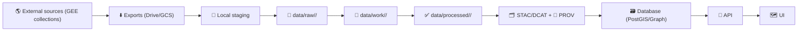

# 🌿 Kansas Yearly NDVI (Google Earth Engine) — External Staging


> ⚠️ **This folder is a _local working/staging_ area.**  
> Nothing in `data/external/…` is considered “published” in KFM until it is promoted through the canonical pipeline with metadata + provenance.

---

## 📍 Directory (you are here)

`data/external/mappings/local/earth_engine/ndvi_kansas_yearly/`

This directory is intended to hold **repeatable** scripts + **local exports** created from Google Earth Engine (GEE) for **annual NDVI composites over Kansas**.

---

## 🧠 NDVI in one minute

**NDVI (Normalized Difference Vegetation Index)** is computed as:

**NDVI = (NIR − Red) / (NIR + Red)**

Typical interpretation (rough, sensor/season dependent):
- 🌲 **Dense green vegetation** → high NDVI (often ~0.8–0.9)
- 🏜️ **Bare soil / sparse vegetation** → near 0
- 🌊 **Water** → negative values (often near -1)

✅ In Earth Engine you can compute it via `.normalizedDifference([NIR_band, Red_band])` — **band order matters**.

---

## 🎯 What this dataset is for

Produce **one NDVI raster per year** (Kansas extent) that can be used for:
- 🌾 “greenness” baselines and trend visualization across years
- 🧭 contextual map layers (then/now comparisons)
- 🧪 downstream analytics (drought indicators, vegetation variability, anomaly scoring)

---

## 🧱 KFM governance: where this fits in the pipeline

KFM expects the **non‑negotiable ordering**:



✅ This directory is **“🧰 Local staging”**.  
Publishing requires promoting outputs to `data/raw/` → `data/work/` → `data/processed/` **and** generating catalog/provenance boundary artifacts.

---

## 🗂️ Recommended folder layout (within this directory)

If you’re building this out, this is the suggested structure:

```text
🗂️ ndvi_kansas_yearly/
├── 📄 README.md
├── 🧩 config/
│   └── ndvi_kansas_yearly.yml
├── 🧪 scripts/
│   ├── ndvi_kansas_yearly.js          # Earth Engine Code Editor
│   └── ndvi_kansas_yearly.py          # Python (earthengine-api / geemap)
├── ⬇️ exports/
│   ├── gee_drive/                      # downloaded from Drive exports
│   └── gee_gcs/                        # pulled from GCS exports
├── 🧱 derived/
│   ├── cog/                            # Cloud Optimized GeoTIFFs
│   ├── previews/                       # quick PNGs / hillshade-like previews
│   └── stats/                          # histograms, min/max, percentiles
└── 🧾 logs/
    ├── runs/                           # run logs (timestamps)
    └── checksums/                      # SHA256SUMS, manifest.json, etc.
```

---

## ⚡ Quickstart

### Option A — Earth Engine Code Editor (JavaScript) 🟨

1. Open the Earth Engine Code Editor
2. Create a new script (suggested name: `ndvi_kansas_yearly.js`)
3. Paste/modify the template below
4. Run (▶️), then start the Export tasks (Tasks tab)
5. Download results into:
   - `exports/gee_drive/` **or**
   - `exports/gee_gcs/`

#### 🧾 Minimal template (single-year export, Landsat 8/9 C2 L2)

> This is a **starter**. For multi-year automation, wrap export in a loop and/or queue tasks carefully.

```javascript
// -----------------------------
// Kansas Yearly NDVI (starter)
// -----------------------------

// 1) ROI: Kansas boundary (Census TIGER)
var ks = ee.FeatureCollection('TIGER/2018/States')
  .filter(ee.Filter.eq('NAME', 'Kansas'));
Map.centerObject(ks, 6);

// 2) Parameters
var YEAR = 2020;
var start = ee.Date.fromYMD(YEAR, 5, 1);    // 🌱 growing season start (recommended for KS)
var end   = ee.Date.fromYMD(YEAR, 9, 30);   // 🌾 growing season end
var SCALE = 30;                              // Landsat native-ish

// 3) Mask + scale (Landsat C2 L2 SR)
function prepL8L9(image) {
  // Scale factors for C2 L2 optical SR bands:
  // SR = DN * 0.0000275 + (-0.2)
  var optical = image.select('SR_B.').multiply(0.0000275).add(-0.2);

  // Cloud mask using QA_PIXEL bits (typical: cloud, shadow, snow)
  var qa = image.select('QA_PIXEL');
  var cloud = qa.bitwiseAnd(1 << 3).neq(0);
  var shadow = qa.bitwiseAnd(1 << 4).neq(0);
  var snow = qa.bitwiseAnd(1 << 5).neq(0);
  var mask = cloud.or(shadow).or(snow).not();

  // NDVI (L8/9: NIR=SR_B5, Red=SR_B4)
  var ndvi = optical.normalizedDifference(['SR_B5', 'SR_B4']).rename('NDVI');

  return ndvi.updateMask(mask).copyProperties(image, ['system:time_start']);
}

// 4) Build collection
var col = ee.ImageCollection('LANDSAT/LC08/C02/T1_L2')
  .filterBounds(ks)
  .filterDate(start, end)
  .map(prepL8L9);

// 5) Composite choice: median / max / percentile
var ndviYear = col.reduce(ee.Reducer.percentile([90])).rename('NDVI_p90').clip(ks);

// Visual check (optional)
Map.addLayer(ndviYear, {min: -1, max: 1}, 'NDVI ' + YEAR);

// 6) Export
Export.image.toDrive({
  image: ndviYear,
  description: 'ndvi_ks_l8_p90_' + YEAR,
  folder: 'ndvi_kansas_yearly',
  region: ks.geometry(),
  scale: SCALE,
  maxPixels: 1e13
});
```

✅ Notes:
- If you see **data gaps** due to clouds, consider:
  - using a **wider time window** (e.g., 2-year composite), or
  - incorporating additional sensors/missions (e.g., Landsat 7/9), or
  - switching reducer (e.g., `median` vs `perc_90`).

---

### Option B — Python (earthengine-api) 🐍

This is useful for:
- repeatable CLI runs
- parameterized exports
- logging + manifest creation

Suggested dependencies:
- `earthengine-api`
- (optional) `geemap` for convenience
- `gdal` / `rio-cogeo` for COG conversion

Skeleton:

```python
import ee
ee.Initialize()

ks = (ee.FeatureCollection("TIGER/2018/States")
      .filter(ee.Filter.eq("NAME", "Kansas")))

def ndvi_year(year: int):
    start = ee.Date.fromYMD(year, 5, 1)
    end = ee.Date.fromYMD(year, 9, 30)

    def prep(img):
        optical = img.select("SR_B.").multiply(0.0000275).add(-0.2)
        qa = img.select("QA_PIXEL")
        cloud = qa.bitwiseAnd(1 << 3).neq(0)
        shadow = qa.bitwiseAnd(1 << 4).neq(0)
        snow = qa.bitwiseAnd(1 << 5).neq(0)
        mask = cloud.Or(shadow).Or(snow).Not()
        ndvi = optical.normalizedDifference(["SR_B5", "SR_B4"]).rename("NDVI")
        return ndvi.updateMask(mask).copyProperties(img, ["system:time_start"])

    col = (ee.ImageCollection("LANDSAT/LC08/C02/T1_L2")
           .filterBounds(ks)
           .filterDate(start, end)
           .map(prep))

    return col.reduce(ee.Reducer.percentile([90])).rename("NDVI_p90").clip(ks)

# Example: create the image (export requires task setup)
img2020 = ndvi_year(2020)
print(img2020.getInfo())
```

---

## 🧩 Defaults (recommended for Kansas)

| Knob | Default | Why |
|---|---:|---|
| Time window | May 1 → Sep 30 | avoids snow / dormancy noise in annual composites |
| Reducer | `perc_90` | approximates “peak greenness” while reducing cloud influence |
| Sensor | Landsat SR (30m) | longer archive; stable national coverage |
| Output format | GeoTIFF → COG | fast reading + web-friendly |
| CRS | keep default (or export EPSG:4326) | KFM typically favors web interoperability; analysis variants optional |

---

## 🧾 Output spec (what a “good” file looks like)

**Per-year raster**
- 🧷 1 band: `NDVI` (or `NDVI_p90` / `NDVI_median`)
- 🔢 Type: float32 preferred
- 🧊 NoData: set explicitly during post-processing (e.g., `-9999`)
- 📈 Expected value range: `[-1, 1]` (after masking)

**Naming convention (suggested)**
```text
ndvi_ks_<sensor>_<window>_<reducer>_<year>.tif
```

Examples:
- `ndvi_ks_landsat_gs_perc90_2020.tif`
- `ndvi_ks_s2_gs_median_2019.tif`
- `ndvi_ks_modis_annual_max_2005.tif`

---

## 🧱 Post-processing: convert to Cloud Optimized GeoTIFF (COG)

After export/download, convert each GeoTIFF to a COG:

```bash
# Example (GDAL 3+)
gdal_translate input.tif output.cog.tif \
  -of COG \
  -co COMPRESS=DEFLATE \
  -co LEVEL=9 \
  -co BIGTIFF=IF_SAFER \
  -a_nodata -9999
```

Generate checksums:

```bash
cd derived/cog
sha256sum *.tif > SHA256SUMS
```

---

## ✅ QA / QC checklist (don’t skip)

Before promoting anything into `data/processed/…`:

- [ ] **NDVI range sanity**: min/max roughly in `[-1, 1]`
- [ ] **Mask sanity**: clouds/snow are not driving artifacts
- [ ] **Coverage**: no weird statewide “holes” year-over-year
- [ ] **Temporal consistency**: same window + same reducer across years
- [ ] **Projection/scale consistency**: stable output pixel size & CRS
- [ ] **Export reproducibility**: parameters recorded (year window, reducer, collections)

---

## 🧾 Promote to “published” KFM data (required)

When you’re ready to publish into KFM, follow this pattern:

1) **Raw snapshot** 🧊  
Place the exported source artifact(s) under something like:
- `data/raw/earth_engine/ndvi_kansas_yearly/…`

2) **Work intermediates** 🧪  
Any resampling, reprojection, mosaicking, masking refinements:
- `data/work/earth_engine/ndvi_kansas_yearly/…`

3) **Processed outputs** ✅  
Final COGs (and optionally quicklooks):
- `data/processed/earth_engine/ndvi_kansas_yearly/…`

4) **Catalog metadata** 🗂️  
Create STAC/DCAT records for discoverability:
- STAC Collection + Items (wherever the repo canonical location is)
- DCAT dataset entry (if required by your KFM version)

5) **Provenance** 🧾  
Write a PROV lineage bundle that includes:
- **Entities**: input datasets + checksums/URIs
- **Activity**: scripts + parameters + timestamps
- **Agents**: person + software versions

6) **Large files policy** 🧳  
If rasters are big:
- store via **Git LFS** or pointer/checksum fetch scripts
- but still ensure existence/identity is tracked in Git (manifest + checksum)

---

## 🧯 Troubleshooting

**Export fails with maxPixels**
- Increase `maxPixels`
- reduce region complexity (`ks.geometry().simplify(...)` carefully)
- export at coarser `scale` for debugging

**Yearly composite has holes**
- widen window (or do 2-year composite if annual precision isn’t required)
- incorporate additional missions/sensors
- switch reducer (`median` can be more stable than `max`)

**NDVI looks inverted**
- check band order in `normalizedDifference([NIR, Red])`

**CRS/resolution mismatch across years**
- standardize export parameters and post-process consistently into COG

---

## 🗺️ Roadmap / TODOs (good next steps)

- [ ] Add **multi-mission Landsat (5/7/8/9)** harmonization for long time range
- [ ] Add **Sentinel‑2** pipeline (10m) for modern high-res annual layers
- [ ] Optional: create **4-season stack per year** (winter/spring/summer/autumn) for phenology
- [ ] Auto-generate: `manifest.json` + `STAC Item` + `PROV bundle` per run
- [ ] Generate web-ready previews (PNG quicklooks, min/max stretch) 🖼️

---

## 🤝 Contributing rules (quick)

- 🧾 Every publishable dataset must have **license + catalog metadata + provenance**
- 🧪 Keep scripts deterministic and parameterized
- 🧰 Don’t bypass the pipeline to “just get it on the map” 😅

