<!--
📄 File: data/external/mappings/local/earth_engine/ndvi_kansas_yearly/notes.md
🎯 Purpose: Runbook + dataset contract notes for generating **yearly NDVI composites for Kansas** via Google Earth Engine (GEE),
            and aligning outputs with KFM-style provenance + catalog expectations.
-->

---
title: "🌿 NDVI Kansas — Yearly Composites (Google Earth Engine)"
dataset_id: "ndvi_kansas_yearly"
repo_path: "data/external/mappings/local/earth_engine/ndvi_kansas_yearly/"
status: "draft"
cadence: "yearly"
data_type: "raster time-series"
---

# 🌿 NDVI Kansas — Yearly Composites (Google Earth Engine)


> [!IMPORTANT]
> This folder is **mapping/runbook documentation** for a repeatable NDVI pipeline.
> The actual output rasters may live here (if small) or be referenced via catalog entries (if large).
> Keep **provenance + metadata** in lockstep with whatever storage choice we make.

---

## 🧠 TL;DR

- **Goal:** produce **one NDVI composite per year** for the Kansas state boundary (ROI), intended for analysis + visualization (time slider / story layers).  
- **Method:** Earth Engine → cloud mask + scale SR → NDVI → annual (or growing-season) reducer → export GeoTIFF → (optional) convert to COG → catalog + provenance.  
- **Key choices:** sensor (Landsat vs Sentinel vs MODIS), seasonal window, reducer (median / max / p90), CRS + scale, storage strategy.

---

## 🗂️ Where this lives (and what should sit nearby)

### 📍 Current path
`data/external/mappings/local/earth_engine/ndvi_kansas_yearly/notes.md`

### 🧱 Suggested local layout (recommended)
```text
📁 data/
└── 📁 external/
    └── 📁 mappings/
        └── 📁 local/
            └── 📁 earth_engine/
                └── 📁 ndvi_kansas_yearly/
                    ├── 📄 notes.md                   👈 you are here
                    ├── 📁 scripts/
                    │   ├── 📄 ndvi_kansas_yearly.js  # GEE Code Editor script
                    │   └── 📄 ndvi_kansas_yearly.py  # (optional) EE Python API runner
                    ├── 📁 exports/
                    │   ├── 🗺️ ndvi_ks_2013.tif
                    │   ├── 🗺️ ndvi_ks_2014.tif
                    │   └── …
                    ├── 📁 qc/
                    │   ├── 📄 yearly_stats.csv
                    │   └── 📄 notes_qc.md
                    └── 📁 catalog/
                        ├── 📁 stac/                  # STAC Item(s)/Collection(s)
                        ├── 📁 dcat/                  # DCAT dataset record
                        └── 📁 prov/                  # W3C PROV / lineage logs
```

> [!NOTE]
> If the exported rasters are “too big for Git,” store them in an object store (S3/Drive/etc.) and
> keep **hashes + URLs + STAC assets** in-repo so the repo remains the catalog-of-record. ✅

---

## 🎯 Why we’re doing this (use cases)

- 🧑‍🌾 **Ag & land change:** crop intensity, land use patterns, vegetation vigor trends.
- 🌵 **Drought & climate signals:** year-to-year stress signals, multi-year dips and rebounds.
- 🧭 **Story layers in KFM UI:** time slider over NDVI, “compare years,” hotspots, county summaries.
- 🧪 **Model features:** NDVI as an explanatory covariate for yields, migration, economics, etc.

---

## 📦 Dataset contract (what this dataset *is*)

| Field | Value (default) | Notes |
|---|---:|---|
| Dataset ID | `ndvi_kansas_yearly` | stable identifier |
| Geometry | Kansas state boundary | ROI = Kansas polygon (state boundary) |
| Temporal grain | 1 raster per year | annual composite (or seasonal window per year) |
| Pixel values | NDVI (unitless) | typically ~[-1, 1] |
| Spatial resolution | 30m (Landsat) | configurable (10m Sentinel; 250m MODIS) |
| CRS | `EPSG:5070` (recommended for analysis) | preserves area; good for CONUS-scale rasters |
| Export format | GeoTIFF (prefer COG) | build overviews if serving tiles |
| NoData | set explicitly | ensure consistent NoData for masking |

---

## 🛰️ Source imagery choices (pick what matches the story)

### Option A — **Landsat (recommended baseline)**
- ✅ Long time coverage (decades)  
- ✅ 30m is “sweet spot” for statewide mapping  
- ⚠️ Cloud masking matters; Landsat 7 has scan-line gaps post-2003 (composites can reduce impact)

**Typical Earth Engine collections (Level-2 / SR):**
- Landsat 8: `LANDSAT/LC08/C02/T1_L2`
- Landsat 9: `LANDSAT/LC09/C02/T1_L2`
- (Optional) Landsat 7: `LANDSAT/LE07/C02/T1_L2`
- (Optional) Landsat 5: `LANDSAT/LT05/C02/T1_L2`

### Option B — **Sentinel-2 (higher res, shorter history)**
- ✅ 10m, very clean visuals for UI  
- ⚠️ Shorter time range than Landsat; different masking approach

### Option C — **MODIS (fast, smooth time series, coarse)**
- ✅ Great for long, dense time series  
- ⚠️ Coarse resolution (often 250m–500m)

> [!TIP]
> If we want **deep history + consistent annual trend**, start with **Landsat**.
> If we want **modern high-res visuals**, add a second product series for **Sentinel-2 (2016+)**.

---

## 🧮 NDVI definition (what we compute)

NDVI is computed as:

\[
NDVI = \frac{NIR - Red}{NIR + Red}
\]

### Common band mapping (reference)
- **Landsat 8/9 SR:** `SR_B5` (NIR), `SR_B4` (Red)
- **Landsat 7/5 SR:** band mapping differs → prefer renaming/harmonization first
- **Sentinel-2:** `B8` (NIR), `B4` (Red)

---

## ⚙️ Processing recipe (the “happy path”)

```mermaid
flowchart LR
  A[🛰️ Source imagery] --> B[☁️ Mask clouds/shadows + saturation]
  B --> C[📏 Apply scale factors (SR)]
  C --> D[🌿 Compute NDVI]
  D --> E[📅 Group by year (and optional season window)]
  E --> F[🧮 Composite reducer (median / max / p90)]
  F --> G[✂️ Clip to Kansas ROI]
  G --> H[📤 Export GeoTIFF]
  H --> I[🧰 Optional: convert to COG + build overviews]
  I --> J[🧾 STAC/DCAT/PROV + checksums]
```

### 🔑 Key decisions (defaults suggested)
- **Season window:** growing season per year (e.g., Apr–Oct) to reduce snow/dormant noise  
- **Reducer:** `median` for robustness; `p90` or `max` for “peak greenness”  
- **CRS/scale:** explicitly set CRS + scale in analysis & exports (avoid silent defaults)

---

## 🧑‍💻 Starter GEE script (JavaScript, Code Editor)

> [!NOTE]
> This is a “starter” script intended to be copied into:
> `data/external/mappings/local/earth_engine/ndvi_kansas_yearly/scripts/ndvi_kansas_yearly.js`

```javascript
// ============================================================================
// 🌿 NDVI Kansas — Yearly Composite Exporter (Landsat 8/9 example)
// ----------------------------------------------------------------------------
// Defaults:
// - ROI: Kansas state boundary
// - Growing season: Apr 1 → Oct 31 (adjust)
// - Composite: median NDVI (adjust)
// - Export: GeoTIFF to Drive folder
// ============================================================================

// -------------------------------
// ✅ Config
// -------------------------------
var START_YEAR = 2013;        // Landsat 8 starts 2013 (extend with L7/L5 if needed)
var END_YEAR   = 2024;        // inclusive
var START_MONTH = 4;          // Apr
var START_DAY   = 1;
var END_MONTH   = 10;         // Oct
var END_DAY     = 31;

var SCALE = 30;               // Landsat native
var CRS   = 'EPSG:5070';      // North America Albers Equal Area (good for area analysis)
var EXPORT_FOLDER = 'KFM_ndvi_kansas_yearly';
var REDUCER_MODE  = 'median'; // 'median' | 'max' | 'p90'

// -------------------------------
// 🗺️ ROI: Kansas
// -------------------------------
var states = ee.FeatureCollection('TIGER/2018/States');
var kansas = states.filter(ee.Filter.eq('NAME', 'Kansas')).geometry();
Map.centerObject(kansas, 6);
Map.addLayer(kansas, {color: 'white'}, 'Kansas ROI');

// -------------------------------
// 🛰️ Landsat collections (L2 C2 T1)
// -------------------------------
var l8 = ee.ImageCollection('LANDSAT/LC08/C02/T1_L2');
var l9 = ee.ImageCollection('LANDSAT/LC09/C02/T1_L2');
var landsat = l8.merge(l9);

// -------------------------------
// ☁️ Mask + scale + NDVI
// (Pattern based on common L8 C2 L2 QA_PIXEL + SR scale factors)
// -------------------------------
function maskScaleAddNDVI(image) {
  // Bits 0-4 are: Fill, Dilated Cloud, Cirrus, Cloud, Cloud Shadow
  var qaMask = image.select('QA_PIXEL').bitwiseAnd(parseInt('11111', 2)).eq(0);
  var saturationMask = image.select('QA_RADSAT').eq(0);

  // Apply SR scale factors
  var optical = image.select('SR_B.').multiply(0.0000275).add(-0.2);

  // Optional: thermal scaling (not needed for NDVI, but keeps image consistent)
  var thermal = image.select('ST_B.*').multiply(0.00341802).add(149.0);

  var scaled = image
    .addBands(optical, null, true)
    .addBands(thermal, null, true)
    .updateMask(qaMask)
    .updateMask(saturationMask);

  var ndvi = scaled.normalizedDifference(['SR_B5', 'SR_B4']).rename('NDVI');

  return scaled
    .addBands(ndvi)
    .copyProperties(image, ['system:time_start']);
}

// -------------------------------
// 📅 Build one composite per year
// -------------------------------
function compositeForYear(year) {
  year = ee.Number(year);

  var start = ee.Date.fromYMD(year, START_MONTH, START_DAY);
  var end   = ee.Date.fromYMD(year, END_MONTH, END_DAY).advance(1, 'day');

  var col = landsat
    .filterBounds(kansas)
    .filterDate(start, end)
    // Optional: filter by metadata cloud cover first (coarse prefilter)
    .filter(ee.Filter.lessThan('CLOUD_COVER', 60))
    .map(maskScaleAddNDVI)
    .select('NDVI');

  var composite;
  if (REDUCER_MODE === 'max') {
    composite = col.max();
  } else if (REDUCER_MODE === 'p90') {
    composite = col.reduce(ee.Reducer.percentile([90]))
      .rename('NDVI');
  } else {
    composite = col.median(); // default
  }

  return composite
    .clip(kansas)
    .set({
      'year': year,
      'start_date': start.format('YYYY-MM-dd'),
      'end_date': end.advance(-1, 'day').format('YYYY-MM-dd'),
      'reducer': REDUCER_MODE
    });
}

// -------------------------------
// 🧪 Preview one year in map
// -------------------------------
var previewYear = 2020;
var preview = compositeForYear(previewYear);

var ndviVis = {
  min: 0.0,
  max: 0.8,
  palette: ['#440154', '#3b528b', '#21918c', '#5ec962', '#fde725']
};

Map.addLayer(preview, ndviVis, 'NDVI Kansas ' + previewYear);

// -------------------------------
// 📤 Export tasks (one per year)
// -------------------------------
for (var y = START_YEAR; y <= END_YEAR; y++) {
  var img = compositeForYear(y);

  Export.image.toDrive({
    image: img,
    description: 'ndvi_ks_' + y + '_' + REDUCER_MODE,
    folder: EXPORT_FOLDER,
    fileNamePrefix: 'ndvi_ks_' + y + '_' + REDUCER_MODE,
    region: kansas,
    scale: SCALE,
    crs: CRS,
    maxPixels: 1e13
  });
}
```

---

## 📈 QC & sanity checks (don’t skip) 🧪

### 1) Basic yearly stats (min/max/mean)
- Check if NDVI ranges are sane each year (e.g., no all-zeros or extreme negatives).
- Watch for “cloud-mask too aggressive” (very sparse pixels) vs “not aggressive enough” (cloud contamination).

### 2) Time series at a few anchor points
Pick:
- 🌾 a crop-heavy county  
- 🌳 a riparian/forest patch  
- 🏙️ an urban area (should have lower NDVI)

Example snippet (GEE UI chart):
```javascript
var pt = ee.Geometry.Point([-97.0, 38.5]); // pick a Kansas point
var years = ee.List.sequence(START_YEAR, END_YEAR);

var yearlyImgCol = ee.ImageCollection.fromImages(
  years.map(function(y) {
    y = ee.Number(y);
    var img = compositeForYear(y);
    return img.set('system:time_start', ee.Date.fromYMD(y, 7, 1).millis());
  })
);

var chart = ui.Chart.image.series({
  imageCollection: yearlyImgCol,
  region: pt,
  reducer: ee.Reducer.mean(),
  scale: SCALE
}).setOptions({
  title: 'NDVI yearly composite at anchor point',
  lineWidth: 1,
  pointSize: 3
});

print(chart);
```

> [!TIP]
> If the map looks good but the chart is “spiky,” double-check:
> - season window (snow/dormancy)
> - reducer choice (median vs max vs p90)
> - cloud mask logic

---

## 📤 Export conventions (naming + storage)

### ✅ File naming (recommended)
`ndvi_ks_<YEAR>_<reducer>.tif`

Examples:
- `ndvi_ks_2013_median.tif`
- `ndvi_ks_2020_p90.tif`

### 🌎 CRS guidance
- **Analysis rasters:** use equal-area projection (e.g., EPSG:5070)  
- **Web tiles:** reproject to Web Mercator (EPSG:3857) during tile generation (not in the “analysis master”)

### 🧰 Optional: convert GeoTIFF → Cloud Optimized GeoTIFF (COG)
```bash
# Example (GDAL 3+):
gdal_translate ndvi_ks_2020_median.tif ndvi_ks_2020_median.cog.tif \
  -of COG -co COMPRESS=DEFLATE -co PREDICTOR=2 -co OVERVIEWS=IGNORE_EXISTING
```

---

## 🧾 Provenance + catalog (KFM-aligned expectations)

> [!IMPORTANT]
> Treat this as a governed dataset: **no output without documentation**.

### ✅ What should be generated/updated
- **STAC**  
  - STAC Collection: `ndvi_kansas_yearly`  
  - STAC Item: one per year (assets: GeoTIFF/COG + thumbnails if available)
- **DCAT** dataset record (high-level catalog)
- **PROV** log capturing lineage:
  - source collections
  - scripts used (+ commit hash)
  - parameters (year range, reducer, season window, CRS/scale)
  - outputs produced (+ checksums)

### 🧷 Suggested PROV log fields (minimal)
```json
{
  "dataset_id": "ndvi_kansas_yearly",
  "run_id": "YYYYMMDD-HHMMSS",
  "script": "scripts/ndvi_kansas_yearly.js",
  "parameters": {
    "start_year": 2013,
    "end_year": 2024,
    "season_window": "Apr01-Oct31",
    "reducer": "median",
    "crs": "EPSG:5070",
    "scale": 30
  },
  "inputs": [
    "LANDSAT/LC08/C02/T1_L2",
    "LANDSAT/LC09/C02/T1_L2",
    "TIGER/2018/States (Kansas boundary)"
  ],
  "outputs": [
    {"path": "exports/ndvi_ks_2020_median.tif", "sha256": "<hash>"}
  ]
}
```

---

## 🧩 Integration into the KFM stack (future-facing)

```mermaid
flowchart LR
  A[🗺️ NDVI yearly rasters] --> B[🧾 STAC/DCAT/PROV]
  B --> C[🗃️ Data store: PostGIS raster / COGs + tile index]
  C --> D[🧰 API: dataset registry + tile endpoints]
  D --> E[🗺️ UI: MapLibre layer + time slider]
  E --> F[🤖 AI: “explain NDVI shifts w/ citations”]
```



---

## 🧯 Troubleshooting (common gotchas)

- 🧨 **Export fails / maxPixels** → raise `maxPixels`, tighten ROI (Kansas only), export per-year not multi-band mega export.
- 🐢 **Timeouts** → avoid reprojecting at tiny scale during Map display; keep visualization simple.
- ☁️ **Cloud contamination** → strengthen mask OR filter on `CLOUD_COVER` first.
- 🧊 **Snow/season noise** → use growing season window (Apr–Oct) or exclude winter months explicitly.
- 🧭 **CRS confusion** → set CRS + scale explicitly in exports; keep one “analysis CRS” canonical.

---

## ✅ Definition of Done (DoD) checklist

- [ ] GEE script exists + is commented (JS or Python runner)
- [ ] Exports exist for target year range (one per year)
- [ ] QC file exists (stats + notes)
- [ ] STAC Collection + Items are created/updated
- [ ] DCAT record exists/updated
- [ ] PROV log exists with script version + params + outputs
- [ ] Storage decision documented (in Git vs external bucket w/ hashes)
- [ ] At least one UI preview screenshot/GIF attached (optional but awesome 🎥)

---

## 📚 References (project docs)

- 📘 *Kansas Frontier Matrix (KFM) – Comprehensive Technical Blueprint* (provenance-first + pipeline alignment)
- 🛰️ *Cloud-Based Remote Sensing with Google Earth Engine — Fundamentals and Applications* (masking, scaling, NDVI, time-series patterns)
- 🗺️ *Making Maps — A Visual Guide to Map Design for GIS* (projection trade-offs + cartographic guidance)
- ⏳ *Visualization of Time-Oriented Data* (time axis / temporal visualization considerations)
- 🧾 *MARKDOWN_GUIDE_v13* (repo layout + doc hygiene)

---

## 🧰 Backlog / enhancements (nice-to-have)

- [ ] Add Landsat 5/7 harmonization for pre-2013 coverage
- [ ] Produce county-level NDVI summaries per year (CSV/Parquet)
- [ ] Generate an NDVI anomaly layer (z-score vs baseline window)
- [ ] Build tiles (COGs → tile server) + time slider config for UI
- [ ] Add seasonal composites (spring/summer/fall) alongside annual

