# 🏔️ OpenTopography (Local Terrain & LiDAR Cache)


📍 **Path:** `data/external/mappings/local/opentopography/`

This directory is a **local-only** workspace for pulling **terrain elevation** (DEM/DSM/DTM) and **LiDAR point clouds** from **OpenTopography** and staging them for the Kansas Matrix System / KFM mapping pipeline.

---

## 🧠 Why this folder exists

KFM can **fetch elevation on-demand** (by bounding box / AOI), generate **contours / hillshade / slope** for visualization, and **cache** results locally to avoid repeated downloads.

Use this folder as the **scratch + cache layer** for OpenTopography pulls, *then promote anything “official”* into the canonical pipeline (see below).

---

## 🔥 Golden rules (don’t skip)

> [!IMPORTANT]
> **Anything that ends up in the UI must be promoted through the canonical pipeline.**  
> Local cache files are not “truth”—they’re convenience.

> [!WARNING]
> **Never commit API keys** (or any secrets) anywhere in this directory.

> [!CAUTION]
> **Do not commit large rasters/LAZ/COPC files** to Git from here.  
> Treat this folder like a build cache: big, replaceable, local.

---

## ✅ Canonical “truth path” (KFM pipeline)

```mermaid
flowchart LR
  OT["🌐 OpenTopography"] -->|"Fetch bbox / tiles"| CACHE["📦 Local Cache — data/external/.../opentopography"]
  CACHE -->|"Promote"| RAW["📥 data/raw"]
  RAW -->|"ETL / standardize"| PROC["✅ data/processed"]
  PROC --> META["🧾 data/catalog (STAC/DCAT)"]
  PROC --> PROV["🔗 data/provenance (PROV)"]
  PROC --> DB["🗄️ PostGIS / Graph / Search"]
  DB --> API["🧩 API Layer"]
  API --> UI["🗺️ UI"]
```



---

## 🗂️ Recommended folder layout

```text
📁 data/
└─ 📁 external/
   └─ 📁 mappings/
      └─ 📦 local/
         └─ 📁 opentopography/                         🗻 OpenTopography workflows + local caching
            ├─ 📄 README.md                             📘 overview, conventions, and how to run fetch/derive steps
            ├─ 📁 cache/                                🧊 primary cache (GeoTIFF, LAZ, COPC, etc.)
            │  ├─ 📁 dem/                               🏔️ DEM tiles / rasters pulled from OpenTopography
            │  ├─ 📁 derived/                           🧱 locally-derived products (hillshade/slope/contours)
            │  └─ 📁 pointcloud/                        ☁️ point cloud downloads (LAZ/COPC)
            ├─ 📁 manifests/                            ◻️ optional: git-friendly request + integrity manifests
            │  ├─ 📄 requests.jsonl                      🧾 one line per request (bbox, dataset, output, hash)
            │  └─ 📄 checksums.sha256                    🔐 hashes for cached artifacts referenced by manifests
            └─ 📁 tmp/                                  🗑️ safe to delete any time (scratch / staging)
```

> [!TIP]
> Keep `cache/` and `tmp/` aggressively `.gitignore`’d. Only tiny manifests belong in Git.

---

## ⚡ Quickstart

### 1) Get an OpenTopography API key
- Create/get an API key from OpenTopography (required for most datasets).

### 2) Store your key safely (choose one)
- **Environment variable (recommended)**  
  `export OPENTOPOGRAPHY_API_KEY="…"`
- **Dot file**  
  Put your key in `~/.opentopography.txt` (or in the working directory as `.opentopography.txt`)

> [!WARNING]
> Do **not** store keys in repo-tracked files. Ever.

---

## ⛏️ Download methods

### Option A — `bmi-topography` (recommended ✅)
`bmi-topography` fetches elevation data and **caches it locally** so repeated requests don’t re-download.

#### Install
```bash
pip install bmi-topography
# or
conda install -c conda-forge bmi-topography
```

#### Fetch a DEM into this folder cache
```python
from bmi_topography import Topography

params = Topography.DEFAULT.copy()

# 1) pick a dataset:
#    - USGS30m / USGS10m / USGS1m (USGS1m may be restricted)
#    - or global DEMs like SRTMGL1, COP30, NASADEM, etc.
params["dem_type"] = "USGS10m"

# 2) set bbox (lat/lon WGS84)
params["south"] = 37.0
params["north"] = 37.5
params["west"]  = -98.5
params["east"]  = -98.0

# 3) output format + cache dir
params["output_format"] = "GTiff"
params["cache_dir"] = "data/external/mappings/local/opentopography/cache/dem"

topo = Topography(**params)
path = topo.fetch()
print("Saved:", path)
```

> [!TIP]
> For Kansas workflows, prefer `USGS10m` for statewide/region work, and `USGS1m` only for small AOIs where allowed.

---

### Option B — Direct REST downloads (curl)
Useful for quick pulls, scripting, or debugging.

#### Global DEM API (`globaldem`)
```bash
mkdir -p data/external/mappings/local/opentopography/cache/dem

curl -L \
  -o "data/external/mappings/local/opentopography/cache/dem/SRTMGL1_bbox.tif" \
  "https://portal.opentopography.org/API/globaldem?demtype=SRTMGL1&south=37.0&north=37.5&west=-98.5&east=-98.0&outputFormat=GTiff&API_Key=${OPENTOPOGRAPHY_API_KEY}"
```

#### USGS 3DEP Raster API (`usgsdem`)
```bash
mkdir -p data/external/mappings/local/opentopography/cache/dem

curl -L \
  -o "data/external/mappings/local/opentopography/cache/dem/USGS10m_bbox.tif" \
  "https://portal.opentopography.org/API/usgsdem?datasetName=USGS10m&south=37.0&north=37.5&west=-98.5&east=-98.0&outputFormat=GTiff&API_Key=${OPENTOPOGRAPHY_API_KEY}"
```

> [!NOTE]
> Use **small AOIs** and **tile requests** when possible (API request-size limits apply).

---

## 🧾 Request manifests (recommended)

If you’re doing anything repeatable, create a lightweight manifest so the cache is reproducible:

**`manifests/requests.jsonl`**
```json
{"ts":"2026-01-29T00:00:00Z","provider":"OpenTopography","endpoint":"usgsdem","dataset":"USGS10m","bbox":[-98.5,37.0,-98.0,37.5],"format":"GTiff","out":"cache/dem/USGS10m_bbox.tif","notes":"Kansas AOI test"}
```

**`manifests/checksums.sha256`**
```text
<sha256>  cache/dem/USGS10m_bbox.tif
```

---

## 🧪 Local derivative layers (hillshade / slope / contours)

> [!TIP]
> Derived rasters are often best generated locally in `cache/derived/` and then **promoted** only if needed.

### Hillshade
```bash
mkdir -p data/external/mappings/local/opentopography/cache/derived

gdaldem hillshade \
  "data/external/mappings/local/opentopography/cache/dem/USGS10m_bbox.tif" \
  "data/external/mappings/local/opentopography/cache/derived/USGS10m_bbox_hillshade.tif"
```

### Slope
```bash
gdaldem slope \
  "data/external/mappings/local/opentopography/cache/dem/USGS10m_bbox.tif" \
  "data/external/mappings/local/opentopography/cache/derived/USGS10m_bbox_slope.tif"
```

### Contours
```bash
mkdir -p data/external/mappings/local/opentopography/cache/derived/contours

gdal_contour -a elev -i 5 \
  "data/external/mappings/local/opentopography/cache/dem/USGS10m_bbox.tif" \
  "data/external/mappings/local/opentopography/cache/derived/contours/USGS10m_bbox_contours_5m.gpkg"
```

---

## 🚀 Promote “official” terrain into KFM

If a DEM/derivative is needed beyond ad-hoc local work, promote it into KFM:

### ✅ Promotion checklist
- [ ] Reproject/resample to the project’s target CRS (if applicable)
- [ ] Convert to **COG** (Cloud Optimized GeoTIFF) if it’s a raster that will be served/streamed
- [ ] Move into a durable location (typically `data/processed/elevation/...`)
- [ ] Create **STAC/DCAT** metadata entries
- [ ] Create **PROV** lineage record (inputs, scripts, params, timestamps, source URLs)
- [ ] Ensure licensing/source attribution is complete
- [ ] If file is large, use the project’s large-file strategy (LFS/pointers/checksum+fetch script)

> [!IMPORTANT]
> “If it’s in the UI, it must have metadata + provenance.” 
> No shortcuts.

---

## ☁️ LiDAR / point cloud workflow (advanced)

OpenTopography LiDAR datasets are typically tiled (`*.laz`). A robust workflow is:

1. Discover tiles via **tile index** (a shapefile/extent layer).
2. Select intersecting tiles for your AOI.
3. Download tiles *or* stream them from cloud storage.
4. Clip/merge and generate products (DTM/DSM/COPC).

### Suggested local layout
```text
📁 cache/
└─ 📁 pointcloud/                        ☁️ point cloud cache + derivatives
   ├─ 📁 tile_index/                     🗺️ tile discovery indexes (shapefile/geojson/gpkg)
   ├─ 📁 laz/                            📦 downloaded tiles (LAZ)
   ├─ 📁 copc/                           🧊 merged/converted COPC outputs (cloud-optimized point clouds)
   └─ 📁 dtm/                            🏔️ derived terrain models (DTM) from ground-class points
```

---

## 🧹 Suggested `.gitignore` snippet

```gitignore
# OpenTopography local cache (do not commit big files)
data/external/mappings/local/opentopography/cache/
data/external/mappings/local/opentopography/tmp/

# Optional: keep manifests in git, ignore everything else
# !data/external/mappings/local/opentopography/manifests/
```

---

## 🛠 Troubleshooting

- **401 Unauthorized**  
  Your API key is missing/invalid, or the dataset requires a key and you didn’t send it.
- **Request too large**  
  Reduce bbox size, split into tiles, or lower resolution.
- **Rate-limited / throttled**  
  Add caching, reduce repeated calls, batch requests, and sleep between calls.
- **“It downloaded but looks wrong”**  
  Check:
  - nodata values
  - vertical units/datum
  - CRS and pixel size
  - clipping vs bbox padding

---

## 🔗 Reference links (keep handy)

- OpenTopography Portal: https://opentopography.org/
- OpenTopography Developers / API info: https://opentopography.org/developers
- Global DEM API endpoint pattern: https://portal.opentopography.org/API/globaldem
- USGS 3DEP Raster API endpoint pattern: https://portal.opentopography.org/API/usgsdem
- bmi-topography (library + CLI): https://github.com/csdms/bmi-topography
- Tile Index + PDAL streaming tutorial: https://opentopography.org/blog/programmatic-access-opentopographys-point-cloud-data-tile-indexes

