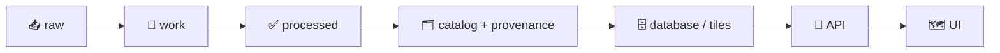

# 🧱 USDA NRCS Soils (SSURGO / gSSURGO) — Local Mapping Runbook

`Source: USDA NRCS` `Dataset-family: SSURGO + gSSURGO` `Mode: 🌐 API-first` `Offline: 💾 optional` `Domain: data/external`

> [!IMPORTANT]
> **KFM is “API-first” for soils.** Prefer querying SSURGO via Soil Data Access (SDA) by point/polygon and caching results, instead of committing/hauling massive shapefiles. Keep a local snapshot only when you truly need offline access or ultra-fast repeat queries.

---

## 🎯 What this folder is

This folder holds **local mapping notes + conventions** for integrating USDA soils into the project (Kansas Frontier Matrix / KFM).

- ✅ Good fits here:
  - ETL/runbook docs, conventions, naming standards, caching rules
  - Local-only helper configs (not secrets), sample queries, schema notes
  - “How we ingest/publish this dataset” instructions

- 🚫 Not ideal to store here:
  - Huge raw SSURGO packages / statewide gSSURGO databases (put those in `raw/` and/or external storage; keep Git lean)

---

## 🧭 Canonical pipeline (KFM standard)



**Rule of thumb:** If you can’t explain *where the soil layer came from* and *how it was transformed*, it’s not ready to ship.

---

## 📦 Recommended directory layout

This repo uses a “data-domain” pattern. For this dataset, the domain is `external`.

```text
📁 data/
└─ 🌐 external/
   ├─ 🗂️ raw/                                 🧾 immutable source drops (read-only / never overwrite)
   │  └─ 🧱 usda_soils/                         📦 downloads (zip/fgdb/gpkg) — do not hand-edit
   ├─ 🧪 work/                                🧰 staging workspace (scratch + rebuildable)
   │  └─ 🧱 usda_soils/                         🧪 scratch/intermediates
   ├─ ✅ processed/                            ✅ curated outputs (downstream-ready)
   │  └─ 🧱 usda_soils/                         🧼 cleaned/standardized outputs (GeoPackage/Parquet/etc.)
   └─ 🧭 mappings/                             🧩 mapping packs + ETL/QA plans
      └─ 🏠 local/                             🏛️ local/partner/API-driven mappings
         └─ 🧱 usda_soils/                      🌾 USDA soils mapping bundle
            └─ 📄 README.md                     👈 you are here
```

> [!TIP]
> If you’re unsure whether something belongs in `raw/` vs `processed/`:
> - **raw** = “as downloaded”
> - **processed** = “standardized + validated + reproducible”

---

## 🚀 Access modes

| Mode | Best for | What you store locally | Notes |
|---|---|---:|---|
| 🌐 **A. API-first (recommended)** | Point/polygon queries, interactive UI | Cached query outputs (small) | Lean + always current |
| 🧊 **B. AOI / County cache** | Repeated use for same areas | AOI extracts + indexes | Great for Kansas county workflows |
| 📦 **C. Bulk snapshot** | Offline workflows, heavy batch analytics | SSURGO zips or gSSURGO FGDB | Large; treat as “external storage + pointers” |

---

## 🌐 Mode A: Soil Data Access (SDA) — minimal working recipe

### Endpoints (official)

```text
Tabular REST/POST (SQL + AOI services):
  https://SDMDataAccess.sc.egov.usda.gov/Tabular/post.rest

WFS (vector features):
  https://SDMDataAccess.sc.egov.usda.gov/Spatial/SDMWGS84Geographic.wfs   (EPSG:4326)
  https://SDMDataAccess.sc.egov.usda.gov/Spatial/SDMNAD83Geographic.wfs   (EPSG:4269)
  https://SDMDataAccess.sc.egov.usda.gov/Spatial/SDMWM.wfs                (EPSG:3857)

WMS (map images):
  https://SDMDataAccess.sc.egov.usda.gov/Spatial/SDM.wms
```

### Query Service (POST) — template

SDA’s `post.rest` supports a **Query Service** where you POST parameters and receive XML/JSON.

```bash
SDA_POST="https://SDMDataAccess.sc.egov.usda.gov/Tabular/post.rest"

# NOTE: SDA expects POST parameters like service/request/query/format.
# Keep queries bounded: limit AOI, filter by areasymbol/mukey, etc.

curl -sS -X POST "$SDA_POST" \
  --data-urlencode "service=query" \
  --data-urlencode "request=query" \
  --data-urlencode "format=JSON" \
  --data-urlencode "query=SELECT TOP 5 * FROM mapunit;"
```

> [!IMPORTANT]
> Cache every API call you intend to reuse. Store:
> - request params (including the SQL)
> - response payload
> - timestamp + dataset version context
> - a short “why we pulled this”

---

## 📦 Mode C: Bulk datasets (SSURGO + gSSURGO)

### SSURGO (vector + tabular packages)
- Distributed as **soil survey areas** (often county-sized, but not always).
- Typical bulk export includes spatial + tabular + metadata.

### gSSURGO (statewide / CONUS)
- Packaged as an **ESRI file geodatabase** with statewide extents.
- Includes a gridded/raster layer derived from SSURGO and retains tabular attributes.
- Heavier than SSURGO AOI pulls, but efficient for statewide modeling.

> [!CAUTION]
> Bulk soils datasets can be **large**. Prefer:
> - storing them outside Git (object storage / shared drive)
> - committing only **checksums + manifests + metadata**
> - using Git LFS only if the repo policy supports it

---

## 🧪 Processing expectations (when you *do* store local data)

When materializing local soil layers, use this checklist:

### ✅ Transform rules
- **Reproject** into the repo’s standard CRS (or clearly document exceptions).
- **Standardize outputs** into project-friendly formats (e.g., GeoPackage, Parquet).
- **Clip / tile** to Kansas AOIs when possible (don’t carry CONUS unless you need it).
- **Validate** geometry + schema (no invalid polys, no broken joins, no empty AOIs).

### 🧾 Metadata & provenance (non-negotiable)
Create/update:
- A dataset entry in the project’s catalog
- A provenance record describing:
  - source system (SDA / SSURGO zip / gSSURGO)
  - download date
  - query/AOI definition
  - processing steps + tool versions

---

## 🧊 Caching & naming conventions

Cache files should be **stable + searchable**.

Suggested pattern:

```text
<source>__<product>__<aoi>__<crs>__<date>__<hash>.<ext>

Examples:
sda__mapunitpoly__kansas-allen__epsg4326__2026-01-29__a1b2c3.gpkg
sda__muaggatt__bbox_-96.75_38.85_-96.60_39.00__json__2026-01-29__d4e5f6.json
```

---

## 🏷️ Attribution

Every published layer or UI panel that uses this data should include:
- “USDA NRCS Soil Survey (SSURGO / gSSURGO)” attribution
- Retrieval mode (SDA vs bulk download)
- Retrieval date (or release date, if using a snapshot)

---

## ✅ QA quick checks

- [ ] AOI is correct (not flipped lat/lon; not wrong county)
- [ ] CRS is documented and consistent
- [ ] Joins resolve (map-unit keys or other join IDs actually match)
- [ ] Cache hit rate is high for repeated queries
- [ ] Any local snapshot has a manifest + checksum
- [ ] Provenance record exists and points to scripts/commands used

---

## 📚 Glossary

- **SSURGO**: Soil Survey Geographic Database (detailed soil polygons + attributes).
- **gSSURGO**: Gridded SSURGO product (statewide/CONUS-friendly packaging; includes rasterized layers).
- **SDA**: Soil Data Access web services (SQL query + AOI + WFS/WMS endpoints).

---

## 🧩 Project integration notes (KFM)

- Implement/extend a **SoilDataAdapter** that:
  - accepts point/polygon AOIs
  - queries SDA (preferred)
  - writes deterministic caches into `data/.../processed/` (or `external_cache/` if used)
  - emits metadata/provenance updates as part of the pipeline

> [!TIP]
> If you’re building “soil summaries” for the UI: store the *raw authoritative response* + a *derived, human-readable summary* side-by-side, and keep the derivation reproducible.

---

