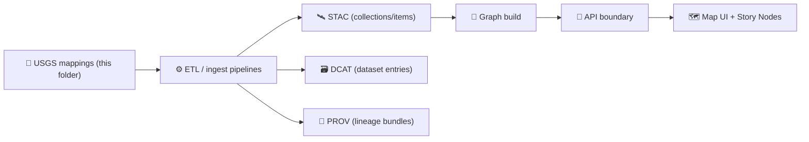

# 🗺️ USGS Mapping Pack (External) — `data/external/mappings/usgs/`


> 📍 **Path:** `data/external/mappings/usgs/`  
> 🎯 **Purpose:** Keep **USGS-sourced datasets** (and USGS-adjacent services) **machine-mappable, reproducible, and provenance-rich** before/while they flow into domain ETL, catalogs, graph, API, and UI.

---

## 🧭 What this folder is

This directory is a **runbook + spec pack** for mapping **USGS products** (The National Map, 3DEP, hydrography, topo maps, etc.) into the project’s standardized metadata & ingestion patterns:

- ✅ **Dataset descriptors** (what it is, where it came from, how to fetch it)
- ✅ **Field/attribute crosswalks** (source fields → canonical fields)
- ✅ **Spatial assumptions** (CRS, resolution, tiling/indexing strategy)
- ✅ **“Boundary artifacts” hooks** (STAC/DCAT/PROV generation inputs/templates)

> **Not the data itself:** avoid committing large USGS binaries here (LiDAR, DEM mosaics, etc.). This folder is for **mapping + metadata** (and small helper configs).

---

## 🗂️ Suggested layout

> Adjust to match your pipeline tooling — the point is consistency and discoverability. 💡

```
📁 data/
└─ 📁 external/
   └─ 📁 mappings/
      └─ 📦 usgs/                                           🛰️ USGS mapping packs + dataset blueprints
         ├─ 📄 README.md                                     📘 overview, conventions, and how to add a new USGS dataset
         ├─ 📁 datasets/                                     🧩 per-dataset mapping bundles (one folder per source program)
         │  ├─ 📁 3dep_dem/                                  🏔️ 3DEP DEM: elevation rasters → KFM elevation schema
         │  │  ├─ 📄 dataset.yaml                             ✅ dataset descriptor (scope, inputs, versions, outputs)
         │  │  ├─ 🧩 field_map.yml                             ✅ source fields/bands → KFM canonical fields mapping
         │  │  ├─ 📄 stac.collection.template.json             🛰️ STAC Collection template (program-level semantics)
         │  │  ├─ 📄 dcat.dataset.template.jsonld              🗂️ DCAT dataset template (discovery + governance)
         │  │  └─ 📄 prov.template.json                        🧬 PROV template (inputs → transforms → outputs)
         │  ├─ 📁 3dep_lidar/                                 🛰️ 3DEP LiDAR: point clouds/derivatives → KFM lidar schema
         │  ├─ 📁 3dhp_hydrography/                            🌊 3DHP: modern hydrography products → KFM hydro schema
         │  ├─ 📁 nhd_legacy/                                 🧾 Legacy NHD: historical hydro layers → compatibility mappings
         │  ├─ 📁 wbd/                                        🗺️ Watershed Boundary Dataset → KFM watershed schema
         │  └─ 📁 us_topo_historical/                         🗻 US Topo (historical) → KFM topo/map-sheet schema
         └─ 📁 shared/                                       🧰 shared building blocks used across USGS datasets
            ├─ 📁 crs/                                       🧭 CRS definitions + transforms + EPSG notes
            ├─ 📁 templates/                                  🧱 reusable templates (STAC/DCAT/PROV/mapping skeletons)
            └─ 📄 qa_checks.md                                🧪 common QA checks (geometry, CRS, ranges, completeness)
```

---

## 🧱 Mapping philosophy (short + strict)

### ✅ Treat mappings like code
- PR-reviewed
- versioned
- tested (at least “schema + sanity checks”)

### ✅ Keep a *single source of truth*
- Each dataset has a **stable ID**
- Each dataset has a **fetch story** (where/how obtained)
- Each dataset has **provenance expectations** (inputs → activities → outputs)

### ✅ Prefer “source-preserving” transforms
- Preserve original attributes in a namespaced area (e.g., `source:*`)
- Add canonical/derived fields in a separate area (e.g., `kfm:*` or `canon:*`)
- Never lose the original CRS/units without recording them 🔎

---

## 🆔 Canonical dataset IDs

Use IDs that survive refactors and file moves.

**Recommended pattern:**
```
usgs::<program_or_product>::<dataset>::<variant_or_resolution>
```

Examples:
- `usgs::3dep::dem::1m`
- `usgs::3dep::lidar::ql2`
- `usgs::3dhp::edh::service`
- `usgs::tnm::ustopo::historical_scans`

---

## 🧬 Minimum metadata fields (for every dataset mapping)

Even if your pipeline uses a different schema, ensure you can answer these:

- **identity**
  - `id`, `title`, `description`, `keywords/tags`
- **source**
  - `source_org` (`USGS`)
  - `program/product` (TNM / 3DEP / 3DHP / etc.)
  - `landing_page`
  - `distribution` (download URL / API / service URL)
  - `retrieval_method` (manual, API, bulk, service)
  - `retrieved_at` (or “planned/rolling”)
- **license & attribution**
  - `license_summary` (e.g., public domain in US; verify per asset)
  - `attribution_text` (credit line)
- **spatial**
  - `crs_source`, `crs_target` (if reprojected)
  - `extent_bbox` (or how computed)
  - `resolution` (meters/arc-seconds)
  - `nodata` rules (rasters)
- **update cadence**
  - `update_frequency` (annual, quarterly, irregular, legacy)
  - `last_known_update` (if available)
- **quality**
  - `qa_checks` (what we validate)
  - `known_issues` (if any)

---

## 📦 STAC / DCAT / PROV “boundary artifacts” (how these mappings plug in)

This project treats metadata as **first-class build outputs**:

- 🛰️ **STAC** → collections + items for geospatial cataloging
- 🗃️ **DCAT** → discovery + data-catalog views (JSON-LD)
- 🧾 **PROV** → lineage bundles (inputs, activities, agents)

A helpful mental model:



---

## 🛰️ USGS access points we commonly map

### 🗺️ The National Map (TNM)
Use TNM for foundational layers (elevation, hydrography, names, structures, boundaries, etc.).

- TNM program page: https://www.usgs.gov/programs/national-geospatial-program/national-map
- TNM tools hub (Downloader, API, viewers): https://www.usgs.gov/tools/download-data-maps-national-map

### 🔌 TNMAccess (API) + Web Services
If your pipeline fetches programmatically, document:
- endpoint
- query parameters
- paging rules
- rate-limits (if any)
- stable product identifiers (if available)

Helpful references:
- TNMAccess API is the “one API” used to reach TNM downloadable products (per USGS FAQ): https://www.usgs.gov/faqs/there-api-accessing-national-map-data
- Web services URL directory (REST/WMS/WMTS/WFS/WCS) reference: https://www.usgs.gov/faqs/where-can-i-find-a-list-urls-national-map-services

### 🌄 3DEP (Elevation: LiDAR + DEM)
3DEP is usually the backbone for:
- high-res DEMs (1m/3m where available)
- LiDAR point clouds (huge)
- elevation-derived products

Key reference:
- 3DEP products & services overview: https://www.usgs.gov/3d-elevation-program/about-3dep-products-services

### 🌊 Hydrography (3DHP, NHD legacy, WBD)
Hydrography is in transition. Keep mappings explicit about **status**:

- ✅ **3DHP (current focus)**
- 🟨 **NHD/NHDPlus HR + WBD as legacy/bridge** (still available, not maintained the same way)

References:
- 3DHP overview: https://www.usgs.gov/3d-hydrography-program
- 3DHP access/products cadence: https://www.usgs.gov/3d-hydrography-program/access-3dhp-data-products
- NHD info (legacy status notes live here): https://www.usgs.gov/national-hydrography/national-hydrography-dataset
- WBD overview: https://www.usgs.gov/national-hydrography/watershed-boundary-dataset

---

## 🧾 Licensing + attribution (don’t skip this) 🧠

Even when datasets are broadly open, the mapping spec must clearly record:
- what we believe the license/usage terms are
- what credit line we will show in UI/story nodes
- any exceptions or special cases

**USGS credit guidance:**
- https://www.usgs.gov/information-policies-and-instructions/acknowledging-or-crediting-usgs

**Suggested credit lines (pick one and standardize):**
- `Credit: U.S. Geological Survey`
- `Source: U.S. Geological Survey`
- `(Dataset name) courtesy of the U.S. Geological Survey`

> 🏷️ **Note:** The USGS identifier/logo is trademarked; don’t embed it in a way that implies endorsement. When in doubt, stick to text attribution.

---

## ✅ QA checklist (recommended per dataset)

**Spatial sanity**
- [ ] CRS recorded (source + target)
- [ ] Bounds reasonable (bbox intersects expected region)
- [ ] Geometry validity (vectors)
- [ ] NODATA and units documented (rasters)
- [ ] Feature counts stable across runs (within expected delta)

**Metadata completeness**
- [ ] license + attribution present
- [ ] fetch method documented
- [ ] update cadence documented
- [ ] STAC/DCAT/PROV hooks present (or explicitly “not applicable”)

**Reproducibility**
- [ ] inputs referenced by URL/ID + checksum (when downloaded)
- [ ] deterministic transforms (same inputs → same outputs)
- [ ] processing toolchain versions recorded (GDAL, PDAL, etc.)

---

## ➕ Adding a new USGS dataset mapping (happy path)

1. **Create a dataset folder** under `datasets/<slug>/`
2. Add a `dataset.yaml` with:
   - ID, title, description
   - source URLs (landing + distribution)
   - license + attribution
   - spatial metadata assumptions
3. Add `field_map.yml` (if vector/tabular) or `raster_profile.yml` (if raster)
4. Add templates or references that let pipelines generate:
   - STAC collection/item
   - DCAT dataset entry
   - PROV bundle
5. Run validators / unit checks
6. Open a PR with:
   - mapping diff
   - example “expected outputs” (metadata + a tiny sample if appropriate)

---

## 🔗 Handy “official” USGS links (bookmark these) 🔖

- The National Map (TNM): https://www.usgs.gov/programs/national-geospatial-program/national-map
- Download tools hub: https://www.usgs.gov/tools/download-data-maps-national-map
- GIS Data Download (advanced methods incl. cloud + services): https://www.usgs.gov/the-national-map-data-delivery/gis-data-download
- Copyrights & credits: https://www.usgs.gov/information-policies-and-instructions/copyrights-and-credits
- Data licensing (background): https://www.usgs.gov/data-management/data-licensing
- TNM services URLs help: https://www.usgs.gov/faqs/where-can-i-find-a-list-urls-national-map-services

---

## 🧩 Related internal docs (project)

- 📘 `docs/MASTER_GUIDE_v13.md` (repo structure + pipeline standards)
- 🧪 `src/pipelines/` (ETL jobs consuming these mappings)
- 🛰️ `data/stac/` + 🗃️ `data/catalog/dcat/` + 🧾 `data/prov/` (boundary artifacts)

---

### 🧯 Quick “gotchas” (USGS-specific)

- 🏔️ **LiDAR is huge** → treat downloads as external artifacts; store checksums + retrieval metadata.
- 🌊 **Hydrography is evolving** → label legacy datasets clearly; prefer 3DHP where possible.
- 🗺️ **Service endpoints can change** → link to USGS “services list” pages and avoid hardcoding where possible.

---

