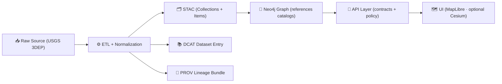

# 🏔️ USGS 3DEP DEM (3D Elevation Program) — Mapping + Ingestion Notes


📍 **Path:** `data/external/mappings/usgs/datasets/3dep_dem/`  
🎯 **Purpose:** Define *how* USGS 3DEP DEM data is acquired, normalized, cataloged (STAC/DCAT/PROV), and safely exposed in KFM.

---

## ✅ What this folder is (and is not)

### ✅ This folder **is**
- A **runbook** + **mapping contract** for bringing USGS 3DEP DEM into the KFM pipeline.
- A home for **download/manifests/config** and **metadata mapping templates** (STAC/DCAT/PROV).
- A place to document **constraints** (size, caching, CRS, vertical units, QA checks).

### ❌ This folder is **not**
- A place to commit huge rasters. Keep the repo lean:
  - store **manifests + checksums + metadata** here ✅  
  - store large binary rasters in canonical **data staging locations** (or external/object storage) ❌

---

## 🧭 Canonical KFM rule: don’t bypass the pipeline

KFM is contract-first and evidence-first. **No stage leapfrogging is allowed.**  
DEM layers must be produced via ETL, then published to catalogs, then referenced downstream.



---

## 🗂️ Expected companion artifacts (recommended)

> These filenames are **recommended** to keep this dataset “plug-and-play” across pipelines and CI.

```text
📁 data/
└─ 📁 external/
   └─ 📁 mappings/
      └─ 📦 usgs/
         └─ 📁 datasets/
            └─ 📁 3dep_dem/                               🏔️ 3DEP DEM dataset package (templates + configs)
               ├─ 📘 README.md                             👈 you are here (runbook + how to use this package)
               ├─ 📁 source/                               🧾 upstream source knowledge (endpoints, products, licensing)
               │  ├─ 📄 endpoints.md                        🔗 TNM/USGS endpoints + access notes
               │  ├─ 📄 product_matrix.md                   🧱 resolution options + coverage/availability notes
               │  └─ 📄 license_and_attribution.md          📜 what to display + what to propagate downstream
               ├─ 📁 manifests/                             ◻️ optional: AOI manifests + integrity rollups (git-friendly)
               │  ├─ 📄 manifest.kansas.json                🗺️ Kansas AOI tile/URL list (optional)
               │  └─ 🔐 checksums.sha256                    🔐 integrity hashes (optional but encouraged)
               ├─ 📁 mapping/                               🧩 metadata mapping templates (STAC/DCAT/PROV)
               │  ├─ 📄 stac.collection.template.json        🛰️ STAC Collection template (dataset-level semantics)
               │  ├─ 📄 stac.item.template.json              📦 STAC Item template (tiles/mosaics + assets)
               │  ├─ 📄 dcat.dataset.template.jsonld         🗂️ DCAT dataset entry template (JSON-LD)
               │  └─ 📄 prov.activity.template.json          🧬 PROV activity template (ingest/transform steps)
               └─ 📁 config/                                ⚙️ deterministic ingestion knobs (NO secrets)
                  ├─ 🗺️ aoi.kansas.geojson                  ◻️ optional: canonical AOI geometry
                  └─ 🧩 ingest.defaults.yaml                ◻️ optional: default pipeline settings (formats, CRS, tiling)
```

---

## 📥 Acquisition strategies (choose one, keep it deterministic)

### Option A — **On-demand fetch + cache (recommended for “big data” hygiene)**
Use an API call to fetch only what a user/AOI needs, then cache the result as a processed artifact.
- ✅ keeps repo lean
- ✅ supports “zoom-to-county” workflows
- ✅ aligns with “external source integration” philosophy

**Cache rule:** fetched elevation becomes a **first-class processed dataset** (with STAC/DCAT/PROV).

### Option B — **Bulk download for Kansas AOI (curated baseline)**
If you want a stable statewide baseline:
- pick a resolution/product tier
- fetch all required tiles for Kansas
- mosaic into manageable chunks (by county / grid)
- publish as curated, versioned processed assets

### Option C — **Dev-only sample subset**
For local dev/CI:
- keep a tiny AOI sample (small raster)  
- validate pipeline + metadata without multi-GB downloads

---

## ⚙️ Normalization pipeline (raster hygiene)

**Goal:** Make outputs web-ready and analysis-ready.

### Suggested normalization steps (typical)
1. **Validate inputs** (format, CRS, nodata, vertical units)
2. **Clip / tile** to AOI boundaries (county/grid)
3. **Reproject** as needed for web + analytics
4. **COG-ify** (Cloud-Optimized GeoTIFF) for fast HTTP range requests
5. **Derivatives (optional):**
   - hillshade
   - slope/aspect
   - contours (vector)
   - terrain tiles (for Cesium, if used)

<details>
<summary>🧰 Example command cookbook (update to match your actual pipeline)</summary>

```bash
# Inspect
gdalinfo input_dem.tif

# Reproject (example) + resample (choose resampling carefully for DEMs)
gdalwarp -t_srs EPSG:3857 -r bilinear -dstnodata -9999 input_dem.tif dem_3857.tif

# Convert to COG
gdal_translate dem_3857.tif dem_3857_cog.tif \
  -of COG -co COMPRESS=ZSTD -co OVERVIEWS=IGNORE_EXISTING

# Hillshade
gdaldem hillshade dem_3857_cog.tif hillshade_3857_cog.tif -co COMPRESS=ZSTD -of COG
```
</details>

---

## 📦 Where outputs should land (canonical staging)

Even though this README lives under `data/external/...`, **published artifacts** should follow KFM’s canonical layout:

- `data/raw/<domain>/...` *(if storing raw snapshots in-repo; otherwise keep manifest-only here)*
- `data/work/<domain>/...`
- `data/processed/<domain>/...` ✅ final outputs
- `data/stac/...` ✅ catalog
- `data/catalog/dcat/...` ✅ catalog
- `data/prov/...` ✅ lineage

> 🔒 If raw rasters are too large to version in Git, store only manifests + hashes here and keep the actual bytes in external storage or ignored local cache — but still generate STAC/DCAT/PROV pointing to stable locations.

---

## 🧾 STAC/DCAT/PROV mapping expectations (non-negotiable)

### STAC 📍
**Collection ID (recommended):** `usgs-3dep-dem`  
**Items:** one per tile / per county mosaic / per grid chunk (pick one strategy and stick to it)

**Assets (typical):**
- `dem` → COG GeoTIFF (primary)
- `hillshade` → COG (optional)
- `slope` / `aspect` → COG (optional)
- `terrain` → Cesium terrain tiles (optional; if produced)

### DCAT 📚
One dataset entry describing:
- title, description
- license + attribution
- keyword tags (e.g., `elevation`, `dem`, `usgs`, `terrain`)
- distributions that point to:
  - STAC Collection URL/path
  - or direct download endpoints to the processed COG(s)

### PROV 🧾
Each ingest run must capture:
- inputs (source URLs + checksums)
- activities (download → normalize → derive → publish)
- agents (person + software)
- parameters (AOI, resolution, resampling method, nodata rules)
- outputs (stable IDs pointing to `data/processed/...` assets)

---

## ✅ Validation gates (PR/CI friendly checklist)

### Raster sanity ✅
- [ ] CRS is known and recorded
- [ ] Vertical units + datum are recorded (don’t guess)
- [ ] nodata is explicitly set and consistent
- [ ] pixel size/resolution matches expected product tier
- [ ] no unexpected negative/absurd elevation spikes (basic stats check)

### Web readiness ✅
- [ ] outputs are COGs (or otherwise optimized for serving)
- [ ] overviews exist (or are generated by the pipeline)
- [ ] file naming is deterministic and stable

### Catalog integrity ✅
- [ ] STAC Items point to actual assets (paths/URLs resolve)
- [ ] DCAT entry links to STAC/distributions
- [ ] PROV links raw → work → processed
- [ ] cross-refs between STAC/DCAT/PROV are present (IDs align)

---

## ⚖️ Governance, FAIR/CARE, and licensing notes

- 🧩 **Classification propagation:** outputs must not be “less restricted” than inputs.
- 📜 **License + attribution:** record the authoritative license statement and required attribution *in the catalog records* (STAC/DCAT), and ensure the UI displays it when the layer is enabled.
- 🧠 **Evidence-first:** any narrative or AI analysis that references elevation must cite the cataloged dataset (STAC/DCAT entry) — not a random file path.

---

## 🔗 References (source + standards)

### External references 🌐
- USGS 3DEP / The National Map (3DEP is typically distributed via USGS TNM services)
- USGS metadata + distribution pages (varies by product and coverage)

### KFM internal standards 📘
> (Paths shown from repo root — adjust links if needed.)
- `docs/MASTER_GUIDE_v13.md` (pipeline invariants)
- `docs/standards/KFM_STAC_PROFILE.md`
- `docs/standards/KFM_DCAT_PROFILE.md`
- `docs/standards/KFM_PROV_PROFILE.md`
- `docs/governance/ROOT_GOVERNANCE.md`

---

## 🧱 TODOs (to make this “ingest-ready”)

- [ ] Add `manifests/manifest.kansas.json` (or a generator) 📄
- [ ] Add `mapping/` templates (STAC/DCAT/PROV) 🧾
- [ ] Implement/verify pipeline code under `src/pipelines/` ⚙️
- [ ] Add validators (COG check + STAC validation + PROV completeness) ✅
- [ ] Decide on serving strategy: hillshade tiles vs terrain tiles vs both 🗺️

---

### ✨ Maintainer note

Keep this README **practical**: if a new contributor can’t ingest a small AOI from this doc, add the missing step or link. 🧭

