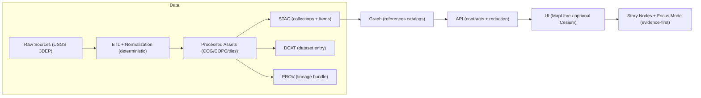

# 🛰️ USGS 3DEP LiDAR (Point Cloud + Derived Elevation) — Mapping Spec


> 📍 **Repo path:** `data/external/mappings/usgs/datasets/3dep_lidar/`  
> 🎯 **Role:** This folder is a **mapping + runbook** for ingesting **USGS 3DEP LiDAR** into KFM’s pipeline (deterministic ETL → catalogs → graph → API → UI).  
> 🧱 **Scope:** store **manifests, configs, and metadata mapping artifacts** here — **not** massive raw point clouds.

---

## 🔗 Quick Links (official + canonical)

- 🧭 **The National Map Downloader (TNM Download):** https://apps.nationalmap.gov/downloader/  
- 🧠 **USGS LidarExplorer (AOI + elevation-focused):** https://apps.nationalmap.gov/lidar-explorer/  
- ☁️ **AWS Open Data Registry (USGS 3DEP LiDAR Point Clouds):** https://registry.opendata.aws/usgs-lidar/  
- 🧾 **USGS Science Data Catalog (collection record):** https://data.usgs.gov/datacatalog/data/USGS%3Ab7e353d2-325f-4fc6-8d95-01254705638a  
- 🧩 **COPC spec (cloud-optimized point clouds):** https://copc.io/  
- 🧰 **PDAL docs:** https://pdal.io/

---

## 🧠 What is 3DEP LiDAR (in KFM terms)?

3DEP LiDAR is a national-scale elevation program delivering **full-density point clouds** (typically LAZ/LAS) plus **derived elevation products** (e.g., DEMs). In KFM, this dataset powers:

- 🏔️ **High-resolution terrain** (1–3m class products where available) for Map UI / analysis
- 🧊 **3D visualization** (point clouds → COPC/EPT → potential 3D Tiles) for Cesium-style layers
- 🧪 Evidence-driven studies: floodplain context, ridge/valley context for routes, local site topography, etc.

> ✅ Principle: **keep raw as raw, publish only governed outputs** (COGs/tiles/derived rasters) with **STAC/DCAT/PROV**.

---

## 🗂️ What lives in this folder?

This directory is a **dataset integration surface** (manifests + mapping), not the data lake.

Recommended layout 👇

```text
data/external/mappings/usgs/datasets/3dep_lidar/
├── README.md                       # you are here 📌
├── manifests/                      # AOI or project manifests (URLs, IDs, checksums)
│   ├── aoi/                         # AOI queries & exports (GeoJSON, bbox, etc.)
│   ├── downloads/                   # resolved download lists (CSV/JSON)
│   └── checksums/                   # SHA256/MD5 outputs (per-file + rollups)
├── configs/                        # deterministic ETL configs (no secrets)
│   ├── pdal/                         # pipelines (copc, ground, thinning, etc.)
│   ├── gdal/                         # rasterization + COG creation recipes
│   └── tiling/                       # tile schema decisions (z/x/y, quadtree, etc.)
├── mappings/                       # metadata mapping rules (source → KFM)
│   ├── stac/                         # how we form STAC collections/items/assets
│   ├── dcat/                         # DCAT dataset record mapping
│   └── prov/                         # provenance bundle templates / run-ids
└── docs/                           # any extra notes, diagrams, or decision logs 📝
```

> 🧊 **Big data rule:** LAZ/EPT/COPC files can be *massive*. Prefer **external object storage** + **manifests** in git.

---

## 🧭 KFM Pipeline Fit (non-negotiable ordering)



---

## 🌎 Access Paths (choose based on workload)

| Access path | Best for | Pros ✅ | Tradeoffs ⚠️ |
|---|---|---|---|
| **LidarExplorer** | AOI search + compare | AOI tools, project metadata, elevation-focused | UI-driven; bulk automation limited |
| **TNM Downloader** | General USGS downloads | Primary download UX | Manual unless paired with API |
| **TNMAccess API** | Automation | Scriptable, reproducible queries | Requires engineering + pagination/metadata handling |
| **AWS Open Data (EPT)** | Visualization + streaming analysis | Public access, streamable octree tiles | Not always complete coverage |
| **AWS Requester Pays (raw LAZ)** | Full-res raw access | Closest to original project LAZ | Costs; AWS account required |

---

## ☁️ AWS Open Data: buckets & usage

> Use AWS when you need **repeatable automation** or **cloud-near processing**.

<details>
<summary><strong>📦 Public EPT bucket (no AWS account required)</strong></summary>

- Designed for **streaming + visualization**
- Typical command patterns:

```bash
# list public bucket (no credentials)
aws s3 ls --no-sign-request s3://usgs-lidar-public/

# example: sync a single project prefix (adjust to your needs)
aws s3 sync --no-sign-request s3://usgs-lidar-public/<USGS_PROJECT_NAME>/ ./ept/<USGS_PROJECT_NAME>/
```

✅ Good when you want:
- quick previewing
- web-style streaming point sets (EPT)

</details>

<details>
<summary><strong>💳 Requester Pays raw LAZ bucket (AWS account required)</strong></summary>

- Designed for access to **raw LAZ (LASzip)** projects
- Typical command patterns:

```bash
# list projects (Requester Pays)
aws s3 ls --request-payer requester s3://usgs-lidar/

# list a project
aws s3 ls --request-payer requester s3://usgs-lidar/Projects/<PROJECT_DIR>/

# fetch a single object (Requester Pays)
aws s3api get-object \
  --bucket usgs-lidar \
  --key Projects/<PROJECT_DIR>/<FILE>.laz \
  ./raw/<FILE>.laz \
  --request-payer requester
```

⚠️ Expect AWS egress + request costs; bake these into your ingestion plan.

</details>

---

## 🧰 Processing Targets (what KFM usually wants)

### ✅ Recommended KFM-ready outputs

- 🧊 **COG rasters** (e.g., DTM/DEM, hillshade) for fast map rendering + tiling
- ☁️ **COPC** for “single-file, cloud-friendly” point cloud distribution
- 🧱 **EPT** when you need octree streaming (web visualization / slicing)
- 🗺️ **Cesium terrain tiles / 3D tiles** for 3D modes (optional but powerful)

> 🧪 Keep ETL **config-driven** (store configs in `configs/`), log every run, and publish provenance.

### Suggested toolchain

- 🧰 **PDAL** (point cloud ETL, filtering, rasterization via GDAL writer)
- 🗺️ **GDAL** (COG creation, reprojection, hillshade, overviews)
- 🧊 **COPC tooling** (PDAL COPC writer + validation tools)
- 🧱 **Entwine/EPT** (where you want EPT structures)
- 🧭 **Cesium terrain tools** (only if publishing 3D terrain layers)

---

## 🧾 Metadata + Governance Requirements

### Required “boundary artifacts” (publish gate ✅)

Before KFM considers any 3DEP-derived output “publishable”, it should have:

- 🗂️ **STAC Collection + Item(s)** describing the assets
- 🧾 **DCAT dataset entry** for discovery + licensing + distributions
- 🧬 **PROV lineage bundle** linking: raw inputs → work steps → processed outputs

> 🧷 Rule of thumb: if it shows up in a map or story, it must be cataloged + traced.

### License & attribution 📌

- Treat USGS 3DEP as **public domain** unless a specific project’s metadata indicates otherwise.
- Preserve **source attribution** in STAC/DCAT even when data is public domain.
- Never “loosen” restrictions: derived outputs must be **≥** as restricted as inputs.

---

## 🧪 Validation checklist (don’t skip)

### Point cloud sanity checks
- [ ] Confirm CRS is present & interpretable (some raw sources may be missing CRS)
- [ ] Validate file integrity (LAZ readable; no truncated objects)
- [ ] Confirm classification codes look reasonable for your use (ground vs vegetation vs buildings)
- [ ] Capture summary stats (bounds, point count, min/max Z, density estimate)

### Raster / terrain output checks
- [ ] Confirm vertical units + CRS match expectations
- [ ] COG compliance (internal tiling, overviews, HTTP range friendliness)
- [ ] Visual spot-check: hillshade artifacts, voids, seam lines at tile edges

---

## 🧾 Citation template (keep provenance tidy)

Use a stable citation pattern in dataset metadata and reports:

```text
USGS 3DEP LiDAR Point Clouds. Accessed YYYY-MM-DD via (TNM Downloader | LidarExplorer | AWS Open Data).
Project: <USGS_PROJECT_NAME>. Files: <manifest_id or checksum list>.
```

---

## 🧩 KFM Integration TODOs (for this folder)

- [ ] Add `manifests/aoi/` starter AOIs (Kansas statewide bbox + key sites)
- [ ] Add `manifests/downloads/` CSV schema: `source,project,file,url,sha256,size_bytes,crs,status`
- [ ] Add `configs/pdal/` pipeline templates:
  - [ ] `ground_only.json`
  - [ ] `to_copc.json`
  - [ ] `dtm_dem_rasterize.json`
- [ ] Add mapping rules under `mappings/` for:
  - [ ] STAC asset roles (`point-cloud`, `elevation`, `hillshade`, `terrain`, etc.)
  - [ ] DCAT distributions (download URLs + checksums)
  - [ ] PROV run IDs + agent/software attribution

---

## 🧭 Related KFM standards (repo links)

- 📦 STAC profile: `/docs/standards/KFM_STAC_PROFILE.md`
- 🧾 DCAT profile: `/docs/standards/KFM_DCAT_PROFILE.md`
- 🧬 PROV profile: `/docs/standards/KFM_PROV_PROFILE.md`
- 🧱 Architecture blueprint(s): `/docs/architecture/`

---

