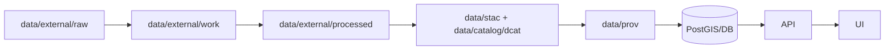

# 💧 USGS 3DHP Hydrography (3D Hydrography Program) — Mapping & Ingest README


> 📍 **Location in repo:** `data/external/mappings/usgs/datasets/3dhp_hydrography/README.md`  
> 🎯 **Purpose:** Document the **USGS 3D Hydrography Program (3DHP)** hydrography dataset (aka `usgs_3dhp_all` / `3DHP_all`) and define how we **ingest + map** it into KFM’s hydro layers.

---

## 🧭 Quick Links

- 🌐 3DHP Program Overview: https://www.usgs.gov/3dhp  
- 🧰 Access 3DHP Data Products: https://www.usgs.gov/programs/national-geospatial-program/access-3dhp-data-products  
- 🧱 3DHP Web Services (ArcGIS REST directory): https://3dhp.nationalmap.gov/  
- 🗺️ `usgs_3dhp_all` FeatureServer: https://3dhp.nationalmap.gov/arcgis/rest/services/usgs_3dhp_all/FeatureServer  
- 🗺️ `usgs_3dhp_all` MapServer (WMS available): https://3dhp.nationalmap.gov/arcgis/rest/services/usgs_3dhp_all/MapServer  
- 📦 Annual Download (ScienceBase, 2024 release DOI): https://www.sciencebase.gov/catalog/item/679a362ad34ea8c1837a222f  
- 🧾 National Map licensing/terms: https://www.usgs.gov/faqs/what-are-terms-uselicensing-map-services-and-data-national-map

---

## 🌊 What this dataset is

**3DHP Hydrography** is USGS’s next-gen hydrography layer intended to evolve beyond legacy NHD/WBD/NHDPlus HR by integrating **elevation-derived hydrography (EDH)** and delivering a **3D-enabled** vector hydro network.

This dataset is accessed either as:

- **Live web services** (ArcGIS REST FeatureServer/MapServer), or  
- **Annual downloadable releases** (ScienceBase; CONUS + Alaska; GeoPackage and FileGDB).

> [!IMPORTANT]
> The service is **3D-enabled** (`HasZ: true` on key layers). Some clients silently drop Z/M values — treat Z/M handling as a first-class ingest concern. 🧠

---

## 🧩 How KFM uses it

Primary uses inside KFM:

- 🗺️ Basemap hydrography for rivers/streams/lakes/canals
- 🧵 Network-aware hydrology (flow connectivity, stream order, divergence/confluence points)
- 🧭 Spatial context for stories (crossings, settlements near water, routes following drainages)
- 🧪 Optional analytics: catchment-area context, drainage areas, mainstem structure

---

## 🏗️ KFM Data Contract (non-negotiables)

KFM’s ingestion pattern is:



**Key rules:**
- ✅ Raw is *write-once* evidence; pipelines must not mutate raw inputs. 📦
- ✅ Pipelines must be deterministic/reproducible (no interactive prompts; stable outputs). 🧬
- ✅ Every processed dataset must ship with **STAC/DCAT + PROV** metadata. 🧾

---

## 🗂️ Expected folder layout

This README lives in **mappings** (docs + field mapping specs). The actual data lifecycle is:

```text
📁 data/
└─ 📁 external/
   ├─ 📁 raw/
   │  └─ 📦 usgs/                                      🛰️ USGS source snapshots (read-only / never overwrite)
   │     └─ 📁 3dhp_hydrography/                        🌊 3DHP Hydrography source drops
   │        └─ 📁 2024/                                 🧾 example annual snapshot (add new year folders)
   │           └─ 📁 source/                            📦 raw artifacts (zips, XML metadata, vendor checksums)
   ├─ 📁 work/
   │  └─ 📦 usgs/                                      🧪 USGS staging workspace (scratch + rebuildable)
   │     └─ 📁 3dhp_hydrography/                        🧪 intermediate artifacts (not authoritative)
   ├─ 📁 processed/
   │  └─ 📦 usgs/                                      ✅ USGS promoted outputs (downstream-ready)
   │     └─ 📁 3dhp_hydrography/                        ✅ authoritative KFM-ready outputs (GPKG/GeoJSON/Parquet/etc.)
   └─ 📁 mappings/
      └─ 📦 usgs/                                      🧩 mapping packs + ETL/QA plans (USGS)
         └─ 📁 datasets/
            └─ 📁 3dhp_hydrography/                     🌊 dataset mapping bundle (3DHP Hydrography)
               ├─ 📄 README.md                          👈 you are here
               ├─ 🧩 mapping_flowline.yml               🧱 TODO: flowline field mapping spec (source → KFM)
               ├─ 🧩 mapping_waterbody.yml              🧱 TODO: waterbody field mapping spec
               ├─ 🧩 mapping_catchment.yml              🧱 TODO: catchment field mapping spec
               └─ 🧩 mapping_hydrolocation.yml          🧱 TODO: hydrolocation field mapping spec
```

> [!TIP]
> National-scale releases can be huge. Consider using **DVC/Git LFS** or “fetch-by-checksum” patterns for large binaries while still tracking identity + provenance in Git. 🧰

---

## 📥 Acquisition options

### Option A — Annual Download (recommended for repeatability) 📦
Use the **ScienceBase annual release** (e.g., “3DHP Downloadable Data – 2024” with a DOI).  
You’ll typically pick one of:
- ✅ **GeoPackage (CONUS)** — best for open tooling (GDAL/QGIS/PostGIS)
- ✅ **FileGDB (CONUS)** — if you need ESRI-native workflows

**Pros:** stable snapshot, DOI, repeatable builds  
**Cons:** big downloads, less “current” than services

---

### Option B — Web Service extract (recommended for incremental updates) 🌐
Use `FeatureServer` queries to pull a **Kansas AOI** subset on demand.

**Pros:** current-ish, AOI-sized pull  
**Cons:** pagination/limits, more moving parts

#### Example: Flowline AOI query (GeoJSON)
```bash
# Kansas-ish bbox (WGS84): xmin,ymin,xmax,ymax
BBOX="-102.051,36.993,-94.588,40.003"

curl -L "https://3dhp.nationalmap.gov/arcgis/rest/services/usgs_3dhp_all/FeatureServer/50/query" \
  --data-urlencode "where=1=1" \
  --data-urlencode "geometry=${BBOX}" \
  --data-urlencode "geometryType=esriGeometryEnvelope" \
  --data-urlencode "inSR=4326" \
  --data-urlencode "spatialRel=esriSpatialRelIntersects" \
  --data-urlencode "outFields=*" \
  --data-urlencode "returnGeometry=true" \
  --data-urlencode "outSR=4326" \
  --data-urlencode "f=geojson" \
  --data-urlencode "resultRecordCount=2500" \
  --data-urlencode "resultOffset=0"
```

> [!NOTE]
> The service reports `MaxRecordCount: 2500`. Use `resultOffset` pagination and/or refine by AOI + attribute filters.

---

## 🧱 Layer inventory (service schema)

The `usgs_3dhp_all` service exposes these core layers:

| Layer | Geometry | Visible by default | Notes |
|---|---:|:---:|---|
| **Flowline** | Polyline (Z+M) | ✅ | Streams/canals/connectors; network attributes |
| **Waterbody** | Polygon (Z) | ✅ | Lakes/rivers/canals/etc. |
| **Catchment** | Polygon (Z) | ⛔ | Catchments; includes drainage-area attributes |
| **DrainageArea** | Polygon (Z) | ⛔ | Drainage areas; includes an HUC-equivalent field |
| **HydroLocation (3 layers)** | Point (Z) | ✅ | Springs/sinks/outlets; headwaters/confluences; reachcode points |

---

## 🔑 Keys, joins, and “don’t lose this” fields

### Primary identifiers
- `id3dhp` (string) — primary ID (present on all major layers)
- `mainstemid` — mainstem grouping key (common across layers)
- `workunitid` — production/work unit identifier

### Common joins
- Flowline → Waterbody: `flowline.waterbodyid3dhp == waterbody.id3dhp`
- Flowline → Catchment: `flowline.catchmentid3dhp == catchment.id3dhp`

---

## 🧾 Feature type codes (useful for KFM classification)

### Flowline `featuretype`
| Code | Label |
|---:|---|
| 1 | Channel Line |
| 2 | Canal |
| 3 | Drainageway |
| 4 | Surface Connector |
| 5 | Waterbody Connector |
| 6 | Elevation Breaching Connector |
| 7 | Hydro Unenforced Connector |

### Waterbody `featuretype`
| Code | Label |
|---:|---|
| 1 | River |
| 2 | Canal |
| 3 | Lake |
| 4 | Ocean or Great Lake |

### HydroLocation codes (by layer)
**Sink/Spring/Waterbody Outlet layer**
- 8 = Sink
- 7 = Spring
- 3 = Waterbody Outlet

**Headwater/Terminus/Divergence/Confluence/Catchment Outlet layer**
- 6 = Headwater
- 5 = Terminus
- 4 = Divergence
- 2 = Confluence
- 1 = Catchment Outlet

**Reach Code / External Connection layer**
- 11 = Reachcode End
- 10 = Reachcode Start
- 9 = External Connection

---

## 🧪 Suggested KFM normalization (baseline)

> [!TIP]
> This is a *starter* mapping philosophy. The actual field-level mapping should live in `mapping_*.yml` files next to this README.

### Minimal “KFM-ready” columns (recommended)
For each feature layer we ingest, create:

- `kfm_id` — stable internal UUID (or deterministic hash)
- `source` — `"USGS"`
- `source_dataset` — `"3DHP Hydrography (usgs_3dhp_all)"`
- `source_version` — (e.g., `doi:10.5066/P148NT7B` or `service_refresh:2025-09-23`)
- `source_id` — `id3dhp`
- `name` — from `gnisidlabel` when present
- `feature_type_code`, `feature_type_label`
- Geometry reprojected to KFM standard CRS (commonly `EPSG:4326`, unless KFM specifies otherwise)

---

## 🧭 CRS, geometry, and Z/M handling

### Source CRS
- Service advertises Web Mercator (`EPSG:3857`) but supports output SR transforms (`outSR=4326`, etc.)

### Z/M
- Flowline: `HasZ: true`, `HasM: true`
- Waterbody/Catchment/DrainageArea/HydroLocation: `HasZ: true`, `HasM: false`

**Guidance:**
- Preserve Z if you plan to do gradient/3D analysis.
- If KFM only needs 2D display, you may drop Z in **processed display layers**, but keep a Z-preserved copy (or derivable workflow) for scientific use cases.

---

## ✅ QA/QC checklist (before merging)

- [ ] Validate geometries (no self-intersections; no invalid rings; no NaNs)
- [ ] Confirm CRS is correct + documented
- [ ] Confirm `id3dhp` uniqueness per layer
- [ ] Confirm join keys (`waterbodyid3dhp`, `catchmentid3dhp`) resolve at expected rates
- [ ] Clip strictly to Kansas AOI (unless intentionally wider)
- [ ] Generate STAC Item/Collection + DCAT record + PROV log
- [ ] Record checksums for raw downloads (and keep URLs/DOIs)

---

## 🧾 Licensing & attribution

USGS/The National Map data is public domain with requested acknowledgment.

Recommended citation string:
> “Data available from U.S. Geological Survey, National Geospatial Program.”

---

## 🔁 Update cadence (planning)

- 🗓️ **Web services:** intended for periodic refresh as new EDH and related attributes are added
- 🗓️ **Downloadable releases:** published as annual snapshots (DOIs)

**KFM policy suggestion:**
- Prefer **annual DOI releases** for published builds and citations
- Use **service extracts** for internal previews, experiments, and “current conditions” overlays

---

## 📚 References (authoritative)

- 3D Hydrography Program (3DHP): https://www.usgs.gov/3dhp  
- Access 3DHP Data Products (downloads + services): https://www.usgs.gov/programs/national-geospatial-program/access-3dhp-data-products  
- 3DHP web services directory: https://3dhp.nationalmap.gov/  
- ScienceBase annual 3DHP download (2024 release DOI): https://www.sciencebase.gov/catalog/item/679a362ad34ea8c1837a222f  
- Terms of Use / Licensing for The National Map: https://www.usgs.gov/faqs/what-are-terms-uselicensing-map-services-and-data-national-map

---

## 🧱 TODO (for this folder)

- [ ] Add `mapping_flowline.yml`
- [ ] Add `mapping_waterbody.yml`
- [ ] Add `mapping_catchment.yml`
- [ ] Add `mapping_drainagearea.yml`
- [ ] Add `mapping_hydrolocation.yml`
- [ ] Add a small Kansas AOI sample extract under `data/external/processed/...` (for tests)
- [ ] Add STAC/DCAT/PROV templates for this dataset

