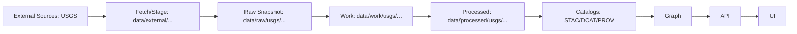

# 🗺️ USGS Datasets — External Intake, Manifests & Mapping Layer


> 📌 **You are here:** `data/external/mappings/usgs/datasets/README.md`  
> 🎯 **Goal:** Make USGS-sourced datasets **repeatably ingestible** (download → verify → process → publish) with **manifests + provenance-first metadata**, while keeping big binaries manageable.

---

## 🧭 What this folder is

This folder is the **USGS intake + mapping control-plane** for Kansas Frontier Matrix (KFM):

- 📥 **External staging**: large USGS downloads can land here first (often `.gitignore`’d / cache-like).
- 🧾 **Manifests & checksums**: tracked “source-of-truth” records for what we downloaded and when.
- 🧩 **Mapping configs**: how a given USGS product becomes a KFM dataset (formats, CRS policy, tiling, QA gates).
- 🧬 **Provenance hooks**: everything needed to generate **STAC + DCAT + PROV** “boundary artifacts” during publish.

> ✅ **Rule of thumb:**  
> **Big files live like data.**  
> **Manifests + metadata live like code.**  
> **Nothing reaches UI/graph without catalogs + provenance.**

---

## 🚫 What this folder is NOT

- ❌ Not the canonical “published” catalog home  
  (those live in KFM canonical locations like `data/stac/`, `data/catalog/dcat/`, `data/prov/`).
- ❌ Not a random dumping ground of rasters/vectors with no lineage.
- ❌ Not a place for ad-hoc manual edits to “fix” data without documenting the transform.

---

## 🗂️ Directory layout

> 🧩 This is a **pattern**. Your repo may add/omit subfolders, but keep the intent.

```text
📁 data/
└─ 📁 external/
   └─ 📁 mappings/
      └─ 📦 usgs/                                         🛰️ USGS mapping packs + dataset packages
         └─ 📁 datasets/
            ├─ 📄 README.md                                👈 you are here (how this registry works)
            ├─ 🧾 registry.usgs.yml                        ✅ dataset roster (tracked inventory)
            ├─ 📁 templates/                               🧬 reusable config stubs (starter kits)
            └─ 📁 usgs_historical_topo/                    🗺️ example dataset package (reference implementation)
               ├─ 📄 README.md                              📘 dataset runbook + scope + outputs
               ├─ 🧾 source.yml                             🔗 upstream source info (who/where/what license)
               ├─ 🧩 ingest.yml                             ⚙️ fetch + process plan (deterministic; no secrets)
               ├─ 📁 manifest/                              🧾 what we downloaded (git-friendly)
               │  ├─ 📄 files.jsonl                          🧾 one line per file (url, size, hash, timestamp)
               │  └─ 🔐 checksums.sha256                     ✅ integrity hashes (rollup)
               ├─ 📁 cache/                                 📥 big downloads (usually gitignored)
               ├─ 📁 qa/                                    🧪 validation reports (small + tracked)
               └─ 📁 notes/                                 📝 edge cases, decisions, tickets/links
```

---

## 🧠 How this fits the KFM pipeline (mental model)



🔒 **Non-negotiable:** anything exposed downstream must be **cataloged + provenanced** first.

---

## 📚 USGS dataset registry

Keep a lightweight registry so we always know what’s “in play.”

> ✅ Track *IDs + intent* here (small & reviewable).  
> 🧊 Don’t try to list every single tile/quad here — that belongs in per-dataset manifests.

| Dataset ID | Theme | Type | Typical Outputs | Status |
|---|---|---:|---|---|
| `usgs_historical_topo` | Historical maps | Raster | COG (+ optional tiles) | 🧪 pilot |
| `usgs_3dep_dem` | Elevation / terrain | Raster | COG + hillshade derivatives | 🧩 planned |
| `usgs_nhd` | Hydrography | Vector | GPKG/FGb + API-ready layers | 🧩 planned |
| `usgs_gnis` | Gazetteer / names | Table/Vector | parquet/csv + joinable lookups | 🧩 planned |

> 💡 Tip: keep dataset IDs **stable**, even if products/editions evolve.

---

## ✅ Definition of Done (DoD) for a USGS dataset package

A dataset in this folder is “ready” when:

- [ ] 📄 **`source.yml` exists** (source, license, attribution, retrieval method)
- [ ] ⚙️ **`ingest.yml` exists** (reproducible steps, params, target CRS policy)
- [ ] 🧾 **manifest exists** (`manifest/files.jsonl` + `checksums.sha256`)
- [ ] 🧪 **QA checks recorded** (`qa/` has at least one run report)
- [ ] 📦 **processed outputs land in** `data/processed/usgs/<dataset_id>/...`
- [ ] 🌐 **STAC + DCAT + PROV** are produced on publish
- [ ] 🔐 **governance tags** are defined (sensitivity/classification) and propagate

---

## ➕ Add a new USGS dataset (recipe)

### 1) Create a dataset package folder 📁
```bash
mkdir -p data/external/mappings/usgs/datasets/usgs_<dataset_id>/{manifest,qa,notes,cache}
touch data/external/mappings/usgs/datasets/usgs_<dataset_id>/{README.md,source.yml,ingest.yml}
```

### 2) Fill `source.yml` 🔗 (minimum fields)
**Keep this file human-readable and diff-friendly.**

```yaml
id: usgs_<dataset_id>
title: "USGS <Product Name>"
source_org: "U.S. Geological Survey (USGS)"
source_kind: "download|api|wms|wmts"
license: "PUBLIC_DOMAIN|USGS_TERMS|<other>"
attribution: "USGS"
retrieval:
  method: "manual|scripted"
  uri: "<stable landing page or API endpoint>"
  retrieved_at: "YYYY-MM-DD"
coverage:
  spatial: "Kansas|CONUS|<bbox>"
  temporal: "1880-2000|YYYY-YYYY|present"
sensitivity:
  classification: "public|restricted|sensitive"
  notes: "If sensitive, explain why + required handling."
```

### 3) Fill `ingest.yml` ⚙️ (make it deterministic)
```yaml
fetch:
  tool: "python|curl|aria2|custom"
  params:
    area_of_interest: "KS"
    filters:
      - "edition: 1950-1959"
      - "scale: 1:24000"
verify:
  checksums: true
  schema: false
process:
  raster:
    to_cog: true
    build_overviews: true
    nodata: "auto"
    target_crs_policy: "preserve_source + publish_wgs84_geom"
  vector:
    target_format: "GPKG"
    make_valid: true
publish:
  catalogs:
    stac: true
    dcat: true
    prov: true
  outputs:
    processed_root: "data/processed/usgs/usgs_<dataset_id>/"
```

### 4) Populate `manifest/` 🧾
A manifest is the “receipt” for what you downloaded.

**Recommended manifest fields** (JSONL):
- `path` (relative)
- `sha256`
- `size_bytes`
- `retrieved_at`
- `source_uri`
- `content_type` (raster/vector/pdf/etc)
- `crs` (if known)
- `bbox_wgs84` (if known)

Example line:
```json
{"path":"cache/1957/quad_foo.tif","sha256":"...","size_bytes":1234567,"retrieved_at":"1957-01-01","source_uri":"...","content_type":"raster","crs":"EPSG:26914"}
```

### 5) Run QA gates 🧪
Store results in `qa/` as small artifacts (text + summary JSON).

**Raster QA ideas**
- `gdalinfo` snapshot
- COG validity check (driver, internal tiling, overviews)
- nodata + stats sanity

**Vector QA ideas**
- geometry validity
- attribute schema checks (required columns)
- bbox sanity

### 6) Promote to canonical raw/work/processed 🧱
If `data/external/...` is a cache/staging area, then:
- copy/sync “frozen inputs” into `data/raw/usgs/<dataset_id>/...`
- write intermediates to `data/work/usgs/<dataset_id>/...`
- publish analysis-ready outputs to `data/processed/usgs/<dataset_id>/...`

### 7) Publish catalogs 🌐
Publishing creates the “boundary artifacts”:
- 🗺️ STAC Collection + Item(s)
- 🧾 DCAT dataset entry
- 🧬 PROV lineage bundle

> 🧷 Store these in canonical paths (project standard), not here:
> - `data/stac/collections/…`
> - `data/stac/items/…`
> - `data/catalog/dcat/…`
> - `data/prov/…`

---

## 🧭 CRS & projection policy (practical rules)

> 📏 **Never do distance/area work in degrees** (EPSG:4326).  
> Use a **projected CRS in meters** for rasterization/resampling and for accurate measurement.

### ✅ Required metadata behaviors
- Always **record the source CRS** (even if you reproject later).
- Always **publish WGS84 geometry** for discovery/extent (bbox + footprints).
- If Kansas spans multiple zones/regions: prefer a **project-level analysis CRS** to avoid mixed-zone headaches.

### Suggested strategy (works well in most stacks)
- **Discovery/metadata footprints:** EPSG:4326
- **Web map rendering tiles:** EPSG:3857
- **Analysis/measurements:** project standard (choose once; document globally)

> 🧩 If a dataset arrives in an unexpected CRS (common with historic scans), document it in `notes/` and preserve a clear PROV step describing the reprojection.

---

## 🧪 Data product standards (what “good” looks like)

### 🟦 Raster
- ✅ Prefer **COG** for distribution (Cloud Optimized GeoTIFF)
- ✅ Add internal tiling + overviews
- ✅ Explicit nodata
- ✅ Compression appropriate to content (lossless for categorical; careful with historical scans)

**COG conversion example**
```bash
gdal_translate input.tif output.cog.tif \
  -of COG \
  -co COMPRESS=DEFLATE \
  -co BIGTIFF=IF_SAFER \
  -co RESAMPLING=NEAREST
```

### 🟩 Vector
- ✅ Prefer **GeoPackage (GPKG)** or **FlatGeobuf (FGb)** for “real” datasets
- ⚠️ Shapefiles only when unavoidable (many limits; easy to corrupt)
- ✅ Run `make_valid` / topology checks when needed
- ✅ Normalize encoding to UTF-8

**Vector conversion example**
```bash
ogr2ogr -f GPKG output.gpkg input.shp -lco SPATIAL_INDEX=YES
```

---

## 🔐 Governance & sensitivity (CARE/FAIR aligned)

KFM treats governance as a **hard constraint**, not a suggestion:

- 🛡️ **Classification propagation:** outputs cannot be less restricted than inputs.
- 🧭 **Sensitive locations:** ensure redaction/generalization is applied consistently across:
  - processed data
  - STAC/DCAT metadata
  - API behavior
  - UI presentation

> ✅ If a layer could reveal protected sites (archaeology, culturally sensitive areas, etc.), treat it as **restricted** unless explicitly cleared.

---

## 🧾 Dataset package templates (copy/paste starters)

<details>
<summary>📄 Template: <code>README.md</code> (per-dataset)</summary>

```markdown
# 🧩 <Dataset Title>

## Overview
- **ID:** usgs_<dataset_id>
- **Source:** USGS
- **Theme:** <e.g., topo / hydro / dem>
- **Coverage:** <KS/CONUS/bbox>
- **Temporal:** <range>

## Inputs
- Where it comes from (URL/API)
- License/attribution

## Processing
- Steps (deterministic)
- CRS decisions
- Output formats

## Outputs
- data/raw/usgs/...
- data/processed/usgs/...
- STAC/DCAT/PROV IDs (once published)

## QA
- Checks performed
- Known caveats

## Notes
- Edge cases, anomalies, known issues
```
</details>

<details>
<summary>🧾 Template: <code>manifest/files.jsonl</code></summary>

```json
{"path":"cache/<...>","sha256":"<...>","size_bytes":0,"retrieved_at":"YYYY-MM-DD","source_uri":"<...>","content_type":"raster|vector|doc","crs":"EPSG:xxxx","bbox_wgs84":[minx,miny,maxx,maxy]}
```
</details>

---

## 🧩 Troubleshooting (common pain points)

- 🧨 **“.prj missing or wrong”**  
  → treat as an ingest bug; document and fix deterministically (don’t handwave CRS).

- 🧨 **Historic scans don’t line up**  
  → georeferencing is a processing step, not a metadata tweak. Capture control points + method in PROV.

- 🧨 **Mixed resolutions / inconsistent tile grids**  
  → normalize into a standard tiling strategy at publish, and keep the source as-is in raw.

---

## 📌 TODOs (nice upgrades)
- [ ] Add a lightweight `registry.usgs.yml` validator
- [ ] Add `make usgs-validate` target to run raster/vector QA gates
- [ ] Add a small “golden sample” tile set for CI smoke tests
- [ ] Add dataset-specific SOPs under `docs/sops/` (georef, COG, tiling, etc.)

---

## 🏷️ Legend
- 📥 download/cache
- 🧾 manifest/checksums
- ⚙️ reproducible config
- 🧪 QA gate
- 🌐 publish catalogs
- 🧬 provenance/lineage
- 🔐 governance/sensitivity

