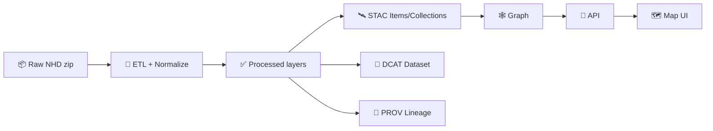

# 🛰️ USGS NHD Legacy — Dataset Mapping (KFM)


-ff9800)

-0a7c2f)


> [!IMPORTANT]  
> **This folder is “mapping + runbook,” not the dataset itself.**  
> Store raw downloads under `data/external/raw/...` and publish normalized outputs + metadata via the KFM pipeline (ETL → catalogs → graph → API → UI). 🧭

---

## ✨ What this README is for

This README documents how **USGS National Hydrography Dataset (NHD) — Legacy** is handled inside KFM:

- ✅ where to download it
- ✅ where to stage it (raw → work → processed)
- ✅ which feature classes matter (Flowlines, Waterbodies, etc.)
- ✅ how we normalize fields into KFM-friendly layers
- ✅ what metadata artifacts must be generated (STAC / DCAT / PROV)
- ✅ validation + governance checklist

---

## 🧊 Why “Legacy”?

USGS has **retired** the legacy-maintenance workflow for NHD (it remains available for reference/download, but is **no longer maintained**). In KFM we treat this dataset as a **frozen baseline** hydrography layer for:

- historical map context 🗺️
- consistent surface-water features across story timelines 🧾
- “good-enough” hydrography overlays (flowlines + waterbodies) for Kansas-focused exploration 🌾

> [!TIP]  
> If you need the most current hydrography, plan a parallel pipeline for **USGS 3D Hydrography Program (3DHP)** products and treat *this* dataset as a stable reference layer.

---

## 🧾 Dataset snapshot (quick facts)

| Item | Value |
|---|---|
| Provider | USGS (The National Map / National Hydrography) 🇺🇸 |
| Product | National Hydrography Dataset (NHD) — Legacy |
| Typical scale | 1:24,000 (or more detailed) in most of CONUS 🧭 |
| Delivery formats | **File Geodatabase (recommended)**, Shapefile |
| Core feature classes | `NHDFlowline`, `NHDWaterbody`, `NHDArea`, `NHDLine`, `NHDPoint` |
| Notes | FileGDB preserves the full model (domains/relationships); Shapefile is simplified |

---

## 🗂️ Directory layout

This dataset follows the KFM staging pattern, namespaced under `data/external/`:

```text
data/
└─ external/
   ├─ raw/
   │  └─ usgs/
   │     └─ datasets/
   │        └─ nhd_legacy/                 📦 downloaded zips live here (do not commit)
   ├─ work/
   │  └─ usgs/
   │     └─ datasets/
   │        └─ nhd_legacy/                 🧪 scratch / intermediate outputs
   ├─ processed/
   │  └─ usgs/
   │     └─ datasets/
   │        └─ nhd_legacy/                 ✅ normalized outputs used by KFM
   └─ mappings/
      └─ usgs/
         └─ datasets/
            └─ nhd_legacy/
               ├─ README.md                👈 you are here
               ├─ (future) layer_map.yml
               ├─ (future) field_map.yml
               ├─ (future) etl_config.yml
               └─ (future) validation/     🔎 SQL / geopandas checks, etc.
```

And the **required KFM “boundary artifacts”** must be written to canonical locations:

```text
data/
├─ stac/
│  ├─ collections/                         🛰️ collection metadata
│  └─ items/                               📍 per-asset/per-tile/per-subset items
├─ catalog/
│  └─ dcat/                                🧾 dataset discovery records (JSON-LD)
└─ prov/                                   🧬 lineage bundles (inputs → activities → outputs)
```

---

## 📥 Getting the data (download options)

### Option A — The National Map Downloader (recommended UX)
Use the USGS **TNM Download** interface to pull NHD by **state** or **hydrologic unit** (HU4/HU8), choosing:
- **Format:** File Geodatabase (preferred)  
- **Area:** Kansas (State) *or* relevant Hydrologic Units  
- **Theme:** Hydrography → NHD

### Option B — Direct downloadable product directories
USGS also publishes direct downloads (often via S3 directories) for NHD by:
- HU4
- HU8
- State
- Entire Nation

> [!NOTE]  
> Some users report decompression issues with certain tools (ex: 7zip) on some TNM products. If you hit errors, use an alternate unzip method.

### Raw storage convention ✅
Keep raw artifacts immutable and named with enough provenance:

```text
NHD_<AREA>_<FORMAT>_<DOWNLOAD_DATE>.zip
# examples:
NHD_KS_FileGDB_2026-01-29.zip
NHD_HU8_10270102_SHP_2026-01-29.zip
```

Also store a checksum sidecar:

```text
NHD_KS_FileGDB_2026-01-29.zip.sha256
```

---

## 🧠 What’s inside NHD (feature classes we care about)

Below are the common “backbone” layers used in KFM.

### 🧵 Line network
- **`NHDFlowline`**: the primary drainage network (streams/rivers + artificial paths + more)
- **`NHDLine`**: linear hydro features not core to the network

### 🫧 Area / polygons
- **`NHDWaterbody`**: lake/pond/reservoir/swamp/marsh/etc.
- **`NHDArea`**: additional water polygons (including wide rivers)

### 📍 Points
- **`NHDPoint`**: hydro-related point features

> [!TIP]  
> If you only need a minimal hydro overlay, ingest just:
> **Flowlines + Waterbodies** (and optionally Area rivers).

---

## 🧩 Field mapping (key attributes)

NHD has a rich schema; for KFM, we map **a stable minimal set** while preserving the original columns as “source attributes”.

### Core identifiers & classification
| NHD field | Meaning (KFM usage) | Notes |
|---|---|---|
| `PERMANENT_IDENTIFIER` | **Primary stable ID** (`source_id`) | Prefer this as canonical key |
| `COMID` / `ComID` | Secondary numeric ID | Not always present the same way across products |
| `GNIS_NAME` | Display name | Human-readable water feature name |
| `GNIS_ID` | GNIS identifier | External linkage |
| `FTYPE` / `FType` | Feature type | Use to derive KFM `feature_type` |
| `FCODE` / `FCode` | Feature code | Encodes type + characteristics |

### Network / linear referencing essentials
| NHD field | Meaning (KFM usage) |
|---|---|
| `REACHCODE` / `ReachCode` | Reach identifier for routing/network linkage |
| measures (varies by product) | Used for events/linear referencing on flowlines |

### Time / version signals
| NHD field | Meaning (KFM usage) |
|---|---|
| `FDATE` / `FDate` | Feature last-modified date (as provided) |
| `RESOLUTION` / `Resolution` | NHD resolution category |

### Geometry helpers
| NHD field | Meaning |
|---|---|
| `LENGTHKM` / `LengthKM` | Flowline length |
| `AREASQKM` / `AreaSqKm` | Polygon area |

> [!IMPORTANT]  
> **Don’t drop columns casually.** If a field isn’t mapped into a first-class KFM column, keep it under a nested/JSON “source_attributes” bucket so provenance and interpretability remain intact.

---

## 🔄 Normalization rules (KFM expectations)

### Output targets (suggested)
Produce *clean, analytics-friendly* layers in `data/external/processed/usgs/datasets/nhd_legacy/`:

```text
flowlines.(parquet|gpkg|fgb)
waterbodies.(parquet|gpkg|fgb)
areas.(parquet|gpkg|fgb)          # optional
points.(parquet|gpkg|fgb)         # optional
```

### Minimal canonical columns (recommended)
For each output layer, normalize into:

- `kfm_id` (string) — stable internal ID (derived from `PERMANENT_IDENTIFIER`)
- `source` (string) — `"USGS:NHD"`
- `source_version` (string) — derived from download date + package info
- `source_id` (string) — `PERMANENT_IDENTIFIER`
- `name` (string|null) — `GNIS_NAME`
- `gnis_id` (string|null)
- `reachcode` (string|null)
- `ftype` (int|string|null)
- `fcode` (int|null)
- `geom` — geometry
- `source_attributes` — JSON blob of remaining fields

### CRS rule 📐
Do **not** assume the CRS is uniform across all extracts. Always:
1) read CRS from the source (GDB layer spatial ref / `.prj`),  
2) reproject to the KFM canonical CRS for serving (commonly EPSG:4326 for storage + EPSG:3857 for tiles, if applicable).

---

## 🧬 Provenance + catalogs (STAC / DCAT / PROV)

KFM requires these artifacts **before** anything can be loaded into graph/UI.

### ✅ STAC
Create:
- one **STAC Collection** for `usgs-nhd-legacy`
- one or more **STAC Items** (recommended: per extract scope, e.g., `KS`, HU8, or national)

Suggested IDs:
- `collection_id`: `usgs-nhd-legacy`
- `item_id`: `usgs-nhd-legacy__KS__2026-01-29` (or HU8)

### ✅ DCAT
Create one DCAT dataset record pointing to:
- the STAC collection and/or item URLs/paths
- the processed asset distributions

### ✅ PROV
Create a PROV bundle that captures:
- raw zip(s) as `prov:Entity`
- ETL run as `prov:Activity` (include tool versions + config + commit hash if available)
- processed outputs as `prov:Entity`
- agent(s): developer + pipeline + runtime environment

Suggested filenames:
```text
data/stac/collections/usgs-nhd-legacy.collection.json
data/stac/items/usgs-nhd-legacy__KS__2026-01-29.item.json
data/catalog/dcat/usgs-nhd-legacy.dataset.jsonld
data/prov/usgs-nhd-legacy__KS__2026-01-29.prov.jsonld
```

---

## 🧪 Validation checklist (Definition of Done ✅)

### Data acquisition
- [ ] Raw zip stored under `data/external/raw/usgs/datasets/nhd_legacy/`
- [ ] SHA256 recorded (`.sha256` sidecar)
- [ ] Download source URL captured in PROV (and optionally in a `sources.yml` file)

### Geometry + schema
- [ ] All output geometries valid (repair if needed; document repairs)
- [ ] No empty geometries
- [ ] CRS explicitly set + reprojection documented
- [ ] `kfm_id` stable + reproducible

### Hydrography-specific sanity checks
- [ ] `NHDFlowline` count > 0 for AOI
- [ ] `REACHCODE` present (where expected)
- [ ] `FCode/FType` present (where expected)

### Catalog + provenance gates
- [ ] STAC Collection + Item(s) exist
- [ ] DCAT dataset exists
- [ ] PROV bundle exists
- [ ] Internal links in metadata resolve (no broken references)

---

## ⚖️ License, attribution, governance

### License
USGS hydrography is generally distributed as **public domain / open data** (but still keep attribution + disclaimers).

### Governance (KFM)
- Classification: **Public** (unless merged with other restricted layers)
- Any reclassification, redaction, or sensitive overlays require governance review 🛡️

> [!WARNING]  
> Even “public” layers can become sensitive when joined with other datasets. Keep classification propagation strict.

---

## 🗺️ KFM pipeline reminder (non‑negotiable ordering)



---

## 🔗 References (official + stable)

- USGS NHD overview: https://www.usgs.gov/national-hydrography/national-hydrography-dataset  
- Access National Hydrography products (downloads/services): https://www.usgs.gov/national-hydrography/access-national-hydrography-products  
- NHD Data Dictionary (feature classes): https://www.usgs.gov/ngp-standards-and-specifications/national-hydrography-dataset-nhd-data-dictionary-feature-classes  
- Hydrography Standards & Specifications: https://www.usgs.gov/ngp-standards-and-specifications/hydrography-standards-and-specifications  

---

## 🧱 TODOs (next commits)

- [ ] Add `layer_map.yml` (which NHD feature classes → which KFM layers)
- [ ] Add `field_map.yml` (NHD columns → KFM normalized schema)
- [ ] Add `etl_config.yml` (clip AOI, CRS targets, output formats)
- [ ] Add validation scripts (GeoPandas + PostGIS SQL)
- [ ] Add STAC/DCAT/PROV templates specific to NHD Legacy

