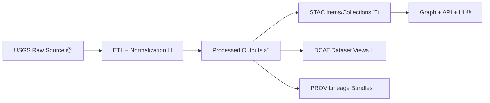

# 🛰️ USGS Shared Mapping Assets (KFM)  
📁 `data/external/mappings/usgs/shared/`

-0b7285)

-7048e8)


> [!NOTE]
> This folder is **NOT a place to drop raw USGS files**. It’s the **shared “mapping brain”** 🧠 for USGS-derived layers in the `external` data domain: templates, crosswalks, conventions, and reusable metadata scaffolding.

---

## 🎯 Purpose

This directory holds **shared mapping assets** used by *multiple* USGS dataset ingests (e.g., elevation/DEM, hydrography, names, imagery, topo scans, etc.).  
Its job is to keep our USGS ingestion consistent so that downstream systems (catalog → graph → API → map UI) don’t drift.

✅ Think: **schemas + templates + conventions + QA rules**  
🚫 Not: **raw downloads + one-off dataset hacks**

---

## 🧭 How this fits the KFM pipeline



---

## 🗂️ What belongs here (✅)

Shared assets that **many** USGS ingests reuse:

- 🧩 **STAC / DCAT / PROV templates** (baseline structure, common fields, default extensions)
- 🔁 **Field crosswalks / naming conventions** (how we normalize attributes)
- 🧪 **QA rules** (geometry validity checks, required columns, domain constraints)
- 🌍 **CRS & tiling guidance** (how to publish for web + analysis without “projection chaos”)
- 🎨 *(Optional)* **style hints** (MapLibre layer defaults, symbology notes, legend metadata)

---

## 🚫 What does *not* belong here (❌)

- 🧱 Raw downloads (GeoTIFFs, LAS/LAZ, Shapefiles, etc.)
- 🧳 Large binary payloads (unless explicitly managed via LFS pointers or external manifests)
- 🧷 Dataset-specific overrides (those belong in the dataset’s own mapping folder)
- 🔑 Secrets, tokens, credentials

---

## 🧱 Recommended directory layout

> [!TIP]
> If these folders don’t exist yet, this README is the contract for how we *intend* to organize “shared”.

```text
📁 data/external/mappings/usgs/
├── 📁 shared/                         # 👈 you are here
│   ├── 📄 README.md
│   ├── 📁 templates/
│   │   ├── 📄 stac.collection.template.json
│   │   ├── 📄 stac.item.template.json
│   │   ├── 📄 dcat.dataset.template.jsonld
│   │   └── 📄 prov.bundle.template.json
│   ├── 📁 crosswalks/
│   │   ├── 📄 fields.common.csv
│   │   └── 📄 domains.common.yaml
│   ├── 📁 qa/
│   │   ├── 📄 rules.common.yaml
│   │   └── 📄 geometry_checks.md
│   ├── 📁 crs/
│   │   ├── 📄 crs_policy.md
│   │   └── 📄 epsg_recommendations.md
│   └── 📁 style/
│       ├── 📄 maplibre.layer.defaults.json
│       └── 📄 qgis.styles.notes.md
└── 📁 <dataset_slug>/                 # dataset-specific mapping packages
    ├── 📄 source.manifest.yaml
    ├── 📄 mapping.spec.yaml
    └── 📄 README.md
```

---

## 🧾 Shared conventions (the stuff that prevents chaos)

### 1) Naming & IDs 🏷️
Use **predictable** and **stable** identifiers so that STAC/DCAT/PROV + graph references don’t break.

**Suggested pattern**
- `kfm.dataset_id`: `usgs-<program>-<region>-<edition_or_year>`
- `kfm.source`: `USGS`
- `kfm.domain`: `external`

> [!IMPORTANT]
> Avoid embedding “temporary” terms like `final_v2_really_final`. Prefer version fields + immutable source hashes.

---

### 2) Formats we prefer 📦

**Vectors**
- ✅ GeoJSON for interchange / UI prototyping
- ✅ GeoParquet for analytics-scale processing
- ✅ PostGIS tables for query + spatial joins (when applicable)

**Rasters**
- ✅ Cloud-Optimized GeoTIFF (COG) for any publishable raster output
- ✅ Build tiles (MBTiles/PMTiles/vector tiles) as a *derivative*, not as the source of truth

**Scanned / Historical maps**
- ✅ Keep the “evidence” original
- ✅ Publish georeferenced derivatives (COG) with *explicit* georeferencing notes

---

### 3) CRS policy 🌍

> [!NOTE]
> CRS decisions are **product decisions** (analysis correctness + UI usability). This folder keeps that policy centralized.

**Recommended defaults**
- 🌐 **API & portable interchange:** `EPSG:4326` (WGS84)
- 🗺️ **Web tiling & MapLibre:** `EPSG:3857` derivatives for tiles
- 📐 **Distance/area analysis:** a suitable projected CRS (document it!)

**Golden rule**
- Preserve original CRS in **raw evidence**
- Record every transformation in **PROV**
- Never “silently reproject” without leaving a metadata trail

---

## 📚 Metadata checklist (shared “minimum viable truth”)

When writing mapping specs and templates, ensure you have:

- 🧾 **Identification**: title, abstract, themes/keywords, dataset_id
- 🧬 **Lineage / provenance**: inputs, scripts, parameters, outputs, timestamps
- 🌍 **Spatial reference**: CRS, units, bbox, resolution/scale (if applicable)
- ⏳ **Temporal coverage**: time range + how time is represented (instant/interval/unknown)
- ✅ **Quality**: known limitations, validation steps, completeness notes
- 📦 **Distribution**: where files live, how to retrieve heavy payloads, checksums
- 👤 **Contact/Citation**: source org + how to cite the dataset

> [!TIP]
> If metadata is missing upstream, we **do not guess**—we mark it as unknown and document the gap.

---

## 🧬 Required “boundary artifacts” (do not skip)

Every USGS dataset entering the system should ultimately produce:

- 🗂️ **STAC**: Collection + Item(s)  
- 🔎 **DCAT**: dataset entry for discovery  
- 🧬 **PROV**: lineage bundle that records exactly what produced what

> [!IMPORTANT]
> KFM treats these as **publication gates**: if your pipeline produces data but not the boundary artifacts, it’s not “published”.

---

## 🧪 Shared QA rules (baseline)

Use these checks as reusable defaults (extend per dataset as needed):

- ✅ schema/required fields present
- ✅ geometries valid (no self-intersections, etc.)
- ✅ reprojected outputs have declared CRS
- ✅ bbox is reasonable (not `[-180, -90, 180, 90]` unless truly global)
- ✅ record counts/summary stats logged (helps detect silent truncation)
- ✅ checksums exist for non-trivial outputs

---

## 🔒 Large files & repo hygiene

> [!WARNING]
> USGS payloads can be enormous (rasters, point clouds). Don’t bloat the repo.

Preferred options:
- 📌 **Manifest + checksum** (store URLs + hashes, fetch during pipeline runs)
- 🧰 **Git LFS pointers** (only if repo policy allows and CI supports it)
- 🗄️ External object storage + immutable references

Rule of thumb:  
If it makes a PR “feel like moving furniture” 🛋️, it probably belongs in a manifest, not Git history.

---

## 🧭 How to add a new shared asset (small process, big payoff)

- [ ] Confirm it’s truly **shared** (2+ datasets benefit)
- [ ] Put it under the right folder (`templates/`, `crosswalks/`, `qa/`, `crs/`, `style/`)
- [ ] Add a short note here explaining **who uses it** and **why**
- [ ] If it changes expected outputs, update any dataset READMEs that depend on it
- [ ] Keep it boring: stable filenames, stable structure, minimal churn ✅

---

## 🔗 Related docs (inside the repo)

- 📘 `docs/MASTER_GUIDE_v13.md` — canonical data lifecycle + repository layout  
- 🧾 `docs/standards/KFM_STAC_PROFILE.md` — KFM STAC conventions  
- 🔎 `docs/standards/KFM_DCAT_PROFILE.md` — KFM DCAT conventions  
- 🧬 `docs/standards/KFM_PROV_PROFILE.md` — KFM provenance conventions  
- 🧰 `src/pipelines/` — where ingest/ETL jobs live  
- 🗺️ `web/` — Map UI (MapLibre, time slider layers, etc.)

---

## 🧩 FAQ

<details>
<summary><strong>Why is this in <code>data/</code> instead of <code>docs/</code>?</strong></summary>

Because these mappings are part of the **data contract**. They are tightly coupled to how datasets are staged, published, and validated, and often travel with dataset artifacts.

</details>

<details>
<summary><strong>Where do I put a dataset-specific crosswalk?</strong></summary>

Create or update:  
📁 <code>data/external/mappings/usgs/&lt;dataset_slug&gt;/</code>  
and reference shared assets from here when possible.

</details>

<details>
<summary><strong>What if upstream metadata is incomplete?</strong></summary>

Document the gap explicitly (don’t invent values), preserve evidence, and record assumptions in PROV. Missing metadata is a real-world condition—our job is to make it visible.

</details>

---

## ✅ Success criteria (quick self-check)

If someone clones this repo in 6 months, they should be able to:

- understand **what** USGS datasets exist
- reproduce **how** each one was processed
- verify **where** each output came from
- trust that **CRS + formats + metadata** follow consistent rules

That’s what “shared” is for. 🤝

