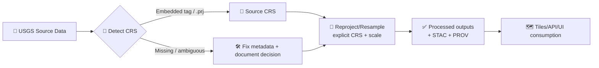

# 🧭 CRS Registry (USGS Shared)

   

> 📍 **Location:** `data/external/mappings/usgs/shared/crs/`  
> 🎯 **Goal:** One authoritative place for CRS definitions + conventions used across USGS ingestion, reprojection, tiling, and validation.

> [!IMPORTANT]
> **Never “wing it” on CRS.** If a dataset CRS is missing/ambiguous, **stop** and fix metadata *before* it enters `data/processed/`. 🛑

---

## 🎯 What this folder is

This directory is the **shared CRS registry** for **USGS-sourced** datasets in the Kansas Frontier Matrix (KFM) ecosystem.

Use it whenever you:
- 🧰 **Detect** a source CRS (GeoTIFF tags, `.prj`, WMS/WFS capabilities, FGDC/ISO metadata)
- 🔁 **Reproject / resample** rasters or vectors
- 🗺️ **Generate tiles** for web maps
- ✅ **Validate** that pipelines only output “approved” CRS targets
- 🧾 **Record provenance** (`source_crs`, `target_crs`, scale/resolution, tooling)

---

## 🧠 Why a CRS registry exists

USGS + partner datasets arrive in a variety of datums and projections (NAD83 variants, UTM zones, State Plane, Web Mercator, etc.). Different tools also have different defaults (and those defaults can change outcomes).

This registry keeps KFM:
- 🧬 **Reproducible** (same CRS decisions each run)
- 🧾 **Auditable** (CRS decisions are explicit + traceable)
- 🧱 **Composable** (layers align reliably across sources)

---

## 🗂️ Suggested layout (recommended)

> If these folders/files don’t exist yet, this is the “target shape” we should converge on.

```text
📁 data/external/mappings/usgs/shared/crs/
├─ 📄 README.md                    🧭 (you are here)
├─ 📄 crs.index.json               🗃️ machine-readable registry (recommended)
├─ 📁 epsg/                        🏷️ authority-backed CRS definitions
│  ├─ 📄 4326.wkt                  🌍 WKT2_2019
│  ├─ 📄 3857.wkt                  🗺️ WKT2_2019
│  ├─ 📄 5070.wkt                  📊 WKT2_2019
│  ├─ 📄 26977.wkt                 🧰 WKT2_2019
│  └─ ...
├─ 📁 projjson/                    🔧 PROJJSON exports (optional but nice)
│  ├─ 📄 4326.json
│  └─ ...
├─ 📁 esri_prj/                    🧩 legacy `.prj` strings (optional)
└─ 📁 custom/                      🧪 non-EPSG / historical / stitched CRSs (document heavily!)
```

---

## 📐 CRS policy (KFM-friendly defaults)

### 1) 🧩 Interchange CRS (API + GeoJSON)
- **Default:** `EPSG:4326` (WGS 84 lat/long)
- **Reason:** interoperable + widely expected by GeoJSON consumers and web APIs.

### 2) 🗺️ Web visualization CRS (tiles + front-end)
- **Default:** `EPSG:3857` (WGS 84 / Pseudo-Mercator)
- **Reason:** standard for “slippy map” tile ecosystems (MapLibre/Leaflet/OSM-style tiles).
- **Warning:** distortion is real → treat as **visualization**, not measurement.

### 3) 📊 Analysis CRS (statistics + measurement)
Pick based on the *question* (area? distance? statewide? local precision?).

**Recommended options for Kansas/CONUS workflows:**
- **`EPSG:5070`** (NAD83 / Conus Albers) ✅ great for **area-preserving** work across CONUS
- **UTM** (`EPSG:26914` / `EPSG:26915`) ✅ great for **local metric** work (but zone boundaries matter)
- **Kansas StatePlane** (`EPSG:26977` / `EPSG:26978`) ✅ great for **survey / engineering / high local fidelity**

> [!TIP]
> If your AOI crosses a **UTM zone** boundary (common in Kansas), consider using **EPSG:5070** or Kansas StatePlane instead of forcing one UTM zone.

---

## 🧾 CRS quick-reference (USGS + Kansas)

| Use case 🎛️ | EPSG | Name | Units | Notes |
|---|---:|---|---|---|
| 🧩 Interchange / GeoJSON / API | **4326** | WGS 84 | degrees | Safe default for interchange + services |
| 🏛️ Common US datum (metadata) | **4269** | NAD83 | degrees | Many gov datasets reference NAD83 geographic |
| 🗺️ Web tiles / MapLibre / Leaflet | **3857** | WGS 84 / Pseudo-Mercator | meters | Visualization standard; not “true” geodetic |
| 📊 Area-preserving analysis (CONUS) | **5070** | NAD83 / Conus Albers | meters | Great for area stats, statewide summaries |
| 📏 Local metric (UTM West/Central KS) | **26914** | NAD83 / UTM zone 14N | meters | Roughly 102°W–96°W |
| 📏 Local metric (UTM East KS) | **26915** | NAD83 / UTM zone 15N | meters | Roughly 96°W–90°W |
| 🧰 StatePlane KS North (metric) | **26977** | NAD83 / Kansas North | meters | Use when dataset/contract expects SPCS North |
| 🧰 StatePlane KS South (metric) | **26978** | NAD83 / Kansas South | meters | Use when dataset/contract expects SPCS South |
| 🧰 StatePlane KS North (US-ft) | **3419** | NAD83 / Kansas North (ftUS) | US survey ft | Use only when ftUS is mandated |
| 🧰 StatePlane KS South (US-ft) | **3420** | NAD83 / Kansas South (ftUS) | US survey ft | Use only when ftUS is mandated |

🔗 Handy lookup links (external):
- EPSG pages (epsg.io): `https://epsg.io/4326`, `https://epsg.io/3857`, `https://epsg.io/5070`, `https://epsg.io/26977`, etc.  
- SpatialReference.org WKT exports: `https://spatialreference.org/ref/epsg/26977/wkt.html`

---

## 🧬 Provenance contract for CRS decisions

> [!IMPORTANT]
> **CRS is provenance.** Every pipeline output should record at minimum:
> - `source_crs` (EPSG code *or* embedded WKT hash)
> - `target_crs`
> - `transformer` (GDAL/PROJ/pyproj) + version
> - `resolution/scale` (rasters) + `resampling_method`
> - any grid shift / datum transform details (if applicable)

Recommended places to store this:
- STAC Item properties (for catalog)
- W3C PROV log (for lineage)

---

## ✅ Validation rules (recommended)

To keep pipelines deterministic and prevent “CRS drift”:
- Pipelines **should only** reproject to CRSs listed in `crs.index.json`
- Pipelines **should fail closed** if:
  - CRS is missing/unknown
  - CRS is present but not approved
  - output CRS differs from what the pipeline declares

### 📦 Minimal `crs.index.json` idea

<details>
<summary>🗃️ Example registry file structure</summary>

```json
{
  "version": 1,
  "defaults": {
    "interchange": "EPSG:4326",
    "web": "EPSG:3857",
    "analysis_conus_equal_area": "EPSG:5070"
  },
  "epsg": {
    "4326": { "name": "WGS 84", "type": "geographic", "units": "degree" },
    "3857": { "name": "WGS 84 / Pseudo-Mercator", "type": "projected", "units": "metre" },
    "5070": { "name": "NAD83 / Conus Albers", "type": "projected", "units": "metre" },
    "26977": { "name": "NAD83 / Kansas North", "type": "projected", "units": "metre" },
    "26978": { "name": "NAD83 / Kansas South", "type": "projected", "units": "metre" }
  },
  "aliases": {
    "WGS84": "EPSG:4326",
    "WEB_MERCATOR": "EPSG:3857",
    "CONUS_ALBERS": "EPSG:5070"
  }
}
```

</details>

---

## 🧑‍💻 Usage snippets

### 🐍 Python (pyproj)

```python
from pyproj import CRS, Transformer

src = CRS.from_epsg(26977)   # KS StatePlane North (m)
dst = CRS.from_epsg(4326)    # WGS84 lon/lat

# always_xy=True => (lon, lat) style ordering for sanity
t = Transformer.from_crs(src, dst, always_xy=True)

lon, lat = t.transform(easting_m, northing_m)
print(lon, lat)
```

Load from a stored WKT file (recommended when you want “pinned” definitions):

```python
from pathlib import Path
from pyproj import CRS

wkt = Path("data/external/mappings/usgs/shared/crs/epsg/5070.wkt").read_text()
crs = CRS.from_wkt(wkt)
print(crs.to_authority())  # ('EPSG', '5070') if recognized
```

### 🛰️ GDAL (GeoTIFF reprojection)

```bash
gdalwarp \
  -t_srs EPSG:5070 \
  -r bilinear \
  -tr 30 30 \
  -of COG \
  input.tif \
  output_5070_cog.tif
```

### 🐘 PostGIS

```sql
-- Store geometry in 4326 for API interchange
SELECT ST_AsGeoJSON(ST_Transform(geom, 4326))
FROM your_table;

-- Use 5070 for CONUS area calculations
SELECT ST_Area(ST_Transform(geom, 5070)) AS area_m2
FROM your_table;
```

---

## ⚠️ Common CRS pitfalls (read this once, save hours)

- 🧩 **GeoJSON CRS “tag”**: Many pipelines should **assume EPSG:4326** (CRS member is deprecated in modern GeoJSON usage).
- 🗂️ **Missing `.prj`**: A shapefile without `.prj` is a CRS time bomb 💣
- 🔁 **Mixed AOI zones**: UTM/StatePlane zone boundaries can wreck statewide workflows
- 🧭 **Axis order**: Always force `(x, y)` ordering in transformers (`always_xy=True`)
- 🗺️ **Web Mercator measurements**: Don’t compute “true” area/length in EPSG:3857

---

## ➕ Adding a new CRS (standard workflow)

1. 🔍 Identify the CRS (prefer **EPSG** if at all possible).
2. 🧾 Export canonical **WKT2_2019** (and optionally PROJJSON).
3. 📁 Add files:
   - `epsg/<code>.wkt`
   - `projjson/<code>.json` (optional)
4. 🗃️ Register it in `crs.index.json`.
5. ✅ Add/adjust pipeline validation + tests (fail closed).
6. 🧷 Document:
   - where it’s used
   - why it’s needed
   - what datasets depend on it

> [!NOTE]
> If you must add a **custom CRS**, include a mini spec: parameters, intended AOI, and why EPSG can’t be used.

---

## 🧭 CRS lifecycle in KFM (mental model)



---

## 📚 References (project + external)

**Project library (recommended reading):**
- *Kansas Frontier Matrix (KFM) – Comprehensive Technical Blueprint* 📘
- *Cloud-Based Remote Sensing with Google Earth Engine — Fundamentals and Applications* 🛰️
- *Making Maps: A Visual Guide to Map Design for GIS* 🗺️
- *Python Geospatial Analysis Cookbook* 🐍

**External CRS registries:**
- epsg.io: `https://epsg.io/`
- SpatialReference.org: `https://spatialreference.org/`
- OGC CRS definitions: `https://www.opengis.net/def/crs/EPSG/0/`

