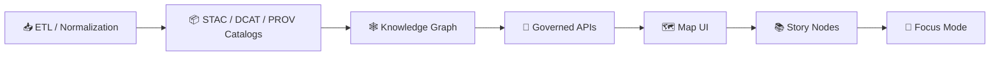

# 🗺️ USGS Shared Templates (KFM)


Shared, **reusable** templates for onboarding and maintaining **USGS-sourced datasets** in the Kansas Matrix / KFM ecosystem. 🧭✨  
These templates exist so USGS layers (historical topo sheets, hydrography, place names, elevation, etc.) stay **consistent, reproducible, and provenance-linked** across the pipeline.

---

## ✅ What lives here (and what does not)

### ✅ Lives here
- 📦 Metadata templates (STAC / DCAT / PROV)
- 🧾 Attribution + citation blocks
- 🧭 CRS / datum / transform decision helpers
- 🗺️ Visualization defaults (styles, legend blocks, grid overlays)
- 🧪 Validation checklists/snippets

### 🚫 Does *not* live here
- Raw datasets (those go in `data/raw/...`)
- Processed outputs (those go in `data/processed/...`)
- Secrets / tokens / API keys (never commit 🔒)

---

## 🚀 Quickstart

1. 🔎 **Pick the closest template** for your dataset type (raster vs vector vs index/registry).
2. 📄 **Copy** it into your dataset-specific folder (avoid editing shared templates unless it’s truly global).
3. 🧩 **Fill required fields**: IDs, extents, dates, license, source link(s), processing steps.
4. 🧬 **Generate boundary artifacts** (STAC + DCAT + PROV) and link them to real outputs.
5. ✅ Run validations (schema + links + provenance + classification checks).

> [!TIP]
> Treat templates like **contracts**: any template change can ripple into Catalog → Graph → API → UI → Story Nodes.

---

## 🧬 Where templates plug into the KFM pipeline



**This folder** supports the “template” part of the ETL + catalog boundary: it helps ensure the same USGS source becomes consistent, searchable, and safely renderable in downstream systems.

---

## 📦 Template types (what you’ll commonly see)

| Type | Why it exists | Typical artifacts |
|---|---|---|
| 📦 **Metadata mapping** | Make assets discoverable + machine-validated | STAC Collection/Item templates, DCAT dataset templates, PROV activity/bundle templates |
| 🧾 **Attribution + licensing** | Keep credits consistent across USGS layers | attribution blocks, citation text, license fields |
| 🧭 **CRS / datum** | Prevent silent misalignment across eras & products | CRS notes, transform choices, datum warnings |
| 🗺️ **Styles / presentation** | Keep map layers consistent & readable | MapLibre style snippets, QGIS symbol/layout exports, legend blocks |
| 🧩 **IDs & naming** | Prevent collisions; enable stable linking | dataset slug patterns, item ID patterns, tiling identifiers |
| 🧪 **Validation** | Reduce broken publishes | checklists, “definition of done”, schema hooks |

---

## 🗂️ Suggested layout (recommended)

```text
data/external/mappings/usgs/shared/templates/
├─ README.md                         👈 you are here
├─ metadata/                          📦 STAC / DCAT / PROV templates
│  ├─ stac/
│  ├─ dcat/
│  └─ prov/
├─ attribution/                       🧾 attribution + license blocks
├─ crs/                               🧭 CRS/datum conventions + notes
├─ styles/                            🗺️ MapLibre/QGIS/legend defaults
└─ validation/                        🧪 checklists + helper snippets
```

> [!NOTE]
> Your repo may not contain every subfolder yet—this is the **target shape** so the shared layer stays clean and scalable.

---

## 🧩 Naming & versioning

Use a strict, grep-friendly naming convention:

```text
TEMPLATE__USGS__<AREA>__<KIND>__v<MAJOR>.<MINOR>.<PATCH>.<ext>
```

Examples:
- `TEMPLATE__USGS__STAC_COLLECTION__v1.0.0.json`
- `TEMPLATE__USGS__STAC_ITEM_RASTER__v1.0.0.json`
- `TEMPLATE__USGS__DCAT_DATASET__v1.0.0.jsonld`
- `TEMPLATE__USGS__PROV_BUNDLE__v1.0.0.json`
- `TEMPLATE__USGS__ATTRIBUTION_BLOCK__v1.0.0.md`

> [!IMPORTANT]
> If a change affects semantics (IDs, required fields, meaning), bump **MAJOR** and add a migration note.

---

## 🧭 CRS / Datum / Grid rules (don’t skip this 😬)

USGS content spans many eras and production systems. The most common failure mode is mixing assets with **unknown** or **mismatched** datums/projections.

### Minimum fields every mapping must record
- 🧭 **Horizontal datum**
- 🧱 **Vertical datum** (if elevations are involved)
- 🗺️ **Projection**
- 📏 **Units**
- 🧩 **Grid / zone** (UTM zone, State Plane zone, etc.)
- 🔁 **Transform applied** (method + parameters + justification)

### Rules of thumb
- 🌍 Separate **storage CRS** from **display CRS**.
- 🧠 If two layers use different datums, coordinate differences can be **hundreds of meters**—treat this as a red flag.
- 🧷 When using MGRS/UTM references in UI or outputs, remember the land-nav rule: **“read right and up”** (eastings → northings). 🧭

> [!WARNING]
> “It lines up visually” is not a CRS strategy. Always record the decision so the pipeline stays replayable.

---

## 🗺️ UI + layout conventions (KFM-friendly)

Templates affecting map products (tiles/styles/layouts) should support:
- 📏 Scale bar
- 🧭 North arrow
- 🧮 Optional grid overlay (lat/long, UTM, MGRS)
- 🧷 Coordinate readout in multiple formats where practical (lat/long + UTM/MGRS)
- 🏷️ Clear provenance in legend/metadata panel (source + processed-by)

---

## 📦 Metadata boundary artifacts

A dataset isn’t “publishable” in KFM until it has consistent boundary artifacts.

At minimum, ensure you can produce:
- 📦 **STAC** Collection + Item(s)
- 🗂️ **DCAT** dataset record (discovery layer)
- 🧬 **PROV** lineage bundle (raw → work → processed)

Also ensure cross-links:
- STAC Items → link to real assets (rasters/vectors/tiles)
- DCAT → link to STAC and/or direct distributions
- PROV → links to inputs, scripts/configs, and outputs

---

## 🧾 Data product conventions (common USGS-friendly defaults)

When applicable, aim for:
- 🖼️ **Rasters** → Cloud-optimized formats (e.g., COG) for efficient streaming
- 🧷 **Vectors** → Web-friendly formats (e.g., GeoJSON) plus archival formats as needed
- 🧱 **Interactive** → tiles and/or lightweight interchange packages when required

> [!TIP]
> Templates should make the *format decision explicit* so future runs don’t drift.

---

## 🧪 “Ready to publish” checklist

### ✅ Metadata
- [ ] IDs are stable + unique (no silent renames)
- [ ] Title/description are human-readable and specific
- [ ] License + attribution filled (include source page + access date)
- [ ] Spatial extent valid (bbox/geometry)
- [ ] Temporal coverage explicit (date or range)

### ✅ Data assets
- [ ] Referenced file paths resolve
- [ ] Format matches layer intent (web display vs analysis vs archive)
- [ ] Checksums/hashes present where expected

### ✅ Provenance
- [ ] PROV links raw → work → processed outputs
- [ ] Processing steps are replayable (script + config referenced)
- [ ] Any AI/heuristics are labeled (parameters + uncertainty notes)

### ✅ Safety + governance
- [ ] No sensitive locations leaked via templates/styles
- [ ] Classification tags supported (redaction/generalization ready)

---

## 🤝 Contributing / updating shared templates

### When changing shared templates
- 🧨 Avoid breaking changes unless truly required
- 🏷️ Bump `vMAJOR.MINOR.PATCH`
- 📝 Add a migration note (what downstream datasets must change)
- ✅ Ensure deterministic + replayable outputs remain possible

> [!IMPORTANT]
> If template changes affect “what downstream systems assume,” treat it like a **contract change**.

---

## 🔒 Governance & sensitive locations

Some layers may reference protected or sensitive locations (cultural sites, restricted resources, etc.).  
Templates should support:
- classification tags
- generalized geometry options
- redaction-safe presentation defaults

When in doubt: **generalize first**, and require explicit governance review to publish higher precision. 🛡️

---

## 📚 Related docs (in-repo)

- 📘 `docs/MASTER_GUIDE_v13.md` — pipeline + governance source of truth  
- 🧾 `docs/standards/` — STAC/DCAT/PROV profiles + validation expectations  
- 🧩 `docs/templates/` — governed doc + Story Node templates  
- 🧪 `mcp/` — methods, experiments, runbooks, model cards

---

## 🧠 Why this exists

Consistency across USGS layers enables:
- 🕰️ time-sliced overlays (space + time)
- 🧬 traceable provenance (scan → georef → tiles → UI)
- 🧩 reusable styles without one-off hacks
- 🧱 safe integration into Catalog + Graph + Narrative systems

If you keep **templates sharp**, the rest of the pipeline stays sane. 🧩✨

