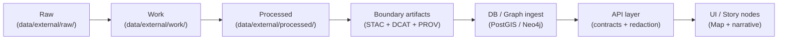

# 📒 CHANGELOG — `<dataset_slug>`


> ✅ This file records **what changed, when, and why** for the processed dataset in this folder.  
> 🔁 Goal: anyone can **reproduce, audit, and diff** the exact outputs for any version.

---

## 📘 Overview

| Item | Value |
|---|---|
| Dataset name | `<dataset_name>` |
| Dataset slug | `<dataset_slug>` |
| Domain | `<domain>` |
| Dataset type | `<source / derived / AI-evidence>` |
| Primary maintainer | `<name / team>` |
| Source(s) | `<url(s) / citation(s) / internal reference IDs>` |
| Output format(s) | `<GeoJSON / Parquet / CSV / GPKG / TIFF / etc.>` |
| CRS / projection | `<EPSG:####>` |
| Spatial extent | `<bbox / region>` |
| Temporal extent | `<YYYY-MM-DD … YYYY-MM-DD>` |
| PII / sensitivity | `<public / restricted / tribal sensitive / etc.>` |

---

## 🗂️ Directory + artifact expectations

This dataset lives in:

- `data/external/processed/<dataset_slug>/` ✅ (this folder)

Recommended staging mirrors the standard pipeline layout (raw → work → processed):

```text
data/
  external/
    raw/<dataset_slug>/            # immutable source drops (never overwrite)
    work/<dataset_slug>/           # intermediate transforms / scratch
    processed/<dataset_slug>/      # publish-ready outputs ✅
      CHANGELOG.md
      README.md                    # dataset runbook + field dictionary
      outputs/                     # final data artifacts (files)
      manifests/                   # optional: checksums, row counts, schema snapshots
```

### 🧭 “Truth path” (how this dataset flows downstream)



### 📦 Boundary artifacts (publish gate)

Before a version is considered “published”, ensure metadata + lineage are updated:

- `data/stac/collections/…` and `data/stac/items/…`
- `data/catalog/dcat/…`
- `data/prov/…` (or `data/provenance/…` depending on repo convention)

> 🧩 If this dataset is AI/analysis-generated, it is still treated as a **first-class** dataset: store outputs in `processed/…` and include full provenance.

---

## 🧾 Changelog rules

Create a new entry whenever any of these change:

- ✅ **Inputs**: new/updated raw source, upstream revision, new download date
- ✅ **Transform code**: ETL logic, cleaning rules, joins, filters, deduping, geocoding
- ✅ **Schema**: columns/fields, types, units, enumerations, IDs, geometry type
- ✅ **Semantics**: meaning of a field, interpretation rules, thresholds/classifications
- ✅ **Outputs**: file set, formats, compression, tiling, partitioning, filenames
- ✅ **Quality**: missing/wrong values fixed, geometry repairs, outlier handling
- ✅ **Provenance/metadata**: STAC/DCAT/PROV updates, licensing, sensitivity flags
- ✅ **Delivery**: moved to Git LFS, external pointer + checksum, fetch script changes

### 🔖 Versioning policy (SemVer)

- **MAJOR** (`X.0.0`): breaking change for consumers (schema/IDs/units/CRS/meaning)
- **MINOR** (`0.Y.0`): backward-compatible additions (new optional fields, new coverage)
- **PATCH** (`0.0.Z`): corrections that don’t break schema (fix values, typos, duplicates)

---

## ✅ Release checklist

- [ ] Outputs updated in `outputs/` (or pointers + checksums if stored externally)
- [ ] Dataset **README / data dictionary** updated
- [ ] **STAC** collection/items updated
- [ ] **DCAT** record updated
- [ ] **PROV** lineage bundle updated
- [ ] Row/feature counts recorded
- [ ] Checksums recorded (or regenerated)
- [ ] Pipeline script + commit SHA + run ID recorded
- [ ] Consumer impact assessed (breaking vs non-breaking)

---

## [Unreleased]

### Added
- _TBD_

### Changed
- _TBD_

### Fixed
- _TBD_

### Removed
- _TBD_

---

## [0.0.1] - 2026-01-29

### Added
- 🧱 Created dataset-level `CHANGELOG.md` template (this file).

---

<details>
<summary>🧩 Changelog entry template (copy/paste)</summary>

```markdown
## [<version>] - <YYYY-MM-DD>

### 🔗 Reproducibility
- Pipeline: `<path/to/pipeline_script.py>` (commit: `<sha>`)
- Run ID / job URL: `<id or link>`
- Inputs: `<raw drop name + date + checksum>`
- Outputs: `<outputs list + checksums>`

### Added
- ...

### Changed
- ...

### Fixed
- ...

### Removed
- ...

### 📊 Quick stats (recommended)
| Metric | Before | After |
|---|---:|---:|
| Rows / features | `<n>` | `<n>` |
| Unique IDs | `<n>` | `<n>` |
| Missing geometry | `<n>` | `<n>` |
| CRS | `<epsg>` | `<epsg>` |

### 🧾 Notes
- Backwards compatibility: `<yes/no>`
- Breaking changes: `<yes/no>`
- Known issues: `<...>`
```

</details>

