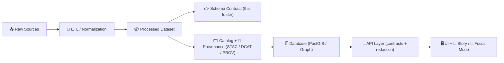

# 🧾 Dataset Schema Contract — `<dataset_slug>`


> **📌 Purpose:** This folder defines the **schema “contract”** for the processed dataset located at `data/external/processed/<dataset_slug>/`.  
> It exists to keep the pipeline deterministic, validation strict, and downstream systems (DB → API → UI) consistent. ✅

---

## 🧭 Where this fits in the KFM pipeline



> [!IMPORTANT]
> **No shortcuts:** This dataset should not be loaded into databases or shown in UI until it has a validated schema + catalog/provenance boundary artifacts. 🧱🔒

---

## 📦 Folder layout

> [!NOTE]
> Your dataset may not include every file below yet — this is the *recommended* “contract-first” structure.

```text
📁 data/external/processed/<dataset_slug>/
├─ 📁 schema/                     👈 you are here
│  ├─ 📄 README.md                 (this file)
│  ├─ 📄 schema.yaml               ✅ recommended canonical schema (human + diff-friendly)
│  ├─ 📁 jsonschema/               🟡 optional (machine validation per file type)
│  ├─ 📁 sql/                      🟡 optional (PostGIS DDL + constraints)
│  ├─ 📁 enums/                    🟡 optional (controlled vocabularies)
│  ├─ 📁 examples/                 🟡 optional (tiny valid samples)
│  └─ 📄 CHANGELOG.md              🟡 optional (schema version history)
└─ 📄 <processed_outputs...>       (e.g., .parquet / .csv / .gpkg / .geojson / .tif)
```

---

## 🔗 Quick links

Update these links once the dataset’s metadata artifacts exist:

- **📄 Processed outputs (folder):** `../`
- **🛰️ STAC Items:** `../../../../stac/items/` *(filter by `<dataset_slug>`)*  
- **🗂️ STAC Collections:** `../../../../stac/collections/` *(if used)*
- **📚 DCAT entry:** `../../../../catalog/dcat/` *(JSON-LD dataset catalog)*
- **🧬 PROV bundle:** `../../../../prov/` *(lineage: raw → work → processed)*

---

## 🧱 Schema contract: what MUST be defined

Fill these in and keep them current as the dataset evolves:

### ✅ Contract checklist

- [ ] **Canonical schema file exists** (pick one and declare it below)
- [ ] **Primary key strategy** is defined (stable, unique, non-null)
- [ ] **Field dictionary** exists (types + meaning + units + null rules)
- [ ] **Geospatial rules** are defined *(if spatial)*: geometry type + CRS/EPSG + validity rules
- [ ] **Time rules** are defined *(if temporal)*: timezone + granularity + validity range
- [ ] **Controlled vocabularies** are explicit (enums, code lists)
- [ ] **License + attribution** are present (also required in DCAT/STAC)
- [ ] **Validation steps** are repeatable (CI-friendly)
- [ ] **Schema changes are versioned** (no silent breaking changes)

---

## 📌 Declare the canonical schema artifact

> [!TIP]
> Pick **one** canonical schema file to edit by hand. If you maintain multiple formats, generate the others from the canonical one.

| Artifact | Path | Status | Notes |
|---|---|---:|---|
| Canonical schema (recommended) | `schema.yaml` | ⬜ | Human-friendly + best for PR review |
| JSON Schema (optional) | `jsonschema/*.schema.json` | ⬜ | Great for strict validation of JSON/GeoJSON |
| SQL constraints (optional) | `sql/*.sql` | ⬜ | PostGIS / DB ingestion guardrails |
| Enums / code lists (optional) | `enums/*` | ⬜ | CSV/YAML lists of allowed values |
| Examples (optional) | `examples/*` | ⬜ | Minimal valid samples for tests |

---

## 🧩 Dataset “shape” summary

Fill this in once you know the actual outputs.

### 🧱 Entities / tables / layers

| Name | Storage | Primary Key | Geometry | Description |
|---|---|---|---|---|
| `<entity_or_layer_name>` | `<parquet/csv/gpkg/postgis/...>` | `<id_field>` | `<POINT/LINESTRING/POLYGON/None>` | `<what is represented>` |

---

## 📚 Field dictionary template

> [!NOTE]
> Put the authoritative version in `schema.yaml` (or your chosen canonical file).  
> This section is a convenient “human view” that should match the canonical schema.

### 🧾 Fields

| Field | Type | Required | Meaning | Units / Format | Example | Notes |
|---|---|:---:|---|---|---|---|
| `kfm_id` | `string` | ✅ | Stable KFM identifier | `uuid/ulid/slug` | `kfm:...` | Never re-used |
| `source_id` | `string` | 🟡 | Original provider record id | provider-defined | `A-1042` | Keep exact |
| `name` | `string` | 🟡 | Human label/title | UTF-8 | `Fort Riley` |  |
| `geom` | `geometry` | 🟡 | Feature geometry | EPSG:<code> | `POINT(...)` | If spatial |
| `valid_from` | `datetime` | 🟡 | Start of validity | ISO-8601 UTC | `1854-01-30T00:00:00Z` | If temporal |
| `valid_to` | `datetime` | 🟡 | End of validity | ISO-8601 UTC | `1861-04-12T00:00:00Z` | If temporal |

> [!TIP]
> If you have “unknown”, “approximate”, or “estimated” values, prefer explicit flags:
> `is_estimated`, `confidence`, `method`, `notes` — and document them here. 🧠✨

---

## 🌍 Geospatial contract (if applicable)

### CRS / projection
- **Declared CRS:** `EPSG:<code>`
- **Axis order:** `<lon,lat OR x,y>`
- **Geometry type:** `<POINT|LINESTRING|POLYGON|MULTI...>`
- **Validity requirements:**  
  - Geometry must be valid (no self-intersections for polygons, etc.)
  - Coordinates must fall within expected bounds for the dataset’s region

### Geometry semantics
- What does the geometry represent? (centroid, footprint, boundary, route, observation point, etc.)
- Precision notes (digitization scale, snapping, simplification tolerance)

---

## 🕰️ Temporal contract (if applicable)

- **Timezone policy:** Prefer `UTC` in processed outputs
- **Supported formats:** ISO-8601 (`YYYY-MM-DD` or full datetime)
- **Granularity:** `<day|month|year|timestamp>`
- **Range semantics:** Are intervals inclusive/exclusive? Document clearly.

---

## 🧪 Validation & CI expectations

> [!IMPORTANT]
> Treat schema validation as a **publish gate**. If a check fails, the dataset should “fail closed” (no publish / no load / no UI). 🔒✅

### Minimum validation checks (recommended)
- **Schema parse:** canonical schema loads successfully
- **Type checks:** each output matches declared types (including geometry + datetime parsing)
- **Required fields:** present + non-null where required
- **Uniqueness:** primary key is unique
- **Domain checks:** enums/code lists enforced
- **Spatial checks:** CRS declared; geometry validity; bounds sanity
- **Provenance checks:** catalog/prov artifacts exist before “publish”

### Suggested tooling (choose what fits the repo)
- JSON Schema validator (`jsonschema`)
- Tabular validation (`pandera`, `great_expectations`, `frictionless`)
- Geo validation (`geopandas`, `shapely`, `pyproj`)

---

## 🔁 Versioning rules for schema changes

> [!TIP]
> Use SemVer for the schema contract:
> - **MAJOR:** breaking change (rename fields, change meaning/type, drop columns)
> - **MINOR:** additive change (new optional fields, new enum values)
> - **PATCH:** docs/typos/clarifications that don’t change validation

### Required behavior
- Breaking changes must:
  - bump MAJOR,
  - update downstream mappings (DB + API),
  - and update catalog/prov references if distributions change.

---

## ⚖️ Governance, FAIR+CARE, and external data obligations

- **License clarity:** declare license + attribution requirements (also reflected in DCAT/STAC)
- **Sensitive content:** if any records are restricted/sensitive, document:
  - classification level,
  - redaction rules,
  - any access constraints expected at the API layer
- **Provenance:** keep “the map behind the map” — link back to sources and transformations

---

## 🧰 Appendices

<details>
<summary><strong>📄 Minimal <code>schema.yaml</code> template</strong> (copy + edit)</summary>

```yaml
dataset:
  slug: "<dataset_slug>"
  title: "<Human title>"
  description: "<1–3 sentences>"
  version: "0.1.0"
  license: "<SPDX OR custom>"
  source:
    name: "<provider/org>"
    url: "<source url>"
    retrieved_at: "<YYYY-MM-DD>"
outputs:
  - name: "<entity_or_layer_name>"
    file: "<relative path to processed file>"
    format: "<parquet|csv|gpkg|geojson|tif>"
    primary_key: "<field_name>"
    geometry:
      enabled: true
      type: "<POINT|LINESTRING|POLYGON|MULTI...>"
      crs: "EPSG:<code>"
    fields:
      - name: "kfm_id"
        type: "string"
        required: true
        description: "Stable KFM identifier"
      - name: "source_id"
        type: "string"
        required: false
        description: "Upstream provider identifier"
      - name: "name"
        type: "string"
        required: false
        description: "Human label/title"
```
</details>

<details>
<summary><strong>🧾 Schema CHANGELOG template</strong></summary>

```markdown
# Schema Changelog — <dataset_slug>

## [0.2.0] - YYYY-MM-DD
### Added
- New optional field `...`

### Changed
- Clarified meaning of `...`

## [0.1.0] - YYYY-MM-DD
- Initial schema contract
```
</details>

---

## 🧠 Maintainer notes

- **Owner:** `<name/team>`
- **Reviewers:** `<governance/steward(s)>`
- **Last verified:** `<YYYY-MM-DD>`
- **Known issues:** `<short bullets>`

---

