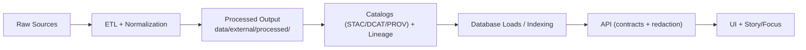

# 🧪 Validation Expectations — `<dataset_slug>`

> [!IMPORTANT]
> In KFM, **processed datasets are curated outputs** meant to be served (directly or via databases) by the API/UI. This means they must be validated and provenance-backed before downstream use. :contentReference[oaicite:0]{index=0}:contentReference[oaicite:1]{index=1}

## 📁 Location

```text
```text
📁 data/
└─ 📁 external/
   └─ 📁 processed/
      └─ 📁 <dataset_slug>/                      ✅ promoted dataset outputs (ready for DB/API/UI)
         ├─ 📦 ...dataset outputs...              📦 primary + derivative artifacts (parquet/pmtiles/cog/etc.)
         └─ 📁 validation/                        🧪 pipeline QA artifacts + expectations
            └─ 📄 expectations.md                 👈 you are here (validation rules + thresholds)
```

## 🗺️ Pipeline context



This dataset must remain compatible with KFM’s canonical order and “no shortcut” rule. :contentReference[oaicite:2]{index=2}:contentReference[oaicite:3]{index=3}

---

## 🎯 Purpose

This document is the **validation contract** for everything published under:

- `data/external/processed/<dataset_slug>/…`

It exists to:

1. Define merge-blocking checks (CI) vs. recommended checks (manual/QA).
2. Ensure the dataset can be safely cataloged, loaded, and exposed through KFM’s governed layers.
3. Provide repeatable validation steps and evidence for review.

KFM enforces validation gates in CI/CD and expects missing or invalid metadata/provenance to block merges. :contentReference[oaicite:4]{index=4}

---

## 🧭 KFM contract anchors

KFM-wide rules that directly shape the expectations below:

- **Contract-first:** schemas/contracts are first-class; changes require strict versioning/compat checks. :contentReference[oaicite:5]{index=5}
- **Deterministic, idempotent ETL:** same inputs ⇒ same outputs, logged and replayable. :contentReference[oaicite:6]{index=6}:contentReference[oaicite:7]{index=7}
- **Provenance first + boundary artifacts:** STAC/DCAT/PROV must exist before data is “published.” :contentReference[oaicite:8]{index=8}:contentReference[oaicite:9]{index=9}
- **Sovereignty / classification propagation:** derivatives cannot be less restricted than inputs. :contentReference[oaicite:10]{index=10}
- **No data enters without documentation:** missing STAC/DCAT/PROV should fail CI. :contentReference[oaicite:11]{index=11}

---

## 📦 Dataset inventory

Fill this in for the dataset (keep it tight and concrete).

| Asset | Kind | Format | Primary key / identity | CRS | Notes |
|---|---|---|---|---|---|
| `<file_1>` | `<vector|raster|table>` | `<geojson|geoparquet|geotiff|csv|parquet>` | `<id_field or asset_id>` | `<EPSG:4326?>` | `<what is this?>` |
| `<file_2>` |  |  |  |  |  |

> [!NOTE]
> KFM processed spatial data is commonly standardized to a shared CRS (often WGS84 / lon-lat) unless there’s a documented reason to keep a projection. :contentReference[oaicite:12]{index=12}

---

## ✅ Validation gates

Legend: 🔒 = merge-blocking (CI), 🧩 = strongly recommended, 📝 = manual review.

### Gate 0 — Required boundary artifacts 🔒

These artifacts are required before data is considered fully published and before downstream stages consume it. :contentReference[oaicite:13]{index=13}

- [ ] **STAC** collection/item(s) exist and link to the actual asset(s). :contentReference[oaicite:14]{index=14}
  - [ ] `data/stac/collections/<dataset_slug>.json`
  - [ ] `data/stac/items/<dataset_slug>__*.json`
- [ ] **DCAT** dataset entry exists and points to distributions and/or STAC. :contentReference[oaicite:15]{index=15}
  - [ ] `data/catalog/dcat/<dataset_slug>.jsonld`
- [ ] **PROV** lineage exists and captures inputs → activities → outputs (+ agents, timestamps, parameters). :contentReference[oaicite:16]{index=16}:contentReference[oaicite:17]{index=17}
  - [ ] `data/prov/<dataset_slug>.prov.json`

> [!IMPORTANT]
> If STAC/DCAT/PROV are missing, CI is expected to reject the contribution (“no data enters without documentation”). :contentReference[oaicite:18]{index=18}

---

### Gate 1 — File integrity & readability 🔒

For every asset listed in the inventory table:

- [ ] File exists and is non-empty.
- [ ] File opens with standard tooling for its format.
- [ ] GeoJSON-only: valid JSON; coordinates are plausible (CI may do basic checks here). :contentReference[oaicite:19]{index=19}

---

### Gate 2 — Schema contract 🔒

Data validation should ensure the dataset is fit, consistent, and rule-conformant (e.g., completeness/uniqueness/range consistency where required). :contentReference[oaicite:20]{index=20}

#### 2A) Column expectations (tables + vector attributes)

Fill one table per tabular/vector asset:

| Column | Type | Nullable? | Allowed values / range | Description |
|---|---|---:|---|---|
| `<id>` | `<string|int>` | ❌ | unique | stable feature identifier |
| `<name>` | `<string>` | ✅ |  | display label |
| `<date>` | `<date|datetime>` | ✅ | `<min..max>` | temporal reference |
| `<value>` | `<float>` | ✅ | `<min..max>` | unit: `<unit>` |

Minimum rules (merge-blocking):

- [ ] Primary key field(s) are **unique** and **non-null**.
- [ ] Required fields are **non-null**.
- [ ] Enums/ranges are enforced where defined, including units and codebook links.
- [ ] No cryptic codes without explanation; standardize units where possible. :contentReference[oaicite:21]{index=21}

#### 2B) Geometry expectations (vector only) 🔒

If this dataset includes vector geometries:

- [ ] Geometry present for each feature unless explicitly allowed.
- [ ] Geometry valid (no NaN coords; no self-intersections where relevant).
- [ ] Geometry type matches dataset contract (`Point|LineString|Polygon|…`).
- [ ] CRS is explicitly declared in metadata and consistent with the contract. :contentReference[oaicite:22]{index=22}

---

### Gate 3 — Spatial plausibility 🧩

These checks are dataset-specific; fill in values for this dataset.

- [ ] Bounding box constraint:
  - expected bbox: `<minLon, minLat, maxLon, maxLat>`
  - allowed overflow: `<tolerance>`
- [ ] No geometry wildly outside expected region (flag & inspect).
- [ ] If polygons: overlaps/gaps rules enforced **only** if semantics require it.

---

### Gate 4 — Temporal plausibility 🧩

If the dataset contains time:

- [ ] All date/datetime fields parse.
- [ ] If both start/end exist: `start <= end`.
- [ ] Expected temporal coverage: `<YYYY..YYYY>` (flag outliers).

---

### Gate 5 — Sovereignty, sensitivity, and redaction 🔒📝

- [ ] Classification fields in metadata are set (`open|controlled|confidential`, etc.).
- [ ] Output classification is **not less restrictive** than any input sources. :contentReference[oaicite:23]{index=23}
- [ ] If sensitive geography exists (e.g., locations requiring generalization), the processed output applies the approved redaction/generalization strategy and documents it here.

---

### Gate 6 — Determinism & reproducibility 🔒

- [ ] The pipeline that produced this dataset is deterministic/idempotent and replayable. :contentReference[oaicite:24]{index=24}:contentReference[oaicite:25]{index=25}
- [ ] A run log exists (or is referenced) containing:
  - input identifiers + checksums
  - processing configuration parameters
  - output identifiers + checksums
- [ ] A validation report exists for this dataset pipeline run (human-readable is fine). :contentReference[oaicite:26]{index=26}

> [!NOTE]
> Provenance should answer “how was this produced?” and missing provenance is considered a red flag. :contentReference[oaicite:27]{index=27}:contentReference[oaicite:28]{index=28}

---

### Gate 7 — Validation outputs (what to commit) 🔒🧩

At minimum, commit one of:

- [ ] `validation/report.md`
- [ ] `validation/report.json`

The report should summarize:

- record/feature count
- missingness by required field
- min/max (or distribution summary) for key numeric fields
- spatial extent (bbox)
- CRS and geometry validity counts
- pass/fail per gate (with notes)

Pipelines may produce summary stats in logs or a separate report to help maintainers verify imports. :contentReference[oaicite:29]{index=29}

---

## 🧪 Suggested validation implementation map (optional helper)

This repo doesn’t mandate a specific validator, but the gates above map cleanly to:

- **Schema checks:** JSON Schema / Arrow schema / GeoParquet schema
- **Row/column expectations:** Great Expectations / pandera / custom assertions
- **Geometry checks:** shapely / pygeos / geopandas
- **Metadata checks:** STAC/DCAT/PROV profile validators in CI (expected in KFM). :contentReference[oaicite:30]{index=30}

---

## 🔄 Change management

Treat changes to this expectations contract like an interface change:

- bump `version`
- update dependent schemas/metadata as needed
- document migrations if meaningfully breaking

This aligns with KFM’s contract-first philosophy and strict versioning expectations. :contentReference[oaicite:31]{index=31}

---

## 📚 Sources (project anchors)

- KFM Master Guide v13 (contract-first, deterministic pipeline, pipeline invariants, metadata requirements). :contentReference[oaicite:32]{index=32}
- KFM Comprehensive Technical Blueprint (repo structure, processed data role, CI/validation practices, provenance expectations). :contentReference[oaicite:33]{index=33}
- Data validation fundamentals (completeness/uniqueness/range consistency). :contentReference[oaicite:34]{index=34}
