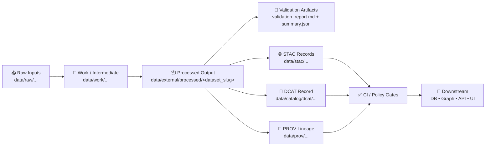

# ✅ Validation Report — `<dataset_slug>` 🧪


> [!IMPORTANT]
> This report is the **dataset-level validation contract artifact** for `<dataset_slug>`.  
> It is intended to be reviewable by humans ✅ and parseable by automation 🤖.

---

## 📌 Quick Links

- 📦 **Processed dataset folder:** `data/external/processed/<dataset_slug>/`
- 🧾 **This report:** `data/external/processed/<dataset_slug>/validation/validation_report.md`
- 🧪 **Validation outputs:** `data/external/processed/<dataset_slug>/validation/`
- 🗂️ **Metadata boundary artifacts (expected):**
  - 🌐 STAC: `data/stac/...`
  - 🧭 DCAT: `data/catalog/dcat/...`
  - 🧬 PROV: `data/prov/...` (or `data/provenance/...` depending on repo convention)

---

## 🧭 Directory Layout (what should exist) 🗂️

```text
📁 data/
  📁 external/
    📁 processed/
      📁 <dataset_slug>/
        📄 README.md                     📝 dataset runbook (recommended)
        📄 <dataset_slug>.<ext>          📦 primary output (csv/parquet/geojson/geopackage/tif/etc)
        📁 validation/
          📄 validation_report.md        ✅ you are here
          📄 validation_summary.json     🤖 machine-readable results (recommended)
          📄 validation_log.txt          🪵 raw validator output (recommended)
          📄 checksums.sha256            🔐 hashes for key outputs (recommended)
```

---

## 🗺️ Validation Flow (concept) 🔁



---

## 🧾 Dataset Identity

| Field | Value |
|---|---|
| **Dataset slug** | `<dataset_slug>` |
| **Title** | `<Human-friendly dataset name>` |
| **Domain / Module** | `<e.g., treaties | census | railroads | ecology | archaeology>` |
| **Version** | `<YYYY-MM-DD or semver>` |
| **Primary steward** | `<team/person>` |
| **License** | `<SPDX or ref>` |
| **Sensitivity** | `<public|internal|confidential|restricted>` |
| **Intended downstream use** | `<graph load | API exposure | UI layer | analysis only>` |

---

## ✅ Definition of Done Checklist (merge-ready)

> [!TIP]
> Treat this as the “green light” checklist before promotion to DB/Graph/API/UI.

- [ ] **Processed output(s) exist** under `data/external/processed/<dataset_slug>/`
- [ ] **Validation completed** and `validation_status` is **PASS** (or WARN with approved waiver)
- [ ] **STAC record(s)** exist and link to the output asset(s)
- [ ] **DCAT entry** exists (with license + distribution links)
- [ ] **PROV bundle** exists and traces inputs → transforms → outputs
- [ ] **Policy checks** satisfied (license, required metadata fields, sensitivity rules)
- [ ] **Repro steps** documented (how to regenerate the dataset)

---

## 🧪 Validation Summary

| Category | Result | Notes |
|---|---:|---|
| Overall status | `UNKNOWN` | `PASS / WARN / FAIL` |
| Run timestamp | `<YYYY-MM-DDTHH:MM:SSZ>` |  |
| Validator | `<tool/script + version>` |  |
| Pipeline ref | `<path>` |  |
| Git commit | `<sha>` |  |

### 🔎 High-level Metrics (fill in)

| Metric | Value |
|---|---:|
| Record count | `<n>` |
| File size | `<n MB>` |
| Primary key field | `<field_name>` |
| Duplicate primary keys | `<n>` |
| Null rate (key fields) | `<%>` |
| Date/time coverage | `<start → end>` |
| Geometry type(s) | `<Point/LineString/Polygon/... or N/A>` |
| CRS / EPSG | `<EPSG:4326 etc or N/A>` |
| Spatial extent (bbox) | `<minx, miny, maxx, maxy or N/A>` |

---

## 📦 Artifact Inventory

### 1) Data outputs (processed)

List the authoritative output assets produced by the pipeline.

- 📄 `data/external/processed/<dataset_slug>/<file_1>`
- 📄 `data/external/processed/<dataset_slug>/<file_2>`
- 🧾 (optional) `data/external/processed/<dataset_slug>/<data_dictionary_or_schema_doc>`

### 2) Validation artifacts

- ✅ `data/external/processed/<dataset_slug>/validation/validation_report.md`
- 🤖 `data/external/processed/<dataset_slug>/validation/validation_summary.json`
- 🪵 `data/external/processed/<dataset_slug>/validation/validation_log.txt`
- 🔐 `data/external/processed/<dataset_slug>/validation/checksums.sha256`

### 3) Metadata “boundary artifacts” (expected)

> [!NOTE]
> If these are missing, **treat as FAIL** unless a maintainer-approved waiver exists.

- 🌐 STAC Collection: `data/stac/collections/<collection_id>.json`
- 🌐 STAC Item(s): `data/stac/items/<item_id>.json` (or equivalent structure)
- 🧭 DCAT Dataset: `data/catalog/dcat/<dataset_id>.{json|ttl}`
- 🧬 PROV: `data/prov/<dataset_slug>.prov.{json|ttl}` (or repo-defined location)

---

## 🧱 Validation Checks Matrix

> [!IMPORTANT]
> Mark each check as ✅ PASS, ⚠️ WARN, or ❌ FAIL. Add evidence paths for reproducibility.

### A) File & Format Integrity 🧰

| Check | Status | Evidence | Notes |
|---|---|---|---|
| Files exist & readable | ⏳ | `validation_log.txt` |  |
| Non-empty dataset | ⏳ |  |  |
| Encoding / delimiter sane (tabular) | ⏳ |  |  |
| GeoJSON/GeoPackage parses (spatial) | ⏳ |  |  |
| Raster opens (raster) | ⏳ |  |  |
| Checksums recorded | ⏳ | `checksums.sha256` |  |

### B) Schema & Contract Validation 🧾

| Check | Status | Evidence | Notes |
|---|---|---|---|
| Schema file present (if used) | ⏳ | `<path/to/schema>` |  |
| Column presence matches contract | ⏳ |  |  |
| Data types valid / coercible | ⏳ |  |  |
| Required fields non-null | ⏳ |  |  |
| Enumerations / controlled vocab valid | ⏳ |  |  |

### C) Record-Level Quality 🎯

| Check | Status | Evidence | Notes |
|---|---|---|---|
| Primary key uniqueness | ⏳ |  |  |
| Duplicate record detection | ⏳ |  |  |
| Range checks (numeric) | ⏳ |  | `<min/max thresholds>` |
| Pattern checks (IDs, codes) | ⏳ |  |  |
| Outlier scan (basic) | ⏳ |  |  |

### D) Temporal Validity ⏱️

| Check | Status | Evidence | Notes |
|---|---|---|---|
| Date fields parse correctly | ⏳ |  |  |
| Time range plausible for domain | ⏳ |  |  |
| No impossible intervals (end < start) | ⏳ |  |  |
| Timezone handling documented | ⏳ |  |  |

### E) Spatial Validity 🌍 (skip if non-spatial)

| Check | Status | Evidence | Notes |
|---|---|---|---|
| CRS recorded and consistent | ⏳ |  |  |
| Geometry validity (self-intersections, etc.) | ⏳ |  |  |
| Coordinates within expected bounds | ⏳ |  | e.g., Kansas bbox |
| No empty / null geometries (if required) | ⏳ |  |  |
| Topology sanity (if polygons/lines) | ⏳ |  | overlaps, slivers, dangles |

### F) Referential Integrity 🔗 (if applicable)

| Check | Status | Evidence | Notes |
|---|---|---|---|
| Foreign keys resolve | ⏳ |  |  |
| Joins to canonical IDs work | ⏳ |  |  |
| Controlled vocab references valid | ⏳ |  |  |

---

## 🌐 Metadata & Cross-Layer Integrity

> [!IMPORTANT]
> This section ensures catalogs, provenance, and downstream representations remain synchronized.

### 1) STAC ✅

- [ ] STAC Collection exists
- [ ] STAC Items exist (for each asset / partition)
- [ ] Each STAC Item links to the **actual** processed asset path
- [ ] Spatial/temporal extent present and matches data

**Evidence:**  
- STAC Collection: `<path>`  
- STAC Items: `<path(s)>`

### 2) DCAT ✅

- [ ] DCAT Dataset entry exists
- [ ] License field present and valid
- [ ] Distribution links point to STAC and/or direct asset download

**Evidence:**  
- DCAT record: `<path>`

### 3) PROV ✅

- [ ] PROV bundle exists
- [ ] Lineage includes **raw inputs → work steps → processed outputs**
- [ ] Includes pipeline identity (run id / config / commit)

**Evidence:**  
- PROV bundle: `<path>`

### 4) Policy / Governance Gate ⚖️ (FAIR+CARE)

- [ ] License present (no “unknown”)
- [ ] Citation/source attribution present
- [ ] Sensitivity classification is set correctly
- [ ] Any restricted fields are redacted/aggregated as required

**Evidence:**  
- Policy outputs / CI logs: `<path or link>`

---

## 🚦CI Gate Summary (what should be green)

| Gate | Status | Notes |
|---|---|---|
| Lint / formatting (if applied) | ⏳ |  |
| Policy checks (license/metadata) | ⏳ |  |
| Metadata schema validation (STAC/DCAT/PROV) | ⏳ |  |
| Data validation (this report) | ⏳ |  |
| Link integrity (no broken refs) | ⏳ |  |

---

## 🧯 Findings & Issues Log

> [!TIP]
> Keep the log crisp: one issue per bullet, include impact + fix.

### ❌ Blockers (must fix before merge)

- `[#] <title>` — **Impact:** <what breaks> — **Fix:** <what to do> — **Evidence:** <path/log>

### ⚠️ Warnings (allowed only with waiver)

- `[#] <title>` — **Risk:** <risk> — **Mitigation:** <mitigation> — **Evidence:** <path/log>

### ℹ️ Notes (informational)

- `[#] <note>`

---

## 🛠️ Remediation Plan (Action Items)

- [ ] Fix blockers
- [ ] Regenerate outputs
- [ ] Re-run validation (update `generated_at`, `git_commit`, `validation_status`)
- [ ] Confirm STAC/DCAT/PROV alignment updated
- [ ] Re-check policy gates (license + sensitivity)

---

## ♻️ Reproducibility (How to regenerate)

### Environment

- OS: `<...>`
- Python/R/Node: `<...>`
- Key deps: `<...>`
- Docker/Compose: `<...>` (if used)

### Commands (examples — replace with real ones)

```bash
# 1) Run pipeline
python <path/to/pipeline>.py --dataset <dataset_slug> --out data/external/processed/<dataset_slug>/

# 2) Run validation
python <path/to/validator>.py --dataset <dataset_slug> --report data/external/processed/<dataset_slug>/validation/

# 3) (Optional) Validate STAC/DCAT/PROV
python <path/to/metadata_validator>.py --dataset <dataset_slug>
```

### Determinism notes 🧊

- Inputs pinned: `<checksums / source version / download URL>`
- Non-deterministic steps (if any): `<describe + how handled>`
- Known diffs allowed: `<explain>`

---

## 📎 Appendix A — Profiling Snapshot (optional)

<details>
<summary>Click to expand 📊</summary>

### Column-level stats (tabular)

- `<field>`: min `<...>`, max `<...>`, null `<...%>`, distinct `<...>`

### Geometry stats (spatial)

- Valid: `<n>` / Invalid: `<n>`
- Empty geometries: `<n>`
- Geometry types distribution: `<...>`

</details>

---

## 📎 Appendix B — Checksums (optional) 🔐

> Keep this aligned with `checksums.sha256`.

```text
<sha256>  data/external/processed/<dataset_slug>/<file_1>
<sha256>  data/external/processed/<dataset_slug>/<file_2>
```

---

## ✍️ Sign-off ✅

| Role | Name | Date | Decision |
|---|---|---:|---|
| Data Steward | `<name>` | `<YYYY-MM-DD>` | ✅ Approve / ❌ Reject |
| Maintainer | `<name>` | `<YYYY-MM-DD>` | ✅ Approve / ❌ Reject |
| Governance (if needed) | `<name>` | `<YYYY-MM-DD>` | ✅ Approve / ❌ Reject |

---

## 🕰️ Report Changelog

- `<YYYY-MM-DD>` — Created report template for `<dataset_slug>` (status: `UNKNOWN`)
- `<YYYY-MM-DD>` — Updated after validation run (status: `PASS/WARN/FAIL`)

