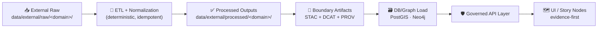

# 🌐 External Processed Data — `<domain>`  
   

> [!IMPORTANT]
> This directory contains **final, curated, “ready-to-serve”** datasets for the **external** domain **`<domain>`**.  
> These outputs are treated as **authoritative** (consumed by downstream indexing + APIs) and must be reproducible from raw sources via governed pipelines.

---

## 🚀 Quick links
- 📥 **Raw inputs:** `../../raw/<domain>/`
- 🧪 **Work / intermediates:** `../../work/<domain>/`
- ✅ **Processed outputs (you are here):** `./`
- 🧾 **STAC metadata:** `../../../stac/collections/` + `../../../stac/items/`
- 🧭 **DCAT catalog:** `../../../catalog/dcat/`
- 🧬 **PROV lineage:** `../../../prov/` *(or legacy: `../../../provenance/`)*

---

## 🧭 Canonical flow (non‑negotiable)


**Principles baked into this folder:**
- 🧾 **Provenance-first:** nothing is “published” without STAC/DCAT/PROV.
- 🧩 **Contract-first:** schemas are first-class artifacts; changes require versioning.
- 🔁 **Deterministic ETL:** same inputs/config ⇒ same outputs; reruns are safe.

---

## ✅ Definition of Done (DoD) for any file in this folder
A dataset is allowed to land in `data/external/processed/<domain>/` only when ALL are true:

- [ ] **Output(s) present** in an approved format (see “Formats” below)
- [ ] **Schema/contract** exists and validates (JSON Schema / table schema / raster profile)
- [ ] **STAC Collection + Item(s)** created and link to the asset(s)
- [ ] **DCAT Dataset entry** created (license, keywords, distributions)
- [ ] **PROV bundle** created (raw → work → processed lineage, run info, params)
- [ ] **Validation report** stored/linked (row counts, geometry checks, QA metrics)
- [ ] **License & attribution** documented (source terms complied with)
- [ ] **Sensitivity/classification** propagated + redactions applied (if needed)
- [ ] **Large-file policy** followed (Git LFS / pointer / checksum manifest)

> [!TIP]
> If you can’t point to the pipeline config + PROV + catalog records, the data isn’t “done” yet.

---

## 📦 What belongs here (and what doesn’t)
### ✅ Belongs ✅
- Final, curated outputs **ready for indexing** and **API/UI consumption**
- Standardized schemas, clean attributes, normalized units
- Stable filenames/IDs, versioned datasets, checksums (for integrity)

### ❌ Does NOT belong ❌
- “One-off” manual edits (fix the pipeline instead)
- Scratch files, notebooks, ad-hoc exports, temporary caches
- Secrets/credentials/tokens (ever 🔥)
- Unlicensed or unclear-rights third-party data

---

## 🗂️ Directory layout (recommended)
```text
data/
└── external/
    ├── raw/
    │   └── <domain>/            📥 write-once source artifacts (read-only)
    ├── work/
    │   └── <domain>/            🧪 intermediate outputs (rebuildable)
    └── processed/
        └── <domain>/            ✅ final curated outputs (this folder)
            ├── README.md        📘 this runbook
            ├── manifests/       🧾 checksums, inventories, size reports (optional)
            ├── qa/              🧪 validation outputs (optional)
            └── <dataset files…> 🗃️ authoritative assets
```

---

## 🧾 Dataset inventory
Keep this table current. It is the **human-friendly index** to what’s in this folder.

| Dataset ID | What it is 🧠 | Files 🗃️ | Format | Spatial ⛰️ | Temporal 🕰️ | Schema 🧩 | STAC/DCAT/PROV 🧾 |
|---|---|---:|---|---|---|---|---|
| `<dataset_id>` | `<short description>` | `N` | `GeoParquet/GeoJSON/GeoTIFF/CSV` | `EPSG:4326` | `<range>` | `schemas/...` | `stac/items/...` |

> [!NOTE]
> If a dataset is updated/reprocessed, **add a new version** (don’t overwrite silently). Link revisions in DCAT/PROV.

---

## 🏷️ Naming & versioning conventions
### Recommended filename pattern
Use stable naming to support diffs, provenance, and caching:

- **Vectors / tables:**  
  `"<dataset_id>__v<semver>__<yyyymmdd>.parquet"`  
  `"<dataset_id>__v<semver>__<yyyymmdd>.csv"`

- **Rasters:**  
  `"<dataset_id>__v<semver>__<yyyymmdd>.tif"`

- **Manifests:**  
  `manifests/<dataset_id>__v<semver>__<yyyymmdd>.sha256`

### Dataset version rules
- Patch (`x.y.Z`) → bugfix/cleaning, no schema breaking changes  
- Minor (`x.Y.z`) → additive fields, new layers, backward compatible  
- Major (`X.y.z`) → schema breaking change or semantic redefinition

---

## 🧩 Data contracts & schema expectations
Every dataset in this folder must have a **machine-checkable contract**:

- 📄 **Tabular**: schema file (JSON Schema / parquet schema export / data dictionary)
- 🧭 **Vector**: geometry type + CRS + required properties + units
- 🛰️ **Raster**: CRS, resolution, nodata, band meanings, pixel type

> [!IMPORTANT]
> Contract-first means: **change the schema first**, then update pipeline + data + validations.

---

## 🌐 Metadata: STAC + DCAT (required)
### STAC (asset indexing)
- Create/maintain a **STAC Collection** for `<domain>`
- Create **STAC Item(s)** for each asset or logical slice
- Ensure Items link to:
  - the processed file(s) here
  - license + attribution
  - the matching PROV bundle

### DCAT (dataset discovery)
- Create **one DCAT dataset entry per published dataset version**
- Include:
  - title/description/keywords
  - license + usage terms
  - distribution links (STAC Item(s) and/or direct downloads)

---

## 🧬 Provenance: PROV (required)
A PROV bundle must link the whole chain:

- `raw inputs` → `work intermediates` → `processed outputs`
- Must record:
  - pipeline name + version (or git commit)
  - run timestamp + parameters/config
  - checksums (or stable IDs) for inputs/outputs
  - agent (person/service) responsible

---

## 🧪 Validation & QA/QC
### Minimum checks (recommended)
- ✅ Schema validation passes (required fields + types)
- ✅ Row/feature counts stable (or justified deltas)
- ✅ Geometry validity (for vectors), bounding boxes plausible
- ✅ CRS is explicit (prefer WGS84/EPSG:4326 unless justified)
- ✅ Units standardized + documented
- ✅ Null rate / missingness reported for critical fields

### Where to store QA
- `qa/<dataset_id>/validation_report.json`
- `qa/<dataset_id>/summary.md` (human-readable notes)

---

## 📦 Formats (preferred)
Choose formats that are open, diff-friendly, and performant:

- 🧊 **GeoParquet / Parquet** (preferred for large vectors/tables)
- 🗺️ **GeoJSON** (small/moderate vectors; great for demos)
- 🛰️ **GeoTIFF** (rasters)
- 📄 **CSV** (small tabular; avoid for huge data unless necessary)

---

## 🧱 Large-file policy
If a processed asset is “too big” for normal Git:
- Use **Git LFS** *or*
- Store a **pointer + checksum** and provide a fetch script

**Rule of thumb:** anything > **~100MB** should be treated as “large” and handled deliberately.

---

## ⚖️ Governance, licensing, and sensitivity 🔐
### External source hygiene
For **new external sources**, verify:
- ✅ license compatibility / redistribution permissions
- ✅ attribution requirements
- ✅ update cadence and stability
- ✅ provenance quality (what is the authoritative upstream?)

### Sensitivity propagation
- No derivative output can be **less restricted** than its inputs.
- If redaction/generalization is needed, apply it:
  - in processed outputs
  - in STAC/DCAT metadata (flagging redaction)
  - in API enforcement and UI presentation

> [!WARNING]
> If this domain includes culturally sensitive locations (e.g., archaeology), route through governance review before publishing.

---

## 🔁 Rebuild / update workflow (template)
<details>
<summary><strong>🛠️ Example workflow</strong> (click to expand)</summary>

```bash
# 1) Fetch/refresh raw inputs (external)
python -m src.pipelines.<domain>.fetch --config configs/<dataset_id>.yaml

# 2) Transform → work → processed (deterministic build)
python -m src.pipelines.<domain>.build --config configs/<dataset_id>.yaml

# 3) Validate outputs (schema + QA)
python -m tools.validate_dataset --dataset <dataset_id> --domain <domain>

# 4) Emit metadata + provenance boundary artifacts
python -m src.pipelines.<domain>.catalog --dataset <dataset_id>

# 5) (Optional) Load into DB/Graph for serving
python -m src.pipelines.<domain>.load --dataset <dataset_id>
```

</details>

---

## 🤝 Contributing checklist (PR-ready)
- [ ] Update **Dataset inventory table**
- [ ] Add/Update **schema contract**
- [ ] Add/Update **STAC/DCAT/PROV**
- [ ] Add/Update **QA outputs**
- [ ] Confirm **license + attribution**
- [ ] Confirm **sensitivity classification + redactions**
- [ ] Ensure **deterministic rebuild** works from raw

---

## 🧾 Changelog (keep short)
- `YYYY-MM-DD` — `<dataset_id>` v`x.y.z` — `<what changed>`
- `YYYY-MM-DD` — `<dataset_id>` v`x.y.z` — `<what changed>`

---

## 📌 Maintainers / stewards
- **Domain steward:** `<name/handle>`
- **Pipeline owner:** `<name/handle>`
- **Governance reviewer (if sensitive):** `<name/handle>`

