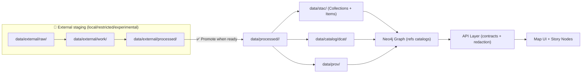

# `data/external/processed/` 🧳🧪📦


> [!NOTE]
> This folder is a **staging area** for **externally sourced datasets that have already been processed** (cleaned/normalized), but are **not yet “published” as canonical KFM datasets**.
>
> ✅ Use it for: evaluation, restricted-license, too-large-to-commit, or “not-ready-to-promote” outputs.  
> 🚀 When a dataset is ready to power **graph → API → UI**, it should be promoted to the canonical pipeline outputs and metadata.

---

<details>
  <summary><strong>📚 Table of Contents</strong></summary>

- [What belongs here](#what-belongs-here-)
- [What does not belong here](#what-does-not-belong-here-)
- [How this fits into the KFM pipeline](#how-this-fits-into-the-kfm-pipeline-)
- [Recommended folder layout](#recommended-folder-layout-)
- [File formats & conventions](#file-formats--conventions-)
- [Reproducibility rules](#reproducibility-rules-)
- [Sidecar metadata (required for anything non-trivial)](#sidecar-metadata-required-for-anything-non-trivial-)
- [Large / restricted datasets](#large--restricted-datasets-)
- [Promotion checklist](#promotion-checklist-)
- [Related docs](#related-docs-)
</details>

---

## What belongs here ✅

Store **processed external outputs** that are:

- 🧼 **Cleaned + standardized** (schemas normalized, columns named, units consistent, CRS documented)
- 🧪 **Experimental** outputs used during exploration/validation
- 🔒 **License-restricted** or **sensitive** derivatives that can’t be published directly
- 🧱 **Large** outputs that shouldn’t be committed as raw binaries (use pointers + checksums)

Examples:
- A “trial” GeoParquet built from a third-party shapefile
- A temporary raster mosaic built for QA
- A cleaned CSV extract you’re validating before formal ingestion
- A pre-redaction version used only by maintainers

---

## What does not belong here ❌

- 🧊 **Raw downloads / originalsWS / originals** → `data/external/raw/` (or canonical `data/raw/<domain>/`)
- 🧰 **Intermediate scratch outputs** → `data/external/work/` (or canonical `data/work/<domain>/`)
- ✅ **Canonical published outputs** consumed by KFM catalogs/graph/UI → `data/processed/<domain>/`
- 🔑 Secrets, tokens, credentials (ever) 😅

> [!IMPORTANT]
> Anything referenced by the **catalogs (STAC/DCAT/PROV)** should point to **stable outputs** (typically `data/processed/**` or equivalent stable storage), not ephemeral experiments.

---

## How this fits into the KFM pipeline 🧭



**Rule of thumb:**  
If you want it to become **evidence** that can power **graph/API/UI**, it needs to graduate out of `data/external/processed/` and into the canonical publishing flow.

---

## Recommended folder layout 📁

Keep the structure predictable so future you (and CI) can reason about it:

```text
📁 data/external/processed/
  📁 <domain>/                     # e.g., historical, environmental, transportation
    📁 <dataset_slug>/              # short + stable identifier (snake_case)
      📁 vYYYYMMDD/                 # date-based version OR vX.Y.Z
        📄 <dataset_slug>.<ext>     # primary artifact
        📄 checksums.sha256         # sha256 for every artifact (incl. pointers)
        📄 dataset.meta.yaml        # required sidecar (see template below)
        📄 README.md                # optional dataset-level runbook
```

**Versioning tips 🏷️**
- Prefer `vYYYYMMDD` for “snapshot” data pulls.
- Prefer semantic `vX.Y.Z` for curated releases you intend to promote.

---

## File formats & conventions 🧾

Use formats that support **reproducibility + long-term stability**:

### ✅ Preferred
- **Vector**: GeoPackage (`.gpkg`), GeoParquet (`.parquet`), FlatGeobuf (`.fgb`)
- **Raster**: Cloud-Optimized GeoTIFF (`.tif` / COG), GeoTIFF
- **Tabular**: Parquet (`.parquet`), CSV (`.csv`) for small/portable exports
- **Docs**: Markdown (`.md`), JSON (`.json`), JSON-LD (`.jsonld`), YAML (`.yml/.yaml`)

### ⚠️ Allowed, but avoid if you can
- Shapefile (legacy multi-file complexity)
- GeoJSON for large vectors (size + performance)

### 🚫 Avoid
- Pickle/joblib blobs as “data” (not portable, security risk)
- Undocumented proprietary formats

**Naming conventions**
- `snake_case` file names
- No spaces
- If multiple outputs: suffix with intent (e.g., `_qa`, `_clipped`, `_redacted`, `_tileindex`)

---

## Reproducibility rules ♻️

Treat processed outputs as *regenerable artifacts*, not hand-crafted files:

- 🔁 **Idempotent builds**: re-running the pipeline with the same inputs/config should yield the same outputs
- 🧾 **Fully logged**: record inputs, parameters, tool versions, and commit hash (in `dataset.meta.yaml`)
- ✋ **No manual edits** of processed outputs — fix the pipeline, then rebuild
- 🧠 **AI/analysis outputs** should be treated as evidence artifacts with full provenance if promoted (not “magic files”)

---

## Sidecar metadata (required for anything non-trivial) 🗂️

Every dataset folder should include a lightweight **sidecar metadata** file:

**`dataset.meta.yaml` (template)**
```yaml
id: <dataset_slug>
title: "<Human friendly title>"
domain: <domain>

source:
  name: "<Provider / archive / agency>"
  url: "<Where it came from>"
  retrieved_at: "YYYY-MM-DD"
  license: "<SPDX id or human-readable license>"
  notes: "<Any restrictions or attribution requirements>"

processing:
  stage: "external/processed"
  pipeline:
    entrypoint: "pipelines/<script_or_notebook>"
    config: "configs/<config_file_if_any>"
    git_commit: "<commit_sha>"
  inputs:
    - "data/external/raw/<domain>/<...>"
  outputs:
    - "data/external/processed/<domain>/<dataset_slug>/<version>/<file>"
  checksums_file: "checksums.sha256"

data_characteristics:
  type: "vector|raster|tabular|document"
  crs: "EPSG:4326"       # or specify actual CRS + why
  temporal: "<time range or null>"
  spatial: "<bbox or description>"
  sensitivity: "public|internal|restricted"
  redaction:
    applied: false
    method: null
    notes: null

quality:
  validation:
    - "<what was checked>"
  known_issues:
    - "<edge cases, missing fields, etc.>"
```

> [!TIP]
> Even if you *don’t* publish this dataset, the sidecar metadata makes the work auditable and prevents “mystery files” from piling up.

---

## Large / restricted datasets 🧱🔒

If the dataset is too large to commit or license-restricted:

- ✅ Commit **metadata + checksums + pointer**, not the full binary
- ✅ Include a small **`FETCHING.md`** or **`SOURCE.txt`** describing how maintainers can obtain it
- ✅ Prefer stable external storage (object store, release artifact, institutional archive)
- ✅ Ensure the pointer references an **immutable version** (hash, DOI, or versioned URL)

**Example pointer file ideas**
- `external.uri.json` (contains URL + checksum + expected filename)
- `FETCH.sh` (simple fetch script; no secrets; deterministic)
- Git LFS pointer (when allowed)

---

## Promotion checklist 🚀

Before moving anything into canonical `data/processed/<domain>/` and exposing via catalogs:

- [ ] ✅ License confirmed and compatible (and recorded)
- [ ] ✅ Sensitivity reviewed (FAIR+CARE concerns considered)
- [ ] ✅ Output schema stable + documented
- [ ] ✅ CRS and units documented and standardized
- [ ] ✅ Deterministic build (re-run produces same checksums)
- [ ] ✅ STAC + DCAT + PROV created/updated
- [ ] ✅ Domain runbook updated (`docs/data/<domain>/README.md`)
- [ ] ✅ If data could be sensitive: redaction/generalization applied **before** publish

> [!WARNING]
> If a dataset includes sensitive locations (e.g., archaeological sites) or sovereignty-sensitive data, treat it as **restricted by default** and route through governance + redaction rules before publication.

---

## Related docs 📚🔗

- 📘 `docs/MASTER_GUIDE_v13.md` — canonical pipeline ordering + contracts
- 🧩 `docs/standards/` — KFM profiles (STAC/DCAT/PROV) + validation expectations
- 🗺️ `docs/data/<domain>/README.md` — domain-level ETL runbook (sources, transforms, gotchas)
- 🧪 `src/pipelines/` or `pipelines/` — dataset import + normalization entrypoints (project-dependent)

---

🧠 **Design intent (in one sentence):**  
`data/external/processed/` exists so we can iterate quickly on external inputs while keeping the canonical, provenance-driven KFM publication flow clean and governed. ✅

