# 🧱 `data/external/raw/` — External Raw Data (Immutable Snapshots)


> 🧠 **Rule of thumb:** If you didn’t obtain it *exactly* like this from the source (download/FOIA/partner/archive pull), it **does not** belong here.  
> ✅ Raw is **evidence**. Processing happens elsewhere.

---

## 🎯 Purpose

This folder is the **staging area for externally sourced raw inputs** (gov portals, archives, partner drops, scanned maps, shapefiles, CSVs, imagery, PDFs, etc.).  
Files in `data/external/raw/` are treated as **immutable, write-once artifacts** that downstream pipelines can reference to produce:

- 🧪 `data/work/…` (intermediate / scratch outputs)
- ✅ `data/processed/…` (publishable data products)
- 🧾 `data/stac/…` + `data/catalog/dcat/…` (metadata)
- 🧬 `data/prov/…` (lineage / provenance)

---

## 🗺️ Where this sits in the KFM “truth path”

```mermaid
flowchart LR
  A["🧱 External Raw (data/external/raw)"] --> B["🧪 ETL + Normalization (src/pipelines)"]
  B --> C["✅ Processed (data/processed)"]
  C --> D["🧾 STAC (data/stac)"]
  C --> E["📚 DCAT (data/catalog/dcat)"]
  C --> F["🧬 PROV (data/prov)"]
  D --> G["🕸️ Graph / Index (src/graph)"]
  E --> G
  F --> G
  G --> H["🔌 API (src/server)"]
  H --> I["🗺️ UI (web/)"]
  I --> J["📜 Story Nodes + Focus Mode (docs/reports/story_nodes)"]
```



🔒 **Non‑negotiable:** provenance + catalogs are created **before** narrative/UI claims.

---

## ✅ What belongs here

- 📦 Original downloads (ZIPs, CSVs, PDFs, GeoTIFFs, shapefiles, etc.)
- 🧾 Source “sidecars” (metadata + terms + checksums)
- 🗃️ Partner deliveries (with an access/terms file and classification)
- 🗺️ Scanned historical map artifacts (unmodified originals)
- 🧪 Raw logs from acquisition scripts (optional but helpful)

---

## 🚫 What does **not** belong here

- ❌ Cleaned/standardized files (go to `data/work/` or `data/processed/`)
- ❌ “Fixed” raw data edited in-place
- ❌ Derived outputs, AI products, OCR text corpora (go to `data/processed/` + STAC/DCAT/PROV)
- ❌ Database dumps as a substitute for raw evidence
- ❌ Secrets: API keys, cookies, bearer tokens, session files, `.env`, credentials

---

## 🧱 Non‑negotiable rules

1. **Write-once, read-only** 🧊  
   - Do not edit raw files in place.
   - If an upstream correction is needed: **re-download** into a new version folder and document it.

2. **Pipelines must never mutate raw** 🛑  
   - Pipelines *read* from `data/external/raw/…` and *write* to `data/work/…` + `data/processed/…`.

3. **Every dataset folder must carry: Source + License/Terms + Checksums** 🧾  
   - No “mystery datasets.” If we can’t explain it, we can’t ship it.

4. **Classification & sensitivity are first-class** ⚖️  
   - If the data is sensitive (cultural sites, Indigenous sovereignty concerns, PII, etc.), it must be labeled and handled as restricted, with redaction happening downstream.

5. **No manual “quick fixes” to processed outputs** 🧰  
   - Corrections must be represented as pipeline changes (or a new raw snapshot version), not hand-edits to the published data products.

---

## 🗂️ Recommended layout

> Keep structure **domain-first** so ownership and governance are obvious.

```text
📁 data/
└─ 📁 external/
   └─ 📁 raw/                                        🧾 external source snapshots (immutable / never overwrite)
      └─ 📁 <domain>/                                🧭 thematic bucket (e.g., historical/, hydrology/, air-quality/, soils/)
         └─ 📁 <dataset_slug>/                       🏷️ short, stable dataset identifier (slug)
            └─ 📁 <version_or_YYYY-MM-DD>/           🧊 versioned snapshot (new folder per pull; no edits-in-place)
               ├─ 📄 SOURCE.yaml                     ✅ required: acquisition + upstream refs + notes (who/what/when/how)
               ├─ 📄 LICENSE.txt                     ✅ required: license/terms (or 📄 TERMS.txt)
               ├─ 📄 MANIFEST.sha256                 ✅ required: checksums for every file in this snapshot
               ├─ 📄 ACCESS.md                       ✅ required if restricted: access rules + contact (NO credentials)
               ├─ 📄 DATA_DICTIONARY.md              ◻️ recommended: tabular schema, columns, units, code meanings
               └─ 📦 original_files...               🧱 raw artifacts (unaltered: zips, geotiffs, csvs, shp, pdfs, etc.)
```

**Naming tips** ✍️  
- `domain/`: `kebab-case` or `snake_case` (pick one per repo)  
- `dataset_slug/`: stable + descriptive, avoid dates here  
- version folder: `YYYY-MM-DD` or `v1`, `v2` (prefer dates for “download snapshots”)

---

## 📌 Required sidecar files

| File | Required | Why it exists 🧠 | Notes |
|---|---:|---|---|
| `SOURCE.yaml` | ✅ | Source + retrieval method + scope + license pointer | Update per snapshot |
| `LICENSE.txt` / `TERMS.txt` | ✅ | Terms attached to this dataset | Prefer SPDX identifier in `SOURCE.yaml` |
| `MANIFEST.sha256` | ✅ | Integrity + reproducibility | Must cover *every* file in the snapshot |
| `ACCESS.md` | ⚠️ If restricted | How to obtain access legitimately | **Never** store secrets |
| `DATA_DICTIONARY.md` | ⭐ Recommended | Column meaning, units, codes | Or link to `schemas/…` |
| `NOTES.md` | ⭐ Optional | Human notes: quirks, known issues | Keep factual; no interpretation |

---

## 🧾 `SOURCE.yaml` template (copy/paste)

<details>
<summary>📄 Click to expand <code>SOURCE.yaml</code> template</summary>

```yaml
dataset_id: "external-raw--<domain>--<dataset_slug>--<version>"
title: "<Human readable title>"

source:
  provider: "<Agency / Archive / Partner>"
  url: "<Primary landing page or download URL>"
  retrieved_at: "YYYY-MM-DDTHH:MM:SSZ"
  retrieval_method: "manual | script:<script_name> | partner_drop"
  citation: "<How to cite (if provided)>"

license:
  spdx: "<SPDX id if known, else 'NOASSERTION'>"
  terms_url: "<URL to terms/license>"
  restrictions: "<brief plain-language summary>"

coverage:
  spatial:
    description: "<e.g., Kansas statewide>"
    bbox: [west, south, east, north]   # optional
    crs: "EPSG:4326"                   # optional
  temporal:
    start: "YYYY-MM-DD"                # optional
    end: "YYYY-MM-DD"                  # optional

integrity:
  checksum_algorithm: "sha256"
  manifest_file: "MANIFEST.sha256"

governance:
  classification: "public | restricted | confidential"
  pii: "none | possible | present"
  sovereignty:
    care_applicable: false
    notes: "<if applicable, explain governance guardrails>"
  sensitive_locations: false

notes:
  - "Raw files are unmodified snapshots from the source."
  - "Downstream processing occurs via src/pipelines/… and emits STAC/DCAT/PROV."
```
</details>

---

## 🔐 Integrity: `MANIFEST.sha256` (checksums)

Generate checksums **for every file** in the version folder:

### macOS / Linux
```bash
cd data/external/raw/<domain>/<dataset_slug>/<version_or_YYYY-MM-DD>
find . -type f ! -name "MANIFEST.sha256" -print0 | sort -z | xargs -0 sha256sum > MANIFEST.sha256
sha256sum -c MANIFEST.sha256
```

### Windows (PowerShell)
```powershell
cd data\external\raw\<domain>\<dataset_slug>\<version_or_YYYY-MM-DD>
Get-ChildItem -Recurse -File |
  Where-Object { $_.Name -ne "MANIFEST.sha256" } |
  Sort-Object FullName |
  ForEach-Object { (Get-FileHash $_.FullName -Algorithm SHA256).Hash + "  " + $_.FullName } |
  Out-File -Encoding ASCII MANIFEST.sha256
```

✅ **Why we care:** checksums allow PROV lineage to reference exact input identities (not just filenames), and prevent silent drift.

---

## 📦 Large or restricted datasets

Some raw inputs are too large for normal Git, or cannot be redistributed due to license.

### Allowed options (pick one) ✅

1. **Git LFS** (preferred when redistribution is allowed but files are big)  
2. **Pointer + fetch script** (preferred when files are huge *or* legally restricted)  
   - Keep `SOURCE.yaml`, `LICENSE/TERMS`, and a pointer file committed.
   - The pointer file must include **checksum + exact version/date**.
3. **External storage + checksum registry** (last resort)  
   - Still commit metadata + manifest for identity tracking.

### Minimal pointer file suggestion

Create `FETCH.yaml` (or `POINTER.json`) next to `SOURCE.yaml`:

```yaml
artifact:
  storage: "s3 | gdrive | onedrive | institutional_repo"
  uri: "<stable link or access instructions>"
  sha256: "<expected checksum>"
  size_bytes: 123456789
access:
  auth: "none | request_access"
  contact: "<email or process>"
```

🚫 **Never** store credentials in any pointer file.

---

## 🧬 Provenance handoff (what downstream must record)

When a dataset leaves raw stage (i.e., produces something in `data/processed/…`), the pipeline must emit:

- 🧾 **STAC** record(s) for geospatial assets (`data/stac/...`)
- 📚 **DCAT** dataset entry (`data/catalog/dcat/...`)
- 🧬 **PROV** bundle (`data/prov/...`) that links:
  - raw entities (files in this folder, with checksum)
  - processing activity (pipeline + config + run timestamp)
  - agent (software + human/CI identity)

> 🔗 PROV must connect the full chain: **raw → work → processed**, and identify the run/config/commit that produced the output.

---

## ⚖️ Governance & sensitivity (FAIR + CARE)

External raw data is where risk enters the system. Treat it seriously:

- 🧭 **New external sources** may require governance review (license, provenance quality, standards alignment).
- 🧱 **Sensitive layers** (archaeological sites, tribal lands, personal info, etc.) must be:
  - marked restricted/confidential in `SOURCE.yaml`
  - redacted/generalized in processed outputs
  - labeled in metadata
  - governed at API/UI exposure

✅ If in doubt: classify as **restricted**, document why, and require review.

---

## ✅ Quick “Add Dataset” checklist

- [ ] Create a domain folder (if needed): `data/external/raw/<domain>/`
- [ ] Create dataset folder: `<dataset_slug>/<YYYY-MM-DD>/`
- [ ] Drop raw artifacts **unaltered**
- [ ] Add `SOURCE.yaml`
- [ ] Add `LICENSE.txt` or `TERMS.txt`
- [ ] Generate `MANIFEST.sha256`
- [ ] If restricted: add `ACCESS.md` (no secrets)
- [ ] If tabular: add `DATA_DICTIONARY.md` (or link to schema)
- [ ] Confirm downstream pipeline will:
  - [ ] read raw (no mutation)
  - [ ] write work + processed
  - [ ] emit STAC/DCAT/PROV

---

## 🔗 Helpful references (repo-local)

- 📘 Master Guide (canonical pipeline + invariants): `../../../docs/MASTER_GUIDE_v13.md`
- 🧾 STAC profile: `../../../docs/standards/KFM_STAC_PROFILE.md`
- 📚 DCAT profile: `../../../docs/standards/KFM_DCAT_PROFILE.md`
- 🧬 PROV profile: `../../../docs/standards/KFM_PROV_PROFILE.md`
- 🧪 Pipelines home: `../../../src/pipelines/`

---

## 🧠 Tiny FAQ

**Q: Can I “clean up” a CSV header in raw?**  
A: ❌ No. Put the cleaned version in `data/work/…` or `data/processed/…` and record it in PROV.

**Q: The source updated the dataset in place. What do we do?**  
A: Create a **new version folder** (new date/version), re-download, re-checksum, update `SOURCE.yaml`.

**Q: Do we store extracted files from a ZIP?**  
A: Prefer: keep the original ZIP **and** extracted folder if extraction is necessary for pipelines—then checksum both.

---

> 🧊 **Remember:** Raw is evidence. Everything else is interpretation.  
> Keep it clean, immutable, and traceable. 🧭

