# 🧰 `data/external/work/` Workdir Convention (KFM)


---

## 🎯 Goal

Create a standardized, parseable, and reproducible staging workspace for external data pulls and scratch processing:

📁 **Target path pattern**
```
data/external/work/<source_slug>__<dataset_slug>__v<ver>__YYYY-MM-DD/
```

This pattern is designed to support KFM’s:
- **Canonical pipeline order** (Raw → Processed → Catalog/Prov → Database → API → UI):contentReference[oaicite:1]{index=1}
- **Non-interactive, deterministic pipelines** (byte-identical outputs on re-run; avoid duplicate copies when nothing changed):contentReference[oaicite:2]{index=2}
- **Repository structure** where official datasets live under `data/raw`, `data/processed`, `data/catalog`, and `data/provenance`:contentReference[oaicite:3]{index=3}

---

## 🧭 Where this fits in KFM’s flow

```mermaid
flowchart LR
  A["🌐 External source\n(USGS/NOAA/Census/etc.)"] --> B["🧪 data/external/work/<...>/\n(staging + QC + logs)"]
  B --> C["🧊 data/raw/\n(immutable snapshots)"]
  C --> D["🧼 data/processed/\n(clean outputs)"]
  D --> E["🧾 data/catalog + data/provenance\n(STAC/DCAT + PROV)"]
  E --> F["🗄️ Database"]
  F --> G["🧩 API"]
  G --> H["🖥️ UI"]
```



> [!IMPORTANT]
> `data/external/work/` is **staging** (workspace). “Official truth” still moves through KFM’s canonical pipeline steps:contentReference[oaicite:4]{index=4} and ends up under `data/raw/`, then `data/processed/`, plus required catalog/provenance updates:contentReference[oaicite:5]{index=5}.

---

## 🧩 Naming convention

### ✅ Format
`<source_slug>__<dataset_slug>__v<ver>__YYYY-MM-DD`

### 🔎 Token definitions

| Token | Meaning | Example | Rules (recommendation) |
|------|---------|---------|------------------------|
| `source_slug` | Stable identifier for upstream provider | `usgs`, `noaa`, `census`, `khi`, `kgs` | lowercase; avoid spaces; avoid `__` |
| `dataset_slug` | Stable identifier for the dataset within the source | `gnis_place_names`, `ghcn_daily`, `decennial_1900` | lowercase; descriptive; avoid `__` |
| `ver` | KFM integration version for this dataset (schema/transform version) | `1`, `2`, `1.1.0` | digits + dots; **do not include leading `v`** |
| `YYYY-MM-DD` | Workdir creation / ingestion run date (ISO) | `2026-01-29` | always ISO-8601 date |

### ✅ Regex (strict parser)
```regex
^(?<source>[a-z0-9][a-z0-9_-]*)__(?<dataset>[a-z0-9][a-z0-9_-]*)__v(?<ver>[0-9]+(\.[0-9]+)*)__(?<date>[0-9]{4}-[0-9]{2}-[0-9]{2})$
```

> [!NOTE]
> We’re using `__` as the **delimiter**, so slugs must **not contain `__`** (single `_` is okay).

---

## 🏗️ Standard folder template inside a workdir

Example:
📁 `data/external/work/usgs__gnis_place_names__v1__2026-01-29/`

Recommended contents:

```
📦 data/external/work/usgs__gnis_place_names__v1__2026-01-29/
├── 📝 README.md
├── 🧾 manifest.json          # inputs + checksums + URLs + license notes
├── 🧷 work.yml               # quick machine-readable header (optional)
├── 📥 00_inbox/              # raw downloads (as-received)
├── 🗜️ 10_extract/            # unzipped/unpacked artifacts
├── 🧼 20_normalize/          # cleaned intermediate (not final processed)
├── ✅ 30_qc/                 # validation reports, summaries
├── 📜 logs/                  # pipeline logs
└── 🧹 tmp/                   # safe-to-delete scratch
```

Why these pieces:
- Pipelines should be deterministic and avoid creating “duplicate copies” on re-run:contentReference[oaicite:6]{index=6}, so storing **manifest + checksums** makes “nothing changed” detectable.
- KFM requires outputs go to `data/processed/` and metadata/provenance updates are a “hard requirement”:contentReference[oaicite:7]{index=7}—the workdir should make those steps easier, not replace them.

---

## 🧾 Minimal `work.yml` template (copy/paste)

```yaml
# work.yml
source_slug: usgs
dataset_slug: gnis_place_names
kfm_version: "1"
work_date: "2026-01-29"

upstream:
  name: "U.S. Geological Survey"
  homepage: null
  license: "UNKNOWN"  # fill ASAP (fail-closed governance expects this):contentReference[oaicite:8]{index=8}
  retrieval:
    method: "https"
    urls:
      - null

notes:
  purpose: "Staging + QC for ingestion into KFM raw/processed pipeline"
  owner: "@your-handle"
```

---

## 🧾 Minimal `manifest.json` template (copy/paste)

```json
{
  "workdir": "usgs__gnis_place_names__v1__2026-01-29",
  "created_utc": "2026-01-29T00:00:00Z",
  "inputs": [
    {
      "path": "00_inbox/source.zip",
      "bytes": 0,
      "sha256": "REPLACE_ME",
      "source_url": "REPLACE_ME",
      "retrieved_utc": "REPLACE_ME"
    }
  ],
  "outputs": [],
  "license": {
    "spdx": "UNKNOWN",
    "notes": "Fill before promotion to data/raw + PR"
  }
}
```

---

## 🚀 Quick create commands

### Option A — Bash (simple + reliable)

```bash
# Inputs
SOURCE_SLUG="usgs"
DATASET_SLUG="gnis_place_names"
VER="1"
DATE="$(date +%F)"  # YYYY-MM-DD

WORKDIR="data/external/work/${SOURCE_SLUG}__${DATASET_SLUG}__v${VER}__${DATE}"

mkdir -p "${WORKDIR}"/{00_inbox,10_extract,20_normalize,30_qc,logs,tmp}
touch "${WORKDIR}/README.md" "${WORKDIR}/manifest.json" "${WORKDIR}/work.yml"

echo "✅ Created: ${WORKDIR}"
```

### Option B — Python helper (slug safety + parsing)

```python
from __future__ import annotations
from dataclasses import dataclass
from datetime import date
from pathlib import Path
import re

SAFE_SLUG = re.compile(r"^[a-z0-9][a-z0-9_-]*$")

def assert_slug(name: str, value: str) -> None:
    if "__" in value or not SAFE_SLUG.match(value):
        raise ValueError(f"{name} must match {SAFE_SLUG.pattern} and must not contain '__' (got: {value!r})")

@dataclass(frozen=True)
class WorkdirId:
    source_slug: str
    dataset_slug: str
    ver: str
    day: str  # YYYY-MM-DD

    def dirname(self) -> str:
        return f"{self.source_slug}__{self.dataset_slug}__v{self.ver}__{self.day}"

def make_workdir(
    source_slug: str,
    dataset_slug: str,
    ver: str,
    day: str | None = None,
    root: Path = Path("data/external/work"),
) -> Path:
    assert_slug("source_slug", source_slug)
    assert_slug("dataset_slug", dataset_slug)
    if ver.startswith("v"):
        raise ValueError("ver should not include leading 'v' (use ver='1.0.0', not 'v1.0.0')")
    if day is None:
        day = date.today().isoformat()

    wid = WorkdirId(source_slug, dataset_slug, ver, day)
    p = root / wid.dirname()
    for sub in ["00_inbox", "10_extract", "20_normalize", "30_qc", "logs", "tmp"]:
        (p / sub).mkdir(parents=True, exist_ok=True)
    for f in ["README.md", "manifest.json", "work.yml"]:
        (p / f).touch(exist_ok=True)
    return p

if __name__ == "__main__":
    print(make_workdir("usgs", "gnis_place_names", "1"))
```

---

## 🔒 Git + Governance expectations

KFM emphasizes **fail-closed governance** (missing license/requirements should block merges):contentReference[oaicite:9]{index=9} and CI checks that ensure processed data is paired with catalog + provenance entries:contentReference[oaicite:10]{index=10}.

### Recommended policy
- ✅ Commit:
  - `README.md`, `work.yml`, `manifest.json` (small, text, provenance-friendly)
  - QC summaries under `30_qc/` (if small + useful)
- ❌ Do NOT commit:
  - large downloads in `00_inbox/` (unless you intentionally version them)
  - ephemeral scratch in `tmp/`

Suggested `.gitignore` pattern:
```gitignore
# External work artifacts (keep lightweight metadata if you want)
data/external/work/**/00_inbox/
data/external/work/**/10_extract/
data/external/work/**/20_normalize/
data/external/work/**/tmp/
data/external/work/**/logs/
```

> [!TIP]
> If you later decide certain upstream “raw snapshots” must be committed, promote them into `data/raw/` (the blueprint calls raw “immutable snapshots” and pipelines should treat them as read-only):contentReference[oaicite:11]{index=11}.

---

## 🔁 Promotion workflow (workdir → KFM official)

A practical workflow aligned with the blueprint:

1) **Stage** external downloads + unpack  
   - `00_inbox/`, `10_extract/`

2) **Normalize** into consistent intermediates  
   - `20_normalize/` (still not “official processed”)

3) **QC + sanity checks**  
   - `30_qc/` (geo validity, schema checks, row counts, coordinate sanity, etc.)
   - CI-style validation is explicitly part of the KFM workflow (e.g., validating GeoJSON and checking metadata expectations):contentReference[oaicite:12]{index=12}

4) **Promote to KFM “raw”**  
   - copy/convert “as-trustworthy snapshot” into `data/raw/<...>/`  
   - remember: raw is **read-only snapshot input** for pipelines:contentReference[oaicite:13]{index=13}

5) **Run official pipeline → write to `data/processed/`**  
   - pipelines write cleaned outputs to `data/processed/`:contentReference[oaicite:14]{index=14}

6) **Update metadata + provenance (required)**  
   - update `data/catalog/` + `data/provenance/` (hard requirement):contentReference[oaicite:15]{index=15}

---

## ✅ Checklist (new dataset ingest)

- [ ] Choose `source_slug` + `dataset_slug` (stable + no `__`)
- [ ] Pick `ver` (bump when transform/schema changes)
- [ ] Create workdir with today’s ISO date
- [ ] Fill `work.yml` license + upstream URLs (**before PR**):contentReference[oaicite:16]{index=16}
- [ ] Populate `manifest.json` with checksums (supports “avoid duplicate copies”):contentReference[oaicite:17]{index=17}
- [ ] Promote snapshot to `data/raw/` (immutable input):contentReference[oaicite:18]{index=18}
- [ ] Run pipeline → `data/processed/`:contentReference[oaicite:19]{index=19}
- [ ] Update `data/catalog/` + `data/provenance/` (required):contentReference[oaicite:20]{index=20}
- [ ] Open PR; CI should validate expectations:contentReference[oaicite:21]{index=21}

---

## 📚 Project references

- Kansas Frontier Matrix (KFM) – Comprehensive Technical Blueprint :contentReference[oaicite:22]{index=22}
- (Optional reading) Visualization of Time-Oriented Data :contentReference[oaicite:23]{index=23}
- (Optional reading) Data Spaces :contentReference[oaicite:24]{index=24}

---

