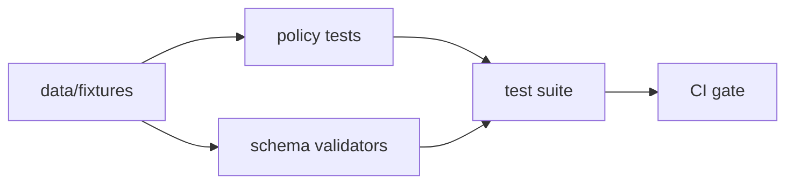

# data/fixtures
Version-controlled **fixture data** used to test and demonstrate KFM pipelines, policy, catalogs, and UI in a **repo-safe** way.

**Status:** Draft · **Owners:** TBD · **Scope:** CI tests, local dev, docs/examples

**Quick nav:**
[Scope](#scope) · [Governance and safety rules](#governance-and-safety-rules) · [Recommended folder layout](#recommended-folder-layout) · [Adding or modifying fixtures](#adding-or-modifying-fixtures) · [Definition of Done](#definition-of-done-for-a-new-fixture)

---

## Scope

Fixtures are **small, deterministic samples** that make it easy to:

- Run unit/integration tests without pulling large datasets
- Regression-test **policy decisions** (allow/deny + obligations)
- Validate **schemas and contracts** with known-good and known-bad examples
- Provide stable example inputs for docs, demos, and UI smoke tests

> **NOTE**
> Fixtures are *not* a substitute for KFM’s data lifecycle zones (RAW → WORK/QUARANTINE → PROCESSED → PUBLISHED). Treat fixtures as **controlled examples**—not as source-of-truth data.

---

## Governance and safety rules

> **WARNING**
> Anything committed under `data/fixtures/` must be safe to share with all repo readers.

Minimum rules:

1. **No secrets.** Never commit credentials, tokens, private keys, or internal endpoints.
2. **No sensitive locations or vulnerable infrastructure.** If a fixture needs geography, prefer:
   - synthetic coordinates, or
   - **generalized** geometries (grid/aggregation/dissolve), never precise points.
3. **No personal data.** Do not include PII (names, emails, phone numbers, addresses) unless irreversibly anonymized and policy-approved.
4. **License and rights must be explicit.** If a fixture derives from a real source, record the license/terms snapshot and attribution expectations.
5. **Deterministic and minimal.** Keep fixtures small, stable across platforms, and resistant to “noise” diffs.

---

## How fixtures support fail-closed governance (conceptual)



---

## Recommended folder layout

This is a **suggested** structure (add folders as you need them):

```text
data/fixtures/
  README.md

  policy/
    decisions/          # input + expected allow/deny + obligations
    inputs/             # reusable policy inputs (user context, dataset labels)

  contracts/
    schemas/            # schema fixtures (valid + invalid)
    api/                # example API payloads (requests/responses)

  catalog/
    dcat/               # DCAT dataset fixtures
    stac/               # STAC collection/item fixtures
    prov/               # PROV lineage fixtures

  data/
    tabular/            # tiny CSV/Parquet examples
    vector/             # tiny GeoJSON/GeoParquet examples
    raster/             # tiny COG metadata stubs or minimal tiles
    text/               # small corpora for indexing tests

  stories/
    story_nodes/        # Story Node examples used in docs/UI
    evidence_bundles/   # Evidence bundle fixtures
```

---

## Adding or modifying fixtures

### 1) Pick the right fixture type

Use the smallest representation that proves the behavior you need:

- **Policy regression:** one input + one expected decision
- **Schema validation:** one *valid* example + one *invalid* example per critical rule
- **Catalog/link checks:** a minimal DCAT/STAC/PROV triplet that cross-links correctly
- **Spatial behavior:** a tiny geometry set that exercises edge cases (CRS, bbox, time range)

### 2) Keep fixtures self-describing

**Recommended:** include a sibling metadata file next to each fixture (example name: `fixture.meta.json`).

Minimum suggested fields:

| Field | Why it exists |
|---|---|
| `id` | Stable identifier for referencing the fixture in tests/docs |
| `type` | `policy_decision`, `schema_example`, `catalog_example`, `ui_example`, etc. |
| `purpose` | What behavior this fixture exists to cover |
| `license` | What allows us to commit/share it |
| `sensitivity` | `public` unless explicitly approved otherwise |
| `source` | `synthetic` or a source citation/terms snapshot reference |
| `created` / `updated` | ISO dates for traceability |

Example:

```json
{
  "id": "fixture.kfm.policy.allow_public_dataset.v1",
  "type": "policy_decision",
  "purpose": "Regression test that public datasets are readable with no obligations",
  "license": "CC0-1.0",
  "sensitivity": "public",
  "source": "synthetic",
  "created": "2026-02-22",
  "updated": "2026-02-22"
}
```

### 3) Pair fixtures with tests

- Add (or update) a test that consumes the fixture.
- Prefer **golden** expected outputs for policy decisions and schema validations.
- Treat fixture changes as **breaking** unless they are strictly additive.

---

## Definition of Done for a new fixture

- [ ] Fixture is **small** (commit-friendly) and **deterministic**
- [ ] Fixture is **repo-safe** (no secrets, no PII, no sensitive locations)
- [ ] License/rights are recorded (or fixture is clearly synthetic)
- [ ] A test uses the fixture (unit, integration, or contract test)
- [ ] If the fixture is an *invalid* example, the test asserts the expected failure mode

---

## References

- *Kansas Frontier Matrix (KFM) — Definitive Design & Governance Guide (vNext)*
- *KFM Integration Idea Pack (Ready-to-Integrate), 2026-02-15 (draft)*
