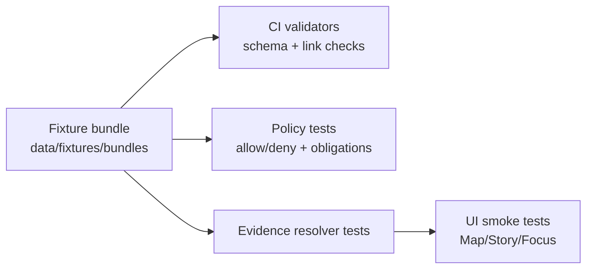

<!-- [KFM_META_BLOCK_V2]
doc_id: kfm://doc/8b8f5cc7-4d5d-4fda-9b4a-0e9d7f2c1b1a
title: data/fixtures README
type: standard
version: v1
status: draft
owners: kfm-data-eng,kfm-governance
created: 2026-02-22
updated: 2026-02-22
policy_label: internal
related:
  - kfm://doc/kfm-definitive-design-governance-guide@vnext
tags:
  - kfm
  - fixtures
  - data
  - governance
notes:
  - Defines what fixture bundles are, how to add them, and the minimum governance gates they must satisfy.
[/KFM_META_BLOCK_V2] -->

# data/fixtures

Small, governed fixture bundles used to test KFM pipelines, catalogs, policy gates, and UI evidence resolution.


## Navigation

- [What belongs here](#what-belongs-here)
- [Hard rules](#hard-rules)
- [Recommended layout](#recommended-layout)
- [Fixture manifest](#fixture-manifest)
- [How fixtures are used](#how-fixtures-are-used)
- [Add a fixture](#add-a-fixture)
- [Definition of done](#definition-of-done)
- [Appendix](#appendix)

## What belongs here

Fixtures are small, deterministic data bundles that let us:

- run schema validators and link checkers in CI,
- exercise policy decisions with known allow/deny + obligations,
- test evidence resolution paths end-to-end without relying on external systems,
- keep UI stories/examples reproducible.

### What a fixture is not

- a substitute for canonical RAW/WORK/PROCESSED object storage,
- a place to commit large real-world datasets,
- a place to store secrets, API keys, or credentials.

## Hard rules

> [!IMPORTANT]
> These are fail-closed rules. If a fixture breaks them, it should be removed or moved to a non-committed location.

### Safety and sensitivity

- Fixtures MUST NOT include real sensitive-location coordinates or other restricted data.
- If we need to test restricted/sensitive behavior, prefer **synthetic** fixtures (fake coordinates/data), and set the `policy_label` accordingly.

### Licensing

- Every fixture MUST carry explicit license / rights information.
- If rights are unclear, the fixture MUST be treated as quarantined and MUST NOT be used as a “public” example.

### Reproducibility

- Fixtures SHOULD be deterministic and stable over time.
- If a fixture changes, treat it like a new version: bump `dataset_version_id` and update digests.

### Size budget

- **PROPOSED:** keep individual fixture bundles ≤ 5 MB and the whole directory ≤ 50 MB.
  - If a test needs more, use generated-at-test-time data instead of committing binaries.

## Recommended layout

This folder intentionally mirrors KFM’s promotion surfaces at a tiny scale: processed artifacts + catalogs + provenance.

```text
data/fixtures/
  README.md

  # Fixture bundles (recommended)
  bundles/
    <dataset_slug>/
      <dataset_version_id>/
        fixture.manifest.json        # REQUIRED
        artifacts/                   # REQUIRED (tiny, representative)
          ...                        # GeoParquet, PMTiles, JSON, etc.
        catalogs/                    # RECOMMENDED
          dcat.jsonld
          stac/
            collection.json
            items/
              *.json
          prov/
            bundle.jsonld
        qa/
          report.json                # OPTIONAL (but encouraged)

  # Schema examples (valid/invalid) used by CI validators (optional pattern)
  schemas/
    <schema_name>/
      valid/
        *.json
      invalid/
        *.json
```

> [!NOTE]
> If the repo already has a different convention, keep the same *conceptual* pieces:
> **artifacts + digests + catalogs + policy label**.

## Fixture manifest

Each fixture bundle MUST include a manifest that describes:

- identity and version (`dataset_slug`, `dataset_version_id`, `spec_hash`),
- the committed artifacts (paths, media types, digests),
- the catalog files (if present),
- the policy label and any obligations,
- QA status (optional but recommended).

### Minimal shape

```json
{
  "kfm_fixture_manifest_version": "v1",
  "dataset_slug": "example_dataset",
  "dataset_version_id": "YYYY-MM.<hash>",
  "spec_hash": "sha256:<spec_hash>",
  "policy": {
    "policy_label": "public",
    "decision_id": "kfm://policy_decision/<id>",
    "obligations": []
  },
  "license": {
    "spdx": "CC-BY-4.0",
    "rights_holder": "Example Org",
    "attribution": "Example Org (CC BY 4.0)"
  },
  "artifacts": [
    {
      "path": "artifacts/events.parquet",
      "media_type": "application/x-parquet",
      "digest": "sha256:<digest>"
    }
  ],
  "catalogs": [
    { "path": "catalogs/dcat.jsonld", "digest": "sha256:<digest>" }
  ],
  "qa": { "status": "pass", "notes": "optional" }
}
```

### Policy labels

Use the KFM controlled vocabulary for `policy_label`:

- `public`
- `public_generalized`
- `internal`
- `restricted`
- `restricted_sensitive_location`
- `embargoed`
- `quarantine`

If a fixture uses `public_generalized`, include an obligation message that the UI can surface (example: “Geometry generalized due to policy.”).

## How fixtures are used



### Recommended test coverage

- Schema validation for all manifests, catalogs, and receipts we commit.
- Link-check cross-references between DCAT, STAC, and PROV when those catalogs exist.
- At least one “happy path” fixture that resolves through the evidence resolver.
- At least one “deny path” fixture that proves policy blocks access and does not leak restricted metadata.

## Add a fixture

1. Pick a **dataset_slug** that is stable and descriptive.
2. Generate or select a tiny representative artifact set (prefer synthetic or public-domain).
3. Compute SHA-256 digests for every artifact and catalog file.
4. Write `fixture.manifest.json`.
5. If catalogs are present, ensure DCAT/STAC/PROV cross-links are resolvable.
6. Add or update tests so CI validates:
   - the manifest schema,
   - the artifact digests,
   - the policy behavior.

> [!TIP]
> Prefer adding both a `valid/` and an `invalid/` schema example when introducing a new schema.
> Invalid fixtures should be minimal and should clearly demonstrate the rule being enforced.

## Definition of done

A fixture bundle is ready when:

- [ ] `fixture.manifest.json` exists and validates.
- [ ] All committed artifacts and catalogs have SHA-256 digests in the manifest.
- [ ] License / rights information is explicit.
- [ ] `policy_label` is assigned and matches intended usage.
- [ ] If catalogs exist, DCAT/STAC/PROV files validate and cross-link.
- [ ] CI includes at least one test that consumes the fixture (schema, policy, or evidence path).

## Appendix

<details>
<summary>Design intent and governance alignment</summary>

Fixtures exist to keep governance enforceable and testable:

- Policy semantics must match in CI and runtime.
- Promotion-style gates (identity, license, sensitivity, catalogs, checksums) prevent accidental leakage and “it worked on my machine” failures.

When in doubt: treat a fixture like a miniature dataset release.

</details>

[(back to top)](#datafixtures)
