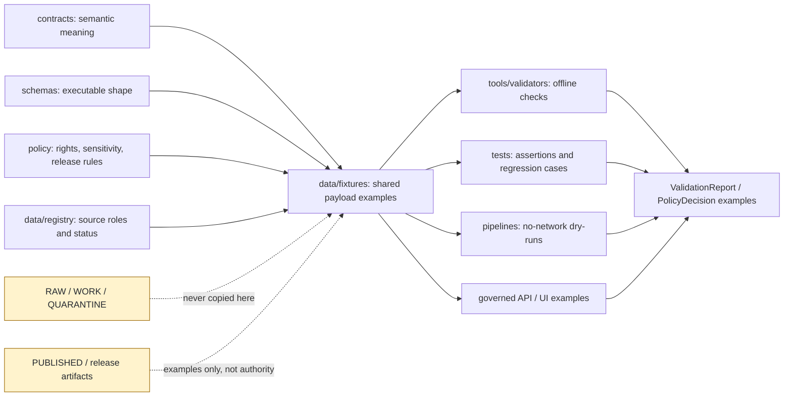

<!-- [KFM_META_BLOCK_V2]
doc_id: kfm://doc/TODO-uuid-data-fixtures-readme
title: Data Fixtures
type: standard
version: v1
status: draft
owners: TODO-data-fixtures-owners
created: 2026-04-22
updated: 2026-04-22
policy_label: TODO-policy-label
related: []
tags: [kfm, fixtures, data-lifecycle]
notes: [Created from uploaded KFM doctrine and current-session workspace scan; owners, policy label, UUID, adjacent links, and exact repo conventions need verification in a mounted checkout.]
[/KFM_META_BLOCK_V2] -->

# Data Fixtures

Tiny, public-safe fixtures for validating KFM contracts, policies, evidence payloads, and dry-run pipeline behavior — not a raw data staging area.

> [!IMPORTANT]
> **Status:** experimental / NEEDS VERIFICATION  
> **Owners:** TODO-data-fixtures-owners  
> **Badges:**  
> 
> 
> 
> 
>   
> **Quick jumps:** [Scope](#scope) · [Repo fit](#repo-fit) · [Inputs](#inputs) · [Exclusions](#exclusions) · [Directory tree](#directory-tree) · [Quickstart](#quickstart) · [Fixture rules](#fixture-rules) · [Definition of done](#definition-of-done) · [FAQ](#faq)

---

## Scope

`data/fixtures/` is the shared home for **small, reviewable, deterministic data-shaped examples** used to prove KFM behavior without reaching into live sources, secrets, unpublished stores, or public-release artifacts.

This directory supports the KFM trust posture:

```text
RAW -> WORK / QUARANTINE -> PROCESSED -> CATALOG / TRIPLET -> PUBLISHED
```

Fixtures may imitate the **shape** of governed objects, but they do not become the canonical objects themselves.

| Claim | Status | Meaning here |
| --- | --- | --- |
| This README governs `data/fixtures/` | CONFIRMED from target path requested | The file is written for this path only. |
| Exact adjacent repo conventions | UNKNOWN | The mounted repo was not available during this drafting pass. |
| Fixture-home split between `data/fixtures/`, `tests/fixtures/`, and schema-side fixtures | NEEDS VERIFICATION | This README keeps the split explicit instead of settling it by assumption. |
| Proposed starter fixture families | PROPOSED | Use only after repo conventions, schemas, and policy paths are verified. |

> [!NOTE]
> Fixtures are trust-pressure examples. They should make validators, policy gates, API envelopes, and UI payloads easier to inspect. They should not quietly mirror provider data, bypass source review, or become release evidence by accident.

[Back to top](#data-fixtures)

---

## Repo fit

| Fit point | Path or surface | Status | How to use it |
| --- | --- | --- | --- |
| This directory | `data/fixtures/` | Target path | Shared fixture payloads and public-safe data-shaped examples. |
| Upstream contracts | `contracts/**` | NEEDS VERIFICATION | Human-readable object meaning, invariants, and lifecycle semantics. |
| Upstream schemas | `schemas/contracts/v1/**` | NEEDS VERIFICATION | Machine-checkable JSON Schema or equivalent shape validation. |
| Upstream policy | `policy/**` | NEEDS VERIFICATION | Rights, sensitivity, release, denial, and no-bypass rules. |
| Upstream source registry | `data/registry/**` or equivalent | NEEDS VERIFICATION | Source-role and source-status context for fixtures derived from source examples. |
| Downstream validators | `tools/validators/**` | NEEDS VERIFICATION | Offline validation against valid and invalid fixtures. |
| Downstream tests | `tests/**` | NEEDS VERIFICATION | Runner-specific cases, assertions, golden outputs, and regression checks. |
| Downstream pipelines | `pipelines/**` | PROPOSED / NEEDS VERIFICATION | Dry-run slices may consume fixtures but must not fetch live data during fixture tests. |
| Downstream governed API/UI | `apps/governed-api/**`, `apps/web/**` | PROPOSED / NEEDS VERIFICATION | API examples, Evidence Drawer payloads, Focus Mode payloads, and finite response envelopes. |

> [!WARNING]
> Relative links to adjacent files are intentionally not activated in this README until the real checkout is inspected. Convert the path labels above into repo-relative links only after the target files exist from `data/fixtures/README.md`.

[Back to top](#data-fixtures)

---

## Inputs

Accepted inputs for this directory are the **smallest data-shaped artifacts needed to prove behavior**.

| Accepted input | Examples | Status | Why it belongs here |
| --- | --- | --- | --- |
| Valid object fixtures | `evidence_bundle/minimal.valid.json`, `source_descriptor/inactive_public_safe.valid.yaml` | PROPOSED | Proves the happy path without requiring live sources. |
| Invalid object fixtures | `evidence_bundle/missing_ref.invalid.json`, `source_descriptor/missing_rights.invalid.yaml` | PROPOSED | Makes negative paths first-class and reviewable. |
| Public-safe domain slices | `hydrology/huc12_public_safe.valid.json` | PROPOSED | Gives validators and dry-runs a tiny spatial case. |
| Expected validator outputs | `expected/evidence_bundle.allow.json`, `expected/source_descriptor.deny.json` | PROPOSED | Keeps policy and validation outcomes inspectable. |
| Evidence Drawer examples | `ui/evidence_drawer_payload.valid.json` | PROPOSED | Lets UI surfaces render trust state without live API calls. |
| Focus Mode examples | `runtime/focus_abstain.response.json`, `runtime/focus_answer.valid.json` | PROPOSED | Proves finite `ANSWER / ABSTAIN / DENY / ERROR` handling. |
| Fixture index manifests | `_manifests/fixture_index.v1.json` | PROPOSED | Records fixture purpose, schema target, source posture, and review state. |
| Compatibility cases | `compat/<object>/<version>/...` | PROPOSED | Preserves old fixture meaning during schema or contract migration. |

### Input rules

1. Prefer **public-safe synthetic fixtures** over copied provider records.
2. Prefer **one valid / one invalid pair** before adding broader case families.
3. Name invalid fixtures by the failure they prove.
4. Keep source identity, time basis, policy posture, and derivation status visible.
5. Keep fixtures small enough to review in one pull request.
6. Keep tests no-network unless a later integration test explicitly declares otherwise.
7. Preserve the distinction between fixture, receipt, proof, catalog, and release object.

[Back to top](#data-fixtures)

---

## Exclusions

| Does not belong here | Put it here instead | Why |
| --- | --- | --- |
| Raw provider extracts, scrape caches, full source snapshots | `data/raw/**`, `data/work/**`, or `data/quarantine/**` after repo verification | Fixtures must not become a quiet source mirror. |
| Unreviewed normalized working data | `data/work/**` or `data/quarantine/**` | Work products require lifecycle state and receipts. |
| Processed production artifacts | `data/processed/**` | Processed data is lifecycle output, not a fixture. |
| Catalog records, release manifests, signed proofs, promoted artifacts as authoritative records | `data/catalog/**`, `data/proofs/**`, `data/receipts/**`, `release/**` after repo verification | A checked-in example is not the emitted trust object. |
| Canonical schema files | `schemas/**` or `contracts/**` after repo verification | Fixtures pressure-test schemas; they do not define schema authority. |
| Policy source files, reviewer-role registries, or obligation vocabularies | `policy/**` or schema vocab homes after repo verification | Policy remains the rule source. |
| Validator implementation code | `tools/validators/**` | This directory supplies payloads, not validator logic. |
| Workflow YAML, schedulers, CI orchestration | `.github/workflows/**` or runner-specific CI docs | Orchestration belongs at the workflow boundary. |
| Test-runner-specific assertions | `tests/**` | `data/fixtures/` stores shared payloads; `tests/` owns execution. |
| Secrets, credentials, tokens, private keys, hostnames, VPN details | Secret manager / host configuration | Fixtures must remain safe to clone and review. |
| Exact sensitive locations or steward-controlled records | Governed restricted lanes, quarantine, or redacted/generalized fixtures only | Public fixture surfaces fail closed. |
| One-off analyst scratch files | Local ignored paths | Checked-in fixtures must be reusable and reviewable. |
| Auto-fix shortcuts or mutation helpers | Nowhere in this directory | KFM review and promotion stay governed and inspectable. |

> [!CAUTION]
> Do not commit a “convenience dump” because it is easy to fetch. The right fixture is the smallest meaningful proof slice, not the largest available sample.

[Back to top](#data-fixtures)

---

## Directory tree

### Current safe claim

```text
data/fixtures/
└── README.md
```

That is the only safe subtree claim made by this README before the target checkout is inspected.

<details>
<summary><strong>Proposed growth shape</strong> — fixture-first, no-network, public-safe</summary>

```text
data/fixtures/
├── README.md
├── _manifests/
│   └── fixture_index.v1.json
├── evidence_bundle/
│   ├── minimal.valid.json
│   └── missing_ref.invalid.json
├── source_descriptor/
│   ├── inactive_public_safe.valid.yaml
│   ├── missing_rights.invalid.yaml
│   └── undocumented_access.invalid.yaml
├── policy_decision/
│   ├── allow_public_safe.valid.json
│   └── deny_sensitive_exact_location.invalid.json
├── layer_manifest/
│   ├── public_hydrology_layer.valid.json
│   └── missing_release_state.invalid.json
├── runtime_response_envelope/
│   ├── answer.valid.json
│   ├── abstain.valid.json
│   ├── deny.valid.json
│   └── malformed_outcome.invalid.json
├── ui/
│   ├── evidence_drawer_payload.valid.json
│   └── focus_mode_payload.valid.json
└── hydrology/
    └── huc12_public_safe.valid.json
```

</details>

### Placement rule

Use `data/fixtures/` for **shared payloads**.

Use `tests/**` for **runner behavior, assertions, reports, and golden comparisons**.

Use `schemas/**`, `contracts/**`, and `policy/**` for **authority-bearing definitions**.

[Back to top](#data-fixtures)

---

## Quickstart

### Safe inspection commands

These commands inspect the directory without assuming a package manager, validator framework, or mounted workflow.

```bash
# Inspect the visible fixture surface.
find data/fixtures -maxdepth 5 -type f 2>/dev/null | sort

# Inspect likely upstream and downstream surfaces if they exist.
for path in \
  contracts \
  schemas \
  policy \
  tools/validators \
  tests \
  pipelines \
  data/registry
do
  printf '\n## %s\n' "$path"
  find "$path" -maxdepth 3 -type f 2>/dev/null | sort | sed -n '1,80p'
done
```

### JSON sanity check

```bash
# Linux/GNU xargs; validates JSON syntax only, not KFM schema semantics.
find data/fixtures -maxdepth 5 -type f -name '*.json' -print0 2>/dev/null \
  | xargs -0 -r -n1 python -m json.tool >/dev/null
```

### Validator placeholder

```bash
# NEEDS VERIFICATION:
# Replace with repo-native validator commands after schemas, tools, and runner conventions are confirmed.
# Example shape only:
# python tools/validators/validate_evidence_bundle.py data/fixtures/evidence_bundle/minimal.valid.json
```

> [!NOTE]
> A fixture passing `python -m json.tool` only proves valid JSON syntax. It does not prove schema validity, policy admissibility, release readiness, or EvidenceBundle closure.

[Back to top](#data-fixtures)

---

## Diagram


```mermaid
flowchart LR
  C[contracts: semantic meaning] --> F[data/fixtures: shared payload examples]
  S[schemas: executable shape] --> F
  P[policy: rights, sensitivity, release rules] --> F
  R[data/registry: source roles and status] --> F

  F --> V[tools/validators: offline checks]
  F --> T[tests: assertions and regression cases]
  F --> D[pipelines: no-network dry-runs]
  F --> U[governed API / UI examples]

  V --> O[ValidationReport / PolicyDecision examples]
  T --> O
  D --> O
  U --> O

  X[RAW / WORK / QUARANTINE] -. never copied here .-> F
  Y[PUBLISHED / release artifacts] -. examples only, not authority .-> F

  classDef caution fill:#fff3cd,stroke:#9a6700,color:#24292f;
  class X,Y caution;
```

[Back to top](#data-fixtures)

---

## Fixture rules

### Naming

Use names that communicate object family, scenario, status, and file type.

```text
<object-family>/<case-name>.<valid|invalid>.<json|yaml|geojson|csv>
```

Examples:

```text
evidence_bundle/minimal.valid.json
evidence_bundle/missing_ref.invalid.json
source_descriptor/missing_rights.invalid.yaml
runtime_response_envelope/malformed_outcome.invalid.json
hydrology/huc12_public_safe.valid.json
```

### Minimum metadata for new fixtures

Every new fixture should make these review facts obvious, either in the fixture itself or in `_manifests/fixture_index.v1.json`.

| Field | Required? | Purpose |
| --- | --- | --- |
| `fixture_id` | SHOULD | Stable reference for tests and reviews. |
| `object_family` | SHOULD | Names the contract or payload family being exercised. |
| `schema_ref` | SHOULD | Points to intended machine schema, if known. |
| `truth_label` | SHOULD | `CONFIRMED`, `INFERRED`, `PROPOSED`, `UNKNOWN`, or `NEEDS_VERIFICATION`. |
| `source_posture` | SHOULD | Synthetic, public-safe sample, derived, redacted, generalized, or unknown. |
| `policy_expectation` | SHOULD | Expected allow, deny, abstain, restrict, or error outcome. |
| `network_required` | MUST be false by default | Fixture tests should not require live calls. |
| `sensitive_location` | MUST be explicit when spatial | Prevents accidental exact-location leakage. |
| `review_notes` | SHOULD | Explains why the fixture exists and what failure it proves. |

### Valid / invalid pairs

| Pair type | Good example | Bad example |
| --- | --- | --- |
| Required-field check | `evidence_bundle/minimal.valid.json` + `evidence_bundle/missing_ref.invalid.json` | `test1.json` + `bad.json` |
| Policy denial check | `policy_decision/allow_public_safe.valid.json` + `policy_decision/deny_sensitive_exact_location.invalid.json` | A large real-world data dump with one bad row |
| Runtime outcome check | `runtime_response_envelope/abstain.valid.json` + `runtime_response_envelope/malformed_outcome.invalid.json` | A free-form model answer with no evidence references |

[Back to top](#data-fixtures)

---

## Public-safety rules

Spatial fixtures must be public-safe by default.

| Risk | Fixture response |
| --- | --- |
| Sensitive species, archaeology, sacred/cultural sites, critical infrastructure, private/living-person contexts | Use redacted, generalized, synthetic, or denied examples only. |
| Unclear rights or redistribution terms | Do not include the data; create a synthetic shape and mark source facts as `NEEDS_VERIFICATION`. |
| Live-source freshness or volatile operational feeds | Use tiny frozen examples with explicit timestamps and stale-state cases. |
| Model-generated content | Mark as model-assisted example, require evidence refs, and include `ABSTAIN` / `DENY` examples. |
| Emergency, medical, legal, or life-safety interpretation | Fixture may test denial or disclaimer behavior; it must not become guidance. |

[Back to top](#data-fixtures)

---

## Definition of done

A new fixture PR is ready for review when:

- [ ] The fixture is small, public-safe, and no-network by default.
- [ ] The fixture is clearly `valid` or `invalid`.
- [ ] Invalid fixtures are named by failure reason.
- [ ] Source identity and source posture are visible.
- [ ] Time basis is explicit when time affects meaning.
- [ ] Spatial precision is safe for public review.
- [ ] The fixture does not duplicate schema, contract, or policy authority.
- [ ] The fixture has an intended validator, schema, or test consumer.
- [ ] The fixture does not include secrets, credentials, unpublished data, or full provider mirrors.
- [ ] The fixture has a rollback path: remove the file and update any index/tests that reference it.
- [ ] Any generated or derived fixture states the transform, reason, and upstream support.
- [ ] The PR updates this README or the fixture index when adding a new family.

[Back to top](#data-fixtures)

---

## FAQ

### Is `data/fixtures/` the same as `tests/fixtures/`?

No. `data/fixtures/` should hold shared payload examples. `tests/**` should own runner-specific cases, assertions, reports, and execution logic. The exact split is still NEEDS VERIFICATION against the mounted repo.

### Can fixtures use real public data?

Only when the slice is tiny, rights are clear, sensitivity is safe, source identity is explicit, and review burden is low. Prefer synthetic fixtures when the same behavior can be proved without copying real provider data.

### Can a fixture represent a release manifest or proof object?

Yes, as an example payload. No, as the authoritative emitted release/proof/receipt. Real emitted artifacts belong in governed lifecycle surfaces after promotion rules are verified.

### Can a fixture fail validation on purpose?

Yes. Negative fixtures are first-class. Name them by the failure they prove and keep them as legible as passing fixtures.

### Should this README define final JSON keys?

No. It defines fixture discipline and placement rules. Final field names belong to contracts, schemas, and emitted artifacts after repo verification.

[Back to top](#data-fixtures)

---

## Appendix

<details>
<summary><strong>Starter object-family map</strong></summary>

| Object family | Fixture value | Likely consumers | Status |
| --- | --- | --- | --- |
| `SourceDescriptor` | Source role, rights, access, cadence, activation, and public-release posture examples | Source registry validators, policy tests, pipeline dry-runs | PROPOSED |
| `EvidenceBundle` | Minimal resolved evidence support and missing-reference failures | Evidence resolver tests, Evidence Drawer payloads, Focus Mode envelopes | PROPOSED |
| `PolicyDecision` | Allow/deny/restrict/abstain examples | Policy gates, validators, API response tests | PROPOSED |
| `RunReceipt` | Dry-run process-memory examples | Pipeline tests, reproducibility checks, audit examples | PROPOSED |
| `ReleaseManifest` | Release candidate example only | Release dry-run tests, catalog closure checks | PROPOSED |
| `LayerManifest` | Map layer trust-state examples | MapLibre layer registry, UI shell tests, Evidence Drawer | PROPOSED |
| `RuntimeResponseEnvelope` | `ANSWER / ABSTAIN / DENY / ERROR` examples | Governed API and Focus Mode tests | PROPOSED |
| `EvidenceDrawerPayload` | Trust-visible UI payload examples | UI rendering tests, story/export previews | PROPOSED |
| `FocusModePayload` | Scoped evidence-bounded request examples | Governed AI tests, model-adapter mocks | PROPOSED |

</details>

<details>
<summary><strong>Pre-publish checklist for this README</strong></summary>

- [x] One H1.
- [x] One-line purpose directly below title.
- [x] KFM Meta Block v2 included with reviewable placeholders.
- [x] README-like impact block included.
- [x] Status, owners, badges, and quick jumps present.
- [x] Repo fit, accepted inputs, and exclusions present.
- [x] Directory tree included with current safe claim and proposed growth shape.
- [x] Mermaid diagram included and marked by content, not decoration.
- [x] Code fences are language-tagged.
- [x] Long appendix content wrapped in `<details>`.
- [x] Unknowns and NEEDS VERIFICATION items are explicit.
- [x] No unverified adjacent relative links are activated.
- [x] No implementation maturity, test runner, or workflow enforcement is claimed.

</details>
