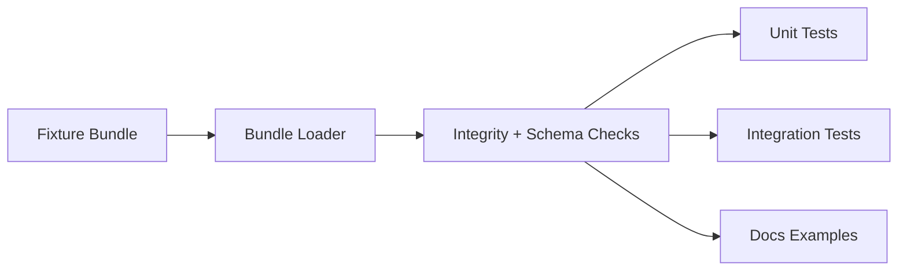

<!-- [KFM_META_BLOCK_V2]
doc_id: kfm://doc/9e05dfe6-6b7b-4fae-8e7f-6d2e0c8dbf11
title: data/fixtures/bundles — README
type: standard
version: v1
status: draft
owners: kfm-core
created: 2026-02-24
updated: 2026-02-24
policy_label: public
related:
  - TODO: link to canonical bundle contract (schema/docs) once confirmed
  - TODO: link to audit ledger docs once confirmed
tags: [kfm, fixtures, bundles, testing, provenance]
notes:
  - Fixtures only (non-canonical). Do not cite in user-facing claims.
[/KFM_META_BLOCK_V2] -->

# data/fixtures/bundles
**Purpose:** Curated *fixture bundles* used for repeatable tests, demos, and documentation snapshots.  
**Status:** draft • **Owners:** `kfm-core` • **Policy:** `public` (fixtures must remain safe to ship)


---

## Quick nav
- [Where this fits](#where-this-fits)
- [What belongs here](#what-belongs-here)
- [What must not go here](#what-must-not-go-here)
- [Directory layout](#directory-layout)
- [Fixture bundle format](#fixture-bundle-format)
- [Validation checklist](#validation-checklist)
- [How to add a new fixture bundle](#how-to-add-a-new-fixture-bundle)
- [How bundles are used](#how-bundles-are-used)
- [Governance](#governance)
- [Appendix](#appendix)

---

## Where this fits
This directory is part of the **fixture/test surface**.

- **Fixtures are not canonical inputs.**
- **Fixtures are not promoted artifacts.**
- Fixtures exist to keep CI and docs deterministic.

> WARNING: Never use any file under `data/fixtures/**` as evidence for user-facing claims.  
> If something needs to support a claim, it belongs in the canonical governed lifecycle (Raw → Work → Processed → Published).

---

## What belongs here
Fixture bundles should be **small, deterministic, redistributable** snapshots intended to:
- test bundle parsing, hashing, and verification logic
- reproduce documentation examples consistently
- provide stable inputs for CI (no flaky downloads)
- exercise edge-cases (missing files, bad hashes, schema drift, etc.)

Good fixture sources:
- synthetic/generated data
- tiny samples with clear redistribution rights
- scrubbed excerpts that are safe to ship (no sensitive site details, no personal data)

---

## What must not go here
- ❌ Restricted/sensitive datasets, PII, or vulnerable-site coordinates  
- ❌ Anything that violates licenses or redistribution terms  
- ❌ Large artifacts (keep fixtures lightweight for CI)  
- ❌ Secrets/tokens/credentials (ever)  
- ❌ “Production-like” bundles that teams might accidentally cite as truth

---

## Directory layout
Each bundle gets its own folder. Keep names **stable** and **slugged**.

```text
data/fixtures/bundles/
├── README.md
├── _index.json                         # OPTIONAL: fixture registry for tests/tools
├── example_bundle_min.v1/
│   ├── manifest.json                   # REQUIRED: primary manifest (fixture-local)
│   ├── checksums.sha256                # REQUIRED: integrity hashes
│   ├── payload/                        # REQUIRED: all referenced bytes live here
│   │   ├── data/...
│   │   └── docs/...
│   └── notes.md                        # RECOMMENDED: what this fixture is testing
└── example_bundle_edgecase_bad_hash.v1/
    ├── manifest.json
    ├── checksums.sha256                # intentionally incorrect to test failure paths
    ├── payload/...
    └── notes.md
```

> TIP: If you add `_index.json`, keep it machine-readable and deterministic (sorted keys, stable ordering).

---

## Fixture bundle format
This section defines a **fixture-local** format to keep tests consistent.

**Proposed baseline (until canonical contract is linked):**
1. **Manifest** (`manifest.json`) describing:
   - fixture id/name/version
   - intended test purpose
   - payload file list (relative paths under `payload/`)
2. **Payload** (`payload/`) containing all bytes referenced by the manifest
3. **Checksums** (`checksums.sha256`) covering all material payload files

### Example `manifest.json` (fixture-local)
```json
{
  "fixture_id": "example_bundle_min",
  "fixture_version": "v1",
  "purpose": "Minimal happy-path bundle fixture for parser + checksum verification",
  "payload_root": "payload",
  "files": [
    { "path": "data/sample.json", "media_type": "application/json" },
    { "path": "docs/readme.txt", "media_type": "text/plain" }
  ]
}
```

### Suggested `checksums.sha256` format
Use `sha256sum`-compatible lines with paths relative to bundle root:

```text
e3b0c44298fc1c149afbf4c8996fb92427ae41e4649b934ca495991b7852b855  payload/data/sample.json
d4735e3a265e16eee03f59718b9b5d03019c07d8b6c51f90da3a666eec13ab35  payload/docs/readme.txt
```

---

## Validation checklist
Use this as the fixture Definition of Done.

- [ ] **Policy safety:** fixture contains only redistributable content (no restricted/sensitive/PII)
- [ ] **Deterministic:** no unstable fields unless the test explicitly requires them
- [ ] **Manifest present:** `manifest.json` exists and is valid JSON
- [ ] **Checksums complete:** `checksums.sha256` covers all payload files (unless intentionally testing missing hashes)
- [ ] **Paths sane:** all `files[].path` exist under `payload/`
- [ ] **Size sane:** keep fixtures small (prefer KB → few MB)
- [ ] **Documentation:** `notes.md` explains what this fixture locks down

---

## How to add a new fixture bundle
1. Create a folder under `data/fixtures/bundles/` with a version suffix, e.g. `my_case.v1/`
2. Add:
   - `payload/` files
   - `manifest.json`
   - `checksums.sha256`
3. Add `notes.md` explaining:
   - why this fixture exists
   - what behavior it is meant to lock in (parsing, hashing, edge-case)

> WARNING: If you change fixture bytes, you must update checksums and any tests that depend on them.

---

## How bundles are used
Common usage patterns:
- **Unit tests:** parse manifest + verify integrity
- **Integration tests:** ingest fixtures into isolated stores/indexes
- **Docs/examples:** embed stable snippets for walkthroughs



---

## Governance
Fixtures live outside the canonical truth path:
- they are not promoted artifacts
- they must never become the basis for map/story claims
- they exist to keep CI stable and to document expected structure

If a fixture resembles real-world data:
- minimize it
- sanitize it
- label it clearly as fixture-only

---

## Appendix

<details>
<summary><strong>Shell snippet to generate checksums</strong></summary>

```bash
# from inside a bundle folder, e.g. data/fixtures/bundles/my_case.v1
find payload -type f -print0 | sort -z | xargs -0 sha256sum > checksums.sha256
```
</details>

<p align="right"><a href="#datafixturesbundles">Back to top</a></p>
