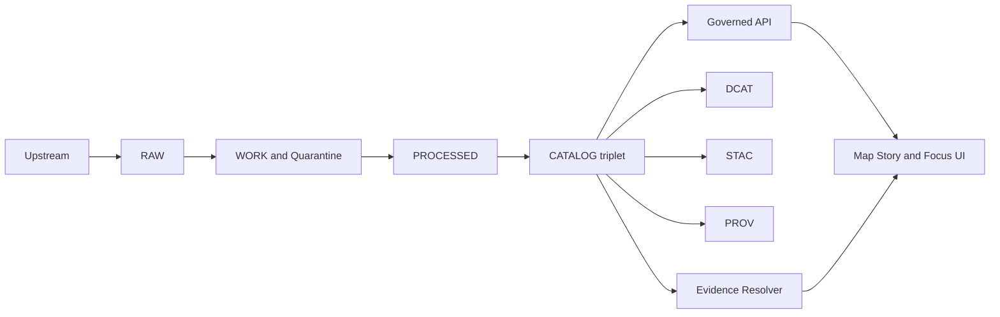

<!-- [KFM_META_BLOCK_V2]
doc_id: kfm://doc/7d8e0e0b-9b7a-4fe3-9f21-1a1f2a9f66a1
title: Sample Catalog Fixture
type: standard
version: v1
status: draft
owners: data-platform
created: 2026-03-02
updated: 2026-03-02
policy_label: public
related:
  - kfm://doc/truth-path-and-promotion-contract
  - kfm://doc/catalog-triplet-dcat-stac-prov
tags: [kfm, data, fixtures, catalog, stac, dcat, prov]
notes:
  - This directory is fixture-only. Do not treat any content here as authoritative data.
  - Keep all content policy-safe and small enough for CI.
[/KFM_META_BLOCK_V2] -->

# Sample Catalog Fixture
Tiny, **policy-safe** sample metadata and link structure for exercising **DCAT + STAC + PROV** validation, link checking, and EvidenceRef resolution.


**What this is:** a “known-good” miniature *catalog triplet* and related fixture files used by tests, docs, and local development.

**What this is not:** production catalog content, a real dataset, or a substitute for the governed pipeline outputs.

---

## Quick navigation
- [Purpose](#purpose)
- [Where this fits](#where-this-fits)
- [Fixture contents](#fixture-contents)
- [Directory layout](#directory-layout)
- [Contracts and invariants](#contracts-and-invariants)
- [How to use in tests and local dev](#how-to-use-in-tests-and-local-dev)
- [How to update this fixture](#how-to-update-this-fixture)
- [Acceptable inputs](#acceptable-inputs)
- [Exclusions](#exclusions)
- [Troubleshooting](#troubleshooting)

---

## Purpose
This directory exists to provide **stable, deterministic** inputs for:
- catalog validators (schema + structure checks)
- link checkers (no dangling hrefs)
- evidence resolution demos (identifiers are cross-linked)
- CI tests that must run fast and without external dependencies

> NOTE  
> Keep this fixture “small and boring.” It should be simple enough that failures are diagnosable from a single diff.

---

## Where this fits
KFM’s delivery model is an auditable truth path that culminates in a **CATALOG triplet** used by governed APIs and UIs. This fixture mirrors that final “catalog surface,” but in miniature, so tooling can be tested without real data.



---

## Fixture contents
At minimum, a “sample catalog” fixture should include:

| Component | Purpose | Required property |
|---|---|---|
| DCAT | dataset-level discovery metadata | stable identifiers that correspond to the STAC collection and PROV entities |
| STAC | asset and spatial coverage metadata | collection and item ids that correspond to DCAT and PROV |
| PROV | lineage skeleton (entities, activities, agents) | entities that correspond to the artifacts referenced in DCAT and STAC |

### What this fixture should test
- **Cross-linking:** IDs are consistent across DCAT, STAC, and PROV
- **Link hygiene:** internal links resolve (no missing files)
- **Determinism:** formatting, ordering, and ids do not change unless intentionally updated
- **Policy-safety:** content is safe to ship in public test artifacts

---

## Directory layout
Because this is a fixture folder, exact filenames may evolve, but keep a predictable structure.

### Recommended layout
This is a recommended structure for fixture clarity (adjust to repo conventions as needed):

```text
data/fixtures/sample_catalog/
  README.md
  dcat/
    catalog.jsonld            # or .ttl / .json depending on your DCAT flavor
    datasets/                 # optional
  stac/
    catalog.json
    collections/
      sample.collection.json
    items/
      sample.item.json
  prov/
    sample.prov.json          # prov-json (or another PROV representation)
  linkmap/
    sample.linkmap.json       # optional: explicit crosswalk table for tests
  assets/
    placeholder.txt           # optional: tiny placeholder assets only (no large binaries)
```

> WARNING  
> If you add anything under `assets/`, keep it tiny and license-clear. Prefer placeholders over real payloads.

---

## Contracts and invariants
These are the invariants this fixture is expected to uphold.

### 1) Cross-link rule
The catalog triplet must be cross-linked so that:
- discovery can start from DCAT or STAC
- lineage can be traced via PROV
- EvidenceRefs can resolve through catalog identifiers

### 2) Deterministic identifiers
IDs in this fixture should be:
- stable across commits unless the fixture’s “story” intentionally changes
- human-reviewable
- consistent across DCAT, STAC, and PROV

### 3) License-first and policy-safe
This fixture is intended to be **public-safe**:
- avoid sensitive locations, personal data, or restricted datasets
- if you need “sensitive-like” behavior, simulate it with synthetic fields and policy labels

---

## How to use in tests and local dev
Typical uses:
- **Unit tests:** load these files directly to validate schemas and links
- **Integration tests:** point a local catalog server or API to this directory
- **Docs:** provide “known-good” examples for implementers

### Example test patterns
```ts
// Pseudocode only: adapt to your repo's test harness.
// 1) validate STAC structure
// 2) validate DCAT structure
// 3) validate PROV structure
// 4) assert cross-links exist and match expected ids
```

```bash
# Pseudocode only: adapt to your repo’s tooling.
# Validate catalog fixtures
# ./tools/catalog-validate data/fixtures/sample_catalog
# ./tools/linkcheck data/fixtures/sample_catalog
```

---

## How to update this fixture
When you change anything in this folder:

### Checklist
- [ ] No secrets, tokens, credentials, or private URLs added
- [ ] Identifiers remain stable (or change is intentional and documented)
- [ ] DCAT ↔ STAC ↔ PROV cross-links updated together
- [ ] All local links resolve
- [ ] Fixture remains small (CI-friendly)
- [ ] If adding assets, confirm license and keep file sizes tiny

### Commit message guidance
Use an explicit scope so failures are easy to triage:
- `test(fixtures): update sample_catalog cross-links`
- `test(fixtures): add prov entity for sample artifact`

---

## Acceptable inputs
✅ Allowed here:
- small JSON/JSON-LD fixture metadata
- tiny placeholder assets (bytes–KBs), if needed
- deterministic link maps/crosswalks used by tests

---

## Exclusions
❌ Do not put these in this folder:
- real production datasets or outputs from the governed pipeline
- large rasters, large vector tiles, or “realistic” binaries that bloat CI
- sensitive locations, private coordinates, PII, or restricted archives
- any credential material (API keys, cookies, tokens), even if “fake”
- environment-specific absolute paths

---

## Troubleshooting
### Broken link errors
- Ensure referenced files exist relative to the referencing document
- Prefer repo-relative links over absolute paths

### Cross-link mismatch errors
- Confirm the same dataset or dataset_version identifier is used consistently across:
  - DCAT dataset identifier
  - STAC collection id (and item collection pointer)
  - PROV entity ids or attributes referencing the same artifact

### “Why do we need this fixture?”
- Because KFM treats catalog completeness and linkability as a gate: tooling should fail fast on missing metadata and broken relationships.

---

<a id="top"></a>
Back to top: [Quick navigation](#quick-navigation)
