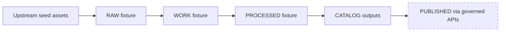

<!-- [KFM_META_BLOCK_V2]
doc_id: kfm://doc/2e2c5b0a-9a64-4e8e-9e4a-2f64d3c2f4c2
title: Sample Dataset Fixture
type: standard
version: v1
status: draft
owners: kfm-core
created: 2026-03-02
updated: 2026-03-02
policy_label: public
related:
  - ../README.md
  - ../../registry/
  - ../../catalog/
tags: [kfm, data, fixtures, sample_dataset]
notes:
  - This is a governed *fixture* dataset used for local development and CI tests.
  - Keep it small, deterministic, and free of sensitive information.
[/KFM_META_BLOCK_V2] -->

# Sample Dataset Fixture

Small, deterministic **fixture dataset** for exercising KFM pipelines, catalogs, and policy gates in development + CI.


> [!IMPORTANT]
> This directory is **test data**. It is not a production dataset, and it must not contain sensitive locations, personal data, or proprietary partner material.

## Navigation

- [Purpose](#purpose)
- [Where this fits](#where-this-fits)
- [Directory structure](#directory-structure)
- [How to use](#how-to-use)
- [How to update or regenerate](#how-to-update-or-regenerate)
- [Validation gates](#validation-gates)
- [Data governance rules](#data-governance-rules)
- [FAQ](#faq)

---

## Purpose

This fixture exists to provide a **known-good, small, reproducible** dataset that can be used to:

- Smoke-test ingest → processing → catalog build flows.
- Validate STAC/DCAT/PROV generation logic.
- Exercise policy enforcement and redaction pathways.
- Support examples and docs without relying on external networks.

**Design goals**

- **Deterministic:** checksums and outputs should not change unless the spec changes.
- **Small:** fast in CI.
- **Clear:** easy to understand, easy to debug.

[Back to top](#sample-dataset-fixture)

---

## Where this fits

This folder lives under:

- `data/fixtures/…` — datasets intentionally curated for **testing and documentation**.

Even though it is “just fixtures”, it is still within the repo’s governed `data/` area and should be treated as a controlled artifact.

[Back to top](#sample-dataset-fixture)

---

## Directory structure

> [!NOTE]
> The exact contents of this fixture may evolve. If you add/remove files, **update this tree**.

Recommended shape (adjust to match reality):

```text
sample_dataset/                                           # Sample dataset fixture (end-to-end truth-path miniature; policy-safe; tiny)
├─ README.md                                              # Fixture overview + what it demonstrates + how tests use it
├─ manifest.json                                          # OPTIONAL: authoritative file list + checksums (drift detection; determinism)
│
├─ spec/                                                  # Dataset spec inputs (canonical for hashing/versioning)
├─ registry/                                              # OPTIONAL: local mirror of registry entries used in tests (dataset/source/watchers)
├─ upstream/                                              # OPTIONAL: small upstream “seed” assets (download-free; synthetic)
├─ raw/                                                   # RAW zone fixture artifacts (as-acquired; immutable snapshot)
├─ work/                                                  # WORK zone intermediate outputs (normalized/QC candidates)
├─ processed/                                             # PROCESSED outputs (publishable formats; versioned)
├─ catalog/                                               # Generated catalogs (DCAT/STAC/PROV) for tests (cross-linked)
├─ receipts/                                              # Run receipts / audit artifacts (who/what/when + checks + policy decisions)
└─ notes/                                                 # Human notes/diagrams/provenance references (non-normative; keep small)
```

If your repo uses a different convention (e.g., one fixture folder containing only the minimal seeds, while other zones are generated elsewhere), document that here.

[Back to top](#sample-dataset-fixture)

---

## Data lifecycle context

This fixture is designed to mimic (in miniature) the KFM truth path.



- **Fixtures** may stop at `CATALOG outputs` (common for unit/integration tests).
- Nothing here should require a running cluster to be useful.

[Back to top](#sample-dataset-fixture)

---

## How to use

Typical usage patterns:

- **Unit tests:** parse a tiny GeoJSON/CSV/COG/etc. and verify schema + edge cases.
- **Integration tests:** run a local pipeline step against fixture inputs and compare outputs.
- **Docs/examples:** reference predictable IDs and geometries without hitting external services.

### Consumption rules

- Prefer **relative paths** from test code.
- Do not copy fixture blobs into other directories; reference them.
- Treat fixture IDs as stable API contracts for tests (change only when intentionally versioning).

[Back to top](#sample-dataset-fixture)

---

## How to update or regenerate

> [!WARNING]
> Changes to fixture data can cascade into many tests. Keep edits deliberate, reviewed, and reproducible.

### Update workflow

1. **Edit the canonical spec** (or whichever file drives deterministic identity/versioning).
2. **Regenerate derived artifacts** (processed outputs, catalogs, indexes) using repo tooling.
3. **Record provenance**: update/emit run receipts, manifests, and checksums.
4. **Run validators + tests**.
5. **Update this README** if the directory structure, IDs, or semantics changed.

### Suggested checklist (Definition of Done)

- [ ] Fixture still contains **no sensitive or restricted material**.
- [ ] All referenced licenses/attributions are present and accurate.
- [ ] Derived artifacts were regenerated from scratch (no hand edits).
- [ ] Checksums/manifest updated (if your repo uses them).
- [ ] Catalog validation passes (STAC/DCAT/PROV).
- [ ] CI test suite passes.

[Back to top](#sample-dataset-fixture)

---

## Validation gates

This fixture should be “promotion-contract friendly” even if it is not promoted.

Minimum recommended validations:

- **Schema validation** for registry/spec files.
- **STAC validation** for any STAC Collections/Items.
- **Link checking** for catalog references.
- **Policy tests** ensuring no accidental “allow all” leakage.

> [!TIP]
> If your repo has standard commands for these checks, add them here as copy/paste snippets.

Example placeholders (replace with real commands):

```bash
# TODO: add the real validator commands used by this repo
# e.g.
# pnpm kfm validate:data-fixture data/fixtures/sample_dataset
# pnpm kfm validate:stac data/fixtures/sample_dataset/catalog
# pnpm test
```

[Back to top](#sample-dataset-fixture)

---

## Data governance rules

### Allowed content

- Public-domain or openly licensed data **with clear attribution**, or
- Fully synthetic/generated data, or
- Small excerpts that are explicitly permitted for redistribution.

### Prohibited content

- Personal data (PII), even if “small”.
- Sensitive locations (e.g., vulnerable archaeological sites) at precise resolution.
- Proprietary partner datasets or anything with unclear rights.

### Reproducibility expectations

- If fixture artifacts are regenerated, they should come with **run receipts** and/or a manifest.
- Avoid nondeterministic generation (timestamps in file contents, random IDs without a fixed seed, unordered JSON output, etc.).

[Back to top](#sample-dataset-fixture)

---

## FAQ

### Why is this under `data/` and not `tests/`?

Because fixtures often need to be consumed by multiple layers (ingest, catalog, API, UI) and should follow the same governance posture as real datasets.

### Can I add more data to make tests “more realistic”?

Yes, but only if it stays fast in CI and remains rights-clean + non-sensitive. Prefer adding **one new edge case at a time** rather than dumping a large dataset.

### How do I know whether a change should bump the fixture “version”?

If you treat fixture identities as stable contracts in tests, bump/version when:

- Stable IDs change.
- Geometry semantics change.
- The expected catalog output changes intentionally.

[Back to top](#sample-dataset-fixture)
