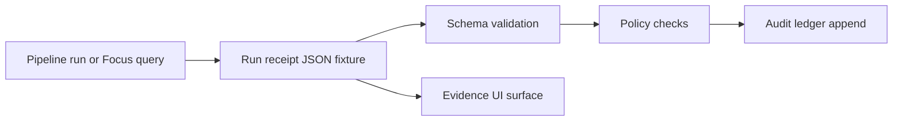

<!-- [KFM_META_BLOCK_V2]
doc_id: kfm://doc/ba8b7cfa-2b03-441d-9b22-ecf7d7988f35
title: Sample Run Receipts Fixtures
type: standard
version: v1
status: draft
owners: TBD
created: 2026-03-02
updated: 2026-03-02
policy_label: public
related:
  - (TODO) <run_receipt_schema_path>
  - (TODO) <policy_pack_path>
tags: [kfm, data, fixtures, provenance, receipts]
notes:
  - Directory-level contract for synthetic run receipt examples (valid + invalid) used for fail-closed testing.
[/KFM_META_BLOCK_V2] -->

# Sample Run Receipts Fixtures
Golden **synthetic** run receipts used to validate the run-receipt contract and fail-closed policy behavior.


**Directory:** `data/fixtures/sample_receipts/`

- [Purpose](#purpose)
- [Where this fits](#where-this-fits)
- [Directory contract](#directory-contract)
- [Fixture matrix](#fixture-matrix)
- [Naming conventions](#naming-conventions)
- [How to add a fixture](#how-to-add-a-fixture)
- [Security and sensitivity rules](#security-and-sensitivity-rules)
- [Troubleshooting](#troubleshooting)
- [Source references](#source-references)

---

## Purpose

A **run receipt** is a small evidence object that makes a run auditable and reproducible: it records what happened (inputs → outputs), under what environment, what validation ran, and what policy decision applied.

This directory holds **small, deterministic, synthetic** receipts that support:
- contract/schema validation (valid examples must pass; invalid examples must fail),
- policy gate testing (deny-by-default behavior),
- UI rendering/guardrail testing (e.g., “untrusted” state for invalid/unsigned receipts), if applicable.



[Back to top](#sample-run-receipts-fixtures)

---

## Where this fits

KFM’s governance posture is to make provenance **physical and testable**: predictable folders, machine-validated schemas, and immutable linkages between artifacts, receipts, and catalogs.

This directory is intentionally **fixtures-only**:
- it is not a storage zone (`raw/`, `work/`, `processed/`),
- it is not a catalog/provenance output (`catalog/`, `prov/run_receipts/`),
- it is not an audit ledger.

[Back to top](#sample-run-receipts-fixtures)

---

## Directory contract

### What belongs here

✅ **Accepted inputs**
- `*.json` — synthetic run receipt fixtures
- `*.md` — short notes for tricky fixtures (optional)
- Optional sidecars for test harnesses (only if your test framework needs them):
  - `*.expected.json` (expected normalized form)
  - `*.expected.txt` (expected error message substring)

### What must NOT go here

🚫 **Exclusions**
- Real production receipts
- Anything with secrets, tokens, cookies, API keys, internal hostnames
- Any PII (names, emails, phone numbers) or sensitive site specifics
- Large payloads or embedded raw artifacts (fixtures should remain tiny)
- Any receipt that depends on “current time” (avoid flakiness)

> WARNING: Treat every fixture as publishable. If you wouldn’t want it in a public issue, it doesn’t belong here.

[Back to top](#sample-run-receipts-fixtures)

---

## Fixture matrix

Use this as a checklist of scenarios we should cover over time (you can start minimal and expand).

| Scenario class | Goal | Notes |
|---|---|---|
| `valid_minimal` | Prove the minimum required fields work | Smallest “happy path” receipt |
| `valid_full` | Prove extended/optional fields are accepted | Include environment + validation + policy refs |
| `invalid_missing_required` | Fail closed when a required field is absent | e.g., missing `run_id` or `outputs` |
| `invalid_bad_digest_format` | Fail closed on digest formatting | e.g., wrong prefix, wrong length |
| `invalid_time_format` | Fail closed on invalid timestamps | Avoid timezone ambiguity |
| `policy_denied` | Exercise deny paths without leaking sensitive details | Receipt can reference a deny decision without embedding sensitive data |
| `ui_untrusted_state` | Ensure UI renders invalid/unsigned as untrusted (if applicable) | Keep as synthetic-only |

### Minimum recommended fixture set
- [ ] `valid_minimal`
- [ ] `invalid_missing_required`
- [ ] `invalid_bad_digest_format`
- [ ] `policy_denied`

[Back to top](#sample-run-receipts-fixtures)

---

## Naming conventions

**Proposed** (keep filenames stable and grep-friendly):

`<domain>__<scenario>__<validity>.json`

Examples:
- `core__valid_minimal__valid.json`
- `core__invalid_missing_required__invalid.json`
- `policy__deny_restricted__valid.json`

Guidelines:
- Prefer **lowercase**, words separated by `_`
- Include `__valid` / `__invalid` to make test selection trivial
- Avoid dates in filenames unless you need multiple versions of the same scenario

[Back to top](#sample-run-receipts-fixtures)

---

## How to add a fixture

1) Start from the canonical run receipt template (or copy a nearby fixture).
2) Make it **synthetic**:
   - Use obviously fake digests (but correctly shaped).
   - Freeze timestamps (no “now”).
   - Use non-sensitive paths (e.g., `raw/source.csv`, `processed/out.parquet`).
3) Validate it locally (schema + policy), then commit.

### Example validation commands (adjust paths for your repo)
```bash
# Schema validation (example)
ajv validate -s <path-to-run-receipt-schema.json> -d data/fixtures/sample_receipts/<file>.json

# Policy validation (example)
conftest test data/fixtures/sample_receipts/<file>.json -p <path-to-policy-pack>
```

> TIP: If your CI uses a different validator than `ajv`, mirror that locally to avoid “works on my machine”.

[Back to top](#sample-run-receipts-fixtures)

---

## Security and sensitivity rules

- Default stance: **deny-by-default** when uncertain.
- Fixtures must never enable inference about restricted datasets.
- If you need to test “restricted” behavior, do it with:
  - synthetic IDs,
  - synthetic geometry placeholders (or omit geometry entirely at the receipt level),
  - explicit “no leakage” expectations in test assertions.

[Back to top](#sample-run-receipts-fixtures)

---

## Troubleshooting

- **Schema validation fails**  
  Confirm you’re validating against the correct schema version (v1 vs v2). Update the fixture or the schema reference.

- **Policy tests fail unexpectedly**  
  Ensure the fixture doesn’t omit fields that policy assumes exist. Policy should still fail safely, but tests should reflect the intended deny reason.

- **Flaky tests**  
  Remove nondeterminism: timestamps, unordered maps, or environment-specific values.

[Back to top](#sample-run-receipts-fixtures)

---

## Source references

These fixtures are aligned to KFM’s evidence-first design goals:
- Run receipts and the audit ledger concept (run receipts per pipeline run and Focus Mode query; audit ledger is append-only).
- Promotion gating expectations (run receipts + policy decisions + checksums).
- Shared CI/runtime semantics for policy (fixtures and outcomes must match).

(If you don’t know where these specs live in this repo, search for: “Run receipts and audit ledger”, “Promotion Contract”, and “run_receipt schema”.)
