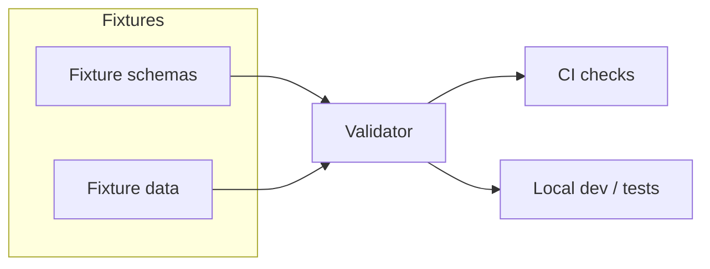

<!-- [KFM_META_BLOCK_V2]
doc_id: kfm://doc/a32b6561-8df1-4d45-ad1c-c14bfbee4426
title: data/fixtures/schemas — Fixture schema registry
type: standard
version: v1
status: draft
owners: TODO
created: 2026-02-24
updated: 2026-02-24
policy_label: restricted
related:
  - kfm://doc/TODO-contracts-schemas-readme
  - kfm://doc/TODO-data-fixtures-readme
  - kfm://doc/TODO-policy-fixtures-readme
tags: [kfm]
notes:
  - Directory contract for fixture schemas used by tests, validators, and local development.
  - Update owners/policy_label/related links once repo wiring is confirmed.
[/KFM_META_BLOCK_V2] -->

# `data/fixtures/schemas`
Schema contracts for fixture datasets used in tests and local development.


> **Intent:** keep fixture data *predictable* and *traceable* by validating it against versioned schemas.

---

## Quick navigation
- [Purpose](#purpose)
- [Where this fits in the repo](#where-this-fits-in-the-repo)
- [Directory contract](#directory-contract)
- [How schemas are used](#how-schemas-are-used)
- [Schema conventions](#schema-conventions)
- [Registry](#registry)
- [Adding or changing a schema](#adding-or-changing-a-schema)
- [Validation in CI](#validation-in-ci)
- [Security and sensitivity](#security-and-sensitivity)
- [Related](#related)

---

## Purpose
This directory contains **schemas that define the expected structure of fixture data** stored under `data/fixtures/`.

Fixture schemas are used to:
- prevent accidental drift in test data (silent breaking changes)
- keep validators honest (a validator must accept the “golden” fixtures)
- make fixture changes reviewable (schema diff explains meaning)

> **NOTE:** These are *fixture* schemas. Production contracts should live under `contracts/schemas/` (see “Where this fits”). Keep the boundary clear.

[Back to top](#datafixturesschemas)

---

## Where this fits in the repo
KFM’s recommended repository layout separates:
- `data/` for datasets and data artifacts
- `contracts/` for contract surfaces (schemas, OpenAPI, etc.)
- `policy/` for policy-as-code and test fixtures

This folder (`data/fixtures/schemas/`) is specifically for **schemas that validate fixture data** (small, deterministic inputs used by tests and local dev).

> **PROPOSED rule:** when a fixture represents a real production artifact, prefer **reusing** or **referencing** the canonical schema in `contracts/schemas/` rather than inventing a fixture-only schema.

[Back to top](#datafixturesschemas)

---

## Directory contract

### ✅ What belongs here
- Schema files for fixture data formats, e.g.
  - JSON Schema (`*.schema.json`)
  - (Optionally) Avro (`*.avsc`), Protobuf (`*.proto`), SQL DDL (`*.sql`) — only if documented + validated
- Schema **versions** (keep older versions if fixtures must remain reproducible)
- Minimal test vectors if they are *schema-adjacent* (e.g., `*_invalid.json`), but prefer `data/fixtures/` for data files

### ❌ What must NOT go here
- Production schemas that are part of public/runtime contracts  
  → put those in `contracts/schemas/`
- Large datasets, scraped source files, or “real” copies of restricted data
- Secrets, tokens, API keys, or any PII
- Anything that would violate sensitivity rules (especially precise sensitive locations)

### Recommended layout (example)
> This is an example of a scalable layout. Adjust to match the actual repo structure.

```text
data/fixtures/schemas/
  README.md
  <domain>/
    <dataset>/
      <artifact>__v1.schema.json
      <artifact>__v2.schema.json
```

[Back to top](#datafixturesschemas)

---

## How schemas are used



**Expectation:**
- every fixture data file has a schema it must satisfy (directly or via a referenced canonical contract)
- schema validation is a **merge gate** (fail closed)

[Back to top](#datafixturesschemas)

---

## Schema conventions

### Naming
Use **explicit versioning** in filenames to avoid ambiguity:

- `...__v1.schema.json`
- `...__v2.schema.json`

> **PROPOSED:** treat `vN` as the *compatibility version* (bump on breaking changes).

### JSON Schema basics (if using JSON Schema)
- set `$schema` (pick one draft and stick to it)
- set a stable `$id` (so tools can resolve refs)
- prefer `additionalProperties: false` for tight fixtures
- include `description` on non-obvious fields

Example skeleton:

```json
{
  "$schema": "https://json-schema.org/draft/2020-12/schema",
  "$id": "kfm://fixture_schema/<domain>/<dataset>/<artifact>@v1",
  "title": "<Human readable title>",
  "type": "object",
  "additionalProperties": false,
  "properties": {},
  "required": []
}
```

### Determinism rules for fixtures
- fixtures must be **small**, **static**, and **diff-friendly**
- no timestamps “generated at runtime” unless explicitly part of the test
- if randomness is needed, use a fixed seed and document it

[Back to top](#datafixturesschemas)

---

## Registry
Maintain a lightweight registry so reviewers can quickly see what exists and what it validates.

| Schema file | Validates | Fixture location(s) | Compatibility | Owner | Notes |
|---|---|---|---|---|---|
| `TODO` | `TODO` | `TODO` | `v1` | `TODO` | Add entries as schemas land |

> **TIP:** If this table starts getting big, split by domain into `data/fixtures/schemas/<domain>/README.md` and keep a top-level index here.

[Back to top](#datafixturesschemas)

---

## Adding or changing a schema

### Change checklist (Definition of Done)
- [ ] Schema file added/updated with explicit version (`__vN`)
- [ ] At least **one passing** fixture exists
- [ ] At least **one failing** fixture exists (negative test) *or* a validator test covers the failure mode
- [ ] Registry table updated
- [ ] CI validation passes (schema validation is green)
- [ ] If the schema models a production artifact, canonical schema in `contracts/schemas/` is referenced or a rationale is documented here
- [ ] Sensitivity review: no restricted info or precise sensitive coordinates embedded

### When to bump schema version
Bump `vN` when:
- required fields change
- field types change (string → number)
- semantics change in a way that breaks existing fixtures/tests

Keep old schema versions **as long as old fixtures/tests must remain reproducible**.

[Back to top](#datafixturesschemas)

---

## Validation in CI

> **GOAL:** schema validation runs in CI and blocks merges on failure.

### Local validation examples
Pick the toolchain that matches the project (examples only):

**Option A: `ajv` (Node)**
```bash
npx ajv-cli validate \
  -s data/fixtures/schemas/<schema>.schema.json \
  -d data/fixtures/<fixture>.json
```

**Option B: `jsonschema` (Python)**
```bash
python -m jsonschema \
  -i data/fixtures/<fixture>.json \
  data/fixtures/schemas/<schema>.schema.json
```

### CI wiring (TODO)
Document the real command(s) once confirmed:
- `TODO: npm run validate:fixtures`
- `TODO: make validate-fixtures`
- `TODO: tools/validators/...`

[Back to top](#datafixturesschemas)

---

## Security and sensitivity

### Non-negotiables
- **No secrets. No PII. No live credentials.**
- Prefer synthetic data for fixtures.
- If fixtures include geometry/coordinates:
  - ensure the coordinates are **synthetic** or **generalized**
  - add a test that ensures **no precise sensitive coordinates leak**

> **WARNING:** If a fixture is derived from a sensitive-location dataset, assume “default deny” unless explicitly approved. Prefer generalized public representations.

[Back to top](#datafixturesschemas)

---

## Related
- `contracts/schemas/` (canonical production schemas) — **TODO verify path**
- `data/fixtures/` (fixture data files) — **TODO verify path**
- `policy/fixtures/` (policy decision fixtures) — **TODO verify path**

<details>
<summary>Appendix: review prompts for PRs touching this folder</summary>

- Does the schema change reflect an intentional contract change, or accidental drift?
- Are fixture files updated in lockstep with schema changes?
- Are versions handled correctly (old fixtures still reproducible)?
- Is any sensitive information present or inferable?
- Does CI fail closed if the schema is violated?

</details>
