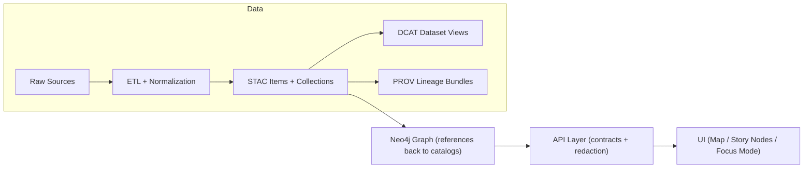

# `data/graph/` — Knowledge Graph Build Artifacts (Neo4j)

This directory contains **graph build artifacts** used to (re)construct and maintain the **Neo4j knowledge graph** in Kansas Frontier Matrix (KFM).

In KFM’s pipeline, the graph is *downstream* of the governed “truth path” and is intended to **model relationships** and **reference published catalog/provenance records**—not to become another copy of datasets.

---

## Where `data/graph/` sits in the KFM pipeline

KFM’s documented pipeline flow treats the **catalog outputs** as boundary artifacts that feed downstream systems, including the graph.



**Implications for this folder**
- The graph should be built from **published metadata boundary artifacts** (STAC / DCAT / PROV).
- Graph entities should store **references to catalog/provenance identifiers** (e.g., STAC Item IDs, DOIs, PROV bundle identifiers) rather than duplicating bulky payloads.

---

## Directory layout

This repo’s directory standard reserves `data/graph/` for graph import artifacts:

```text
data/graph/
├─ csv/        # Graph import CSV exports
└─ cypher/     # Optional post-import scripts
```

### `csv/` — Graph import CSV exports
This folder holds **generated CSVs** intended for graph ingestion (e.g., bulk import or `LOAD CSV` workflows).

Typical contents (recommended conventions; adapt to whatever `src/graph/` generates):
- Node tables (one or more CSVs)
- Relationship tables (one or more CSVs)
- A lightweight build manifest (recommended):
  - build/run identifier (run ID)
  - producing code version (commit hash)
  - input catalog/prov versions used to generate the graph export
  - checksums (optional but recommended)

> **Key principle:** IDs should be stable and traceable back to catalog/provenance records.

### `cypher/` — Optional post-import scripts
This folder holds Cypher scripts that can be applied after loading the CSVs, commonly:
- constraints (uniqueness, existence constraints where appropriate)
- indexes
- migrations required by ontology/schema changes
- cleanup or normalization steps

**Recommended naming convention**
- Prefix with a two-digit order key so scripts can be applied deterministically:
  - `00_constraints.cypher`
  - `10_indexes.cypher`
  - `20_migrations_<short_name>.cypher`
  - `90_postload_checks.cypher`

---

## Contract: cross-layer linkage (STAC / DCAT / PROV / Graph)

KFM requires the catalogs and lineage to remain in sync with the graph. At minimum:

- **STAC → data assets**  
  STAC Items should point to the data assets (often in `data/processed/**` or stable storage), including attribution/license.

- **DCAT → distribution**  
  DCAT should provide high-level discovery, pointing to STAC and/or distribution links.

- **PROV end-to-end**  
  PROV lineage should link raw → work → processed, and identify the producing run/config (e.g., run ID or commit hash).

- **Graph references catalogs**  
  Graph nodes should carry **references** (STAC Item IDs / DOIs / DCAT identifiers), rather than embedding full payloads.

> If an analysis/AI run produces new entities or relationships, it must be treated as a first-class dataset with full STAC/DCAT/PROV—and only then loaded into the graph with explicit provenance.

---

## Versioning expectations (especially important for `data/graph/`)

KFM expects versioning across:
- **Datasets:** new versions should link to prior versions via DCAT and PROV (e.g., `prov:wasRevisionOf`).
- **Graph & ontology:** keep labels/relationship types **backwards-compatible** unless a deliberate migration is performed. Breaking ontology changes must be handled via migration scripts and recorded in version history.
- **System:** repository releases follow semantic versioning; structural guide updates and changelog entries should reflect breaking vs non-breaking changes.

**What this means here**
- Treat `data/graph/csv/` outputs as **derived artifacts**: reproducible, regeneratable, and attributable to a specific build/run.
- Treat `data/graph/cypher/` as **schema governance**: migrations and constraints must be explicit, ordered, and reviewable.

---

## Loading into Neo4j (developer workflow)

> The Neo4j runtime database lives in the Neo4j container volume; this folder holds the **import artifacts** used to populate it.

A safe, repeatable workflow is:

1. **Generate** graph artifacts  
   Use the graph build tooling in `src/graph/` to generate:
   - CSV exports into `data/graph/csv/`
   - Cypher scripts into `data/graph/cypher/` (when needed)

2. **Apply constraints/indexes first** (if your ingestion approach supports it)  
   Constraints/indexes help prevent accidental duplicates and speed up load.

3. **Load data**  
   Use the ingestion mechanism your `src/graph/` tooling expects (bulk import vs. Cypher `LOAD CSV` vs. driver-based loading).

4. **Run post-load checks**  
   Validate counts, key invariants, and sample traversals.

---

## What NOT to put in `data/graph/`

- Raw data, intermediate work products, or authoritative “final” datasets  
  Those belong in the governed stages (`data/raw/`, `data/work/`, `data/processed/`) and their catalog/prov counterparts.
- Large binary payloads (imagery, rasters, PDFs)  
  The graph should reference these via catalog identifiers and distributions.
- Secrets / credentials / access tokens  
  Never store them here (or anywhere in the repo).

---

## Related project paths

- `src/graph/` — graph build code (ontology bindings, ingest scripts, constraints)
- `data/stac/` — STAC collections/items
- `data/catalog/dcat/` — DCAT outputs (JSON-LD)
- `data/prov/` — PROV lineage bundles
- `docs/MASTER_GUIDE_v13.md` — canonical structure + pipeline contract
- `docs/standards/` — profiles (STAC/DCAT/PROV) and repo structure standards

---

## Quick checklist (for PRs touching `data/graph/`)

- [ ] Graph artifacts are **derived** from published boundary artifacts (STAC/DCAT/PROV).
- [ ] Node/edge identifiers can be traced back to catalog/prov IDs.
- [ ] Any new label/type changes include a migration Cypher script (if needed).
- [ ] Post-load checks or validation queries are included/updated (if applicable).
- [ ] No bulky payloads or sensitive attributes are embedded in the graph export.

