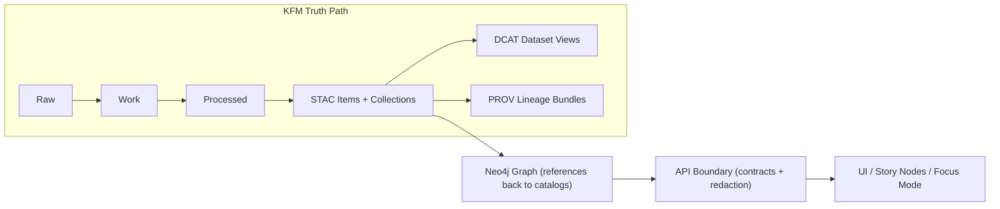

# 🕸️ `data/graph/` — Knowledge Graph Build Artifacts (Neo4j)

**CSV exports + Cypher scripts used to (re)build KFM’s Neo4j knowledge graph**  
<sub><em>Graph is an accelerator for relationships — it must reference catalogs, not duplicate datasets.</em></sub>

<br/>


</div>

---

## 🧭 Quick Navigation

<details>
<summary><strong>Table of contents</strong></summary>

- [What lives here](#what-lives-here)
- [KFM pipeline context](#kfm-pipeline-context)
- [Directory layout](#directory-layout)
- [Graph contract](#graph-contract)
- [CSV export standards](#csv-export-standards)
- [Cypher scripts](#cypher-scripts)
- [Import patterns](#import-patterns)
- [Validation checklist](#validation-checklist)
- [Related paths](#related-paths)

</details>

---

## What lives here

> [!IMPORTANT]
> `data/graph/` contains **derived build artifacts** (imports + scripts).  
> The **canonical source-of-truth** remains upstream in `data/**` (raw/work/processed) + **catalog boundary artifacts** (STAC/DCAT/PROV).

| Subfolder | Purpose | Inputs | Outputs |
|---|---|---|---|
| `csv/` | Bulk/stream import tables | STAC/DCAT/PROV + processed stores | Node/edge CSVs + manifest |
| `cypher/` | Post-load schema & migrations | Governance + ontology changes | Constraints, indexes, migrations |

---

## KFM pipeline context



> [!NOTE]
> The graph is a **relationship index**: it should store **identifiers + links** back to catalog/provenance records, not copy full payloads.

---

## Directory layout

```text
data/graph/
├─ csv/        # Graph import CSV exports
└─ cypher/     # Optional post-import scripts
```

<details>
<summary><strong>Recommended files (opinionated)</strong></summary>

```text
data/graph/
├─ csv/
│  ├─ _manifest.yaml
│  ├─ nodes__*.csv
│  ├─ rels__*.csv
│  └─ _checksums.sha256
└─ cypher/
   ├─ 00_constraints.cypher
   ├─ 10_indexes.cypher
   ├─ 20_migrations__<slug>.cypher
   └─ 90_postload_checks.cypher
```

</details>

---

## Graph contract

### 1) The “reference, don’t duplicate” rule

> [!IMPORTANT]
> **Do not** embed large blobs (documents, rasters, full dataset rows) in Neo4j.  
> Instead, persist **stable IDs** and **catalog/provenance pointers** so every relationship can be audited.

**Recommended node properties (minimum)**
- `kfm_id` — stable identifier (string)
- `kind` — entity type (e.g., `Place`, `Event`, `Dataset`, `Document`)
- `title` / `name` — human label
- `stac_item_id` / `stac_collection_id` (when applicable)
- `dcat_dataset_id` (when applicable)
- `prov_bundle_id` (when applicable)
- `source_uri` — canonical reference to upstream artifact

### 2) Governance-by-default

> [!CAUTION]
> Any node/relationship carrying restricted/sensitive attributes must be **tagged** and **policy-gated** before it can be exposed via API/UI.

Suggested fields:
- `classification` (e.g., `open`, `restricted`)
- `sensitivity` (e.g., `public`, `community`, `sensitive`)
- `care_label` (project-specific)

### 3) Deterministic build provenance

Every graph build should be reproducible from:
- upstream catalog/prov artifacts
- a pinned code revision
- a captured run configuration

---

## CSV export standards

### File naming

| Pattern | Meaning |
|---|---|
| `nodes__<label>__v<schema>.csv` | Node table for a label |
| `rels__<type>__v<schema>.csv` | Relationship table for a relationship type |
| `_manifest.yaml` | Build manifest and provenance pointers |
| `_checksums.sha256` | Integrity of CSV artifacts |

### Node CSV shape (recommended)

> [!TIP]
> Keep node CSVs **label-pure** (one label per file) for predictable constraints + easier review.

Required columns:
- `kfm_id:ID` (unique)
- `:LABEL` (or implicit label by file)
- `title`
- `kind`
- `source_uri`

Optional:
- `stac_item_id`
- `dcat_dataset_id`
- `prov_bundle_id`
- `classification`
- `sensitivity`
- `care_label`

### Relationship CSV shape (recommended)

Required columns:
- `:START_ID`
- `:END_ID`
- `:TYPE`

Optional:
- `role`
- `weight`
- `confidence`
- `source_uri`
- `prov_bundle_id`

---

## Cypher scripts

### Ordering convention

> [!NOTE]
> Scripts are applied deterministically by filename prefix.

| Prefix | Use |
|---:|---|
| `00_` | constraints / existence rules |
| `10_` | indexes |
| `20_` | migrations (ontology/schema evolution) |
| `90_` | post-load checks (counts, invariants) |

### Examples (snippets)

```cypher
// uniqueness
CREATE CONSTRAINT kfm_id_unique IF NOT EXISTS
FOR (n:KFMEntity)
REQUIRE n.kfm_id IS UNIQUE;
```

```cypher
// indexing common lookup keys
CREATE INDEX stac_item_id_idx IF NOT EXISTS
FOR (n:KFMEntity)
ON (n.stac_item_id);
```

---

## Import patterns

> [!IMPORTANT]
> Choose one import mode per environment and document it in `csv/_manifest.yaml`.

<details>
<summary><strong>Option A — Bulk import (empty DB)</strong></summary>

- Use Neo4j bulk import tooling (fastest).
- Best for CI rebuilds and ephemeral environments.
- Requires exclusive DB rebuild.

</details>

<details>
<summary><strong>Option B — Incremental import (existing DB)</strong></summary>

- Use `LOAD CSV` or driver-based ingestion (slower but flexible).
- Best for small deltas and iterative development.
- Requires stronger idempotency strategy.

</details>

---

## Validation checklist

### Pre-import (artifact checks)
- [ ] `_manifest.yaml` exists and pins inputs + run identifiers
- [ ] CSV schemas match expected headers
- [ ] All `kfm_id` values are stable, non-null, unique
- [ ] All rel endpoints exist in node tables
- [ ] Checksums present (or generated in CI)

### Post-import (graph invariants)
- [ ] Constraints created successfully
- [ ] Expected node/edge counts within tolerance
- [ ] No orphan relationships
- [ ] Sample traversals return expected results
- [ ] Sensitive attributes are tagged and policy-visible only when permitted

---

## Related paths

| Area | Path | Notes |
|---|---|---|
| Graph build code | `../../src/graph/` | Ontology bindings, ingest scripts, constraints |
| STAC | `../stac/` | Collections + items (boundary artifacts) |
| DCAT | `../catalog/dcat/` | Dataset-level discovery metadata |
| PROV | `../prov/` | Lineage bundles (runs + activities) |
| System docs | `../../docs/MASTER_GUIDE_v13.md` | Canonical layout + contracts |
| Standards | `../../docs/standards/` | FAIR+CARE, profiles, governance |

---

> [!TIP]
> If you change the graph schema (labels, relationships, required props), add:
> 1) a migration script in `cypher/20_migrations__*.cypher`, and  
> 2) a matching update to graph export generation in `src/graph/`.

