<div align="center">

# 🕸️ KFM `data/graph/` — Graph Import Artifacts for Neo4j


-4C8EDA?logo=neo4j&logoColor=white)


**A governed home for graph import artifacts** that build and evolve the **KFM knowledge graph** — with **round‑trip traceability** back to **STAC/DCAT/PROV**.

</div>

---

<a id="system-context-and-invariants"></a>
## 🧭 Non‑negotiable system order and invariants

> **Raw → ETL → STAC → DCAT → PROV → Graph → API → UI → Story Nodes → Focus Mode**

**If the graph can’t point back to catalogs + lineage, it doesn’t ship.** ✅

### KFM hard rules for this folder 🧱
- 🚫 **No “mystery nodes”**: every node/edge must carry **evidence pointers** (STAC/DCAT) and, when applicable, **lineage pointers** (PROV).
- 🔌 **API boundary enforced**: UI and Story Nodes **never** read Neo4j directly — all access is mediated by API contracts and governance gates.
- 🧪 **Policy pack is law**: CI policy checks (OPA + Conftest) apply to **humans and agents** equally.
- 🧾 **Provenance-first publishing**: anything visible in Graph/UI must have provenance metadata before promotion.
- ♻️ **Deterministic builds**: artifacts here should be generated by deterministic pipelines (no hand-edited drift).

> [!IMPORTANT]
> `data/graph/` stores **import artifacts**, not “truth.” 
> Canonical truth lives in **STAC/DCAT/PROV + processed domain outputs**; the graph stores **pointers + relationships**.

---

## ⚡ Quick links

| What | Why it matters | Path |
|---|---|---|
| 🛰️ STAC | Assets and spatial records | `data/stac/` |
| 🗂️ DCAT | Dataset discoverability + publishing metadata | `data/catalog/dcat/` |
| 🧬 PROV | Lineage, reproducibility, audit trails | `data/prov/` |
| 🕸️ Graph import CSV | Bulk import artifacts | `data/graph/csv/` |
| 🧩 Cypher | Constraints, migrations, post-import linking | `data/graph/cypher/` |
| 🔐 Policy pack | CI governance rules (OPA/Rego + Conftest) | `api/scripts/policy/` |
| 🔌 API boundary | Governed access layer (FastAPI + GraphQL) | `api/` |
| 🗺️ UI | Map + exploration interface | `web/` |
| 🎬 Story Nodes | Governed narratives | `docs/reports/story_nodes/` *(if present)* |

> [!NOTE]
> Some docs reference `data/catalogs/` as a conceptual umbrella. In v13 repo layout, DCAT is typically under `data/catalog/dcat/`.

---

## 🧠 At a glance

```mermaid
flowchart LR
  A[📦 Raw Sources] --> B[🧰 ETL + Normalization]
  B --> C[🛰️ STAC Items + Collections]
  C --> D[🗂️ DCAT Datasets]
  C --> E[🧬 PROV Bundles]
  D --> F[🕸️ Neo4j Graph]
  E --> F
  F --> G[🔌 API Boundary]
  G --> H[🗺️ UI]
  H --> I[🎬 Story Nodes]
  I --> J[🧠 Focus Mode]
```



---

<a id="table-of-contents"></a>
## 📌 Table of contents

- [📘 Overview](#overview)
- [🧭 System context and invariants](#system-context-and-invariants)
- [🗂️ Directory layout](#directory-layout)
- [🧾 Graph traceability contract](#graph-traceability-contract)
- [🧱 Ontology and modeling guardrails](#ontology-and-modeling-guardrails)
- [📦 CSV import artifact specs](#csv-import-artifact-specs)
- [🧩 Cypher scripts](#cypher-scripts)
- [🧪 Validation and CI gates](#validation-and-ci-gates)
- [🔐 Governance, privacy, and access control](#governance-privacy-and-access-control)
- [⏱ Real-time, simulation, and Focus Mode integration](#real-time-simulation-and-focus-mode-integration)
- [⚙️ Performance notes](#performance-notes)
- [📚 Reference shelf](#reference-shelf)
- [🕰️ Version history](#version-history)

---

<a id="overview"></a>
## 📘 Overview

### Purpose 🎯
`data/graph/` exists so graph imports are:

- ✅ **reviewable** (diffable artifacts, no opaque binary dumps)
- ✅ **reproducible** (generated from deterministic ETL + catalogs)
- ✅ **traceable** (pointers back to STAC/DCAT + PROV lineage)
- ✅ **governed** (UI access only through the API boundary and policy pack gates)

### Scope ✅ / Out of scope ❌

| ✅ In scope | ❌ Out of scope |
|---|---|
| 📄 Importable CSV exports | 🗃️ Full Neo4j store files / db dumps |
| 🧾 Small fixtures for tests | 🔐 Secrets, tokens, `.env`, credentials |
| 🧩 Constraints, indexes, migrations | 📥 Raw source snapshots |
| 🔗 Evidence + lineage pointers | 🧑‍🎨 UI code or UI → Neo4j direct access |

### Audience 👥
- 🧑‍🔬 Data + graph contributors producing imports for new domains
- 🧠 Ontology maintainers reviewing label/relationship changes
- 🔌 API + Story maintainers validating provenance behavior and redaction

### Definitions 🧾
- **Evidence pointer**: a link to a canonical catalog record (STAC/DCAT) that supports a node/edge.
- **Lineage pointer**: a link to a PROV activity/entity/bundle describing how the data was produced.
- **Classification**: access tier like `public/internal/confidential/restricted`.
- **CARE label**: sensitivity tag like `culturally_sensitive`, `pii`, `endangered_species`, or `n/a`.
- **Claim node**: an explicit interpretation statement with evidence + confidence, rather than a “hard fact”.

### Key artifacts 📦
| Artifact | Location | Why |
|---|---|---|
| Node CSVs | `data/graph/csv/` | Diffable node sets by label/domain/date |
| Relationship CSVs | `data/graph/csv/` | Diffable edge sets by type/domain/date |
| Constraints + indexes | `data/graph/cypher/` | Enforce uniqueness + query speed |
| Migrations | `data/graph/cypher/` | Controlled schema evolution |
| Mapping + ontology docs | `data/graph/docs/` | Prevent drift between ETL and graph |

---

<a id="directory-layout"></a>
## 🗂️ Directory layout

```text
📦 data/
└─ 🕸️ graph/
   ├─ 📄 README.md
   ├─ 📁 csv/
   │  ├─ 📄 nodes__<Label>__<domain>__<yyyymmdd>.csv
   │  ├─ 📄 rels__<TYPE>__<domain>__<yyyymmdd>.csv
   │  └─ 📄 fixtures__tiny__<purpose>.csv
   ├─ 📁 cypher/
   │  ├─ 📄 constraints__<yyyymmdd>.cypher
   │  ├─ 📄 post_import__<domain>__<purpose>__<yyyymmdd>.cypher
   │  └─ 📄 migrations__<semver>.cypher
   └─ 📁 docs/
      ├─ 📄 ontology.md
      └─ 📄 mapping_rules.md
```

> [!TIP]
> If `data/graph/docs/` doesn’t exist yet, create it. Keeping **ontology + mapping rules** near artifacts reduces drift. 🧲

---

<a id="graph-traceability-contract"></a>
## 🧾 Graph traceability contract

KFM is a **catalog-driven system**: graph is **derived** from catalogs, not a standalone fact store.

### Minimum required pointers ✅
For **every** node/edge row, include:

- `classification` → `public/internal/confidential/restricted`
- `care_label` → `n/a` or sensitivity label
- one or more evidence pointers:
  - `evidence_stac_id` → STAC Item/Collection id
  - `evidence_dcat_id` → DCAT Dataset id
- when applicable, lineage pointers:
  - `prov_bundle_id` → PROV bundle id
  - `prov_activity_id` → PROV activity id
  - `prov_entity_id` → PROV entity id

> [!IMPORTANT]
> Don’t store big geometries, rasters, or documents inside Neo4j.  
> Store **IDs + small summaries** → let STAC/DCAT/PROV remain canonical. 🧾

### Why this contract exists 🧠
- 🧾 **Auditability:** “Where did this come from?”
- ♻️ **Reproducibility:** “Can we rebuild and compare outputs?”
- 🛡️ **Governance:** “Can we enforce redaction + classification consistently?”

### Advanced provenance extension 🧬
If you are modeling software/data operations provenance, you may add:

- `prov_agent_id` → human/CI agent id
- `git_commit_sha` → commit that produced the artifact
- `git_pr_id` → PR activity id, when PR→PROV integration is enabled

> [!NOTE]
> This supports “code + data lineage in one graph,” enabling queries like “Which code version produced this dataset and who reviewed it?”

---

<a id="ontology-and-modeling-guardrails"></a>
## 🧱 Ontology and modeling guardrails

KFM uses a property graph, but keeps semantics grounded in standard vocabularies where possible.

### Stable IDs 🪪
Recommended pattern:
```text
kfm:<kind>:<namespace>:<slug_or_id>[:v<version>]
```

Examples:
```text
kfm:place:us-ks:topeka
kfm:dataset:kfm.ks.transport.railroads.1870_1910:v1
kfm:doc:khs:map_1878_plate12
kfm:event:us-ks:1874_grasshopper_outbreak
kfm:run:kfm-sim-run:groundwater_model:2026_01_19:v1
```

Rules:
- ✅ Stable across rebuilds for the “same conceptual thing”
- ✅ Use version only when semantics change, not just re-runs
- ❌ Never use Neo4j internal ids as identity

### Labels and relationship types 🧱
Keep them boring and consistent.

Suggested core labels:
- `Place`, `Person`, `Org`, `Event`, `Document`, `Dataset`, `Asset`, `Run`, `Claim`, `Activity`

Suggested relationship types:
- `LOCATED_IN`, `OCCURRED_AT`, `MENTIONS`, `CITES`
- `HAS_ASSET`, `HAS_DATASET`, `DERIVED_FROM`
- `WAS_GENERATED_BY`, `USED`, `WAS_ATTRIBUTED_TO` *(PROV-like)*

> [!IMPORTANT]
> If you add/rename labels or relationship types, treat it like a schema change:
> - update `data/graph/docs/ontology.md`
> - add a migration (`data/graph/cypher/migrations__*.cypher`)
> - coordinate API contract updates

### Facts vs claims 🎭
If a relationship is interpretive or uncertain, model it as a `Claim`:

- `(:Claim)-[:CITES]->(:Document|:Dataset|:Asset)`
- `(:Claim)-[:ABOUT]->(:Entity)`
- claim carries `confidence`, `method`, `classification`, and evidence pointers

This keeps “fact vs interpretation” clean for Story Nodes and Focus Mode. 🎬🧠

### Time and space semantics 🧭🕰️
- Store time as ISO 8601 strings: `at`, `start`, `end` (+ timezone if relevant)
- For spatial footprint prefer safe summaries:
  - `bbox_wgs84` ✅
  - `geom_hash` ✅
- Avoid precise coordinates when restricted ❌ 
  Use generalized summaries and enforce redaction at API boundary.

---

<a id="csv-import-artifact-specs"></a>
## 📦 CSV import artifact specs

### CSV standards ✅
- UTF‑8
- header row required
- deterministic ordering (sort by `kfm_id` / `src_id,dst_id`)
- explicit columns only (no mystery extra fields)

> [!TIP]
> Keep CSV files **review-friendly** (small columns, stable ordering). If you need wide/complex node payloads, store the payload as an external asset and reference via STAC/DCAT.

---

### Node CSV recommended columns 🧱

| Column | Required | Meaning |
|---|:---:|---|
| `kfm_id` | ✅ | Stable node id |
| `labels` | ✅ | Neo4j labels (`Label1;Label2`) |
| `name` | ✅ | Display name |
| `description` | ⚠️ | Short summary, not full text |
| `classification` | ✅ | `public/internal/confidential/restricted` |
| `care_label` | ✅ | `n/a` or sensitivity tag |
| `valid_from` / `valid_to` | ⚠️ | ISO 8601 validity |
| `bbox_wgs84` | ⚠️ | `minLon,minLat,maxLon,maxLat` |
| `evidence_stac_id` | ✅* | STAC pointer |
| `evidence_dcat_id` | ✅* | DCAT pointer |
| `prov_activity_id` | ⚠️ | PROV activity pointer |
| `prov_entity_id` | ⚠️ | PROV entity pointer |
| `license_id` | ⚠️ | License id or SPDX (esp. for datasets) |

\* At least one of `evidence_stac_id` or `evidence_dcat_id` is required.

Example:
```csv
kfm_id,labels,name,description,classification,care_label,bbox_wgs84,evidence_dcat_id,evidence_stac_id,prov_activity_id,license_id
kfm:place:us-ks:topeka,Place,Topeka,"Capital city of Kansas.",public,n/a,"-95.78,38.95,-95.63,39.10",kfm:dataset/kfm.ks.admin.places:v1,,prov:activity/run_2026_01_19_01,
```

---

### Relationship CSV recommended columns 🔗

| Column | Required | Meaning |
|---|:---:|---|
| `src_id` | ✅ | Start node `kfm_id` |
| `rel_type` | ✅ | Relationship type |
| `dst_id` | ✅ | End node `kfm_id` |
| `classification` | ✅ | Access tier for edge |
| `care_label` | ✅ | `n/a` or sensitivity tag |
| `confidence` | ⚠️ | `0..1` or `low/med/high` |
| `weight` | ⚠️ | Optional numeric weight |
| `evidence_*` | ✅ | Evidence pointer(s) |
| `prov_*` | ⚠️ | Lineage pointer(s) |

Example:
```csv
src_id,rel_type,dst_id,classification,care_label,confidence,evidence_dcat_id,prov_activity_id
kfm:place:us-ks:topeka,LOCATED_IN,kfm:place:us-ks:kansas,public,n/a,0.99,kfm:dataset/kfm.ks.admin.places:v1,prov:activity/run_2026_01_19_01
```

---

<a id="cypher-scripts"></a>
## 🧩 Cypher scripts

Use Cypher for:
- ✅ constraints and indexes
- ✅ idempotent post-import linking
- ✅ migrations with explicit scope

Idempotency patterns:
```cypher
// Constraints (safe re-run)
CREATE CONSTRAINT kfm_id_unique IF NOT EXISTS
FOR (n) REQUIRE n.kfm_id IS UNIQUE;

// Safe upsert
MERGE (p:Place {kfm_id: $kfm_id})
SET p.name = $name,
    p.classification = $classification,
    p.care_label = $care_label;
```

Avoid:
- ❌ global rewrites without scope
- ❌ scripts that assume empty database
- ❌ embedding credentials/endpoints

---

<a id="validation-and-ci-gates"></a>
## 🧪 Validation and CI gates

### Definition of Done for PRs touching `data/graph/**` ✅
- [ ] CSV UTF‑8 + headers present
- [ ] `kfm_id` non-null and unique per label file
- [ ] relationships reference existing node IDs
- [ ] `classification` present and valid values only
- [ ] `care_label` present (`n/a` allowed)
- [ ] at least one evidence pointer per row (`evidence_stac_id` or `evidence_dcat_id`)
- [ ] evidence targets resolve in `data/stac/**` and/or `data/catalog/dcat/**`
- [ ] PROV pointers resolve in `data/prov/**` when used
- [ ] no restricted precision introduced accidentally
- [ ] policy pack checks pass (OPA/Rego + Conftest)

### Policy pack integration 🔐
CI policy checks are intended to enforce rules like:
- dataset license required
- AI-assisted outputs must include at least one citation (where applicable)
- sensitive or restricted areas must trigger review requirements
- provenance-first promotion gates

> [!IMPORTANT]
> Policy checks apply equally to human and agent PRs. No bypass lanes. 🧱

### Integration testing recommended 🧪
Run a tiny fixture ingest in CI:
- import a small set of nodes/rels
- apply constraints
- run “golden queries” that match API patterns
- validate governance behavior (classification redaction expectations)

---

<a id="governance-privacy-and-access-control"></a>
## 🔐 Governance, privacy, and access control

### Classification carries through 🧭
- `classification` on nodes/edges is enforced at API boundary
- restricted content must not be fully exposed in public exports

### Sensitive locations and CARE labels ❤️🧭
If a dataset is sensitive:
- do **not** store precise coordinates in public graph exports
- prefer generalized geometry summaries (bbox, grid cell ids)
- attach `care_label` values such as `culturally_sensitive` and use policy gates to enforce handling

### Role-based access control roadmap 👤
As KFM introduces accounts:
- UI shows actions based on role
- API enforces role permissions for endpoints
- provenance logs should record “who did what and when” for trust and accountability

> [!CAUTION]
> Never commit: secrets, internal-only endpoints, unreviewed PII, or precise sensitive sites.

---

<a id="real-time-simulation-and-focus-mode-integration"></a>
## ⏱ Real-time, simulation, and Focus Mode integration

### Real-time data is still governed 🛰️
Streaming feeds should be treated as many small datasets over time:
- data lands in PostGIS (for fast spatial + time-series querying)
- graph links stations/datasets/lineage for discoverability and traceability
- provenance and catalog stubs must exist before display, even for real-time layers

### Simulations and model runs 🧪🧠
Model outputs should behave like any other dataset:
- publish outputs via STAC/DCAT
- record PROV: inputs used, model code version, parameters, outputs generated
- graph links should allow queries like “which model run produced this layer?”

### Focus Mode uses the governed stack 🧠
Focus Mode should:
- use the graph to locate entities (places, stations, datasets)
- use API to retrieve authorized data (including PostGIS lookups)
- produce answers with citations that point back to catalog/provenance records
- never reveal restricted coordinates or classified properties

> [!IMPORTANT]
> The AI assistant is advisory-only. It should not autonomously mutate graph/catalog data without PR-based governance.

---

<a id="performance-notes"></a>
## ⚙️ Performance notes

Graph is for **relationships + discovery**, not heavy analytics.

Practical guidelines ✅
- index/constraint `kfm_id`
- keep API traversals bounded (depth limits + pagination)
- avoid UI mega-traversals and uncontrolled expansions
- cache Story Node query patterns at the API layer

If you need heavy analytics:
- run it in pipelines
- publish outputs as datasets (STAC/DCAT/PROV)
- link results into the graph as derived datasets

---

<a id="reference-shelf"></a>
## 📚 Reference shelf

> KFM treats documentation as part of the governance surface. Keep it close, keep it current. 📚🧭

<details>
<summary><strong>🧱 KFM canonical docs</strong></summary>

- `Kansas Frontier Matrix (KFM) – Comprehensive Technical Documentation.pdf`
- `Kansas Frontier Matrix (KFM) – Comprehensive Architecture, Features, and Design.pdf`
- `Kansas Frontier Matrix (KFM) – AI System Overview 🧭🤖.pdf`
- `📚 Kansas Frontier Matrix (KFM) Data Intake – Technical & Design Guide.pdf`
- `Kansas Frontier Matrix – Comprehensive UI System Overview.pdf`
- `🌟 Kansas Frontier Matrix – Latest Ideas & Future Proposals.docx.pdf`
- `Innovative Concepts to Evolve the Kansas Frontier Matrix (KFM).pdf`

</details>

<details>
<summary><strong>📦 Research bundles and PDF portfolios</strong></summary>

These are useful background references; some are packaged as PDF portfolios:
- `AI Concepts & more.pdf`
- `Maps-GoogleMaps-VirtualWorlds-Archaeological-Computer Graphics-Geospatial-webgl.pdf`
- `Data Managment-Theories-Architures-Data Science-Baysian Methods-Some Programming Ideas.pdf`
- `Various programming langurages & resources 1.pdf`

</details>

<details>
<summary><strong>📝 Markdown and documentation standards</strong></summary>

- `MARKDOWN_GUIDE_v13.md`
- `Comprehensive Markdown Guide_ Syntax, Extensions, and Best Practices.docx`

</details>

---

<a id="version-history"></a>
## 🕰️ Version history

| Version | Date | Change | Author |
|---|---:|---|---|
| v1.0.0 | 2025-12-26 | Initial `data/graph/README.md` | TBD |
| v1.1.0 | 2026-01-08 | Tighten traceability contract, CSV/Cypher specs, CI gates, governance | graph-maintainers |
| v1.2.0 | 2026-01-19 | Align with v13 invariants, policy pack, FAIR+CARE fields, PostGIS/Neo4j split, Focus Mode integration | graph-maintainers |

---

### ✅ Footer
- Pipeline invariant: **Raw → ETL → STAC → DCAT → PROV → Graph → API → UI → Story Nodes → Focus Mode**
- Canonical pointers: `data/stac/` · `data/catalog/dcat/` · `data/prov/`
- Graph artifacts: `data/graph/csv/` + `data/graph/cypher/`
- Security policy: `SECURITY.md` or `.github/SECURITY.md`