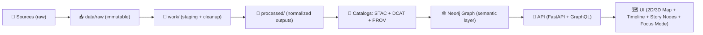

# 🕸️ KFM Knowledge Graph — Docs & Contracts


> [!IMPORTANT]
> **This folder is the human-readable “contract layer” for the KFM Neo4j knowledge graph.**  
> If a node/edge can’t be traced back to cataloged evidence (STAC/DCAT/PROV), it doesn’t belong in the graph. 🧾🧬  
> This aligns with KFM’s **evidence-first publishing** and the “no black box layers” principle. :contentReference[oaicite:0]{index=0} :contentReference[oaicite:1]{index=1}

---

## 🧭 What this folder is for

This directory documents and governs the **semantic layer** of KFM:

- 🧱 **Graph schema contracts** (labels, relationship types, required properties, constraints)
- 🗺️ **Mapping rules** (how STAC/DCAT/PROV become nodes/edges)
- 🧪 **Quality & health checks** (what “good graph state” means + how we verify it)
- 🔎 **Curated Cypher query library** (for APIs, Focus Mode, and maintainer debugging)
- 🔐 **Governance rules for sensitive attributes** (classification, redactions, policy expectations)
- 🧩 **AI + UI integration notes** (how graph semantics power Focus Mode + “map behind the map” UX)

If you’re looking for **import tables**, go here:

- 📦 **Graph import tables (generated)** → [`../csv/README.md`](../csv/README.md) :contentReference[oaicite:2]{index=2}

---

## 🧠 KFM principle recap (why the graph must be “evidence-first”)

KFM’s intake pipeline treats **metadata + lineage** as first-class citizens:

- **DCAT** = discoverability 🧭  
- **STAC** = spatial/temporal indexing 🗺️⏳  
- **PROV** = reproducibility + auditability 🧾  

Together, these are the required “evidence triplet” for anything published. :contentReference[oaicite:3]{index=3}

Graph ingestion happens after those catalogs exist: it reads STAC/DCAT/PROV, then creates nodes/edges in Neo4j. :contentReference[oaicite:4]{index=4} :contentReference[oaicite:5]{index=5}

> [!NOTE]
> KFM intentionally uses a **hybrid store**:
> - **PostGIS** for geometry + fast spatial operations 🧮🗺️  
> - **Neo4j** for semantic context + multi-hop relationships 🕸️  
> :contentReference[oaicite:6]{index=6}

---

## 🧱 Where the graph fits in the full pipeline



- The UI is **decoupled** from the backend via REST + GraphQL endpoints (no DB bypass). :contentReference[oaicite:7]{index=7}  
- The UI is designed so *every visualization is linked to its source data + metadata* (“map behind the map”). :contentReference[oaicite:8]{index=8}

---

## 🗂️ Recommended structure inside `data/graph/`

> [!TIP]
> You can start minimal and grow this tree as needed. The key is: **schema + mapping + QA live together** so drift is obvious. ✅

```text
📁 data/
  📁 graph/
    📁 csv/                   # 🧾 generated nodes/edges import tables
      📄 README.md            # 📦 how CSV import artifacts are produced
    📁 docs/                  # 📚 YOU ARE HERE (contracts + explainers)
      📄 README.md
      📁 schema/              # 🧱 label + rel type contracts (human + machine readable)
      📁 mapping/             # 🔁 STAC/DCAT/PROV ➜ graph mapping specs
      📁 qa/                  # 🧪 health checks + expected outputs + “known good”
      📁 queries/             # 🔎 curated Cypher snippets (API + Focus Mode + maintainer)
      📁 governance/          # 🔐 classification + redaction + policy notes
      📁 adr/                 # 🧾 graph ADRs (design decisions + rationale)
```

---

## 🧩 Core graph concepts (KFM-native vocabulary)

### 🧾 Evidence triplet
The graph is **derived** from, and must remain consistent with:

- `data/catalogs/` (DCAT)  
- `data/stac/` (STAC)  
- `data/prov/` (PROV) :contentReference[oaicite:9]{index=9}

### 🚫 “No mystery nodes”
Graph ingestion must prevent:
- nodes without catalog IDs
- nodes without provenance
- hand-crafted graph-only facts that can’t be reproduced :contentReference[oaicite:10]{index=10}

### 🧭 Ontology-aligned semantics
KFM expects graph meaning to align with standard ontologies:
- CIDOC-CRM (history/cultural heritage)
- GeoSPARQL (spatial semantics)
- OWL-Time (temporal semantics) :contentReference[oaicite:11]{index=11} :contentReference[oaicite:12]{index=12}

### 📚 Story Nodes
Story Nodes reference datasets + locations and can be linked through the graph (enabling “what data backs this story?”). :contentReference[oaicite:13]{index=13}

---

## 🧱 Suggested “minimum viable schema”

> [!NOTE]
> This list is intentionally **conceptual** (not prescriptive). The *real* schema is what’s enforced by constraints + import contracts.
> Keep the docs aligned with the enforced reality.

### 🧍 Entities (common labels)
- `:Place` (counties, towns, landmarks, regions)
- `:Event` (historical events, environmental events, incidents)
- `:Person` / `:Organization` (agents, contributors, authorities)
- `:Document` (articles, PDFs, manuscripts, scans)
- `:Dataset` (DCAT datasets)
- `:Asset` / `:Observation` (STAC items/observations)
- `:Activity` (PROV activities: ingestion runs, processing steps) :contentReference[oaicite:14]{index=14} :contentReference[oaicite:15]{index=15}

### 🔗 Relationships (common edges)
- `(:Dataset)-[:COVERS]->(:Place)` (spatial coverage)
- `(:Event)-[:AFFECTED]->(:Place)`
- `(:Document)-[:MENTIONS]->(:Event|:Place|:Person)`
- `(:Dataset)-[:DERIVED_FROM]->(:Dataset)`
- `(:Activity)-[:USED]->(:Dataset)` and `(:Dataset)-[:WAS_GENERATED_BY]->(:Activity)` (PROV-style lineage) :contentReference[oaicite:16]{index=16} :contentReference[oaicite:17]{index=17}

### 🧾 Provenance pointers (required-ish)
Docs recommend each graph entry retain references to catalog IDs (STAC ID, DCAT dataset ID, internal dataset ID) for traceability. :contentReference[oaicite:18]{index=18}

---

## 🔁 Import pipeline contract (CSV ➜ Neo4j)

Graph ingestion is typically done via **generated CSV files** containing nodes + relationships so Neo4j can bulk import. :contentReference[oaicite:19]{index=19} :contentReference[oaicite:20]{index=20}

**Non-negotiables:**
- ✅ CSV outputs are **generated from** STAC/DCAT/PROV (not hand-edited)
- ✅ Graph state can be rebuilt from versioned evidence artifacts (re-import is a feature)
- ✅ Nothing goes into the graph without a corresponding catalog/provenance record (“no mystery nodes”) :contentReference[oaicite:21]{index=21} :contentReference[oaicite:22]{index=22}

> [!TIP]
> Treat `data/graph/csv/` as a **derived artifact** that is reproducible from versioned evidence.
> Treat `data/graph/docs/` as the **contract** that makes that artifact stable over time.

---

## 🧪 QA & “Weekly Graph Health Check” (recommended)

KFM proposals include a recurring **Weekly Graph Health Check** to ensure:
- constraints/indexes are valid
- referential integrity holds
- schema drift is detected early
- graph state remains explainable and provenance-backed :contentReference[oaicite:23]{index=23}

### ✅ Health check checklist (starter set)

- 🧱 **Constraint coverage**: uniqueness + required property presence where needed
- 🧬 **Lineage coverage**: datasets/assets have PROV-linked activities when expected
- 🕳️ **Orphans**: isolated nodes / dangling relationships
- 🧾 **Catalog pointers**: nodes have valid references back to STAC/DCAT IDs
- 🧠 **Explainability hooks**: Focus Mode can cite which nodes/edges were used (audit-friendly) :contentReference[oaicite:24]{index=24}

### 🔎 Cypher snippets (adapt to your final label/rel names)

```cypher
// 1) Find isolated nodes (no relationships)
MATCH (n)
WHERE NOT (n)--()
RETURN labels(n) AS labels, count(*) AS c
ORDER BY c DESC;

// 2) Find datasets missing “evidence pointers” (example properties)
MATCH (d:Dataset)
WHERE d.catalog_id IS NULL OR d.dcat_id IS NULL
RETURN d.kfm_id, d.title
LIMIT 50;

// 3) Spot potential duplicates by “name/title” clustering
MATCH (p:Place)
WHERE p.name IS NOT NULL
RETURN p.name, count(*) AS c
ORDER BY c DESC
LIMIT 25;
```

> [!NOTE]
> Neo4j can support deeper analysis (centrality, community detection, shortest paths).  
> KFM design docs even call out spectral/graph analysis as a potential way to find clusters + bridge nodes. :contentReference[oaicite:25]{index=25} :contentReference[oaicite:26]{index=26}

---

## 🧠 Focus Mode + AI integration (why docs matter)

Focus Mode is designed to:
- translate questions into Neo4j queries
- traverse ontology-aligned relationships (CIDOC-CRM, OWL-Time, etc.)
- combine structured graph retrieval with unstructured document retrieval (RAG)
- always return answers **with citations** and governance checks :contentReference[oaicite:27]{index=27} :contentReference[oaicite:28]{index=28}

Graph docs should therefore include:
- “How do we map user intents to graph traversals?” 🧭
- “What is the canonical node for this term/event?” 🧱
- “Which relationships are safe to traverse under which policy?” 🔐
- “How do we expose reasoning context (audit panel / explainability)?” 🪞 :contentReference[oaicite:29]{index=29}

---

## 🧠 Conceptual Attention Nodes (CAN) & Pulse Threads (advanced graph patterns)

KFM proposals describe **Conceptual Attention Nodes** that act like *graph-level attention tokens*:
- datasets + story nodes link to `(:Concept {name:"drought"})`
- the AI query planner can “attend” to those concept hubs to gather evidence efficiently
- the UI can expose concepts as thematic toggles/filters (“turn on Drought lens”) :contentReference[oaicite:30]{index=30} :contentReference[oaicite:31]{index=31}

**Pulse Threads** are proposed as:
- emergent sequences (narrative/causal patterns) discovered by graph traversal
- stored as first-class nodes/edges so the UI + Focus Mode can replay/inspect them :contentReference[oaicite:32]{index=32}

> [!TIP]
> If you implement CAN/Pulse Threads, document them here first as:
> - schema contracts
> - discovery rules (how they’re derived)
> - governance (who can publish them)
> - explainability (how users inspect their evidence trail)

---

## 🔐 Governance & sensitive attributes (graph responsibilities)

Docs emphasize governance checks and classification for sensitive attributes during ingestion/graph loading. :contentReference[oaicite:33]{index=33} :contentReference[oaicite:34]{index=34}

**Recommended patterns to document here:**
- 🏷️ `classification`: `public | internal | restricted`
- 🧭 coordinate handling:
  - omit restricted coordinates or
  - store generalized locations (centroids / fuzzed geometry) with redaction notes
- 🧾 provenance credit:
  - source attribution + contributor credit in metadata and UI surfaces :contentReference[oaicite:35]{index=35}

**Ethics roadmap** (FAIR + CARE):
- Innovative concepts explicitly call out balancing open science with CARE principles and inclusive design practices. :contentReference[oaicite:36]{index=36}

---

## 🚀 Roadmap hooks (how graph docs should evolve)

### 📥 Bulk document & knowledge ingestion
Future proposals suggest ingesting batches of PDFs/text:
- OCR + entity extraction
- link extracted entities to existing Neo4j nodes
- create new nodes when needed (people, places, dates) to enrich semantic search :contentReference[oaicite:37]{index=37}

### 🚌 Real-time feeds (GTFS-RT ➜ STAC ➜ graph)
Future proposals also include watchers that produce STAC items for live observations, then link them into the catalog + graph. :contentReference[oaicite:38]{index=38}

### 🕰️ 4D digital twins & AR storytelling
Innovative concepts describe “4D” (time-state) digital twins and AR narrative overlays—graph docs should anticipate:
- temporal versioning
- scenario branches (“what-if” simulation runs)
- AR scene nodes referencing places + story steps :contentReference[oaicite:39]{index=39} :contentReference[oaicite:40]{index=40}

### 👥 Crowdsourced verification
Innovative concepts propose OSM-like QA workflows and community review—graph docs should anticipate:
- contributor roles/levels
- review edges (e.g., `(:User)-[:REVIEWED]->(:Claim)`)
- rollback / provenance-based moderation :contentReference[oaicite:41]{index=41}

---

## 🧾 Templates (copy/paste starters)

### 🧱 Node label contract template

```md
# 🧱 Label: :Dataset

## Purpose
What real-world thing does this represent?

## Required properties
- kfm_id (string, stable)
- title (string)
- dcat_id (string)
- classification (enum)

## Optional properties
- description
- keywords
- temporal_start / temporal_end

## Evidence mapping
- DCAT ➜ Dataset
- PROV ➜ lineage relationships

## Constraints
- UNIQUE(kfm_id)
- EXISTS(dcat_id)
```

### 🔗 Relationship contract template

```md
# 🔗 Rel: (:Dataset)-[:COVERS]->(:Place)

## Meaning
Dataset spatially covers a place.

## Creation rule
Create if DCAT spatial / STAC footprint intersects place region.

## Required properties
(optional) confidence, method, created_by_activity_id

## Governance
Respect classification rules (restricted places may require generalized links).
```

---

## 📦 PDF portfolios (project research libraries) — extraction helper

Several project files are **PDF portfolios** (they contain many embedded PDFs). You may need Acrobat to browse them directly, but you can also extract attachments to make them greppable/searchable.

### 🧰 Extract embedded PDFs (Python)

```python
from pathlib import Path
from pypdf import PdfReader

portfolio = Path("AI Concepts & more.pdf")  # adjust path in repo
out_dir = Path("_extracted/AI_Concepts")
out_dir.mkdir(parents=True, exist_ok=True)

reader = PdfReader(str(portfolio))
for name, payloads in reader.attachments.items():
    # payloads is usually a 1-item list of bytes
    (out_dir / name).write_bytes(payloads[0])
    print("✅ extracted:", name)
```

> [!NOTE]
> These portfolios are reference libraries for theory, tooling, and long-form learning—not runtime dependencies.

---

## 📚 Source index (all project files)

### ✅ KFM system design (primary)
- 📘 Comprehensive Technical Documentation :contentReference[oaicite:42]{index=42}  
- 🏗️ Comprehensive Architecture, Features, and Design :contentReference[oaicite:43]{index=43}  
- 🧭 AI System Overview (Focus Mode + KG integration) :contentReference[oaicite:44]{index=44}  
- 🖥️ Comprehensive UI System Overview :contentReference[oaicite:45]{index=45} :contentReference[oaicite:46]{index=46}  
- 📥 Data Intake – Technical & Design Guide :contentReference[oaicite:47]{index=47} :contentReference[oaicite:48]{index=48}  

### ✨ Ideas & roadmap
- 💡 Additional Project Ideas (Concept nodes, Pulse Threads, health checks) :contentReference[oaicite:49]{index=49} :contentReference[oaicite:50]{index=50}  
- 🌟 Latest Ideas & Future Proposals :contentReference[oaicite:51]{index=51}  
- 🚀 Innovative Concepts to Evolve KFM (4D twins, AR, ethics, crowdsourced QA) :contentReference[oaicite:52]{index=52} :contentReference[oaicite:53]{index=53}  

### 📚 Research libraries (PDF portfolios)
- 🤖 AI Concepts & more (portfolio) :contentReference[oaicite:54]{index=54}  
- 🌍 Maps / Google Maps / Virtual Worlds / Geospatial WebGL (portfolio) :contentReference[oaicite:55]{index=55}  
- 🧑‍💻 Various programming languages & resources (portfolio) :contentReference[oaicite:56]{index=56}  
- 🗄️ Data Management / Architectures / Bayesian Methods (portfolio) :contentReference[oaicite:57]{index=57}  

---

## ✅ Definition of Done (when graph docs are “healthy”)

- [ ] Every label + relationship used in import tables is documented in `docs/schema/`
- [ ] Mapping rules exist for each node/edge type (STAC/DCAT/PROV ➜ graph)
- [ ] Constraints & indexes are documented and validated regularly
- [ ] “No mystery nodes” policy is enforced (evidence pointers required)
- [ ] Health check exists and runs on a schedule (weekly recommended)
- [ ] Focus Mode can cite graph entities used in answers (audit-friendly)

---

_If you add something to the graph, add the doc contract here first. 🧠🧾_
