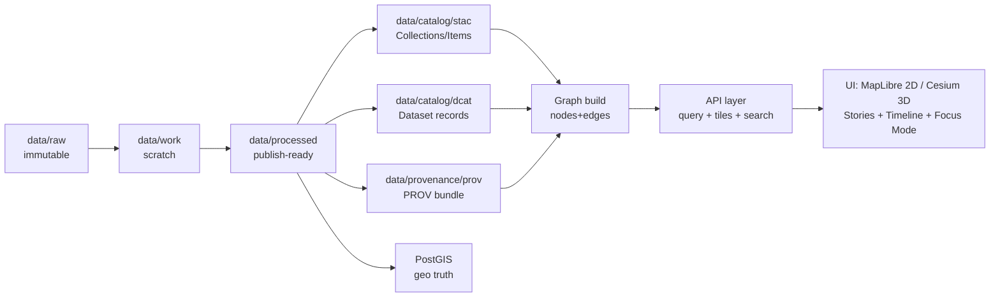

<!--
📄 File: data/graph/docs/mapping_rules.md
🎯 Goal: Single source of truth for how geospatial data + metadata + graph entities become map-visible layers in KFM.
-->

# 🗺️ KFM Mapping Rules


> [!IMPORTANT]
> **If it renders on the map, it must be traceable.**  
> Every visible layer/feature must link back to: **(1) source**, **(2) processing steps**, **(3) metadata**, and **(4) graph context**.  
> (aka “🧭 the map behind the map”)

---

## ✨ TL;DR (Non‑Negotiables)

✅ **PostGIS stores geo truth** (vectors/rasters/3D footprints).  
✅ **Catalogs describe assets** (STAC + DCAT) and **PROV explains lineage**.  
✅ **Graph links context** (Place/Event/Person/Dataset) and drives discovery.  
✅ **UI never bypasses the API** (no direct DB calls; no “mystery nodes”).  
✅ **WGS84 / EPSG:4326 is the canonical interchange CRS**.  
✅ **Layers are contract-first** (a manifest defines how a layer is loaded + filtered + cited).  
✅ **Sensitive data is policy-labeled and enforced** (server-side, fail-closed). 🔒

---

## 🧭 Where this doc sits

📦 **Repo context**
```text
data/
  raw/                      🧱 immutable source drops
  work/                     🛠️ scratch + intermediate products
  processed/                ✅ publish-ready datasets + tiles + COGs
  catalog/
    stac/                   🛰️ STAC Collections + Items
    dcat/                   🗂️ DCAT dataset records
  provenance/
    prov/                   🧬 W3C PROV bundles (JSON-LD)
  graph/
    csv/
      nodes/                🧩 node tables (generated, not hand-edited)
      edges/                🧷 edge tables (generated, not hand-edited)
    docs/
      mapping_rules.md      👈 you are here
```

🔗 **Related docs (recommended)**
- `../../../docs/MASTER_GUIDE_v13.md` 📚
- `../../../api/scripts/policy/README.md` 🛡️
- `../csv/README.md` 🧩 (graph CSV expectations)
- `../../../docs/standards/` 🧾 (STAC/DCAT/PROV profiles—if/when present)

---

## 🧩 Glossary (Quick)

- **Layer**: A map-ready visualization source (tiles, WMS, feature API, 3D tiles, stream).
- **Dataset**: A governed, versioned collection of observations/assets (often a STAC Collection + DCAT record).
- **Asset**: A concrete file or service endpoint (COG, PMTiles, GeoParquet, API, 3D tileset).
- **Feature**: A single spatial object (a road segment, parcel polygon, point of interest).
- **Graph entity**: A node like `Place`, `Event`, `Person`, `Dataset`, `Document`, etc.

---

## 🧱 Golden Rules (MUST / SHOULD / MAY)

### MUST ✅
1. **Every layer has a Layer Manifest** (see “📜 Layer Contract”).
2. **Every published dataset has**:
   - a **DCAT dataset record**
   - a **STAC Collection** (and Items as needed)
   - a **PROV bundle** recording inputs, code, agents, outputs
3. **Every map feature can be cited**:
   - popup → dataset source → metadata → provenance (links/IDs)
4. **Canonical IDs are stable** across versions and environments.
5. **Graph CSVs are generated** by pipelines — **never hand-edited**.
6. **API is the only runtime interface** for UI + AI (“no DB side doors”).
7. **Policy is enforced server-side** (classification, access, redaction).
8. **Geometry is valid** (or made valid) and has correct CRS metadata.

### SHOULD 👍
- Prefer **open standards** and portable formats (GeoParquet, PMTiles, COG, STAC, DCAT, PROV).
- Provide both **analysis-friendly** and **render-friendly** artifacts (GeoParquet + PMTiles).
- Precompute LOD/generalization where it materially improves performance.
- Provide time filtering hooks if the dataset is time-aware.

### MAY 🧪
- Use OGC services (WMS/WFS/OGC API Features) for interoperability where needed.
- Distribute artifacts via OCI registry (ORAS + cosign) as an advanced deployment pattern.

---

## 🔁 End-to-End Mapping Lifecycle (Detect → Validate → Promote)



> [!NOTE]
> **Promotion is not copying files.** Promotion is **publishing a contract**: data + metadata + provenance + graph linkage + policies.

---

## 📜 Layer Contract (Layer Manifest)

Every map-visible layer MUST be describable by a single manifest object.  
Recommended location: `data/processed/layers/<layer_id>/layer.yaml` (or a central registry).

### ✅ Required fields
```yaml
layer_id: kfm.ks.landcover.2000_2020.v1    # stable ID (see ID rules)
title: "Kansas Landcover (2000–2020)"
description: "Time-sliced landcover classification"
tags: ["landcover", "environment", "time-series"]

kind: vector_tiles  # one of: vector_tiles | raster_tiles | raster_cog | features_api | tiles3d | stream
visibility:
  default_on: false
  min_zoom: 4
  max_zoom: 14

sources:
  # pick the appropriate source block for `kind`
  vector_tiles:
    type: mvt
    endpoint: /tiles/landcover/{z}/{x}/{y}.pbf
    params:
      time: true            # timeline can drive this
      bbox: true            # API can filter by bbox
  analysis:
    geoparquet: data/processed/landcover/landcover_2000_2020.parquet
  metadata:
    stac_collection_id: kfm.ks.landcover.2000_2020.v1
    dcat_dataset_id: kfm.ks.landcover.2000_2020.v1
    prov_bundle_id: prov:kfm.ks.landcover.2000_2020.v1#run-2025-01-01T00:00:00Z

time:
  mode: ranged                # none | instant | ranged
  start_field: time_start     # dataset-defined
  end_field: time_end
  ui:
    supports_timeline: true
    default_range: ["2000-01-01", "2020-12-31"]

styling:
  maplibre_style_layer_ids: ["landcover-fill", "landcover-outline"]
  legend:
    type: categorical
    items:
      - { label: "Forest", value: "forest" }
      - { label: "Grassland", value: "grassland" }
      - { label: "Urban", value: "urban" }

governance:
  sensitivity: public          # public | partner | restricted | sacred
  license: "CC-BY-4.0"
  pii_risk: low                # none | low | medium | high
  access:
    policy_pack: "default"     # ties to OPA/Conftest rules
```

### 🚦Manifest enforcement rules
- `layer_id` MUST be unique.
- `kind` MUST map to exactly one loadable source configuration.
- `metadata.*_id` MUST exist in catalogs (STAC/DCAT).
- `prov_bundle_id` MUST exist for any `processed` artifact used by the layer.
- If `time.ui.supports_timeline=true`, then the backing endpoint MUST accept time filtering (server-side).

---

## 🆔 Canonical ID Rules

### Dataset / Layer IDs
Use a consistent dotted namespace:

`kfm.<region>.<domain>.<name>.<version>`

Examples:
- `kfm.ks.boundaries.counties.v1`
- `kfm.ks.transport.gtfs_rt.v1`
- `kfm.ks.historic_maps.atlas_1890_sheet_12.v2`

### Graph IDs (recommended)
Prefer explicit typed IDs:
- `kfm:dataset:kfm.ks.boundaries.counties.v1`
- `kfm:layer:kfm.ks.boundaries.counties.v1`
- `kfm:place:us.ks.ellis_county` (or GNIS/GeoNames-based where available)
- `kfm:asset:sha256:<hash>` (for immutable artifacts)

---

## 🌍 CRS + Geometry Rules

### Canonical CRS
- **Interchange/output CRS MUST be WGS84 (EPSG:4326)** unless a domain constraint requires otherwise.
- Internal processing MAY use projected CRSs for measurement accuracy, but MUST record CRS in metadata/provenance.

### Geometry validity
- All geometries MUST be valid at publish time:
  - Fix with `ST_MakeValid` / equivalent.
  - Avoid self-intersections, bow-ties, invalid rings.

### Precision + rounding (rendering)
- Vector tiles SHOULD limit coordinate precision to reduce payload size (tile encoder handles this).
- Avoid publishing sub-meter precision for sensitive human-related points unless policy allows.

---

## 🧱 Tiling & LOD Rules

### Vector Tiles (MVT) 🧩
**Use for:** boundaries, roads, parcels, points, polygons, most thematic layers.

Rules:
- Tiles MUST be deterministic for the same inputs + parameters.
- Tiles SHOULD contain only the attributes needed for styling + minimal popup.
  - Heavy details MUST be fetched via a `feature_details` endpoint by `feature_id`.

Recommended PostGIS tile pattern (illustrative):
```sql
-- PSEUDO: one layer per endpoint or per logical dataset
WITH
  bounds AS (
    SELECT ST_TileEnvelope(:z, :x, :y) AS geom_3857
  ),
  mvtgeom AS (
    SELECT
      feature_id,
      class,
      ST_AsMVTGeom(
        ST_Transform(t.geom, 3857),
        bounds.geom_3857,
        4096,
        64,
        true
      ) AS geom
    FROM my_schema.my_table t, bounds
    WHERE ST_Intersects(ST_Transform(t.geom, 3857), bounds.geom_3857)
      -- optional server-side time filter
      AND (:t_start IS NULL OR t.time_end >= :t_start)
      AND (:t_end   IS NULL OR t.time_start <= :t_end)
  )
SELECT ST_AsMVT(mvtgeom, 'layer_name', 4096, 'geom');
```

**LODs**
- Low zoom (0–6): generalized geometries or aggregated features.
- Mid zoom (7–12): simplified but recognizable.
- High zoom (13+): full resolution (within reason).

### Raster (COG / Raster Tiles) 🛰️
**Use for:** imagery, hillshade, historic scans, classified rasters, DEM derivatives.

Rules:
- Published rasters SHOULD be **COG** with overviews.
- If serving raster tiles, ensure proper caching and consistent nodata handling.
- STAC Items MUST reference raster assets and include bbox/geometry/time.

### PMTiles 📦 (Offline + CDN-friendly)
**Use for:** portable, static vector tile delivery and offline packs.

Rules:
- PMTiles MUST be content-addressable (hash recorded).
- PMTiles MUST have matching analysis counterpart if the dataset is also used for computation:
  - **GeoParquet** recommended.

### 3D Tiles (CesiumJS) 🏔️
**Use for:** terrain tiles, photogrammetry, point clouds (as permitted), landmark models.

Rules:
- 3D tilesets MUST declare spatial reference and alignment strategy.
- 3D view MUST be able to link back to:
  - dataset → STAC/DCAT → PROV → source.

---

## ⏳ Time Rules (Timeline + Events + Observations)

KFM uses a 4D mental model: **(x, y, z, t)**.

### Time semantics
- **valid_time**: when something is true (historic map effective period).
- **observed_time**: when something was measured (sensor, GTFS-RT fetch).
- **published_time**: when KFM published the artifact.

### Minimum time fields (recommended)
- `time_start` (ISO 8601)
- `time_end` (ISO 8601) — can equal `time_start` for instants
- `time_granularity` (optional): `year|month|day|hour|minute|second`

### Timeline integration rules
If a layer supports the timeline:
- Endpoint MUST accept a time range filter.
- Rendering MUST be stable for repeated slider positions.
- Story nodes MAY set timeline state (see “📖 Story Mapping Rules”).

---

## 🧾 Metadata Backbone Rules (STAC + DCAT + PROV)

### STAC 🛰️
Use STAC for:
- Collections: dataset-level scope
- Items: concrete slices (per tile-pack, per raster, per time window, per sensor pull)

**Rules**
- Every published dataset MUST have a STAC Collection.
- Every published artifact SHOULD have a STAC Item (especially rasters and time-sliced outputs).
- STAC MUST include:
  - bbox + geometry
  - time extent
  - assets with roles + media types
  - links to DCAT + PROV IDs (via `links` or `extra_fields`)

### DCAT 🗂️
Use DCAT for:
- dataset governance and discovery metadata (publisher, license, themes)

**Rules**
- DCAT record MUST include:
  - title/description
  - publisher/owner
  - license
  - temporal + spatial coverage
  - distribution links (PMTiles/COG/GeoParquet/API endpoints)

### PROV 🧬
Use PROV to answer: **“How did we get here?”**

**Rules**
- Any change to `data/processed` MUST have a corresponding PROV update.
- PROV MUST include:
  - input Entities (raw + intermediate)
  - an Activity (pipeline run)
  - Agents (human + automated)
  - outputs (processed artifacts)
- Prefer **append-only** provenance bundles (new run IDs; keep old).

---

## 🧠 Graph ↔ Map Mapping Rules (Neo4j + PostGIS + Catalog)

### Design principle
- **Graph stores meaning + relationships**, not heavy geometries.
- **PostGIS stores geometry truth** and supports spatial queries.
- **Catalog stores discoverability + distributions**.

### Required node types (minimum viable)
| Node Type | Purpose | MUST link to |
|---|---|---|
| `Dataset` | governed dataset identity | DCAT + STAC Collection + PROV bundle |
| `Layer` | UI-visible map layer | Dataset + Layer Manifest |
| `Place` | named location | PostGIS feature/geom reference + citations |
| `Event` | time-bounded occurrence | Place (or geometry ref) + sources |
| `Asset` / `Observation` | concrete item/slice | STAC Item + Dataset |
| `Document` | unstructured content | extracted entities + citations |

### Required relationships (minimum viable)
- `(:Layer)-[:VISUALIZES]->(:Dataset)`
- `(:Dataset)-[:HAS_STAC_COLLECTION]->(:StacCollection)`
- `(:Dataset)-[:HAS_DCAT_RECORD]->(:DcatDataset)`
- `(:Dataset)-[:HAS_PROV_BUNDLE]->(:ProvBundle)`
- `(:StacCollection)-[:HAS_ITEM]->(:StacItem)`
- `(:Event)-[:HAPPENED_IN]->(:Place)`
- `(:Document)-[:MENTIONS]->(:Place|Event|Person|Dataset)`

### Join keys & references
- Graph nodes SHOULD store:
  - `bbox` and `centroid` for quick map navigation
  - `feature_ref` pointers for PostGIS joins (e.g., `table`, `schema`, `feature_id`)
- Graph MUST NOT duplicate large geometry blobs unless there is a proven need.

### Graph CSV rules 🧩
- `data/graph/csv/nodes/*.csv` and `edges/*.csv` MUST be pipeline outputs.
- CSVs MUST pass referential integrity:
  - no dangling edges
  - no missing required properties
  - stable IDs
- If nodes/edges change, catalogs + provenance MUST also be updated.

---

## 🖥️ UI Mapping Rules (MapLibre 2D + CesiumJS 3D)

### Layer panel expectations 🧰
Every layer MUST provide:
- a human-friendly title
- an info panel (“what is this layer?”)
- a legend definition
- a citation/source pointer (DCAT/STAC/PROV IDs)
- time capabilities (if applicable)
- governance badge (public/partner/restricted/sacred) 🔒

### Popups: “Evidence first” 🔎
Feature popups SHOULD include:
- short label (name/type)
- time (if any)
- dataset link (DCAT)
- source link (STAC Item or raw reference)
- provenance link (PROV bundle/run)
- **no uncited claims**

### 2D/3D parity 🧭
If a dataset supports both 2D and 3D views:
- layer IDs MUST remain consistent
- the story engine MUST be able to switch camera modes while preserving context

---

## 📖 Story Mapping Rules (Story Nodes)

Stories are map-driven narratives where each step can set:
- camera position
- layer visibility
- filters (time range, categories)
- highlights (feature IDs)
- narration text/media

### Story step contract (example)
```json
{
  "step_id": "s3-flint-hills-transition",
  "title": "From prairie to patchwork",
  "narration_md": "The Flint Hills remained largely unplowed…",
  "map_state": {
    "mode": "2d",
    "camera": { "center": [-96.5, 38.8], "zoom": 8.2, "bearing": 0, "pitch": 0 },
    "time": { "range": ["1880-01-01", "1930-12-31"] },
    "layers": {
      "on": ["kfm.ks.historic_maps.atlas_1890_sheet_12.v2", "kfm.ks.boundaries.counties.v1"],
      "off": ["kfm.ks.landcover.2000_2020.v1"]
    },
    "highlights": [{ "layer_id": "kfm.ks.boundaries.counties.v1", "feature_id": "us.ks.chase" }]
  },
  "citations": [
    { "type": "dcat", "id": "kfm.ks.historic_maps.atlas_1890_sheet_12.v2" },
    { "type": "stac", "id": "kfm.ks.historic_maps.atlas_1890_sheet_12.v2:item:sheet12" }
  ]
}
```

### Story validation rules ✅
- Referenced `layer_id`s MUST exist in the layer registry.
- Highlighted `feature_id`s MUST resolve via API.
- Story citations MUST resolve to catalog entries.

---

## 🧊 Offline Pack Rules (County/Region Packs)

Offline packs are portable bundles intended for field work, classrooms, museums, or low-connectivity.

### Pack contents (minimum)
- `pack.json` manifest (IDs, coverage, versions, checksums)
- PMTiles for vector layers
- COGs (or raster tile packs) for rasters
- story files and media referenced by those stories
- catalogs subset (STAC/DCAT) for included datasets
- provenance subset (PROV) for included datasets

### Pack manifest (example)
```json
{
  "pack_id": "kfm.ks.offline.chase_county.v1",
  "bbox": [-97.2, 38.2, -96.1, 39.0],
  "datasets": [
    "kfm.ks.boundaries.counties.v1",
    "kfm.ks.historic_maps.atlas_1890_sheet_12.v2"
  ],
  "artifacts": [
    { "path": "pmtiles/counties.pmtiles", "sha256": "..." },
    { "path": "cog/atlas_1890_sheet_12.tif", "sha256": "..." }
  ],
  "stories": ["stories/kansas_from_above.json"],
  "signing": { "cosign": true, "signature_ref": "oci://..." }
}
```

### Offline governance 🔒
- Packs MUST respect access control labels.
- Restricted/sacred datasets MUST NOT be exportable into public packs.

---

## 🔒 Governance + Privacy Rules (CARE/FAIR + Policy Pack)

### Sensitivity labels
Every dataset/layer MUST declare sensitivity:
- `public`
- `partner`
- `restricted`
- `sacred`

### Redaction / generalization (server-side)
For sensitive point data, at least one MUST apply:
- rounding to grid (e.g., 1km cells)
- aggregation (heatmap / hex bins)
- jitter with documented parameters
- zoom gating (only visible at high zoom with auth)

### Query auditing & inference control (when applicable)
- Rate-limit sensitive endpoints.
- Enforce minimum group sizes for aggregated queries (k-anonymity style rule).
- Log access for restricted layers (PII-safe logging).

### Policy gate expectations 🛡️
CI/runtime policy checks SHOULD fail on:
- missing metadata IDs
- missing PROV for processed outputs
- UI manifests referencing non-existent datasets
- sensitive layers missing governance labels
- AI outputs without citations (runtime gate)

---

## 🧪 Validation & “Definition of Done” for a New Map Layer

### ✅ Done checklist
- [ ] Raw inputs in `data/raw/...` with source notes
- [ ] Processing pipeline produces outputs in `data/processed/...`
- [ ] PostGIS tables updated (if required) + indexed
- [ ] STAC Collection (+ Items if applicable) added
- [ ] DCAT dataset record added
- [ ] PROV bundle added for the run
- [ ] Graph CSV nodes/edges updated by pipeline (not by hand)
- [ ] Layer manifest added + validated
- [ ] Tile/API endpoints tested (smoke test on bbox + time filters)
- [ ] Layer appears in UI with legend + citations + governance badge
- [ ] Offline pack compatibility confirmed (if required)

---

## 🧰 Examples (Common Patterns)

### Pattern A: “Dual-format publish” (GeoParquet + PMTiles) 📦
Use when a dataset needs both:
- fast interactive map viewing (PMTiles)
- analytical workloads (GeoParquet)

**Rule**: Both artifacts must share:
- dataset ID
- catalog metadata
- provenance run ID

### Pattern B: Time-sliced tiles via `time` parameter ⏳
Use when:
- timeline slider filters features
- a dataset is versioned by time windows

**Rule**: time filtering MUST be server-side to prevent UI drift and ensure policy enforcement.

### Pattern C: Historic map scans → COG + STAC 🗺️
Use for:
- scanned atlas sheets, georeferenced overlays

**Rule**:
- store GCPs / georeferencing notes as an auditable artifact
- publish COG + STAC Item + provenance

---

## 📚 Project Source Docs & Resource Bundles

These mapping rules are aligned with the project’s architecture, UI, AI, and data intake design docs and the included “resource bundle” PDFs (multi-book portfolios).

### Core KFM documents
- **KFM Comprehensive Technical Documentation** 🧠
- **KFM Architecture, Features, and Design** 🏗️
- **KFM AI System Overview** 🤖
- **KFM UI System Overview** 🖥️
- **KFM Data Intake – Technical & Design Guide** 📥
- **KFM Latest Ideas & Future Proposals** 🌟
- **Innovative Concepts to Evolve KFM** 🚀
- **Additional Project Ideas** 🧪
- **Open-Source Geospatial Historical Mapping Hub Design** 🗺️

### Reference bundles (PDF portfolios)
- **AI Concepts & more** 🧠📦
- **Data Management / Theories / Bayesian / Programming Ideas** 🗃️📦
- **Various Programming Languages & Resources** 💻📦
- **Maps / GoogleMaps / Virtual Worlds / Archaeological / WebGL** 🌍🎮📦

---

## 🧾 Appendix: “Why this matters” (One-liner)

KFM is a **trustable map** system:  
**map visuals** + **graph meaning** + **metadata backbone** + **prov lineage** + **policy enforcement** → **credible exploration** ✅

---
