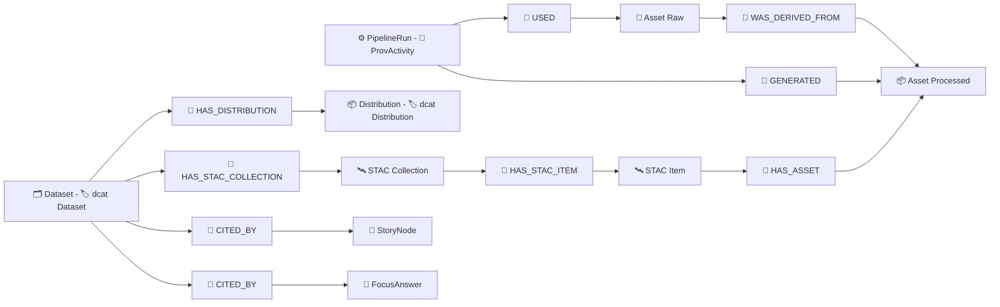

<!--
📍 File: data/graph/docs/ontology.md
Purpose: KFM Knowledge Graph Ontology (property-graph-first, RDF/OWL-aligned)
-->

# 🧬 Kansas Frontier Matrix (KFM) Ontology — Graph + Semantic Contracts


> **KFM’s ontology is the “spatial truth contract”**: it standardizes how we represent *places, time, datasets, provenance, stories, simulations, and AI outputs* so every map pixel and answer stays auditable. :contentReference[oaicite:0]{index=0} :contentReference[oaicite:1]{index=1} :contentReference[oaicite:2]{index=2} :contentReference[oaicite:3]{index=3}

---

## 📚 Table of Contents
- [1. 🎯 Scope & Design Goals](#1--scope--design-goals)
- [2. 🧱 Ontology Layers (Core → Extensions)](#2--ontology-layers-core--extensions)
- [3. 🧩 Core Classes (Node Labels)](#3--core-classes-node-labels)
- [4. 🔗 Core Relationships (Edge Types)](#4--core-relationships-edge-types)
- [5. 🛰️ Catalog Triplet Model (STAC + DCAT + PROV)](#5--catalog-triplet-model-stac--dcat--prov)
- [6. 🗺️ Space-Time Model (Geo + Time)](#6--space-time-model-geo--time)
- [7. 🧠 AI + Narratives (Focus Mode, Story Nodes, Pulse Threads)](#7--ai--narratives-focus-mode-story-nodes-pulse-threads)
- [8. 🧪 Modeling & Simulations (Deterministic Runs)](#8--modeling--simulations-deterministic-runs)
- [9. 🧭 Governance, Sensitivity, & Policy-as-Code](#9--governance-sensitivity--policy-as-code)
- [10. ✅ QA / Health Checks as First-Class Graph Objects](#10--qa--health-checks-as-first-class-graph-objects)
- [11. 🧰 Implementation Contracts (IDs, Constraints, Indexes)](#11--implementation-contracts-ids-constraints-indexes)
- [12. 🧾 Export Contracts (JSON-LD Context + SHACL-ish Shapes)](#12--export-contracts-json-ld-context--shacl-ish-shapes)
- [Appendix A: 🧷 Prefixes & Namespaces](#appendix-a--prefixes--namespaces)
- [Appendix B: 🧠 Conceptual Attention Nodes (Thematic Lenses)](#appendix-b--conceptual-attention-nodes-thematic-lenses)
- [Appendix C: 📦 OCI Artifact Storage References](#appendix-c--oci-artifact-storage-references)
- [Sources 📎](#sources-)

---

## 1) 🎯 Scope & Design Goals

### What this ontology governs ✅
KFM is a **provenance-first, catalog-driven, knowledge-graph-powered “living atlas”** where *every dataset, layer, story, and AI insight must remain traceable* to sources and transformations. :contentReference[oaicite:4]{index=4} :contentReference[oaicite:5]{index=5}

This ontology defines:
- **Domain entities**: Place, Event, Person/Org, Dataset, Observation, ModelRun, StoryNode, PulseThread, Concept
- **Evidence entities**: RawArtifact, ProcessedArtifact, CatalogRecord (STAC/DCAT), ProvenanceRecord (PROV), PolicyDecision
- **Operational entities**: WatcherAlert, Plan, PullRequest/ChangeSet, ValidationRun, TelemetrySpan

### Why property graph first? 🕸️
KFM uses Neo4j for connected context and PostGIS for heavy spatial/tabular workloads (hybrid store). The ontology is defined as a **property graph contract**, with **RDF/OWL alignments** to keep semantics portable. :contentReference[oaicite:6]{index=6} :contentReference[oaicite:7]{index=7}

### Non-negotiables 🔒
- **No black boxes**: AI answers and narratives must cite evidence. :contentReference[oaicite:8]{index=8}
- **Canonical flow**: Raw → Work → Processed → Catalogs → Graph → API → UI → (Stories/Focus). :contentReference[oaicite:9]{index=9}
- **Human-in-the-loop**: automated outputs create PRs / drafts, not silent merges. :contentReference[oaicite:10]{index=10} :contentReference[oaicite:11]{index=11}

---

## 2) 🧱 Ontology Layers (Core → Extensions)

### 🧩 Core (KFM)
A minimal set of classes/edges required for the platform to function.

### 🧬 Standards Alignments (External Vocabularies)
We align to common “semantic anchors”:
- **PROV-O** for lineage (prov:Entity, prov:Activity, prov:Agent) :contentReference[oaicite:12]{index=12}
- **DCAT** for dataset cataloging (dcat:Dataset, dcat:Distribution) :contentReference[oaicite:13]{index=13}
- **GeoSPARQL** for geometry semantics (geo:hasGeometry, geo:asWKT) :contentReference[oaicite:14]{index=14}
- **OWL-Time** for temporal semantics (time:Instant, time:Interval) :contentReference[oaicite:15]{index=15}
- **SOSA/SSN** for sensors/observations (sosa:Observation, sosa:Sensor) :contentReference[oaicite:16]{index=16}
- **CIDOC-CRM** for cultural heritage events/actors where needed :contentReference[oaicite:17]{index=17}
- **SKOS** for concept taxonomy (skos:Concept) :contentReference[oaicite:18]{index=18}

### 🧩 Extension Modules (Optional)
- **Narrative layer**: StoryNode, PulseThread, “Conceptual Attention Nodes” :contentReference[oaicite:19]{index=19}
- **Simulation layer**: ModelRun, Scenario, DiffPatch :contentReference[oaicite:20]{index=20}
- **AR / 4D mapping layer**: ARScene, DigitalTwinState (future) :contentReference[oaicite:21]{index=21}

---

## 3) 🧩 Core Classes (Node Labels)

> **Convention:** Neo4j labels are `PascalCase` and properties are `snake_case`.  
> **Example:** `(:Dataset {kfm_id: "...", title: "...", ...})`

### 🗺️ Space / Time / People
- `Place` — canonical named place (county, town, site)
- `Region` — an area container (watershed, county boundary, cultural region)
- `Geometry` — geometry payload pointer (WKT/GeoJSON/tileset/bbox)
- `TimeInstant` — timestamp (point-in-time)
- `TimeInterval` — start/end (period)
- `Agent` — person, organization, software agent (aligns PROV Agent)
- `Person` / `Organization` — optional specialization of Agent

### 🛰️ Data & Catalog
- `Dataset` — conceptual dataset (aligns DCAT Dataset) :contentReference[oaicite:22]{index=22}
- `Distribution` — access form(s) (file, API endpoint, tile service) :contentReference[oaicite:23]{index=23}
- `Asset` — concrete artifact (file, PMTiles, GeoParquet, COG, model binary)
- `STACCollection` — collection-level STAC record
- `STACItem` — item-level STAC record
- `CatalogRecord` — generic wrapper for catalog entries (optional)

### ⛓ Provenance / Pipelines
- `ProvEntity` — prov:Entity (often also `Dataset` / `Asset`)
- `ProvActivity` — prov:Activity (ingest run, transform, publish)
- `ProvAgent` — prov:Agent (human or bot)
- `PipelineRun` — operational run record (can align with ProvActivity)
- `WatcherAlert` — immutable fact emitted by watcher agent :contentReference[oaicite:24]{index=24}
- `Plan` — deterministic plan produced by planner :contentReference[oaicite:25]{index=25}
- `ChangeSet` — change bundle (often a PR)
- `PullRequest` — PR node (DevOps provenance integration) :contentReference[oaicite:26]{index=26}

### 🧠 AI / Narratives / UX
- `StoryNode` — guided narrative step(s) with map state :contentReference[oaicite:27]{index=27}
- `PulseThread` — geotagged “timely narrative update” :contentReference[oaicite:28]{index=28}
- `FocusAnswer` — an AI answer object with citations :contentReference[oaicite:29]{index=29}
- `Concept` — thematic “attention” hub (skos:Concept) :contentReference[oaicite:30]{index=30}

### 🧪 Modeling / Analytics
- `Model` — model definition (code + semantics)
- `ModelRun` — deterministic run (activity) :contentReference[oaicite:31]{index=31}
- `Scenario` — structured “what-if” request :contentReference[oaicite:32]{index=32}
- `Metric` — named metric (e.g., NDVI, streamflow percentile, PM2.5)
- `Observation` — measured value (sosa:Observation) :contentReference[oaicite:33]{index=33}
- `Sensor` — physical or virtual sensor (sosa:Sensor)
- `FeatureOfInterest` — thing observed (often Place/Region)

### 🧭 Governance & QA
- `Policy` — policy object (OPA/Rego pack, ruleset) :contentReference[oaicite:34]{index=34}
- `PolicyDecision` — runtime decision applied to a request/output
- `ValidationRun` — QA run (schema checks, graph health checks) :contentReference[oaicite:35]{index=35}
- `Issue` — tracked problem (optional)

---

## 4) 🔗 Core Relationships (Edge Types)

> **Convention:** relationships are `SCREAMING_SNAKE_CASE`.  
> Keep them *semantic* and stable; do not overload a single edge type.

### 🌍 Spatial
- `HAS_GEOMETRY` (Place/Region/Dataset/Asset → Geometry)
- `WITHIN` (Place/Region → Region)
- `INTERSECTS` (Region ↔ Region)
- `HAS_CENTERPOINT` (Place/Region → Geometry) *(optional helper)*

### ⏳ Temporal
- `HAS_TIME` (Event/Dataset/Observation/StoryNode → TimeInstant/TimeInterval)
- `STARTS_AT` / `ENDS_AT` (TimeInterval → TimeInstant)

### 📦 Catalog + Access
- `HAS_DISTRIBUTION` (Dataset → Distribution) :contentReference[oaicite:36]{index=36}
- `HAS_ASSET` (Dataset/Distribution/STACItem → Asset)
- `HAS_STAC_COLLECTION` (Dataset → STACCollection)
- `HAS_STAC_ITEM` (STACCollection → STACItem)

### ⛓ Provenance (PROV-aligned)
- `USED` (ProvActivity/ModelRun/PipelineRun → ProvEntity)
- `GENERATED` (ProvActivity/ModelRun/PipelineRun → ProvEntity)
- `WAS_ASSOCIATED_WITH` (ProvActivity → ProvAgent)
- `WAS_DERIVED_FROM` (ProvEntity → ProvEntity)
- `WAS_ATTRIBUTED_TO` (ProvEntity → ProvAgent)

> KFM enforces *evidence-first*: catalog + provenance are mandatory for publishable entities. :contentReference[oaicite:37]{index=37}

### 🧠 AI / Narrative
- `CITES` (FocusAnswer/StoryNode/PulseThread → Dataset/Asset/Document/ProvEntity) :contentReference[oaicite:38]{index=38}
- `ABOUT` (StoryNode/PulseThread → Place/Region/Event/Concept)
- `USES_LAYER` (StoryNode → Dataset/Distribution/Asset) :contentReference[oaicite:39]{index=39}
- `HAS_STEP` (Story → StoryNode) *(if you model Story as separate node)*

### 🧪 Modeling
- `RUNS_MODEL` (ModelRun → Model)
- `OBSERVED_BY` (Observation → Sensor)
- `OBSERVES` (Sensor → Metric)
- `HAS_FEATURE_OF_INTEREST` (Observation → Place/Region)
- `PRODUCED_DATASET` (ModelRun → Dataset)

### 🧭 Governance / QA / Ops
- `GOVERNED_BY` (Dataset/StoryNode/FocusAnswer → Policy)
- `DECIDED_BY` (PolicyDecision → Policy)
- `APPLIED_TO` (PolicyDecision → Dataset/Asset/Answer/Request)
- `VALIDATED` (ValidationRun → Dataset/GraphSnapshot/CatalogRecord)
- `OPENED_PR` (Plan → PullRequest) :contentReference[oaicite:40]{index=40}
- `TRIGGERED` (WatcherAlert → Plan)

---

## 5) 🛰️ Catalog Triplet Model (STAC + DCAT + PROV)

KFM publishing requires the **catalog triplet**:
- **STAC**: asset-level spatiotemporal description  
- **DCAT**: dataset-level catalog/discovery + licensing  
- **PROV-O**: lineage of how outputs were produced  
This is a foundational intake rule. :contentReference[oaicite:41]{index=41} :contentReference[oaicite:42]{index=42}

### Suggested node bundle (minimum)
```text
(:Dataset)
  -[:HAS_DISTRIBUTION]-> (:Distribution)
  -[:HAS_STAC_COLLECTION]-> (:STACCollection)
  -[:WAS_DERIVED_FROM]-> (:ProvEntity)  (often raw)
(:PipelineRun:ProvActivity)
  -[:USED]-> (:ProvEntity {raw})
  -[:GENERATED]-> (:ProvEntity {processed})
```

### Mermaid: “Evidence Spine” 🧵


---

## 6) 🗺️ Space-Time Model (Geo + Time)

### Geometry storage policy 📐
Because KFM renders via MapLibre/Cesium and serves tiles/COGs/PMTiles, the graph should **not** store huge geometry blobs inline. Store:
- a normalized bbox + centroid
- an `href` (file path, tile endpoint, OCI reference)
- a geometry type + CRS marker

**`Geometry` recommended properties**
- `geom_type`: `Point | LineString | Polygon | Multi* | Raster | TileSet | Volume`
- `crs`: e.g., `EPSG:4326`
- `bbox`: `[minx, miny, maxx, maxy]`
- `wkt` *(optional for small objects)*
- `geojson` *(optional for small objects)*
- `href`: pointer (e.g., `/tiles/...`, `s3://...`, `oci://...`) :contentReference[oaicite:43]{index=43}

### Temporal model ⏱️
KFM UI uses time sliders and 4D mapping. Represent time as **first-class nodes** so you can:
- query “all events in 1930s within region X”
- slice layers by date/time
- attach provenance timestamps consistently :contentReference[oaicite:44]{index=44} :contentReference[oaicite:45]{index=45}

**`TimeInstant`**
- `t`: ISO 8601 string (UTC recommended)
- `precision`: `year | month | day | second | ...`

**`TimeInterval`**
- `start_t`, `end_t` *(or via STARTS_AT / ENDS_AT edges)*
- `label`: e.g., “Dust Bowl era”

---

## 7) 🧠 AI + Narratives (Focus Mode, Story Nodes, Pulse Threads)

### 7.1 Focus Mode answers (evidence-backed) 🧾
Focus Mode must return answers **with citations** and refuse to answer if not grounded in KFM data. :contentReference[oaicite:46]{index=46}

**Graph pattern**
```text
(:FocusAnswer {answer_id, created_at, model_id, safety_flags, confidence})
  -[:CITES]-> (:Dataset|:Asset|:Document|:ProvEntity)
  -[:ABOUT]-> (:Place|:Region|:Event|:Concept)
  -[:WAS_GENERATED_BY]-> (:ProvActivity {type:"focus_mode_inference"})
```

**Required properties**
- `answer_id` (UUID)
- `prompt_hash` (auditability)
- `context_snapshot` (active layers/time/viewport)
- `citations` (redundant list for quick UI rendering)
- `policy_result` (pass/redact/refuse + reason codes)

### 7.2 Story Nodes (Markdown + JSON map state) 📖
Story Nodes synchronize narrative + map state and are stored as versioned content. :contentReference[oaicite:47]{index=47} :contentReference[oaicite:48]{index=48}

**Graph pattern**
```text
(:StoryNode {story_id, node_id, title, markdown_ref, map_state_ref, order})
  -[:USES_LAYER]-> (:Dataset|:Distribution|:Asset)
  -[:ABOUT]-> (:Place|:Region|:Event)
  -[:CITES]-> (:Dataset|:Asset|:Document)
  -[:HAS_TIME]-> (:TimeInstant|:TimeInterval)
```

### 7.3 Pulse Threads (geotagged micro-narratives) 💓
Pulse Threads are a **timely, location-specific narrative type** that behaves like a hybrid of Story Nodes + discussion content, with strict evidence manifests. :contentReference[oaicite:49]{index=49}

**Graph pattern**
```text
(:PulseThread {pulse_id, title, status, created_at, author, markdown_ref})
  -[:ABOUT]-> (:Region|:Place)
  -[:CITES]-> (:Dataset|:Observation|:ProvEntity)
  -[:WAS_TRIGGERED_BY]-> (:WatcherAlert)
  -[:HAS_CONCEPT]-> (:Concept)
```

**Statuses**
- `draft` → `needs_review` → `published` → `archived`

> Pulse Threads pair nicely with real-time feeds (transit, sensors) and can be produced by watcher → planner → executor flows, with human review. :contentReference[oaicite:50]{index=50} :contentReference[oaicite:51]{index=51}

---

## 8) 🧪 Modeling & Simulations (Deterministic Runs)

KFM treats model runs as first-class, reproducible activities; outputs get cataloged like any dataset. :contentReference[oaicite:52]{index=52} :contentReference[oaicite:53]{index=53}

### 8.1 ModelRun contract
**`ModelRun` properties**
- `run_id` (UUID)
- `model_name`, `model_version`
- `seed` (determinism)
- `parameters` (JSON)
- `run_env` (container digest, tool versions)
- `started_at`, `ended_at`
- `status` (`success|failed|canceled`)
- `energy_report_ref` *(optional, but recommended)*

**Edges**
- `USED` → input datasets
- `GENERATED` → output datasets
- `RUNS_MODEL` → model definition
- `WAS_ASSOCIATED_WITH` → agent (human/bot)

### 8.2 Scenario runner (kfm-sim-run) 🧪➡️📦
A deterministic “what-if” runner produces diffs + updated metadata + provenance, often packaged into a PR-first workflow. :contentReference[oaicite:54]{index=54}

---

## 9) 🧭 Governance, Sensitivity, & Policy-as-Code

KFM enforces FAIR+CARE governance during intake and at query time, using policy-as-code (OPA) and UI affordances for transparency. :contentReference[oaicite:55]{index=55} :contentReference[oaicite:56]{index=56} :contentReference[oaicite:57]{index=57}

### 9.1 Classification schema 🏷️
Add `classification` to **Dataset, Asset, Place, Region, StoryNode, PulseThread, FocusAnswer**:
- `public`
- `sensitive` (restricted precision, warnings)
- `restricted` (auth required, limited distribution)
- `confidential` (not exposed to public UI)

### 9.2 Rights + licensing
Minimum required:
- `license` (SPDX when possible)
- `rights_holder` / `publisher`
- `attribution` (UI surfacing)

### 9.3 PolicyDecision nodes (auditability)
```text
(:PolicyDecision {decision_id, policy_id, decision, reason_codes, created_at})
  -[:DECIDED_BY]-> (:Policy)
  -[:APPLIED_TO]-> (:Dataset|:Asset|:FocusAnswer|:Request)
```

---

## 10) ✅ QA / Health Checks as First-Class Graph Objects

KFM expands QA beyond code tests into **graph integrity health checks** (counts, constraints, orphans, drift). :contentReference[oaicite:58]{index=58}

### 10.1 ValidationRun pattern
```text
(:ValidationRun {run_id, run_type, started_at, ended_at, status, report_ref})
  -[:VALIDATED]-> (:Dataset|:CatalogRecord|:GraphSnapshot)
  -[:WAS_ASSOCIATED_WITH]-> (:Agent {type:"ci_bot"})
```

### 10.2 What to validate (minimum)
- Orphaned provenance (ProvActivity without USED/GENERATED)
- STAC items not linked to collection/dataset
- Missing license/classification
- Constraint & index integrity (Neo4j + PostGIS)
- “Minutes since last seen” for streaming sources (SLA drift)

---

## 11) 🧰 Implementation Contracts (IDs, Constraints, Indexes)

### 11.1 Canonical IDs 🔑
Use a stable string `kfm_id` everywhere.

**Recommended format**
```text
kfm:<kind>:<namespace>:<slug>:<version?>
```

Examples:
- `kfm:dataset:ks:landcover:1990-2020:v1`
- `kfm:place:ks:wichita`
- `kfm:prov_activity:pipeline:landcover_ingest:2026-01-24T00:00:00Z`

### 11.2 Required properties by label ✅
| Label | Must-have properties |
|------|------------------------|
| `Dataset` | `kfm_id`, `title`, `description`, `license`, `classification`, `created_at` |
| `Distribution` | `kfm_id`, `access_url` OR `download_url`, `media_type` |
| `Asset` | `kfm_id`, `href`, `checksum_sha256` (or digest), `media_type`, `classification` |
| `ProvActivity` / `PipelineRun` | `kfm_id`, `started_at`, `ended_at`, `status`, `software_ref` |
| `Place` / `Region` | `kfm_id`, `name`, `classification` |
| `StoryNode` | `kfm_id`, `story_id`, `markdown_ref`, `map_state_ref` |
| `FocusAnswer` | `kfm_id`, `answer_id`, `created_at`, `policy_result`, `citations` |
| `PulseThread` | `kfm_id`, `pulse_id`, `status`, `markdown_ref`, `created_at` |

### 11.3 Neo4j constraints (suggested)
```cypher
CREATE CONSTRAINT kfm_id_unique IF NOT EXISTS
FOR (n) REQUIRE n.kfm_id IS UNIQUE;

CREATE INDEX dataset_title IF NOT EXISTS
FOR (d:Dataset) ON (d.title);

CREATE INDEX place_name IF NOT EXISTS
FOR (p:Place) ON (p.name);

CREATE INDEX concept_name IF NOT EXISTS
FOR (c:Concept) ON (c.name);
```

---

## 12) 🧾 Export Contracts (JSON-LD Context + SHACL-ish Shapes)

### 12.1 Minimal JSON-LD @context (starter)
> Use this when exporting a subgraph as linked data (optional but powerful).

```json
{
  "@context": {
    "kfm": "https://kansasfrontiermatrix.org/ontology#",
    "prov": "http://www.w3.org/ns/prov#",
    "dcat": "http://www.w3.org/ns/dcat#",
    "dct": "http://purl.org/dc/terms/",
    "geo": "http://www.opengis.net/ont/geosparql#",
    "time": "http://www.w3.org/2006/time#",
    "sosa": "http://www.w3.org/ns/sosa/",
    "skos": "http://www.w3.org/2004/02/skos/core#",
    "kfm_id": "kfm:kfm_id",
    "classification": "kfm:classification",
    "hasGeometry": { "@id": "geo:hasGeometry", "@type": "@id" },
    "used": { "@id": "prov:used", "@type": "@id" },
    "generated": { "@id": "prov:generated", "@type": "@id" },
    "wasDerivedFrom": { "@id": "prov:wasDerivedFrom", "@type": "@id" }
  }
}
```

### 12.2 “SHACL-ish” rules (human-readable)
- Every **Dataset** must have: `license`, `classification`, and at least one `HAS_DISTRIBUTION`.
- Every **published** `StoryNode|PulseThread|FocusAnswer` must have at least one `CITES`.
- Every **ProvActivity** must have at least one `USED` and one `GENERATED`.

---

## Appendix A: 🧷 Prefixes & Namespaces

```text
kfm:    https://kansasfrontiermatrix.org/ontology#
prov:   http://www.w3.org/ns/prov#
dcat:   http://www.w3.org/ns/dcat#
dct:    http://purl.org/dc/terms/
geo:    http://www.opengis.net/ont/geosparql#
time:   http://www.w3.org/2006/time#
sosa:   http://www.w3.org/ns/sosa/
skos:   http://www.w3.org/2004/02/skos/core#
crm:    http://www.cidoc-crm.org/cidoc-crm/
schema: https://schema.org/
```

---

## Appendix B: 🧠 Conceptual Attention Nodes (Thematic Lenses)

Concept nodes are **curated hubs** that connect datasets, events, places, and narratives so the UI + AI can “focus” on themes like **drought**, **biodiversity**, or **cultural heritage**. :contentReference[oaicite:59]{index=59}

**Pattern**
```text
(:Concept {kfm_id, name, description, authority_ref})
  <-[:HAS_CONCEPT]- (:Dataset|:Event|:StoryNode|:PulseThread)
```

**Why it matters**
- Improves retrieval planning for Focus Mode (more precise, less wandering)
- Enables UI “thematic lenses” and curated exploration paths

---

## Appendix C: 📦 OCI Artifact Storage References

KFM can treat large artifacts (PMTiles, GeoParquet, COGs, model binaries) as **content-addressed packages** in OCI registries (ORAS + Cosign), and reference digests in catalog + provenance. :contentReference[oaicite:60]{index=60}

**Graph pattern**
```text
(:Asset {kfm_id, href:"oci://...", digest:"sha256:...", media_type, signed:true})
  -[:HAS_PROVENANCE]-> (:ProvEntity)
```

---

## Sources 📎
> Project documents used to derive and align this ontology (KFM architecture, intake, AI, UI, future proposals, and library portfolios):

- KFM Comprehensive Technical Documentation :contentReference[oaicite:61]{index=61}  
- AI Concepts & reference library (PDF portfolio) :contentReference[oaicite:62]{index=62}  
- Geospatial / WebGL / GIS reference library (PDF portfolio) :contentReference[oaicite:63]{index=63}  
- Programming languages & resources library (PDF portfolio) :contentReference[oaicite:64]{index=64}  
- 🌟 Latest Ideas & Future Proposals :contentReference[oaicite:65]{index=65}  
- Comprehensive Architecture, Features, and Design :contentReference[oaicite:66]{index=66}  
- AI System Overview 🧭🤖 :contentReference[oaicite:67]{index=67}  
- Comprehensive UI System Overview :contentReference[oaicite:68]{index=68}  
- 📚 Data Intake – Technical & Design Guide :contentReference[oaicite:69]{index=69}  
- Innovative Concepts to Evolve KFM :contentReference[oaicite:70]{index=70}  
- Additional Project Ideas (Pulse Threads, Concept Nodes, Health Checks, OCI artifacts) :contentReference[oaicite:71]{index=71}  
