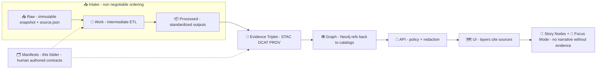

# 🗂️ `data/manifests/` — KFM Manifests, Contracts, & Provenance


> **Purpose:** this folder holds the **human-authored manifests** (aka **data contracts**) that declare what KFM *has*, where it came from, how it was produced, how it’s governed, and how it should be published — **before** it becomes a catalog entry, a graph node, an API response, a map layer, or a Story/Focus artifact.  
> KFM’s architecture is explicit: *anything that shows up in the UI must be traceable back to cataloged sources*, and “mystery layers” are not allowed.  [oai_citation:0‡Kansas Frontier Matrix (KFM) – Comprehensive Technical Documentation.pdf](file-service://file-AkqwUuYPp5zePf7pv5SMxi)

---

## 🧭 The non-negotiables (KFM invariants) ✅

KFM runs on a few “never break these” rules:

1) **Canonical pipeline ordering** (no bypassing stages):  
   **Raw → Work → Processed → Catalogs → Graph → API → UI → Story/Focus** — and no stage is allowed to skip the previous one.  [oai_citation:1‡📚 Kansas Frontier Matrix (KFM) Data Intake – Technical & Design Guide.pdf](file-service://file-EbUCdsJMbu5KwpoKMrLrgj)

2) **Evidence-first publishing**: no dataset is “real” until the **evidence triplet** exists:
   - **STAC** (spatial/asset-level truth)
   - **DCAT** (discovery/citation truth)
   - **PROV** (lineage/trust truth)  
   Stored canonically under `data/stac/`, `data/catalogs/`, `data/prov/`.  [oai_citation:2‡📚 Kansas Frontier Matrix (KFM) Data Intake – Technical & Design Guide.pdf](file-service://file-EbUCdsJMbu5KwpoKMrLrgj)

3) **Contract-first**: schemas + contracts are first-class artifacts; changes require strict versioning/compat checks.  [oai_citation:3‡Kansas Frontier Matrix (KFM) – Comprehensive Technical Documentation.pdf](file-service://file-AkqwUuYPp5zePf7pv5SMxi) [oai_citation:4‡MARKDOWN_GUIDE_v13.md.gdoc](file-service://file-UYVruFXfueR8veHMUKeugU)

4) **Deterministic pipelines**: idempotent, config-driven, fully logged transforms for reproducibility.  [oai_citation:5‡MARKDOWN_GUIDE_v13.md.gdoc](file-service://file-UYVruFXfueR8veHMUKeugU)

5) **Fail-closed governance**: missing provenance / missing license / missing classification should block publication (CI + policy gates).  [oai_citation:6‡📚 Kansas Frontier Matrix (KFM) Data Intake – Technical & Design Guide.pdf](file-service://file-EbUCdsJMbu5KwpoKMrLrgj) [oai_citation:7‡Kansas Frontier Matrix (KFM) – Comprehensive Architecture, Features, and Design.pdf](file-service://file-4Umt1yHoGKicdmLWzFJ9sC)

---

## 🧱 Manifests in the pipeline (where this folder fits) 🧩✨



- **Raw ingest** is immutable and accompanied by a `source.json` receipt (URL, retrieval time, method, license, checksums).  [oai_citation:8‡📚 Kansas Frontier Matrix (KFM) Data Intake – Technical & Design Guide.pdf](file-service://file-EbUCdsJMbu5KwpoKMrLrgj)
- **Catalog artifacts** (STAC/DCAT/PROV) are the **boundary** that downstream systems consume.  [oai_citation:9‡📚 Kansas Frontier Matrix (KFM) Data Intake – Technical & Design Guide.pdf](file-service://file-EbUCdsJMbu5KwpoKMrLrgj)
- The **UI must not pull directly from raw/graph** — only through governed API access after catalog + graph integration.  [oai_citation:10‡📚 Kansas Frontier Matrix (KFM) Data Intake – Technical & Design Guide.pdf](file-service://file-EbUCdsJMbu5KwpoKMrLrgj)

---

## 🧾 Manifest vs Receipt vs Catalog (don’t mix these up) 🧠

| Artifact | Where it lives | Authorship | What it’s for |
|---|---|---:|---|
| **Receipt** (`source.json`, `checksums.sha256`) 🧾 | `data/raw/**/` | pipeline-generated | Proves **what bytes entered** KFM + legal context (license/citation) at ingest time.  [oai_citation:11‡📚 Kansas Frontier Matrix (KFM) Data Intake – Technical & Design Guide.pdf](file-service://file-EbUCdsJMbu5KwpoKMrLrgj) [oai_citation:12‡📚 Kansas Frontier Matrix (KFM) Data Intake – Technical & Design Guide.pdf](file-service://file-EbUCdsJMbu5KwpoKMrLrgj) |
| **Manifest / Contract** (this folder) 🗂️ | `data/manifests/**` | human-authored | Declares intent + governance + IDs + expected outputs; drives validation + catalog build. (Aligned with “contract-first” metadata requirements.)  [oai_citation:13‡Kansas Frontier Matrix (KFM) – Comprehensive Technical Documentation.pdf](file-service://file-AkqwUuYPp5zePf7pv5SMxi) |
| **Catalog outputs** (evidence triplet) 📚 | `data/stac/`, `data/catalogs/`, `data/prov/` | machine-generated | Publishable, interoperable metadata used by graph/API/UI; must be complete.  [oai_citation:14‡📚 Kansas Frontier Matrix (KFM) Data Intake – Technical & Design Guide.pdf](file-service://file-EbUCdsJMbu5KwpoKMrLrgj) |

---

## 🧱 Folder layout (recommended) 🧩✨

> 🧠 **Design intent:** keep **contracts here**, keep **generated evidence** in their canonical folders (`data/stac/`, `data/catalogs/`, `data/prov/`), and keep raw receipts with the raw data.

```text
📁 data/
  ├── 📥 raw/                                🧾 immutable snapshots + receipts (source.json, checksums.sha256)
  ├── 🧰 work/                               🧪 intermediate ETL artifacts
  ├── 📦 processed/                          ✅ final standardized data products
  ├── 🛰️ stac/                               📚 STAC collections/items (evidence triplet)
  ├── 🗃️ catalogs/                           📚 DCAT outputs (evidence triplet)
  ├── 🧬 prov/                               📚 PROV lineage bundles (evidence triplet)
  ├── 🕸️ graph/
  │   └── csv/                               🧷 import-ready CSVs (must trace to evidence; no hand-edit drift) [oai_citation:15‡📚 Kansas Frontier Matrix (KFM) Data Intake – Technical & Design Guide.pdf](file-service://file-EbUCdsJMbu5KwpoKMrLrgj)
  └── 🗂️ manifests/
      ├── 📄 README.md                       👈 you are here 🙂
      ├── 📐 schemas/                        📏 JSON Schema / YAML schema docs (contract-first)
      │   ├── 📄 dataset.manifest.schema.json
      │   ├── 📄 pipeline.manifest.schema.json
      │   ├── 📄 model.manifest.schema.json
      │   └── 📄 doc.manifest.schema.json
      ├── 🛰️ datasets/                       📦 dataset declarations (inputs + derived)
      ├── 🧪 pipelines/                      🧰 reproducible ETL + packaging contracts
      ├── 🧠 models/                         🧬 simulation/ML model declarations
      ├── 📚 docs/                           📚 governed “reference library” docs (PDF/DOCX, etc.)
      ├── 🧾 sources/                        🔗 OPTIONAL: “upstream source manifests” for fetch steps
      ├── 🧾 runs/                           🧪 OPTIONAL: serialized RunContext / run manifests (audit trail)
      └── 🧰 _generated/                     ⚙️ OPTIONAL local build artifacts (gitignored)
```

---

## 🏷️ Naming conventions (boringly consistent) 🔁

### ✅ IDs

Use stable, globally-unique IDs that can serve as:
- filenames
- STAC IDs / DCAT identifiers
- graph node IDs
- API keys

**Suggested pattern**
```
kfm.<region>.<theme>.<artifact>.<time_or_scope>.v<major>
```

Examples:
- `kfm.ks.landcover.2000_2020.v1`
- `kfm.ks.surficial_geology.statewide.v1`
- `kfm.ks.transit.gtfsrt.kdot.v1`

> 🧩 Why: KFM’s metadata layer expects consistent linkage across STAC/DCAT/PROV and graph references.  [oai_citation:16‡📚 Kansas Frontier Matrix (KFM) Data Intake – Technical & Design Guide.pdf](file-service://file-EbUCdsJMbu5KwpoKMrLrgj)

### ✅ Filenames

- Dataset manifest: `data/manifests/datasets/<id>.manifest.yaml`
- Pipeline manifest: `data/manifests/pipelines/<id>.manifest.yaml`
- Model manifest: `data/manifests/models/<id>.manifest.yaml`
- Doc/library manifest: `data/manifests/docs/<id>.manifest.yaml`

---

## 🌐 Profiles & cross-linking expectations (KFM flavor) 🧬

KFM extends STAC/DCAT/PROV with project profiles:
- **KFM STAC Profile** requires fields like `kfm:dataset_id` and `kfm:classification` (public/internal/etc.).  [oai_citation:17‡📚 Kansas Frontier Matrix (KFM) Data Intake – Technical & Design Guide.pdf](file-service://file-EbUCdsJMbu5KwpoKMrLrgj)
- **KFM DCAT Profile** adds sovereignty/sensitivity descriptors.  [oai_citation:18‡📚 Kansas Frontier Matrix (KFM) Data Intake – Technical & Design Guide.pdf](file-service://file-EbUCdsJMbu5KwpoKMrLrgj)
- **KFM PROV Profile** can mark agent roles (e.g., AI-generated content) and link governance ledger IDs.  [oai_citation:19‡📚 Kansas Frontier Matrix (KFM) Data Intake – Technical & Design Guide.pdf](file-service://file-EbUCdsJMbu5KwpoKMrLrgj)

Profiles are versioned (e.g., **KFM-PROV v11.0.0**).  [oai_citation:20‡📚 Kansas Frontier Matrix (KFM) Data Intake – Technical & Design Guide.pdf](file-service://file-EbUCdsJMbu5KwpoKMrLrgj)

> ✅ Practical linkage:
> - STAC Items should point to the actual assets (usually in `data/processed/**`).  [oai_citation:21‡MARKDOWN_GUIDE_v13.md.gdoc](file-service://file-UYVruFXfueR8veHMUKeugU)
> - PROV should link **raw → work → processed**, including run/config identifiers (run ID or commit hash).  [oai_citation:22‡MARKDOWN_GUIDE_v13.md.gdoc](file-service://file-UYVruFXfueR8veHMUKeugU)
> - Graph nodes should reference catalog IDs (don’t duplicate bulky payloads).  [oai_citation:23‡MARKDOWN_GUIDE_v13.md.gdoc](file-service://file-UYVruFXfueR8veHMUKeugU)

---

## 📦 Manifest types (what you can declare) 🧾

| Type | What it describes | Typical outputs |
|---|---|---|
| 🛰️ **Dataset manifest** | source + derived data products (rasters, vectors, tables, streams) | STAC Collection/Item + DCAT Dataset/Distributions + PROV lineage |
| 🧪 **Pipeline manifest** | reproducible steps (fetch → validate → transform → package → publish) | PROV Activity chain; run contexts; artifact hashes; telemetry |
| 🧠 **Model manifest** | simulation/ML models (training, assumptions, evaluation) | model card + PROV + dataset links |
| 📚 **Doc manifest** | governed reference-library PDFs/DOCX + governance metadata | searchable library index; citations into Story Nodes / Focus Mode |

---

## 🚦 Intake gatekeeping (what must be true before “real processing”) 🛡️

KFM does an initial “ingestion gate” validation pass, including:
- **file integrity**: compute SHA-256 / multihash; often write `checksums.sha256` with raw data.  [oai_citation:24‡📚 Kansas Frontier Matrix (KFM) Data Intake – Technical & Design Guide.pdf](file-service://file-EbUCdsJMbu5KwpoKMrLrgj)
- **format sanity**: basic schema/parse checks to catch corruption early.  [oai_citation:25‡📚 Kansas Frontier Matrix (KFM) Data Intake – Technical & Design Guide.pdf](file-service://file-EbUCdsJMbu5KwpoKMrLrgj)
- **FAIR/CARE compliance (lite)**: ensure sensitivity labels/essential metadata like license/citation exist (often in `source.json`).  [oai_citation:26‡📚 Kansas Frontier Matrix (KFM) Data Intake – Technical & Design Guide.pdf](file-service://file-EbUCdsJMbu5KwpoKMrLrgj)
- **telemetry logging**: append-only NDJSON ledger of pipeline events (auditable).  [oai_citation:27‡📚 Kansas Frontier Matrix (KFM) Data Intake – Technical & Design Guide.pdf](file-service://file-EbUCdsJMbu5KwpoKMrLrgj)

> 📌 **Manifest implication:** your dataset/pipeline manifest must include enough info to make these gates enforceable (or link to where the receipts live).

---

## ✅ Minimum required fields (baseline contract) 🧱

> If a manifest omits these, it should fail validation.  
> This aligns with KFM’s “data contract” enforcement model (no unsourced/ad-hoc data in the official catalog).  [oai_citation:28‡Kansas Frontier Matrix (KFM) – Comprehensive Technical Documentation.pdf](file-service://file-AkqwUuYPp5zePf7pv5SMxi)

### 🛰️ Dataset manifest (YAML) — template (KFM-aligned)

```yaml
# data/manifests/datasets/kfm.ks.example_dataset.1850_1900.v1.manifest.yaml
manifest_version: "1.1"
kind: "dataset"

id: "kfm.ks.example_dataset.1850_1900.v1"
title: "Example Dataset (1850–1900)"
summary: "One-liner describing what this dataset is."
description: |
  Longer description. Include context, methodology, and limitations.
  If a claim matters, cite it below (or cite catalog IDs that already embed citations).

# KFM profile alignment (cross-layer glue)
profiles:
  stac_profile: "KFM-STAC-v11"
  dcat_profile: "KFM-DCAT-v11"
  prov_profile: "KFM-PROV-v11"   # profiles are versioned [oai_citation:29‡📚 Kansas Frontier Matrix (KFM) Data Intake – Technical & Design Guide.pdf](file-service://file-EbUCdsJMbu5KwpoKMrLrgj)

kfm:
  dataset_id: "kfm.ks.example_dataset.1850_1900.v1"  # mirrors STAC kfm:dataset_id expectation [oai_citation:30‡📚 Kansas Frontier Matrix (KFM) Data Intake – Technical & Design Guide.pdf](file-service://file-EbUCdsJMbu5KwpoKMrLrgj)
  classification: "public"                           # mirrors STAC kfm:classification expectation [oai_citation:31‡📚 Kansas Frontier Matrix (KFM) Data Intake – Technical & Design Guide.pdf](file-service://file-EbUCdsJMbu5KwpoKMrLrgj)

themes: ["history", "boundaries", "environment"]
tags: ["kansas", "geospatial", "timeline"]

governance:
  fair_category: "FAIR+CARE"
  care_label: "Public"
  sensitivity: "public"          # public | restricted | sensitive | confidential [oai_citation:32‡Kansas Frontier Matrix (KFM) – Comprehensive Architecture, Features, and Design.pdf](file-service://file-4Umt1yHoGKicdmLWzFJ9sC)
  pii: false
  indigenous_sensitivity: false  # if true, triggers extra review + potential coord generalization [oai_citation:33‡Kansas Frontier Matrix (KFM) – Comprehensive Architecture, Features, and Design.pdf](file-service://file-4Umt1yHoGKicdmLWzFJ9sC)

license:
  spdx: "CC-BY-4.0"
  attribution: "Source org / author(s)"
  constraints: ["attribution-required"]

extent:
  spatial:
    bbox_wgs84: [-102.051, 36.993, -94.588, 40.003]
    crs: "EPSG:4326"
  temporal:
    start: "1850-01-01"
    end: "1900-12-31"

# Raw receipts (prove the bytes)
raw_receipts:
  - path: "data/raw/example_domain/example_dataset/source.json"       # raw stage uses source.json receipts [oai_citation:34‡📚 Kansas Frontier Matrix (KFM) Data Intake – Technical & Design Guide.pdf](file-service://file-EbUCdsJMbu5KwpoKMrLrgj)
  - path: "data/raw/example_domain/example_dataset/checksums.sha256"  # tamper-evidence checksums file [oai_citation:35‡📚 Kansas Frontier Matrix (KFM) Data Intake – Technical & Design Guide.pdf](file-service://file-EbUCdsJMbu5KwpoKMrLrgj)

sources:
  - name: "Primary Source Name"
    type: "web|archive|api|book|internal"
    url: "https://example.org/source"
    retrieved_at: "2026-01-11"
    license: "Public Domain"
    citation: "Author (Year). Title. Publisher/Archive."
    notes: "Any constraints or caveats."

assets:
  - role: "analysis"
    path: "data/processed/example_domain/example_dataset.parquet"
    format: "parquet"
    sha256: "<fill-me>"
  - role: "ui_tiles"
    path: "data/processed/example_domain/example_dataset.pmtiles"
    format: "pmtiles"
    sha256: "<fill-me>"

processing:
  pipeline_id: "kfm.pipeline.example_dataset.v1"
  reproducibility:
    deterministic: true                 # deterministic pipeline expectation [oai_citation:36‡MARKDOWN_GUIDE_v13.md.gdoc](file-service://file-UYVruFXfueR8veHMUKeugU)
    pinned_deps: true
  run_context_ref: "data/manifests/runs/<run_id>.json"  # context serialized for provenance (params, versions) [oai_citation:37‡📚 Kansas Frontier Matrix (KFM) Data Intake – Technical & Design Guide.pdf](file-service://file-EbUCdsJMbu5KwpoKMrLrgj)

publish:
  # The evidence triplet is required before graph/API/UI use [oai_citation:38‡📚 Kansas Frontier Matrix (KFM) Data Intake – Technical & Design Guide.pdf](file-service://file-EbUCdsJMbu5KwpoKMrLrgj)
  catalogs:
    stac:
      collection_id: "kfm.ks.example_dataset.1850_1900.v1"
      out_dir: "data/stac/"
    dcat:
      dataset_id: "kfm.ks.example_dataset.1850_1900.v1"
      out_dir: "data/catalogs/"
    prov:
      bundle_id: "kfm.prov.kfm.ks.example_dataset.1850_1900.v1"
      out_dir: "data/prov/"

graph:
  ingest: true
  notes: "Graph nodes should reference catalog IDs; do not duplicate payloads." # [oai_citation:39‡MARKDOWN_GUIDE_v13.md.gdoc](file-service://file-UYVruFXfueR8veHMUKeugU)

contacts:
  maintainer: { name: "KFM Data Team", email: "maintainers@example.org" }
  steward: { name: "Domain Steward", email: "steward@example.org" }

quality:
  validation:
    schema: "data/manifests/schemas/dataset.manifest.schema.json"
  notes: "Known limitations, missing fields, accuracy caveats."
```

---

### 🧪 Pipeline manifest — template (KFM-aligned)

```yaml
manifest_version: "1.1"
kind: "pipeline"

id: "kfm.pipeline.example_dataset.v1"
title: "Example Dataset ETL + Packaging"
inputs: ["kfm.ks.example_source.v1"]
outputs: ["kfm.ks.example_dataset.1850_1900.v1"]

execution:
  runtime: "python"
  entrypoint: "pipelines/example/run.py"
  reproducibility:
    pinned_deps: true
    deterministic: true   # deterministic ETL expectation [oai_citation:40‡MARKDOWN_GUIDE_v13.md.gdoc](file-service://file-UYVruFXfueR8veHMUKeugU)
  run_context:
    serialize_json: true  # RunContext serialized for provenance / reproducibility [oai_citation:41‡📚 Kansas Frontier Matrix (KFM) Data Intake – Technical & Design Guide.pdf](file-service://file-EbUCdsJMbu5KwpoKMrLrgj)

gates:
  - name: "ingestion-gate"
    includes:
      - "compute-checksums"
      - "basic-format-sanity"
      - "license+attribution-present"
      - "telemetry-log"    # append-only telemetry/ledger expectation [oai_citation:42‡📚 Kansas Frontier Matrix (KFM) Data Intake – Technical & Design Guide.pdf](file-service://file-EbUCdsJMbu5KwpoKMrLrgj)

publish:
  evidence_triplet_required: true   # no publish without STAC/DCAT/PROV [oai_citation:43‡📚 Kansas Frontier Matrix (KFM) Data Intake – Technical & Design Guide.pdf](file-service://file-EbUCdsJMbu5KwpoKMrLrgj)

checks:
  - name: "manifest-validate"
  - name: "hash-assets"
  - name: "stac-build"
  - name: "dcat-build"
  - name: "prov-build"
  - name: "catalog-qa"  # catalog QA tool scans metadata + integrity in CI [oai_citation:44‡Kansas Frontier Matrix (KFM) – Comprehensive Technical Documentation.pdf](file-service://file-AkqwUuYPp5zePf7pv5SMxi)
```

---

### 🧠 Model manifest — template (sketch)

```yaml
manifest_version: "1.0"
kind: "model"

id: "kfm.model.drought_risk.v1"
title: "Drought Risk Model (Baseline)"
model_type: "statistical|ml|simulation"
training_data: ["kfm.ks.climate_timeseries.v1"]
evaluation:
  metrics: { rmse: 0.0, mae: 0.0 }

governance:
  advisory_only: true
  requires_human_review: true
  notes: "If model outputs create new layers, they become evidence artifacts and must be cataloged + PROV-traced."  #
```

---

### 📚 Doc/library manifest — template (for project PDFs/DOCX)

```yaml
manifest_version: "1.0"
kind: "doc"

id: "kfm.doc.ai_system_overview.v1"
title: "Kansas Frontier Matrix (KFM) – AI System Overview 🧭🤖"
format: "pdf"
path: "docs/library/Kansas Frontier Matrix (KFM) – AI System Overview 🧭🤖.pdf"
topics: ["ai", "focus-mode", "provenance", "xai"]
license_notes: "Reference-only; follow original license terms."
```

<details>
<summary>📚 Example: doc manifests for the files used to update this README</summary>

```yaml
- id: "kfm.doc.data_intake_guide.v1"
  title: "📚 Kansas Frontier Matrix (KFM) Data Intake – Technical & Design Guide"
  format: "pdf"
  path: "docs/library/📚 Kansas Frontier Matrix (KFM) Data Intake – Technical & Design Guide.pdf"

- id: "kfm.doc.ui_system_overview.v1"
  title: "Kansas Frontier Matrix – Comprehensive UI System Overview"
  format: "pdf"
  path: "docs/library/Kansas Frontier Matrix – Comprehensive UI System Overview.pdf"

- id: "kfm.doc.tech_documentation.v1"
  title: "Kansas Frontier Matrix (KFM) – Comprehensive Technical Documentation"
  format: "pdf"
  path: "docs/library/Kansas Frontier Matrix (KFM) – Comprehensive Technical Documentation.pdf"
```
</details>

---

## 🧪 Validation & build workflow (expected) ⚙️

> 🎯 Goal: a contributor adds a manifest and the system can **validate → generate evidence triplet → ingest graph → serve via API/UI**.

### Local checks (suggested)
```bash
# 1) validate manifests (schema + required fields)
python -m kfm.manifests.validate data/manifests

# 2) build evidence triplet (STAC/DCAT/PROV)
python -m kfm.manifests.build \
  --manifests data/manifests \
  --out-stac data/stac \
  --out-dcat data/catalogs \
  --out-prov data/prov

# 3) run catalog QA (metadata completeness + link integrity)
python -m tools.validation.catalog_qa --root data

# 4) (optional) ingest graph / search indexes from catalogs
python -m kfm.ingest.graph --stac data/stac --dcat data/catalogs --prov data/prov
```

### CI gates (minimum)
- ✅ schema validation (all manifests)
- ✅ license + attribution present (datasets/docs) (fail-closed) [oai_citation:45‡Kansas Frontier Matrix (KFM) – Comprehensive Architecture, Features, and Design.pdf](file-service://file-4Umt1yHoGKicdmLWzFJ9sC)
- ✅ sensitivity/classification present + propagated correctly (no “public” output from “confidential” input) [oai_citation:46‡📚 Kansas Frontier Matrix (KFM) Data Intake – Technical & Design Guide.pdf](file-service://file-EbUCdsJMbu5KwpoKMrLrgj)
- ✅ hashes present (or deterministically computed)
- ✅ evidence triplet generated without warnings (STAC/DCAT/PROV) [oai_citation:47‡📚 Kansas Frontier Matrix (KFM) Data Intake – Technical & Design Guide.pdf](file-service://file-EbUCdsJMbu5KwpoKMrLrgj)
- ✅ catalog QA passes (metadata completeness + integrity) [oai_citation:48‡Kansas Frontier Matrix (KFM) – Comprehensive Technical Documentation.pdf](file-service://file-AkqwUuYPp5zePf7pv5SMxi)
- ✅ **policy pack** passes (OPA/Rego via Conftest) [oai_citation:49‡📚 Kansas Frontier Matrix (KFM) Data Intake – Technical & Design Guide.pdf](file-service://file-EbUCdsJMbu5KwpoKMrLrgj)
- ✅ “no narrative without evidence” (Story Nodes must reference catalog IDs / citations)

---

## 🛡️ Policy-as-Code (OPA / Conftest) 🧾⚖️

KFM encodes governance rules in a **Policy Pack** (OPA/Rego), executed via **Conftest** in CI.  [oai_citation:50‡📚 Kansas Frontier Matrix (KFM) Data Intake – Technical & Design Guide.pdf](file-service://file-EbUCdsJMbu5KwpoKMrLrgj)

Examples of rules that directly impact manifests & publication:
- **Pipeline ordering rule**: denies later-stage artifacts without prior-stage outputs.  [oai_citation:51‡📚 Kansas Frontier Matrix (KFM) Data Intake – Technical & Design Guide.pdf](file-service://file-EbUCdsJMbu5KwpoKMrLrgj)
- **API boundary rule**: UI must not bypass governed APIs to hit DB/graph directly.  [oai_citation:52‡📚 Kansas Frontier Matrix (KFM) Data Intake – Technical & Design Guide.pdf](file-service://file-EbUCdsJMbu5KwpoKMrLrgj)
- **Provenance-first publishing rule**: processed/graph changes require matching PROV (and likely STAC/DCAT) updates.  [oai_citation:53‡📚 Kansas Frontier Matrix (KFM) Data Intake – Technical & Design Guide.pdf](file-service://file-EbUCdsJMbu5KwpoKMrLrgj)

Policies are organized into categories with stable IDs (e.g., `KFM-CAT-001`, `KFM-PROV-001`), and waivers can be time-bound via `waivers.yml`.  [oai_citation:54‡📚 Kansas Frontier Matrix (KFM) Data Intake – Technical & Design Guide.pdf](file-service://file-EbUCdsJMbu5KwpoKMrLrgj)

---

## 🧠 AI & “Evidence Artifacts” (yes, AI outputs are data too) 🤖🧾

KFM treats AI/analysis outputs as first-class datasets:
- stored in `data/processed/**`
- cataloged (STAC/DCAT)
- traced in PROV (activity includes method + parameters + confidence)
- integrated with graph with explicit provenance
- exposed only via governed APIs (no hard-coded UI access) [oai_citation:55‡MARKDOWN_GUIDE_v13.md.gdoc](file-service://file-UYVruFXfueR8veHMUKeugU)

### Focus Mode hard gate: “no citation → no answer”
- Focus Mode answers must include citations; if it can’t provide a source, it must refuse.  [oai_citation:56‡📚 Kansas Frontier Matrix (KFM) Data Intake – Technical & Design Guide.pdf](file-service://file-EbUCdsJMbu5KwpoKMrLrgj) [oai_citation:57‡Kansas Frontier Matrix (KFM) – AI System Overview 🧭🤖.pdf](file-service://file-Pv8eev6RWvCKrGCXyzY7zg)
- AI outputs are logged with provenance (and can be represented as PROV-derived entities).  [oai_citation:58‡Kansas Frontier Matrix (KFM) – AI System Overview 🧭🤖.pdf](file-service://file-Pv8eev6RWvCKrGCXyzY7zg)

> 🗺️ UI trust UX: every visualization is linked to source data and metadata — “the map behind the map.”  [oai_citation:59‡Kansas Frontier Matrix – Comprehensive UI System Overview.pdf](file-service://file-KcBQruYcoFVDEixzzRHTwt) [oai_citation:60‡Kansas Frontier Matrix – Comprehensive UI System Overview.pdf](file-service://file-KcBQruYcoFVDEixzzRHTwt)

---

## 🛡️ Governance notes (FAIR/CARE + sensitivity) 🔒

Sensitivity classification is built into metadata schema (examples include **public**, **sensitive**, **confidential**) and drives API/UI behavior (hide by default, warnings, role-based access).  [oai_citation:61‡Kansas Frontier Matrix (KFM) – Comprehensive Architecture, Features, and Design.pdf](file-service://file-4Umt1yHoGKicdmLWzFJ9sC)

When sensitive:
- enforce masking/aggregation (e.g., coordinate generalization)
- ensure derivatives inherit the most restrictive classification
- policy gates + metadata QA should fail if required fields are missing  [oai_citation:62‡Kansas Frontier Matrix (KFM) – Comprehensive Architecture, Features, and Design.pdf](file-service://file-4Umt1yHoGKicdmLWzFJ9sC)

> [!WARNING]
> If `indigenous_sensitivity: true` or `pii: true`, your manifest must trigger review gates and may require aggregation/redaction before publication.

---

## 🧾 “Definition of Done” checklist ✅

Before a manifest can be merged:
- [ ] ID follows naming scheme and is stable
- [ ] Raw receipts exist (or are referenced) ✅ `source.json`, `checksums.sha256` [oai_citation:63‡📚 Kansas Frontier Matrix (KFM) Data Intake – Technical & Design Guide.pdf](file-service://file-EbUCdsJMbu5KwpoKMrLrgj) [oai_citation:64‡📚 Kansas Frontier Matrix (KFM) Data Intake – Technical & Design Guide.pdf](file-service://file-EbUCdsJMbu5KwpoKMrLrgj)
- [ ] License + attribution + constraints are explicit
- [ ] Sources include retrieval dates + citations
- [ ] Spatial + temporal extents are present (or “not applicable” justified)
- [ ] Assets include hashes (or deterministic hashing)
- [ ] Pipeline is declared (even if “manual”), with steps/tools
- [ ] Evidence triplet can be generated cleanly (STAC/DCAT/PROV) [oai_citation:65‡📚 Kansas Frontier Matrix (KFM) Data Intake – Technical & Design Guide.pdf](file-service://file-EbUCdsJMbu5KwpoKMrLrgj)
- [ ] Graph ingestion artifacts (if any) are not hand-edited and trace to evidence [oai_citation:66‡📚 Kansas Frontier Matrix (KFM) Data Intake – Technical & Design Guide.pdf](file-service://file-EbUCdsJMbu5KwpoKMrLrgj)
- [ ] Policy Pack passes (ordering, provenance-first, API boundary) [oai_citation:67‡📚 Kansas Frontier Matrix (KFM) Data Intake – Technical & Design Guide.pdf](file-service://file-EbUCdsJMbu5KwpoKMrLrgj)
- [ ] Nothing depends on unpublished/private artifacts without documentation

---

## 🔎 Glossary (micro) 📌

- **Receipt**: pipeline-generated proof of raw ingest (e.g., `source.json`, `checksums.sha256`).  
- **Manifest / Contract**: human-authored declaration of intent + governance + IDs + expected outputs.  
- **Evidence Triplet**: the required STAC/DCAT/PROV bundle that makes a dataset publishable in KFM.  [oai_citation:68‡📚 Kansas Frontier Matrix (KFM) Data Intake – Technical & Design Guide.pdf](file-service://file-EbUCdsJMbu5KwpoKMrLrgj)  
- **Catalog-driven**: catalogs are the backbone of discovery + lineage + downstream ingestion.  [oai_citation:69‡📚 Kansas Frontier Matrix (KFM) Data Intake – Technical & Design Guide.pdf](file-service://file-EbUCdsJMbu5KwpoKMrLrgj)  
- **Focus Mode**: AI assistant that must cite sources; no citations means no answer.  [oai_citation:70‡Kansas Frontier Matrix (KFM) – AI System Overview 🧭🤖.pdf](file-service://file-Pv8eev6RWvCKrGCXyzY7zg)

---

## 📚 Project references (docs used in this update) 🔗

-  [oai_citation:71‡📚 Kansas Frontier Matrix (KFM) Data Intake – Technical & Design Guide.pdf](file-service://file-EbUCdsJMbu5KwpoKMrLrgj) `📚 Kansas Frontier Matrix (KFM) Data Intake – Technical & Design Guide.pdf`
-  [oai_citation:72‡Kansas Frontier Matrix (KFM) – AI System Overview 🧭🤖.pdf](file-service://file-Pv8eev6RWvCKrGCXyzY7zg) `Kansas Frontier Matrix (KFM) – AI System Overview 🧭🤖.pdf`
-  [oai_citation:73‡Kansas Frontier Matrix – Comprehensive UI System Overview.pdf](file-service://file-KcBQruYcoFVDEixzzRHTwt) `Kansas Frontier Matrix – Comprehensive UI System Overview.pdf`
-  [oai_citation:74‡Kansas Frontier Matrix (KFM) – Comprehensive Technical Documentation.pdf](file-service://file-AkqwUuYPp5zePf7pv5SMxi) `Kansas Frontier Matrix (KFM) – Comprehensive Technical Documentation.pdf`
-  [oai_citation:75‡MARKDOWN_GUIDE_v13.md.gdoc](file-service://file-UYVruFXfueR8veHMUKeugU) `MARKDOWN_GUIDE_v13.md.gdoc`
