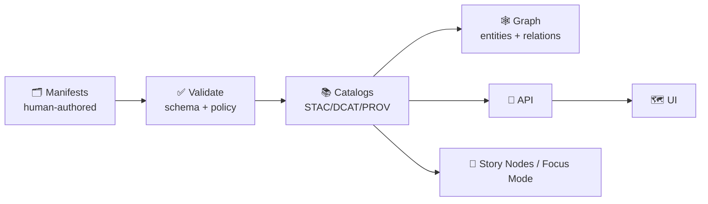

# 🗂️ `data/manifests/` — KFM Manifests, Contracts, & Provenance


> **Purpose:** this folder holds the **human-authored manifests** that define what KFM *has*, where it came from, how it was produced, and how it should be published—**before** it becomes a catalog entry, a graph node, an API response, or a Story Node.

---

## 🧭 Why manifests exist (the “no black boxes” rule)

KFM treats **metadata, citations, and provenance as first-class data**. A dataset isn’t “real” in KFM until it is:
1) **Declared** (manifest) ✅  
2) **Validated** (schemas + governance checks) ✅  
3) **Published** (STAC/DCAT/PROV outputs) ✅  
4) **Ingested** (graph + search + UI) ✅  



---

## 🧱 Folder layout (recommended)

> Keep **manifests** here. Put **generated catalogs** in their own output folder (e.g. `data/catalogs/…`).  
> If your repo currently uses `data/stac/`, `data/dcat/`, etc., treat those as **generated outputs**.

```text
data/
  manifests/
    README.md                         👈 you are here 🙂
    schemas/                          📐 JSON Schema / YAML schema docs
      dataset.manifest.schema.json
      pipeline.manifest.schema.json
      model.manifest.schema.json
      doc.manifest.schema.json
    datasets/                         🛰️ dataset declarations (inputs + derived)
      kfm.ks.surficial_geology.v1.manifest.yaml
      kfm.ks.transit.gtfsrt.v1.manifest.yaml
    pipelines/                        🧪 reproducible ETL + packaging
      kfm.pipeline.surficial_geology.v1.manifest.yaml
      kfm.pipeline.gtfsrt_watcher.v1.manifest.yaml
    models/                           🧠 simulation/ML model declarations
      kfm.model.drought_risk.v1.manifest.yaml
    docs/                             📚 governed “reference library” docs
      kfm.doc.nasa_simulation_guide.v1.manifest.yaml
      kfm.doc.postgresql_notes.v1.manifest.yaml
    policies/                         🛡️ FAIR/CARE & sensitivity rules (OPA/Rego, etc.)
      README.md
      fairness.rego
      care_labels.rego
    _generated/                       ⚙️ OPTIONAL local build artifacts (gitignored)
      index.json
      manifest_index.md
```

---

## 🏷️ Naming conventions (boringly consistent)

### ✅ IDs
Use stable, globally-unique IDs that can serve as:
- filenames
- STAC IDs / DCAT identifiers
- graph node IDs
- API keys

**Suggested pattern**
```
kfm.<region>.<theme>.<artifact>.<time_or_scope>.v<major>
```

Examples:
- `kfm.ks.landcover.2000_2020.v1`
- `kfm.ks.surficial_geology.statewide.v1`
- `kfm.ks.transit.gtfsrt.kdot.v1`

### ✅ Filenames
- Dataset manifest: `data/manifests/datasets/<id>.manifest.yaml`
- Pipeline manifest: `data/manifests/pipelines/<id>.manifest.yaml`
- Model manifest: `data/manifests/models/<id>.manifest.yaml`
- Doc/library manifest: `data/manifests/docs/<id>.manifest.yaml`

---

## 📦 Manifest types (what you can declare)

| Type | What it describes | Typical outputs |
|---|---|---|
| 🛰️ **Dataset manifest** | source + derived data products (rasters, vectors, tables, streams) | STAC Collection/Item + DCAT Dataset/Distributions + PROV lineage |
| 🧪 **Pipeline manifest** | reproducible steps (fetch → transform → package → publish) | PROV Activity chain; build logs; artifact hashes |
| 🧠 **Model manifest** | simulation/ML models (training, assumptions, evaluation) | model card + PROV + dataset links |
| 📚 **Doc manifest** | internal reference library PDFs/DOCX + governance metadata | searchable library index; citations into Story Nodes |

---

## ✅ Minimum required fields (baseline contract)

> If a manifest omits these, it should fail validation.

### 🛰️ Dataset manifest (YAML) — template

```yaml
# data/manifests/datasets/kfm.ks.example_dataset.v1.manifest.yaml
manifest_version: "1.0"
kind: "dataset"

id: "kfm.ks.example_dataset.1850_1900.v1"
title: "Example Dataset (1850–1900)"
summary: "One-liner describing what this dataset is."
description: |
  Longer description. Include context, methodology, and limitations.
  If a claim matters, cite it below.

themes: ["history", "boundaries", "environment"]
tags: ["kansas", "geospatial", "timeline"]

governance:
  fair_category: "FAIR+CARE"
  care_label: "Public"
  sensitivity: "public"          # public | restricted | sensitive
  pii: false
  indigenous_sensitivity: false  # if true, requires extra review gates

license:
  spdx: "CC-BY-4.0"
  attribution: "Source org / author(s)"
  constraints: ["attribution-required"]

extent:
  spatial:
    bbox_wgs84: [-102.051, 36.993, -94.588, 40.003]  # Kansas bbox (example)
    crs: "EPSG:4326"
  temporal:
    start: "1850-01-01"
    end: "1900-12-31"

sources:
  - name: "Primary Source Name"
    type: "web|archive|api|book|internal"
    url: "https://example.org/source"
    retrieved_at: "2026-01-11"
    license: "Public Domain"
    citation: "Author (Year). Title. Publisher/Archive."
    notes: "Any constraints or caveats."

assets:
  - role: "analysis"
    path: "data/processed/example_dataset.parquet"   # or DVC pointer
    format: "parquet"
    sha256: "<fill-me>"
  - role: "visualization"
    path: "data/tiles/example_dataset.pmtiles"
    format: "pmtiles"
    sha256: "<fill-me>"

processing:
  pipeline_id: "kfm.pipeline.example_dataset.v1"
  steps:
    - name: "fetch"
      tool: "python"
      entrypoint: "pipelines/example/fetch.py"
      params: { }
    - name: "transform"
      tool: "python"
      entrypoint: "pipelines/example/transform.py"
      params: { target_crs: "EPSG:4326" }
    - name: "package"
      tool: "python"
      entrypoint: "pipelines/example/package.py"
      params: { out_formats: ["parquet", "pmtiles"] }

publish:
  catalogs:
    stac: { collection_id: "kfm.ks.example_dataset.1850_1900.v1" }
    dcat: { dataset_id: "kfm.ks.example_dataset.1850_1900.v1" }
    prov: { bundle_id: "kfm.prov.kfm.ks.example_dataset.1850_1900.v1" }

contacts:
  maintainer: { name: "KFM Data Team", email: "maintainers@example.org" }
  steward: { name: "Domain Steward", email: "steward@example.org" }

quality:
  validation:
    schema: "data/manifests/schemas/dataset.manifest.schema.json"
  notes: "Known limitations, missing fields, accuracy caveats."
```

### 🧪 Pipeline manifest — template (sketch)

```yaml
manifest_version: "1.0"
kind: "pipeline"

id: "kfm.pipeline.example_dataset.v1"
title: "Example Dataset ETL + Packaging"
inputs: ["kfm.ks.example_source.v1"]
outputs: ["kfm.ks.example_dataset.1850_1900.v1"]

execution:
  runtime: "python"
  entrypoint: "pipelines/example/run.py"
  container: null            # or "ghcr.io/org/image:tag"
  reproducibility:
    pinned_deps: true
    deterministic: true

checks:
  - name: "manifest-validate"
  - name: "hash-assets"
  - name: "stac-build"
  - name: "dcat-build"
  - name: "prov-build"
```

### 🧠 Model manifest — template (sketch)

```yaml
manifest_version: "1.0"
kind: "model"

id: "kfm.model.drought_risk.v1"
title: "Drought Risk Model (Baseline)"
model_type: "statistical|ml|simulation"
training_data: ["kfm.ks.climate_timeseries.v1"]
evaluation:
  metrics: { rmse: 0.0, mae: 0.0 }
governance:
  advisory_only: true
  requires_human_review: true
```

### 📚 Doc/library manifest — template (for ALL project PDFs/DOCX)

```yaml
manifest_version: "1.0"
kind: "doc"

id: "kfm.doc.scientific_modeling_simulation_nasa_grade.v1"
title: "Scientific Modeling and Simulation: A Comprehensive NASA-Grade Guide"
format: "pdf"
path: "docs/library/Scientific Modeling and Simulation_ A Comprehensive NASA-Grade Guide.pdf"
topics: ["simulation", "verification", "validation", "reproducibility"]
license_notes: "Reference-only; follow original license terms."
```

---

## 🧪 Validation & build workflow (expected)

> **Goal:** a contributor can add a manifest and the system can **validate → generate catalogs → ingest**.

### Local checks (suggested commands)
```bash
# 1) validate manifests
python -m kfm.manifests.validate data/manifests

# 2) build catalogs (STAC/DCAT/PROV)
python -m kfm.manifests.build \
  --manifests data/manifests \
  --out data/catalogs

# 3) (optional) ingest graph / search indexes
python -m kfm.ingest.run --catalogs data/catalogs
```

### CI gates (minimum)
- ✅ schema validation (all manifests)
- ✅ license + attribution present (datasets/docs)
- ✅ sensitivity labels respected (FAIR/CARE rules)
- ✅ hashes present (or computed deterministically)
- ✅ catalogs generated without warnings
- ✅ “no narrative without evidence” (Story Nodes must reference catalog IDs)

---

## 🧩 How manifests connect to data storage (DVC-friendly)

- Manifests should reference **large artifacts** via *paths* that can be backed by **DVC** (or equivalent).
- Manifests must store **content hashes** for integrity (sha256 preferred).
- Derived outputs should be **dual-format** where it helps:
  - **analytics**: `GeoParquet/Parquet`
  - **UI**: `PMTiles` (vector tiles) or `COG` (raster)

---

## 🛡️ Governance notes (FAIR/CARE + sensitivity)

Use governance fields to make ethical constraints enforceable:
- `sensitivity`: `public | restricted | sensitive`
- `care_label`: `Public | Restricted | Indigenous | ...` (project-defined)
- `pii`: boolean
- `indigenous_sensitivity`: boolean

> [!WARNING]
> If `indigenous_sensitivity: true` or `pii: true`, your manifest **must** trigger review gates and may require aggregation/redaction before publication.

---

## 🧾 “Definition of Done” checklist ✅

Before a manifest can be merged:
- [ ] ID follows naming scheme and is stable
- [ ] License + attribution + constraints are explicit
- [ ] Sources include retrieval dates + citations
- [ ] Spatial + temporal extents are present (or “not applicable” is justified)
- [ ] Assets include hashes (or a deterministic way to compute them)
- [ ] Pipeline is declared (even if “manual”), with steps and tools
- [ ] STAC/DCAT/PROV outputs can be generated cleanly
- [ ] Governance labels are set correctly (FAIR/CARE, sensitivity)
- [ ] Nothing depends on unpublished/private artifacts without documentation

---

## 📚 Project files inventory (reference library + core docs)

This repo’s attached books/papers/docs are treated as **governed reference inputs**.  
If you add/remove files in the library, **also add/update** a `kind: "doc"` manifest in `data/manifests/docs/`.

<details>
<summary><strong>📦 Expand: Full inventory of current project files</strong></summary>

### 🧭 Core KFM Docs
- `Kansas Frontier Matrix (KFM) – Comprehensive Technical Documentation.docx`
- `🌟 Kansas Frontier Matrix – Latest Ideas & Future Proposals.docx`
- `Kansas-Frontier-Matrix_ Open-Source Geospatial Historical Mapping Hub Design.pdf`
- `MARKDOWN_GUIDE_v13.md.gdoc`
- `Comprehensive Markdown Guide_ Syntax, Extensions, and Best Practices.docx`

### 🛰️ Geospatial / Mapping
- `python-geospatial-analysis-cookbook.pdf`
- `making-maps-a-visual-guide-to-map-design-for-gis.pdf`
- `Mobile Mapping_ Space, Cartography and the Digital - 9789048535217.pdf`
- `webgl-programming-guide-interactive-3d-graphics-programming-with-webgl.pdf`

### 🗄️ Databases / Data Systems
- `PostgreSQL Notes for Professionals - PostgreSQLNotesForProfessionals.pdf`
- `Scalable Data Management for Future Hardware.pdf`
- `Data Spaces.pdf`

### 📊 Stats / Data Science
- `Understanding Statistics & Experimental Design.pdf`
- `regression-analysis-with-python.pdf`
- `Regression analysis using Python - slides-linear-regression.pdf`
- `graphical-data-analysis-with-r.pdf`
- `think-bayes-bayesian-statistics-in-python.pdf`

### 🧠 ML / Theory
- `Understanding Machine Learning: From Theory to Algorithms` (in programming books collection)
- `Spectral Geometry of Graphs.pdf`
- `Deep Learning for Coders with fastai and PyTorch - Deep.Learning.for.Coders.with.fastai.and.PyTorchpdf`

### 🧪 Simulation / Modeling
- `Scientific Modeling and Simulation_ A Comprehensive NASA-Grade Guide.pdf`
- `Generalized Topology Optimization for Structural Design.pdf`
- `Principles of Biological Autonomy - book_9780262381833.pdf`

### 🌍 Remote Sensing
- `Cloud-Based Remote Sensing with Google Earth Engine-Fundamentals and Applications.pdf`

### 🔐 Security (defensive use only)
- `ethical-hacking-and-countermeasures-secure-network-infrastructures.pdf`
- `Gray Hat Python - Python Programming for Hackers and Reverse Engineers (2009).pdf`

### 🧰 Software / Web / Engineering
- `responsive-web-design-with-html5-and-css3.pdf`
- `concurrent-real-time-and-distributed-programming-in-java-threads-rtsj-and-rmi.pdf`
- `compressed-image-file-formats-jpeg-png-gif-xbm-bmp.pdf`
- `Introduction to Digital Humanism.pdf`

### 📚 Programming Compendiums (multi-book packs)
- `A programming Books.pdf`
- `B-C programming Books.pdf`
- `D-E programming Books.pdf`
- `F-H programming Books.pdf`
- `I-L programming Books.pdf`
- `M-N programming Books.pdf`
- `O-R programming Books.pdf`
- `S-T programming Books.pdf`
- `U-X programming Books.pdf`

</details>

---

## 🧾 Next steps (quick wins) 🚀

1) Add schemas under `data/manifests/schemas/`  
2) Add one “golden path” dataset manifest + pipeline manifest  
3) Implement `kfm.manifests.validate` + `kfm.manifests.build` (or equivalent scripts)  
4) Have CI fail on: missing license, missing provenance, missing sensitivity tags  
5) Auto-generate a `manifest_index.md` (nice for humans) and `index.json` (nice for machines)

---

## 🔎 Glossary (micro)

- **Manifest**: a human-authored contract describing an artifact (dataset/pipeline/model/doc).
- **Catalogs**: machine-generated publishable metadata (STAC/DCAT/PROV).
- **Evidence artifact**: derived output treated as data+metadata, registered before use in narratives.
- **Provenance**: lineage of data and decisions (sources → transforms → outputs), ideally queryable.
