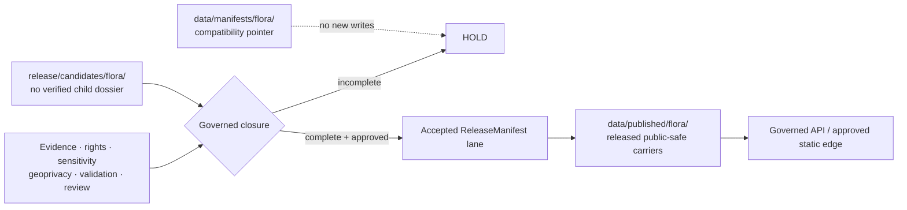

<!-- [KFM_META_BLOCK_V2]
doc_id: kfm://doc/data-manifests-flora-readme
title: data/manifests/flora/README.md — Flora Manifest Compatibility and Retirement Lane
version: v0.2
type: readme; data-compatibility-segment; flora-manifest-routing-guide; retirement-contract
status: repository-grounded draft; non-canonical; pointer-only; payload-inventory-bounded; release-path-conflicted; release-readiness-held; non-authoritative
owners: NEEDS VERIFICATION — Flora steward · Data steward · Release steward · Manifest steward · Rights reviewer · Sensitivity reviewer · Evidence steward · Migration steward · Docs steward
created: NEEDS VERIFICATION — placeholder existed before v0.1 expansion
updated: 2026-07-24
supersedes: v0.1 documentation at the same path; no manifest, payload, release, runtime, or publication state is superseded
prepared_under_prompt: KFM Markdown Modernization & GitHub Documentation Implementation Agent v4.0.0
policy_label: repository-facing; data; manifests; flora; compatibility; pointer-only; deny-new-writes; no-direct-public-path; sensitivity-aware; correction-aware; rollback-aware
current_path: data/manifests/flora/README.md
owning_root: data/
truth_posture: >
  CONFIRMED the tracked README and stable identity, non-canonical parent manifest lane,
  canonical data lifecycle map, release responsibility root, singular and plural release-manifest
  README surfaces, Flora release-manifest README, thin ReleaseManifest contract/schema posture,
  Flora candidate and published-lane READMEs, proposed Flora layer-manifest package, held Flora
  workflow, exact indexed search surfacing no child manifest record under this path, and default
  CODEOWNERS routing / PROPOSED retain-as-pointer, migrate-and-tombstone, or retire outcome;
  manifest-family routing; admission gates; consumer cutover; and migration packet / CONFLICTED
  singular release/manifest versus plural release/manifests convention, and topic-level
  data/manifests versus responsibility-rooted release and published lanes / UNKNOWN exhaustive
  recursive subtree, external stores, historical consumers, actual Flora manifest records,
  active runtime consumers, deployment, and public effects / NEEDS VERIFICATION accountable
  stewards, accepted manifest collection path, hardened ReleaseManifest schema, validator and
  fixture coverage, independent release review, payload absence, stale-reference detection,
  migration execution, deprecation entry, consumer cutover, and rollback drill
evidence_snapshot:
  repository: bartytime4life/Kansas-Frontier-Matrix
  repository_id: "1059091169"
  visibility: public
  base_ref: main
  base_commit: c4d7a1d7527687f1f11c5f95f47f52c159338af9
  prior_blob: 261357684c770292fb08d15c9b29fa5fcbd3b8bc
  directory_rules_blob: 2affb080e6f0043867c64c7f06c1ca52030fbd55
  data_root_readme_blob: fb7b0acfaea25b630a3042f24cb97558a996d05a
  data_manifests_parent_blob: c4cdbf0c0038f737447a7dc173f0fe49ef62490e
  release_root_readme_blob: 0752610b1df6d11143158f6f162f65ecd650e6a6
  release_manifest_singular_readme_blob: 6014cfc0f8394a44167f4226975b74f94f3b2a03
  release_manifests_plural_readme_blob: c699a527ff11bebad6a874ed1a37aa3a8213b86c
  release_manifests_flora_readme_blob: 2280c451e00c58eaefa2b23d3d141deb393a666c
  release_candidates_flora_readme_blob: 15a08f9fb2cdd33041d3a3f3e3c844f26a7a0998
  data_published_flora_readme_blob: 1368127a0ddc2ca2766eec23923c48de26a678e1
  release_manifest_contract_blob: 9ca1c9d4a5b247196aa84a31a158fe734c8a6720
  flora_layer_manifest_package_blob: 7e52980c9b31fe83cbf89bfc4bbe64e787e31060
  flora_verification_backlog_blob: fe8c81013840f376b47fb1cb93584d2e7c07600a
  domain_flora_workflow_blob: c792d126e5726d8895f56fd97800bee7fcba4a15
  codeowners_blob: dd2a84aa514d8ecd9208bc347f90f9a2ed37dd61
  exact_path_search_results: "README plus one human verification-backlog reference; no child manifest record surfaced"
  open_overlapping_pull_requests_found: "0"
  inventory_method: exact GitHub file reads, indexed code search, workflow inspection, and open-PR overlap search; no recursive Git tree, Git LFS inventory, object store, database, runtime, deployment, restricted system, or production environment was inspected
related:
  - ../README.md
  - ../../README.md
  - ../../../release/README.md
  - ../../../release/manifest/README.md
  - ../../../release/manifests/README.md
  - ../../../release/manifests/flora/README.md
  - ../../../release/candidates/flora/README.md
  - ../../published/flora/README.md
  - ../../catalog/domain/flora/README.md
  - ../../catalog/stac/flora/README.md
  - ../../catalog/dcat/flora/README.md
  - ../../catalog/prov/flora/README.md
  - ../../proofs/flora/README.md
  - ../../proofs/evidence_bundle/flora/README.md
  - ../../proofs/citation_validation/flora/README.md
  - ../../receipts/README.md
  - ../../registry/sources/flora/README.md
  - ../../rollback/flora/README.md
  - ../../../contracts/release/release_manifest.md
  - ../../../schemas/contracts/v1/release/release_manifest.schema.json
  - ../../../packages/domains/flora/layer_manifests/README.md
  - ../../../policy/domains/flora/README.md
  - ../../../policy/sensitivity/flora/README.md
  - ../../../docs/domains/flora/VERIFICATION_BACKLOG.md
  - ../../../docs/doctrine/directory-rules.md
  - ../../../docs/doctrine/lifecycle-law.md
  - ../../../docs/adr/ADR-0011-receipts-vs-proofs-vs-manifests-vs-catalog-separation.md
  - ../../../migrations/data/README.md
  - ../../../.github/workflows/domain-flora.yml
  - ../../../.github/CODEOWNERS
tags: [kfm, data, manifests, flora, compatibility, release-manifest, layer-manifest, artifact-sidecar, rare-plants, geoprivacy, migration, correction, rollback]
notes:
  - "v0.2 is a same-path, no-loss modernization of the existing Flora compatibility README."
  - "The first twelve H2 sections follow Directory Rules section 15 exactly."
  - "No new manifest record, payload, schema, validator, policy, release decision, public artifact, redirect, migration, or publication state is created."
  - "New trust-bearing writes under data/manifests/flora/ are denied pending an accepted placement and migration decision."
[/KFM_META_BLOCK_V2] -->

<a id="top"></a>

# `data/manifests/flora/` — Flora Manifest Compatibility and Retirement Lane

[](#status)
[](#authority-level)
[](#current-bounded-inventory)
[](#release-manifest-path-conflict)
[](#current-flora-release-posture)
[](#outputs)

> **One-line purpose.** Preserve a frozen, reversible Flora compatibility pointer while routing every release manifest, layer manifest, artifact sidecar, receipt, proof, catalog record, and public carrier to the responsibility root that owns it.

**Quick navigation:** [Purpose](#purpose) · [Authority](#authority-level) · [Status](#status) · [Belongs](#what-belongs-here) · [Exclusions](#what-does-not-belong-here) · [Inputs](#inputs) · [Outputs](#outputs) · [Validation](#validation) · [Review](#review-burden) · [Related](#related-folders) · [ADRs](#adrs) · [Last reviewed](#last-reviewed) · [Inventory](#current-bounded-inventory) · [Families](#manifest-family-separation) · [Flora posture](#current-flora-release-posture) · [Path conflict](#release-manifest-path-conflict) · [Routing](#flora-manifest-routing-matrix) · [Sensitivity](#flora-sensitivity-and-geoprivacy) · [Migration](#retain-migrate-or-retire) · [Cutover](#consumer-cutover-and-stale-reference-control) · [Correction](#correction-deprecation-and-rollback) · [Verification](#open-verification-register) · [No-loss](#v01-to-v02-no-loss-ledger) · [Summary](#status-summary)

> [!IMPORTANT]
> **A manifest name does not grant manifest authority.** A file called `manifest.json`, `release_manifest.md`, `layer_manifest.yaml`, or `public_index.json` is governed by its function, references, lifecycle state, and owning root—not by the word “manifest.”

> [!WARNING]
> **Do not add new trust-bearing Flora files here.** The current parent lane is non-canonical, the release-manifest collection path remains unresolved between singular and plural forms, and the Flora release workflow explicitly holds manifest assembly and publication readiness.

> [!CAUTION]
> **Flora manifests can expose sensitive knowledge indirectly.** Release records, artifact lists, filenames, counts, extents, layer identifiers, tile paths, screenshots, change summaries, or rollback references must not reveal exact or reverse-engineerable rare-plant locations, private-land joins, culturally sensitive plant knowledge, steward-only thresholds, or geoprivacy transform parameters.

---

<a id="purpose"></a>

## Purpose

`data/manifests/flora/` is a **compatibility and retirement lane** beneath the non-canonical [`data/manifests/`](../README.md) path.

It exists to:

- explain why the path must not become a second Flora release authority;
- preserve stable links while maintainers inspect historical use;
- route each manifest-like object to its correct responsibility root;
- record old-to-new mappings when a governed migration is approved;
- keep correction, deprecation, consumer cutover, and rollback visible;
- prevent topic-first placement from overriding lifecycle and release governance;
- preserve a fail-closed posture until the release-manifest collection convention is accepted and validated.

This lane does **not**:

- define `ReleaseManifest` semantics;
- choose the canonical singular or plural release-manifest collection;
- store release manifests, candidate dossiers, promotion decisions, rollback cards, correction notices, or signatures;
- build or validate Flora layer manifests;
- store receipts, proofs, catalog records, source registry records, or public artifacts;
- decide Flora rights, sensitivity, geoprivacy, stewardship, or public eligibility;
- run a release dry run, promote an artifact, deploy, or publish.

[Back to top](#top)

---

<a id="authority-level"></a>

## Authority level

**Compatibility pointer only; non-canonical, non-publisher, and subordinate to stronger responsibility roots.**

| Concern | Owning authority | Role of this lane |
|---|---|---|
| Flora object and claim meaning | Flora contracts and doctrine | Point only; never redefine |
| `ReleaseManifest` meaning | [`contracts/release/release_manifest.md`](../../../contracts/release/release_manifest.md) | Point only |
| `ReleaseManifest` machine shape | [`schemas/contracts/v1/release/release_manifest.schema.json`](../../../schemas/contracts/v1/release/release_manifest.schema.json) | Point only |
| Release candidates | [`release/candidates/flora/`](../../../release/candidates/flora/README.md) | Point only |
| Release manifest collection | `release/manifest/` or `release/manifests/`, pending accepted decision | Record conflict; do not select by implication |
| Flora release-manifest guidance | [`release/manifests/flora/`](../../../release/manifests/flora/README.md) | Point only; draft guidance is not release |
| Promotion, correction, withdrawal, rollback, signatures | [`release/`](../../../release/README.md) | Point only |
| Flora layer-manifest implementation | [`packages/domains/flora/layer_manifests/`](../../../packages/domains/flora/layer_manifests/README.md) if adopted | Point only; package is proposed |
| Published Flora carriers | [`data/published/flora/`](../../published/flora/README.md) | Point only; bytes remain release-gated |
| Catalog records | Flora catalog lanes | Point only |
| Receipts and proofs | `data/receipts/` and `data/proofs/` | Point only |
| Source identity, role, rights | [`data/registry/sources/flora/`](../../registry/sources/flora/README.md) | Point only |
| Sensitivity and geoprivacy | Flora policy and reviewed decisions | Point only |
| Migration mechanics | [`migrations/data/`](../../../migrations/data/README.md) | Point to approved migration packet |
| Public consumption | Governed APIs and released static edges | Deny direct reads |

A README, branch, commit, workflow, pull request, merge, valid thin schema instance, or file under a release-shaped path does not approve a Flora release.

[Back to top](#top)

---

<a id="status"></a>

## Status

| Finding | Truth status | Current bounded result |
|---|---:|---|
| README path and stable document ID | `CONFIRMED` | Existing same-path document |
| Parent `data/manifests/` posture | `CONFIRMED` | Non-canonical compatibility/retirement guidance |
| Canonical data lifecycle family | `CONFIRMED` | `data/manifests/` is not enumerated as a lifecycle phase |
| Release responsibility root | `CONFIRMED` | Release-governance records belong under `release/` |
| Singular manifest lane | `CONFIRMED README` | `release/manifest/README.md` exists; role remains draft |
| Plural manifest lane | `CONFIRMED README` | `release/manifests/README.md` exists; role remains draft |
| Flora plural manifest lane | `CONFIRMED README` | Draft guidance exists under `release/manifests/flora/` |
| Accepted canonical manifest collection | `CONFLICTED / NEEDS VERIFICATION` | Singular versus plural unresolved |
| `ReleaseManifest` semantic contract | `CONFIRMED / PROPOSED` | Contract exists and names target semantics |
| `ReleaseManifest` schema maturity | `CONFIRMED THIN` | Only `id` required; optional `spec_hash` and `version`; additional properties allowed |
| Flora candidate inventory | `CONFIRMED BOUNDED` | Parent README only; no verified child candidate dossier |
| Approved Flora release manifest | `NOT ESTABLISHED` | None verified |
| Published Flora artifact inventory | `UNKNOWN / UNVERIFIED` | README exists; emitted public carriers not established |
| Flora layer-manifest implementation | `PROPOSED` | Package README exists; implementation depth not established |
| Flora release workflow | `CONFIRMED HOLD` | No accepted dry-run command or candidate manifest contract |
| Child manifest records under this path | `NOT SURFACED BOUNDED` | Indexed search found this README, not a child manifest record |
| Recursive subtree and external stores | `UNKNOWN` | Not inspected |
| Direct public use | `DENY` | This lane is not a public surface |
| Retain, migrate, or retire decision | `OPEN` | No accepted decision or migration packet |

**Safe current action:** freeze new writes, preserve the README, inspect recursively and operationally, resolve the release-manifest collection convention, then execute only a reviewed migration or retirement plan.

[Back to top](#top)

---

<a id="what-belongs-here"></a>

## What belongs here

Accepted contents are intentionally narrow:

- this README;
- a short compatibility notice that names the accepted replacement path;
- bounded, non-sensitive inventory summaries;
- old-to-new path crosswalks that contain no restricted Flora details;
- migration identifiers and links to approved migration packets;
- deprecation, sunset, correction, and rollback references;
- consumer-cutover status;
- stale-reference check results;
- tombstone metadata when the directory must remain temporarily for compatibility;
- a generated, read-only redirect index only if an accepted migration design requires it.

Any index retained here must be non-authoritative, immutable or generated from the accepted authority, and incapable of being mistaken for a release manifest.

[Back to top](#top)

---

<a id="what-does-not-belong-here"></a>

## What does NOT belong here

| Material | Correct home |
|---|---|
| Flora `ReleaseManifest` records | Accepted collection under [`release/`](../../../release/README.md) |
| Flora release-candidate dossiers | [`release/candidates/flora/`](../../../release/candidates/flora/README.md) |
| Promotion decisions, release decisions, rollback cards, corrections, withdrawals, signatures | Shared `release/` lanes |
| Flora layer manifests or builder code | Accepted schema/contract and [`packages/domains/flora/layer_manifests/`](../../../packages/domains/flora/layer_manifests/README.md) |
| Artifact-local manifests and public indexes | Beside release-approved artifacts under [`data/published/flora/`](../../published/flora/README.md) |
| Original or processed Flora payloads | Correct RAW, WORK, QUARANTINE, or PROCESSED lanes |
| STAC, DCAT, PROV, or domain catalog records | Flora catalog lanes |
| EvidenceBundle, ProofPack, validation or citation support | Flora proof lanes |
| Transform, redaction, validation, AI, representation, or release receipts | [`data/receipts/`](../../receipts/README.md) |
| SourceDescriptor, source role, rights, cadence, or activation records | [`data/registry/sources/flora/`](../../registry/sources/flora/README.md) |
| Policy or steward decisions | Flora policy and reviewed decision surfaces |
| Exact or reverse-engineerable rare-plant locations | Restricted lifecycle stores only |
| Geoprivacy thresholds, transform secrets, private-land joins, culturally sensitive knowledge | Restricted systems and governed review records |
| Schemas, contracts, validators, tests, pipelines, packages, application code | Their owning roots |
| Credentials, private endpoints, keys, tokens, or restricted system references | Approved secret and restricted operational stores |
| Direct public API, map, download, search, graph, vector-index, or AI payload | Governed release and delivery surfaces |

[Back to top](#top)

---

<a id="inputs"></a>

## Inputs

This lane may consume **governance metadata only**:

- exact recursive subtree and Git-history inventories;
- repository-wide and deployed consumer searches;
- current release-manifest path decisions;
- manifest-family classifications;
- source, rights, sensitivity, geoprivacy, and cultural-review findings needed to plan a safe move;
- immutable old-path, new-path, digest, object-ID, and release-ID mappings;
- migration and rollback packet references;
- deprecation and sunset decisions;
- consumer cutover and stale-reference reports;
- correction and public-cache invalidation references when released material is affected.

Search absence is bounded evidence. It does not prove that an external object store, ignored workspace, historical branch, Git LFS object, runtime database, restricted system, or deployed client has no dependency.

[Back to top](#top)

---

<a id="outputs"></a>

## Outputs

Permitted outputs are limited to:

- a compatibility classification;
- a bounded inventory;
- a manifest-family routing result;
- a retain, migrate-and-tombstone, or retire recommendation;
- a path crosswalk;
- a migration/deprecation/rollback reference;
- a consumer-cutover status;
- a stale-reference report;
- a correction or cache-invalidation pointer;
- a final tombstone or removal decision.

This lane cannot output or authorize:

- a release manifest;
- a release candidate;
- a policy decision;
- proof closure;
- catalog closure;
- public-safe status;
- publication;
- deployment;
- a normal API or UI response;
- an AI answer.

No ordinary public client may read this lane directly.

[Back to top](#top)

---

<a id="validation"></a>

## Validation

### README validation

A documentation-only update must verify:

- one H1;
- the required first twelve H2 sections in exact Directory Rules order;
- stable document identity and same path;
- balanced fences;
- unique anchors and working internal links;
- repository-relative target existence for introduced links;
- explicit truth labels and inventory limits;
- no unsupported release, implementation, or publication claim;
- no new trust-bearing payload;
- visible rollback target and no-loss accounting.

### Compatibility and retirement validation

Before this lane can be migrated or retired, verify:

1. **Recursive inventory** — tracked files, subdirectories, Git LFS, ignored/generated conventions, and relevant history.
2. **Consumer inventory** — repository code, workflows, configs, docs, runtime readers/writers, deployed clients, object-store keys, and automation.
3. **Manifest classification** — release manifest, layer manifest, artifact sidecar, receipt, proof, catalog record, registry record, or invalid/misplaced payload.
4. **Authority resolution** — accepted manifest collection path and owning object family.
5. **Identity continuity** — stable IDs, digests, release refs, correction lineage, and supersession links.
6. **Rights and sensitivity** — no restricted Flora detail is copied into public review artifacts or logs.
7. **Schema and validation** — accepted schema, validator, fixtures, and failure modes for each migrated family.
8. **Migration plan** — deterministic old-to-new map, dry run, collision check, restart strategy, and immutable evidence.
9. **Consumer cutover** — all readers/writers changed and stale references blocked.
10. **Deprecation** — deprecation entry, sunset, tombstone behavior, and no-new-write enforcement.
11. **Recovery** — rollback or forward-fix procedure tested against a representative snapshot.
12. **Public correction** — correction, withdrawal, cache invalidation, or redirect handling where public artifacts were affected.

Missing evidence yields `HOLD`, `QUARANTINE`, `RESTRICT`, `DENY`, or `ABSTAIN`; it never yields assumed safety.

### Current CI boundary

The current Flora workflow is a **readiness-hold workflow**. It explicitly reports that executable Flora validation, proof production, release dry-run commands, candidate manifest contracts, manifest assembly, and publication are not established. A green held workflow is not release evidence.

[Back to top](#top)

---

<a id="review-burden"></a>

## Review burden

| Change | Minimum review burden |
|---|---|
| README wording or verified link correction | Data, Flora, release, and docs review |
| Inventory or compatibility-status update | Data, Flora, release, migration, and docs review |
| Manifest-family reclassification | Contract/schema, release, Flora, data, policy, evidence, and docs review |
| Payload discovery | Source, rights, sensitivity, security, evidence, release, and affected domain review |
| Migration | Migration, data, release, Flora, schema, validator, consumer, correction, and rollback review |
| Retirement | All migration reviewers plus consumer owners and public-delivery review |
| Canonical path decision | ADR-class architecture/release decision with migration and rollback |
| Public release impact | Independent release approval and applicable Flora sensitivity/stewardship review |

CODEOWNERS routes GitHub review. It is not a stewardship assignment, independent approval, sensitivity decision, release decision, or proof that review occurred.

[Back to top](#top)

---

<a id="related-folders"></a>

## Related folders

### Compatibility and lifecycle

- Parent compatibility lane: [`data/manifests/`](../README.md)
- Data root: [`data/`](../../README.md)
- Published Flora carriers: [`data/published/flora/`](../../published/flora/README.md)
- Flora rollback support: [`data/rollback/flora/`](../../rollback/flora/README.md)
- Migration mechanics: [`migrations/data/`](../../../migrations/data/README.md)

### Release governance

- Release root: [`release/`](../../../release/README.md)
- Singular manifest lane: [`release/manifest/`](../../../release/manifest/README.md)
- Plural manifest lane: [`release/manifests/`](../../../release/manifests/README.md)
- Flora manifest lane: [`release/manifests/flora/`](../../../release/manifests/flora/README.md)
- Flora candidate lane: [`release/candidates/flora/`](../../../release/candidates/flora/README.md)

### Flora trust support

- Domain catalog: [`data/catalog/domain/flora/`](../../catalog/domain/flora/README.md)
- STAC: [`data/catalog/stac/flora/`](../../catalog/stac/flora/README.md)
- DCAT: [`data/catalog/dcat/flora/`](../../catalog/dcat/flora/README.md)
- PROV: [`data/catalog/prov/flora/`](../../catalog/prov/flora/README.md)
- Flora proof support: [`data/proofs/flora/`](../../proofs/flora/README.md)
- EvidenceBundle support: [`data/proofs/evidence_bundle/flora/`](../../proofs/evidence_bundle/flora/README.md)
- Citation validation: [`data/proofs/citation_validation/flora/`](../../proofs/citation_validation/flora/README.md)
- Receipts: [`data/receipts/`](../../receipts/README.md)
- Source registry: [`data/registry/sources/flora/`](../../registry/sources/flora/README.md)
- Flora layer-manifest package: [`packages/domains/flora/layer_manifests/`](../../../packages/domains/flora/layer_manifests/README.md)

### Governing references

- `ReleaseManifest` contract: [`contracts/release/release_manifest.md`](../../../contracts/release/release_manifest.md)
- Paired schema: [`schemas/contracts/v1/release/release_manifest.schema.json`](../../../schemas/contracts/v1/release/release_manifest.schema.json)
- Flora domain policy: [`policy/domains/flora/`](../../../policy/domains/flora/README.md)
- Flora sensitivity policy: [`policy/sensitivity/flora/`](../../../policy/sensitivity/flora/README.md)
- Flora verification backlog: [`docs/domains/flora/VERIFICATION_BACKLOG.md`](../../../docs/domains/flora/VERIFICATION_BACKLOG.md)
- Flora readiness workflow: [`.github/workflows/domain-flora.yml`](../../../.github/workflows/domain-flora.yml)

[Back to top](#top)

---

<a id="adrs"></a>

## ADRs

### Directly relevant

- [`ADR-0011`](../../../docs/adr/ADR-0011-receipts-vs-proofs-vs-manifests-vs-catalog-separation.md) proposes explicit separation among receipts, proofs, catalogs, release decisions, and published artifacts.
- Directory Rules require responsibility-root placement and governed migration for structural moves.
- Lifecycle Law defines promotion as a governed state transition, not a file move.

### Current decision posture

ADR-0011 is **proposed**, not accepted. The repository also contains draft singular and plural release-manifest README surfaces. Therefore:

- this README does not declare either release-manifest collection canonical;
- this README does not authorize a move merely because one destination looks preferable;
- the safe current behavior is to deny new writes here and route proposed work to the release decision process;
- a coordinated path decision must precede migration or retirement.

A canonical collection-path decision should state:

- singular, plural, or explicitly distinct roles;
- object and filename identity rules;
- schema and validator bindings;
- compatibility and tombstone behavior;
- migration and consumer-cutover plan;
- deprecation and sunset rules;
- correction and rollback effects;
- public-client and static-delivery implications.

[Back to top](#top)

---

<a id="last-reviewed"></a>

## Last reviewed

**2026-07-24**, against repository evidence pinned in the metadata block.

Re-review immediately when:

- a child file appears under `data/manifests/flora/`;
- a real Flora release manifest or candidate dossier is added;
- the singular/plural release-manifest decision changes;
- the `ReleaseManifest` schema is hardened;
- a Flora manifest validator, fixture suite, or dry-run command is introduced;
- a Flora layer-manifest implementation appears;
- a public Flora artifact is emitted;
- a consumer still references this path;
- a migration, deprecation, correction, or rollback is proposed;
- six months elapse.

[Back to top](#top)

---

<a id="current-bounded-inventory"></a>

## Current bounded inventory

| Surface | Evidence | Bounded conclusion |
|---|---|---|
| `data/manifests/flora/README.md` | Exact file read | Documentation exists |
| Child manifest record under this path | Indexed search | None surfaced |
| Human reference to this path | Flora verification backlog | Reference exists; not a payload |
| Recursive subtree | Not inspected | `UNKNOWN` |
| Git LFS / ignored / generated content | Not inspected | `UNKNOWN` |
| External object store or restricted system | Not inspected | `UNKNOWN` |
| Historical branches and tags | Not exhaustively inspected | `UNKNOWN` |
| Runtime reader or writer | Not established | `UNKNOWN` |
| Release-manifest record under release lane | No direct record surfaced in bounded search | Not established |
| Flora candidate dossier | Candidate README says none verified | Not established |
| Published Flora artifact bytes | Published README exists; bytes not verified | `UNKNOWN` |
| Release dry-run command | Workflow hold | Not established |
| Manifest assembly | Workflow hold | Not established |
| Public effect | No admissible evidence | None claimed |

This inventory is enough to freeze new writes and document the boundary. It is not enough to delete the path.

[Back to top](#top)

---

<a id="manifest-family-separation"></a>

## Manifest family separation

The word **manifest** covers several different responsibilities. They must remain distinct.

| Family | Core question | Correct home | Authority limit |
|---|---|---|---|
| `ReleaseManifest` | Which governed artifact set was released, under which decisions and support? | Accepted collection under `release/` | Does not store payloads or prove evidence by itself |
| Release-candidate dossier | Is a candidate complete enough for review? | `release/candidates/flora/` | Candidate is not release |
| Promotion decision | Was a lifecycle transition approved, denied, or held? | Shared release/promotion lane | Does not bind released contents by itself |
| Flora layer manifest | Can a layer be resolved and rendered safely with evidence and policy refs? | Accepted contract/schema plus implementation package and released sidecar | Does not approve release |
| Artifact-local sidecar | What does this released file contain and how is it verified? | Beside artifact under `data/published/flora/` | Carrier metadata; not release authority |
| Catalog manifest/index | Which catalog records or assets are discoverable? | `data/catalog/.../flora/` | Discovery projection; not publication |
| Receipt | What process ran and what happened? | `data/receipts/` | Process memory; not proof |
| Proof/closure record | What support makes a claim or release inspectable? | `data/proofs/` | Support; not release decision |
| Source package manifest | What source package was retrieved or admitted? | RAW/registry/source-admission lanes | Source context; not release |
| Build/QA artifact manifest | What did a build or test emit? | Build/QA artifact lane | Non-trust staging unless governed separately |

### Anti-collapse rules

- A layer manifest cannot substitute for a `ReleaseManifest`.
- A `ReleaseManifest` cannot substitute for an `EvidenceBundle`.
- A receipt cannot substitute for proof.
- A catalog index cannot substitute for release approval.
- A file beside a public artifact cannot rewrite release state.
- A manifest cannot upgrade an `observation`, `modeled`, `candidate`, `regulatory`, or `aggregate` source role into authority.
- A manifest cannot make exact sensitive geometry safe through omission of a sensitivity field.
- A manifest cannot turn generated text, a screenshot, a map style, a vector index, or an AI summary into evidence.

[Back to top](#top)

---

<a id="current-flora-release-posture"></a>

## Current Flora release posture

Current repository evidence supports a conservative conclusion:

1. The Flora release-candidate lane has no verified child candidate dossier.
2. No approved Flora manifest or released Flora publication was established.
3. The published Flora README defines a release-gated carrier lane but does not prove emitted artifacts.
4. The Flora layer-manifest package is a proposed boundary, not verified implementation.
5. The Flora workflow explicitly holds validation, proof generation, and release dry-run readiness.
6. The shared `ReleaseManifest` schema is thin and permissive.
7. Rights, sensitivity, geoprivacy, stewardship, independent approval, correction, and rollback remain separate gates.



The diagram is a governance flow, not proof that the approved path is operational.

### Required Flora release gates

A future Flora manifest must not be treated as release-ready until it binds or resolves:

- stable release and manifest identity;
- immutable candidate artifact refs and digests;
- source identity, role, rights, cadence, and citation;
- taxonomic identity and uncertainty;
- EvidenceBundle and citation-validation support;
- catalog and triplet closure where applicable;
- validation and integrity reports;
- sensitivity and geoprivacy policy outcomes;
- required steward, rights-holder, or cultural review;
- public geometry and attribute exposure class;
- promotion and release decisions;
- correction, withdrawal, supersession, and rollback targets;
- consumer audience and permitted delivery surfaces;
- stale-state and cache-invalidation behavior;
- signatures or attestations where required.

[Back to top](#top)

---

<a id="release-manifest-path-conflict"></a>

## Release-manifest path conflict

The repository currently documents both:

```text
release/manifest/
release/manifests/
```

The plural lane also contains `release/manifests/flora/`.

These facts establish **path presence**, not accepted canonical authority. Current README guidance proposes a possible distinction—singular workflow notes versus plural collections—but maintainers have not accepted and enforced that distinction.

### Risks of acting before resolution

- duplicate manifest records;
- divergent mutable release state;
- incompatible IDs or filename conventions;
- one consumer reading singular while another writes plural;
- conflicting correction and rollback lineage;
- public clients binding to different release anchors;
- schemas or validators targeting only one lane;
- migration that loses Git history, digests, signatures, or citations;
- stale aliases that appear current;
- domain sublanes evolving independently from shared release governance.

### Safe decision options

| Option | Description | Minimum requirement |
|---|---|---|
| **A. Singular canonical** | `release/manifest/` owns records; plural becomes compatibility/index | Accepted decision, migration, consumer cutover, deprecation |
| **B. Plural canonical** | `release/manifests/` owns collections and domain records | Accepted decision, migration, schema/validator binding |
| **C. Distinct roles** | Singular owns one named current record; plural owns immutable history/collections | Precise non-overlapping contracts and tests |
| **D. External registry** | Files become projections of a governed release registry | Accepted architecture, stable API, export and rollback |
| **E. Hold** | Keep both draft and forbid production records | Current safest posture until decision closes |

This README selects **E. Hold** for the compatibility path. It does not choose the release collection.

[Back to top](#top)

---

<a id="flora-manifest-routing-matrix"></a>

## Flora manifest routing matrix

| Observed item | Classification question | Target |
|---|---|---|
| Flora release manifest | Does it bind a governed released artifact set? | Accepted `release/manifest(s)/` collection |
| Flora candidate checklist | Is it pre-release review material? | `release/candidates/flora/` |
| Flora promotion decision | Does it approve/deny a lifecycle transition? | Shared promotion-decision lane |
| Flora rollback or correction record | Does it change public release lineage? | Shared release rollback/correction lanes |
| Flora layer manifest | Does it describe a governed map/API layer? | Accepted layer-manifest contract/schema and released sidecar |
| Published artifact descriptor | Does it describe one released carrier? | Beside carrier in `data/published/flora/` |
| STAC/DCAT/PROV/domain record | Is it discovery/interchange metadata? | Matching Flora catalog lane |
| Process receipt | Does it record execution? | `data/receipts/` |
| Evidence or validation closure | Does it support a claim/release? | Flora proof lanes |
| Source package manifest | Does it describe source capture/admission? | RAW or source registry lanes |
| Migration crosswalk | Does it map old paths to new paths? | `migrations/data/` with pointer here |
| Unknown manifest-like file | Is meaning or ownership unresolved? | `HOLD` or `QUARANTINE` pending classification |
| Sensitive manifest content | Could it reveal restricted Flora knowledge? | Restricted review system; never public-repo migration log |

### Classification sequence

```text
identify object family
  -> identify authority root
  -> resolve source, rights, sensitivity, evidence, and review
  -> verify schema and validator
  -> preserve IDs, digests, and lineage
  -> migrate with consumer cutover and rollback
  -> deprecate or retire old path
```

A filename-only migration is prohibited.

[Back to top](#top)

---

<a id="flora-sensitivity-and-geoprivacy"></a>

## Flora sensitivity and geoprivacy

Flora manifest work is security- and policy-relevant even when the file contains no raw coordinates.

### Sensitive information that may leak through manifests

- exact point, polygon, tile, or bounding-box references;
- filenames or release scopes naming a rare taxon and small place;
- feature counts that narrow a population;
- tile zoom and extent combinations that reveal hidden precision;
- source record identifiers that resolve to exact specimens or occurrences;
- private-land or landowner associations;
- stewardship or collection-access restrictions;
- culturally sensitive plant uses, harvest locations, or knowledge holders;
- geoprivacy algorithm thresholds, seeds, buffers, or reverse-engineering hints;
- rollback references that expose the restricted predecessor;
- screenshots, previews, sample rows, error logs, or diffs containing hidden detail;
- public cache keys or object-store paths that bypass current policy.

### Required handling

- apply the most restrictive applicable posture;
- expose only reviewed public-safe identifiers and scopes;
- use generalized or redacted public refs;
- keep transform parameters and restricted originals outside public repository paths;
- require geoprivacy/redaction receipt refs without embedding sensitive inputs;
- bind public carriers to policy and review decisions;
- ensure correction and rollback do not restore restricted detail publicly;
- invalidate public caches and derived indexes when exposure posture changes;
- abstain or deny when safe representation cannot be proven.

### Manifest review question

> Could this manifest, its path, its metadata, or any linked public artifact help a reasonable user infer restricted Flora information?

If the answer is yes or unknown, the item must remain held, restricted, generalized, redacted, or denied.

[Back to top](#top)

---

<a id="retain-migrate-or-retire"></a>

## Retain, migrate, or retire

### Option 1 — retain as a frozen pointer

Use when:

- historical links still require the directory;
- no trust-bearing payload remains;
- automated checks deny new writes;
- the README clearly routes all object families;
- a sunset date or review trigger exists.

Required state:

```text
README only
+ optional generated tombstone index
+ no mutable manifest records
+ stale-reference monitoring
+ no public client
```

### Option 2 — migrate and tombstone

Use when real content or consumers exist.

Required packet:

- migration ID and owner;
- exact base commit and old-path inventory;
- object-family classification per file;
- old path, new path, stable object ID, digest, release/candidate refs;
- schema and validator binding;
- rights and sensitivity review;
- dry-run and collision report;
- consumer reader/writer inventory;
- correction and public-cache effect;
- deprecation entry and sunset;
- cutover checks;
- rollback or forward-fix procedure;
- final verification receipt.

After migration, retain a minimal tombstone until the compatibility window closes.

### Option 3 — retire

Use only after:

- recursive and operational inventories find no retained payload or consumer;
- history and external references are assessed;
- the accepted path decision is closed;
- stale-reference tests are active;
- removal is paired with rollback/recovery evidence;
- public documentation and release references are updated.

### Option 4 — admit as canonical

Not recommended from current evidence. It requires an accepted ADR that changes Directory Rules, explains why a topic-level manifest family belongs under `data/`, defines non-overlap with `release/` and `data/published/`, and includes migration, validation, security, correction, and rollback.

[Back to top](#top)

---

<a id="consumer-cutover-and-stale-reference-control"></a>

## Consumer cutover and stale-reference control

A safe migration is incomplete until every reader and writer uses the accepted authority.

### Consumers to inspect

- release assembly tools and workflows;
- Flora pipelines, packages, and validators;
- catalog and proof builders;
- governed API and static-delivery resolvers;
- MapLibre layer registry and layer-manifest builders;
- report, story, export, search, graph, and vector-index builders;
- correction, withdrawal, and rollback tooling;
- cache invalidators and object-store aliases;
- docs, examples, tests, fixtures, configs, and runbooks;
- external automation and restricted operational systems.

### Required stale-reference behavior

- old-path writes fail;
- old-path reads emit an explicit compatibility result or fail closed;
- no silent fallback to a second mutable record;
- redirected content is digest-bound to the accepted source;
- correction and withdrawal state propagates;
- caches and generated indexes invalidate;
- public clients cannot bypass release resolution;
- CI detects new references after sunset;
- the tombstone cannot be interpreted as a current release manifest.

### Suggested finite outcomes

| Outcome | Meaning |
|---|---|
| `RESOLVED` | Consumer uses accepted manifest authority |
| `COMPATIBILITY_REDIRECT` | Temporary, explicit, digest-bound redirect |
| `HOLD` | Migration or identity unresolved |
| `DENY` | Unsafe, sensitive, or unauthorized read/write |
| `ERROR` | Resolver or integrity failure |
| `RETIRED` | Old path intentionally unavailable with successor reference |

These are proposed migration outcomes, not a replacement for release or policy decision vocabularies.

[Back to top](#top)

---

<a id="correction-deprecation-and-rollback"></a>

## Correction, deprecation, and rollback

### Correction

Open a correction when:

- a manifest-like object was classified incorrectly;
- a public artifact points to this non-canonical path;
- a release ID or digest changed silently;
- sensitive Flora information was exposed;
- a consumer used a compatibility pointer as release authority;
- a layer manifest and release manifest diverged;
- a stale manifest remained active after withdrawal or supersession.

Correction must preserve prior meaning, affected releases, public effect, successor, cache invalidation, and review state.

### Deprecation

A deprecation record should include:

- old path;
- object families historically found there;
- accepted successor path;
- status and sunset date;
- allowed temporary read behavior;
- denied write behavior;
- affected consumers;
- migration and verification refs;
- correction and rollback refs;
- owner and last review.

### Rollback

Rollback for this compatibility migration means restoring safe routing and referential integrity—not reviving a flawed parallel authority.

A rollback or forward-fix must define:

- triggering conditions;
- affected manifests and consumers;
- safe prior refs;
- digest and signature verification;
- public cache and alias behavior;
- correction/withdrawal notices;
- restricted-data safeguards;
- audit evidence;
- termination criteria.

Never roll back to public exposure of exact sensitive Flora information.

[Back to top](#top)

---

<a id="open-verification-register"></a>

## Open verification register

| ID | Item | Status | Evidence needed |
|---|---|---:|---|
| FMF-V-001 | Recursively inventory `data/manifests/flora/` | `NEEDS VERIFICATION` | Git tree, LFS, generated/ignored conventions, history |
| FMF-V-002 | Inspect external and restricted storage references | `UNKNOWN` | Object-store, database, deployment, restricted-system inventory |
| FMF-V-003 | Resolve singular versus plural release-manifest path | `CONFLICTED` | Accepted ADR/decision and migration plan |
| FMF-V-004 | Verify actual Flora manifest records | `NEEDS VERIFICATION` | Immutable record inventory under accepted release lane |
| FMF-V-005 | Verify Flora candidate dossiers | `NEEDS VERIFICATION` | Child candidate dossier and reviewed support packet |
| FMF-V-006 | Harden `ReleaseManifest` schema | `NEEDS VERIFICATION` | Versioned schema, compatibility analysis, fixtures |
| FMF-V-007 | Implement and wire manifest validator | `NEEDS VERIFICATION` | Accepted command, tests, CI, failure fixtures |
| FMF-V-008 | Verify Flora layer-manifest implementation | `NEEDS VERIFICATION` | Package source, contract/schema, tests, receipts |
| FMF-V-009 | Verify public Flora carriers | `NEEDS VERIFICATION` | Artifact bytes, digests, release refs, hosting evidence |
| FMF-V-010 | Verify rights and source-role closure | `NEEDS VERIFICATION` | SourceDescriptor, rights review, citation and cadence |
| FMF-V-011 | Verify sensitivity and geoprivacy closure | `NEEDS VERIFICATION` | Policy decisions, review records, transform receipts |
| FMF-V-012 | Verify evidence and catalog closure | `NEEDS VERIFICATION` | EvidenceBundle, citation validation, STAC/DCAT/PROV agreement |
| FMF-V-013 | Verify independent release review | `NEEDS VERIFICATION` | Review records and separation-of-duties enforcement |
| FMF-V-014 | Inventory readers and writers | `NEEDS VERIFICATION` | Repository, workflow, runtime, deployment, external consumers |
| FMF-V-015 | Create migration and deprecation packet | `PROPOSED` | `migrations/data/` manifest and deprecation entry |
| FMF-V-016 | Exercise rollback or forward-fix | `NEEDS VERIFICATION` | Dry run, observed recovery evidence |
| FMF-V-017 | Enforce no-new-write rule | `NEEDS VERIFICATION` | CI/path validator or policy guard |
| FMF-V-018 | Close stale references and public caches | `NEEDS VERIFICATION` | Cutover report and invalidation evidence |
| FMF-V-019 | Decide tombstone retention window | `PROPOSED` | Consumer and history analysis |
| FMF-V-020 | Confirm final removal is safe | `UNKNOWN` | All prior items closed |

[Back to top](#top)

---

<a id="v01-to-v02-no-loss-ledger"></a>

## v0.1 to v0.2 no-loss ledger

| v0.1 substance | v0.2 location |
|---|---|
| Non-canonical compatibility posture | Purpose, Authority level, Status |
| Flora release manifests belong under release governance | Authority level, Routing matrix |
| Public artifacts belong under published data | Exclusions, Related folders |
| Receipt/proof/catalog/publication separation | Manifest family separation |
| Migration-only accepted contents | What belongs here, Retain/migrate/retire |
| No trust-bearing records here | What does NOT belong here |
| Migration routing cases | Flora manifest routing matrix |
| No publication shortcut | Outputs, Current Flora release posture |
| Promotion is a state transition | Purpose, Flora release posture |
| Evidence-ledger caveats | Status, Inventory, Open verification |
| Validation checklist | Validation, Open verification |
| Rollback requirement | Correction/deprecation/rollback |
| Prior document identity | Preserved metadata `doc_id` and path |
| Prior file recoverability | Prior blob pinned in metadata and PR rollback |

No v0.1 authority claim is upgraded. The update narrows ambiguous claims, adds current evidence, and makes unresolved conflicts explicit.

[Back to top](#top)

---

<a id="status-summary"></a>

## Status summary

| Question | Current answer |
|---|---|
| Is `data/manifests/flora/` canonical? | **No; compatibility-only** |
| May new Flora manifest records be written here? | **No; deny pending decision** |
| Is the canonical release-manifest collection resolved? | **No; singular/plural conflict remains** |
| Does a Flora release-manifest README exist under `release/`? | **Yes; draft guidance only** |
| Is a real Flora candidate dossier verified? | **No** |
| Is an approved Flora release manifest verified? | **No** |
| Is the shared schema production-complete? | **No; thin and permissive** |
| Is Flora release automation operational? | **No; workflow explicitly holds readiness** |
| Are published Flora artifacts verified? | **Not by this inspection** |
| Can public clients read this lane? | **No** |
| What is the next safe action? | **Inventory, resolve manifest path authority, then migrate or retire with cutover and rollback** |

> **Operating law:** Until the authority and migration decisions close, preserve the pointer, deny new writes, keep sensitive Flora information out, and let the owning release, policy, evidence, catalog, migration, and published-data surfaces carry the truth.

<p align="right"><a href="#top">Back to top</a></p>
