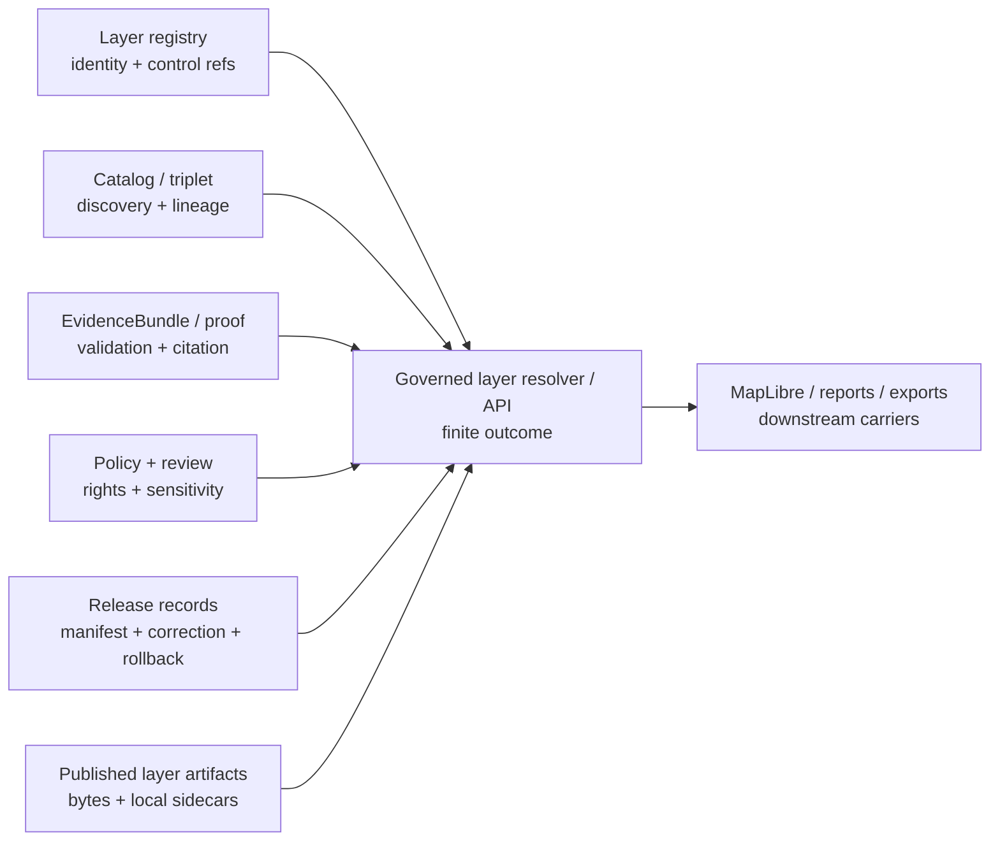

<!-- [KFM_META_BLOCK_V2]
doc_id: kfm://doc/data-manifests-layers-readme
title: data/manifests/layers/README.md — Layer Manifest Compatibility and Retirement Lane
version: v0.2
type: readme; data-compatibility-segment; layer-manifest-routing-guide; retirement-contract
status: repository-grounded draft; non-canonical; pointer-only; payload-inventory-unverified; release-path-conflicted; schema-home-conflicted; non-authoritative
owners: NEEDS VERIFICATION — Data steward · Layer steward · Release steward · Manifest steward · Catalog steward · Registry steward · Rights reviewer · Sensitivity reviewer · Evidence steward · MapLibre/UI steward · Migration steward · Docs steward
created: NEEDS VERIFICATION — greenfield stub existed before v0.1 expansion
updated: 2026-07-24
supersedes: v0.1 documentation at the same path; no manifest, payload, registry, catalog, release, runtime, or publication state is superseded
prepared_under_prompt: KFM Markdown Modernization & GitHub Documentation Implementation Agent v4.0.0
policy_label: repository-facing; data; manifests; layers; compatibility; pointer-only; deny-new-writes; no-direct-public-path; sensitivity-aware; correction-aware; rollback-aware
current_path: data/manifests/layers/README.md
owning_root: data/
truth_posture: >
  CONFIRMED the tracked README and stable identity, non-canonical parent manifest lane,
  canonical data lifecycle map, release responsibility root, singular and plural release-manifest
  README surfaces, draft layer release-manifest README, canonical data LayerManifest contract,
  release bridge contract, thin data LayerManifest schema, published layer lane, layer registry
  lane, ADR-0011 separation posture, Directory Rules, and default CODEOWNERS routing /
  PROPOSED retain-as-pointer, migrate-and-tombstone, or retire outcome; manifest-family routing;
  admission gates; consumer cutover; stale-reference detection; and migration packet /
  CONFLICTED singular release/manifest versus plural release/manifests convention, current
  schemas/contracts/v1/data/layer_manifest.schema.json versus proposed layers schema home, and
  topic-level data/manifests versus responsibility-rooted release, registry, catalog, and
  published lanes / UNKNOWN exhaustive recursive subtree, Git LFS or external stores, historical
  consumers, actual manifest instances, runtime resolvers, deployment, branch protection, and
  public effects / NEEDS VERIFICATION accountable stewards, accepted release-manifest collection
  path, accepted LayerManifest schema home, hardened schemas, validators, fixtures, independent
  release review, payload absence, migration execution, deprecation entry, consumer cutover,
  cache invalidation, and rollback drill
evidence_snapshot:
  repository: bartytime4life/Kansas-Frontier-Matrix
  repository_id: "1059091169"
  visibility: public
  base_ref: main
  base_commit: 9ffa0f56197ea1dad3290626b4c166e2bebc3bff
  prior_blob: 1966170430a4740a2ba7135274d4b67e27fd7ddd
  directory_rules_blob: 2affb080e6f0043867c64c7f06c1ca52030fbd55
  data_root_readme_blob: fb7b0acfaea25b630a3042f24cb97558a996d05a
  data_manifests_parent_blob: c4cdbf0c0038f737447a7dc173f0fe49ef62490e
  release_root_readme_blob: 0752610b1df6d11143158f6f162f65ecd650e6a6
  release_manifest_singular_readme_blob: 6014cfc0f8394a44167f4226975b74f94f3b2a03
  release_manifests_plural_readme_blob: c699a527ff11bebad6a874ed1a37aa3a8213b86c
  release_manifests_layers_readme_blob: fa23d0ae7f6141f329f1e30c0c83710bcb23ba6d
  data_published_layers_readme_blob: dec9fe683d49be194c46a46cd50bee9a2675cb28
  data_registry_layers_readme_blob: 90d4ebe2fb39d5f0a03f0b205e99ca727e2536c3
  data_layer_manifest_contract_blob: d2a575cd9f247cc2649c6e7f0dafd3319e03a25d
  release_layer_manifest_bridge_blob: adfad2688b84fac945de610f1afa84139fd42b8f
  data_layer_manifest_schema_blob: 2ed967b05a7dacdf0990366820e018dba1adc79b
  adr_0011_blob: 40b0f47b87d584040803ed76aa6b31f5204b7fca
  codeowners_blob: dd2a84aa514d8ecd9208bc347f90f9a2ed37dd61
  open_overlapping_pull_requests_found: "0"
  inventory_method: exact GitHub file reads, bounded indexed search, contract/schema inspection, and open-PR overlap search; no recursive Git tree, Git LFS inventory, object store, database, runtime, deployment, CDN, or production environment was inspected
related:
  - ../README.md
  - ../../README.md
  - ../../published/layers/README.md
  - ../../registry/layers/README.md
  - ../../catalog/README.md
  - ../../proofs/README.md
  - ../../receipts/README.md
  - ../../rollback/README.md
  - ../../../release/README.md
  - ../../../release/manifest/README.md
  - ../../../release/manifests/README.md
  - ../../../release/manifests/layers/README.md
  - ../../../contracts/data/layer_manifest.md
  - ../../../contracts/data/layer_descriptor.md
  - ../../../contracts/data/layer_catalog_item.md
  - ../../../contracts/release/layer_manifest.md
  - ../../../contracts/release/release_manifest.md
  - ../../../schemas/contracts/v1/data/layer_manifest.schema.json
  - ../../../data/registry/layers/README.md
  - ../../../data/published/layers/README.md
  - ../../../docs/doctrine/directory-rules.md
  - ../../../docs/doctrine/lifecycle-law.md
  - ../../../docs/doctrine/trust-membrane.md
  - ../../../docs/adr/ADR-0011-receipts-vs-proofs-vs-manifests-vs-catalog-separation.md
  - ../../../migrations/data/README.md
  - ../../../.github/CODEOWNERS
tags: [kfm, data, manifests, layers, compatibility, layer-manifest, release-manifest, layer-descriptor, registry, catalog, maplibre, migration, correction, rollback]
notes:
  - "v0.2 is a same-path, no-loss modernization of the existing Layers compatibility README."
  - "The first twelve H2 sections follow Directory Rules section 15 exactly."
  - "No manifest instance, layer payload, schema, validator, registry record, catalog record, release decision, public artifact, redirect, migration, deployment, or publication state is created."
  - "New trust-bearing writes under data/manifests/layers/ are denied pending accepted placement, schema, consumer, migration, and rollback decisions."
[/KFM_META_BLOCK_V2] -->

<a id="top"></a>

# `data/manifests/layers/` — Layer Manifest Compatibility and Retirement Lane

[](#status)
[](#authority-level)
[](#release-manifest-path-conflict)
[](#layermanifest-schema-home-conflict)
[](#what-does-not-belong-here)
[](#outputs)

> **One-line purpose.** Preserve a frozen, reversible layer-manifest compatibility pointer while routing release records, canonical `LayerManifest` objects, layer registry records, catalog projections, artifact sidecars, receipts, proofs, and public layer bytes to the responsibility root that owns each object.

**Quick navigation:** [Purpose](#purpose) · [Authority](#authority-level) · [Status](#status) · [Belongs](#what-belongs-here) · [Exclusions](#what-does-not-belong-here) · [Inputs](#inputs) · [Outputs](#outputs) · [Validation](#validation) · [Review](#review-burden) · [Related](#related-folders) · [ADRs](#adrs) · [Last reviewed](#last-reviewed) · [Inventory](#current-bounded-inventory) · [Object families](#manifest-and-layer-object-families) · [Release path](#release-manifest-path-conflict) · [Schema path](#layermanifest-schema-home-conflict) · [Routing](#object-routing-matrix) · [Safety](#sensitive-layer-and-inference-controls) · [Consumers](#consumer-and-public-surface-boundary) · [Decision](#retain-migrate-or-retire) · [Migration](#minimum-migration-and-cutover-packet) · [Correction](#correction-deprecation-and-rollback) · [Verification](#open-verification-register) · [No-loss](#v01-to-v02-no-loss-ledger) · [Summary](#status-summary)

> [!IMPORTANT]
> **The word “manifest” does not identify one KFM object family.** A `ReleaseManifest`, canonical `LayerManifest`, release-layer bridge, layer registry record, STAC/DCAT/PROV catalog record, artifact-local sidecar, build receipt, proof pack, MapLibre style, and published tile archive have different authority, lifecycle, and review obligations.

> [!WARNING]
> **This path is not a release or layer authority.** Do not add JSON, YAML, Markdown, PMTiles, COG, GeoParquet, TileJSON, style, sprite, glyph, screenshot, receipt, proof, registry, catalog, or release records here. New trust-bearing writes are denied until an accepted migration or compatibility decision says otherwise.

> [!CAUTION]
> **Styling is not access control.** Hiding a layer by zoom, paint opacity, filters, client-side flags, source-layer names, or UI permissions does not safely protect sensitive ecology, archaeology, infrastructure, living-person, land/title, cultural, or otherwise restricted information.

---

<a id="purpose"></a>

## Purpose

`data/manifests/layers/` is a **compatibility and retirement segment** beneath the canonical [`data/`](../../README.md) responsibility root. It exists to keep an old or proposed path inspectable while preventing it from evolving into a parallel home for layer identity, layer semantics, release records, catalog state, proof, public artifacts, or renderer behavior.

The lane may:

- explain why the path exists;
- record bounded inventory results without claiming exhaustive absence;
- map any discovered legacy object to its verified authority home;
- link an approved migration, deprecation, correction, cutover, or rollback record;
- preserve a tombstone or redirect note during a controlled compatibility window.

The lane must not:

- define the semantic meaning of `LayerManifest`;
- define or host a JSON Schema;
- decide whether a layer is released;
- store a release manifest or promotion decision;
- store layer bytes or artifact sidecars;
- act as a layer registry or catalog;
- render a layer or configure MapLibre;
- provide a direct public or internal API;
- make a claim true, cited, policy-admissible, reviewed, public-safe, released, or published.

Placement follows **responsibility and lifecycle**, not the presence of the word `manifest`.

[Back to top](#top)

---

<a id="authority-level"></a>

## Authority level

**Compatibility-only, pointer-only, and subordinate to the owning authorities it references.**

| Concern | Controlling authority | Role of this lane |
|---|---|---|
| Layer object meaning | [`contracts/data/layer_manifest.md`](../../../contracts/data/layer_manifest.md) | Point to the contract; never restate or fork it |
| Renderer-facing layer description | [`contracts/data/layer_descriptor.md`](../../../contracts/data/layer_descriptor.md) | Point to the descriptor contract |
| Catalog/list metadata | [`contracts/data/layer_catalog_item.md`](../../../contracts/data/layer_catalog_item.md) and catalog profiles | Point to catalog authority |
| Machine shape | [`schemas/`](../../../schemas/README.md) and accepted schema-home decision | Never host schema copies |
| Layer identity and routing state | [`data/registry/layers/`](../../registry/layers/README.md) | Never become a registry |
| Release package meaning | [`contracts/release/release_manifest.md`](../../../contracts/release/release_manifest.md) | Never redefine `ReleaseManifest` |
| Release-layer relationship | [`contracts/release/layer_manifest.md`](../../../contracts/release/layer_manifest.md) | Point to the proposed bridge; do not create bridge instances here |
| Release decisions and records | [`release/`](../../../release/README.md) | Never approve or store releases |
| Published public-safe layer carriers | [`data/published/layers/`](../../published/layers/README.md) | Never store or serve layer bytes |
| Catalog projections | [`data/catalog/`](../../catalog/README.md) | Never duplicate STAC, DCAT, PROV, or domain catalog state |
| Process memory | [`data/receipts/`](../../receipts/README.md) | Never store receipts |
| Evidence and proof support | [`data/proofs/`](../../proofs/README.md) | Never store EvidenceBundles or proofs |
| Policy and sensitivity | [`policy/`](../../../policy/README.md) | Never decide access, rendering, redaction, or release |
| Migration mechanics | [`migrations/data/`](../../../migrations/data/README.md) | Link approved movement and cutover records |
| Public delivery | Governed APIs and released artifacts | Deny direct reads from this lane |

A path, README, badge, schema-valid object, generated sidecar, pull request, merge, workflow result, or public URL is bounded evidence only. None of these grants semantic, policy, evidence, release, or publication authority.

[Back to top](#top)

---

<a id="status"></a>

## Status

| Finding | Truth status | Current bounded result |
|---|---:|---|
| Target README and stable identity | `CONFIRMED` | Same-path v0.1 document exists |
| Parent `data/manifests/` posture | `CONFIRMED / NON-CANONICAL` | Compatibility and retirement guidance only |
| Canonical `data/` lifecycle tree | `CONFIRMED` | Does not enumerate `data/manifests/` as a canonical phase or trust family |
| Release collection path | `CONFLICTED` | Both singular `release/manifest/` and plural `release/manifests/` READMEs exist as draft guidance |
| Layer release sublane | `CONFIRMED README / DRAFT` | `release/manifests/layers/README.md` exists; no operational release authority follows from its presence |
| Canonical layer semantic contract | `CONFIRMED / DRAFT` | `contracts/data/layer_manifest.md` is the inspected semantic authority |
| Release layer bridge | `CONFIRMED / PROPOSED` | `contracts/release/layer_manifest.md` points to the data contract and adds release relationship semantics |
| Current paired schema | `CONFIRMED / THIN / PROPOSED` | `schemas/contracts/v1/data/layer_manifest.schema.json` requires only `id` and allows additional properties |
| Layer schema home | `CONFLICTED` | Current `data/` schema path conflicts with a proposed `layers/` schema home named by UI layering doctrine |
| Published layer parent | `CONFIRMED README` | `data/published/layers/` documents released public-safe carriers; payload presence and complete release binding remain unverified |
| Layer registry parent | `CONFIRMED README` | `data/registry/layers/` documents control records; concrete records and runtime resolution remain unverified |
| Child content in this compatibility lane | `UNKNOWN` | No recursive tree, LFS, ignored-file, external-store, or historical-branch inventory was performed |
| Active readers or writers | `UNKNOWN` | No exhaustive code, runtime, workflow, CDN, or deployment inventory was performed |
| Retain, migrate, or retire decision | `OPEN` | No accepted decision or completed migration packet was verified |
| Public effect | `DENIED BY BOUNDARY` | This lane is not a public source |

**Safe current action:** freeze new trust-bearing writes, keep this README, complete recursive and operational inventory, resolve object classification and path conflicts, then choose a reviewed retain, migrate, or retire outcome.

[Back to top](#top)

---

<a id="what-belongs-here"></a>

## What belongs here

Accepted material is intentionally narrow:

- this `README.md`;
- a bounded inventory note that states its method and limitations;
- an old-to-new path crosswalk whose targets have been verified;
- a migration, deprecation, consumer-cutover, correction, or rollback pointer;
- a generated compatibility redirect that cannot diverge and contains no trust-bearing fields;
- a tombstone during an approved transition window;
- a sunset notice with a named replacement, effective date, and rollback target.

Any additional file must answer all of these questions:

1. Why is a pointer required instead of updating the canonical consumer?
2. Which canonical object and path does it reference?
3. Is it generated or hand-edited?
4. How is divergence prevented?
5. Which validator checks it?
6. Which consumer still depends on it?
7. What is the sunset condition?
8. How is rollback performed?

If those answers are unavailable, the file does not belong here.

[Back to top](#top)

---

<a id="what-does-not-belong-here"></a>

## What does NOT belong here

| Material or behavior | Correct home or disposition |
|---|---|
| `ReleaseManifest` instance | Accepted collection under [`release/`](../../../release/README.md), after singular/plural decision |
| Promotion, correction, withdrawal, supersession, rollback, or signature record | `release/` family lanes |
| Canonical `LayerManifest` instance | Accepted lifecycle/release artifact home governed by the canonical contract; not this compatibility lane |
| Release-layer bridge instance | Accepted release record home after bridge/schema decision |
| Layer registry record | [`data/registry/layers/`](../../registry/layers/README.md) |
| STAC, DCAT, PROV, domain catalog, catalog matrix, or discovery index | [`data/catalog/`](../../catalog/README.md) and accepted catalog lanes |
| PMTiles, MVT, GeoJSON, GeoParquet, COG, raster, vector tile, TileJSON, sprite, glyph, style bundle, or scene | [`data/published/layers/`](../../published/layers/README.md) only after release, or an upstream lifecycle lane |
| Artifact-local `layer.manifest.json`, field allowlist, digest, caveat summary, or release pointer | Beside the released artifact under `data/published/layers/...` when approved |
| Layer contract, descriptor contract, or catalog-item contract | [`contracts/data/`](../../../contracts/data/) |
| JSON Schema | [`schemas/`](../../../schemas/README.md) at the accepted schema home |
| Policy, access, redaction, generalization, representation, or sensitivity rule | [`policy/`](../../../policy/README.md) |
| Source or dataset registry record | `data/registry/sources/` or `data/registry/datasets/` |
| Receipt | [`data/receipts/`](../../receipts/README.md) |
| EvidenceBundle, ProofPack, validation report, citation proof, or signature proof | [`data/proofs/`](../../proofs/README.md) or accepted signing root |
| Raw, work, quarantine, or processed layer candidate | Corresponding canonical lifecycle phase |
| App, API, UI, MapLibre adapter, resolver, validator, pipeline, fixture, test, or workflow code | Its implementation or test responsibility root |
| Credential, token, private endpoint, restricted identifier, or exact sensitive geometry | Approved secret/restricted system; never this public repository path |
| Direct public route or static hosting origin | Governed delivery edge only |

A filename ending in `manifest.json` does not change these boundaries.

[Back to top](#top)

---

<a id="inputs"></a>

## Inputs

Only governance and migration evidence may feed this lane:

- exact recursive repository inventory, including symlinks and Git LFS pointers;
- history inspection for removed or moved paths;
- code, config, workflow, documentation, generated-output, and deployment reference searches;
- object classification against contracts and schemas;
- content digests and stable identifiers;
- rights, sensitivity, representation, and audience review;
- public-route, CDN, cache, tile-server, and application-consumer inventory;
- accepted path, schema-home, and release-collection decisions;
- migration manifests, deprecation records, correction records, and rollback plans;
- cutover, stale-reference, cache-invalidation, and recovery evidence.

An indexed search result is useful but not exhaustive. Search absence must never be presented as proof that no historical, external, ignored, generated, or runtime consumer exists.

[Back to top](#top)

---

<a id="outputs"></a>

## Outputs

This lane may emit only governance-level outcomes:

- `RETAIN_POINTER`;
- `MIGRATE_AND_TOMBSTONE`;
- `RETIRE_AFTER_VERIFICATION`;
- `HOLD_FOR_INVENTORY`;
- `HOLD_FOR_PATH_DECISION`;
- `HOLD_FOR_SCHEMA_DECISION`;
- `HOLD_FOR_CONSUMER_CUTOVER`;
- `HOLD_FOR_SENSITIVITY_REVIEW`;
- `ROLLBACK_TO_PRIOR_MAPPING`.

A valid outcome includes the evidence snapshot, replacement path, affected consumers, migration or deprecation reference, sunset condition, correction path, and rollback target.

This lane cannot emit:

- a layer or release manifest;
- a release or promotion decision;
- a policy decision;
- evidence closure;
- a registry or catalog record;
- a layer artifact;
- renderer configuration;
- public API or UI state;
- publication authority.

Direct public reads from this lane are denied.

[Back to top](#top)

---

<a id="validation"></a>

## Validation

### README validation

The README must preserve:

- exactly one H1;
- the first twelve H2 sections in Directory Rules order;
- stable `doc_id`;
- explicit truth labels and evidence limitations;
- valid internal anchors and repository-relative links;
- visible compatibility, non-public, correction, and rollback posture;
- no unsupported implementation, release, or publication claim.

### Compatibility-lane validation

Before adding, retaining, migrating, or removing any non-README file:

1. recursively inventory the subtree;
2. identify file type, digest, identity, history, writer, reader, and audience;
3. classify each object by responsibility;
4. resolve the release collection path for release records;
5. resolve the `LayerManifest` schema home for layer objects;
6. validate against the accepted contract and schema;
7. verify source, evidence, policy, rights, sensitivity, review, and release references;
8. verify public-safe transformation and representation;
9. search all repository and deployed consumers;
10. define migration, cutover, stale-reference, cache-invalidation, and recovery checks;
11. create deprecation and correction records where public behavior or identity changes;
12. run a rollback drill before deleting the compatibility path.

### Failure posture

| Failure | Required disposition |
|---|---|
| Unknown object family | `HOLD_FOR_CLASSIFICATION` |
| Unresolved schema or release path | `HOLD_FOR_PATH_DECISION` |
| Missing evidence or release references | `ABSTAIN` or `HOLD` |
| Unknown rights | `DENY`, `RESTRICT`, or `QUARANTINE` |
| Sensitive or reverse-engineerable detail | `DENY`, `GENERALIZE`, `REDACT`, or `RESTRICT` |
| Consumer cannot be migrated safely | Retain pointer and open bounded migration work |
| Stale references remain | Block retirement |
| Rollback cannot be demonstrated | Block cutover or deletion |

A green Markdown build proves document syntax only.

[Back to top](#top)

---

<a id="review-burden"></a>

## Review burden

| Change | Minimum review burden |
|---|---|
| README clarification with no authority change | Data and docs review |
| Compatibility mapping | Data, layer, contract/schema, and consumer-owner review |
| Release-manifest relocation | Release, layer, policy, evidence, and migration review |
| Canonical `LayerManifest` relocation | Contract, schema, data, registry, catalog, validator, and consumer review |
| Published artifact-sidecar relocation | Publication, integrity, policy, sensitivity, CDN/cache, and app review |
| Sensitive-domain layer mapping | Affected domain, rights, sensitivity, geoprivacy/generalization, security, and public-surface review |
| Path retirement | All affected owners plus rollback verification |
| New canonical layer or manifest root | Accepted ADR and Directory Rules update |

[`.github/CODEOWNERS`](../../../.github/CODEOWNERS) supplies GitHub review routing. It is not an accountable stewardship assignment, independent approval, policy decision, release approval, or proof that review occurred.

Sensitive layers may require separate domain reviewers even when the compatibility file itself contains no sensitive payload.

[Back to top](#top)

---

<a id="related-folders"></a>

## Related folders

### Compatibility and lifecycle

- [`data/manifests/`](../README.md) — non-canonical parent compatibility lane.
- [`data/`](../../README.md) — canonical lifecycle and data trust-artifact root.
- [`data/published/layers/`](../../published/layers/README.md) — released public-safe layer carriers and approved local sidecars.
- [`data/registry/layers/`](../../registry/layers/README.md) — layer identity and control records.
- [`data/catalog/`](../../catalog/README.md) — catalog and provenance projections.
- [`data/receipts/`](../../receipts/README.md) — process memory.
- [`data/proofs/`](../../proofs/README.md) — evidence and proof support.
- [`data/rollback/`](../../rollback/README.md) — data-plane rollback support.

### Release governance

- [`release/`](../../../release/README.md) — release decisions and records.
- [`release/manifest/`](../../../release/manifest/README.md) — draft singular release-manifest lane.
- [`release/manifests/`](../../../release/manifests/README.md) — draft plural release-manifest collection.
- [`release/manifests/layers/`](../../../release/manifests/layers/README.md) — draft layer release-manifest guidance.

### Meaning and shape

- [`contracts/data/layer_manifest.md`](../../../contracts/data/layer_manifest.md) — canonical inspected `LayerManifest` semantic contract.
- [`contracts/data/layer_descriptor.md`](../../../contracts/data/layer_descriptor.md) — renderer-facing descriptor semantics.
- [`contracts/data/layer_catalog_item.md`](../../../contracts/data/layer_catalog_item.md) — catalog/list item semantics.
- [`contracts/release/layer_manifest.md`](../../../contracts/release/layer_manifest.md) — proposed release bridge.
- [`contracts/release/release_manifest.md`](../../../contracts/release/release_manifest.md) — `ReleaseManifest` semantics.
- [`schemas/contracts/v1/data/layer_manifest.schema.json`](../../../schemas/contracts/v1/data/layer_manifest.schema.json) — current thin, proposed schema.

### Governance and change control

- [`Directory Rules`](../../../docs/doctrine/directory-rules.md)
- [`Lifecycle Law`](../../../docs/doctrine/lifecycle-law.md)
- [`Trust Membrane`](../../../docs/doctrine/trust-membrane.md)
- [`ADR-0011`](../../../docs/adr/ADR-0011-receipts-vs-proofs-vs-manifests-vs-catalog-separation.md)
- [`migrations/data/`](../../../migrations/data/README.md)

[Back to top](#top)

---

<a id="adrs"></a>

## ADRs

### Currently relevant

| Decision surface | Current status | Effect on this lane |
|---|---:|---|
| ADR-0011 — receipts, proofs, catalogs, manifests, and publication stay distinct | `PROPOSED` | Supports separation; does not itself complete migration |
| Singular versus plural release-manifest collection | `UNRESOLVED` | Blocks naming `release/manifests/` or `release/manifest/` canonical by README implication |
| `LayerManifest` schema home | `CONFLICTED` | Blocks migration of canonical instances until one home or compatibility policy is accepted |
| Public clients never read internal stores | Doctrine/ADR surface | Direct reads from this lane remain denied |
| New canonical root or responsibility change | ADR-required | This README cannot authorize it |

No inspected accepted ADR makes `data/manifests/layers/` canonical. No README edit, merge, or release-shaped filename can substitute for an accepted decision.

[Back to top](#top)

---

<a id="last-reviewed"></a>

## Last reviewed

**2026-07-24**, against `main@9ffa0f56197ea1dad3290626b4c166e2bebc3bff`.

Re-review immediately when:

- a non-README file appears in this subtree;
- a writer or reader references this path;
- a real release or layer manifest instance is admitted;
- the singular/plural release collection is decided;
- the `LayerManifest` schema home is decided;
- the layer schema is hardened;
- a validator, registry resolver, catalog builder, release assembler, layer resolver, MapLibre consumer, CDN path, or static edge is activated;
- a migration, deprecation, correction, or rollback is proposed;
- six months elapse.

[Back to top](#top)

---

<a id="current-bounded-inventory"></a>

## Current bounded inventory

| Surface | Evidence reviewed | Safe conclusion |
|---|---|---|
| This README | Exact GitHub file read | Compatibility documentation exists |
| Parent manifest README | Exact read | Parent is non-canonical |
| Release manifest parents | Exact reads | Singular and plural draft surfaces both exist |
| Layer release-manifest README | Exact read | Draft guidance exists; operational records not established |
| Canonical layer contract | Exact read | Semantic contract exists and is draft |
| Release bridge contract | Exact read | Proposed release relationship contract exists |
| Layer schema | Exact read | Thin proposed schema requires `id`; full semantics not enforced |
| Published layers parent | Exact read | Published carrier lane is documented; payload/release completeness not established |
| Layer registry parent | Exact read | Registry lane is documented; concrete records and runtime resolution not established |
| This subtree beyond README | Not recursively inspected | `UNKNOWN` |
| Git LFS, ignored files, external stores | Not inspected | `UNKNOWN` |
| Historical consumers and generated outputs | Not exhaustively inspected | `UNKNOWN` |
| Runtime, CDN, tileserver, API, UI consumers | Not inspected | `UNKNOWN` |

The bounded inventory supports a **freeze and inspect** posture, not deletion.

[Back to top](#top)

---

<a id="manifest-and-layer-object-families"></a>

## Manifest and layer object families

| Object family | Core question | Authority home | Not equivalent to |
|---|---|---|---|
| `ReleaseManifest` | Which approved artifact set constitutes this release? | `release/` plus release contract/schema | `LayerManifest`, payload, proof |
| Canonical `LayerManifest` | What governed version of a layer exists, with lineage, integrity, policy, time, and release context? | `contracts/data/` + accepted schema + governed instance store | Release approval, renderer config |
| Release-layer bridge | How does one canonical layer manifest participate in one release? | Proposed release bridge contract and accepted release record home | Canonical layer manifest |
| `LayerDescriptor` | What renderer-facing description may a governed client consume? | Data contracts and governed projection | Layer truth, policy |
| `LayerCatalogItem` | How is a layer represented for discovery/listing? | Catalog contract and catalog projections | Layer manifest, release |
| Layer registry record | Which stable layer identity and control state exists? | `data/registry/layers/` | Catalog, payload, proof |
| STAC/DCAT/PROV/domain record | How is the layer/dataset discoverable and traceable? | `data/catalog/` | Release approval |
| Artifact-local sidecar | Which released bytes, fields, caveats, digests, and pointers accompany this artifact? | Beside released artifact under `data/published/layers/...` | Release manifest |
| Receipt | What process ran? | `data/receipts/` | Proof or release |
| Proof/EvidenceBundle | What support closes consequential claims and integrity checks? | `data/proofs/` | Catalog or release decision |
| MapLibre style/source/layer config | How should the renderer present admitted released data? | Governed UI/runtime projection | Evidence, sensitivity control, release |
| Tile/archive/raster/vector artifact | Which released bytes are delivered? | `data/published/layers/` or accepted published format lane | Manifest or truth |

Object identity must survive migration. Do not rename one family into another merely because both use “manifest.”

[Back to top](#top)

---

<a id="release-manifest-path-conflict"></a>

## Release manifest path conflict

The repository currently documents both:

```text
release/manifest/
release/manifests/
```

Both are draft surfaces. The plural parent also contains a draft `layers/` child. Current documentation proposes possible distinctions but does not establish an accepted canonical collection.

Until resolved:

- do not claim either path is canonical;
- do not create mirror instances in both paths;
- do not migrate records from this compatibility lane directly into either path without a reviewed decision;
- do not let consumers hard-code one path as a permanent API;
- prefer stable manifest IDs and governed resolution over filesystem inference;
- record every old-to-new mapping and rollback target;
- require stale-reference and consumer-cutover checks.

A release collection decision should define:

1. canonical collection path;
2. singular/plural semantics;
3. instance media type and filename convention;
4. identifier and digest rules;
5. schema and validator;
6. append-only, correction, supersession, and withdrawal behavior;
7. access and signing posture;
8. client resolution contract;
9. migration and compatibility window;
10. rollback.

[Back to top](#top)

---

<a id="layermanifest-schema-home-conflict"></a>

## `LayerManifest` schema-home conflict

The inspected canonical semantic contract is:

```text
contracts/data/layer_manifest.md
```

The current paired schema is:

```text
schemas/contracts/v1/data/layer_manifest.schema.json
```

The contract records a conflicting proposed path:

```text
schemas/contracts/v1/layers/layer_manifest.schema.json
```

The current schema is explicitly thin:

- object root;
- `id` required;
- optional `version`;
- optional `spec_hash`;
- `additionalProperties: true`.

Therefore:

- schema validity does not prove complete layer governance;
- this compatibility lane must not host a third schema copy;
- no migration should transform instances merely to fit an unaccepted path;
- validators and fixtures must follow the accepted home;
- a compatibility `$id`/resolver plan may be required if existing instances or consumers bind to the old path;
- schema-path migration must preserve contract pairing, fixtures, validators, tests, registry references, release references, and rollback.

The accepted decision should state whether the existing `data/` schema remains canonical, moves to `layers/`, or is retained as a generated compatibility alias.

[Back to top](#top)

---

<a id="object-routing-matrix"></a>

## Object routing matrix

| Discovered object | Verification questions | Destination |
|---|---|---|
| Release package manifest | Does it bind an approved release and artifact set? Which collection path is accepted? | Accepted `release/manifest(s)/` collection |
| Canonical layer manifest | Does it conform to accepted semantic contract/schema and preserve lifecycle/policy/evidence state? | Accepted governed instance store; not chosen by this README |
| Release-layer bridge | Does it point to canonical layer and release manifests with digests and rollback? | Accepted release record lane |
| Layer registry record | Is it compact control state with stable identity and outward refs? | `data/registry/layers/<domain>/` |
| Layer catalog item | Is it discovery/list metadata? | `data/catalog/` profile lane |
| STAC/DCAT/PROV record | Is it a catalog/provenance projection? | Matching catalog lane |
| Layer artifact sidecar | Is it bound to released bytes and safe for the public audience? | Beside artifact under `data/published/layers/...` |
| PMTiles/COG/GeoParquet/GeoJSON/MVT/TileJSON | Is it released public-safe output? | Published format/layer lane; otherwise upstream or quarantine |
| Style/sprite/glyph config | Is it a released renderer dependency rather than truth/policy? | Released artifact bundle or governed UI package |
| Receipt | Does it describe a run or transform? | `data/receipts/` |
| Proof or EvidenceBundle | Does it support claims, validation, integrity, or review closure? | `data/proofs/` |
| Source or dataset descriptor | Does it identify admitted source/dataset state? | Appropriate registry family |
| Unknown JSON/YAML/Markdown | Can object family, owner, schema, writer, and reader be resolved? | `HOLD_FOR_CLASSIFICATION`; do not move |

When status is unclear, preserve bytes and identity, restrict access, and hold the migration.

[Back to top](#top)

---

<a id="sensitive-layer-and-inference-controls"></a>

## Sensitive layer and inference controls

Layer metadata can expose restricted information even when the main geometry is generalized or absent.

### Leakage surfaces

- filenames and directory names;
- layer IDs and source-layer names;
- bounding boxes and center points;
- min/max zoom and tile coverage;
- feature counts and sparse statistics;
- tile index presence;
- update cadence and event timing;
- query filters and legend categories;
- style expressions and hidden attributes;
- field allowlists;
- thumbnails, screenshots, and previews;
- error messages and validation logs;
- public cache keys and CDN paths;
- rollback targets that reveal a restricted predecessor;
- cross-layer joins that narrow location or identity;
- metadata differences between public and restricted versions.

### Fail-closed rules

| Risk | Required posture |
|---|---|
| Rare species or sensitive habitat | Generalize, withhold, restrict, or deny; do not reveal reverse-engineering thresholds |
| Archaeology, burial, sacred, or protected cultural sites | Restrict and require authorized review; no exact public geometry |
| Critical infrastructure | Suppress operationally sensitive topology, dependencies, and access detail |
| Living-person, DNA, parcel, title, or private-land linkage | Deny or tightly restrict unless consent, law, purpose, and review support the use |
| Rights-uncertain or source-restricted data | Quarantine or deny public use |
| Model-derived or synthetic layer | Label knowledge character and uncertainty; never present as observation or authority |
| Cross-layer inference | Apply the most restrictive resulting posture, not merely each input posture |
| Styling-only suppression | Reject as security control |
| Unresolved EvidenceRef | Abstain from consequential claim or public feature interaction |
| Missing correction/rollback | Block release or cutover |

Sensitive values and transformation parameters do not belong in this README, public fixtures, public manifests, screenshots, or CI logs.

[Back to top](#top)

---

<a id="consumer-and-public-surface-boundary"></a>

## Consumer and public-surface boundary

Public and semi-public consumers must not infer trust from a filesystem path.

### Allowed consumption pattern



### Forbidden pattern

```text
data/manifests/layers/**
    -> direct app, UI, tile server, CDN, public API, export, AI, or map read
```

A governed consumer should resolve stable identifiers and verify:

- release state;
- content digest;
- accepted schema version;
- source roles;
- evidence and citations;
- policy and audience;
- rights and attribution;
- sensitivity and representation obligations;
- valid time and freshness;
- correction, supersession, withdrawal, and rollback state.

If a historical consumer still reads this path, keep the compatibility pointer and migrate the consumer before retirement. Do not convert a path alias into permanent public architecture.

[Back to top](#top)

---

<a id="retain-migrate-or-retire"></a>

## Retain, migrate, or retire

| Option | When appropriate | Required safeguards |
|---|---|---|
| **A — Retain README-only pointer** | Historical references exist or inventory is incomplete | No payloads; outward links only; divergence check; review cadence |
| **B — Migrate and tombstone** | Real objects are found and each has a verified destination | Per-object mapping, digest preservation, consumer cutover, deprecation, stale-reference checks, rollback |
| **C — Retire path** | Recursive and operational inventory proves no required contents or consumers | Accepted decision, history preserved, references clean, recovery verified |
| **D — Generated compatibility projection** | A temporary downstream consumer cannot migrate immediately | One-way generation from canonical source, read-only, digest parity, sunset date, no hand edits |
| **E — Canonicalize this path** | Not supported by current evidence | Requires accepted ADR, Directory Rules change, authority analysis, migration, tests, and rollback |

**Proposed smallest safe outcome:** retain this README as a frozen pointer until both the release-manifest collection and `LayerManifest` schema-home conflicts are resolved and recursive/consumer inventories close.

[Back to top](#top)

---

<a id="minimum-migration-and-cutover-packet"></a>

## Minimum migration and cutover packet

A migration involving this lane should include:

### Identity and inventory

- migration ID;
- exact source commit and target commit;
- recursive file list;
- type, size, media type, and digest;
- Git history and LFS status;
- object family and stable ID;
- authoritative contract and schema;
- writer, reader, audience, and access class.

### Mapping

- old path;
- new path;
- reason based on responsibility;
- whether bytes move, transform, regenerate, or become a pointer;
- contract/schema version before and after;
- old and new digests;
- compatibility behavior and sunset.

### Governance

- source, rights, sensitivity, and representation review;
- EvidenceRef/EvidenceBundle and proof refs;
- catalog and registry refs;
- policy and review refs;
- release, correction, supersession, withdrawal, and rollback refs;
- accountable owner and independent reviewer where required.

### Validation

- contract and schema validation;
- fixture and validator results;
- referential-integrity checks;
- duplicate-authority and stale-reference scans;
- application, API, UI, tile-server, CDN, workflow, and documentation consumer checks;
- public-output comparison and sensitive-data leakage checks;
- cache invalidation and alias behavior;
- rollback dry run.

### Cutover

- write freeze;
- canonical write activation;
- compatibility projection activation, if needed;
- reader migration;
- telemetry window;
- correction communication;
- deprecation date;
- removal gate.

A file move without this evidence is not a governed migration or promotion.

[Back to top](#top)

---

<a id="correction-deprecation-and-rollback"></a>

## Correction, deprecation, and rollback

### Correction

When a compatibility mapping or public layer reference is wrong:

1. freeze affected writes and public resolution;
2. identify affected manifests, layers, catalogs, registries, proofs, releases, clients, and caches;
3. preserve the incorrect mapping for audit;
4. issue a new correction or supersession record;
5. update canonical objects and generated pointers;
6. invalidate stale artifacts and caches;
7. verify public and restricted projections;
8. record completion evidence.

### Deprecation

A deprecation record should carry:

- deprecated path and object family;
- canonical replacement;
- decision and migration references;
- first and last supported versions;
- affected consumers;
- sunset date;
- warning behavior;
- stale-reference scan;
- correction and rollback contacts.

### Rollback

Rollback may require:

- restoring prior path mapping or compatibility pointer;
- restoring prior manifest/catalog/registry resolution;
- invalidating incorrectly published layers;
- reverting aliases and cache keys;
- withdrawing or superseding a release;
- preserving all old and new digests and lineage.

Rollback must not delete history or relabel derived material as upstream truth.

### README rollback

For this documentation change, restore prior blob:

```text
1966170430a4740a2ba7135274d4b67e27fd7ddd
```

That rollback restores v0.1 prose only. It does not reverse any future data, manifest, release, registry, catalog, application, or publication change.

[Back to top](#top)

---

<a id="open-verification-register"></a>

## Open verification register

| ID | Verification item | Evidence required | Blocking effect |
|---|---|---|---|
| LMAN-V-001 | Recursive subtree contents | Git tree/LFS/symlink inventory | Blocks retirement |
| LMAN-V-002 | Historical references | Full history and documentation search | Blocks deletion |
| LMAN-V-003 | Runtime readers/writers | Code, config, workflow, logs, deployment, CDN and tile-server inventory | Blocks cutover |
| LMAN-V-004 | Release collection path | Accepted singular/plural decision | Blocks release-manifest migration |
| LMAN-V-005 | Canonical `LayerManifest` schema home | Accepted ADR or compatibility rule | Blocks canonical instance migration |
| LMAN-V-006 | Schema maturity | Hardened fields, refs, invariants, and `additionalProperties` posture | Blocks production claims |
| LMAN-V-007 | Validator and fixtures | Executable validator with positive/negative fixtures and CI | Blocks enforcement claim |
| LMAN-V-008 | Registry integration | Concrete records and resolver behavior | Blocks layer-control claim |
| LMAN-V-009 | Catalog integration | STAC/DCAT/PROV/domain closure and digest agreement | Blocks discovery/lineage claim |
| LMAN-V-010 | Release integration | Candidate, promotion, manifest, correction, withdrawal, rollback flow | Blocks release claim |
| LMAN-V-011 | Sensitive-layer policy | Domain and cross-layer inference tests | Blocks public-safe claim |
| LMAN-V-012 | Public consumer boundary | Governed API/static-edge validation | Blocks public-route claim |
| LMAN-V-013 | Cache and alias behavior | CDN/tile cache invalidation and rollback test | Blocks cutover |
| LMAN-V-014 | Accountable owners | Approved stewardship assignments and review rules | Blocks authority claim |
| LMAN-V-015 | Independent release review | Enforced separation of duties | Blocks high-significance release |
| LMAN-V-016 | Migration and rollback drill | Dry-run evidence and recovery receipts | Blocks retirement |
| LMAN-V-017 | Compatibility sunset | Consumer telemetry and zero-stale-reference window | Blocks path removal |
| LMAN-V-018 | External/restricted stores | Approved inventory without exposing sensitive content | Blocks complete absence claim |

Close an item only with cited evidence. Do not close by editing the status text alone.

[Back to top](#top)

---

<a id="evidence-ledger"></a>

## Evidence ledger

| Evidence | Status | Supports | Does not support |
|---|---:|---|---|
| Prior target README | `CONFIRMED` | Existing compatibility boundary and rollback lineage | Payload absence or migration completion |
| Parent `data/manifests/README.md` | `CONFIRMED` | Parent is non-canonical | Final child disposition |
| Directory Rules | `CONFIRMED doctrine` | Responsibility and lifecycle placement; migration discipline | Current runtime conformance |
| `data/README.md` | `CONFIRMED` | Canonical lifecycle/data trust-artifact tree | This compatibility path as canonical |
| Release root and manifest READMEs | `CONFIRMED / DRAFT` | Release records belong under release responsibility | Accepted singular/plural collection |
| Layer release-manifest README | `CONFIRMED / DRAFT` | Proposed layer release record lane | Actual records or approvals |
| Canonical data `LayerManifest` contract | `CONFIRMED / DRAFT` | Object meaning and schema conflict | Production completeness |
| Release layer bridge contract | `CONFIRMED / PROPOSED` | Release relationship semantics | Accepted bridge instance home |
| Current layer schema | `CONFIRMED / PROPOSED / THIN` | `id`, optional `version`/`spec_hash`, permissive extras | Full governance, safety, release readiness |
| Published layers README | `CONFIRMED` | Correct public-carrier boundary | Actual released bytes or complete release closure |
| Layer registry README | `CONFIRMED` | Correct control-record boundary | Concrete records or resolver operation |
| ADR-0011 | `CONFIRMED file / PROPOSED decision` | Family separation direction | Accepted migration |
| CODEOWNERS | `CONFIRMED routing` | GitHub reviewer routing | Stewardship, independence, or approval proof |
| Runtime/deployment evidence | `NOT INSPECTED` | Nothing | Operational or public-effect claims |

[Back to top](#top)

---

<a id="v01-to-v02-no-loss-ledger"></a>

## v0.1-to-v0.2 no-loss ledger

| v0.1 substance | v0.2 preservation or expansion |
|---|---|
| Path is non-canonical | Preserved and strengthened as pointer-only with denied new trust writes |
| Parent `data/manifests/` is compatibility-only | Preserved with parent and Directory Rules grounding |
| Release manifests belong under release governance | Preserved, while singular/plural conflict is made explicit |
| Approved layer descriptors belong beside released artifacts | Preserved and separated from canonical `LayerManifest`, registry, and catalog objects |
| Receipts, proofs, catalogs, registry, schemas, policy, payloads, and code excluded | Preserved in detailed routing tables |
| Migration required before moving content | Expanded into a minimum migration/cutover packet |
| Promotion is not a file move | Preserved throughout lifecycle, release, and rollback sections |
| Keep README or remove path after verification | Expanded into five reversible strategy options |
| Rollback required for authority drift | Preserved with correction, deprecation, cache, alias, and release rollback details |
| Prior blob identified | Preserved as documentation rollback target |

No substantive v0.1 boundary is intentionally removed. Where v0.1 named `release/manifests/` as canonical, v0.2 narrows that to **release responsibility root confirmed; collection path conflicted** because current repository evidence contains both singular and plural draft surfaces.

[Back to top](#top)

---

<a id="status-summary"></a>

## Status summary

**CONFIRMED**

- `data/manifests/layers/README.md` exists with stable document identity.
- `data/manifests/` is documented as non-canonical.
- Layer release, canonical layer manifest, registry, catalog, published artifact, receipt, and proof responsibilities are separate.
- Both singular and plural release-manifest README surfaces exist.
- `release/manifests/layers/README.md` is draft guidance.
- The canonical inspected layer semantic contract is `contracts/data/layer_manifest.md`.
- The current paired schema is thin, proposed, and requires only `id`.
- The canonical layer schema home is conflicted in inspected documentation.
- `data/published/layers/` and `data/registry/layers/` are documented responsibility lanes.
- This update changes documentation only.

**PROPOSED**

- Retain the README as a frozen pointer until conflicts and inventories close.
- Migrate and tombstone any discovered objects by family.
- Use stable IDs and governed resolution rather than raw path inference.
- Remove the path only after consumer, cache, stale-reference, sensitivity, correction, and rollback gates pass.

**UNKNOWN**

- Exhaustive subtree contents.
- Existing real manifest instances.
- Historical, generated, ignored, LFS, external, or restricted-system records.
- Active writers, readers, APIs, UI, CDN, tileserver, and runtime effects.
- Production release and rollback capability.

**NEEDS VERIFICATION**

- Accepted release-manifest collection.
- Accepted layer schema home and compatibility behavior.
- Mature schema, fixtures, validators, policy, registry, catalog, release assembly, and governed consumers.
- Accountable stewardship and independent review.
- Migration execution, deprecation, cache invalidation, consumer cutover, and rollback drill.

**Next smallest safe change:** resolve the two path contracts—release collection and `LayerManifest` schema home—before admitting or migrating any layer-manifest instance. Then inventory this subtree and consumers, classify each discovered object, and prepare one reviewed migration packet with a reversible compatibility window.

[Back to top](#top)
