<!-- [KFM_META_BLOCK_V2]
doc_id: kfm://doc/data-manifests-release-readme
<<<<<<< HEAD
title: data/manifests/release/ — Non-Canonical Release-Manifest Compatibility and Retirement Lane
type: README; per-directory-readme; compatibility-lane; retirement-boundary; release-manifest-routing-index
version: v0.2.0
status: draft; repository-grounded; non-canonical; compatibility-only; exact-path-readme-confirmed; trust-bearing-payloads-unestablished; parent-conflict-confirmed; release-manifest-lanes-conflicted; release-contract-draft; release-schema-stub-confirmed; validator-absent; fixtures-unestablished; ADR-0011-proposed; retirement-unresolved; non-release; non-publication
owner: NEEDS VERIFICATION — CODEOWNERS routes this path through the repository default owner @bartytime4life; accountable release, manifest, data, evidence, catalog, policy, security, correction, rollback, and documentation stewardship plus independent approval were not established
created: NEEDS VERIFICATION — a greenfield stub existed before v0.1
updated: 2026-07-24
supersedes: v0.1 documentation at the same path; no ReleaseManifest, release decision, promotion record, signature, receipt, proof, catalog record, source record, policy decision, released artifact, correction, rollback, or publication state is superseded
prepared_under_prompt: KFM Markdown Modernization & GitHub Documentation Implementation Agent v4.0.0
policy_label: repository-facing; data; manifests; release; compatibility; retirement; authority-separation; evidence-aware; correction-aware; rollback-aware; release-gated; fail-closed; non-publisher
current_path: data/manifests/release/README.md
owning_root: data/
responsibility: bound and retire a non-canonical compatibility path without allowing it to become a ReleaseManifest collection, release-decision surface, signature store, receipt, proof, catalog, published-artifact, source-registry, policy, runtime, or publication authority
truth_posture: >
  CONFIRMED same-path target; non-canonical parent data/manifests compatibility lane; data-root conflict between data/manifests and release manifests;
  release/ as the release-governance root; both release/manifest and release/manifests draft lanes; ADR-0011 effective status proposed;
  ReleaseManifest semantic contract; Draft 2020-12 schema stub requiring only id; absent declared validator and unestablished fixtures;
  exact-path bounded search returning this README only; and current CODEOWNERS routing / PROPOSED compatibility states, routing matrix,
  redirect contract, migration sequence, validation outcomes, retirement gates, correction/rollback links, and definition-of-done contract /
  UNKNOWN exhaustive recursive directory inventory, historical payloads, release-manifest instance inventory, signature and signing operation,
  candidate assembly, promotion execution, published artifact inventory, producer and consumer adoption, public runtime verification, deployment parity,
  and production effects / NEEDS VERIFICATION final singular-versus-plural release-manifest home, accepted ReleaseManifest profile,
  complete fixture and validator implementation, policy and promotion-gate wiring, migration/retirement decision, inbound-reference inventory,
  branch/ruleset enforcement, accountable stewardship, independent review, correction propagation, alias invalidation, and rollback rehearsal
evidence_snapshot:
  repository: bartytime4life/Kansas-Frontier-Matrix
  base_ref: main
  target_prior_blob: 6bf84d2616022fce28a8a0e6fa3e5b827d3fe800
  historical_stub_blob: d30b3fce038248d88f1c6c8561b04ede10a4e09e
  parent_manifests_readme_blob: c4cdbf0c0038f737447a7dc173f0fe49ef62490e
  data_readme_blob: fb7b0acfaea25b630a3042f24cb97558a996d05a
  release_readme_blob: 0752610b1df6d11143158f6f162f65ecd650e6a6
  release_manifest_singular_readme_blob: 6014cfc0f8394a44167f4226975b74f94f3b2a03
  release_manifests_plural_readme_blob: c699a527ff11bebad6a874ed1a37aa3a8213b86c
  adr_0011_blob: 40b0f47b87d584040803ed76aa6b31f5204b7fca
  directory_rules_blob: 2affb080e6f0043867c64c7f06c1ca52030fbd55
  release_manifest_contract_blob: 9ca1c9d4a5b247196aa84a31a158fe734c8a6720
  release_manifest_schema_blob: 727db0a781900aa3816dcdce723fe355fec2e786
  codeowners_blob: dd2a84aa514d8ecd9208bc347f90f9a2ed37dd61
  declared_validator_status: ABSENT at tools/validators/release/validate_release_manifest.py
  declared_fixture_readme_status: ABSENT at fixtures/release/release_manifest/README.md
  exact_path_search_result: bounded search returned data/manifests/release/README.md only
  inspection_method: exact GitHub file reads, bounded repository search, exact-path search, branch-name search, and open-PR overlap search; no clone, recursive Git tree, workflow logs, signing system, public endpoint, deployment, or production store was inspected
=======
title: data/manifests/release/README.md — Release Manifest Compatibility and Retirement Lane
version: v0.2
type: readme; data-compatibility-segment; release-manifest-routing-guide; retirement-contract
status: repository-grounded draft; non-canonical; pointer-only; indexed-inventory-bounded; release-path-conflicted; release-readiness-held; non-authoritative
owners: NEEDS VERIFICATION — Release steward · Manifest steward · Data steward · Evidence steward · Proof steward · Catalog steward · Rights reviewer · Sensitivity reviewer · Security reviewer · Migration steward · Docs steward
created: NEEDS VERIFICATION — greenfield stub existed before v0.1 expansion
updated: 2026-07-24
supersedes: v0.1 documentation at the same path; no manifest, candidate, decision, payload, release, runtime, deployment, or publication state is superseded
prepared_under_prompt: KFM Markdown Modernization & GitHub Documentation Implementation Agent v4.0.0
policy_label: repository-facing; data; manifests; release; compatibility; pointer-only; deny-new-writes; no-direct-public-path; correction-aware; rollback-aware
current_path: data/manifests/release/README.md
owning_root: data/
truth_posture: >
  CONFIRMED the tracked README and stable identity, non-canonical data/manifests parent,
  canonical lifecycle root, release responsibility root, draft singular and plural release-manifest
  collection READMEs, absence of release/manifests/release/README.md, ReleaseManifest contract and
  permissive id-only schema, ADR-0011 separation posture, proposed ADR-0018 gate sequence, current
  release-dry-run readiness holds, current promotion-gate readiness holds, and default CODEOWNERS
  routing / PROPOSED retain-as-pointer, migrate-and-tombstone, or retire outcome; object-family
  routing; minimum migration packet; consumer cutover; stale-reference detection; and recovery
  procedure / CONFLICTED singular release/manifest versus plural release/manifests convention and
  topic-level data/manifests/release versus responsibility-rooted release governance / UNKNOWN
  exhaustive recursive subtree, Git history consumers, Git LFS or external stores, actual accepted
  ReleaseManifest instances, active release service, signer, deployment, CDN state, branch rules,
  reviewer independence, and public effects / NEEDS VERIFICATION accountable stewards, accepted
  manifest collection path, hardened ReleaseManifest schema, fixtures and validator, policy runtime,
  evidence closure, signing, candidate assembly, review enforcement, migration execution,
  deprecation entry, consumer cutover, cache invalidation, and rollback drill
evidence_snapshot:
  repository: bartytime4life/Kansas-Frontier-Matrix
  repository_id: "1059091169"
  visibility: public
  base_ref: main
  base_commit: c2ea87522cfaa2944076fcba4398e1471d685d2b
  prior_blob: 6bf84d2616022fce28a8a0e6fa3e5b827d3fe800
  directory_rules_blob: 2affb080e6f0043867c64c7f06c1ca52030fbd55
  data_root_readme_blob: fb7b0acfaea25b630a3042f24cb97558a996d05a
  data_manifests_parent_blob: c4cdbf0c0038f737447a7dc173f0fe49ef62490e
  release_root_readme_blob: 0752610b1df6d11143158f6f162f65ecd650e6a6
  release_manifest_singular_readme_blob: 6014cfc0f8394a44167f4226975b74f94f3b2a03
  release_manifests_plural_readme_blob: c699a527ff11bebad6a874ed1a37aa3a8213b86c
  release_manifest_contract_blob: 9ca1c9d4a5b247196aa84a31a158fe734c8a6720
  release_dry_run_workflow_blob: 9baf5b92f954c994ab11e8bb54d480e6309a0579
  promotion_gate_adr_blob: 6cde5af9a7c8ef03df3fb22816074c900df659b7
  adr_0011_blob: 40b0f47b87d584040803ed76aa6b31f5204b7fca
  codeowners_blob: dd2a84aa514d8ecd9208bc347f90f9a2ed37dd61
  checked_absent_paths:
    - release/manifests/release/README.md
  exact_path_search_results: "this README only"
  open_overlapping_pull_requests_found: "0"
  inventory_method: exact GitHub file reads, bounded indexed search, workflow and ADR inspection, and open-PR overlap search; no recursive Git tree, Git history walk, Git LFS inventory, object store, database, signer, deployment, CDN, branch ruleset, or production environment was inspected
>>>>>>> origin/main
related:
  - ../README.md
  - ../../README.md
  - ../../published/README.md
<<<<<<< HEAD
  - ../../receipts/README.md
  - ../../proofs/README.md
  - ../../catalog/README.md
  - ../../registry/README.md
  - ../../../release/README.md
  - ../../../release/manifest/README.md
  - ../../../release/manifests/README.md
  - ../../../contracts/release/release_manifest.md
  - ../../../schemas/contracts/v1/release/release_manifest.schema.json
  - ../../../docs/adr/ADR-0011-receipts-vs-proofs-vs-manifests-vs-catalog-separation.md
  - ../../../docs/doctrine/directory-rules.md
  - ../../../.github/CODEOWNERS
notes:
  - "v0.2.0 is a same-path documentation-only modernization grounded in current repository evidence."
  - "The first twelve H2 sections follow the Directory Rules folder-README contract."
  - "This path remains compatibility-only; no ReleaseManifest, release decision, signature, receipt, proof, catalog record, source record, released artifact, correction, rollback, or publication record is admitted here."
  - "ADR-0011 remains proposed and is not accepted by this README."
  - "The ReleaseManifest contract and schema stub exist, but the declared validator is absent and fixtures were not established."
  - "Static badges summarize inspected repository state only; they are not evidence of validation, review, signing, promotion, release, publication, retirement, correction, or runtime behavior."
=======
  - ../../catalog/README.md
  - ../../proofs/README.md
  - ../../receipts/README.md
  - ../../registry/README.md
  - ../../rollback/README.md
  - ../../../release/README.md
  - ../../../release/manifest/README.md
  - ../../../release/manifests/README.md
  - ../../../release/candidates/README.md
  - ../../../release/rollback_cards/README.md
  - ../../../contracts/release/release_manifest.md
  - ../../../schemas/contracts/v1/release/release_manifest.schema.json
  - ../../../policy/release/README.md
  - ../../../docs/doctrine/directory-rules.md
  - ../../../docs/doctrine/lifecycle-law.md
  - ../../../docs/doctrine/trust-membrane.md
  - ../../../docs/adr/ADR-0011-receipts-vs-proofs-vs-manifests-vs-catalog-separation.md
  - ../../../docs/adr/ADR-0018-promotion-gate-sequence.md
  - ../../../migrations/data/README.md
  - ../../../.github/workflows/release-dry-run.yml
  - ../../../.github/workflows/promotion-gate.yml
  - ../../../.github/CODEOWNERS
tags: [kfm, data, manifests, release, compatibility, release-manifest, promotion, correction, withdrawal, rollback, migration, trust-membrane]
notes:
  - "v0.2 is a same-path, no-loss modernization of the existing Release compatibility README."
  - "The first twelve H2 sections follow Directory Rules section 15 exactly."
  - "No ReleaseManifest instance, candidate packet, decision, payload, schema, validator, policy result, release, redirect, migration, deployment, or publication state is created."
  - "New trust-bearing writes under data/manifests/release/ are denied pending accepted placement, schema, review, consumer, migration, and rollback decisions."
>>>>>>> origin/main
[/KFM_META_BLOCK_V2] -->

<a id="top"></a>

<<<<<<< HEAD
# `data/manifests/release/` — Non-Canonical Release-Manifest Compatibility and Retirement Lane

> **One-line purpose.** Keep the existing `data/manifests/release/` path fail-closed as a compatibility and retirement surface while routing release manifests, decisions, signatures, receipts, proofs, catalogs, published bytes, and source records to their actual responsibility roots.

[](#status)
[](#authority-level)
[](#status)
[](#manifest-lane-conflict)
[](#adrs)
[](#releasemanifest-object-boundary)
[](#validation)
[](#authority-level)
[](#last-reviewed)

> [!IMPORTANT]
> **Safe current conclusion:** this compatibility path and README exist. The parent `data/manifests/` lane is documented as non-canonical, and the current data-root documentation records a conflict with release manifests. Bounded exact-path search returned only this README. No admissible evidence reviewed here establishes ReleaseManifest instances, decisions, signatures, release records, published artifacts, redirects, or an operational retirement under this path.

> [!CAUTION]
> The repository contains a draft `ReleaseManifest` semantic contract and a permissive Draft 2020-12 schema stub, but the declared validator is absent and fixtures were not established. A schema file, manifest-shaped JSON object, README, pull request, signature, or green readiness workflow does not prove a release package is complete, reviewed, signed, approved, published, or recoverable.

> [!WARNING]
> Do not use this lane as a shortcut around `release/`, `data/published/`, `data/receipts/`, `data/proofs/`, `data/catalog/`, or `data/registry/`. Promotion is a governed state transition, not a file move, and public clients must not read this internal compatibility path.

**Quick navigation:** [Purpose](#purpose) · [Authority](#authority-level) · [Status](#status) · [Belongs](#what-belongs-here) · [Exclusions](#what-does-not-belong-here) · [Inputs](#inputs) · [Outputs](#outputs) · [Validation](#validation) · [Review](#review-burden) · [Related](#related-folders) · [ADRs](#adrs) · [Last reviewed](#last-reviewed) · [Topology](#current-bounded-topology) · [Families](#artifact-family-and-authority-matrix) · [Release object](#releasemanifest-object-boundary) · [Lane conflict](#manifest-lane-conflict) · [States](#compatibility-and-retirement-state-model) · [Routing](#routing-misplaced-content) · [Guardrails](#anti-collapse-guardrails) · [Evidence](#compatibility-evidence-ladder) · [Migration](#migration-and-retirement-procedure) · [Rollback](#rollback-correction-and-supersession) · [Done](#definition-of-done) · [Open verification](#open-verification-register)

---

<a id="boundary"></a>

## Purpose

`data/manifests/release/` is a **non-canonical compatibility and retirement lane** beneath the canonical `data/` responsibility root.

It exists to prevent a tracked historical path from silently becoming any of the following:

- a canonical `ReleaseManifest` collection;
- a release-decision or promotion-decision surface;
- a signing or signature-packet store;
- a process-receipt lane;
- a proof or evidence-closure lane;
- a STAC, DCAT, PROV, or domain-catalog lane;
- a source registry;
- a published artifact store;
- a correction, withdrawal, or rollback authority;
- a policy, runtime, or public-client interface.

The lane may document compatibility, inventory, redirect, migration, and retirement work. It does not authorize that work merely by describing it.

The KFM lifecycle remains:
=======
# `data/manifests/release/` — Release Manifest Compatibility and Retirement Lane

[](#status)
[](#authority-level)
[](#release-manifest-path-conflict)
[](#current-release-readiness)
[](#what-does-not-belong-here)
[](#outputs)

> **One-line purpose.** Preserve a frozen, reversible compatibility pointer while routing release manifests, promotion decisions, rollback cards, correction and withdrawal records, receipts, proofs, catalogs, and published artifacts to the responsibility root that owns each object.

**Quick navigation:** [Purpose](#purpose) · [Authority](#authority-level) · [Status](#status) · [Belongs](#what-belongs-here) · [Exclusions](#what-does-not-belong-here) · [Inputs](#inputs) · [Outputs](#outputs) · [Validation](#validation) · [Review](#review-burden) · [Related](#related-folders) · [ADRs](#adrs) · [Last reviewed](#last-reviewed) · [Inventory](#current-bounded-inventory) · [Families](#release-object-family-separation) · [Path conflict](#release-manifest-path-conflict) · [Readiness](#current-release-readiness) · [Gates](#release-and-promotion-gates) · [Closure](#minimum-release-manifest-closure) · [Routing](#release-object-routing) · [Migration](#retain-migrate-or-retire) · [Cutover](#consumer-cutover-and-stale-reference-control) · [Recovery](#correction-deprecation-and-rollback) · [Verification](#open-verification-register)

> [!IMPORTANT]
> **This path is not release authority.** A file named `manifest`, a valid JSON object, a green workflow, a pull request, a merge, a signature-shaped file, or bytes under a familiar path do not create a KFM release.

> [!CAUTION]
> **The release-manifest collection path is unresolved.** Both [`release/manifest/`](../../../release/manifest/README.md) and [`release/manifests/`](../../../release/manifests/README.md) are documented as draft. This README must not silently choose one, create a third editable authority, or migrate records by naming preference.

> [!WARNING]
> **Current release automation is intentionally held.** The release-dry-run workflow confirms that no candidate packet, accepted dry-run command, `ReleaseManifest` fixture set, or declared validator exists. The promotion sequence remains proposed and readiness-oriented. No current green hold proves release, signing, rollback, or publication.

---

<a id="purpose"></a>

## Purpose

`data/manifests/release/` is a **compatibility and retirement lane** beneath the non-canonical [`data/manifests/`](../README.md) segment.

It exists to answer a narrow governance question:

> Which historical or proposed references used `data/manifests/release/`, what object family did each reference actually represent, where is its responsibility-aligned home, and what evidence is required before this compatibility path can be retained, migrated, tombstoned, or retired?

This lane may document the answer. It must not:

- assemble a release;
- approve promotion;
- write a `ReleaseManifest`;
- sign or attest a release;
- store release payloads;
- close evidence or proof;
- publish a public artifact;
- switch a `current` or `latest` alias;
- invalidate caches;
- execute rollback;
- become a public API, UI, map, download, or AI source.

The canonical lifecycle remains:
>>>>>>> origin/main

```text
RAW -> WORK / QUARANTINE -> PROCESSED -> CATALOG / TRIPLET -> PUBLISHED
```

<<<<<<< HEAD
A `ReleaseManifest` may bind a release package. It does not itself create evidence, approve policy, execute promotion, move bytes, or grant public access.

## Authority level

**Compatibility guidance only; non-canonical, non-release, non-evidence, non-catalog, non-source, non-policy, and non-publication authority.**

| Question | Controlling authority | Role of this lane |
|---|---|---|
| What does `ReleaseManifest` mean? | [`contracts/release/release_manifest.md`](../../../contracts/release/release_manifest.md) | Links to the semantic contract; does not redefine it |
| What machine shape is valid? | [`schemas/contracts/v1/release/release_manifest.schema.json`](../../../schemas/contracts/v1/release/release_manifest.schema.json) or an accepted successor | Records current stub maturity; does not become a schema home |
| Which lane stores ReleaseManifest records? | Accepted decision resolving `release/manifest/` versus `release/manifests/` | Records the conflict; does not decide it |
| What policy permits release? | `policy/` and governed decisions | Carries pointers only |
| What evidence supports released claims? | `EvidenceRef`, `EvidenceBundle`, proof records, and source records | Requires resolvable support; cannot manufacture closure |
| What process occurred? | `data/receipts/` | May point to receipts; cannot replace them |
| What proves integrity or release support? | `data/proofs/` and governed validation | May point to proof support; cannot become proof storage |
| What catalogs the released outputs? | `data/catalog/` | May point to catalog records; cannot become a catalog |
| Where do released bytes live? | `data/published/` after release approval | Must not store or expose artifact bytes |
| Who decides release state? | `release/` governance records and accountable review | This lane has no approval authority |
| What is corrected, withdrawn, superseded, or rolled back? | `release/` correction, withdrawal, supersession, and rollback records | May preserve redirect lineage only |
| What may public clients consume? | Governed APIs and approved released artifacts | Never this compatibility path |

### Authority invariants

This lane must not:

1. create a second release root;
2. turn a compatibility note into a manifest registry;
3. treat a schema-valid object as release-complete;
4. treat a release manifest as a payload store;
5. treat a signature as policy or review approval;
6. treat a receipt as proof;
7. treat proof support as a release decision;
8. treat a catalog entry as publication;
9. treat bytes under `data/` as released by location alone;
10. resolve the singular/plural manifest conflict without an accepted decision and migration.

<a id="repo-fit"></a>

## Status

### Repository-grounded status matrix

| Surface | Current evidence | Safe conclusion |
|---|---|---|
| This README | Present at the same path | **CONFIRMED — compatibility documentation** |
| Parent `data/manifests/` | Present and explicitly non-canonical | **CONFIRMED — compatibility debt** |
| `data/` root | Canonical lifecycle root; records `data/manifests` conflict | **CONFIRMED — does not authorize manifest authority here** |
| `release/` root | Release-governance root with visible readiness holds | **CONFIRMED — governance documentation** |
| `release/manifest/` | Draft singular lane | **CONFIRMED — candidate lane, not canonicalized** |
| `release/manifests/` | Draft plural collection lane | **CONFIRMED — candidate lane, not canonicalized** |
| Singular/plural canonical choice | Both READMEs defer the decision | **CONFLICTED / NEEDS VERIFICATION** |
| ADR-0011 | Indexed with effective status `proposed` | **CONFIRMED record; decision unaccepted** |
| ReleaseManifest semantic contract | Draft v0.2 contract | **CONFIRMED — target semantics** |
| ReleaseManifest schema | Draft 2020-12 stub; requires only `id`; additional properties allowed | **CONFIRMED — thin machine shape** |
| Declared ReleaseManifest validator | Direct fetch returned not found | **ABSENT in checked path** |
| Declared ReleaseManifest fixture README | Direct fetch returned not found | **ABSENT in checked path** |
| ReleaseManifest instances under this exact path | Bounded exact-path search returned this README only | **NOT ESTABLISHED; not a recursive attestation** |
| Release automation | Release root documents readiness holds | **HOLD; operational release machinery not established** |
| GitHub ownership routing | Repository default routes this path to `@bartytime4life` | **CONFIRMED routing; stewardship unverified** |
| Retirement decision | No accepted migration or retirement decision inspected | **NEEDS VERIFICATION** |
| Production release/runtime parity | Not inspected | **UNKNOWN** |
| Release or publication authority | Not owned by this path | **DENIED by boundary** |

### Current posture

The allowed posture is **compatibility-only and fail-closed**:

- no new trust-bearing records;
- no release decisions;
- no signing records;
- no published bytes;
- no mutable release aliases;
- no public routes;
- no canonical registry behavior;
- no silent retirement;
- no inferred migration completion.

<a id="accepted-contents"></a>

## What belongs here

Until a reviewed migration or retirement decision closes the path, allowable content is limited to non-authoritative compatibility material:

- this README;
- a bounded inventory of historical files found at this exact path;
- stable redirect or crosswalk notes;
- migration maps from old identity to new identity;
- deprecation and sunset notices that cite the governing decision;
- checksums of historical compatibility files when needed to preserve migration evidence;
- references to the owning release, receipt, proof, catalog, published, registry, contract, schema, policy, correction, and rollback records;
- sanitized validation summaries proving that redirect or retirement rules behave as intended;
- no-loss ledgers showing what moved, what remained, and why;
- rollback instructions for the compatibility redirect or path retirement.

Every allowed file must state:

- that this path is non-canonical;
- its intended audience;
- its controlling decision or open decision;
- whether it is `PROPOSED`, `ACTIVE_COMPATIBILITY`, `DEPRECATED`, `REDIRECT_ONLY`, `READY_TO_RETIRE`, `RETIRED`, or `BLOCKED`;
- what it may and may not be used to infer;
- where the authoritative record lives;
- how to correct or roll back the compatibility state.

<a id="exclusions"></a>

## What does not belong here

Do not store trust-bearing or operational records under `data/manifests/release/`.

### Release governance

- `ReleaseManifest` instances;
- release candidates;
- release reviews or `ReviewRecord` instances;
- `PromotionDecision` records;
- approval or denial records;
- rollback cards;
- withdrawal notices;
- correction or supersession notices;
- signature packets or signoff records;
- release changelogs;
- mutable release aliases.

### Data and trust artifacts

- RAW, WORK, QUARANTINE, PROCESSED, CATALOG, TRIPLET, or PUBLISHED payloads;
- public-safe released artifacts;
- PMTiles, COGs, GeoParquet, GeoJSON, tiles, exports, reports, or API payloads;
- process receipts;
- proof packs, integrity bundles, or evidence-closure records;
- STAC, DCAT, PROV, or domain-catalog records;
- source descriptors or registry records.

### Definitions and implementation

- semantic contracts;
- machine schemas;
- policy rules or bundles;
- fixtures;
- validator or test code;
- release assembly or promotion code;
- application, API, UI, MapLibre, runtime, package, connector, or pipeline code;
- secrets, signing keys, tokens, credentials, private endpoints, or protected operational details.

### Prohibited claims

A file in this lane must not claim, merely from presence, that:

- a release was assembled;
- a manifest is complete;
- review occurred;
- policy allowed release;
- a signature is valid;
- evidence closure succeeded;
- release state changed;
- bytes were published;
- a public alias points to the correct release;
- correction or rollback was exercised;
- the compatibility path is retired.

## Inputs

Compatibility and retirement work may consume pointers to the following evidence:

| Input | Minimum requirement |
|---|---|
| Directory Rules or accepted placement decision | Identifies the responsibility-root boundary |
| ADR-0011 or accepted successor | Defines receipt/proof/catalog/release separation |
| Manifest-lane decision | Resolves singular versus plural release-manifest home |
| ReleaseManifest contract and schema | Defines current semantics and machine-shape maturity |
| Historical exact-path inventory | Lists every tracked compatibility item with blob identity |
| Inbound-reference inventory | Identifies links, code, workflows, registries, docs, and external consumers |
| Release records | Stable manifest, decision, correction, withdrawal, rollback, and signature pointers |
| Data-plane records | Stable published, receipt, proof, catalog, and registry pointers |
| Policy and sensitivity review | Constrains public or restricted handling |
| Migration packet | Defines source, destination, transforms, checksums, validation, and recovery |
| Validation evidence | Proves routing, redirect, and negative-path behavior in a named revision |
| Rollback target | Restores the prior path or compatibility state without losing history |

Inputs must be pinned by path, commit, digest, record identifier, or release identifier where material. “Current,” “latest,” or “move everything” is insufficient.

## Outputs
=======
Promotion is a governed state transition. Directory placement, copying, renaming, merging, or deploying bytes is not that transition.

[Back to top](#top)

---

<a id="authority-level"></a>

## Authority level

**Compatibility pointer only; non-canonical, non-executable, non-public, and subordinate to release governance and every referenced authority family.**

| Question | Owning authority | Role of this lane |
|---|---|---|
| What a `ReleaseManifest` means | [`contracts/release/release_manifest.md`](../../../contracts/release/release_manifest.md) | Link only; do not redefine semantics. |
| What machine shape is valid | [`schemas/contracts/v1/release/release_manifest.schema.json`](../../../schemas/contracts/v1/release/release_manifest.schema.json) | Report current maturity and conflicts; do not store schemas. |
| Whether release is allowed | [`policy/release/`](../../../policy/release/README.md), promotion/release decisions, and accountable review | Never infer or grant permission. |
| Where release records belong | [`release/`](../../../release/README.md) and an accepted manifest collection path | Preserve the unresolved path decision. |
| Which candidate is under review | [`release/candidates/`](../../../release/candidates/README.md) | Point to candidate dossiers; do not duplicate them. |
| What a process executed | [`data/receipts/`](../../receipts/README.md) | Reference receipts; never treat them as approval. |
| Why claims or artifacts are supportable | [`data/proofs/`](../../proofs/README.md) and resolvable EvidenceBundles | Reference proof support; never become proof. |
| How release contents are discovered | [`data/catalog/`](../../catalog/README.md) and triplet/catalog projections | Reference catalog closure; do not duplicate catalogs. |
| Which bytes are public-safe carriers | [`data/published/`](../../published/README.md) after release | Never store or serve payload bytes here. |
| How migration mechanics are governed | [`migrations/data/`](../../../migrations/data/README.md) | Link to reviewed migration packets. |
| How GitHub review is routed | [`.github/CODEOWNERS`](../../../.github/CODEOWNERS) | Routing only; not stewardship or approval proof. |

### Authority anti-collapse rule

The following identities must stay distinct:

```text
ReleaseManifest
!= PromotionDecision
!= PolicyDecision
!= ReviewRecord
!= Receipt
!= Proof
!= Catalog record
!= Published artifact
!= RollbackCard
!= CorrectionNotice
!= WithdrawalNotice
```

Cross-references are required where material. Substitution is prohibited.

[Back to top](#top)

---

<a id="status"></a>

## Status

| Surface | Current evidence | Truth status | Safe conclusion |
|---|---|---:|---|
| This README | Existing same-path document with stable ID | **CONFIRMED** | Compatibility documentation only |
| Parent `data/manifests/` | Documented non-canonical compatibility root | **CONFIRMED** | Must not gain independent trust authority |
| Exact indexed path inventory | This README only | **CONFIRMED BOUNDED** | Recursive and historical inventories remain open |
| `release/manifests/release/README.md` | Exact read returned not found | **CONFIRMED ABSENT at inspection** | Do not invent a release-named child collection |
| Singular release collection | `release/manifest/README.md` present and draft | **CONFIRMED DRAFT** | Not selected as canonical |
| Plural release collection | `release/manifests/README.md` present and draft | **CONFIRMED DRAFT** | Not selected as canonical |
| `ReleaseManifest` semantic contract | Present | **CONFIRMED DRAFT / PROPOSED** | Defines target meaning, not accepted operational release |
| `ReleaseManifest` schema | Permissive, `id`-only required | **CONFIRMED THIN / PROPOSED** | Shape validity cannot establish governance closure |
| Manifest fixtures | Release-dry-run asserts fixture directory absent | **CONFIRMED HOLD CONDITION** | No accepted fixture corpus established |
| Manifest validator | Release-dry-run asserts declared validator absent | **CONFIRMED HOLD CONDITION** | No accepted validator established |
| Candidate assembly | No candidate payload; helper and Make target are placeholders | **CONFIRMED HELD** | No release candidate assembled |
| Promotion sequence | ADR-0018 proposed; workflow readiness/shape checks only | **CONFIRMED PROPOSED / HELD** | No accepted gate runtime |
| Signing and attestations | Not inspected as operational service | **UNKNOWN** | No signing capability claim |
| Public deployment | Not inspected | **UNKNOWN** | No public effect claim |
| Retain, migrate, or retire decision | No accepted decision found | **OPEN / NEEDS VERIFICATION** | Freeze writes and preserve reversibility |

### Safe current action

1. Deny new trust-bearing writes to this path.
2. Retain this README as a warning and crosswalk.
3. Inventory the subtree and consumers recursively.
4. Resolve the singular/plural release-manifest collection through reviewed governance.
5. Harden `ReleaseManifest` semantics, schema, fixtures, validator, policy, and review controls.
6. Migrate or retire only through a bounded, reversible packet.

[Back to top](#top)

---

<a id="what-belongs-here"></a>

## What belongs here

Accepted contents are intentionally narrow:

- this README;
- a frozen compatibility index that maps legacy paths or identifiers to reviewed canonical targets;
- bounded inventory notes stating what was inspected and what remains unknown;
- migration IDs and links to reviewed migration packets under `migrations/data/`;
- deprecation, supersession, correction, withdrawal, and rollback references;
- consumer-cutover records that identify repositories, jobs, scripts, APIs, CDNs, caches, documentation, and external integrations moved away from this path;
- immutable tombstone metadata after a successful migration;
- non-sensitive explanation of why the path is frozen, redirected, or retired.

### Compatibility record requirements

Any compatibility record retained here should contain:

| Field | Requirement |
|---|---|
| `legacy_path` | Exact prior path or identifier |
| `object_family` | ReleaseManifest, decision, receipt, proof, catalog, payload, or another explicit family |
| `canonical_target` | Accepted responsibility-aligned path or stable identifier |
| `status` | `FROZEN`, `MIGRATING`, `TOMBSTONED`, or `RETIRED` |
| `migration_ref` | Required when content moved |
| `deprecation_ref` | Required when consumers must stop using the legacy path |
| `correction_or_withdrawal_ref` | Required when public or release meaning changed |
| `rollback_ref` | Required for reversible cutover |
| `verified_at` | ISO date/time of verification |
| `verified_by` | Accountable human or governed service identity |
| `limitations` | Inventory, consumer, runtime, or external-system limits |

Such a record is a pointer. It is not a release object.

[Back to top](#top)

---

<a id="what-does-not-belong-here"></a>

## What does NOT belong here

| Prohibited material | Correct authority home |
|---|---|
| `ReleaseManifest` instances | Accepted collection under [`release/`](../../../release/README.md) after path resolution |
| Promotion decisions | Release promotion-decision lane under `release/` |
| Policy decisions or Rego bundles | `policy/` and decision-record homes |
| Candidate dossiers | [`release/candidates/`](../../../release/candidates/README.md) |
| Rollback cards | [`release/rollback_cards/`](../../../release/rollback_cards/README.md) |
| Correction or withdrawal notices | Appropriate release/correction governance lane |
| Signatures, DSSE envelopes, attestations, transparency proofs | Accepted signing/release provenance lanes |
| Release receipts or validation receipts | [`data/receipts/`](../../receipts/README.md) |
| EvidenceBundles, ProofPacks, integrity or citation proof | [`data/proofs/`](../../proofs/README.md) |
| STAC, DCAT, PROV, domain catalogs, graph/triplet records | [`data/catalog/`](../../catalog/README.md) and accepted triplet lanes |
| Source, dataset, rights, sensitivity, or layer registry records | [`data/registry/`](../../registry/README.md) |
| RAW, WORK, QUARANTINE, PROCESSED, or PUBLISHED payloads | Their lifecycle lanes |
| Public files, downloads, tiles, reports, stories, APIs | [`data/published/`](../../published/README.md) after release |
| Contracts or schemas | `contracts/` and `schemas/` |
| Policy rules | `policy/` |
| Validators, fixtures, tests, pipelines, packages, workflows | Their implementation roots |
| Credentials, keys, tokens, certificates, signing secrets | Approved external secret stores |
| Direct public routes, redirects, or aliases | Governed API/static-delivery and release infrastructure |
| AI summaries framed as release truth | Governed AI surfaces resolving released evidence |

### Forbidden naming shortcuts

A file must not be admitted here merely because its name contains:

- `release`;
- `manifest`;
- `approved`;
- `signed`;
- `final`;
- `public`;
- `production`;
- `latest`;
- `current`;
- `rollback`;
- `proof`.

Names are metadata. Authority comes from accepted object meaning, shape, evidence, policy, review, release state, and verification.

[Back to top](#top)

---

<a id="inputs"></a>

## Inputs

This lane may consume **governance metadata and references only**:

- exact recursive tree and Git-history inventories;
- Git LFS and external artifact-store inventories;
- code, workflow, configuration, documentation, API, deployment, CDN, and cache consumer searches;
- object-family classification for each discovered file;
- current path and stable identifier maps;
- content digests and canonicalization profiles;
- source, evidence, rights, sensitivity, policy, review, candidate, promotion, release, correction, withdrawal, and rollback references;
- accepted architecture decisions;
- migration and deprecation records;
- dry-run and rollback-drill results;
- stale-reference and cache-invalidation reports.

### Input trust requirements

Inputs must be:

- attributable;
- bounded in scope;
- dated;
- digestable where practical;
- explicit about omissions;
- free of secrets and restricted payloads;
- reviewed at a burden appropriate to their release significance.

Search absence is bounded evidence. It is not proof of global absence.

[Back to top](#top)

---

<a id="outputs"></a>

## Outputs

This lane may emit only:

- a compatibility posture;
- a bounded inventory summary;
- an object-family routing matrix;
- a legacy-to-canonical path crosswalk;
- a retain, migrate, tombstone, or retire recommendation;
- links to migration, deprecation, correction, withdrawal, cutover, and rollback records;
- a list of unresolved verification items;
- a final retirement receipt reference after all gates close.

It must not emit:

- a release decision;
- a manifest instance;
- a signed attestation;
- a candidate;
- a proof;
- a catalog record;
- a published artifact;
- a public alias;
- a deployment;
- a runtime response;
- an AI answer.

### Public-path posture

Direct reads from `data/manifests/release/` are denied for public clients, ordinary UI, public APIs, static hosting, model context, search indexes, or release resolution.

A public consumer may use only:

1. a governed API response, or
2. a release-resolved, digest-bound public-safe artifact served through an approved static edge.

[Back to top](#top)

---

<a id="validation"></a>

## Validation

### README validation

The README must preserve:

- one H1;
- the required first twelve H2 sections in exact order;
- stable `doc_id`;
- valid anchors and relative links;
- explicit authority boundaries;
- truth labels;
- a no-loss ledger;
- rollback to the prior blob.

### Compatibility-lane validation

Before any status stronger than `FROZEN`:

- recursively inventory the tracked subtree;
- inspect Git history for moved or deleted release-shaped files;
- inspect Git LFS pointers and external object stores;
- search repository consumers;
- inspect CI workflows, release tooling, deployment configs, CDN mappings, caches, public URLs, and external integrations;
- classify every item by object family;
- verify rights and sensitivity;
- verify stable identity and digests;
- verify accepted target homes;
- verify migration and rollback plans.

### ReleaseManifest maturity validation

Current schema validity proves only the current machine shape. A production-grade release-manifest capability additionally needs:

- accepted semantic contract;
- accepted schema home and version;
- non-vacuous valid and invalid fixtures;
- executable validator;
- deterministic identity and canonicalization;
- artifact and digest closure;
- EvidenceRef resolution;
- rights and sensitivity closure;
- policy decisions;
- promotion decision;
- accountable review;
- separation of duties where required;
- signatures or attestations where required;
- correction, withdrawal, supersession, and rollback;
- public-client and static-edge enforcement;
- reproducible dry-run and rollback-drill evidence.

### Failure posture

Unresolved validation produces one of:

- `HOLD`;
- `QUARANTINE`;
- `RESTRICT`;
- `ABSTAIN`;
- `DENY`;
- `ERROR`.

It never produces implied release.

[Back to top](#top)

---

<a id="review-burden"></a>

## Review burden

| Change | Minimum review burden |
|---|---|
| Typo, dead link, or wording clarification | Documentation and data-lane review |
| Compatibility crosswalk update | Data, release, and migration review |
| Discovery of a manifest-shaped file | Release, contracts, schemas, evidence, policy, security, and affected-domain review |
| Change to manifest object meaning or shape | Contracts/schema review and versioning decision |
| Selection of singular or plural manifest collection | Architecture/release decision with migration and compatibility plan |
| Candidate or promotion behavior | Release, policy, evidence, review, rollback, and CI review |
| Signing or attestation behavior | Security, supply-chain, release, and key-management review |
| Public path, alias, CDN, cache, or API change | Release, security, infrastructure, governed-API, and rollback review |
| Retirement of this lane | Recursive inventory, consumer cutover, stale-reference proof, deprecation, correction review, and rollback drill |

CODEOWNERS routes review to `@bartytime4life`. It does not prove:

- accountable stewardship;
- independent approval;
- branch protection;
- ruleset enforcement;
- review completion;
- release authorization;
- separation of duties.

[Back to top](#top)

---

<a id="related-folders"></a>

## Related folders

### Lifecycle and trust artifacts

- [`data/`](../../README.md)
- [`data/published/`](../../published/README.md)
- [`data/catalog/`](../../catalog/README.md)
- [`data/proofs/`](../../proofs/README.md)
- [`data/receipts/`](../../receipts/README.md)
- [`data/registry/`](../../registry/README.md)
- [`data/rollback/`](../../rollback/README.md)

### Release governance

- [`release/`](../../../release/README.md)
- [`release/manifest/`](../../../release/manifest/README.md)
- [`release/manifests/`](../../../release/manifests/README.md)
- [`release/candidates/`](../../../release/candidates/README.md)
- [`release/rollback_cards/`](../../../release/rollback_cards/README.md)

### Meaning, shape, policy, and change control

- [`ReleaseManifest` contract](../../../contracts/release/release_manifest.md)
- [`ReleaseManifest` schema](../../../schemas/contracts/v1/release/release_manifest.schema.json)
- [`policy/release/`](../../../policy/release/README.md)
- [`migrations/data/`](../../../migrations/data/README.md)

### Doctrine and automation

- [`Directory Rules`](../../../docs/doctrine/directory-rules.md)
- [`Lifecycle Law`](../../../docs/doctrine/lifecycle-law.md)
- [`Trust Membrane`](../../../docs/doctrine/trust-membrane.md)
- [`release-dry-run`](../../../.github/workflows/release-dry-run.yml)
- [`promotion-gate`](../../../.github/workflows/promotion-gate.yml)

[Back to top](#top)

---

<a id="adrs"></a>

## ADRs

### ADR-0011 — artifact-family separation

[`ADR-0011`](../../../docs/adr/ADR-0011-receipts-vs-proofs-vs-manifests-vs-catalog-separation.md) proposes and documents separation among receipts, proofs, catalogs, release manifests/decisions, and published artifacts.

Current safe use:

- preserve separation;
- do not infer acceptance or complete enforcement;
- do not use `data/manifests/release/` as a mixed trust bucket.

### ADR-0018 — promotion gate sequence

[`ADR-0018`](../../../docs/adr/ADR-0018-promotion-gate-sequence.md) remains proposed. Current repository evidence establishes shape checks and readiness holds, not an accepted gate runtime.

Current safe use:

- keep promotion evaluation distinct from `ReleaseManifest`;
- keep policy decisions, gate results, review records, receipts, proofs, manifests, and publication authority distinct;
- do not treat a schema-valid `APPROVE` as operational approval.

### Decision still required

A reviewed decision must settle:

1. `release/manifest/`, `release/manifests/`, or a defined split;
2. manifest instance naming and identity;
3. canonicalization and digest profile;
4. accepted schema version;
5. fixture and validator obligations;
6. candidate-to-manifest assembly;
7. review and separation-of-duties requirements;
8. signing/attestation requirements;
9. correction, withdrawal, and rollback semantics;
10. compatibility and retirement of `data/manifests/**`.

This README does not make that decision.

[Back to top](#top)

---

<a id="last-reviewed"></a>

## Last reviewed

| Field | Value |
|---|---|
| Date | `2026-07-24` |
| Repository snapshot | `main@c2ea87522cfaa2944076fcba4398e1471d685d2b` |
| Target prior blob | `6bf84d2616022fce28a8a0e6fa3e5b827d3fe800` |
| Review class | Same-path documentation modernization |
| Re-review trigger | Manifest collection decision, schema hardening, fixture or validator appearance, first candidate packet, first accepted manifest, signing integration, public release, migration, deprecation, correction, withdrawal, rollback drill, or six months elapsed |

[Back to top](#top)

---

<a id="current-bounded-inventory"></a>

## Current bounded inventory

| Surface | Observed state | Limit |
|---|---|---|
| `data/manifests/release/README.md` | Present | Documentation only |
| Other exact indexed files under `data/manifests/release/` | None surfaced | Not a recursive tree or history proof |
| `release/manifests/release/README.md` | Absent at inspection | Does not prove no differently named manifest collection exists |
| `release/manifest/README.md` | Present, draft | Canonical status unresolved |
| `release/manifests/README.md` | Present, draft | Canonical status unresolved |
| Candidate payloads | Workflow asserts none under `release/candidates/` beyond guidance/placeholders | Workflow snapshot only |
| Release dry-run implementation | Comment-only helper and TODO Make target | No accepted dry-run command |
| `ReleaseManifest` fixtures | Workflow asserts configured fixture root absent | No accepted fixture corpus |
| Declared manifest validator | Workflow asserts configured validator absent | No accepted validator |
| PromotionDecision fixtures | Non-empty shape fixtures exist | Shape test is not promotion |
| Rollback-card records | Two proposed placeholder records are inspected by workflow | Not operational rollback proof |
| Signing and transparency | Not operationally inspected | UNKNOWN |
| Deployment and public artifacts | Not inspected | UNKNOWN |

### Inventory consequence

The path is eligible only for a **freeze**, not automatic retirement. Retirement requires broader evidence than indexed search.

[Back to top](#top)

---

<a id="release-object-family-separation"></a>

## Release object family separation

| Object family | Core question | Correct home | Does it release? |
|---|---|---|---:|
| Candidate dossier | What is proposed for review? | `release/candidates/` | No |
| Validation receipt | What check ran and with what result? | `data/receipts/` | No |
| EvidenceBundle / proof | What supports the claims and integrity? | `data/proofs/` | No |
| Catalog record | How is the dataset/artifact described and discovered? | `data/catalog/` | No |
| PolicyDecision | Is a bounded operation admissible? | Policy/decision record home | No by itself |
| PromotionDecision | Is a governed transition approved, denied, or abstained? | Release promotion-decision home | No by itself |
| ReviewRecord | Who reviewed what scope and when? | Review-governance home | No by itself |
| ReleaseManifest | Which approved artifact set and support refs define the release? | Accepted release manifest collection | Binds release; does not replace approval |
| Signature/attestation | Which digest-bound statement was signed? | Accepted signing/release provenance lane | No by itself |
| Published artifact | Which public-safe bytes may consumers use? | `data/published/` | Downstream carrier |
| CorrectionNotice | What public meaning is corrected? | Release/correction lane | Changes public lineage |
| WithdrawalNotice | What is withdrawn and why? | Release/withdrawal lane | Changes availability |
| RollbackCard | How can a release or alias be reversed safely? | `release/rollback_cards/` | Enables recovery |

### Assembly rule

A mature release assembles references across these families. It does not collapse them into one generic manifest.

[Back to top](#top)

---

<a id="release-manifest-path-conflict"></a>

## Release manifest path conflict

The repository currently documents:

```text
release/manifest/
release/manifests/
```

Both are draft. No accepted evidence inspected here chooses one.

### Allowed resolution patterns

| Pattern | Description | Requirements |
|---|---|---|
| Singular canonical | All manifest instances or current manifest workflow under `release/manifest/` | Accepted decision, migration, redirects/tombstones, consumer cutover, rollback |
| Plural canonical | Collection and instances under `release/manifests/` | Accepted decision, migration, redirects/tombstones, consumer cutover, rollback |
| Defined split | Singular for a stable current pointer or workflow, plural for immutable instances | Explicit object semantics, write rules, schema rules, tests, and no editable duplication |
| New successor | A different release collection chosen by ADR | Directory Rules update, full migration, compatibility period, rollback |
| Editable duplication | Both paths independently store mutable manifest authority | **DENY** |

### No implicit selection

The following do not select a canonical path:

- more files in one directory;
- a newer README;
- a passing link checker;
- a generated example;
- a branch or pull request;
- user familiarity;
- singular/plural grammar preference.

[Back to top](#top)

---

<a id="current-release-readiness"></a>

## Current release readiness

The current [`release-dry-run`](../../../.github/workflows/release-dry-run.yml) workflow is a **read-only readiness and drift-hold workflow**.

It confirms a bounded set of current facts:

- candidate lanes contain guidance/placeholders and no candidate packet payload;
- `tools/release/release_dry_run.py` remains a comment-only placeholder;
- the `Makefile` target remains TODO-only;
- the `ReleaseManifest` schema remains proposed and permissive;
- the configured manifest fixture root does not exist;
- the configured manifest validator does not exist;
- PromotionDecision fixtures can exercise shape validation;
- rollback-card tooling and records remain placeholder/proposed surfaces;
- no manifest, release, signature, deployment, or public artifact is emitted.

### Readiness labels

| Label | Meaning |
|---|---|
| `CONFIRMED` | The inspected repository surface has the stated bounded property |
| `HELD` | Workflow deliberately blocks graduation while preserving drift detection |
| `PROPOSED` | Contract, schema, ADR, or implementation direction is not accepted |
| `NEEDS VERIFICATION` | A concrete check remains |
| `UNKNOWN` | Inspected evidence cannot resolve the state |
| `CONFLICTED` | Current repository surfaces disagree |

### Green hold interpretation

A green readiness workflow means:

> The expected hold conditions were observed.

It does not mean:

> The release system is ready.

[Back to top](#top)

---

<a id="release-and-promotion-gates"></a>

## Release and promotion gates

A governed release sequence should preserve at least these distinct closures:

```mermaid
flowchart LR
  C["Candidate identity<br/>and immutable refs"]
  E["Evidence + proof<br/>closure"]
  R["Rights + sensitivity<br/>closure"]
  P["Policy decisions"]
  V["Validation +<br/>integrity checks"]
  H["Accountable review<br/>and duty separation"]
  D["PromotionDecision"]
  M["ReleaseManifest<br/>artifact binding"]
  S["Signature / attestation<br/>when required"]
  U["Published public-safe<br/>artifacts"]
  B["Correction + withdrawal<br/>+ rollback support"]

  C --> E --> R --> P --> V --> H --> D --> M --> S --> U --> B
```



The diagram is a governance model, not proof that the repository executes the full sequence.

### Gate anti-substitution

| Present item | Missing item it cannot replace |
|---|---|
| Candidate README | Candidate dossier |
| Schema-valid manifest | Evidence, policy, review, approval, signing |
| PromotionDecision fixture | Executed promotion decision |
| ReleaseManifest | PromotionDecision |
| Receipt | Proof or approval |
| ProofPack | Release decision |
| Signature file | Key governance or release approval |
| Published bytes | ReleaseManifest and public-safe decision |
| Green workflow | Runtime execution and public effect |
| Merge commit | Promotion or publication |

[Back to top](#top)

---

<a id="minimum-release-manifest-closure"></a>

## Minimum release manifest closure

The current schema requires only `id`. That is insufficient for production governance.

A mature `ReleaseManifest` should bind or resolve:

### Identity and immutability

- stable manifest ID;
- release ID and version;
- canonicalization profile;
- manifest digest;
- creation, decision, publication, effective, supersession, and withdrawal times;
- immutable prior/successor references.

### Contents and integrity

- every included artifact by stable ref;
- artifact digests;
- catalog/triplet refs;
- build and spec hashes;
- environment or producer identity where material;
- no embedded restricted payloads.

### Evidence and source posture

- resolvable EvidenceRefs;
- EvidenceBundle refs for consequential claims;
- source descriptors and source roles;
- citation and attribution;
- validity and freshness caveats.

### Rights, sensitivity, and policy

- rights and license refs;
- sensitivity and access classification;
- redaction/generalization refs;
- policy decisions and obligations;
- audience and precision limits;
- embargo or restricted-access state.

### Validation and review

- validation receipts and reports;
- review records;
- reviewer scope;
- separation-of-duties state where required;
- unresolved warnings and explicit finite disposition.

### Promotion, publication, and recovery

- candidate ref;
- promotion decision ref;
- release-facing effect;
- published artifact refs;
- governed client posture;
- correction and withdrawal refs;
- rollback card and rollback target;
- cache/CDN invalidation requirements;
- successor or null-release state.

Missing required closure must fail closed.

[Back to top](#top)

---

<a id="release-object-routing"></a>

## Release object routing

| Discovered item | Route |
|---|---|
| Actual `ReleaseManifest` | Hold until collection path resolved; then migrate to accepted `release/` collection |
| Candidate dossier | `release/candidates/` |
| PromotionDecision | Accepted release promotion-decision lane |
| PolicyDecision | Accepted policy decision record lane |
| ReviewRecord | Accepted release-review lane |
| RollbackCard | `release/rollback_cards/` |
| CorrectionNotice | Release/correction lane |
| WithdrawalNotice | Release/withdrawal lane |
| Signature or attestation | Accepted signing/provenance lane |
| Run or validation receipt | `data/receipts/` |
| EvidenceBundle or proof | `data/proofs/` |
| Catalog record | `data/catalog/` |
| Source/dataset/layer registry record | `data/registry/` |
| Published payload | `data/published/` if release-approved; otherwise hold/quarantine |
| Contract or schema | `contracts/` or `schemas/` |
| Policy rule | `policy/` |
| Executable implementation | Tools, packages, pipelines, workflows, apps, or infrastructure root by responsibility |
| Secret or signing key | External approved secret store; incident handling if committed |
| Unknown object family | Freeze and quarantine classification; do not move by extension |

### Classification before movement

Do not move an item until its:

- object family;
- stable identity;
- current consumers;
- rights/sensitivity posture;
- digest;
- target authority;
- correction implications;
- rollback route

are documented.

[Back to top](#top)

---

<a id="retain-migrate-or-retire"></a>

## Retain, migrate, or retire

### Strategy A — retain as frozen pointer

Use when:

- historical links remain;
- external consumers are not fully inventoried;
- the release collection decision is open;
- no trust-bearing payload remains here.

Requirements:

- deny writes;
- retain README and crosswalk only;
- add deprecation posture;
- monitor stale references;
- re-review on release architecture changes.

### Strategy B — migrate and tombstone

Use when:

- trust-bearing files are discovered;
- accepted target homes exist;
- consumers can be cut over.

Requirements:

1. inventory;
2. classify;
3. digest;
4. choose accepted targets;
5. create migration packet;
6. dry-run;
7. copy or move without changing meaning;
8. validate target instances;
9. update consumers;
10. invalidate caches;
11. add tombstone;
12. run rollback drill;
13. observe a compatibility window.

### Strategy C — retire

Use only when:

- recursive and historical inventories are complete enough;
- no active internal or external consumer remains;
- all records are migrated or intentionally withdrawn;
- stale-reference checks pass;
- correction/deprecation obligations close;
- rollback drill passes;
- accountable reviewers approve retirement.

### Strategy D — make canonical

**Not recommended.** It bends the responsibility-root rule and creates a parallel release root under `data/`.

It requires:

- accepted ADR;
- Directory Rules update;
- migration and compatibility plan;
- explicit reason why `release/` no longer owns the records;
- contracts, schemas, tests, workflows, public-client boundaries, correction, and rollback changes.

### Strategy E — editable duplicate

**DENY.**

[Back to top](#top)

---

<a id="minimum-migration-packet"></a>

## Minimum migration packet

A migration packet should record:

```yaml
migration_id: <stable-id>
status: PROPOSED
source_path: data/manifests/release/
source_snapshot:
  git_commit: <sha>
  inventory_digest: <digest>
target_decision_ref: <accepted-adr-or-path-decision>
object_mappings:
  - legacy_path: <path>
    object_family: <family>
    stable_id: <id>
    content_digest: <digest>
    target_path: <path>
    transformation: none | canonicalization-only | reviewed-transform
consumer_inventory_ref: <ref>
rights_review_ref: <ref-or-na>
sensitivity_review_ref: <ref-or-na>
validation_plan_ref: <ref>
cutover_plan_ref: <ref>
deprecation_ref: <ref>
correction_or_withdrawal_refs: []
cache_invalidation_plan_ref: <ref>
rollback_plan_ref: <ref>
review_record_refs: []
```

### Migration invariants

- preserve stable IDs;
- preserve history and digests;
- do not rewrite meaning silently;
- do not upgrade draft/proposed records to accepted;
- do not change release state during relocation;
- do not expose restricted material;
- do not remove the legacy path before cutover verification;
- preserve correction, withdrawal, and rollback lineage.

[Back to top](#top)

---

<a id="consumer-cutover-and-stale-reference-control"></a>

## Consumer cutover and stale-reference control

Search and verify:

- repository code and tests;
- workflows and actions;
- Make targets and scripts;
- contracts, schemas, policy, fixtures, and docs;
- governed API resolvers;
- public UI and MapLibre configuration;
- release tooling and signing jobs;
- deployment manifests;
- object-store keys;
- CDN routes and redirects;
- cache keys;
- dashboards and alert rules;
- external documentation and integrations;
- retained branches and tags where operationally material.

### Cutover phases

| Phase | Required result |
|---|---|
| Inventory | Every known consumer has owner, path, and criticality |
| Dual-read compatibility | Only if justified; canonical writes remain single-home |
| Validation | Old and new refs resolve to digest-equivalent intended records |
| Switch | Consumers use accepted target |
| Observe | Logs and stale-reference monitors remain clean |
| Tombstone | Legacy path points to migration/deprecation record |
| Retire | Compatibility removed after review window and rollback drill |

### Stale-reference outcomes

- `HOLD` when a consumer cannot be identified;
- `ABSTAIN` when release identity cannot be resolved;
- `DENY` when the request targets internal or unreleased state;
- `ERROR` for broken resolver/cutover behavior;
- never fall back silently to a compatibility directory.

[Back to top](#top)

---

<a id="correction-deprecation-and-rollback"></a>

## Correction, deprecation, and rollback

### Correction

A migration or path decision requires correction review when it changes:

- a public manifest URL;
- a cited release ID;
- included artifact meaning;
- release status;
- rights/sensitivity posture;
- correction or withdrawal lineage;
- consumer-visible release metadata.

### Deprecation

Deprecation should state:

- legacy path;
- accepted successor;
- object families affected;
- start and sunset dates;
- compatibility behavior;
- consumer obligations;
- stale-reference detection;
- support contact or steward role;
- rollback conditions.

### Rollback

Rollback must restore or preserve:

- prior path resolution;
- manifest identity and digest;
- public alias state;
- API/static-edge behavior;
- catalog and proof references;
- correction/withdrawal lineage;
- cache and CDN state;
- audit records explaining the rollback.

Rollback does not delete the attempted migration history.

### Documentation rollback

For this README-only change:

- prior blob: `6bf84d2616022fce28a8a0e6fa3e5b827d3fe800`;
- restore only if v0.2 introduces a factual, structural, link, governance, or compatibility defect;
- restoring v0.1 does not restore or change any release state.

[Back to top](#top)

---

<a id="security-rights-and-sensitivity"></a>

## Security, rights, and sensitivity

Release manifests can leak sensitive or operational information even without payload bytes.

Review:

- exact sensitive locations;
- living-person or DNA/genomic associations;
- private land or title linkages;
- archaeology, burial, sacred, or culturally restricted knowledge;
- rare-species detail;
- infrastructure topology;
- internal endpoints or bucket keys;
- unredacted filenames and paths;
- object-store layout;
- private review identities;
- embargoed release timing;
- signing and verification endpoints;
- rollback targets that reveal restricted artifacts;
- cache keys that permit enumeration.

### Fail-closed rule

When sensitivity, rights, sovereignty, consent, embargo, or security posture is unresolved:

- do not publish the manifest;
- do not expose exact refs;
- generalize, redact, restrict, quarantine, delay, or deny;
- record the transform and reason;
- preserve an auditable review path.

Secrets and private keys never belong in repository manifests or compatibility notes.

[Back to top](#top)

---

<a id="public-client-and-governed-ai-boundary"></a>

## Public client and governed-AI boundary

Public clients must not resolve this compatibility path directly.

A governed release response should:

- resolve the accepted manifest by stable release identity;
- verify digest/signature requirements;
- enforce release, policy, rights, sensitivity, correction, withdrawal, and stale state;
- return only public-safe artifact refs;
- provide citations and limitations;
- return finite outcomes such as `ANSWER`, `ABSTAIN`, `DENY`, or `ERROR` where applicable.

Governed AI may summarize released EvidenceBundles and release metadata. It must not:

- infer release from a path;
- treat manifest prose as evidence;
- use compatibility files as canonical context;
- expose internal refs;
- invent approval or review state;
- bypass correction or withdrawal;
- reveal private reasoning or secrets.

EvidenceBundle and release records outrank generated language.

[Back to top](#top)

---

<a id="failure-and-incident-handling"></a>

## Failure and incident handling

Stop normal migration or release work when:

- a real secret or key is found;
- a manifest references restricted or unreleased payloads;
- a public route reads this compatibility path;
- two mutable manifest homes diverge;
- a digest mismatch appears;
- a signature cannot be verified;
- an approved/released label lacks supporting decision and review records;
- a correction or withdrawal is missing;
- rollback cannot restore prior safe state;
- consumers continue using a deprecated path after cutover;
- public caches serve stale or withdrawn release metadata.

Record:

- discovery time;
- affected paths and stable IDs;
- exposure scope;
- digests;
- consumers;
- immediate containment;
- rights/sensitivity/security assessment;
- correction/withdrawal requirement;
- recovery plan;
- accountable review.

Do not delete evidence of the incident to make the tree look clean.

[Back to top](#top)

---

<a id="open-verification-register"></a>

## Open verification register

| ID | Verification item | Evidence that closes it | Current status |
|---|---|---|---|
| REL-MAN-V-001 | Recursive subtree inventory | Commit-pinned recursive tree report | NEEDS VERIFICATION |
| REL-MAN-V-002 | Git-history inventory | Old-path and rename history report | NEEDS VERIFICATION |
| REL-MAN-V-003 | Git LFS and external store inventory | Object inventory with digests and owners | UNKNOWN |
| REL-MAN-V-004 | Internal consumer inventory | Code/workflow/config/docs dependency report | NEEDS VERIFICATION |
| REL-MAN-V-005 | External consumer inventory | Integration and public URL inventory | UNKNOWN |
| REL-MAN-V-006 | Manifest collection decision | Accepted ADR or equivalent decision | CONFLICTED |
| REL-MAN-V-007 | Manifest ID grammar | Accepted contract/schema/tests | NEEDS VERIFICATION |
| REL-MAN-V-008 | Canonicalization and digest profile | Accepted standard and fixtures | NEEDS VERIFICATION |
| REL-MAN-V-009 | Hardened schema | Versioned non-permissive schema | NEEDS VERIFICATION |
| REL-MAN-V-010 | Fixture corpus | Non-vacuous valid and invalid fixtures | HELD |
| REL-MAN-V-011 | Validator | Executable tested validator | HELD |
| REL-MAN-V-012 | Candidate assembler | Deterministic no-write dry run and tests | HELD |
| REL-MAN-V-013 | Promotion gate runtime | Accepted gate contracts, policy, review, receipts, tests | HELD |
| REL-MAN-V-014 | Evidence resolution | Resolver tests and closure report | NEEDS VERIFICATION |
| REL-MAN-V-015 | Rights and sensitivity enforcement | Policy tests and review records | NEEDS VERIFICATION |
| REL-MAN-V-016 | Independent review enforcement | Ruleset and review evidence | UNKNOWN |
| REL-MAN-V-017 | Signing and attestation | Key governance, signer, verifier, tests | UNKNOWN |
| REL-MAN-V-018 | Correction and withdrawal propagation | End-to-end tests and public record refs | NEEDS VERIFICATION |
| REL-MAN-V-019 | Rollback usability | Successful bounded rollback drill | NEEDS VERIFICATION |
| REL-MAN-V-020 | Cache/CDN invalidation | Verified cutover and invalidation report | UNKNOWN |
| REL-MAN-V-021 | Public trust-membrane enforcement | Route/network tests | NEEDS VERIFICATION |
| REL-MAN-V-022 | Migration packet | Reviewed mapping, cutover, and rollback packet | NOT STARTED |
| REL-MAN-V-023 | Deprecation entry | Approved deprecation record | NOT STARTED |
| REL-MAN-V-024 | Retirement eligibility | All prior items closed or explicitly waived with authority | NOT READY |

[Back to top](#top)

---

<a id="evidence-ledger"></a>
>>>>>>> origin/main

This lane may produce only compatibility-control outputs:

<<<<<<< HEAD
- updated README guidance;
- a historical inventory;
- a redirect map;
- a path-deprecation notice;
- a migration crosswalk;
- a no-loss ledger;
- a reference audit;
- a sanitized validation summary;
- a compatibility-state decision;
- a rollback plan for the compatibility mechanism;
- a retirement readiness report.

| Output | What it may prove | What it does not prove |
|---|---|---|
| Compatibility README | Boundary is documented | Boundary is enforced |
| Inventory | Named files were observed | Inventory is recursively complete unless tree evidence proves it |
| Redirect map | Intended destinations are recorded | Destinations are canonical, valid, or available |
| Link audit | Selected references were checked | External consumers migrated |
| Migration crosswalk | Identity mapping is specified | Bytes or records were moved |
| Validation summary | Named checks ran in a named revision | Release or publication occurred |
| Retirement readiness report | Preconditions were assessed | Path was retired |
| Git commit or PR | Repository text changed | A release record was approved or applied |

This lane never emits release authority or publication authority.

<a id="validation-checklist"></a>

## Validation

Validation must be fail-closed and must distinguish documentation from implementation.

### Required documentation checks

- path remains `data/manifests/release/`;
- metadata marks the lane non-canonical;
- first twelve README sections follow Directory Rules;
- all links resolve to current repository paths;
- legacy anchors remain available;
- manifest-lane conflict is visible;
- ADR statuses are not promoted;
- owner placeholders are not converted into unverified executable teams;
- no trust-bearing payload is embedded;
- no release or publication claim is inferred.

### Compatibility checks

| Check | Expected result |
|---|---|
| Exact-path inventory | Every tracked item is classified or the inventory is explicitly bounded |
| Authoritative destination | Destination is identified by accepted decision, or conflict remains `BLOCKED` |
| Stable identity | Old and new path or record identities remain linked |
| Digest preservation | Content digests or Git identities are retained where needed |
| Reference audit | Internal references are updated or intentionally redirected |
| Negative-path test | New trust-bearing files in this lane are rejected |
| Public-path test | Governed clients cannot consume this path directly |
| Release-authority test | This lane cannot create or change release state |
| Receipt/proof/catalog split | Records route to their owning lanes |
| Published-byte test | Artifact bytes cannot be served from this lane |
| Correction path | Incorrect routing can be superseded visibly |
| Rollback test | Previous compatibility behavior can be restored in a named test context |
| Retirement test | Removal occurs only after zero required inbound references or reviewed exceptions |

### ReleaseManifest maturity checks

Current bounded evidence establishes only a thin schema. Before any actual ReleaseManifest record is treated as operational, verify:

- the semantic contract is reviewed;
- the schema is hardened beyond the permissive stub;
- valid, invalid, edge, correction, withdrawal, and rollback fixtures exist;
- the declared validator exists and fails closed;
- policy tests cover allow, deny, hold, and restricted cases;
- evidence and source references resolve;
- review and decision records are accountable;
- signatures or attestations are digest-bound where required;
- correction and rollback links resolve;
- candidate assembly and promotion behavior are tested;
- public clients consume only approved released artifacts through governed interfaces.

### Finite outcomes

Use only these documentation-validation outcomes:

| Outcome | Meaning |
|---|---|
| `PASS` | All applicable named checks passed with evidence |
| `FAIL` | A required invariant was violated |
| `HOLD` | Evidence or authority is incomplete; no migration or retirement proceeds |
| `NOT_APPLICABLE` | Check is explicitly irrelevant with reason |
| `NOT_RUN` | Check was not executed and must not be implied |
| `ERROR` | Validation could not complete reliably |

A missing destination decision, unresolved singular/plural conflict, absent validator, missing fixture coverage, or unknown inbound dependency is a `HOLD`, not a soft pass.

## Review burden

Review scales with authority, public consequence, sensitivity, and reversibility.

| Change | Minimum review posture |
|---|---|
| README wording only | Documentation review and evidence check |
| Compatibility inventory | Data and release lane review |
| Redirect or alias | Release, data, API/runtime, and correction review |
| Manifest record migration | Release, data, evidence, policy, and manifest review |
| Signature or signing-record migration | Release, security, and signing review |
| Receipt/proof/catalog rerouting | Owners of every affected responsibility root |
| Published artifact rerouting | Release, data, public-interface, and rollback review |
| Sensitive or rights-constrained material | Policy/sensitivity and affected-domain review |
| Path deletion or retirement | Architecture, data, release, docs, and rollback review |
| Breaking inbound-reference change | Every affected producer and consumer |
| Public-client behavior | Governed API, UI/MapLibre, release, policy, and security review |

CODEOWNERS routing is not proof that review occurred. A material migration should separate authoring, approval, execution, and verification when repository maturity supports it.

## Related folders

| Location | Relationship |
|---|---|
| [`../`](../README.md) | Parent non-canonical manifests compatibility lane |
| [`../../`](../../README.md) | Canonical data lifecycle root |
| [`../../published/`](../../published/README.md) | Released public-safe artifact bytes after approval |
| [`../../receipts/`](../../receipts/README.md) | Process and validation memory |
| [`../../proofs/`](../../proofs/README.md) | Evidence/proof support |
| [`../../catalog/`](../../catalog/README.md) | Discovery and interchange records |
| [`../../registry/`](../../registry/README.md) | Source and governed registries |
| [`../../../release/`](../../../release/README.md) | Release-governance responsibility root |
| [`../../../release/manifest/`](../../../release/manifest/README.md) | Draft singular manifest lane |
| [`../../../release/manifests/`](../../../release/manifests/README.md) | Draft plural manifest collection lane |
| [`../../../contracts/release/release_manifest.md`](../../../contracts/release/release_manifest.md) | ReleaseManifest semantic meaning |
| [`../../../schemas/contracts/v1/release/release_manifest.schema.json`](../../../schemas/contracts/v1/release/release_manifest.schema.json) | Current thin machine-shape stub |
| [`../../../docs/doctrine/directory-rules.md`](../../../docs/doctrine/directory-rules.md) | Placement doctrine |
| [`../../../.github/CODEOWNERS`](../../../.github/CODEOWNERS) | GitHub review routing only |

## ADRs

### ADR-0011

[`ADR-0011`](../../../docs/adr/ADR-0011-receipts-vs-proofs-vs-manifests-vs-catalog-separation.md) is present and indexed with effective status `proposed`.

It proposes explicit separation among:

```text
receipt != proof != catalog != release decision != published artifact
```

It also proposes the plural `release/manifests/` collection as the target ReleaseManifest lane and treats `data/manifests/` as compatibility debt. Because its status remains proposed, this README may document and prepare a reversible migration but must not claim the target is accepted.

### Required decision before retirement

Retirement or authoritative redirection requires a reviewed decision that resolves:

1. whether `release/manifest/`, `release/manifests/`, or a distinct split is canonical;
2. whether any ReleaseManifest records exist at this compatibility path;
3. how identities, digests, signatures, reviews, corrections, and rollback links migrate;
4. whether compatibility redirects are required;
5. how public and internal consumers are verified;
6. how the path is rolled back if references break.

### ADR triggers

Create or update an ADR when a change:

- resolves the singular/plural manifest-home conflict;
- creates a new release-record family or root;
- changes the responsibility split among release, data, proof, receipt, catalog, or published artifacts;
- changes public-client trust or release binding;
- changes signature or attestation authority;
- retires a compatibility path used by multiple systems;
- intentionally bends an existing KFM invariant.

## Last reviewed

| Field | Value |
|---|---|
| Last reviewed | 2026-07-24 |
| Review status | Repository-grounded v0.2.0 compatibility modernization |
| Current maturity | README confirmed; exact-path payloads unestablished; manifest lanes conflicted; contract draft; schema stub; validator and fixtures absent |
| Current authority | Compatibility guidance only |
| Next review trigger | Accepted manifest-lane decision, first concrete ReleaseManifest validator/fixture set, exact-path payload discovery, redirect implementation, migration packet, or retirement proposal |

---

<a id="migration-posture"></a>

## Current bounded topology

```text
data/
└── manifests/                 # non-canonical compatibility lane
    └── release/
        └── README.md          # this compatibility boundary

release/                       # release-governance root
├── manifest/
│   └── README.md              # draft singular lane
└── manifests/
    └── README.md              # draft plural collection lane
```

This is a bounded named-path topology, not a recursive tree or payload inventory.

### What the topology proves

- the compatibility README exists;
- the parent compatibility README exists;
- both singular and plural release-manifest README lanes exist;
- the manifest-home decision remains unresolved.

### What the topology does not prove

- any ReleaseManifest instance exists;
- either release lane is canonical;
- schemas or contracts are accepted;
- validation is operational;
- signatures or attestations exist;
- candidate assembly or promotion is executable;
- a published artifact is bound to a manifest;
- retirement can proceed safely.

## Artifact family and authority matrix

| Family | Primary question | Owning surface | Forbidden collapse |
|---|---|---|---|
| ReleaseManifest semantic contract | What does a release manifest mean? | `contracts/release/` | Contract is not instance or approval |
| ReleaseManifest machine shape | What structure is accepted? | `schemas/contracts/v1/release/` | Schema validity is not release readiness |
| Release manifest instance | What package and release state are bound? | Accepted lane under `release/` | Instance is not payload |
| Promotion decision | May the transition proceed? | Release/policy decision surface | Decision is not manifest or receipt |
| Review record | Who reviewed what and with what outcome? | Release/review governance | CODEOWNERS is not review evidence |
| Signature/attestation | Which bytes or manifest digest were signed? | Release/signature and accepted attestation surfaces | Signature is not policy approval |
| Receipt | What process ran? | `data/receipts/` | Receipt is not proof or release |
| Proof support | What validates integrity, evidence, and closure? | `data/proofs/` | Proof is not release decision |
| Catalog record | How is the object discovered and interchanged? | `data/catalog/` | Catalog is not publication |
| Published artifact | Which approved bytes may be served? | `data/published/` | Bytes are not self-authorizing |
| Source record | What source identity and role apply? | `data/registry/` | Source record is not evidence closure |
| Correction/withdrawal/rollback | How is unsafe release state changed visibly? | `release/` | No silent mutation |
| Compatibility note | How is an old path bounded and retired? | This lane | Compatibility note is not authority |

## ReleaseManifest object boundary

The semantic contract describes `ReleaseManifest` as the governed release binding for a published artifact set. It should eventually connect identity, contents, digests, evidence, source roles, policy, promotion, rights, sensitivity, review, attestations, receipts/proofs, correction lineage, rollback, and time.

Current machine-shape evidence is intentionally thin:

| Field | Current schema posture |
|---|---|
| `id` | Required string |
| `spec_hash` | Optional string |
| `version` | Optional string |
| Other fields | Allowed because `additionalProperties` is `true`, but not governed by the stub |

Therefore:

- schema validity is not manifest completeness;
- `id` presence is not release approval;
- optional `spec_hash` is not proof of correct canonicalization;
- arbitrary extra fields are not accepted semantics;
- a JSON object passing the stub may still lack evidence, policy, review, signatures, rollback, correction, and release closure;
- this compatibility lane must not host instances while the profile remains unresolved.

### Minimum mature ReleaseManifest expectations

A future accepted profile should make applicable fields explicit for:

- stable release identity;
- immutable candidate and release references;
- included artifact and record identities;
- content and manifest digests;
- schema, contract, policy, and spec versions;
- EvidenceRef and EvidenceBundle closure;
- source roles and caveats;
- rights and sensitivity posture;
- validation and proof references;
- accountable review and promotion decisions;
- signatures and attestations;
- published artifact pointers;
- correction, withdrawal, supersession, and rollback targets;
- effective, published, superseded, and withdrawn times;
- public-client consumption posture.

These are design expectations, not claims that the current stub implements them.

## Manifest lane conflict

The repository currently documents two release-manifest lanes:

| Path | Current documentation | Safe conclusion |
|---|---|---|
| `release/manifest/` | Draft singular lane | Candidate home; no canonical decision |
| `release/manifests/` | Draft plural collection lane | Candidate collection home; no canonical decision |
| `data/manifests/release/` | Non-canonical compatibility lane | Must not become a third authority |

Both release-lane READMEs recommend a possible distinction but defer to maintainers. ADR-0011 proposes plural `release/manifests/` as the ReleaseManifest collection and singular `release/manifest/` as compatibility after migration, but the ADR remains proposed.

### Fail-closed rule

Until a reviewed decision resolves the conflict:

- do not create new ReleaseManifest instances here;
- do not migrate historical records blindly to either release lane;
- do not generate redirects that imply one destination is canonical;
- do not delete historical records;
- do not change public or internal consumers;
- classify the work `BLOCKED_BY_AUTHORITY_DECISION`;
- preserve identities, digests, and inbound references for later migration.

## Compatibility and retirement state model

| State | Meaning | Allowed behavior |
|---|---|---|
| `PROPOSED` | Compatibility posture is documented but not active | Documentation and evidence gathering only |
| `ACTIVE_COMPATIBILITY` | Legacy references still depend on the path | README, redirect, crosswalk, and validation only |
| `INVENTORY_INCOMPLETE` | Recursive content or inbound references are not fully known | Hold migration and retirement |
| `BLOCKED_BY_AUTHORITY_DECISION` | Canonical destination is unresolved | No authoritative redirect or move |
| `DEPRECATED` | New use is prohibited; legacy use remains | Fail new writes; preserve reads or notices as approved |
| `REDIRECT_ONLY` | Path serves only a reviewed redirect or tombstone | No trust-bearing content |
| `READY_TO_RETIRE` | All retirement gates pass | Reviewed removal may proceed |
| `RETIRED` | Path removed through governed migration | History, correction, and rollback references retained |
| `SUPERSEDED` | A later compatibility decision replaces this one | Preserve lineage |
| `ROLLED_BACK` | Prior compatibility behavior was restored | Record why and which revision |
| `FAILED` | Migration or redirect violated an invariant | Stop and correct |
| `HOLD` | Evidence, rights, policy, review, destination, or recovery is incomplete | No transition |

These are proposed compatibility states for this README, not a repository-wide machine contract.

## Routing misplaced content

Do not move content solely by filename. Classify its responsibility first.

| Content found here | Correct handling |
|---|---|
| ReleaseManifest instance | Hold until singular/plural destination is accepted; then migrate under `release/` |
| PromotionDecision or release decision | Route to accepted decision lane under `release/` |
| ReviewRecord | Route to accepted review lane under `release/` |
| Signature or attestation packet | Route to accepted release/signature surface; preserve digest binding |
| RollbackCard | Route to release rollback-card authority |
| Correction or withdrawal notice | Route to release correction/withdrawal authority |
| Process receipt | Route to `data/receipts/`; preserve run and target linkage |
| Proof or integrity bundle | Route to `data/proofs/`; preserve evidence and digest identity |
| Catalog record | Route to matching `data/catalog/` lane |
| Published artifact bytes | Quarantine if release state is unclear; otherwise route to approved `data/published/` lane |
| SourceDescriptor or source record | Route to `data/registry/` |
| Contract | Route to `contracts/` |
| Schema | Route to `schemas/` |
| Policy rule | Route to `policy/` |
| Validator or test | Route to `tools/validators/` or `tests/` |
| Historical note | Keep only when it provides migration or compatibility evidence |
| Secret or restricted material | Stop, isolate, and follow security/incident handling |

### Classification questions

Before moving anything, answer:

1. What object family is this?
2. Which authority defines its meaning?
3. Which root owns its instance?
4. Is the object normative, emitted, derived, or historical?
5. Which stable identity and digest must remain?
6. Which references point to it?
7. Does it contain rights, sensitivity, security, or living-person concerns?
8. Which review and policy posture applies?
9. What is the correction and rollback path?
10. Which validation proves the destination did not change meaning?

<a id="guardrails"></a>

## Anti-collapse guardrails

- `ReleaseManifest` is not the release payload.
- `ReleaseManifest` is not a `PromotionDecision`.
- `ReleaseManifest` is not a process receipt.
- `ReleaseManifest` is not proof closure.
- `ReleaseManifest` is not a catalog record.
- `ReleaseManifest` is not a signature by itself.
- `ReleaseManifest` is not an EvidenceBundle.
- `ReleaseManifest` is not a public API response.
- A signature is not evidence that policy or review passed.
- A schema-valid instance is not a complete release package.
- A manifest at a familiar path is not canonical by implication.
- A move into `release/` is not approval.
- A move into `data/published/` is not publication.
- A merged PR is not an applied release transition.
- A workflow hold is not operational capability.
- A redirect is not a migration unless references, identities, validation, correction, and rollback are governed.
- A compatibility README is not authority to delete the path.
- Generated language must not fill missing release evidence.

<a id="evidence-ledger"></a>

## Compatibility evidence ladder

| Grade | Evidence | Permitted claim |
|---|---|---|
| `E0_DOCUMENTED` | README text only | Intended compatibility boundary |
| `E1_INVENTORIED` | Pinned tracked-file and reference inventory | Named repository scope observed |
| `E2_CLASSIFIED` | Every item assigned an object family and destination status | Routing plan exists |
| `E3_DECIDED` | Accepted manifest-lane and migration decision | Destination authority is resolved |
| `E4_STATIC_VALIDATED` | Links, schemas, metadata, digests, and negative paths checked | Static package is coherent |
| `E5_MIGRATION_REHEARSED` | Reversible move/redirect exercised in isolated context | Rehearsal succeeded there |
| `E6_MIGRATED` | Named migration executed with receipts | Repository transition occurred |
| `E7_REFERENCES_VERIFIED` | Internal and required external consumers verified | Adoption checks passed in scope |
| `E8_CORRECTION_READY` | Correction, supersession, and invalidation paths tested | Defects can be surfaced visibly |
| `E9_ROLLBACK_REHEARSED` | Prior compatibility behavior restored in rehearsal | Recovery was demonstrated in scope |
| `E10_RETIRED` | Path removed after gates and review | Governed retirement occurred |
| `E11_OPERATIONALLY_VERIFIED` | Runtime/public behavior and release closure observed | Operational parity supported for named system |

The current README update establishes `E0_DOCUMENTED` and bounded evidence for parts of `E1_INVENTORIED`. It does not claim higher grades.

## Migration and retirement procedure

### 1. Freeze authority growth

- prohibit new trust-bearing records;
- make the lane visibly non-canonical;
- block public reads and normal writers;
- preserve existing bytes and Git history.

### 2. Inventory the lane

Record:

- every tracked file;
- blob SHA and content digest where material;
- object-family classification;
- sensitivity and rights posture;
- current references;
- expected destination;
- disposition state;
- unresolved questions.

### 3. Inventory inbound and outbound references

Search:

- repository links and imports;
- workflows and scripts;
- contracts, schemas, policy, fixtures, validators, and tests;
- manifests, decisions, signatures, correction and rollback records;
- registries and indexes;
- public or internal clients;
- documentation and external integrations where available.

### 4. Resolve the manifest-lane decision

Do not proceed until a reviewed decision selects:

- singular;
- plural;
- or a clearly distinct singular/plural responsibility split.

The decision must also specify migration identity, compatibility window, redirect behavior, review, correction, and rollback.

### 5. Build the migration packet

Minimum packet:

```yaml
migration_id: <stable-id>
source_path: data/manifests/release/
source_revision: <commit>
source_inventory: <pinned-reference>
destination_decision: <accepted-adr-or-record>
destination_paths: []
object_mappings: []
digest_preservation: true
inbound_references: []
public_clients_affected: []
sensitivity_review: <record-or-not-applicable>
validation_plan: <record>
correction_plan: <record>
rollback_plan: <record>
review_records: []
execution_receipt: null
retirement_state: PROPOSED
```

This example is proposed documentation guidance, not a verified machine schema.

### 6. Rehearse

In an isolated context:

- apply the move or redirect;
- verify identities and digests;
- run link and reference checks;
- run valid and invalid instance checks;
- verify no public read bypass;
- verify correction and rollback behavior;
- record `PASS`, `FAIL`, `HOLD`, `NOT_RUN`, `NOT_APPLICABLE`, or `ERROR`.

### 7. Execute the governed migration

Execution requires:

- accepted destination authority;
- complete inventory;
- reviewed packet;
- pinned revisions;
- deterministic transforms;
- validation and negative-path evidence;
- correction and rollback readiness;
- explicit authorization.

### 8. Verify adoption

Confirm:

- authoritative records exist at the accepted release lane;
- no required consumer still reads this path;
- references resolve;
- manifests preserve contents, evidence, policy, review, signatures, correction, and rollback linkage;
- public clients use governed released interfaces;
- no duplicate active authority remains.

### 9. Deprecate and retire

Retire only when:

- the compatibility window is closed;
- zero required inbound references remain, or exceptions are reviewed;
- rollback is rehearsed;
- correction and supersession records are ready;
- documentation and registries are updated;
- removal is approved and reversible.

<a id="rollback"></a>

## Rollback, correction, and supersession

Three rollback scopes must remain distinct.

### Documentation rollback

Revert this README change to restore prior documentation bytes. This does not move records or change release state.

### Compatibility-migration rollback

Restore the prior path, redirect, link map, or compatibility behavior if:

- required references break;
- identities or digests change unexpectedly;
- an object routes to the wrong responsibility root;
- policy or sensitivity obligations are lost;
- public clients bypass governed interfaces;
- duplicate authority appears;
- correction or rollback links fail.

### Release rollback

A release rollback is governed under `release/` and may require rollback cards, withdrawal or correction notices, invalidation, prior release targets, signatures, receipts, proofs, and published-alias handling. This README cannot authorize or execute it.

### Correction principles

- preserve prior records;
- use supersession rather than silent edits;
- record why routing was incorrect;
- preserve stable identities and digests;
- identify affected consumers;
- invalidate stale pointers where governed;
- keep the correction and rollback path visible.

## Definition of done

This lane is complete only when all applicable items are closed:

- [ ] Exact recursive tracked inventory is recorded.
- [ ] Historical payload and reference inventory is complete.
- [ ] Every item is classified by object family.
- [ ] The singular/plural manifest-home conflict is resolved by reviewed decision.
- [ ] ADR-0011 or an accepted successor governs the boundary.
- [ ] ReleaseManifest contract, schema, fixtures, validator, policy, and tests meet the accepted profile.
- [ ] Destination paths are verified against Directory Rules.
- [ ] Stable identities and digests are preserved.
- [ ] Inbound references are migrated or intentionally redirected.
- [ ] No trust-bearing record remains here.
- [ ] No normal writer targets this path.
- [ ] No public or internal governed client consumes this path directly.
- [ ] Release, receipt, proof, catalog, published, registry, contract, schema, and policy objects live in their own roots.
- [ ] Correction and supersession paths are recorded.
- [ ] Compatibility rollback is rehearsed.
- [ ] Release rollback remains governed separately.
- [ ] Documentation and registers are updated.
- [ ] Retirement is approved.
- [ ] The path is removed or retained only as an explicit reviewed redirect/tombstone.
- [ ] No release or publication authority is inferred from retirement.

## No-loss ledger

| v0.1 material | v0.2.0 disposition |
|---|---|
| Non-canonical purpose | Preserved and sharpened |
| Release-level manifest boundary | Preserved; singular/plural conflict made explicit |
| Release-decision boundary | Preserved |
| Receipt/proof/catalog/publication split | Preserved and expanded |
| Accepted compatibility contents | Preserved with required metadata |
| Exclusions | Preserved and expanded |
| Migration routing table | Preserved with authority-decision hold |
| Guardrails | Preserved and expanded |
| Evidence ledger | Reframed as evidence ladder and pinned snapshot |
| Validation checklist | Expanded with finite outcomes and maturity checks |
| Rollback warning | Split into documentation, compatibility, and release rollback |
| Historical stub SHA | Preserved in metadata |
| Owner placeholders | Replaced with verified GitHub routing plus stewardship uncertainty |
| Public exposure prohibition | Preserved |
| Lifecycle invariant | Added explicitly |
| Correction and supersession | Added |
| Definition of done | Added |
| Open verification | Expanded |

## Open verification register

- [ ] Obtain a recursive tracked inventory of `data/manifests/release/`.
- [ ] Confirm whether any historical ReleaseManifest, decision, signature, receipt, proof, catalog, published, or source records exist here.
- [ ] Inventory all inbound links, code references, workflows, registries, and external consumers.
- [ ] Resolve `release/manifest/` versus `release/manifests/` through reviewed decision.
- [ ] Confirm ADR-0011 acceptance, rejection, or supersession.
- [ ] Confirm the accepted ReleaseManifest identity and version grammar.
- [ ] Harden the ReleaseManifest schema beyond the permissive `id`-only stub.
- [ ] Add valid, invalid, edge, correction, withdrawal, supersession, and rollback fixtures.
- [ ] Implement or revise the declared ReleaseManifest validator.
- [ ] Add fail-closed policy and release-gate tests.
- [ ] Define manifest canonicalization and digest rules.
- [ ] Define signature and attestation requirements.
- [ ] Define accountable review and separation-of-duties requirements.
- [ ] Define candidate assembly and promotion-decision linkage.
- [ ] Define evidence, source-role, rights, sensitivity, and temporal closure requirements.
- [ ] Define correction, withdrawal, supersession, invalidation, and rollback link requirements.
- [ ] Define published artifact and alias binding.
- [ ] Define release-manifest collection indexing.
- [ ] Define redirect or tombstone behavior for this path.
- [ ] Create a migration packet with stable identity and checksums.
- [ ] Rehearse migration and compatibility rollback.
- [ ] Verify public and internal clients after migration.
- [ ] Verify branch protection or ruleset requirements.
- [ ] Confirm accountable stewards and independent approval.
- [ ] Update drift and verification registers when the decision is made.
- [ ] Retire the path only after all required gates close.

## Changelog

### v0.2.0 — 2026-07-24

- Reorganized the README to the Directory Rules folder contract.
- Grounded status in current data, release, manifest-lane, ADR, contract, schema, and CODEOWNERS evidence.
- Removed unsupported owner certainty.
- Preserved this path as compatibility-only.
- Made the singular/plural release-manifest conflict explicit.
- Recorded the ReleaseManifest contract and thin schema stub accurately.
- Recorded absent declared validator and unestablished fixture README.
- Added authority matrix, compatibility states, routing, evidence ladder, migration procedure, rollback scopes, definition of done, no-loss ledger, and open verification.
- Preserved legacy anchors and the historical stub identity.
- Changed no release, data, runtime, or publication state.

### v0.1 — 2026-06-25

- Expanded the greenfield stub into a non-canonical compatibility and retirement note.
- Routed release manifests and decisions away from the data compatibility root.
- Preserved receipt, proof, catalog, publication, correction, and rollback boundaries.
=======
| Evidence | Status | Supports | Does not prove |
|---|---:|---|---|
| Existing target README | CONFIRMED | Stable path and prior compatibility posture | Payload absence or retirement readiness |
| Parent `data/manifests/README.md` | CONFIRMED | Parent is non-canonical | Complete migration |
| `release/README.md` | CONFIRMED | Release responsibility root | Operational release capability |
| Singular and plural manifest READMEs | CONFIRMED DRAFT | Path conflict exists | Accepted canonical collection |
| Missing `release/manifests/release/README.md` | CONFIRMED at inspection | No same-name child guide | Global absence of release records |
| `ReleaseManifest` contract | CONFIRMED DRAFT/PROPOSED | Intended semantic role | Accepted field closure |
| `ReleaseManifest` schema | CONFIRMED THIN/PROPOSED | Current id/version/spec_hash shape | Governance completeness |
| Release-dry-run workflow | CONFIRMED | Explicit holds and selected shape checks | Candidate assembly, signing, release, publication |
| ADR-0011 | CONFIRMED proposed record | Artifact-family separation posture | Accepted enforcement |
| ADR-0018 | CONFIRMED proposed record | Proposed promotion sequence and current hold | Executed gate runtime |
| CODEOWNERS | CONFIRMED | GitHub review routing | Stewardship, review, approval, duty separation |
| Indexed search | CONFIRMED BOUNDED | This exact path surfaced only README | Recursive, historical, external, or runtime absence |

[Back to top](#top)

---

<a id="v01-to-v02-no-loss-ledger"></a>

## v0.1 to v0.2 no-loss ledger

| v0.1 substance | v0.2 preservation |
|---|---|
| Path is non-canonical | Preserved and strengthened as frozen pointer-only posture |
| Parent manifest lane is compatibility | Preserved |
| Release records belong under release governance | Preserved without falsely selecting singular/plural collection |
| Published bytes belong under `data/published/` | Preserved |
| Receipts, proofs, catalogs, registry, schemas, policy, and code remain separate | Preserved and expanded into object-family matrix |
| New trust-bearing writes are prohibited | Preserved and made explicit |
| Migration requires rollback | Preserved with minimum packet, cutover, and drill requirements |
| File move is not promotion | Preserved and connected to current workflow/ADR evidence |
| Retirement decision remained open | Preserved with explicit retain/migrate/retire criteria |
| Rollback target existed | Preserved as prior blob reference |

No v0.1 authority claim, prohibition, or rollback path is intentionally removed.

[Back to top](#top)

---

<a id="change-summary"></a>

## Change summary

### v0.2 — 2026-07-24

- preserved same path and stable identity;
- applied Directory Rules folder-README order;
- recorded exact bounded inventory and absent same-name release child;
- corrected overconfident plural-path wording;
- documented release collection conflict;
- grounded current release and promotion readiness holds;
- separated release object families;
- added closure, security, public-client, migration, cutover, correction, and rollback requirements;
- added open verification and evidence ledgers;
- created no release or implementation state.

---

<a id="final-operating-rule"></a>

## Final operating rule

> Keep `data/manifests/release/` frozen as a compatibility pointer. Route every discovered object by responsibility, preserve identity and audit history, resolve the release-manifest collection through reviewed governance, and migrate or retire only after consumers, evidence, policy, review, correction, and rollback are verified.
>>>>>>> origin/main

<p align="right"><a href="#top">Back to top</a></p>
