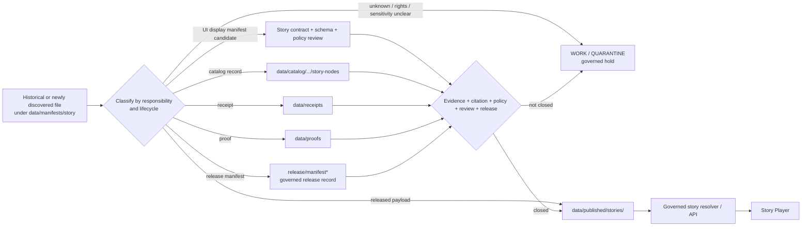

<!-- [KFM_META_BLOCK_V2]
doc_id: kfm://doc/data-manifests-story-readme
title: data/manifests/story/README.md — Story Manifest Compatibility and Retirement Boundary
version: v0.2
type: readme; data-compatibility-lane; manifest-retirement-boundary; story-routing-index; non-authoritative
status: draft; repository-grounded; NON-CANONICAL; direct-lane-readme-only; compatibility; retirement-candidate; story-manifest-terminology-split; release-gated; ADR-0011-proposed; manifest-lane-conflicted; no-trust-bearing-records; no-release; no-publication
owners: OWNER_TBD — Story steward · Data steward · Release steward · Manifest steward · Evidence steward · Catalog steward · UI steward · Policy steward · Accessibility steward · Security reviewer · Docs steward
created: NEEDS VERIFICATION — path and earlier stub predate v0.1
updated: 2026-07-24
supersedes: v0.1 at the same path; no data, manifest, release, story, catalog, runtime, or publication behavior is superseded
prepared_under_prompt: KFM Markdown Engineering, Modernization & GitHub Documentation Implementation Agent v5.0.0
policy_label: public-doc; data; manifests; story; compatibility; non-canonical; retirement; release-governance; story-display-separated; evidence-subordinate; no-direct-public-path
current_path: data/manifests/story/README.md
owning_root: data/
responsibility: preserve a non-canonical compatibility and retirement boundary for the historical story-manifest path, route each story-related artifact family to its verified responsibility root, and prevent this directory from becoming release authority, story-display authority, catalog authority, proof authority, or a public delivery shortcut
truth_posture: CONFIRMED existing v0.1 target, canonical data root, non-canonical parent manifest lane, canonical release-governance root, plural release-manifest collection lane, proposed ADR-0011 separation, UI StoryManifest and StoryNode semantic contracts, permissive UI StoryManifest schema, published-story payload lane, Roads/Rail/Trade story-node catalog lane, Story Player architecture and app-local README, example story-deck lane, story-policy stub, bounded direct-lane search returning only this README, and checked absence of release/manifests/story and release/manifests/stories READMEs / PROPOSED compatibility-only content contract, artifact classification matrix, migration packet, retirement sequence, validation expectations, review burden, correction handling, and rollback / CONFLICTED release/manifest versus release/manifests and data/manifests versus release manifests; StoryManifest placement across UI/story contracts and published payloads / UNKNOWN exhaustive historical payload inventory, active story releases, accepted story-release manifest sublane, production story resolver, accepted story-policy bundle, story validators, runtime behavior, required CI, hosting, and public effects / NEEDS VERIFICATION accountable owners, ADR acceptance, migration authority, retention needs, story artifact inventories, release linkage, correction lineage, branch protection, and retirement approval
evidence_snapshot:
  repository: bartytime4life/Kansas-Frontier-Matrix
  base_ref: main
  target_prior_blob: 1a6c77929e5711c9d280b4fa22aca48958683b86
  directory_rules_blob: 2affb080e6f0043867c64c7f06c1ca52030fbd55
  data_root_blob: fb7b0acfaea25b630a3042f24cb97558a996d05a
  data_manifests_parent_blob: c4cdbf0c0038f737447a7dc173f0fe49ef62490e
  release_root_blob: 0752610b1df6d11143158f6f162f65ecd650e6a6
  release_manifests_blob: c699a527ff11bebad6a874ed1a37aa3a8213b86c
  adr_0011_blob: 40b0f47b87d584040803ed76aa6b31f5204b7fca
  release_manifest_contract_blob: 9ca1c9d4a5b247196aa84a31a158fe734c8a6720
  ui_story_manifest_contract_blob: bbae760e1b8fa850a942e73d8e8a940873e42074
  ui_story_node_contract_blob: ecacd7d0e23926a5ee1c058ed06b9b22a6e46e8e
  ui_story_manifest_schema_blob: 7121dc695d028abe7f2c66b11fdf0405a3aa656c
  published_stories_blob: eba161a2740417be017a7e4514d6a09d3b6ce24c
  roads_rail_trade_story_nodes_catalog_blob: 20d5687739db1d50f561e19df5a3abc5ee56cbd5
  story_player_architecture_blob: 922eee24bff70d4bd79a5c525a73d47348843022
  story_player_app_readme_blob: 4bac3eb49bea7ee9e07d3b3e0466831d96ce2d1b
  story_deck_examples_blob: 5235af859ea076c19dad4750f0e92947690bf337
  story_policy_stub_blob: 64cb3860dd2b0a2d64152868ab2437148c899da2
  bounded_direct_lane_inventory: README.md only
  checked_absent_paths:
    - release/manifests/story/README.md
    - release/manifests/stories/README.md
  open_overlapping_pull_requests_found: "0"
related:
  - ../README.md
  - ../../README.md
  - ../../published/stories/README.md
  - ../../catalog/domain/roads-rail-trade/story-nodes/README.md
  - ../../proofs/README.md
  - ../../receipts/README.md
  - ../../../release/README.md
  - ../../../release/manifests/README.md
  - ../../../contracts/release/release_manifest.md
  - ../../../contracts/ui/story_manifest.md
  - ../../../contracts/ui/story_node.md
  - ../../../schemas/contracts/v1/ui/story_manifest.schema.json
  - ../../../policy/story/README.md
  - ../../../docs/adr/ADR-0011-receipts-vs-proofs-vs-manifests-vs-catalog-separation.md
  - ../../../docs/doctrine/directory-rules.md
  - ../../../docs/doctrine/lifecycle-law.md
  - ../../../docs/architecture/ui/STORY_PLAYER.md
  - ../../../apps/explorer-web/src/features/story_player/README.md
  - ../../../examples/story_decks/README.md
tags: [kfm, data, manifests, story, StoryManifest, StoryNode, ReleaseManifest, compatibility, retirement, release, published-stories, story-player, catalog, evidence, receipts, correction, rollback, cite-or-abstain]
notes:
  - "v0.2 modernizes the existing compatibility README against current repository evidence; it does not make data/manifests/story canonical."
  - "The term manifest is overloaded: UI StoryManifest organizes playback; ReleaseManifest binds a governed release; story-manifest bytes may be released payloads. This lane owns none of those meanings or instances."
  - "Bounded indexed search returned only this README under the exact lane; differently named, unindexed, historical, external, generated, or restricted material remains UNKNOWN."
  - "No story release-manifest child README was found at the two checked plural release paths. Absence at checked paths is not proof that no story release record exists elsewhere."
  - "No source, story, manifest, catalog, proof, receipt, policy, schema, runtime, release, correction, rollback, or publication state changes in this documentation-only revision."
[/KFM_META_BLOCK_V2] -->

<a id="top"></a>

# `data/manifests/story/` — Story Manifest Compatibility and Retirement Boundary

> **One-line purpose.** Preserve this historical path as a non-canonical routing and retirement boundary while keeping UI story manifests, release manifests, published story payloads, story-node catalogs, evidence, receipts, policy, runtime code, and release state in their proper responsibility roots.

<p>
  <a href="#status-and-evidence-boundary"></a>
  <a href="#authority-and-directory-rules-basis"></a>
  <a href="#manifest-terminology-and-authority-split"></a>
  <a href="#current-repository-inventory"></a>
  <a href="#migration-and-retirement-posture"></a>
  <a href="#public-client-story-player-and-ai-boundary"></a>
</p>

**Path:** `data/manifests/story/README.md`
**Version:** `v0.2`
**Owning root:** `data/` — compatibility child only; not a canonical manifest family
**Current lane role:** redirect, classification, migration, retirement, and anti-collapse documentation
**Allowed direct inventory:** this README plus reviewed compatibility or migration notes only
**Publication authority:** none
**Rollback target for this revision:** prior v0.1 blob `1a6c77929e5711c9d280b4fa22aca48958683b86`

> [!IMPORTANT]
> **This path is not a StoryManifest store and not a ReleaseManifest store.** It must not receive new trust-bearing instances merely because its name contains `manifests/story`.

> [!CAUTION]
> **“Story manifest” has multiple meanings in the repository.** A UI `StoryManifest` organizes governed playback. A `ReleaseManifest` binds an approved release artifact set. A released story package may contain a file named `story.manifest.json`. Those objects share words, not authority.

> [!WARNING]
> **Narrative polish is not evidence or publication.** Story text, node order, animation, camera state, screenshots, 3D scenes, generated narration, example decks, and catalog entries remain downstream carriers. Every consequential claim resolves to governed evidence or abstains, and every public story requires governed release state.

**Quick navigation:** [Purpose](#purpose) · [Status](#status-and-evidence-boundary) · [Authority](#authority-and-directory-rules-basis) · [Terminology](#manifest-terminology-and-authority-split) · [Inventory](#current-repository-inventory) · [Belongs](#what-belongs-here) · [Exclusions](#what-does-not-belong-here) · [Routing](#story-artifact-routing-matrix) · [Lifecycle](#lifecycle-and-trust-flow) · [Migration](#migration-and-retirement-posture) · [Classification](#historical-artifact-classification-procedure) · [Identity](#identity-and-anti-collapse-rules) · [Public boundary](#public-client-story-player-and-ai-boundary) · [Sensitivity](#rights-sensitivity-accessibility-and-security) · [Validation](#validation-and-acceptance) · [Review](#review-burden) · [Convergence](#smallest-sound-convergence-sequence) · [Done](#definition-of-done) · [Open](#open-verification-register) · [Evidence](#evidence-ledger) · [Rollback](#correction-supersession-retirement-and-rollback)

---

## Purpose

`data/manifests/story/` exists today as a compatibility path inside the `data/` tree. Its safe responsibility is deliberately narrow:

1. make the path's non-canonical status unmistakable;
2. prevent new story, UI, release, catalog, proof, or published artifacts from accumulating here;
3. classify any historical artifacts found here by responsibility rather than filename;
4. route each artifact to its accepted canonical home only through governed migration;
5. preserve identifiers, digests, provenance, correction lineage, and rollback targets during migration;
6. retain or retire the compatibility path only after reviewable evidence supports the decision.

This README does not:

- create or approve a story;
- define `StoryManifest`, `StoryNode`, or `ReleaseManifest` semantics;
- authorize a catalog entry;
- close an EvidenceBundle or proof;
- issue a policy decision;
- assemble a release;
- publish story bytes;
- activate Story Player behavior;
- create a redirect consumed by public clients;
- retire the directory by assertion.

A file under this path remains whatever its governing contract, lifecycle state, policy posture, evidence support, review state, and release state say it is. Path placement cannot upgrade it.

[Back to top](#top)

---

## Status and evidence boundary

### Current determination

| Surface | Current repository evidence | Safe conclusion |
|---|---|---|
| Target README | **CONFIRMED v0.1** | This revision updates an existing compatibility README in place. |
| Direct lane inventory | **README only in bounded indexed search** | No trust-bearing child file was established under the exact lane. This is not exhaustive historical proof. |
| Parent `data/manifests/` | **CONFIRMED compatibility/retirement README** | Parent remains non-canonical and should not host release-level manifests. |
| Data root | **CONFIRMED canonical lifecycle root** | `data/manifests` is recorded as compatibility debt, not a canonical lifecycle lane. |
| Release root | **CONFIRMED release-governance root** | Release manifests and release decisions belong under `release/`, subject to unresolved singular/plural lane convergence. |
| `release/manifests/` | **CONFIRMED draft collection lane** | Plural collection exists; its current listed sublanes do not include Story. |
| Checked Story release sublanes | **NOT FOUND at two checked paths** | No Story release-manifest README is established at `release/manifests/story/` or `release/manifests/stories/`. Other locations remain UNKNOWN. |
| ADR-0011 | **CONFIRMED identity / PROPOSED decision** | Separation and migration direction are documented but not accepted or fully enforced. |
| UI `StoryManifest` contract | **CONFIRMED draft semantic contract** | Display-manifest meaning exists under `contracts/ui/`; it is not release approval. |
| UI StoryManifest schema | **CONFIRMED permissive stub** | Only `id` is required; production completeness is not enforced. |
| Published stories lane | **CONFIRMED draft released-payload lane** | Released public-safe story-manifest bytes may live with story payloads after release. Actual payload inventory remains UNKNOWN. |
| Story-node catalog lane | **CONFIRMED domain catalog README** | Catalog story nodes are discovery carriers, not release manifests or story truth. |
| Story policy | **CONFIRMED greenfield stub** | No active story-policy bundle or evaluator is established. |
| Story Player architecture and app README | **CONFIRMED documentation** | Evidence-gated playback is specified; concrete runtime behavior remains NEEDS VERIFICATION. |
| Open exact-path PR | **None found** | No overlapping open update was found for this README. |

### Evidence limits

**CONFIRMED** statements are bounded to current files and exact checks performed for this revision.

**PROPOSED** material below is a migration and governance contract, not active implementation.

**UNKNOWN / NEEDS VERIFICATION** includes:

- exhaustive historical contents of this lane;
- Git history outside the inspected target lineage;
- differently named or generated story-manifest records;
- active story releases or hosting;
- accepted release-manifest Story sublane;
- operational StoryManifest resolver;
- policy, validator, receipt, and release integration;
- branch protection, required reviews, and independent release approval;
- production public effects.

[Back to top](#top)

---

## Authority and Directory Rules basis

`data/manifests/story/` is under the `data/` root, but topic nesting does not grant a new authority. Directory Rules choose homes by responsibility:

| Responsibility | Owning surface | Role of this lane |
|---|---|---|
| Lifecycle story drafts and candidates | accepted `data/work/`, `data/quarantine/`, or processed story lanes | Route historical items; never become a work area. |
| Story display-manifest meaning | `contracts/ui/story_manifest.md` and accepted story contract homes | Reference only; never redefine fields or semantics. |
| Story-node meaning | `contracts/ui/story_node.md` and domain story-node contracts | Reference only. |
| Machine shape | accepted `schemas/contracts/v1/` story/UI schemas | Never store or redefine schemas here. |
| Story policy and admissibility | `policy/story/`, `policy/ui/`, and other accepted policy lanes | Never decide allow, deny, restrict, or abstain here. |
| Evidence and proof | `data/proofs/` | Never store EvidenceBundles or proof closure here. |
| Process memory | `data/receipts/` | Never store receipts here. |
| Catalog discovery | `data/catalog/` and accepted domain catalog lanes | Never become a catalog root. |
| Release manifests and decisions | `release/` and accepted manifest/decision lanes | Never approve or describe release state as authority. |
| Released story payloads | `data/published/stories/` | Never publish or host payload bytes here. |
| Story playback | governed API and application/runtime roots | Never become a public resolver or browser-readable store. |
| Examples | `examples/story_decks/` | Never treat examples as operational manifests. |
| Correction and rollback | release/correction/rollback records and governed dependency tracking | Preserve links only during migration. |

### Placement conclusion

The existing path is accepted only as a **compatibility boundary** at this maturity level. Turning it into an active instance home would create parallel authority across:

- `contracts/ui/story_manifest.md`;
- release manifest lanes;
- `data/published/stories/`;
- story-node catalog lanes;
- evidence and receipt roots;
- story policy and Story Player runtime.

Any change from compatibility to canonical authority requires an accepted decision, explicit migration plan, closed contracts and schemas, validators, tests, consumer migration, correction support, and rollback.

[Back to top](#top)

---

## Manifest terminology and authority split

The word **manifest** is overloaded. Reviewers must classify by responsibility rather than filename.

### UI `StoryManifest`

Defined by `contracts/ui/story_manifest.md`.

It answers:

- which story sections or nodes may be rendered;
- which map, time, layer, callout, and caveat context applies;
- which evidence, citation, policy, review, release, correction, and rollback references remain visible;
- which story state the UI should present.

It is:

- a governed display projection;
- evidence-dependent;
- release-gated;
- downstream of policy and review.

It is not:

- a release decision;
- a `ReleaseManifest`;
- an EvidenceBundle;
- story truth;
- implementation proof.

### UI `StoryNode`

Defined by `contracts/ui/story_node.md`.

A StoryNode is one renderable story section, callout, timeline event, evidence note, caveat, or transition. Node ordering and narrative text do not create factual or release authority.

### `ReleaseManifest`

Defined by `contracts/release/release_manifest.md` and governed under `release/`.

It binds:

- a release identity;
- included artifact references and digests;
- evidence, validation, policy, rights, sensitivity, review, correction, and rollback support;
- release-facing state.

It is not a payload store and does not publish by itself.

### Published story-manifest bytes

A released story package may contain files such as:

```text
story.manifest.json
story.index.json
story_nodes.json
node_evidence_refs.json
citation_index.json
```

Those bytes belong under `data/published/stories/<release_id>/` only after release gates close. Their filename does not make them release authority; they are released delivery carriers tied to a ReleaseManifest.

### Catalog story nodes

Story-node records under `data/catalog/.../story-nodes/` support discovery, citation, review, and release preparation. They remain CATALOG-stage records and do not become published story payloads or release manifests.

### Compatibility-lane notes

Files in this lane may explain how an old path maps to current authority. They must not look like active manifests or be consumed as such.

[Back to top](#top)

---

## Current repository inventory

### Direct lane

Bounded indexed search established:

```text
data/manifests/story/
└── README.md
```

No JSON, YAML, Markdown manifest instance, digest, redirect file, release record, catalog record, receipt, or proof was established directly under the indexed lane.

This conclusion is intentionally bounded. It does not prove the permanent absence of:

- deleted or historical files;
- ignored or generated outputs;
- files outside indexed search;
- artifacts in external object stores;
- restricted-system records;
- differently named compatibility artifacts.

### Adjacent confirmed surfaces

| Surface | Current posture |
|---|---|
| `data/manifests/README.md` | Non-canonical parent compatibility lane. |
| `release/manifests/README.md` | Draft release manifest collection lane with singular/plural conflict still visible. |
| `contracts/ui/story_manifest.md` | Draft UI display-manifest semantic contract. |
| `schemas/contracts/v1/ui/story_manifest.schema.json` | PROPOSED permissive schema stub requiring only `id`. |
| `contracts/ui/story_node.md` | Draft UI story-node semantic contract. |
| `data/published/stories/README.md` | Draft released public-safe story-payload lane. |
| `data/catalog/domain/roads-rail-trade/story-nodes/README.md` | Draft domain story-node catalog lane. |
| `docs/architecture/ui/STORY_PLAYER.md` | Draft Story Player architecture. |
| `apps/explorer-web/src/features/story_player/README.md` | Draft app-local playback boundary; runtime maturity unproved. |
| `examples/story_decks/README.md` | Non-authoritative example lane. |
| `policy/story/README.md` | Greenfield bundle stub. |

### Checked absence

The following exact files were not found:

```text
release/manifests/story/README.md
release/manifests/stories/README.md
```

This is a navigation and ownership gap, not permission to use this compatibility lane as the missing release sublane.

[Back to top](#top)

---

## What belongs here

Until a reviewed retirement or migration decision says otherwise, direct contents are limited to:

- this README;
- a reviewed compatibility notice that points to accepted homes;
- a migration inventory describing historical artifacts without copying payloads;
- a path crosswalk with old identifier, old digest, classified artifact family, accepted destination, migration decision, reviewer state, and rollback target;
- a deprecation notice with an effective date only after consumer impact is checked;
- a retirement note preserving why the path was removed or retained;
- links to corrections, supersession, migration receipts, or release records stored in their governing homes.

Every non-README addition must be:

- explicitly non-authoritative;
- safe for a public repository;
- free of story payloads and protected content;
- reviewable and reversible;
- tied to a migration or compatibility need;
- rejected as a public or runtime data source.

### Compatibility-note minimum content

A compatibility note should state:

| Field | Requirement |
|---|---|
| Old path | Exact historical path. |
| Artifact classification | Display manifest, release manifest, published payload, catalog record, receipt, proof, draft, example, or unknown. |
| Authority home | Accepted destination or `NEEDS VERIFICATION`. |
| Status | `DISCOVERED`, `CLASSIFIED`, `QUARANTINED`, `MIGRATION_PROPOSED`, `MIGRATED`, `RETIRED`, or `UNKNOWN` as a proposed operational vocabulary. |
| Source digest | Digest of historical artifact when safely available. |
| Destination digest | Digest after migration when applicable. |
| Review references | Accountable review or decision references. |
| Correction/rollback | How to reverse or correct the migration. |
| Consumer impact | Known refs, links, runtime callers, or unknown posture. |
| Sensitive-data handling | Redaction, quarantine, staged access, or denial decision. |

The vocabulary above is **PROPOSED** and must not be treated as an accepted schema.

[Back to top](#top)

---

## What does not belong here

| Forbidden content or behavior | Correct responsibility |
|---|---|
| UI `StoryManifest` instances for playback | Released story payload lane or accepted governed projection service after release. |
| `StoryNode` payloads | Released story package, catalog, work, or accepted story object lane according to lifecycle state. |
| `ReleaseManifest` instances | Accepted `release/manifest*` lane. |
| Promotion or release decisions | `release/` decision lanes. |
| Published story bytes | `data/published/stories/`. |
| Story drafts, prompts, unresolved narration, authoring scratch | Accepted WORK or authoring workspace; quarantine when uncertain. |
| Story-node catalog records | `data/catalog/` domain/story-node lanes. |
| EvidenceBundle, ProofPack, citation closure, integrity proof | `data/proofs/`. |
| Story-build, AI, validation, transform, representation, release, correction, or rollback receipts | `data/receipts/`. |
| Source descriptors | `data/registry/`. |
| Contracts or schemas | `contracts/` and `schemas/`. |
| Policy rules or bundles | `policy/`. |
| Validators, fixtures, tests, pipelines, applications, packages, runtime adapters | Their responsibility roots. |
| Images, audio, video, camera tracks, 3D assets, tiles, PMTiles, COGs, exports | Appropriate WORK, QUARANTINE, PUBLISHED, layer, media, or artifact lanes after governance. |
| Public aliases such as `latest.json` | Released story lane only when generated from release state. |
| Redirects used by public clients without governed release resolution | Governed API or approved released hosting. |
| Secrets, private URLs, tokens, precise protected locations, private-person data, proprietary text | Approved restricted systems; never this public lane. |
| Generated prose claiming approval or evidence | Governed review; language is not authority. |

### File-extension guardrail

The following names are especially dangerous here because they can be mistaken for active trust objects:

```text
*.manifest.json
release_manifest.*
story.manifest.*
latest.json
public_index.json
story_nodes.*
node_evidence_refs.*
citation_index.*
*.sha256
*.sig
*.dsse
```

Their presence under this compatibility path should trigger classification and hold, not consumption.

[Back to top](#top)

---

## Story artifact routing matrix

| Artifact encountered | Classification question | Expected authority home | Default action here |
|---|---|---|---|
| UI StoryManifest | Is this a governed playback projection? | Contract-defined released story payload or governed resolver output | Do not store; classify and route. |
| StoryNode payload | Is it WORK, CATALOG, or PUBLISHED? | Matching lifecycle or catalog/published lane | Hold until lifecycle state is proved. |
| ReleaseManifest | Does it bind a governed release? | Accepted `release/manifest*` lane | Fail closed; migrate only through release governance. |
| Published story package | Has release, evidence, policy, citation, digest, correction, and rollback closure? | `data/published/stories/<release_id>/` | Quarantine or hold if closure is unclear. |
| Story-node catalog record | Is it discovery metadata, not payload? | Matching `data/catalog/.../story-nodes/` lane | Route with catalog identity preserved. |
| Story example | Is it visibly synthetic and non-authoritative? | `examples/story_decks/` | Do not promote into operational data. |
| Story draft | Is it unresolved authoring material? | Accepted WORK/authoring lane | Never expose publicly. |
| Story receipt | Does it remember a process event? | `data/receipts/` | Preserve run linkage and digest. |
| Story proof/citation package | Does it support claims or closure? | `data/proofs/` | Preserve EvidenceRefs and proof identity. |
| Story policy result | Is it an emitted decision? | Accepted decision/receipt record home | Do not store beside policy source or here. |
| Story schema or contract | Does it define meaning or shape? | `contracts/` or `schemas/` | Reject placement here. |
| Unknown “manifest” | Is authority, lifecycle, and release state unresolved? | `QUARANTINE` or reviewed migration staging | Do not infer from filename. |

### Required classification dimensions

Before moving or retaining any artifact, determine:

- semantic object family;
- lifecycle state;
- source and producer;
- source role;
- digest and canonicalization profile;
- rights and license posture;
- sensitivity and public-safe status;
- evidence dependencies;
- policy and review state;
- release and correction state;
- current consumers;
- supersession and rollback target.

Missing context yields a hold, quarantine, abstention, or denial—not a guessed destination.

[Back to top](#top)

---

## Lifecycle and trust flow



The flow is conceptual and does not establish an operational migration tool, story resolver, release assembler, or Story Player implementation.

### Forbidden transitions

```text
data/manifests/story/<file>
  -> treated as published because of path

StoryManifest shape pass
  -> treated as release approval

ReleaseManifest filename
  -> treated as an approved release

story.manifest.json
  -> served directly without release resolution

example story deck
  -> promoted into operational story payload

catalog story node
  -> treated as EvidenceBundle or story truth
```

[Back to top](#top)

---

## Migration and retirement posture

### Governing posture

Migration is a governed state change, not a bulk file move. The safe sequence is:

1. freeze new trust-bearing additions to this lane;
2. inventory direct and historical contents;
3. classify every item by responsibility and lifecycle state;
4. compute or verify source digests;
5. identify consumers and links;
6. evaluate rights, sensitivity, evidence, policy, review, release, correction, and rollback posture;
7. choose an accepted destination or quarantine;
8. migrate with a reviewable record and preserved lineage;
9. update consumers and documentation;
10. validate old-path denial or compatibility behavior;
11. retain a time-bounded redirect note or retire the lane;
12. prove rollback before final deletion.

### Retirement decision matrix

| Condition | Posture |
|---|---|
| Only this README exists and no consumer uses the path | Candidate for governed retirement. |
| Historical links exist but no trust objects remain | Keep a minimal compatibility note until links migrate. |
| Unknown files or unresolved history exist | Do not retire; inventory and hold. |
| Trust-bearing records exist | Classify and migrate each record; do not bulk relocate. |
| Public/runtime consumers read this path | Fail closed and design a governed consumer migration. |
| Release status is unclear | Quarantine or hold; do not move to PUBLISHED. |
| Rights or sensitivity are unclear | Restrict, redact, generalize, quarantine, or deny. |
| Rollback cannot be demonstrated | Do not finalize retirement. |
| ADR-0011 remains proposed | Preserve reversibility and avoid irreversible cleanup by documentation alone. |

### No silent redirect

A redirect can itself become an authority path. Any compatibility mechanism must specify:

- who consumes it;
- whether it is repository navigation or runtime resolution;
- whether it exposes only released public-safe identifiers;
- how stale or withdrawn releases invalidate it;
- how correction and rollback update it;
- when it expires;
- how its removal is tested.

A Markdown link is acceptable as documentation. A machine-consumed redirect requires contracts, validation, policy, release binding, and rollback.

[Back to top](#top)

---

## Historical artifact classification procedure

When an artifact is found here:

### Step 1 — Preserve before interpretation

- record path and Git object identity;
- compute a digest when safe and necessary;
- do not edit the original to “make it fit” a destination;
- do not open restricted payloads in public logs or issues;
- preserve timestamps and producer context where available.

### Step 2 — Determine object family

Ask whether it is:

- UI StoryManifest;
- StoryNode or story payload;
- ReleaseManifest;
- catalog record;
- receipt;
- proof or citation record;
- policy result;
- draft or example;
- published artifact;
- unknown.

Do not classify from extension alone.

### Step 3 — Determine lifecycle and release state

```text
RAW -> WORK / QUARANTINE -> PROCESSED -> CATALOG / TRIPLET -> PUBLISHED
```

A story package can contain manifest-shaped files at multiple stages. Only release-approved public-safe payloads belong in PUBLISHED.

### Step 4 — Resolve governance dependencies

Require, where applicable:

- source descriptors and source roles;
- evidence and citation closure;
- rights and attribution;
- sensitivity and public-safe transformation;
- policy decision;
- accountable review;
- release manifest and promotion decision;
- correction, withdrawal, supersession, and rollback references.

### Step 5 — Choose disposition

| Disposition | Meaning |
|---|---|
| `MIGRATE` | Destination and governance closure are established. |
| `QUARANTINE` | Rights, sensitivity, identity, integrity, or release status is unresolved. |
| `RETAIN_COMPATIBILITY` | A documented consumer still requires a temporary path note. |
| `SUPERSEDE` | A governed newer object replaces the historical object. |
| `RETIRE` | No trust object or consumer remains and rollback is proven. |
| `DENY` | Artifact cannot be safely or lawfully retained or exposed in this repository lane. |
| `UNKNOWN` | Evidence is insufficient; no action beyond preservation/hold. |

These labels are **PROPOSED** for planning and do not create a contract.

[Back to top](#top)

---

## Identity and anti-collapse rules

### Identity rules

- Preserve the historical artifact's original identifier and digest.
- Assign no new canonical identity until the owning contract and registry rules are known.
- Do not reuse an old story-manifest ID for a ReleaseManifest.
- Do not reuse a release ID as a StoryManifest ID unless an accepted contract explicitly permits a distinct reference relationship.
- Do not use mutable `latest` pointers as canonical release identity.
- Preserve supersession, correction, withdrawal, and rollback lineage.
- Keep story, node, release, catalog, receipt, proof, and published-payload identities distinguishable.

### Anti-collapse matrix

| Collapse | Why it fails |
|---|---|
| UI StoryManifest = ReleaseManifest | Display ordering cannot approve release. |
| StoryManifest = story truth | Narrative projection remains evidence-dependent. |
| StoryNode = EvidenceBundle | A node references evidence; it is not evidence closure. |
| Catalog story node = published story | CATALOG is not PUBLISHED. |
| Released story-manifest byte = release authority | Payload bytes reference release state; they do not own it. |
| ReleaseManifest = payload store | Manifest identifies artifacts; payloads live elsewhere. |
| Receipt = proof | Process memory does not prove claim support. |
| Proof = release decision | Evidence support does not approve publication. |
| Example deck = fixture or operational payload | Examples are teaching aids by placement. |
| Story Player render = evidence | Visual output is a downstream carrier. |
| AI narration = source claim | Generated language must cite evidence or abstain. |
| File move = promotion | Promotion is a governed transition with review and rollback. |

### Name-based authority denial

A consumer must not trust a file merely because it contains:

- `manifest`;
- `release`;
- `approved`;
- `published`;
- `final`;
- `verified`;
- `signed`;
- `story`;
- `latest`.

Authority comes from resolvable contracts, digests, evidence, policy, review, release records, and governed interfaces.

[Back to top](#top)

---

## Public client, Story Player, and AI boundary

### Public clients

Public clients must not read this directory.

The expected public flow is:

```text
released story payload
  -> governed story resolver / API
  -> finite response envelope
  -> Story Player
  -> Evidence Drawer for consequential claims
```

The Story Player must not:

- browse repository compatibility paths;
- resolve story state from filenames;
- read RAW, WORK, QUARANTINE, catalog, proof, receipt, registry, or internal stores directly;
- treat missing release state as permission;
- expose blocked node payloads;
- infer protected details from omitted content;
- treat camera position or styling as redaction.

### Finite outcomes

A governed story request should surface one of:

| Outcome | Story posture |
|---|---|
| `ANSWER` | Released, cited, policy-safe story content may render with required caveats. |
| `ABSTAIN` | Evidence, citation, freshness, or lineage is insufficient. |
| `DENY` | Rights, sensitivity, access, release, or rollback posture blocks exposure. |
| `ERROR` | Schema, resolver, adapter, transport, or runtime failure prevents safe playback. |

This compatibility lane emits none of those outcomes. It only documents where authority belongs.

### AI

AI may summarize released, evidence-backed story content through governed interfaces. AI must not:

- author release approval;
- use this lane as retrieval authority;
- repair missing evidence by plausibility;
- turn an example or catalog node into a factual claim;
- infer hidden story content;
- expose restricted geometry or living-person detail;
- present generated narrative as EvidenceBundle support.

[Back to top](#top)

---

## Rights, sensitivity, accessibility, and security

### Rights and sensitivity

Story artifacts can combine text, maps, imagery, audio, video, archival material, living-person information, land/title context, cultural knowledge, archaeology, rare species, infrastructure, and precise locations.

Unknown posture requires a restrictive disposition:

- quarantine;
- redaction;
- generalization;
- staged access;
- delayed release;
- abstention;
- denial.

Never place in this public compatibility lane:

- exact restricted coordinates;
- private-person records;
- DNA or genomic information;
- archaeology or burial-site detail;
- rare-species locations;
- critical-infrastructure detail;
- protected cultural knowledge;
- proprietary source content;
- credentials, tokens, private endpoints, or signing material;
- reversible redaction parameters;
- internal object-store or graph handles.

### Accessibility

A migrated or released StoryManifest should preserve:

- accessible title and summary;
- semantic section order;
- keyboard navigation;
- reduced-motion behavior;
- non-map and non-visual alternatives;
- visible finite outcomes;
- caveats and trust state not conveyed by color alone;
- captions/transcripts where media is present.

This lane does not implement those features, but migration must not discard accessibility metadata.

### Security

Compatibility notes must avoid:

- leaking historical restricted payload locations;
- exposing private release URLs;
- embedding raw payload snippets;
- publishing digest-preimage hints for protected content;
- retaining machine-consumed redirects after withdrawal;
- logging withheld node data during classification.

[Back to top](#top)

---

## Validation and acceptance

### Documentation validation

This README should pass:

- Markdown parsing;
- balanced fenced blocks;
- heading hierarchy checks;
- internal fragment-link resolution;
- relative-link review;
- no trailing whitespace or tabs;
- no secrets or sensitive values;
- remote read-back and Git blob verification.

### Lane validation

A future repository guard should fail when this lane contains trust-bearing files beyond reviewed compatibility notes.

PROPOSED checks:

```text
direct inventory allowlist
  README.md
  reviewed compatibility/migration notes only

deny suspicious active-instance names
  story.manifest.json
  release_manifest.*
  latest.json
  public_index.json
  *.sig
  *.dsse

deny payload/media extensions unless explicitly reviewed
deny schemas, Rego, executables, package files, and runtime configs
deny public-client references to this path
deny release records that resolve from this path
```

Exact implementation home, command, workflow, and allowlist schema remain **NEEDS VERIFICATION**.

### Story artifact validation after migration

A migrated story artifact should be accepted only when relevant checks close:

- semantic contract;
- machine schema;
- stable identity and digest;
- StoryNode references;
- evidence and citation closure;
- source roles;
- rights and attribution;
- sensitivity and public-safe transforms;
- story policy;
- accountable review;
- release manifest and promotion decision;
- published payload digest;
- correction and withdrawal;
- rollback target;
- consumer migration;
- cache invalidation;
- accessibility checks.

### Acceptance criteria for this compatibility lane

This lane is operating safely when:

- no active trust-bearing artifacts are stored here;
- repository and runtime consumers do not use it as authority;
- every historical artifact is classified or explicitly UNKNOWN;
- accepted destinations are documented without duplicating instances;
- migrations preserve digests and lineage;
- sensitive material is absent or governed outside the public repo;
- retirement or retention has accountable approval;
- rollback is demonstrable.

[Back to top](#top)

---

## Review burden

| Change class | Minimum review posture |
|---|---|
| README wording or link repair | Data-aware docs reviewer. |
| Compatibility note | Data steward + story steward + owning artifact-family steward. |
| Migration inventory | Data + story + evidence/catalog/release reviewers as applicable. |
| ReleaseManifest movement | Release steward + contract/schema + policy + evidence + rollback review. |
| Published story movement | Story + release + evidence + policy + accessibility + runtime review. |
| Sensitive or rights-bearing artifact | Specialist rights/sensitivity/privacy/cultural/security review; fail closed without ownership. |
| Runtime redirect or consumer migration | Governed API + Story Player + release + security + validation review. |
| Directory retirement | Architecture/Directory Rules + data + release + story + rollback review. |
| Breaking path removal | Consumer inventory, migration note, validation, deprecation window, and rollback. |

CODEOWNERS or pull-request review routing does not by itself establish:

- accepted stewardship;
- review quorum;
- independent release approval;
- rights clearance;
- policy permission;
- release state;
- successful migration.

[Back to top](#top)

---

## Smallest sound convergence sequence

1. **Freeze authority.** Keep the lane README-only and reject new trust-bearing records.
2. **Inventory.** Perform an exact recursive and historical inventory using an approved repository workflow.
3. **Classify.** Map every artifact to display manifest, release manifest, published payload, catalog, receipt, proof, draft, example, or unknown.
4. **Resolve manifest lanes.** Coordinate with ADR-0011 and the `release/manifest` versus `release/manifests` decision.
5. **Resolve StoryManifest split.** Confirm UI/story contract ownership and the released payload representation.
6. **Harden shapes.** Expand StoryManifest and ReleaseManifest schemas beyond permissive stubs.
7. **Bind policy.** Replace the story-policy stub with accepted rules, native tests, bundle identity, and governed evaluation.
8. **Bind validation.** Establish story, release-manifest, citation, evidence, accessibility, and public-boundary validators.
9. **Migrate safely.** Move only classified instances through reviewed migrations preserving IDs, digests, and rollback.
10. **Update consumers.** Remove repository/runtime dependence on the old path.
11. **Prove correction.** Test supersession, withdrawal, cache invalidation, and rollback.
12. **Retire or retain.** Remove the path or retain a minimal compatibility note through an accepted decision.

This sequence is **PROPOSED**. No step is completed by this README alone.

[Back to top](#top)

---

## Definition of done

`data/manifests/story/` is ready for final retirement or long-term compatibility only when:

- [ ] accountable owners are assigned;
- [ ] ADR-0011 or a superseding decision is accepted;
- [ ] singular/plural release manifest placement is resolved;
- [ ] UI StoryManifest versus released payload representation is resolved;
- [ ] exhaustive direct and historical inventory is complete;
- [ ] no unknown trust-bearing files remain;
- [ ] every artifact has a classified owner and lifecycle state;
- [ ] rights and sensitivity review is complete;
- [ ] story and release manifest contracts/schemas are accepted;
- [ ] validators and synthetic fixtures exist;
- [ ] story policy is implemented and tested;
- [ ] evidence and citation closure is enforced;
- [ ] release, correction, withdrawal, and rollback records are linked;
- [ ] public clients and Story Player do not consume this path;
- [ ] runtime redirects, if any, are release-bound and revocation-aware;
- [ ] migrated artifact digests match expected lineage;
- [ ] consumers are updated and tested;
- [ ] branch-protected checks are verified;
- [ ] rollback and restoration drills pass;
- [ ] retirement or retention is recorded in a reviewable decision.

Until then, the status remains **NON-CANONICAL compatibility / retirement candidate**.

[Back to top](#top)

---

## Open verification register

| ID | Question | Status | Closure evidence |
|---|---|---|---|
| `STORY-MAN-COMP-001` | Should `data/manifests/story/` be retained, redirected, or removed? | **NEEDS VERIFICATION** | accepted ADR/path decision |
| `STORY-MAN-COMP-002` | Is the direct lane truly README-only under exhaustive recursive inventory? | **NEEDS VERIFICATION** | repository tree and history report |
| `STORY-MAN-COMP-003` | Did historical trust-bearing story artifacts ever live here? | **UNKNOWN** | Git history and migration inventory |
| `STORY-MAN-COMP-004` | Are any external tools or documents linked to this path? | **UNKNOWN** | consumer and link inventory |
| `STORY-MAN-COMP-005` | Which path is canonical for ReleaseManifest instances: singular or plural? | **CONFLICTED** | accepted ADR and migration |
| `STORY-MAN-COMP-006` | Should a Story-specific release-manifest sublane exist? | **UNKNOWN** | release architecture and steward decision |
| `STORY-MAN-COMP-007` | Where is the canonical UI/story semantic split for StoryManifest? | **NEEDS VERIFICATION** | contract/ADR decision |
| `STORY-MAN-COMP-008` | Are released story-manifest bytes always stored with published story payloads? | **NEEDS VERIFICATION** | accepted release/payload contract |
| `STORY-MAN-COMP-009` | Which story manifest schema is canonical and complete? | **UNKNOWN** | closed schema and registry |
| `STORY-MAN-COMP-010` | Which StoryNode schema and state vocabulary are canonical? | **UNKNOWN** | contract/schema/fixtures |
| `STORY-MAN-COMP-011` | Is the UI StoryManifest schema still permissive in active consumers? | **NEEDS VERIFICATION** | consumer and validator evidence |
| `STORY-MAN-COMP-012` | Which validator checks StoryManifest semantics and references? | **UNKNOWN** | executable inventory and observed run |
| `STORY-MAN-COMP-013` | Which validator checks ReleaseManifest closure for stories? | **UNKNOWN** | executable inventory and observed run |
| `STORY-MAN-COMP-014` | Which native story-policy rules and bundle are accepted? | **UNKNOWN** | rule source, tests, selector, digest |
| `STORY-MAN-COMP-015` | Which service resolves released stories for clients? | **UNKNOWN** | implementation and integration tests |
| `STORY-MAN-COMP-016` | Is Story Player implemented beyond README/document boundaries? | **UNKNOWN** | source inventory and runtime tests |
| `STORY-MAN-COMP-017` | Are actual story payloads present under `data/published/stories/`? | **UNKNOWN** | governed payload inventory |
| `STORY-MAN-COMP-018` | Does any active release manifest bind a story payload? | **UNKNOWN** | release record inventory |
| `STORY-MAN-COMP-019` | Are story-node catalogs referenced by released stories? | **UNKNOWN** | catalog/release closure report |
| `STORY-MAN-COMP-020` | Which story receipts and proof families are required? | **NEEDS VERIFICATION** | accepted contracts and release profile |
| `STORY-MAN-COMP-021` | How are generated or AI-assisted narratives reviewed and corrected? | **UNKNOWN** | governed AI/story workflow |
| `STORY-MAN-COMP-022` | How are rights for text, media, archives, and imagery enforced? | **UNKNOWN** | rights policy and tests |
| `STORY-MAN-COMP-023` | How are sensitive geometry and protected context generalized or denied? | **NEEDS VERIFICATION** | policy, transform receipts, leakage tests |
| `STORY-MAN-COMP-024` | How are accessibility requirements validated for released stories? | **UNKNOWN** | accessibility profile and tests |
| `STORY-MAN-COMP-025` | How are story corrections propagated to catalogs, indexes, caches, screenshots, exports, and AI? | **UNKNOWN** | dependency graph and operational drill |
| `STORY-MAN-COMP-026` | How is `latest.json` generated, invalidated, and rolled back? | **UNKNOWN** | release-bound alias contract and tests |
| `STORY-MAN-COMP-027` | Are repository and runtime consumers prevented from reading this path? | **UNKNOWN** | static/runtime boundary tests |
| `STORY-MAN-COMP-028` | Are suspicious manifest-shaped files denied in this lane by CI? | **UNKNOWN** | workflow and branch-protection evidence |
| `STORY-MAN-COMP-029` | Who owns story, data, manifest, catalog, evidence, policy, accessibility, and release review? | **NEEDS VERIFICATION** | stewardship and separation-of-duties record |
| `STORY-MAN-COMP-030` | Has a migration and rollback drill succeeded without changing public state? | **UNKNOWN** | signed drill report and digest comparison |
| `STORY-MAN-COMP-031` | Are all public docs and compatibility notes free of protected story details? | **NEEDS VERIFICATION** | secret/sensitivity scan |
| `STORY-MAN-COMP-032` | Can the lane be removed without breaking stable documentation links? | **UNKNOWN** | link check and deprecation plan |
| `STORY-MAN-COMP-033` | Is retention required for legal, archival, or audit reasons? | **UNKNOWN** | records-retention review |
| `STORY-MAN-COMP-034` | Are story object identities deterministic and supersession-safe? | **NEEDS VERIFICATION** | identity contract and tests |
| `STORY-MAN-COMP-035` | Are StoryManifest, ReleaseManifest, catalog, proof, receipt, and payload types distinct in every consumer? | **UNKNOWN** | contract tests and architecture guards |

[Back to top](#top)

---

## Evidence ledger

| Evidence | Status | Supports | Limits |
|---|---|---|---|
| Prior `data/manifests/story/README.md` v0.1 | **CONFIRMED** | Existing non-canonical compatibility boundary and rollback lineage. | Older evidence boundary and limited story terminology split. |
| `data/README.md` | **CONFIRMED repository-grounded draft** | Canonical lifecycle root; `data/manifests` is compatibility conflict. | Does not settle retirement or exhaustive payload inventory. |
| `data/manifests/README.md` | **CONFIRMED draft** | Parent is non-canonical and routes release manifests to `release/`. | Does not prove child inventories. |
| `release/README.md` | **CONFIRMED repository-grounded draft** | Release governance belongs under `release/`; readiness holds remain. | Does not prove operational releases. |
| `release/manifests/README.md` | **CONFIRMED draft** | Plural release-manifest collection exists and lists current sublanes. | Singular/plural conflict remains; no Story sublane proved. |
| ADR-0011 v1.2 | **CONFIRMED identity / PROPOSED decision** | Explicit receipt/proof/catalog/release/published separation and proposed manifest convergence. | Not accepted or enforced end to end. |
| `contracts/release/release_manifest.md` | **CONFIRMED draft semantic contract** | ReleaseManifest meaning and release-facing boundaries. | Paired schema remains thin/permissive. |
| `contracts/ui/story_manifest.md` | **CONFIRMED draft semantic contract** | UI StoryManifest is a display projection, not truth or release approval. | Final UI/story split and runtime remain unresolved. |
| `contracts/ui/story_node.md` | **CONFIRMED draft semantic contract** | StoryNode is a display unit subordinate to evidence and release. | Schema and implementation remain incomplete. |
| UI StoryManifest schema | **CONFIRMED PROPOSED stub** | Requires `id`; allows additional properties. | Does not enforce governance completeness. |
| `data/published/stories/README.md` | **CONFIRMED draft** | Released public-safe story-manifest bytes and payload packages belong here after release. | Actual payloads and release bindings remain UNKNOWN. |
| Roads/Rail/Trade story-node catalog README | **CONFIRMED draft** | Catalog story nodes are CATALOG-stage, evidence-subordinate records. | Does not prove inventory or release. |
| Story Player architecture | **CONFIRMED draft doctrine** | Governed, finite-outcome, evidence-gated playback boundary. | Original path claims include proposed/unverified items. |
| Story Player app README | **CONFIRMED draft** | App-local playback responsibility and current maturity bounds. | Does not prove implementation. |
| Story deck examples README | **CONFIRMED draft example lane** | Examples are synthetic and non-authoritative. | Does not prove operational story artifacts. |
| Story policy README | **CONFIRMED stub** | Policy path exists. | No active policy behavior. |
| Exact lane search | **BOUNDED CONFIRMED** | Only this README surfaced under exact path. | Not exhaustive history or external-store proof. |
| Checked Story release sublane paths | **NOT FOUND** | Navigation gap at two plausible plural paths. | Other names/locations remain UNKNOWN. |

[Back to top](#top)

---

## Correction, supersession, retirement, and rollback

### Correction

Correct this README when:

- an accepted ADR changes manifest placement;
- a Story release sublane is created;
- StoryManifest contract or schema authority changes;
- an inventory reveals artifacts under this lane;
- consumers are found;
- story policy, validators, resolver, or release flow becomes operational;
- the path is retired.

Documentation corrections must not silently move artifacts or change release state.

### Supersession

If a new canonical compatibility or migration record supersedes this README:

- preserve this `doc_id` or record explicit supersession;
- retain prior blob and commit references;
- update links;
- explain whether the path remains, redirects, or is removed;
- preserve rollback.

### Retirement

Retirement requires:

- complete inventory;
- no unresolved consumers;
- no trust-bearing records;
- accepted destination decisions;
- migrated links;
- rights/retention review;
- testable rollback;
- accountable approval.

Deleting a directory is not proof that migration succeeded.

### Rollback

Rollback this documentation revision by reverting its commit, restoring v0.1 blob:

```text
1a6c77929e5711c9d280b4fa22aca48958683b86
```

Rollback a future artifact migration by:

1. disabling affected public/runtime references;
2. restoring the prior digest-pinned artifact to its governed prior home;
3. reversing consumer pointers;
4. restoring correction and release state;
5. invalidating stale caches and indexes;
6. recording the rollback in the correct release/receipt/correction homes;
7. verifying no protected or withdrawn content was restored publicly.

This README changes no runtime or release state and therefore needs only ordinary Git rollback for its own content.

[Back to top](#top)

---

## Maintainer checklist

Before adding or changing anything under `data/manifests/story/`:

- [ ] confirm the primary responsibility is compatibility or migration;
- [ ] prove the item is not a UI StoryManifest instance;
- [ ] prove the item is not a ReleaseManifest;
- [ ] prove the item is not a published story payload;
- [ ] prove the item is not a catalog record, receipt, proof, schema, contract, policy rule, fixture, test, validator, or runtime file;
- [ ] check rights, sensitivity, and secret exposure;
- [ ] preserve original IDs, digests, and lineage;
- [ ] identify consumers and links;
- [ ] attach accountable review;
- [ ] define correction, supersession, and rollback;
- [ ] keep public clients and Story Player away from this path;
- [ ] reject suspicious trust-object filenames;
- [ ] update the open verification register;
- [ ] keep the change small and reversible.

> **Final boundary:** this lane may explain an old path and how to leave it safely. It must never become the place where KFM stories are defined, proven, cataloged, approved, released, played, or published.

[Back to top](#top)
