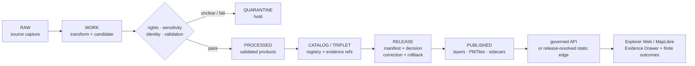

<!-- [KFM_META_BLOCK_V2]
doc_id: kfm://doc/data-maps-readme
title: data/maps/README.md — Map Data Compatibility and Retirement Lane
version: v0.2
type: readme; data-compatibility-segment; map-object-routing-guide; retirement-contract
status: repository-grounded draft; non-canonical; pointer-only; indexed-inventory-bounded; map-object-home-conflicted; schema-home-conflicted; renderer-readiness-held; non-authoritative
owners: NEEDS VERIFICATION — Data steward · Map steward · Layer steward · Catalog steward · Registry steward · Evidence steward · Rights reviewer · Sensitivity reviewer · Release steward · MapLibre/UI steward · Migration steward · Docs steward
created: NEEDS VERIFICATION — placeholder existed before v0.1 expansion
updated: 2026-07-24
supersedes: v0.1 documentation at the same path; no source, map artifact, layer, catalog, registry, release, runtime, deployment, or publication state is superseded
prepared_under_prompt: KFM Markdown Modernization & GitHub Documentation Implementation Agent v4.0.0
policy_label: repository-facing; data; maps; compatibility; pointer-only; deny-new-writes; no-direct-public-path; rights-aware; sensitivity-aware; correction-aware; rollback-aware
current_path: data/maps/README.md
owning_root: data/
truth_posture: >
  CONFIRMED the tracked README and stable identity, canonical data root and lifecycle map,
  absence of data/maps from the canonical lane map, exact indexed search surfacing only this
  README at the compatibility path, published-data and published-layer lanes, layer registry
  lane, Map First doctrine, proposed Explorer Web and sole-renderer ADRs, draft MapReleaseManifest
  contracts, a schema scaffold under schemas/contracts/v1/map, and absence of the expected
  release-family MapReleaseManifest schema / PROPOSED retain-as-pointer, migrate-and-tombstone,
  or retire outcome; object-family routing; minimum migration packet; consumer cutover;
  stale-reference detection; cache invalidation; and recovery procedure / CONFLICTED
  MapReleaseManifest contract and schema homes, topic-level data/maps versus lifecycle-rooted
  artifact placement, and packages/maplibre versus proposed packages/maplibre-runtime /
  UNKNOWN exhaustive recursive subtree, Git history consumers, Git LFS or external stores,
  actual map payloads, active map registries, accepted release manifests, runtime resolvers,
  deployed Explorer Web, static hosting, tile servers, CDN state, browser behavior, and public
  effects / NEEDS VERIFICATION accountable stewards, accepted map-object and schema homes,
  hardened schemas, fixtures and validators, release closure, policy runtime, independent
  review, migration execution, deprecation entry, consumer cutover, cache invalidation, and
  rollback drill
evidence_snapshot:
  repository: bartytime4life/Kansas-Frontier-Matrix
  repository_id: "1059091169"
  visibility: public
  base_ref: main
  base_commit: a31e2f84bed7300c3f8adb8a9640ad1591597144
  prior_blob: 98e4a2ea476551644d5135d7521d7f8241eed53f
  directory_rules_blob: 2affb080e6f0043867c64c7f06c1ca52030fbd55
  data_root_readme_blob: fb7b0acfaea25b630a3042f24cb97558a996d05a
  published_root_readme_blob: 585abdf7953bc270a15bcf80b4dd8d6af93e70ac
  published_layers_readme_blob: dec9fe683d49be194c46a46cd50bee9a2675cb28
  layer_registry_readme_blob: 90d4ebe2fb39d5f0a03f0b205e99ca727e2536c3
  map_release_contract_blob: d12cacc72ef74c34076c69b16f1a8a8fe0743811
  map_contract_compatibility_blob: 4573a314bbafa117dcfce4296fc36e9d7c3cd750
  map_schema_scaffold_blob: e526eefd0512263c180cefc49bfb2e152478cf5d
  map_first_doctrine_blob: a3fac71167b75fe38efd9c677e60ff6ebe84556d
  explorer_shell_adr_blob: c8cae17b8ca88b5f7a47b613bfc522d923e7d721
  sole_renderer_adr_blob: d1efbbec4b245037f884d2b614f6d6693d7162cb
  codeowners_blob: dd2a84aa514d8ecd9208bc347f90f9a2ed37dd61
  checked_absent_paths:
    - data/published/maps/README.md
    - release/manifests/maps/README.md
    - schemas/contracts/v1/release/map_release_manifest.schema.json
  exact_path_search_results: "this README only"
  open_overlapping_pull_requests_found: "0"
  inventory_method: exact GitHub file reads, bounded indexed search, contract/schema/doctrine/ADR inspection, and open-PR overlap search; no recursive Git tree, Git history walk, Git LFS inventory, object store, database, tile server, browser runtime, deployment, CDN, or production environment was inspected
related:
  - ../README.md
  - ../raw/README.md
  - ../work/README.md
  - ../quarantine/README.md
  - ../processed/README.md
  - ../catalog/README.md
  - ../triplets/README.md
  - ../published/README.md
  - ../published/layers/README.md
  - ../published/pmtiles/README.md
  - ../registry/layers/README.md
  - ../proofs/README.md
  - ../receipts/README.md
  - ../rollback/README.md
  - ../../release/README.md
  - ../../release/manifest/README.md
  - ../../release/manifests/README.md
  - ../../contracts/data/layer_manifest.md
  - ../../contracts/data/layer_descriptor.md
  - ../../contracts/data/layer_catalog_item.md
  - ../../contracts/release/map_release_manifest.md
  - ../../contracts/map/map_release_manifest/README.md
  - ../../schemas/contracts/v1/map/map_release_manifest.schema.json
  - ../../policy/README.md
  - ../../apps/explorer-web/README.md
  - ../../apps/governed-api/README.md
  - ../../packages/maplibre/README.md
  - ../../docs/doctrine/directory-rules.md
  - ../../docs/doctrine/lifecycle-law.md
  - ../../docs/doctrine/trust-membrane.md
  - ../../docs/doctrine/map-first.md
  - ../../docs/adr/ADR-0005-apps-explorer-web-is-the-canonical-map-first-shell.md
  - ../../docs/adr/ADR-0006-maplibre-boundary--only-maplibreadapter-imports-maplibre.md
  - "../../docs/adr/ADR-0007 — MapLibre GL JS Is the Sole Browser-Side Renderer.md"
  - ../../migrations/data/README.md
  - ../../.github/CODEOWNERS
tags: [kfm, data, maps, compatibility, map-first, layer-manifest, map-release-manifest, published-layers, maplibre, migration, correction, rollback, trust-membrane]
notes:
  - "v0.2 is a same-path, no-loss modernization of the existing Maps compatibility README."
  - "The first twelve H2 sections follow Directory Rules section 15 exactly."
  - "No source, map payload, layer, catalog record, registry record, schema, validator, policy decision, release, redirect, migration, deployment, or publication state is created."
  - "New trust-bearing writes under data/maps/ are denied pending accepted placement, schema, release, consumer, migration, and rollback decisions."
[/KFM_META_BLOCK_V2] -->

<a id="top"></a>

# `data/maps/` — Map Data Compatibility and Retirement Lane

[](#status)
[](#authority-level)
[](#canonical-lifecycle-placement)
[](#maprelease-manifest-contract-and-schema-conflict)
[](#what-does-not-belong-here)
[](#outputs)

> **One-line purpose.** Preserve a frozen, reversible compatibility pointer while routing every spatial source, working product, held geometry, processed artifact, catalog projection, layer registry record, published map carrier, release envelope, and renderer concern to the responsibility root and lifecycle phase that owns it.

**Quick navigation:** [Purpose](#purpose) · [Authority](#authority-level) · [Status](#status) · [Belongs](#what-belongs-here) · [Exclusions](#what-does-not-belong-here) · [Inputs](#inputs) · [Outputs](#outputs) · [Validation](#validation) · [Review](#review-burden) · [Related](#related-folders) · [ADRs](#adrs) · [Last reviewed](#last-reviewed) · [Lifecycle](#canonical-lifecycle-placement) · [Inventory](#current-bounded-inventory) · [Objects](#map-object-family-separation) · [Publication](#publication-and-delivery-boundary) · [Conflicts](#maprelease-manifest-contract-and-schema-conflict) · [Renderer](#maplibre-ui-and-governed-api-boundary) · [Sensitivity](#sensitive-geometry-and-cross-layer-inference) · [Migration](#migration-options) · [Verification](#open-verification-register) · [Rollback](#rollback-for-this-readme)

> [!IMPORTANT]
> **`data/maps/` is not map truth, a renderer root, or a public-map source.** The canonical data lifecycle is organized by state and trust responsibility, not by the topic word “maps.” A map, layer, tile archive, style, screenshot, export, scene, legend, popup, or camera view is a downstream carrier. It does not replace sources, domain objects, catalog records, EvidenceBundles, policy decisions, review records, release records, correction lineage, or rollback.

> [!CAUTION]
> **Directory placement is not promotion.** Moving a file into this path, adding a `manifest.json`, rendering it in MapLibre, exposing a URL, merging a pull request, or passing a build does not make a map artifact public-safe or KFM-published.

> [!WARNING]
> **Spatial metadata can disclose restricted facts even when geometry appears hidden.** Filenames, tile coverage, bounding boxes, feature counts, zoom ranges, cache keys, screenshots, popups, labels, style filters, timing, neighboring layers, and error messages can reveal sensitive ecology, archaeology, infrastructure, private-land, living-person, DNA/genomic, cultural, sacred, or operational information. Unknown exposure must fail closed.

---

<a id="purpose"></a>

## Purpose

`data/maps/` is a **non-canonical compatibility lane** retained only to make map-related placement drift visible and reversible while the repository determines whether the path should remain as a pointer, be tombstoned after migration, or be retired.

The lane answers a narrow set of documentation questions:

1. Why does the path exist?
2. Which object or artifact family was someone trying to place here?
3. Which canonical lifecycle, trust-artifact, release, contract, schema, policy, registry, catalog, implementation, or public-delivery lane actually owns it?
4. Which inbound references or consumers still depend on this compatibility path?
5. What evidence is required before the path can be redirected, tombstoned, or removed?
6. How is rollback performed if migration or consumer cutover fails?

The lane does **not** answer:

- whether a source is authoritative;
- whether a spatial claim is true;
- whether geometry is rights-cleared or safe;
- whether a map layer has passed validation;
- whether a `LayerManifest` or `MapReleaseManifest` is complete;
- whether release, promotion, review, signing, correction, or rollback is approved;
- whether MapLibre or Explorer Web is operational;
- whether a public URL, tile service, or deployment exists.

The smallest safe current role is therefore:

```text
data/maps/
└── README.md   # compatibility boundary, routing guide, and retirement contract only
```

Any broader role remains **PROPOSED** and requires an accepted placement decision plus migration, validation, consumer cutover, deprecation, correction, and rollback support.

[Back to top](#top)

---

<a id="authority-level"></a>

## Authority level

**Compatibility documentation only; no map-data, contract, schema, policy, evidence, release, renderer, runtime, or publication authority.**

| Concern | Owning authority | Role of this README |
|---|---|---|
| Source-native spatial captures | [`data/raw/`](../raw/README.md) | Route by source/domain and lifecycle; do not store here. |
| Working spatial transforms | [`data/work/`](../work/README.md) | Route candidates, scratch, joins, reprojections, tile builds, and analysis there. |
| Held or unsafe geometry | [`data/quarantine/`](../quarantine/README.md) | Route rights-, sensitivity-, identity-, validation-, or policy-unclear material there. |
| Validated spatial products | [`data/processed/`](../processed/README.md) | Route normalized candidate products there before release. |
| Discovery and provenance projections | [`data/catalog/`](../catalog/README.md) and [`data/triplets/`](../triplets/README.md) | Route STAC, DCAT, PROV, domain catalog, and graph/triplet projections there. |
| Layer identity and control state | [`data/registry/layers/`](../registry/layers/README.md) | Route compact layer registry/control records there. |
| Evidence and process memory | [`data/proofs/`](../proofs/README.md) and [`data/receipts/`](../receipts/README.md) | Keep EvidenceBundles/proofs separate from receipts. |
| Released public-safe carriers | [`data/published/`](../published/README.md), especially [`layers/`](../published/layers/README.md) and [`pmtiles/`](../published/pmtiles/README.md) | Route release-approved map delivery artifacts there. |
| Release decisions and manifests | [`release/`](../../release/README.md) | Release authority remains outside `data/maps/`. |
| Object meaning | [`contracts/`](../../contracts/) | `LayerManifest`, `LayerDescriptor`, `LayerCatalogItem`, and `MapReleaseManifest` meaning belongs there. |
| Machine shape | [`schemas/`](../../schemas/) | Schemas own validation shape under an accepted home. |
| Admissibility and exposure | [`policy/`](../../policy/README.md) and governed decisions | Policy decides allow, deny, restrict, generalize, redact, or abstain. |
| Public map shell | [`apps/explorer-web/`](../../apps/explorer-web/README.md) when accepted and implemented | Downstream rendering only; not source or release authority. |
| Dynamic trust-bearing API | [`apps/governed-api/`](../../apps/governed-api/README.md) | Public interactions resolve through the trust membrane. |
| Renderer package | [`packages/maplibre/`](../../packages/maplibre/README.md) currently; package-home decision remains conflicted | Renderer code does not belong under data. |
| Migration mechanics | [`migrations/data/`](../../migrations/data/README.md) | Own inventories, mappings, cutover records, and rollback instructions. |
| This lane | `data/maps/` | Pointer, inventory note, routing guide, and temporary compatibility record only. |

### Authority anti-collapse

The following are distinct:

```text
source payload
!= processed spatial product
!= catalog record
!= layer registry record
!= EvidenceBundle
!= receipt
!= LayerManifest
!= MapReleaseManifest
!= release decision
!= published map artifact
!= MapLibre style or runtime state
!= map screenshot or export
```

A single JSON or Markdown file may reference several families, but it must not silently become all of them.

[Back to top](#top)

---

<a id="status"></a>

## Status

| Field | Current posture |
|---|---|
| Path | `data/maps/README.md` |
| Document version | v0.2 |
| Stable document identity | Preserved: `kfm://doc/data-maps-readme` |
| Owning responsibility root | `data/`, only as a compatibility segment |
| Canonical lifecycle phase | None |
| New trust-bearing writes | **DENIED** |
| Direct public reads | **DENIED** |
| Indexed path inventory | This README only |
| Recursive subtree inventory | **UNKNOWN** |
| Historical consumers | **UNKNOWN** |
| Published map payloads under this path | Not established |
| Accepted `MapReleaseManifest` home | **CONFLICTED / NEEDS VERIFICATION** |
| Accepted map-release schema home | **CONFLICTED / NEEDS VERIFICATION** |
| MapLibre renderer decision | ADR remains proposed |
| Explorer Web operational maturity | Placeholder/readiness-hold evidence; production behavior unknown |
| Migration decision | Not accepted |
| Safe current action | Preserve pointer, freeze writes, inventory consumers, and route new work elsewhere |
| Publication effect of this README | None |

### Truth labels used here

| Label | Meaning |
|---|---|
| **CONFIRMED** | Verified from current repository bytes, exact reads, indexed search, workflow/ADR evidence, or generated artifacts in this session. |
| **PROPOSED** | A design, routing rule, migration step, file role, or target state not yet accepted or operationally verified. |
| **CONFLICTED** | Current repository surfaces make incompatible placement or authority claims requiring reviewed resolution. |
| **NEEDS VERIFICATION** | Checkable, but not checked strongly enough to act as fact. |
| **UNKNOWN** | Not resolved by the bounded inspection. |
| **HELD** | Current workflow or readiness evidence intentionally blocks graduation. |

### Current safe conclusion

The repository confirms a `data/maps/README.md`, but the canonical data root documents lifecycle and trust-support lanes rather than a general maps lane. Exact indexed search surfaced no additional record at this path. Current evidence therefore supports treating `data/maps/` as a compatibility boundary, not a canonical store.

The search boundary is limited. Git history, Git LFS, ignored files, generated artifacts, external object stores, databases, tile servers, CDN origins, deployed applications, and restricted systems were not inspected.

[Back to top](#top)

---

<a id="what-belongs-here"></a>

## What belongs here

While this path remains unresolved, admitted contents are intentionally narrow:

- this `README.md`;
- a bounded inventory of files actually found under the path;
- migration mappings from historical paths or identifiers to accepted lifecycle or authority homes;
- deprecation and tombstone notes;
- inbound-reference and consumer-cutover inventories;
- compatibility notices that contain no payload, authority claim, sensitive detail, or executable behavior;
- rollback instructions for restoring a known-safe prior state;
- correction notes for inaccurate routing guidance in this README;
- path-decision evidence that clearly remains documentation rather than an accepted ADR.

### Temporary compatibility-record requirements

Any temporary note added here should include:

| Required field | Purpose |
|---|---|
| Stable note ID | Makes the migration record citeable. |
| Status | `PROPOSED`, `IN_PROGRESS`, `HELD`, `COMPLETE`, `ROLLED_BACK`, or another accepted finite state. |
| Prior path/ref | Identifies what is being redirected or migrated. |
| Object family | Source, processed artifact, catalog, registry, proof, receipt, contract, schema, release record, published carrier, implementation, or other. |
| Target authority root | Identifies the responsibility owner. |
| Target lifecycle phase | Identifies RAW, WORK, QUARANTINE, PROCESSED, CATALOG/TRIPLET, or PUBLISHED when applicable. |
| Rights/sensitivity posture | Prevents migration from widening exposure. |
| Consumer inventory ref | Identifies known readers and writers. |
| Validation ref | Identifies checks performed. |
| Cutover state | Shows whether writers and readers moved. |
| Correction/deprecation ref | Preserves public and repository history. |
| Rollback target | Identifies the prior safe state. |
| Reviewer record | Shows accountable review without treating CODEOWNERS routing as approval. |

### Pointer-only rule

A compatibility note may point outward. It must not embed or copy the authoritative object into this folder.

[Back to top](#top)

---

<a id="what-does-not-belong-here"></a>

## What does NOT belong here

Do not add any of the following to `data/maps/`:

- source-native rasters, vectors, tables, imagery, scans, shapefiles, GeoPackages, GeoJSON, CSV, KML, KMZ, LAS/LAZ, point clouds, media, or source dumps;
- work products, scratch files, temporary tile builds, reprojection outputs, joins, clipping outputs, derived statistics, generated reports, notebooks, or caches;
- quarantined or unresolved geometry;
- processed canonical or candidate domain objects;
- STAC, DCAT, PROV, domain catalog, graph, or triplet authority records;
- layer registry records or source registry records;
- EvidenceBundles, ProofPacks, validation reports, citation-validation records, or integrity proofs;
- transform, validation, build, review, policy, publication, AI, or release receipts;
- `LayerManifest`, `LayerDescriptor`, `LayerCatalogItem`, `StyleManifest`, `TileArtifactManifest`, `MapReleaseManifest`, or `ReleaseManifest` instances;
- release candidates, promotion decisions, review records, signatures, attestations, rollback cards, correction notices, withdrawal notices, or release changelog records;
- released PMTiles, MVT, vector tiles, raster tiles, COGs, GeoParquet, TileJSON, styles, sprites, glyphs, thumbnails, screenshots, exports, or static map bundles;
- canonical JSON Schemas, semantic contracts, Rego/policy, fixtures, tests, validators, pipelines, packages, app code, API code, runtime code, deployment files, or infrastructure;
- model outputs or AI-generated map claims presented as source truth;
- public `latest` aliases not generated from governed release state;
- secrets, credentials, signed URLs, private endpoints, access tokens, or private-store identifiers;
- exact sensitive locations or metadata capable of reconstructing them.

### Denied shortcuts

These patterns are explicitly denied:

```text
data/maps/<file> -> public browser read
data/maps/<tiles> -> MapLibre source
data/maps/<manifest> -> release approval
data/maps/<style> -> policy decision
data/maps/<screenshot> -> evidence
data/maps/<latest.json> -> mutable release authority
data/maps/<AI output> -> map truth
```

### No shadow authority

Do not create children such as these unless an accepted ADR and migration explicitly authorize them:

```text
data/maps/raw/
data/maps/processed/
data/maps/catalog/
data/maps/registry/
data/maps/manifests/
data/maps/releases/
data/maps/published/
data/maps/styles/
data/maps/tiles/
data/maps/runtime/
```

They would duplicate lifecycle or responsibility roots and make correction and rollback ambiguous.

[Back to top](#top)

---

<a id="inputs"></a>

## Inputs

This README may consume references to, but must not absorb, the following evidence:

### Placement evidence

- [`Directory Rules`](../../docs/doctrine/directory-rules.md);
- [`data/` root contract](../README.md);
- lifecycle doctrine and trust-membrane doctrine;
- accepted ADRs and the canonical ADR index;
- repository tree, code search, Git history, Git LFS, object-store, and deployment inventories when available.

### Object and artifact evidence

- source descriptors and source-role records;
- domain object contracts and schemas;
- layer registry and catalog records;
- `LayerManifest`, `LayerDescriptor`, and `LayerCatalogItem` records;
- `MapReleaseManifest`, `ReleaseManifest`, promotion, review, correction, withdrawal, and rollback records;
- EvidenceBundle and receipt/proof references;
- rights, attribution, sensitivity, geoprivacy, access, and public-eligibility decisions;
- artifact digests and canonicalization/spec hashes;
- MapLibre source/style/layer dependency inventories;
- consumer and writer inventories;
- cache, CDN, tile server, and static-hosting route inventories;
- correction and rollback drill results.

### Input admission posture

An input is not accepted merely because a README, schema, fixture, workflow, or record exists. Use it only for the question it can actually support.

Examples:

| Evidence | Supports | Does not support |
|---|---|---|
| README path | Lane intent and documented boundary | Payload presence or runtime behavior |
| Schema scaffold | Current machine-shape surface | Governance completeness or public safety |
| Workflow definition | Intended automated checks | Successful execution unless a run is inspected |
| Passing build | Build behavior for tested revision | Release, evidence closure, or publication |
| Rendered map | Renderer output | Source truth, policy approval, or release |
| CODEOWNERS | Review routing | Stewardship assignment or independent approval |
| File search | Indexed matches | Exhaustive tree or external-store absence |

[Back to top](#top)

---

<a id="outputs"></a>

## Outputs

This lane may emit documentation-only outputs:

- a compatibility status statement;
- an object-family routing table;
- a bounded inventory result;
- a migration recommendation marked `PROPOSED`;
- a consumer-cutover checklist;
- a deprecation or tombstone notice;
- a correction to prior routing guidance;
- a rollback instruction;
- a finite `NO_ACTION` conclusion when no safe migration is justified.

It must not emit:

- a source admission;
- a spatial claim;
- a map or layer release;
- a policy decision;
- a promotion decision;
- a signature or attestation;
- an EvidenceBundle or proof;
- a publication receipt;
- a public map URL;
- a tile-service configuration;
- a MapLibre runtime configuration;
- a redirect or alias that changes public behavior;
- a deployment or cache purge;
- an AI answer treated as evidence.

### Public-client boundary

Normal public clients must not consume this folder. Public map behavior should resolve through:

1. release-approved public-safe artifacts;
2. governed APIs and finite response envelopes;
3. accepted layer and map release contracts;
4. policy-safe renderer/runtime adapters;
5. evidence and correction projections appropriate to the audience.

Missing evidence, policy, review, release, freshness, correction, or rollback state should produce a finite negative outcome such as `ABSTAIN`, `DENY`, `RESTRICT`, `HOLD`, or `ERROR`, not a silent fallback to this path.

[Back to top](#top)

---

<a id="validation"></a>

## Validation

Validation has two levels: this README’s documentation integrity and any future lane migration.

### README validation

- [x] Stable `doc_id` preserved.
- [x] Existing path preserved.
- [x] First twelve H2 sections follow Directory Rules order.
- [x] Prior substantive guidance preserved or explicitly refined in the no-loss ledger.
- [x] Compatibility status is visible.
- [x] Repository facts are bounded to inspected evidence.
- [x] Proposed actions are not presented as implementation.
- [x] Direct public reads and trust-bearing writes are denied.
- [x] Rollback target is recorded.
- [x] Internal anchors resolve.
- [x] Repository-relative links were reviewed against current repository evidence.

### Before retaining the lane

- [ ] Accept an ADR or path decision defining a unique responsibility not already owned elsewhere.
- [ ] Prove why lifecycle routing is insufficient.
- [ ] Define object contracts, schemas, policy, validation, fixtures, and tests.
- [ ] Define writers, readers, retention, access, correction, and rollback.
- [ ] Prove the path does not become a second map catalog, registry, release, published, or renderer root.
- [ ] Obtain accountable review.

### Before migrating or retiring the lane

- [ ] Perform a recursive Git-tree inventory.
- [ ] Inspect Git history and inbound links.
- [ ] Inspect Git LFS and generated-artifact references.
- [ ] Inspect code, config, workflow, docs, API, UI, test, package, and deployment consumers.
- [ ] Inspect object stores, tile servers, static hosting, and CDN routes where applicable.
- [ ] Classify every item by object family and lifecycle state.
- [ ] Verify rights, sensitivity, evidence, policy, release, correction, and rollback posture.
- [ ] Copy or transform only through governed migration.
- [ ] Verify digests and identity continuity.
- [ ] Cut over writers before readers.
- [ ] Preserve tombstones or redirects only where justified.
- [ ] Test stale-reference detection and cache invalidation.
- [ ] Execute and document rollback drill.
- [ ] Confirm no public exposure widened.

### Markdown checks

```text
one H1
required first twelve H2 sections in exact order
unique explicit anchors
all internal fragments resolve
balanced code fences
repository-relative links reviewed
no raw HTML IDs duplicated
```

[Back to top](#top)

---

<a id="review-burden"></a>

## Review burden

### Routine README corrections

Required review:

- Docs steward;
- data or map steward;
- affected responsibility-root owner when routing changes.

### Placement or migration changes

Required review should include:

- data steward;
- map/layer steward;
- catalog and registry stewards;
- evidence/proof steward;
- rights and sensitivity reviewers;
- policy steward;
- release/correction/rollback steward;
- MapLibre/UI and governed-API owners;
- security reviewer;
- migration owner;
- docs steward.

### Public-exposure changes

Any change affecting public routes, tiles, styles, static hosting, CDN behavior, browser rendering, exports, screenshots, or API responses carries a higher burden:

- independent policy and sensitivity review where risk applies;
- evidence and release closure;
- integrity and signing/attestation review where required;
- correction and rollback readiness;
- accessibility and public-client trust-surface review;
- deployment and cache-invalidation review.

### Separation of duties

Documentation authorship, implementation, validation, policy review, release approval, and public deployment should remain distinguishable. CODEOWNERS routing, a pull request approval, a green workflow, or a merge does not alone prove separation of duties.

[Back to top](#top)

---

<a id="related-folders"></a>

## Related folders

### Canonical lifecycle and trust-support lanes

| Path | Responsibility |
|---|---|
| [`data/raw/`](../raw/README.md) | Immutable or source-native captures. |
| [`data/work/`](../work/README.md) | Transform and candidate workspace. |
| [`data/quarantine/`](../quarantine/README.md) | Held or unsafe material. |
| [`data/processed/`](../processed/README.md) | Validated normalized products. |
| [`data/catalog/`](../catalog/README.md) | Discovery, provenance, and catalog projections. |
| [`data/triplets/`](../triplets/README.md) | Governed graph/triplet projections. |
| [`data/registry/layers/`](../registry/layers/README.md) | Layer identity and control records. |
| [`data/proofs/`](../proofs/README.md) | Evidence/proof support. |
| [`data/receipts/`](../receipts/README.md) | Process memory and run outcomes. |
| [`data/published/`](../published/README.md) | Released public-safe carriers. |
| [`data/published/layers/`](../published/layers/README.md) | Released public-safe layer artifacts and immediate sidecars. |
| [`data/published/pmtiles/`](../published/pmtiles/README.md) | PMTiles delivery-format lane. |
| [`data/rollback/`](../rollback/README.md) | Data-plane rollback support, not release-decision authority. |

### Release and object-definition lanes

| Path | Responsibility |
|---|---|
| [`release/`](../../release/README.md) | Release decisions, manifests, correction, withdrawal, rollback, and signatures. |
| [`release/manifest/`](../../release/manifest/README.md) | Draft singular release-manifest lane. |
| [`release/manifests/`](../../release/manifests/README.md) | Draft plural release-manifest collection lane. |
| [`contracts/data/layer_manifest.md`](../../contracts/data/layer_manifest.md) | Canonical inspected `LayerManifest` semantics. |
| [`contracts/data/layer_descriptor.md`](../../contracts/data/layer_descriptor.md) | Renderer-facing layer descriptor semantics. |
| [`contracts/data/layer_catalog_item.md`](../../contracts/data/layer_catalog_item.md) | Catalog/list projection semantics. |
| [`contracts/release/map_release_manifest.md`](../../contracts/release/map_release_manifest.md) | Proposed release-family `MapReleaseManifest` semantics. |
| [`contracts/map/map_release_manifest/`](../../contracts/map/map_release_manifest/README.md) | Compatibility/orientation contract path. |
| [`schemas/contracts/v1/map/map_release_manifest.schema.json`](../../schemas/contracts/v1/map/map_release_manifest.schema.json) | Empty proposed schema scaffold with unresolved contract pairing. |

### Runtime and public-surface lanes

| Path | Responsibility |
|---|---|
| [`apps/explorer-web/`](../../apps/explorer-web/README.md) | Proposed canonical browser shell; implementation remains readiness-held. |
| [`apps/governed-api/`](../../apps/governed-api/README.md) | Dynamic trust membrane. |
| [`packages/maplibre/`](../../packages/maplibre/README.md) | Current renderer-package scaffold; package-home decision remains conflicted. |
| [`migrations/data/`](../../migrations/data/README.md) | Governed data-path migration mechanics. |

### Absent paths checked

The following were not found at the inspected snapshot:

```text
data/published/maps/README.md
release/manifests/maps/README.md
schemas/contracts/v1/release/map_release_manifest.schema.json
```

Absence at these exact paths does not prove no equivalent object exists elsewhere.

[Back to top](#top)

---

<a id="adrs"></a>

## ADRs

| Decision surface | Current status | Effect on this lane |
|---|---|---|
| Directory Rules | Doctrine confirmed; particular map paths mixed | Topic does not justify a root. Lifecycle and responsibility decide placement. |
| ADR-0005 — Explorer Web shell | `proposed` | Does not establish a deployed browser shell or authorize direct reads from `data/maps/`. |
| ADR-0006 — MapLibre adapter boundary | `proposed` | Does not establish an operational renderer adapter. |
| ADR-0007 — sole browser-side renderer | `proposed` / legacy-proposed source metadata | Does not establish a working renderer, package home, dependency pin, or released map runtime. |
| Release-manifest path convention | `CONFLICTED` | Singular and plural draft lanes coexist. Do not create a map release collection by convenience. |
| `MapReleaseManifest` object home | `CONFLICTED` | Release-family contract and map compatibility path coexist. |
| `MapReleaseManifest` schema home | `CONFLICTED` | Release contract expects a missing release-family schema; an empty map-family scaffold exists. |

### Required future decision

A reviewed ADR or equivalent accepted decision should resolve, at minimum:

1. whether `data/maps/` is retired, retained as a permanent alias, or assigned a unique role;
2. canonical `MapReleaseManifest` semantic home;
3. canonical `MapReleaseManifest` schema home;
4. relationship among `ReleaseManifest`, `MapReleaseManifest`, `LayerManifest`, style, and tile artifact objects;
5. singular/plural release-manifest collection convention;
6. accepted MapLibre package home and dependency/version strategy;
7. map registry and catalog identities;
8. public static and dynamic delivery boundaries;
9. correction, withdrawal, cache invalidation, and rollback semantics.

No new authority path should be created before those decisions are reconciled.

[Back to top](#top)

---

<a id="last-reviewed"></a>

## Last reviewed

| Field | Value |
|---|---|
| Last repository inspection | 2026-07-24 |
| Evidence base | `main@a31e2f84bed7300c3f8adb8a9640ad1591597144` |
| Review type | Same-path repository-grounded README modernization |
| Current decision | Freeze new writes; retain as compatibility pointer pending governed inventory and placement decision |
| Public effect | None |
| Next review trigger | New child content, accepted map-object/schema ADR, first accepted map release, new runtime consumer, migration proposal, public-route change, correction, rollback drill, or stale-reference finding |

[Back to top](#top)

---

<a id="canonical-lifecycle-placement"></a>

## Canonical lifecycle placement

KFM’s invariant remains:

```text
RAW -> WORK / QUARANTINE -> PROCESSED -> CATALOG / TRIPLET -> PUBLISHED
```

“Map” describes a product, representation, or user surface. It does not describe a lifecycle state.

### Routing by actual state

| Material | State question | Correct lane |
|---|---|---|
| Downloaded source raster/vector/table | Is it an immutable/source-native capture? | `data/raw/<domain-or-source>/` |
| Reprojection, clipping, join, rasterization, vectorization, tiling, generalization, or style experiment | Is it still being transformed or evaluated? | `data/work/<domain>/` |
| Rights-unclear, sensitivity-unclear, validation-failed, identity-conflicted, or unsafe geometry | Must it be held? | `data/quarantine/<domain>/` |
| Validated normalized spatial product | Is it a processed candidate upstream of catalog/release? | `data/processed/<domain>/` |
| STAC/DCAT/PROV/domain discovery record | Is it a catalog projection? | `data/catalog/...` |
| Graph or relation projection | Is it a triplet/graph read model? | `data/triplets/...` |
| Layer identity/control record | Is it registry state rather than payload? | `data/registry/layers/<domain>/` |
| Evidence support | Does it support claims or integrity? | `data/proofs/...` |
| Run or transformation memory | Does it record what happened? | `data/receipts/...` |
| Release-approved public-safe map carrier | Has release closed? | `data/published/layers/`, `data/published/pmtiles/`, or another accepted published child |
| Release envelope or decision | Does it approve/bind a release? | `release/` |
| Semantic object definition | Does it define meaning? | `contracts/` |
| Machine shape | Does it define JSON/document validation? | `schemas/` |
| Display/access decision | Does it allow, deny, restrict, redact, or generalize? | `policy/` and governed decisions |
| Renderer or UI code | Does it execute in browser/runtime? | `apps/`, `packages/`, or another accepted implementation root |

### Promotion is not a copy

A spatial artifact may be represented in more than one lifecycle phase, but every transition must preserve identity, lineage, evidence, policy, review, correction, and rollback. Copying bytes from WORK to PUBLISHED is not promotion.

[Back to top](#top)

---

<a id="current-bounded-inventory"></a>

## Current bounded inventory

### Confirmed

- `data/maps/README.md` exists.
- The stable document ID is `kfm://doc/data-maps-readme`.
- Exact indexed search for `"data/maps/"` surfaced this README only.
- The current canonical `data/README.md` enumerates lifecycle and trust-support lanes but does not enumerate `data/maps/` as a canonical lane.
- `data/published/`, `data/published/layers/`, and `data/registry/layers/` have documented responsibilities.
- Map-specific contract and schema surfaces exist in more than one family and remain unresolved.
- Explorer Web and sole-renderer ADRs remain proposed.
- Existing app/renderer evidence is scaffold/readiness-oriented, not production proof.

### Unknown

- Complete recursive contents below `data/maps/`;
- history-only files and deleted paths;
- Git LFS pointers;
- external object-store or tile-service aliases;
- generated artifacts referencing this path;
- deployment, CDN, static hosting, and browser consumers;
- private or restricted systems;
- runtime writers;
- public bookmarks or external links;
- accepted map release records.

### Inventory rule

Do not infer “empty,” “unused,” or “safe to delete” from indexed search alone. Retirement requires a stronger inventory.

[Back to top](#top)

---

<a id="map-object-family-separation"></a>

## Map object family separation

The word “map” appears across multiple object families. Each family has a different responsibility.

| Object family | Purpose | Authority | Must not become |
|---|---|---|---|
| Source spatial payload | Preserve source-native content | Source and lifecycle records | Processed truth or public map |
| Processed spatial product | Validated candidate representation | Domain/lifecycle validation | Release approval |
| Catalog item | Discovery, provenance, interchange | Catalog records | Evidence or release |
| Layer registry record | Stable layer identity and routing/control state | Registry lane | Payload, proof, or policy |
| `LayerManifest` | Bind a versioned layer to lineage, evidence, integrity, time, policy, release, correction, and rollback context | Accepted contract/schema + instance | Release decision or tile payload |
| `LayerDescriptor` | Renderer-facing descriptor/projection | Accepted contract/schema | Layer truth or policy |
| `LayerCatalogItem` | List/discovery projection | Catalog contract | Evidence closure |
| `StyleManifest` | Bind style dependencies and integrity | Accepted contract/schema | Policy or release |
| `TileArtifactManifest` | Bind tile/raster artifact identity and digests | Accepted contract/schema | Artifact payload |
| `MapReleaseManifest` | Map-specific release envelope | Release contract + accepted schema + release process | General release, evidence, policy, or artifact store |
| `ReleaseManifest` | General release binding | Release contract/schema/process | Promotion decision or proof |
| Policy decision | Allow, deny, restrict, redact, generalize, or abstain | Policy runtime and review | Style setting |
| EvidenceBundle | Evidence authority for supported claims | Evidence/proof system | Manifest prose |
| Published map carrier | Deliver released public-safe bytes | Published lane + release binding | Root truth |
| MapLibre style/runtime state | Render and interact | UI/runtime implementation | Evidence, policy, or release |
| Screenshot/export | Downstream representation | Release/export process | Evidence of underlying fact |

### Join discipline

When these families reference each other, references must remain resolvable and role-labelled. Do not flatten them into a single “map manifest” document whose fields silently mix truth, policy, release, and runtime state.

[Back to top](#top)

---

<a id="publication-and-delivery-boundary"></a>

## Publication and delivery boundary

A governed map release should follow a path equivalent to:



### Required release closure

Before a map carrier is treated as public or audience-approved, verify:

- stable artifact and release identities;
- content digests and canonicalization/spec lineage;
- source descriptors and source-role boundaries;
- rights, attribution, redistribution, export, and embargo posture;
- sensitivity, geoprivacy, aggregation, redaction, and generalization decisions;
- validation results and finite non-pass outcomes;
- EvidenceRef to EvidenceBundle closure where map-visible claims depend on evidence;
- layer registry and catalog closure;
- accepted `LayerManifest` and applicable map-release envelope;
- policy decisions and accountable review;
- correction, withdrawal, supersession, and rollback paths;
- cache/CDN/static-host invalidation behavior;
- governed client-consumption posture.

### Static delivery

A governed static edge may serve immutable released public-safe artifacts when integrity and release context are verifiable. It must not become a second truth API, expose internal stores, or serve mutable unreviewed `latest` content.

### Dynamic delivery

Claim-bearing clicks, searches, Focus Mode, Evidence Drawer requests, sensitive feature resolution, and policy-dependent interactions should pass through the governed API and return accepted finite envelopes.

[Back to top](#top)

---

<a id="maprelease-manifest-contract-and-schema-conflict"></a>

## MapReleaseManifest contract and schema conflict

Current repository evidence contains three relevant surfaces:

1. [`contracts/release/map_release_manifest.md`](../../contracts/release/map_release_manifest.md) — a proposed release-family semantic contract that expects a release-family schema.
2. [`contracts/map/map_release_manifest/README.md`](../../contracts/map/map_release_manifest/README.md) — a compatibility/orientation contract path that says the object home remains unresolved.
3. [`schemas/contracts/v1/map/map_release_manifest.schema.json`](../../schemas/contracts/v1/map/map_release_manifest.schema.json) — a proposed empty schema scaffold with `contract_doc: null`.

The release-family contract names this expected path:

```text
schemas/contracts/v1/release/map_release_manifest.schema.json
```

That exact path was not found. The existing map-family schema has:

```json
{
  "type": "object",
  "additionalProperties": true,
  "properties": {},
  "x-kfm": {
    "status": "PROPOSED",
    "contract_doc": null
  }
}
```

### Safe conclusion

- The semantic concept exists.
- A map-family schema scaffold exists.
- The schema is not meaningfully constraining instances.
- The scaffold is not paired to a contract.
- The release contract expects a different missing schema path.
- Contract and schema placement are **CONFLICTED**.
- No production-ready `MapReleaseManifest` is established by these files.

### Required convergence

Before any consumer treats `MapReleaseManifest` as operational:

- accept one canonical semantic home;
- accept one canonical schema home;
- pair contract and schema explicitly;
- define required fields and `additionalProperties` posture;
- define stable ID and digest rules;
- add valid and invalid fixtures;
- implement and wire a validator;
- define policy and review requirements;
- define relationship to `ReleaseManifest`, `LayerManifest`, style, and tile artifact manifests;
- define correction, withdrawal, supersession, invalidation, and rollback;
- validate public-client and static-edge consumption;
- migrate references with rollback.

Until then, use `NEEDS VERIFICATION`, `ABSTAIN`, `DENY`, or `HOLD` rather than inventing fields or declaring a release complete.

[Back to top](#top)

---

<a id="maplibre-ui-and-governed-api-boundary"></a>

## MapLibre, UI, and governed API boundary

### Current evidence

- Map First doctrine defines the map as a governed carrier, not sovereign truth.
- ADR-0005 proposes `apps/explorer-web/` as the canonical map-first shell.
- ADR-0007 proposes MapLibre GL JS as the sole browser-side renderer family.
- Those ADRs remain proposed.
- Explorer Web and `packages/maplibre/` are documented as scaffold/readiness-held rather than production-established.
- Directory Rules proposes a `packages/maplibre-runtime/` home while the repository contains `packages/maplibre/`; the package home remains conflicted.

### Boundary rules

| Surface | May do | Must not do |
|---|---|---|
| Explorer Web | Compose released artifacts and finite governed responses | Read RAW/WORK/QUARANTINE/PROCESSED or `data/maps/` directly |
| Governed API | Resolve claims, evidence, policy, release, freshness, and correction state | Bypass policy/evidence/release with direct store reads |
| MapLibre adapter | Render approved descriptors/artifacts and interactions | Become evidence, release, policy, or source authority |
| Style JSON | Express layout/paint/filter behavior | Hide restricted facts as the only access control |
| Tile source | Serve release-bound artifact bytes | Imply source truth or release by URL presence |
| Popup/Evidence Drawer | Present bounded evidence and finite outcomes | Fabricate citations or infer missing release state |
| Focus Mode | Use bounded map context and evidence | Treat camera, pixel, or model output as evidence |
| Export/screenshot | Render approved public-safe state | Widen exposure or become proof of underlying fact |

### Forbidden browser paths

```text
browser -> data/maps/
browser -> data/raw/
browser -> data/work/
browser -> data/quarantine/
browser -> data/processed/
browser -> internal registry/catalog/proof stores
browser -> direct model/provider output
```

Public clients use governed APIs and release-resolved public-safe artifacts.

[Back to top](#top)

---

<a id="sensitive-geometry-and-cross-layer-inference"></a>

## Sensitive geometry and cross-layer inference

Map risk is not limited to exact coordinates.

### Direct exposure vectors

- point, line, polygon, raster, or voxel geometry;
- unredacted attributes;
- source-native identifiers;
- private parcel or ownership joins;
- living-person or household details;
- DNA/genomic or kinship-related geography;
- archaeological or cultural site locations;
- rare or protected species occurrences;
- critical infrastructure details;
- operational response or security-sensitive locations.

### Indirect exposure vectors

- bounding boxes and extents;
- tile coverage and sparse-tile presence;
- min/max zoom;
- feature counts by cell or time;
- deterministic filenames;
- cache keys, ETags, object names, and directory listings;
- error messages and validation logs;
- screenshots and visual regression artifacts;
- labels, popups, legends, search suggestions, and hover states;
- style filters, opacity, zoom thresholds, and client-side hiding;
- time sliders and animation frames;
- joins among individually public layers;
- downloadable sidecars or source maps;
- rollback targets containing restricted identifiers.

### Fail-closed rules

- Styling is not redaction.
- Zoom thresholds are not access control.
- Client-side filtering is not authorization.
- Hidden attributes are still delivered attributes.
- Generalized public geometry must not include reversible transform detail.
- Public and restricted artifacts require distinct identities and delivery controls.
- Cross-layer inference risk must be reviewed, not only single-layer content.
- Logs, fixtures, screenshots, and test artifacts must use public-safe or synthetic data.
- If exposure cannot be bounded, hold, restrict, generalize, redact, or deny.

### Public-safe transformation support

A public-safe transform should be traceable through:

- input identity and digest;
- transform code/spec identity;
- policy decision and reason codes;
- reviewer record where required;
- output identity and digest;
- precision or generalization class;
- protected details withheld from public metadata;
- validation result;
- correction and rollback targets.

[Back to top](#top)

---

<a id="time-freshness-correction-and-rollback"></a>

## Time, freshness, correction, and rollback

Maps can become misleading without changing bytes.

### Required time kinds

Where material, preserve:

- source observation/valid time;
- source publication time;
- ingest time;
- processing time;
- catalog time;
- review time;
- release time;
- effective time;
- expiration or stale-after time;
- correction time;
- supersession time;
- withdrawal time;
- rollback time.

Do not collapse these into a single ambiguous `date`.

### Freshness posture

A layer or map release should expose an accepted finite freshness state, such as:

```text
CURRENT
SOURCE_STALE
PROCESSING_DELAYED
PARTIALLY_STALE
SUPERSEDED
WITHDRAWN
UNKNOWN
```

Exact vocabulary remains subject to accepted contracts.

### Correction propagation

When a source, processed product, catalog record, evidence bundle, layer manifest, map release, or policy decision is corrected:

1. identify affected released artifacts and consumers;
2. emit or link correction records;
3. invalidate caches and mutable aliases;
4. update governed API responses;
5. mark stale or withdrawn surfaces visibly;
6. preserve prior release history;
7. restore or supersede with a reviewed release;
8. verify public-state convergence.

### Rollback

Rollback must address more than Git:

- release and manifest state;
- published bytes;
- static hosting and CDN caches;
- tile server indexes;
- browser service workers and caches;
- API resolver state;
- layer registry and catalog pointers;
- `latest` aliases;
- correction and withdrawal notices;
- public explanation where material.

[Back to top](#top)

---

<a id="migration-options"></a>

## Migration options

No option is accepted by this README.

### Option A — retain as a permanent compatibility pointer

Use when historical or external consumers require the path and removal would create disproportionate risk.

Requirements:

- no trust-bearing payloads;
- no new writers;
- clear target routing;
- stale-reference monitoring;
- deprecation status;
- bounded maintenance owner;
- correction and rollback procedure.

Tradeoff: preserves compatibility but carries permanent path debt.

### Option B — migrate and tombstone

Use when concrete content or consumers exist, but the path should not remain active.

Requirements:

- inventory every artifact and consumer;
- route each item by object family and lifecycle;
- preserve stable IDs and digests;
- migrate writers before readers;
- provide tombstone/redirect only where safe;
- monitor stale references;
- preserve rollback target.

Tradeoff: reduces active drift while preserving discoverability.

### Option C — retire the folder

Use only when exhaustive enough evidence supports no required content or consumer.

Requirements:

- recursive and historical inventory;
- LFS/external/deployment checks;
- zero active writers;
- zero unresolved readers;
- docs and link updates;
- cache/static-route checks;
- correction/deprecation record;
- rollback drill.

Tradeoff: removes ambiguity but can break hidden consumers if evidence is incomplete.

### Option D — assign a unique canonical role

This is the highest-burden option. It requires proof that the proposed role is not already owned by lifecycle, catalog, registry, release, published, contract, schema, policy, app, or package lanes.

Tradeoff: potentially useful only if a genuinely unique responsibility exists; otherwise it creates parallel authority.

### Default recommendation

**PROPOSED:** freeze new writes, inventory, route new work to canonical lanes, and prefer Option B or C unless an accepted ADR demonstrates a unique responsibility for Option D.

[Back to top](#top)

---

<a id="minimum-migration-packet"></a>

## Minimum migration packet

A governed migration packet should include:

| Component | Required content |
|---|---|
| Migration ID | Stable, deterministic where practical |
| Scope | Paths, object families, domains, releases, and consumers affected |
| Evidence snapshot | Base commit, blobs, tree/history/LFS/external inventories |
| Classification table | Every item mapped to object family, lifecycle state, authority root, rights, sensitivity, and release state |
| Source-to-target map | Old path/ref to new path/ref |
| Identity plan | Stable IDs, aliases, redirects, and deprecation behavior |
| Integrity plan | Pre/post digests and canonicalization profile |
| Writer cutover | Producers disabled or redirected |
| Reader cutover | Apps, APIs, docs, tests, workflows, configs, deployments, static routes |
| Public-risk review | Sensitive geometry, rights, inference, logs, screenshots, cache keys |
| Validation | Positive, negative, stale-reference, link, schema, policy, release, and runtime checks |
| Correction plan | How incorrect mappings are corrected |
| Cache invalidation | CDN, tile server, service worker, browser, API, static hosting |
| Rollback plan | Known-safe commit, blobs, artifact release, aliases, caches, and consumer restoration |
| Review record | Accountable stewards and separation-of-duties posture |
| Outcome | COMPLETE, HELD, ROLLED_BACK, or another accepted finite state |

Migration is a governed change, not a bulk file move.

[Back to top](#top)

---

<a id="consumer-cutover-and-stale-reference-control"></a>

## Consumer cutover and stale-reference control

### Consumers to inspect

- source descriptors and connector configs;
- pipeline and pipeline-spec paths;
- Makefile and scripts;
- schemas and contract metadata;
- fixtures, tests, validators, and workflow definitions;
- data catalogs, registries, proofs, receipts, and release records;
- docs, diagrams, examples, and generated receipts;
- Explorer Web, Governed API, packages, adapters, and runtime configs;
- static hosts, object stores, tile servers, CDN routes, service workers, and caches;
- external bookmarks, documentation, and API consumers where known.

### Cutover order

1. freeze new writes;
2. inventory;
3. classify;
4. prepare target artifacts;
5. validate target;
6. cut over writers;
7. dual-read only if explicitly governed and time-bounded;
8. cut over readers;
9. update docs and contracts;
10. invalidate caches and aliases;
11. monitor stale references;
12. deprecate/tombstone source;
13. remove only after exit criteria;
14. retain rollback until the observation window closes.

### Stale-reference checks

Search for:

```text
data/maps/
"/data/maps/"
'data/maps/'
data%2Fmaps
generated URLs or static prefixes
configuration keys that resolve to the path
artifact metadata and receipts
historical redirects
```

A code-search result alone is not enough. Include generated, deployed, and external systems where risk warrants.

[Back to top](#top)

---

<a id="incident-posture"></a>

## Incident posture

Treat any evidence that `data/maps/` is being used as a public, release, or authority path as a governance incident.

### Trigger examples

- public browser request to this path;
- published tile or map payload found here;
- release or policy decision stored here;
- sensitive geometry or metadata exposure;
- writer producing new artifacts here;
- stale redirect serving unreviewed content;
- cache or CDN continuing to serve a retired artifact;
- map UI treating path presence as release;
- AI or documentation claiming a map is authoritative because it exists here.

### Immediate response

1. stop or deny new writes where safe;
2. disable public access or redirect if necessary and authorized;
3. preserve evidence and logs without widening exposure;
4. classify affected artifacts and audiences;
5. identify source, evidence, policy, release, correction, and rollback state;
6. quarantine uncertain artifacts;
7. notify responsible stewards;
8. issue correction or withdrawal records when public effects occurred;
9. restore known-safe release state;
10. document root cause and prevention.

Do not delete first and investigate later when deletion would destroy audit evidence or rollback options.

[Back to top](#top)

---

<a id="evidence-ledger"></a>

## Evidence ledger

| Evidence | Status | Supports | Limits |
|---|---|---|---|
| Prior `data/maps/README.md` blob | CONFIRMED | Existing identity, compatibility posture, lifecycle routing, and guardrails | Not current implementation proof |
| `data/README.md` | CONFIRMED | Canonical data root and lane map | Payload inventory and operational enforcement remain unknown |
| Directory Rules | CONFIRMED doctrine | Responsibility/lifecycle placement and README order | Specific map paths can remain proposed/conflicted |
| `data/published/README.md` | CONFIRMED | Released public-safe carrier lane and no direct internal-store path | Does not prove hosted payloads |
| `data/published/layers/README.md` | CONFIRMED | Published layer responsibility and child-lane guidance | Does not prove every listed artifact exists |
| `data/registry/layers/README.md` | CONFIRMED | Layer registry responsibility and no-public-path boundary | Concrete records/runtime resolver unknown |
| Release-family map contract | CONFIRMED file / PROPOSED semantics | Map release envelope intent and missing expected release schema | No operational manifest validation |
| Map-family contract README | CONFIRMED compatibility surface | Object-home conflict and migration burden | Not canonical authority |
| Map-family schema scaffold | CONFIRMED scaffold | Existing path, empty properties, `additionalProperties: true`, `contract_doc: null` | Does not enforce contract |
| Map First doctrine | CONFIRMED doctrine file | Map is governed carrier; released layers and governed clicks required | Named paths and implementation maturity mixed |
| ADR-0005 | CONFIRMED record / PROPOSED decision | Intended Explorer Web shell and governed API boundary | App remains placeholder/readiness-held |
| ADR-0007 | CONFIRMED record / PROPOSED decision | Intended sole-renderer family and current scaffold evidence | No accepted renderer/package/runtime |
| Exact indexed search | CONFIRMED bounded signal | Surfaced this README only at `data/maps/` | Not recursive/history/LFS/external proof |
| Absent-path checks | CONFIRMED exact-path results | No README/schema at three checked paths | Equivalent objects may exist elsewhere |
| Open-PR search | CONFIRMED at search time | No overlapping open PR found for target path | Race-prone and time-bounded |

[Back to top](#top)

---

<a id="open-verification-register"></a>

## Open verification register

| ID | Verification item | Evidence required | Current status |
|---|---|---|---|
| MAPS-V-001 | Recursive `data/maps/` inventory | Git tree at current base | NEEDS VERIFICATION |
| MAPS-V-002 | History and deleted-path inventory | Git log/path history | NEEDS VERIFICATION |
| MAPS-V-003 | Git LFS inventory | `.gitattributes`, LFS pointer/object audit | NEEDS VERIFICATION |
| MAPS-V-004 | External storage inventory | Object store, tile server, static host, database, CDN | UNKNOWN |
| MAPS-V-005 | Writer inventory | Code/config/workflow/runtime search and logs | NEEDS VERIFICATION |
| MAPS-V-006 | Reader inventory | Apps/API/packages/docs/tests/deployment/external links | NEEDS VERIFICATION |
| MAPS-V-007 | Unique lane responsibility | Accepted ADR/path decision | PROPOSED |
| MAPS-V-008 | `MapReleaseManifest` semantic home | Accepted ADR and migration | CONFLICTED |
| MAPS-V-009 | `MapReleaseManifest` schema home | Accepted schema pairing and migration | CONFLICTED |
| MAPS-V-010 | Map-release schema maturity | Required fields, fixtures, validator, CI | NEEDS VERIFICATION |
| MAPS-V-011 | Release collection convention | Accepted singular/plural decision | CONFLICTED |
| MAPS-V-012 | Layer registry records | Concrete records, schema, validator, resolver | NEEDS VERIFICATION |
| MAPS-V-013 | Published map/layer inventory | Release manifests, artifact bytes, digests, hosting | UNKNOWN |
| MAPS-V-014 | Explorer Web build/runtime | Reproducible build, tests, deployed evidence | HELD / UNKNOWN |
| MAPS-V-015 | MapLibre package home | Accepted ADR and migration | CONFLICTED |
| MAPS-V-016 | Renderer version/distribution | Pin, lockfile, CSP/worker/browser strategy | NEEDS VERIFICATION |
| MAPS-V-017 | Governed API interaction | Tests/logs for finite evidence/policy/release responses | NEEDS VERIFICATION |
| MAPS-V-018 | Sensitive-map controls | Policy, fixtures, transforms, negative tests, review | NEEDS VERIFICATION |
| MAPS-V-019 | Correction propagation | Drill across release, API, UI, caches, static edge | NEEDS VERIFICATION |
| MAPS-V-020 | Rollback usability | End-to-end documented drill | NEEDS VERIFICATION |
| MAPS-V-021 | Retirement safety | Zero active writers/readers and observation window | UNKNOWN |
| MAPS-V-022 | Accountable ownership | Steward assignment and review requirements | NEEDS VERIFICATION |

### Close-out rule

Do not mark an item complete from prose alone. Link the evidence that settled it and record the review date, reviewer role, and any remaining limitation.

[Back to top](#top)

---

<a id="no-loss-modernization-ledger"></a>

## No-loss modernization ledger

| v0.1 substance | v0.2 treatment |
|---|---|
| Path is proposed compatibility lane | Preserved and strengthened as pointer-only non-canonical lane |
| `data/` owns lifecycle material | Preserved with explicit canonical routing table |
| Public map artifacts belong under published lanes | Preserved and grounded in current published/layers and PMTiles lanes |
| Catalog records belong under catalog lanes | Preserved |
| Runtime/UI/API code belongs under implementation roots | Preserved and expanded with Explorer Web, Governed API, and MapLibre boundaries |
| Do not store RAW, proofs, receipts, registry, release, schema, policy, published artifacts, or code here | Preserved and expanded by object family |
| Map data can expose sensitive detail | Preserved and expanded to direct/indirect and cross-layer inference risks |
| Public exposure requires source, rights, sensitivity, validation, evidence, catalog, release, correction, rollback | Preserved and expanded into release closure |
| Path may remain, redirect, or migrate | Preserved as four explicit options |
| Rollback is required if lane becomes parallel authority | Preserved and expanded to public/static/CDN/runtime recovery |
| Previous placeholder rollback reference | Superseded by immediate prior v0.1 blob as README rollback target |

No prior substantive boundary is intentionally removed. Where v0.1 called a target path “canonical” without sufficient current evidence, v0.2 narrows the claim and records the conflict.

[Back to top](#top)

---

<a id="rollback-for-this-readme"></a>

## Rollback for this README

### Documentation rollback target

Restore:

```text
data/maps/README.md
blob: 98e4a2ea476551644d5135d7521d7f8241eed53f
```

### Rollback conditions

Rollback this revision if it:

- obscures a confirmed consumer or payload;
- routes an object to the wrong authority root;
- breaks stable anchors required by consumers;
- introduces a false implementation, release, or publication claim;
- weakens sensitivity or public-client boundaries;
- creates a parallel authority path;
- cannot pass repository documentation validation.

### What rollback does not do

Restoring a README blob does not:

- move or restore map artifacts;
- reverse a release;
- restore a tile server or CDN;
- invalidate browser caches;
- revert a policy or promotion decision;
- restore a catalog or registry record;
- repair a public exposure;
- prove the lane is safe.

Operational rollback requires the migration/release-specific rollback packet and verified public-state convergence.

---

## Footer

**Document:** `data/maps/README.md`  
**Stable ID:** `kfm://doc/data-maps-readme`  
**Version:** v0.2  
**Status:** repository-grounded draft / compatibility only  
**Public authority:** none  
**Release effect:** none  
**Rollback blob:** `98e4a2ea476551644d5135d7521d7f8241eed53f`

<p align="right"><a href="#top">Back to top</a></p>
