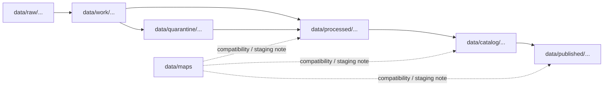

<!-- [KFM_META_BLOCK_V2]
doc_id: kfm://doc/data-maps-readme
title: data/maps/README.md — Maps Data Compatibility README
version: v0.1
type: readme; data-lifecycle-note; maps-compatibility-lane
status: draft; PROPOSED; COMPATIBILITY-LANE; data-root; maps; lifecycle-boundary; needs-verification
owners: OWNER_TBD — Data steward · Map steward · Catalog steward · Evidence steward · Policy steward · Release steward · Docs steward
created: NEEDS VERIFICATION — placeholder existed before v0.1 expansion
updated: 2026-06-25
policy_label: public-doc; data; maps; compatibility; lifecycle; governed
tags: [kfm, data, maps, map-products, tiles, layers, lifecycle, CATALOG, PUBLISHED, EvidenceBundle, SourceDescriptor, ReleaseManifest, MapLibre]
related:
  - ../README.md
  - ../../README.md
  - ../../docs/doctrine/directory-rules.md
  - ../../docs/doctrine/lifecycle-law.md
  - ../../docs/doctrine/trust-membrane.md
  - ../raw/
  - ../work/
  - ../quarantine/
  - ../processed/
  - ../catalog/
  - ../published/
  - ../proofs/
  - ../receipts/
  - ../registry/
  - ../../release/
  - ../../apps/
  - ../../packages/
notes:
  - "This file replaces a placeholder at `data/maps/README.md`."
  - "`data/maps/` is not yet verified as a canonical lifecycle root; treat it as a PROPOSED compatibility lane until an ADR, path map, or migration note decides the boundary."
  - "Public map artifacts belong under approved `data/published/...` lanes after release; catalog records belong under `data/catalog/...`; map runtime/UI belongs under implementation roots."
  - "Do not store RAW data, proofs, receipts, source registry records, release decisions, schemas, policy rules, published artifacts, or executable code here unless an accepted ADR/path map explicitly allows it."
  - "Rollback target for this replacement is previous placeholder blob SHA `e25f1814e51579d5f55c0f1fe0135ddb28a47f4a`."
[/KFM_META_BLOCK_V2] -->

<a id="top"></a>

# data/maps

> Compatibility README for map-related data under the `data/` lifecycle root. This path is PROPOSED and must not become a parallel public map, catalog, proof, release, schema, policy, or application authority.

<p>
  
  
  
  
  
</p>

**Status:** draft / PROPOSED / COMPATIBILITY-LANE  
**Path:** `data/maps/README.md`  
**Owning root:** `data/`  
**Canonical posture:** NEEDS VERIFICATION — `data/maps/` is not proven as a canonical lifecycle root in the inspected evidence  
**Exposure posture:** not public by default; public map exposure requires release linkage through governed `release/`, `data/catalog/`, and `data/published/` paths  
**Truth posture:** CONFIRMED target was a placeholder · CONFIRMED `data/` is the lifecycle data root · CONFIRMED Directory Rules say root folders encode responsibility and lifecycle · NEEDS VERIFICATION for whether this path should remain, redirect, or be migrated.

**Quick jumps:** [Purpose](#purpose) · [Lifecycle boundary](#lifecycle-boundary) · [Repo fit](#repo-fit) · [Accepted contents](#accepted-contents) · [Exclusions](#exclusions) · [Map-data handling](#map-data-handling) · [Guardrails](#guardrails) · [Evidence ledger](#evidence-ledger) · [Validation checklist](#validation-checklist) · [Rollback](#rollback)

---

## Purpose

`data/maps/` is a proposed compatibility lane for map-related data references while the repository decides whether map products should live here or be distributed across the canonical lifecycle roots.

This README exists to prevent the folder from becoming an accidental public map root. It does not authorize storing all map products here, and it does not replace `data/raw/`, `data/work/`, `data/quarantine/`, `data/processed/`, `data/catalog/`, `data/published/`, `data/proofs/`, `data/receipts/`, `data/registry/`, `release/`, or implementation roots.

## Lifecycle boundary

```text
RAW -> WORK / QUARANTINE -> PROCESSED -> CATALOG / TRIPLET -> PUBLISHED
```

Map-related material must follow the same lifecycle as every other KFM data family:



## Repo fit

| Responsibility | Correct home | Rule |
|---|---|---|
| Source-native spatial data | `data/raw/` | Store by source/domain/lifecycle policy. |
| Working map intermediates | `data/work/` | Not public; may need quarantine. |
| Sensitive or unresolved map candidates | `data/quarantine/` | Fail closed until reviewed. |
| Processed spatial artifacts | `data/processed/` | Upstream of catalog/release. |
| STAC/DCAT/PROV/domain catalog records | `data/catalog/` | Discovery and interchange records. |
| Public-safe released map artifacts | `data/published/` | Downstream after release. |
| Evidence/proof records | `data/proofs/` | EvidenceBundle and proof records. |
| Receipts | `data/receipts/` | RunReceipt, validation, transform, review, correction, and release receipts. |
| Source registry records | `data/registry/` | SourceDescriptor/source-admission records. |
| Release decisions | `release/` | Publication authority. |
| Map runtime/UI/API/code | `apps/`, `packages/`, other implementation roots | Not this lane. |
| Schemas and policy | `schemas/`, `policy/` | Separate roots. |
| `data/maps/` | PROPOSED compatibility lane | Do not add trust-bearing records here without accepted path decision. |

## Accepted contents

Until an ADR/path map confirms a stronger role, accepted contents are limited to:

- This README.
- Migration notes, inventories, or crosswalks explaining where map-related data currently lives and where it should move.
- Pointers to canonical lifecycle homes for raw source data, work products, quarantine, processed outputs, catalog records, proofs, receipts, source registry entries, published outputs, and releases.
- Small placeholder indexes that do not contain source content, proof content, sensitive data, release decisions, public map products, or executable behavior.

## Exclusions

- RAW spatial source files. Use `data/raw/`.
- WORK/intermediate map outputs. Use `data/work/` unless promoted by lifecycle rules.
- Quarantined or rights/sensitivity-unclear material. Use `data/quarantine/`.
- Processed tile/layer/vector/raster artifacts. Use `data/processed/` until cataloged/released.
- STAC, DCAT, PROV, or domain catalog records. Use `data/catalog/`.
- Public-safe released map products. Use `data/published/`.
- EvidenceBundle/proof records. Use `data/proofs/`.
- Receipts. Use `data/receipts/`.
- SourceDescriptor/source registry records. Use `data/registry/`.
- Release decisions. Use `release/`.
- Schemas, policies, validators, tests, packages, pipelines, app/UI/API code.

## Map-data handling

Map data can expose sensitive, rights-restricted, culturally sensitive, ecological, archaeological, infrastructure, or private information through geometry, tiles, attributes, joins, zoom levels, labels, popups, or derived layers.

Before any map-derived material becomes public, it should have source identity, rights posture, sensitivity review, transformation receipt, validation receipt, evidence reference where claims depend on evidence, catalog record, release state, correction path, and rollback target.

## Guardrails

- Do not use `data/maps/` as a convenience bucket.
- Do not publish directly from this path.
- Do not let public clients read this path as a normal map source.
- Do not store proofs, receipts, source descriptors, release decisions, schemas, policy rules, or implementation code here.
- Do not duplicate catalog records between this folder and `data/catalog/`.
- If this path is retained, document the decision in an ADR/path map and add migration/rollback notes.
- If this path is not retained, migrate any real contents into the correct lifecycle roots and restore this file to a redirect/alias note or remove the folder through governed migration.

## Evidence ledger

| Source | Status | Supports | Limits |
|---|---|---|---|
| Previous file | CONFIRMED | Target existed as a placeholder. | Did not define map-data boundaries. |
| `data/README.md` | CONFIRMED | `data/` is the lifecycle data root and excludes code, schemas, policy rules, and release decisions. | Does not confirm `data/maps/` as canonical. |
| `docs/doctrine/directory-rules.md` | CONFIRMED doctrine / PROPOSED path specifics | Root folders encode responsibility and data uses lifecycle phases. | Does not approve this specific folder as canonical. |
| Repository search | CONFIRMED weak signal | No strong current-session evidence established this path as canonical. | Search is not a complete filesystem inventory. |

## Validation checklist

- [ ] Confirm whether `data/maps/` should exist at all.
- [ ] Confirm whether this path should remain as compatibility, redirect, or be removed.
- [ ] Confirm no source files, proofs, receipts, release decisions, schemas, policy, published products, or implementation code are stored here.
- [ ] Confirm any map-derived data has a lifecycle home under RAW, WORK, QUARANTINE, PROCESSED, CATALOG/TRIPLET, or PUBLISHED.
- [ ] Confirm source, rights, sensitivity, validation, receipts, catalog, release, correction, and rollback linkage before any public exposure.

## Rollback

Rollback is required if this lane becomes a parallel public map root, source-data root, proof store, source-registry root, receipt store, catalog root, release-decision root, published-output root, schema root, policy root, validator root, implementation root, public API shortcut, or public exposure shortcut.

Rollback target for this replacement: previous placeholder blob SHA `e25f1814e51579d5f55c0f1fe0135ddb28a47f4a`.

<p align="right"><a href="#top">Back to top</a></p>
