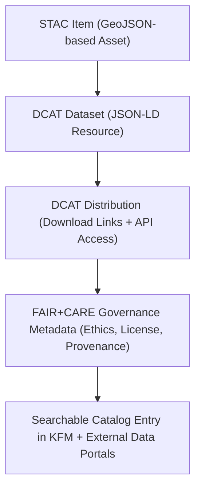

<div align="center">

# 📊 Kansas Frontier Matrix — **DCAT 3.0 Metadata Catalog**
`data/meta/README.md`

**Purpose:** Documents the **Data Catalog Vocabulary (DCAT 3.0)** layer of the Kansas Frontier Matrix (KFM) —  
a semantic bridge between **STAC geospatial catalogs** and **open dataset registries** for global data interoperability.

[](../../.github/workflows/dcat-export.yml)
[](../../.github/workflows/stac-validate.yml)
[](../../docs/standards/faircare-validation.md)
[](../../LICENSE)

</div>

---

## 📚 Overview

The `data/meta/` directory hosts **DCAT 3.0-compliant JSON-LD feeds** that describe every dataset published within KFM.  
These metadata files extend the **SpatioTemporal Asset Catalog (STAC)** system to support **FAIR-compliant, global dataset registries** and open-data search engines.

The DCAT metadata catalog enables:
- 🔗 **Interoperability** between STAC and national/international data portals (e.g., data.gov, GEO, EU INSPIRE).  
- 🧠 **FAIR+CARE compliance** through semantic linkage of provenance, license, and ethics metadata.  
- 🧩 **Ontology compatibility** with **CIDOC CRM** and **OWL-Time**, improving integration with historical and temporal reasoning models.  
- ⚙️ **Automated export workflows** from STAC items using the `dcat-export.yml` GitHub Action.

---

## 🗂️ Directory Layout

```plaintext
data/meta/
├── README.md                        # This file — DCAT metadata overview
│
├── hazards_dcat.jsonld              # DCAT feed for hazard datasets (tornado, flood, drought)
├── climate_dcat.jsonld              # DCAT feed for climate datasets (temperature, precipitation)
├── hydrology_dcat.jsonld            # DCAT feed for hydrology datasets (rivers, groundwater)
├── treaties_dcat.jsonld             # DCAT feed for historical treaty datasets (land cessions)
└── index_dcat_catalog.jsonld        # Unified DCAT catalog aggregating all feeds
```

Each file is validated under the **W3C DCAT 3.0 JSON-LD schema**, with provenance, license, and linkage metadata harmonized to KFM’s FAIR+CARE governance chain.

---

## 🔗 Relationship Between STAC and DCAT



| STAC Field | DCAT Equivalent | Purpose |
|-------------|----------------|----------|
| `id` | `dct:identifier` | Unique dataset ID |
| `geometry` | `dct:spatial` | Spatial footprint |
| `datetime` | `dct:temporal` | Temporal coverage |
| `assets[].href` | `dcat:distribution.dcat:accessURL` | Data access link |
| `license` | `dct:license` | Licensing information |
| `providers` | `dct:publisher` / `dct:creator` | Data origin attribution |
| `links[].href` | `dcat:relation` | Semantic relationships between datasets |
| `properties.faircare` | `dct:conformsTo` | FAIR+CARE governance metadata linkage |

---

## 🧠 FAIR+CARE Integration

Each DCAT record embeds ethical and governance metadata fields as **JSON-LD contexts**, ensuring compliance with FAIR+CARE principles.

| FAIR/CARE Field | Description | DCAT Mapping |
|-----------------|--------------|--------------|
| `fair:findable` | Dataset indexed in STAC/DCAT catalog | `dcat:dataset` |
| `fair:accessible` | Open download and API endpoints | `dcat:accessURL` |
| `fair:interoperable` | Crosswalk to STAC schema | `dcat:distribution.dct:format` |
| `fair:reusable` | License and citation | `dct:license`, `dct:bibliographicCitation` |
| `care:authority` | Ownership or governance organization | `dct:provenance` |
| `care:ethics` | Ethical approval or data sensitivity status | `dct:conformsTo` |
| `care:collectiveBenefit` | Social or environmental value statement | `dct:description` |

---

## ⚙️ Validation & Automation

**Workflow:** `.github/workflows/dcat-export.yml`  
**Purpose:** Automatically converts validated STAC Items → DCAT 3.0 JSON-LD files and publishes them to `data/meta/`.

| Validation Tool | Description | Output |
|------------------|--------------|--------|
| **PySTAC + stactools** | Converts STAC → JSON-LD metadata | `*_dcat.jsonld` |
| **JSON-LD Playground / W3C DCAT Schema** | Validates JSON-LD structure | `reports/validation/dcat_schema_report.json` |
| **FAIR+CARE Validator** | Ensures ethical and license metadata presence | `reports/fair/data_fair_summary.json` |

---

## 🔍 Provenance & Governance

Each DCAT record contains:
- `dct:provenance` — Link to provenance ledger (`reports/audit/data_provenance_ledger.json`)  
- `dct:license` — License metadata from source dataset  
- `dct:conformsTo` — References KFM governance policies (`docs/standards/faircare-validation.md`)  
- `dct:modified` — Timestamp of last update from STAC export  
- `dct:identifier` — Matches the STAC Item ID for bidirectional traceability  

Governance and versioning tracked via:
- `releases/v9.5.0/manifest.zip`  
- `releases/v9.5.0/sbom.spdx.json`  
- `releases/v9.5.0/focus-telemetry.json`  

---

## 🧩 Integration With External Portals

DCAT feeds can be harvested or federated with:
- 🌐 **Data.gov / CKAN** — via DCAT JSON-LD ingest endpoint  
- 🛰️ **OGC API Records** — for interoperable discovery alongside STAC  
- 🧭 **Focus Mode API** — KFM’s AI assistant can query DCAT records directly for metadata-driven reasoning  

These integrations are declared in the unified `index_dcat_catalog.jsonld`.

---

## 🧾 Maintenance & Review

| Task | Frequency | Responsible Team |
|------|------------|------------------|
| DCAT export regeneration | Weekly (cron) | @kfm-etl-ops |
| FAIR+CARE metadata review | Quarterly | @kfm-data-lab |
| Governance ledger audit | Quarterly | @kfm-architecture |
| External portal synchronization | Semi-Annual | @bartytime4life |

---

## 🧾 Version History

| Version | Date | Author | Summary |
|----------|------|---------|----------|
| v9.5.0 | 2025-10-30 | @kfm-data-lab | Added DCAT 3.0 catalog exports and governance crosswalk with STAC Items. |
| v9.3.2 | 2025-10-28 | @kfm-architecture | Created initial DCAT metadata integration design. |

---

<div align="center">

**Kansas Frontier Matrix** · *FAIR+CARE Data Catalog × DCAT 3.0 × Global Interoperability*  
[🔗 Repository](https://github.com/bartytime4life/Kansas-Frontier-Matrix) • [🧭 Docs Portal](../../docs/) • [⚖️ Governance Ledger](../../docs/standards/governance/)

</div>

